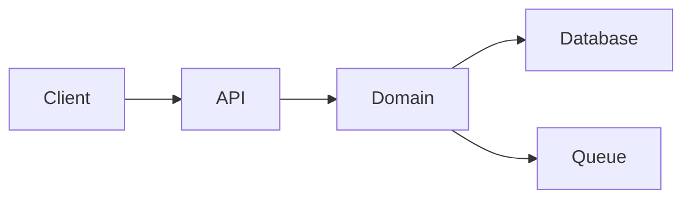

# Architecture and ADR authoring

You are making the technical design visible before implementation.

The architecture artifact explains **how the system should be shaped** to satisfy the spec. It should expose tradeoffs, boundaries, and decisions without becoming a low-level task list.

## Inputs to read

Read, if present:

- `AGENTS.md`
- `CONSTITUTION.md`
- feature spec and spec-review findings
- accepted proposal
- research artifacts
- `docs/project-map.md`
- related architecture docs and ADRs
- existing source interfaces, schemas, APIs, modules, CI, deployment config

## Output paths

Prefer:

```text
docs/architecture/YYYY-MM-DD-slug.md
docs/adr/YYYY-MM-DD-slug.md
```

Use ADRs for decisions that are long-lived, controversial, high-risk, or likely to be revisited.

## Required architecture sections

1. **Status**: draft, approved, abandoned, superseded, archived.
2. **Related artifacts**: proposal, spec, research, project map.
3. **Summary**: one-paragraph design direction.
4. **Requirements covered**: map requirement IDs to design areas.
5. **Current architecture context**: relevant existing components and constraints.
6. **Proposed architecture**: components, responsibilities, and boundaries.
7. **Data model and data flow**: storage, schemas, events, migrations, ownership.
8. **Control flow**: request, command, job, event, or UI flow.
9. **Interfaces and contracts**: APIs, public types, config, CLI, SDK, UI contracts.
10. **Failure modes**: retries, partial failures, rollback, timeouts, degraded mode.
11. **Security and privacy design**: auth, permissions, secrets, data exposure, auditability.
12. **Performance and scalability**: expected bottlenecks and limits.
13. **Observability**: logs, metrics, traces, alerts, debug surfaces.
14. **Compatibility and migration**: staged rollout, backfill, dual-write/read, downgrade.
15. **Alternatives considered**: at least two alternatives for significant changes.
16. **ADRs**: decisions made, rationale, consequences.
17. **Risks and mitigations**.
18. **Open questions** that must be resolved before plan.
19. **Next artifacts**: planned next steps while the design remains active current guidance.
20. **Follow-on artifacts**: actual downstream artifacts or terminal disposition. If present before any real follow-ons exist, say `None yet`.
21. **Readiness**: truthful next-stage or settled-state wording.

## Diagram guidance

Use Mermaid diagrams when helpful:



Keep diagrams small and accurate. Prefer multiple simple diagrams over one unreadable diagram.

## ADR format

Use:

```text
ADR-YYYYMMDD-slug: Title

## Status
draft | proposed | accepted | active | deprecated | superseded | archived | abandoned

## Context

## Decision

## Alternatives considered

## Consequences

## Follow-up
```

For this repository's current ADR contract:

- `draft` and `proposed` are active-work states.
- `accepted` and `active` are settlement states.
- `deprecated`, `superseded`, `archived`, and `abandoned` are terminal or closeout-oriented states.

## Rules

- Do not write an execution milestone list here; use `plan` after design review.
- Do not hide tradeoffs.
- Do not introduce architecture that the spec does not require.
- Do not change behavior in the architecture doc without updating the spec.
- Do not claim compatibility, rollback, or performance safety without explaining the mechanism.
- Do not use `reviewed` as a durable architecture status. Once the design is relied on, normalize the tracked artifact to `approved` or the appropriate terminal state.
- Preserve `Next artifacts` as planning history. Use `Follow-on artifacts` for actual downstream artifacts, replacement, or terminal closeout.
- If an architecture document is superseded, identify the replacement with `superseded_by` or equivalent labeled text.

## Expected output

- architecture doc path and ADR paths;
- requirement-to-design mapping;
- diagrams when useful;
- alternatives and decisions;
- risks, migrations, and observability;
- readiness statement for `architecture-review` or `plan`.
