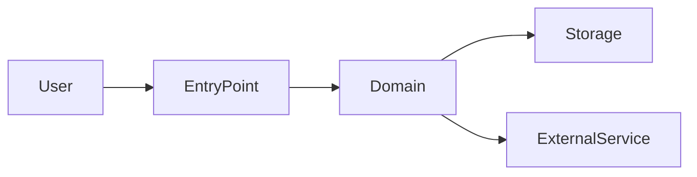

# Project map

You are creating architecture visibility for humans and agents before detailed design or implementation.

This skill is for orientation. It should describe what exists today, not invent a future design.

## When to use

Use when:

- the user says architecture is unclear;
- a change crosses modules or services;
- the repo is brownfield and the agent lacks context;
- tests or CI are hard to locate;
- ownership, boundaries, or runtime flow are ambiguous;
- before `architecture` for a high-risk change.

## Inputs to read

Read, if present:

- `README.md`
- `AGENTS.md`
- `.codex/CONSTITUTION.md`
- `docs/`
- `specs/`
- package/build files
- source tree structure
- test tree structure
- CI workflows
- deployment or infrastructure files
- module boundaries, public interfaces, API routes, data models, schemas, migrations

Inspect actual files, not just names, when drawing conclusions.

## Output path

Prefer:

```text
docs/project-map.md
```

For a narrower area, use:

```text
docs/project-map/<area>.md
```

## Required sections

1. **Purpose and scope**: what this map covers and what it does not cover.
2. **System overview**: major modules, packages, services, or apps.
3. **Repository layout**: important directories and their responsibilities.
4. **Runtime flow**: entry points, request/event/job flow, background work.
5. **Data flow**: main entities, storage, schemas, serialization boundaries.
6. **External boundaries**: APIs, SDKs, third-party services, platform dependencies.
7. **Test map**: where unit, integration, end-to-end, smoke, and fixture tests live.
8. **CI/release map**: relevant workflows and verification commands.
9. **Architecture rules observed**: patterns the code already follows.
10. **Risk areas**: coupling, unclear ownership, missing tests, fragile boundaries.
11. **Open questions**: things the map could not determine confidently.

## Diagrams

Use Mermaid when it helps. Prefer simple diagrams:



Do not create decorative diagrams. Every node should help someone implement or review safely.

## Rules

- Separate observed facts from inferences.
- Cite file paths for important claims.
- Do not propose implementation changes unless asked; record opportunities under risk areas.
- Do not overfit the map to the current requested feature.
- Keep the map stable enough for future work.

## Expected output

- created or updated project map path;
- concise architecture overview;
- key boundaries and flows;
- test and CI orientation;
- risks and open questions;
- recommended next skill, usually `explore`, `proposal`, or `architecture`.
