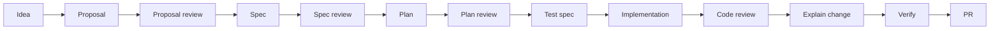

# RigorLoop

<!-- vision:start -->
RigorLoop is a Git-first lifecycle workflow for AI coding agents. It turns AI work into traceable, resumable artifacts so humans can review, trust, and continue what the AI did.

What makes it different: AI coding agents produce output quickly, but the reasoning often disappears. RigorLoop keeps decisions, tests, reviews, validation evidence, and handoff state in durable repository artifacts instead of lost chat logs.

Who it is for: RigorLoop is for individual contributors, maintainers, and teams that want AI-assisted software work to remain traceable, resumable, and reviewable in Git.

See [VISION.md](VISION.md) for goals, non-goals, and falsifiability.
<!-- vision:end -->

RigorLoop makes AI-assisted delivery inspectable after the chat ends. The chain
runs from proposal to spec, plan, test spec, implementation, review,
verification, and PR handoff.

It is for contributors and maintainers who want AI agents to help with serious
software work without losing the reasoning, proof, and review trail that make a
change safe to continue.

## Quick Start

Try the CLI without installing anything:

```bash
npx @xiongxianfei/rigorloop@latest --help
```

Install support for the agent you actually use:

```bash
npx @xiongxianfei/rigorloop@latest init codex
```

Use `init claude` for Claude Code or `init opencode` for opencode.

Pin the package version anywhere reproducibility matters:

```bash
npx @xiongxianfei/rigorloop@0.3.3 init codex
```

For a project-local dev dependency, install once and run through `npx`:

```bash
npm install --save-dev @xiongxianfei/rigorloop
npx rigorloop --help
```

Recommended first pass:

1. Run `init` for one agent adapter.
2. Read the [short workflow summary](docs/workflows.md).
3. Inspect the [shipped proof-of-value example](docs/changes/0001-skill-validator/).
4. Start your first real change with `proposal`.
5. Move through review gates only when the durable artifacts are current.

Read the [normative workflow contract](specs/rigorloop-workflow.md) when you need to customize the lifecycle or resolve a process question.

Key paths: [workflow](docs/workflows.md) · [proof example](docs/changes/0001-skill-validator/) · [contribute](CONTRIBUTING.md) · [bug report](.github/ISSUE_TEMPLATE/bug.yml) · [feature request](.github/ISSUE_TEMPLATE/feature.yml) · [security](SECURITY.md)

## Recommended Use

Use RigorLoop as a repository-local workflow, not as a chat convention. The useful path is:

```text
proposal -> proposal-review -> spec -> spec-review -> plan -> plan-review -> test-spec -> implement -> code-review -> explain-change -> verify -> pr
```

Add `architecture` / `architecture-review` when the change affects system design, data flow, persistence, security, performance, deployment, or other hard-to-reverse decisions.

Add `review-resolution` when review records material findings. Add `ci-maintenance` only when CI workflows or related automation must change.

Best practices:

1. Start with `proposal` for substantive work. Use it to settle the problem, goals, non-goals, scope, options, risks, and recommended direction before implementation pressure starts.
2. Keep each lifecycle stage grounded in tracked artifacts. Do not rely on chat-only approval when a later stage needs reviewable evidence.
3. Let `test-spec` map requirements and edge cases to proof before writing implementation code.
4. Implement one approved milestone at a time, then run `code-review` against the actual diff and governing artifacts.
5. Use `explain-change` after implementation and review closeout so reviewers can see why each meaningful change exists.
6. Run `verify` before `pr`. `verify` owns branch readiness; `pr` owns the pull request body and opening the PR.

For smaller focused tasks, you can invoke an individual skill directly. Treat that as isolated output unless you intentionally route the work through the full workflow.

## Starting a new repository

Use `init` to install agent support. It does not replace the standing guide artifacts that make a repository understandable.

For a new repository, use this order:

1. Install the adapter for your agent: `init codex`, `init claude`, or `init opencode`.
2. Bootstrap standing repository guidance:
   - `vision` creates or updates `VISION.md` for project direction and fit checks.
   - `constitution` creates or updates `CONSTITUTION.md` for source-of-truth and governance rules.
   - `project-map` creates or updates `docs/project-map.md` when repository orientation is needed.
   - `workflow` creates or refreshes `docs/workflows.md` for the project-local workflow and artifact-location map.
   - `docs/plan.md` starts as the small active/blocked/recent-work index.
3. Start the first real change with the per-change lifecycle described above.

For an existing repository, do the same bootstrap only for missing or stale standing guidance. Do not rewrite durable guides just for symmetry.

## Where to go next

| Need | Read |
| --- | --- |
| Understand project direction | [VISION.md](VISION.md) |
| Understand governance and source-of-truth order | [CONSTITUTION.md](CONSTITUTION.md) |
| Find workflow stages and artifact paths | [docs/workflows.md](docs/workflows.md) |
| Orient to repository structure | [docs/project-map.md](docs/project-map.md) |
| See active, blocked, and recent work | [docs/plan.md](docs/plan.md) |
| Use one lifecycle stage | [skills/](skills/) |

## Workflow At A Glance



This is the recommended full chain for complete AI-assisted delivery. Individual
skills can also be used in isolation when the project does not need the full
lifecycle.

## Proposal-Gated Automatic Workflow

For substantive workflow-managed work, the recommended automation boundary is the proposal gate. Review and improve the proposal manually first; then let the workflow continue through deterministic authoring and review stages only after the formal proposal review is clean.

Use this sequence:

1. Draft the proposal with `proposal`.
2. Human-review the proposal for problem fit, scope, tradeoffs, risks, and intended outcome.
3. Revise the proposal until it is the version you want judged.
4. Run `proposal-review`.
5. If proposal review records findings, pause and resolve them manually.
6. After an accepted proposal and clean recorded proposal review, resume the workflow:

   ```text
   workflow auto-through: plan-review
   ```

`auto-through: plan-review` maps to the bounded `authoring-through-plan-review` profile. In workflow-managed context it may run `spec`, `spec-review`, architecture assessment, conditional `architecture` and `architecture-review`, `plan`, and `plan-review`; then it stops. It reports `test-spec` as the next stage but does not start test-spec, implementation, verification, PR, release, deploy, merge, or automatic review-fix loops.

The profile is off by default. Direct review requests such as `spec-review` or `plan-review` remain isolated unless you explicitly resume the workflow-managed change with the profile armed.

## Worked Example

A RigorLoop change leaves a traceable artifact chain:

| Stage | Example artifact |
| --- | --- |
| Proposal | `docs/proposals/<change>.md` |
| Spec | `specs/<slug>.md` |
| Plan | `docs/plans/<change>.md` |
| Test spec | `specs/<slug>.test.md` |
| Review records | `docs/changes/<change>/reviews/` |
| Validation evidence | `docs/changes/<change>/change.yaml` |
| Explain change | `docs/changes/<change>/explain-change.md` |
| PR handoff | linked from change records or release notes |

For a concrete repository example, inspect the shipped proof-of-value pack:
[docs/changes/0001-skill-validator/](docs/changes/0001-skill-validator/).

## When to use / When not to use

Use RigorLoop when:

- you want AI-assisted work to stay reviewable, traceable, and grounded in explicit proposals, specs, plans, tests, and verification
- you need a repository-local workflow that leaves durable change history instead of burying decisions in chat
- you want a workflow that makes the path from idea to reviewed change visible and auditable

Do not use RigorLoop when:

- you want agents to bypass pull requests, CI, or human review
- you need a hosted orchestration platform or centralized control plane
- you want a zero-process scratchpad with no explicit artifacts or review gates

## Why RigorLoop Is Built This Way

- **Reviewable artifacts.** Important decisions become files in your repository,
  not lost chat logs.
- **Human-understandable AI work.** Reviewers can see what changed, why it
  changed, and what evidence supports it.
- **Resumable across sessions and agents.** Work can continue because state
  lives in Git, not one model session.
- **Traceable from idea to PR.** A change has a visible chain from proposal to
  verification and handoff.
- **Durable lessons.** Mistakes become reusable guidance and checks, improving
  reliability over time.

## npm Usage

The npm package is:

```text
@xiongxianfei/rigorloop
```

It exposes one binary:

```text
rigorloop
```

### Run directly with `npx`

You do not need to install RigorLoop before trying it:

```bash
npx @xiongxianfei/rigorloop@latest --help
npx @xiongxianfei/rigorloop@latest version
npx @xiongxianfei/rigorloop@latest init codex
npx @xiongxianfei/rigorloop@latest init codex --dry-run --json
```

Use `@latest` for quick manual trials. Use a pinned version for automation, CI, onboarding docs, and repeatable agent setup:

```bash
npx @xiongxianfei/rigorloop@0.3.3 init codex --json
```

### Run after project-local install

```bash
npm install --save-dev @xiongxianfei/rigorloop
npx rigorloop --help
npx rigorloop init codex
```

### Run after global install

```bash
npm install --global @xiongxianfei/rigorloop
rigorloop --help
rigorloop init codex
```

The first public npm package supports:

- `rigorloop --help`
- `rigorloop version`
- `rigorloop init codex|claude|opencode [--write-state] [--dry-run] [--json]`
- `rigorloop new-change <change-id> --title <title> [--dry-run] [--json]`

`init codex` installs verified Codex support into `.agents/skills/`. The CLI uses package-bundled official metadata, downloads the official GitHub release archive, verifies archive SHA-256 and installed tree hash, and leaves `rigorloop.yaml` / `rigorloop.lock` untouched unless `--write-state` is requested.

`new-change` scaffolds `docs/changes/<change-id>/change.yaml` for a new RigorLoop change. It does not replace proposal, spec, review, verification, or PR judgment.

The npm package is a delivery channel for the CLI. It is not the canonical source for workflow rules, skills, schemas, templates, or adapter archives. Canonical source remains in this repository, and adapter archives remain verified GitHub release artifacts.

## Vision and README Ownership

`VISION.md` is the canonical project-vision artifact. Proposals created or substantively revised after this spec is adopted include `Vision fit`.

README content between `<!-- vision:start -->` and `<!-- vision:end -->` is generated from `VISION.md`. README front-matter is not the source of truth when it conflicts with `VISION.md`.

## Adapter Packages

RigorLoop ships generated adapter packages for Codex, Claude Code, and opencode as GitHub release archives. The active install contract is in `dist/adapters/README.md`.

| Tool | Archive pattern | Skill directory |
| --- | --- | --- |
| Codex | `rigorloop-adapter-codex-<version>.zip` | `.agents/skills/` |
| Claude Code | `rigorloop-adapter-claude-<version>.zip` | `.claude/skills/` |
| opencode | `rigorloop-adapter-opencode-<version>.zip` | `.opencode/skills/` |

The current support matrix is tracked in `dist/adapters/manifest.yaml`; it records adapter support and generated opencode command aliases under `command_aliases.opencode`.

`skills/` is the only authored skill source. `.codex/skills/` is ignored local Codex runtime state; keep it untracked if you copy installed Codex adapter skills there for local runtime use.

For `v0.1.3` and later, generated public adapter skill bodies are release archives, not tracked source under `dist/adapters/`. Historical note: `v0.1.2` kept repository-tree adapter packages during the compatibility window while introducing release archives.

Adapter compatibility claims are versioned. If external tool contracts change, update the affected adapter contract through the RigorLoop lifecycle before changing release claims.

Ordinary contributors do not need all supported tools installed locally to run non-smoke validation. Maintainer smoke for Codex, Claude Code, and opencode is recorded in `docs/releases/<version>/release.yaml` before a stable release.

### Using Adapter Skills

Claude Code uses native skill slash commands after the Claude adapter is installed. TUI examples:

```text
/proposal Evaluate whether this change should be specified.
/spec Define the observable behavior for this change.
/implement Build the approved milestone with tests first.
/code-review Review the current diff against the approved artifacts.
/pr Prepare the verified change for pull request review.
```

OpenCode uses generated command aliases for the curated lifecycle stages. All included portable skills remain reusable under `.opencode/skills/`; thin command aliases live under `.opencode/commands/`. TUI examples:

```text
/proposal Evaluate whether this change should be specified.
/spec Define the observable behavior for this change.
/implement Build the approved milestone with tests first.
/code-review Review the current diff against the approved artifacts.
/pr Prepare the verified change for pull request review.
```

OpenCode command aliases are generated only for `proposal`, `proposal-review`, `spec`, `spec-review`, `plan`, `plan-review`, `test-spec`, `implement`, `code-review`, and `pr`. Other portable skills remain available as skills but do not receive command aliases.

OpenCode one-shot example:

```text
opencode run --command proposal "Draft a proposal for the requested change."
```

Do not use Codex `$skill` syntax for Claude Code or OpenCode. Claude Code one-shot CLI examples are intentionally omitted because no Claude one-shot form has been smoke-tested for this release.

## Learn More / Contribute

- Workflow detail: [docs/workflows.md](docs/workflows.md) and [specs/rigorloop-workflow.md](specs/rigorloop-workflow.md)
- Artifact and skill docs: [specs/README.md](specs/README.md) and [skills/](skills/)
- Report problems or feature ideas: [bug report template](.github/ISSUE_TEMPLATE/bug.yml) and [feature request template](.github/ISSUE_TEMPLATE/feature.yml)
- Review PR expectations before contributing: [.github/pull_request_template.md](.github/pull_request_template.md)
- Contribution guide: [CONTRIBUTING.md](CONTRIBUTING.md)
- Security policy: [SECURITY.md](SECURITY.md)

## Workflow Categories

RigorLoop recommends one standard workflow for complete AI-assisted delivery:

- Standing artifacts: `VISION.md` and `CONSTITUTION.md`
- Living references: `docs/project-map.md` when repository shape is not obvious enough for safe reliance
- Workflow infrastructure: specs, workflow summaries, affected root guidance, affected skills, and generated outputs
- On-demand support: `explore` and `research`
- Per-change chain: `proposal -> proposal-review -> spec -> spec-review -> architecture -> architecture-review -> plan -> plan-review -> test-spec -> implement -> code-review -> review-resolution when triggered -> ci-maintenance when triggered -> explain-change -> verify -> pr`
- Periodic learning: `learn`

`explore` and `research` run only when ambiguity, options, or current external facts matter. `learn` is periodic or explicitly invoked, not a final stage for every change. `ci-maintenance` means updating hosted workflow automation or related CI infrastructure; validation execution belongs to `verify`.

Do not rely on `docs/project-map.md` when it is absent, stale, contradicted, or missing the relied-on area; refresh it or record a no-map rationale first.

Users may manually invoke individual skills for focused output. A manual skill invocation is isolated by default and does not imply that the full workflow is complete.

The normative contract lives in [specs/rigorloop-workflow.md](specs/rigorloop-workflow.md). The short operational summary lives in [docs/workflows.md](docs/workflows.md).

## What This Repository Contains

- one recommended standard workflow for complete AI-assisted delivery
- isolated manual skill invocation for focused skill output
- standing artifacts, living references, on-demand support, a per-change chain, and periodic learning as distinct lifecycle categories
- a repository orientation map at `docs/project-map.md`
- canonical workflow sources in `docs/`, `specs/`, `skills/`, `schemas/`, and `scripts/`
- ignored local Codex runtime state in `.codex/skills/`
- generated public adapter packages in `dist/adapters/`
- a change-local artifact pattern under `docs/changes/<change-id>/` for the shipped example and later non-trivial work

## Change-Local Artifact Packs

- Manual skill invocations may omit `docs/changes/<change-id>/` when they are not used to claim complete workflow delivery.
- Ordinary non-trivial work uses the baseline pack: `docs/changes/<change-id>/change.yaml` plus `docs/changes/<change-id>/explain-change.md`.
- `review-resolution.md` and `verify-report.md` stay conditional and are added only when their governing workflow triggers apply.
- Approved legacy top-level explain artifacts under `docs/explain/` remain valid until migrated or retired.
- `docs/changes/0001-skill-validator/` is a rich reference example, not the minimum required pack for every non-trivial change.

## Source Of Truth

- Edit canonical workflow content in:
  - `docs/`
  - `specs/`
  - `skills/`
  - `schemas/`
  - `scripts/`
- Do not hand-edit generated public adapter packages. Use `dist/adapters/README.md` for public adapter installation.
- `skills/` is the only authored skill source. `.codex/skills/` is ignored local Codex runtime state; keep it untracked when copying installed Codex adapter skills there for local runtime use, and edit canonical skills under `skills/`.
- `dist/adapters/README.md` and `dist/adapters/manifest.yaml` are the tracked adapter support surface.
- Public-surface token-cost benchmarks must identify generated public adapter output or release archive output, not repository-local `.codex/skills/`.
- Execution plans follow:
  - `docs/examples/plans/example-plan.md`

## Validation Commands

Before PR, run the same structural checks that CI runs:

- `python scripts/validate-skills.py`
- `python scripts/test-skill-validator.py`
- `python scripts/build-skills.py --check`
- `python scripts/test-adapter-distribution.py`
- `python scripts/build-adapters.py --version v0.1.3 --output-dir <release-output-dir>`
- `python scripts/validate-adapters.py --root <release-output-dir> --version v0.1.3`

Use `bash scripts/ci.sh` to run the same checks through the repository-owned CI wrapper.

## Repository Layout

```text
.
├── AGENTS.md
├── .github/
│   ├── ISSUE_TEMPLATE/
│   ├── pull_request_template.md
│   └── workflows/
├── docs/
│   ├── plan.md
│   ├── project-map.md
│   ├── proposals/
│   ├── roadmap.md
│   ├── workflows.md
│   ├── changes/
│   │   └── 0001-skill-validator/
│   ├── examples/
│   │   └── plans/
│   │       └── example-plan.md
│   ├── plans/
│   ├── architecture/
│   └── adr/
├── .codex/
│   └── skills/
├── dist/
│   └── adapters/
├── scripts/
├── skills/
├── schemas/
└── specs/
```

The first shipped change-local artifact pack is `docs/changes/0001-skill-validator/`, and it should be read as a rich example rather than the universal minimum pack for every non-trivial change.

## License

This repository currently ships with the MIT license.
