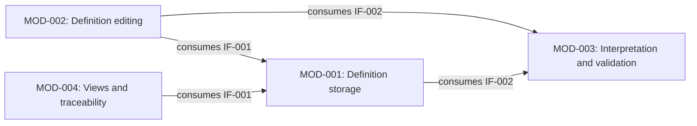
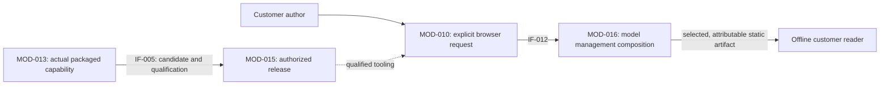

# Architecture Design

This is proposed target architecture for the REM refactor. [Architecture Design](../../rem/methods/architecture-design.md) covers logical responsibilities and material physical/software realization; [Architecture Allocation](../../rem/methods/architecture-allocation.md) develops its logical assignments.
The [REM architecture model](../../rem/models/architecture-design.md) owns the reusable semantics; the [application profile](../support/README.md) defines the record shapes.
Each Module or Interface has a descriptive owner directory containing its logical JSON and optional `realization/` facets. Child Modules live in their parent's `modules/` collection; containment defines parentage once. The [4+1 views](views/README.md) derive Logical, Process, Development, Physical, and Scenario perspectives from those authoritative records.
Existing [System and runtime contracts](../../docs/design/system.md) retain their authority. Draft logical Modules are distinguished from attributed implementation observations and proposed realization choices.

## Scope and approach

The responsibility map covers 69 of 73 Functions through 15 accountable child Modules within four broader parent Modules: 19 draft Modules overall. Parent summaries derive descendant allocations without assigning them again.
The detailed first example covers the six IR-001 Scenarios, its five SRs, and the shared SR-012 interpretation responsibility from IR-005: ten ARs and two Interfaces.
The [published-product extension](../requirements/published-products.md) added six Modules and four Interfaces for command execution, operational records, guided activities, candidate packaging, installation, and release coordination. Four [parent-boundary contracts](views/browser/index.html#scenarios) now add engineering-state inspection, adopted model-authoring guidance, applicable action authority, and evidence-support assessment. The current architecture has twelve Interfaces, including the workflow extension IF-011 and browser composition IF-012.
IR-008 has 18 ARs beneath its eight SRs. The [CLI cooperation view](views/browser/index.html#cooperation) derives their contribution to its nine Scenarios from MOD-010/MOD-011 and IF-003/IF-004. The workflow extension adds 14 ARs under IR-009, bringing the total to 42.
Those four owners also contain the first realization facets, projected into the [Process](views/browser/index.html#process), [Development](views/browser/index.html#development), and [Physical](views/browser/index.html#physical) views. The [Scenario view](views/browser/index.html#scenarios) connects SCN-019, SCN-046, SCN-047, SCN-053, and SCN-066 to obligations, behavior, and explicitly selected contracts. The original 14 CLI facets retain their source mappings, shared process/package, storage, concrete bindings, and technology choices. MOD-012's software facet catalogs public skill entries; IF-004's interaction facet catalogs public commands. MOD-013, MOD-014, and IF-006 add bounded product production, candidate placement, and installation observations. The [shared browser](views/browser/index.html) discovers applicable facets from the validated model. Observed names and implementation facts remain distinct from proposed logical correspondence and unperformed build or platform qualification.

Development's [Test architecture](views/browser/index.html#development/testing) shows nine source-observed groups assessing CLI, record persistence, package production and installation. Their software facets retain coverage contracts, boundaries, fixtures, execution dependencies and prerequisites separately from implementation mappings. Shared execution tooling retains its Validation contract owner; its REM Module allocation remains an explicit gap, and test existence supplies no passing evidence.

The Scenario view begins with stakeholder outcomes. Its [publication](views/browser/index.html#scenario/SCN-046) and [recovery](views/browser/index.html#scenario/SCN-047) pilots select relevant existing criteria and architecture details for each expected, alternative and failure outcome. Exact accountability, Interface provider context and source qualifications remain visible. The other selected Scenarios retain their outcomes and broad traceability while detailed selections remain undeveloped; related tests provide context until an outcome-specific coverage argument and applicable evidence are established.
The added contracts define bounded cooperation. Baseline retention and change-authorization mechanics, specialist guidance outside adopted model authoring, further release cooperation, and detailed ARs remain explicitly limited in the owning definitions.
This distinction permits a whole-system map without claiming that every interaction or obligation has already been designed.

The work proceeds through whole-system responsibility grouping, the IR-001 walkthrough, Interface and AR derivation, independent semantic review, and focused structural checks.
Review checks the composed SR outcomes as well as individual allocations. Schemas and cross-file checks protect record shape, identity, naming, containment, and references; they cannot prove architectural adequacy or runtime behavior.
The [source basis](../requirements/sources.md#src-architecture-pilot) records the selected choices and their limits.

## Responsibility map

| Parent responsibility | Child Modules | Scope |
| --- | --- | --- |
| [MOD-016 — Project model](modules/MOD-016-engineering-model-management/module.json) | MOD-001–004 | Coherent engineering definitions, authoring, conformance, and context |
| [MOD-017 — Change and quality control](modules/MOD-017-engineering-governance/module.json) | MOD-005–009 | Controlled engineering evolution, assurance, semantic authoring guidance, and learning |
| [MOD-018 — Skills and commands](modules/MOD-018-engineering-operations/module.json) | MOD-010–012 | Explicit command access, operational records, and published capability invocation guidance |
| [MOD-019 — Packaging and distribution](modules/MOD-019-product-delivery/module.json) | MOD-013–015 | Candidate production, verified installation, and coordinated release |

Each parent owns the broader responsibility described in its definition. The current Functions and ARs keep their existing child owners. The [Logical browser](views/browser/index.html) starts with these four parents and links to focused child and Interface pages. State authority and unique descendant allocations remain available on each Module; their detail pages retain complete inventories and provenance.

Interfaces form the collaboration graph across this containment tree. MOD-018 provides IF-004 as the accountable public command contract owner; MOD-010 supplies its command admission, dispatch, presentation, and receipt behavior, with MOD-011 retaining record publication and recovery. MOD-019 provides IF-006 as the accountable installation contract owner; MOD-014 retains the allocated installation behavior. MOD-012 consumes IF-004 and MOD-010 consumes IF-006. These parent-owned contracts need no descendant exposure. IF-001/002/003/005 remain internal to their parent boundaries with their existing providers. Further cross-group interactions require explicit design; parent grouping does not establish them.

MOD-016 provides IF-007 to MOD-005 for selected-state content and interpretation; MOD-005 retains Baseline identity, membership, and actual retention confirmation. MOD-017 provides IF-008 to MOD-012 for adopted model-authoring guidance, and IF-009/IF-010 to MOD-015 for action authority and evidence support. MOD-008, MOD-006, and MOD-007 retain their respective contributing behavior; MOD-015 retains exact-candidate qualification, sealing, publication, and outcome reporting. These contracts preserve all existing Function and AR allocations.

The following table shows direct child allocations only.

<!-- responsibility-map:start -->

| Module | Responsibility | Accountable Functions | Detailed design boundary |
| --- | --- | --- | --- |
| [MOD-001](modules/MOD-016-engineering-model-management/modules/MOD-001-engineering-model-storage/module.json) | Definition storage | [FUNC-001](../system/functions/FUNC-001-retain-engineering-definition.json), [FUNC-003](../system/functions/FUNC-003-resolve-engineering-entity-by-stable-id.json), [FUNC-004](../system/functions/FUNC-004-retrieve-engineering-definition-from-selected-model-state.json), [FUNC-006](../system/functions/FUNC-006-retain-applicable-decision-rationale.json) | IR-001 storage and IF-007 content contribution |
| [MOD-002](modules/MOD-016-engineering-model-management/modules/MOD-002-engineering-model-authoring/module.json) | Definition editing | [FUNC-005](../system/functions/FUNC-005-revise-engineering-entity-while-preserving-identity.json), [FUNC-008](../system/functions/FUNC-008-author-typed-engineering-relationships.json) | IR-001 and shared interpretation pilot |
| [MOD-003](modules/MOD-016-engineering-model-management/modules/MOD-003-engineering-model-conformance/module.json) | Interpretation and validation | [FUNC-002](../system/functions/FUNC-002-check-entity-identity-presence-and-uniqueness.json), [FUNC-012](../system/functions/FUNC-012-interpret-a-model-with-its-declared-metamodel.json), [FUNC-013](../system/functions/FUNC-013-diagnose-model-conformance-against-declared-rules.json), [FUNC-014](../system/functions/FUNC-014-prepare-a-model-migration-candidate.json) | Interpretation pilot and IF-007 interpretation contribution |
| [MOD-004](modules/MOD-016-engineering-model-management/modules/MOD-004-engineering-context-and-traceability/module.json) | Views and traceability | [FUNC-007](../system/functions/FUNC-007-present-current-engineering-definition-and-applicable-rationale.json), [FUNC-009](../system/functions/FUNC-009-traverse-selected-engineering-relationships.json), [FUNC-010](../system/functions/FUNC-010-assess-declared-architectural-allocation-consistency.json), [FUNC-011](../system/functions/FUNC-011-report-possible-change-impact.json) | IR-001 and shared interpretation pilot |
| [MOD-005](modules/MOD-017-engineering-governance/modules/MOD-005-engineering-baseline-management/module.json) | Model baselines | [FUNC-020](../system/functions/FUNC-020-establish-and-inspect-retained-engineering-baselines.json), [FUNC-021](../system/functions/FUNC-021-compare-selected-retained-engineering-states.json), [FUNC-022](../system/functions/FUNC-022-recover-the-recorded-content-of-a-retained-baseline.json) | IF-007 consumer; retention/change-control cooperation and ARs remain incomplete |
| [MOD-006](modules/MOD-017-engineering-governance/modules/MOD-006-engineering-change-control/module.json) | Change control | [FUNC-023](../system/functions/FUNC-023-record-controlled-change-transitions-and-provenance.json), [FUNC-024](../system/functions/FUNC-024-assess-and-apply-retirement-of-current-view-material.json), [FUNC-025](../system/functions/FUNC-025-retain-and-retrieve-activity-specific-change-context.json), [FUNC-026](../system/functions/FUNC-026-determine-applicable-authority-before-governed-actions.json), [FUNC-078](../system/functions/FUNC-078-prepare-and-reconcile-workflow-adoption.json) | IF-009 authority and IF-011 work/adoption contributions; selected workflow ARs, wider governance allocation deferred |
| [MOD-007](modules/MOD-017-engineering-governance/modules/MOD-007-engineering-verification-and-assurance/module.json) | Review and verification | [FUNC-027](../system/functions/FUNC-027-retain-criterion-based-verification-definitions.json), [FUNC-028](../system/functions/FUNC-028-retain-actual-verification-observations-and-provenance.json), [FUNC-029](../system/functions/FUNC-029-assess-evidence-applicability-to-a-declared-claim.json), [FUNC-030](../system/functions/FUNC-030-expose-claim-criterion-coverage-and-contradictory-evidence.json), [FUNC-031](../system/functions/FUNC-031-record-scoped-engineering-judgments-and-their-basis.json) | IF-010 evidence support for workflow and release; selected assessment ARs, wider assurance allocation deferred |
| [MOD-008](modules/MOD-017-engineering-governance/modules/MOD-008-engineering-authoring-guidance/module.json) | Authoring guidance | [FUNC-032](../system/functions/FUNC-032-select-canonical-guidance-for-an-authoring-activity.json), [FUNC-033](../system/functions/FUNC-033-explain-engineering-authoring-and-correction-steps.json), [FUNC-034](../system/functions/FUNC-034-assess-authoring-guidance-against-prepared-task-outcomes.json) | IF-008 canonical authoring guidance; selected workflow method ARs |
| [MOD-009](modules/MOD-017-engineering-governance/modules/MOD-009-engineering-learning/module.json) | Lessons and improvement | [FUNC-035](../system/functions/FUNC-035-characterize-a-reusable-lesson-from-an-engineering-finding.json), [FUNC-036](../system/functions/FUNC-036-select-lessons-applicable-to-planned-engineering-work.json), [FUNC-037](../system/functions/FUNC-037-formulate-an-accountable-engineering-improvement-proposal.json), [FUNC-038](../system/functions/FUNC-038-assess-observed-effects-of-an-adopted-engineering-improvement.json) | Interfaces and ARs deferred |
| [MOD-010](modules/MOD-018-engineering-operations/modules/MOD-010-engineering-command-interface/module.json) | Command handling | [FUNC-040](../system/functions/FUNC-040-admit-explicit-requests-under-declared-command-contracts.json), [FUNC-041](../system/functions/FUNC-041-discover-current-recorded-changes-without-selecting-authority.json), [FUNC-042](../system/functions/FUNC-042-read-explicitly-selected-engineering-records.json), [FUNC-048](../system/functions/FUNC-048-project-bounded-command-results-without-changing-meaning.json), [FUNC-049](../system/functions/FUNC-049-retain-and-inspect-private-invocation-diagnostics.json) | IR-008 CLI allocation and interaction walkthrough |
| [MOD-011](modules/MOD-018-engineering-operations/modules/MOD-011-operational-record-persistence/module.json) | Work record storage | [FUNC-043](../system/functions/FUNC-043-inspect-identities-and-content-of-selected-engineering-subjects.json), [FUNC-044](../system/functions/FUNC-044-validate-registered-recording-candidates-and-preservation-rules.json), [FUNC-045](../system/functions/FUNC-045-construct-lossless-candidates-from-explicit-record-edits.json), [FUNC-046](../system/functions/FUNC-046-publish-fresh-record-candidates-as-coherent-transactions.json), [FUNC-047](../system/functions/FUNC-047-recover-exact-interrupted-record-transactions.json) | IR-008 CLI allocation and selected workflow-record preservation AR; successor semantic schema defined in the Module-owned contract |
| [MOD-012](modules/MOD-018-engineering-operations/modules/MOD-012-published-engineering-capability-guidance/module.json) | Skill procedures | [FUNC-050](../system/functions/FUNC-050-identify-a-suitable-published-engineering-capability.json), [FUNC-051](../system/functions/FUNC-051-prepare-a-portable-or-governed-capability-invocation.json), [FUNC-052](../system/functions/FUNC-052-resolve-resources-for-a-selected-capability-path.json), [FUNC-053](../system/functions/FUNC-053-guide-a-bounded-specialist-engineering-activity.json), [FUNC-054](../system/functions/FUNC-054-determine-an-applicable-engineering-handoff.json), [FUNC-055](../system/functions/FUNC-055-prepare-and-interpret-governed-recording-operations.json) | IF-004 and IF-008–011 consumer; selected requirement-first workflow allocation |
| [MOD-013](modules/MOD-019-product-delivery/modules/MOD-013-product-package-production/module.json) | Package production | [FUNC-060](../system/functions/FUNC-060-build-supported-product-candidates.json), [FUNC-061](../system/functions/FUNC-061-derive-artifact-integrity-metadata.json), [FUNC-062](../system/functions/FUNC-062-assess-packed-cli-completeness.json) | Product artifact contract and workflow distribution AR; wider product allocation deferred |
| [MOD-014](modules/MOD-019-product-delivery/modules/MOD-014-verified-skill-installation/module.json) | Skill installation | [FUNC-063](../system/functions/FUNC-063-acquire-and-verify-an-installation-candidate.json), [FUNC-064](../system/functions/FUNC-064-apply-bounded-skill-installation-and-replacement.json), [FUNC-065](../system/functions/FUNC-065-present-installation-plans-and-outcomes.json) | Installation contribution and workflow replacement AR; explicit obsolete-unit handling defined in the Module-owned contract |
| [MOD-015](modules/MOD-019-product-delivery/modules/MOD-015-product-release-coordination/module.json) | Release coordination | [FUNC-066](../system/functions/FUNC-066-select-release-identity-and-execution-eligibility.json), [FUNC-067](../system/functions/FUNC-067-prepare-profile-owned-release-projections.json), [FUNC-068](../system/functions/FUNC-068-assess-release-preflight-and-qualification.json), [FUNC-069](../system/functions/FUNC-069-seal-a-qualified-immutable-release-candidate.json), [FUNC-070](../system/functions/FUNC-070-publish-an-authorized-retained-candidate.json), [FUNC-071](../system/functions/FUNC-071-observe-public-release-and-record-closeout.json), [FUNC-072](../system/functions/FUNC-072-determine-publication-recovery-disposition.json), [FUNC-073](../system/functions/FUNC-073-coordinate-an-eligible-routine-release.json) | IF-005, IF-009, and IF-010 consumer; remaining release cooperation and ARs deferred |

<!-- responsibility-map:end -->

This table is derived from Module records and Function-owned `allocated_to` references, which represent the refined REM `primaryModule` relationship. It is navigation, not a separately authored allocation source.
Each Module describes purpose, responsibilities, owned information or state, boundary exclusions, Interface participation, and design limits.
Content custody, authority over meaning, checking, and presentation are distinguished so they do not become competing authoritative copies of the same engineering fact.

## IR-001 interaction boundaries



Arrows show consumption of a provider's contract, not a transport or execution technology.
The [Interface index](interfaces/README.md) derives providers and consumers from Module records and links to their contracts.

Storage acquires raw content and the selected state's declared profile material before requesting interpretation.
Conformance interprets those supplied inputs; it does not recursively request interpreted storage access to discover the rules needed for that same interpretation.
Identity checking receives the complete relevant candidate view and its state/scope. Retention checks that the candidate and selected basis still match; a preliminary check cannot justify a changed candidate or overwriting intervening work.
Consumers preserve the selected state across definition, reference, and rationale reads. They cannot merge independently reselected versions of “current” into a supposedly complete account.

Actor-facing adapters, authorization determination, and baseline establishment are outside the detailed pilot. Requests begin with explicit state and applicable authority context; neither condition is created by storage or conformance.
The walkthrough specifies responsibility composition, not an executable call sequence. Governed Scenarios remain black-box records.

## Scenario walkthrough

| Scenario | Responsibility composition | Required observation and failure boundary |
| --- | --- | --- |
| SCN-001 — Retrieve a saved definition in a later session | MOD-001 resolves and retrieves through IF-001; MOD-003 interprets supplied state under IF-002; MOD-004 presents the definition. | Saved identity, type, content, state, and scope are identifiable without the original conversation. Unavailable, unsupported, partial, or failed access cannot become complete success or an implicit different-state read. |
| SCN-002 — Evolve an entity while retaining its identity | MOD-002 prepares the same-entity revision; MOD-003 checks candidate identities; MOD-001 retains against the same expected basis. | Names, locations, and content may change while identity and reference designation persist. Conflicts, changed bases, semantic reparenting, and unsupported split/merge operations are distinguished from successful revision. |
| SCN-003 — Understand the current definition and applicable decision rationale | MOD-004 composes MOD-001 definition, required-reference, and rationale results for one selected state. | Current meaning is understandable without replaying Changes. Required context gaps, optional missing history, and unresolved rationale applicability remain separate. |
| SCN-004 — Recognize unavailable or incomplete engineering knowledge | MOD-001 and MOD-003 preserve scoped diagnostics; MOD-004 presents those distinctions. | A clear gap explanation can satisfy this diagnostic Scenario. Hiding or misclassifying the gap fails it. Complete definition content and incomplete rationale are reported separately. |
| SCN-005 — Save an engineering definition for later sessions | MOD-001 checks supported supplied content and complete identity scope with MOD-003 before confirmed retention through IF-001. | A confirmed save survives session termination. Invalid, unchecked, unsupported, stale, or indeterminate retention cannot be reported as complete accepted content. Known partial effects remain explicit. |
| SCN-006 — Record decision rationale for a current engineering definition | MOD-001 retains supplied reasoning and its state-scoped association through IF-001; later access is available to MOD-004. | Recorded context, choice, rationale, alternatives, and consequences remain accessible while relied on, even after Change explanation cleanup. Missing details, failed retention, and a changed definition cannot silently produce a complete applicable association. |

These rows interpret the [governed IR-001 Scenarios](../requirements/scenarios/README.md), without adding Scenario fields or identities.
Canonical Function definitions and Interface operations remain the detailed behavior owners.

## Requirement and Function convergence

<!-- requirement-allocation:start -->

| AR | Parent SR | Allocated obligation | Accountable Module | Constrained Functions |
| --- | --- | --- | --- | --- |
| [AR-001](../requirements/IR-001-preserve-engineering-knowledge-across-sessions/SR-001-retain-engineering-definitions-across-sessions/AR-001-retain-accepted-definitions-beyond-the-authoring-session.json) | [SR-001](../requirements/IR-001-preserve-engineering-knowledge-across-sessions/SR-001-retain-engineering-definitions-across-sessions/sr.json) | Retain accepted definitions beyond the authoring session | [MOD-001](modules/MOD-016-engineering-model-management/modules/MOD-001-engineering-model-storage/module.json) | [FUNC-001](../system/functions/FUNC-001-retain-engineering-definition.json) |
| [AR-002](../requirements/IR-001-preserve-engineering-knowledge-across-sessions/SR-001-retain-engineering-definitions-across-sessions/AR-002-retrieve-definitions-with-explicit-state-and-completeness.json) | [SR-001](../requirements/IR-001-preserve-engineering-knowledge-across-sessions/SR-001-retain-engineering-definitions-across-sessions/sr.json) | Retrieve definitions with explicit state and completeness | [MOD-001](modules/MOD-016-engineering-model-management/modules/MOD-001-engineering-model-storage/module.json) | [FUNC-004](../system/functions/FUNC-004-retrieve-engineering-definition-from-selected-model-state.json) |
| [AR-003](../requirements/IR-001-preserve-engineering-knowledge-across-sessions/SR-002-unambiguous-entity-identity/AR-003-check-candidate-identities-over-an-explicit-model-scope.json) | [SR-002](../requirements/IR-001-preserve-engineering-knowledge-across-sessions/SR-002-unambiguous-entity-identity/sr.json) | Check candidate identities over an explicit model scope | [MOD-003](modules/MOD-016-engineering-model-management/modules/MOD-003-engineering-model-conformance/module.json) | [FUNC-002](../system/functions/FUNC-002-check-entity-identity-presence-and-uniqueness.json) |
| [AR-004](../requirements/IR-001-preserve-engineering-knowledge-across-sessions/SR-002-unambiguous-entity-identity/AR-004-resolve-identities-without-hiding-absence-or-ambiguity.json) | [SR-002](../requirements/IR-001-preserve-engineering-knowledge-across-sessions/SR-002-unambiguous-entity-identity/sr.json) | Resolve identities without hiding absence or ambiguity | [MOD-001](modules/MOD-016-engineering-model-management/modules/MOD-001-engineering-model-storage/module.json) | [FUNC-003](../system/functions/FUNC-003-resolve-engineering-entity-by-stable-id.json) |
| [AR-005](../requirements/IR-001-preserve-engineering-knowledge-across-sessions/SR-003-preserve-identity-through-entity-evolution/AR-005-preserve-identity-when-applying-supported-definition-revisions.json) | [SR-003](../requirements/IR-001-preserve-engineering-knowledge-across-sessions/SR-003-preserve-identity-through-entity-evolution/sr.json) | Preserve identity when applying supported definition revisions | [MOD-002](modules/MOD-016-engineering-model-management/modules/MOD-002-engineering-model-authoring/module.json) | [FUNC-005](../system/functions/FUNC-005-revise-engineering-entity-while-preserving-identity.json) |
| [AR-006](../requirements/IR-001-preserve-engineering-knowledge-across-sessions/SR-004-understand-current-definitions-without-history-replay/AR-006-expose-current-authoritative-content-without-history-replay.json) | [SR-004](../requirements/IR-001-preserve-engineering-knowledge-across-sessions/SR-004-understand-current-definitions-without-history-replay/sr.json) | Expose current authoritative content without history replay | [MOD-001](modules/MOD-016-engineering-model-management/modules/MOD-001-engineering-model-storage/module.json) | [FUNC-004](../system/functions/FUNC-004-retrieve-engineering-definition-from-selected-model-state.json) |
| [AR-007](../requirements/IR-001-preserve-engineering-knowledge-across-sessions/SR-004-understand-current-definitions-without-history-replay/AR-007-present-current-meaning-with-explicit-context-gaps.json) | [SR-004](../requirements/IR-001-preserve-engineering-knowledge-across-sessions/SR-004-understand-current-definitions-without-history-replay/sr.json) | Present current meaning with explicit context gaps | [MOD-004](modules/MOD-016-engineering-model-management/modules/MOD-004-engineering-context-and-traceability/module.json) | [FUNC-007](../system/functions/FUNC-007-present-current-engineering-definition-and-applicable-rationale.json) |
| [AR-008](../requirements/IR-001-preserve-engineering-knowledge-across-sessions/SR-005-retain-applicable-decision-rationale/AR-008-retain-decision-reasoning-and-its-definition-association.json) | [SR-005](../requirements/IR-001-preserve-engineering-knowledge-across-sessions/SR-005-retain-applicable-decision-rationale/sr.json) | Retain decision reasoning and its definition association | [MOD-001](modules/MOD-016-engineering-model-management/modules/MOD-001-engineering-model-storage/module.json) | [FUNC-006](../system/functions/FUNC-006-retain-applicable-decision-rationale.json) |
| [AR-009](../requirements/IR-001-preserve-engineering-knowledge-across-sessions/SR-005-retain-applicable-decision-rationale/AR-009-present-applicable-rationale-separately-from-definition-completeness.json) | [SR-005](../requirements/IR-001-preserve-engineering-knowledge-across-sessions/SR-005-retain-applicable-decision-rationale/sr.json) | Present applicable rationale separately from definition completeness | [MOD-004](modules/MOD-016-engineering-model-management/modules/MOD-004-engineering-context-and-traceability/module.json) | [FUNC-007](../system/functions/FUNC-007-present-current-engineering-definition-and-applicable-rationale.json) |
| [AR-010](../requirements/IR-005-keep-engineering-models-valid-and-consistently-interpreted/SR-012-interpret-model-states-using-their-identified-metamodel/AR-010-interpret-content-under-the-selected-state-profile.json) | [SR-012](../requirements/IR-005-keep-engineering-models-valid-and-consistently-interpreted/SR-012-interpret-model-states-using-their-identified-metamodel/sr.json) | Interpret content under the selected state profile | [MOD-003](modules/MOD-016-engineering-model-management/modules/MOD-003-engineering-model-conformance/module.json) | [FUNC-012](../system/functions/FUNC-012-interpret-a-model-with-its-declared-metamodel.json) |
| [AR-011](../requirements/IR-008-operate-on-recorded-engineering-work-through-reliable-explicit-commands/SR-040-preserve-explicit-command-admission-and-independent-interface-contracts/AR-011-admit-supported-commands-under-independent-public-contracts.json) | [SR-040](../requirements/IR-008-operate-on-recorded-engineering-work-through-reliable-explicit-commands/SR-040-preserve-explicit-command-admission-and-independent-interface-contracts/sr.json) | Admit supported commands under independent public contracts | [MOD-010](modules/MOD-018-engineering-operations/modules/MOD-010-engineering-command-interface/module.json) | [FUNC-040](../system/functions/FUNC-040-admit-explicit-requests-under-declared-command-contracts.json), [FUNC-048](../system/functions/FUNC-048-project-bounded-command-results-without-changing-meaning.json) |
| [AR-012](../requirements/IR-008-operate-on-recorded-engineering-work-through-reliable-explicit-commands/SR-040-preserve-explicit-command-admission-and-independent-interface-contracts/AR-012-enforce-the-operational-stored-contract-without-historical-reinterpretation.json) | [SR-040](../requirements/IR-008-operate-on-recorded-engineering-work-through-reliable-explicit-commands/SR-040-preserve-explicit-command-admission-and-independent-interface-contracts/sr.json) | Enforce the operational stored contract without historical reinterpretation | [MOD-011](modules/MOD-018-engineering-operations/modules/MOD-011-operational-record-persistence/module.json) | [FUNC-044](../system/functions/FUNC-044-validate-registered-recording-candidates-and-preservation-rules.json), [FUNC-046](../system/functions/FUNC-046-publish-fresh-record-candidates-as-coherent-transactions.json), [FUNC-047](../system/functions/FUNC-047-recover-exact-interrupted-record-transactions.json) |
| [AR-013](../requirements/IR-008-operate-on-recorded-engineering-work-through-reliable-explicit-commands/SR-041-return-coherent-explicitly-selected-engineering-records-and-subject-identities/AR-013-return-exactly-selected-records-and-factual-discovery-context.json) | [SR-041](../requirements/IR-008-operate-on-recorded-engineering-work-through-reliable-explicit-commands/SR-041-return-coherent-explicitly-selected-engineering-records-and-subject-identities/sr.json) | Return exactly selected records and factual discovery context | [MOD-010](modules/MOD-018-engineering-operations/modules/MOD-010-engineering-command-interface/module.json) | [FUNC-041](../system/functions/FUNC-041-discover-current-recorded-changes-without-selecting-authority.json), [FUNC-042](../system/functions/FUNC-042-read-explicitly-selected-engineering-records.json), [FUNC-048](../system/functions/FUNC-048-project-bounded-command-results-without-changing-meaning.json) |
| [AR-014](../requirements/IR-008-operate-on-recorded-engineering-work-through-reliable-explicit-commands/SR-041-return-coherent-explicitly-selected-engineering-records-and-subject-identities/AR-014-supply-coherent-registered-snapshots-with-explicit-availability.json) | [SR-041](../requirements/IR-008-operate-on-recorded-engineering-work-through-reliable-explicit-commands/SR-041-return-coherent-explicitly-selected-engineering-records-and-subject-identities/sr.json) | Supply coherent registered snapshots with explicit availability | [MOD-011](modules/MOD-018-engineering-operations/modules/MOD-011-operational-record-persistence/module.json) | — |
| [AR-015](../requirements/IR-008-operate-on-recorded-engineering-work-through-reliable-explicit-commands/SR-041-return-coherent-explicitly-selected-engineering-records-and-subject-identities/AR-015-observe-explicit-subject-identities-and-content-coherently.json) | [SR-041](../requirements/IR-008-operate-on-recorded-engineering-work-through-reliable-explicit-commands/SR-041-return-coherent-explicitly-selected-engineering-records-and-subject-identities/sr.json) | Observe explicit subject identities and content coherently | [MOD-011](modules/MOD-018-engineering-operations/modules/MOD-011-operational-record-persistence/module.json) | [FUNC-043](../system/functions/FUNC-043-inspect-identities-and-content-of-selected-engineering-subjects.json) |
| [AR-016](../requirements/IR-008-operate-on-recorded-engineering-work-through-reliable-explicit-commands/SR-042-enforce-the-current-registered-record-contract-without-inventing-decisions/AR-016-validate-complete-candidates-against-the-closed-registered-record-contract.json) | [SR-042](../requirements/IR-008-operate-on-recorded-engineering-work-through-reliable-explicit-commands/SR-042-enforce-the-current-registered-record-contract-without-inventing-decisions/sr.json) | Validate complete candidates against the closed registered record contract | [MOD-011](modules/MOD-018-engineering-operations/modules/MOD-011-operational-record-persistence/module.json) | [FUNC-044](../system/functions/FUNC-044-validate-registered-recording-candidates-and-preservation-rules.json) |
| [AR-017](../requirements/IR-008-operate-on-recorded-engineering-work-through-reliable-explicit-commands/SR-042-enforce-the-current-registered-record-contract-without-inventing-decisions/AR-017-preserve-actor-decisions-and-distinct-concern-identity-rules.json) | [SR-042](../requirements/IR-008-operate-on-recorded-engineering-work-through-reliable-explicit-commands/SR-042-enforce-the-current-registered-record-contract-without-inventing-decisions/sr.json) | Preserve actor decisions and distinct concern identity rules | [MOD-011](modules/MOD-018-engineering-operations/modules/MOD-011-operational-record-persistence/module.json) | [FUNC-044](../system/functions/FUNC-044-validate-registered-recording-candidates-and-preservation-rules.json) |
| [AR-018](../requirements/IR-008-operate-on-recorded-engineering-work-through-reliable-explicit-commands/SR-043-construct-lossless-updates-from-explicit-engineering-decisions/AR-018-admit-explicit-recording-intent-and-nonwriting-preview-requests.json) | [SR-043](../requirements/IR-008-operate-on-recorded-engineering-work-through-reliable-explicit-commands/SR-043-construct-lossless-updates-from-explicit-engineering-decisions/sr.json) | Admit explicit recording intent and nonwriting preview requests | [MOD-010](modules/MOD-018-engineering-operations/modules/MOD-010-engineering-command-interface/module.json) | [FUNC-040](../system/functions/FUNC-040-admit-explicit-requests-under-declared-command-contracts.json), [FUNC-048](../system/functions/FUNC-048-project-bounded-command-results-without-changing-meaning.json) |
| [AR-019](../requirements/IR-008-operate-on-recorded-engineering-work-through-reliable-explicit-commands/SR-043-construct-lossless-updates-from-explicit-engineering-decisions/AR-019-construct-lossless-complete-candidates-from-explicit-targeted-edits.json) | [SR-043](../requirements/IR-008-operate-on-recorded-engineering-work-through-reliable-explicit-commands/SR-043-construct-lossless-updates-from-explicit-engineering-decisions/sr.json) | Construct lossless complete candidates from explicit targeted edits | [MOD-011](modules/MOD-018-engineering-operations/modules/MOD-011-operational-record-persistence/module.json) | [FUNC-045](../system/functions/FUNC-045-construct-lossless-candidates-from-explicit-record-edits.json) |
| [AR-020](../requirements/IR-008-operate-on-recorded-engineering-work-through-reliable-explicit-commands/SR-044-publish-record-updates-with-fresh-basis-and-coherent-durable-outcomes/AR-020-admit-record-publication-only-against-a-fresh-contained-basis.json) | [SR-044](../requirements/IR-008-operate-on-recorded-engineering-work-through-reliable-explicit-commands/SR-044-publish-record-updates-with-fresh-basis-and-coherent-durable-outcomes/sr.json) | Admit record publication only against a fresh contained basis | [MOD-011](modules/MOD-018-engineering-operations/modules/MOD-011-operational-record-persistence/module.json) | [FUNC-046](../system/functions/FUNC-046-publish-fresh-record-candidates-as-coherent-transactions.json) |
| [AR-021](../requirements/IR-008-operate-on-recorded-engineering-work-through-reliable-explicit-commands/SR-044-publish-record-updates-with-fresh-basis-and-coherent-durable-outcomes/AR-021-publish-exact-record-candidates-as-coherent-durable-transactions.json) | [SR-044](../requirements/IR-008-operate-on-recorded-engineering-work-through-reliable-explicit-commands/SR-044-publish-record-updates-with-fresh-basis-and-coherent-durable-outcomes/sr.json) | Publish exact record candidates as coherent durable transactions | [MOD-011](modules/MOD-018-engineering-operations/modules/MOD-011-operational-record-persistence/module.json) | [FUNC-046](../system/functions/FUNC-046-publish-fresh-record-candidates-as-coherent-transactions.json) |
| [AR-022](../requirements/IR-008-operate-on-recorded-engineering-work-through-reliable-explicit-commands/SR-045-recover-interrupted-record-transactions-without-guessing-or-replaying-decisions/AR-022-recover-only-exact-verified-operational-record-transactions.json) | [SR-045](../requirements/IR-008-operate-on-recorded-engineering-work-through-reliable-explicit-commands/SR-045-recover-interrupted-record-transactions-without-guessing-or-replaying-decisions/sr.json) | Recover only exact verified operational record transactions | [MOD-011](modules/MOD-018-engineering-operations/modules/MOD-011-operational-record-persistence/module.json) | [FUNC-047](../system/functions/FUNC-047-recover-exact-interrupted-record-transactions.json) |
| [AR-023](../requirements/IR-008-operate-on-recorded-engineering-work-through-reliable-explicit-commands/SR-045-recover-interrupted-record-transactions-without-guessing-or-replaying-decisions/AR-023-require-explicit-recovery-selection-and-preserve-its-actual-outcome.json) | [SR-045](../requirements/IR-008-operate-on-recorded-engineering-work-through-reliable-explicit-commands/SR-045-recover-interrupted-record-transactions-without-guessing-or-replaying-decisions/sr.json) | Require explicit recovery selection and preserve its actual outcome | [MOD-010](modules/MOD-018-engineering-operations/modules/MOD-010-engineering-command-interface/module.json) | [FUNC-040](../system/functions/FUNC-040-admit-explicit-requests-under-declared-command-contracts.json), [FUNC-042](../system/functions/FUNC-042-read-explicitly-selected-engineering-records.json), [FUNC-048](../system/functions/FUNC-048-project-bounded-command-results-without-changing-meaning.json) |
| [AR-024](../requirements/IR-008-operate-on-recorded-engineering-work-through-reliable-explicit-commands/SR-046-return-bounded-faithful-command-outcomes-and-selected-explanations/AR-024-present-faithful-bounded-command-outcomes-and-selected-explanations.json) | [SR-046](../requirements/IR-008-operate-on-recorded-engineering-work-through-reliable-explicit-commands/SR-046-return-bounded-faithful-command-outcomes-and-selected-explanations/sr.json) | Present faithful bounded command outcomes and selected explanations | [MOD-010](modules/MOD-018-engineering-operations/modules/MOD-010-engineering-command-interface/module.json) | [FUNC-042](../system/functions/FUNC-042-read-explicitly-selected-engineering-records.json), [FUNC-048](../system/functions/FUNC-048-project-bounded-command-results-without-changing-meaning.json) |
| [AR-025](../requirements/IR-008-operate-on-recorded-engineering-work-through-reliable-explicit-commands/SR-046-return-bounded-faithful-command-outcomes-and-selected-explanations/AR-025-prepare-fitting-publication-receipts-before-authoritative-mutation.json) | [SR-046](../requirements/IR-008-operate-on-recorded-engineering-work-through-reliable-explicit-commands/SR-046-return-bounded-faithful-command-outcomes-and-selected-explanations/sr.json) | Prepare fitting publication receipts before authoritative mutation | [MOD-010](modules/MOD-018-engineering-operations/modules/MOD-010-engineering-command-interface/module.json) | [FUNC-048](../system/functions/FUNC-048-project-bounded-command-results-without-changing-meaning.json) |
| [AR-026](../requirements/IR-008-operate-on-recorded-engineering-work-through-reliable-explicit-commands/SR-046-return-bounded-faithful-command-outcomes-and-selected-explanations/AR-026-bind-publication-to-prepared-receipts-and-report-actual-storage-effects.json) | [SR-046](../requirements/IR-008-operate-on-recorded-engineering-work-through-reliable-explicit-commands/SR-046-return-bounded-faithful-command-outcomes-and-selected-explanations/sr.json) | Bind publication to prepared receipts and report actual storage effects | [MOD-011](modules/MOD-018-engineering-operations/modules/MOD-011-operational-record-persistence/module.json) | [FUNC-046](../system/functions/FUNC-046-publish-fresh-record-candidates-as-coherent-transactions.json), [FUNC-047](../system/functions/FUNC-047-recover-exact-interrupted-record-transactions.json) |
| [AR-027](../requirements/IR-008-operate-on-recorded-engineering-work-through-reliable-explicit-commands/SR-047-keep-local-command-diagnostics-private-and-semantically-independent/AR-027-record-bounded-private-diagnostics-without-changing-command-semantics.json) | [SR-047](../requirements/IR-008-operate-on-recorded-engineering-work-through-reliable-explicit-commands/SR-047-keep-local-command-diagnostics-private-and-semantically-independent/sr.json) | Record bounded private diagnostics without changing command semantics | [MOD-010](modules/MOD-018-engineering-operations/modules/MOD-010-engineering-command-interface/module.json) | [FUNC-049](../system/functions/FUNC-049-retain-and-inspect-private-invocation-diagnostics.json) |
| [AR-028](../requirements/IR-008-operate-on-recorded-engineering-work-through-reliable-explicit-commands/SR-047-keep-local-command-diagnostics-private-and-semantically-independent/AR-028-inspect-exact-retained-invocation-diagnostics-safely.json) | [SR-047](../requirements/IR-008-operate-on-recorded-engineering-work-through-reliable-explicit-commands/SR-047-keep-local-command-diagnostics-private-and-semantically-independent/sr.json) | Inspect exact retained invocation diagnostics safely | [MOD-010](modules/MOD-018-engineering-operations/modules/MOD-010-engineering-command-interface/module.json) | [FUNC-049](../system/functions/FUNC-049-retain-and-inspect-private-invocation-diagnostics.json) |
| [AR-029](../requirements/IR-009-carry-out-portable-guided-engineering-work-across-the-project-lifecycle/SR-079-reconcile-incoming-requests-with-existing-requirement-owners/AR-029-guide-requirement-reuse-and-derivation.json) | [SR-079](../requirements/IR-009-carry-out-portable-guided-engineering-work-across-the-project-lifecycle/SR-079-reconcile-incoming-requests-with-existing-requirement-owners/sr.json) | Guide requirement reuse and derivation | [MOD-008](modules/MOD-017-engineering-governance/modules/MOD-008-engineering-authoring-guidance/module.json) | [FUNC-032](../system/functions/FUNC-032-select-canonical-guidance-for-an-authoring-activity.json), [FUNC-033](../system/functions/FUNC-033-explain-engineering-authoring-and-correction-steps.json) |
| [AR-030](../requirements/IR-009-carry-out-portable-guided-engineering-work-across-the-project-lifecycle/SR-079-reconcile-incoming-requests-with-existing-requirement-owners/AR-030-compose-an-attributable-proposed-requirement-basis.json) | [SR-079](../requirements/IR-009-carry-out-portable-guided-engineering-work-across-the-project-lifecycle/SR-079-reconcile-incoming-requests-with-existing-requirement-owners/sr.json) | Compose an attributable proposed requirement basis | [MOD-012](modules/MOD-018-engineering-operations/modules/MOD-012-published-engineering-capability-guidance/module.json) | [FUNC-051](../system/functions/FUNC-051-prepare-a-portable-or-governed-capability-invocation.json), [FUNC-053](../system/functions/FUNC-053-guide-a-bounded-specialist-engineering-activity.json) |
| [AR-031](../requirements/IR-009-carry-out-portable-guided-engineering-work-across-the-project-lifecycle/SR-080-establish-the-reviewed-requirement-basis-before-dependent-design/AR-031-preserve-exact-requirement-review-scope-and-basis.json) | [SR-080](../requirements/IR-009-carry-out-portable-guided-engineering-work-across-the-project-lifecycle/SR-080-establish-the-reviewed-requirement-basis-before-dependent-design/sr.json) | Preserve exact requirement review scope and basis | [MOD-007](modules/MOD-017-engineering-governance/modules/MOD-007-engineering-verification-and-assurance/module.json) | [FUNC-029](../system/functions/FUNC-029-assess-evidence-applicability-to-a-declared-claim.json), [FUNC-030](../system/functions/FUNC-030-expose-claim-criterion-coverage-and-contradictory-evidence.json), [FUNC-031](../system/functions/FUNC-031-record-scoped-engineering-judgments-and-their-basis.json) |
| [AR-032](../requirements/IR-009-carry-out-portable-guided-engineering-work-across-the-project-lifecycle/SR-080-establish-the-reviewed-requirement-basis-before-dependent-design/AR-032-route-design-from-an-applicable-requirement-basis.json) | [SR-080](../requirements/IR-009-carry-out-portable-guided-engineering-work-across-the-project-lifecycle/SR-080-establish-the-reviewed-requirement-basis-before-dependent-design/sr.json) | Route design from an applicable requirement basis | [MOD-012](modules/MOD-018-engineering-operations/modules/MOD-012-published-engineering-capability-guidance/module.json) | [FUNC-053](../system/functions/FUNC-053-guide-a-bounded-specialist-engineering-activity.json), [FUNC-054](../system/functions/FUNC-054-determine-an-applicable-engineering-handoff.json) |
| [AR-033](../requirements/IR-009-carry-out-portable-guided-engineering-work-across-the-project-lifecycle/SR-081-preserve-distinct-authoring-ownership-and-integrated-design-assessment/AR-033-explain-distinct-requirement-and-design-authorship.json) | [SR-081](../requirements/IR-009-carry-out-portable-guided-engineering-work-across-the-project-lifecycle/SR-081-preserve-distinct-authoring-ownership-and-integrated-design-assessment/sr.json) | Explain distinct requirement and design authorship | [MOD-008](modules/MOD-017-engineering-governance/modules/MOD-008-engineering-authoring-guidance/module.json) | [FUNC-032](../system/functions/FUNC-032-select-canonical-guidance-for-an-authoring-activity.json), [FUNC-033](../system/functions/FUNC-033-explain-engineering-authoring-and-correction-steps.json) |
| [AR-034](../requirements/IR-009-carry-out-portable-guided-engineering-work-across-the-project-lifecycle/SR-081-preserve-distinct-authoring-ownership-and-integrated-design-assessment/AR-034-compose-integrated-design-assessment-and-correction-handoffs.json) | [SR-081](../requirements/IR-009-carry-out-portable-guided-engineering-work-across-the-project-lifecycle/SR-081-preserve-distinct-authoring-ownership-and-integrated-design-assessment/sr.json) | Compose integrated design assessment and correction handoffs | [MOD-012](modules/MOD-018-engineering-operations/modules/MOD-012-published-engineering-capability-guidance/module.json) | [FUNC-053](../system/functions/FUNC-053-guide-a-bounded-specialist-engineering-activity.json), [FUNC-054](../system/functions/FUNC-054-determine-an-applicable-engineering-handoff.json) |
| [AR-035](../requirements/IR-009-carry-out-portable-guided-engineering-work-across-the-project-lifecycle/SR-082-require-one-whole-change-review-gate-after-checked-implementation/AR-035-retain-checked-work-progress-independently-of-review-approval.json) | [SR-082](../requirements/IR-009-carry-out-portable-guided-engineering-work-across-the-project-lifecycle/SR-082-require-one-whole-change-review-gate-after-checked-implementation/sr.json) | Retain checked work progress independently of review approval | [MOD-006](modules/MOD-017-engineering-governance/modules/MOD-006-engineering-change-control/module.json) | [FUNC-025](../system/functions/FUNC-025-retain-and-retrieve-activity-specific-change-context.json), [FUNC-026](../system/functions/FUNC-026-determine-applicable-authority-before-governed-actions.json) |
| [AR-036](../requirements/IR-009-carry-out-portable-guided-engineering-work-across-the-project-lifecycle/SR-082-require-one-whole-change-review-gate-after-checked-implementation/AR-036-maintain-whole-change-review-standing-and-applicability.json) | [SR-082](../requirements/IR-009-carry-out-portable-guided-engineering-work-across-the-project-lifecycle/SR-082-require-one-whole-change-review-gate-after-checked-implementation/sr.json) | Maintain whole change review standing and applicability | [MOD-007](modules/MOD-017-engineering-governance/modules/MOD-007-engineering-verification-and-assurance/module.json) | [FUNC-029](../system/functions/FUNC-029-assess-evidence-applicability-to-a-declared-claim.json), [FUNC-030](../system/functions/FUNC-030-expose-claim-criterion-coverage-and-contradictory-evidence.json), [FUNC-031](../system/functions/FUNC-031-record-scoped-engineering-judgments-and-their-basis.json) |
| [AR-037](../requirements/IR-009-carry-out-portable-guided-engineering-work-across-the-project-lifecycle/SR-082-require-one-whole-change-review-gate-after-checked-implementation/AR-037-coordinate-one-whole-change-gate-after-implementation.json) | [SR-082](../requirements/IR-009-carry-out-portable-guided-engineering-work-across-the-project-lifecycle/SR-082-require-one-whole-change-review-gate-after-checked-implementation/sr.json) | Coordinate one whole change gate after implementation | [MOD-012](modules/MOD-018-engineering-operations/modules/MOD-012-published-engineering-capability-guidance/module.json) | [FUNC-053](../system/functions/FUNC-053-guide-a-bounded-specialist-engineering-activity.json), [FUNC-054](../system/functions/FUNC-054-determine-an-applicable-engineering-handoff.json) |
| [AR-038](../requirements/IR-009-carry-out-portable-guided-engineering-work-across-the-project-lifecycle/SR-083-adopt-replacement-workflow-contracts-without-reinterpreting-history/AR-038-reconcile-bounded-workflow-adoption-and-recovery.json) | [SR-083](../requirements/IR-009-carry-out-portable-guided-engineering-work-across-the-project-lifecycle/SR-083-adopt-replacement-workflow-contracts-without-reinterpreting-history/sr.json) | Reconcile bounded workflow adoption and recovery | [MOD-006](modules/MOD-017-engineering-governance/modules/MOD-006-engineering-change-control/module.json) | [FUNC-023](../system/functions/FUNC-023-record-controlled-change-transitions-and-provenance.json), [FUNC-024](../system/functions/FUNC-024-assess-and-apply-retirement-of-current-view-material.json), [FUNC-025](../system/functions/FUNC-025-retain-and-retrieve-activity-specific-change-context.json), [FUNC-078](../system/functions/FUNC-078-prepare-and-reconcile-workflow-adoption.json) |
| [AR-039](../requirements/IR-009-carry-out-portable-guided-engineering-work-across-the-project-lifecycle/SR-083-adopt-replacement-workflow-contracts-without-reinterpreting-history/AR-039-use-a-coherent-adopted-workflow-through-supported-capabilities.json) | [SR-083](../requirements/IR-009-carry-out-portable-guided-engineering-work-across-the-project-lifecycle/SR-083-adopt-replacement-workflow-contracts-without-reinterpreting-history/sr.json) | Use a coherent adopted workflow through supported capabilities | [MOD-012](modules/MOD-018-engineering-operations/modules/MOD-012-published-engineering-capability-guidance/module.json) | [FUNC-051](../system/functions/FUNC-051-prepare-a-portable-or-governed-capability-invocation.json), [FUNC-052](../system/functions/FUNC-052-resolve-resources-for-a-selected-capability-path.json), [FUNC-055](../system/functions/FUNC-055-prepare-and-interpret-governed-recording-operations.json) |
| [AR-040](../requirements/IR-009-carry-out-portable-guided-engineering-work-across-the-project-lifecycle/SR-083-adopt-replacement-workflow-contracts-without-reinterpreting-history/AR-040-preserve-work-and-assessment-facts-through-workflow-record-changes.json) | [SR-083](../requirements/IR-009-carry-out-portable-guided-engineering-work-across-the-project-lifecycle/SR-083-adopt-replacement-workflow-contracts-without-reinterpreting-history/sr.json) | Preserve work and assessment facts through workflow record changes | [MOD-011](modules/MOD-018-engineering-operations/modules/MOD-011-operational-record-persistence/module.json) | [FUNC-044](../system/functions/FUNC-044-validate-registered-recording-candidates-and-preservation-rules.json), [FUNC-045](../system/functions/FUNC-045-construct-lossless-candidates-from-explicit-record-edits.json), [FUNC-046](../system/functions/FUNC-046-publish-fresh-record-candidates-as-coherent-transactions.json) |
| [AR-041](../requirements/IR-009-carry-out-portable-guided-engineering-work-across-the-project-lifecycle/SR-083-adopt-replacement-workflow-contracts-without-reinterpreting-history/AR-041-produce-a-coherent-replacement-capability-distribution.json) | [SR-083](../requirements/IR-009-carry-out-portable-guided-engineering-work-across-the-project-lifecycle/SR-083-adopt-replacement-workflow-contracts-without-reinterpreting-history/sr.json) | Produce a coherent replacement capability distribution | [MOD-013](modules/MOD-019-product-delivery/modules/MOD-013-product-package-production/module.json) | [FUNC-060](../system/functions/FUNC-060-build-supported-product-candidates.json) |
| [AR-042](../requirements/IR-009-carry-out-portable-guided-engineering-work-across-the-project-lifecycle/SR-083-adopt-replacement-workflow-contracts-without-reinterpreting-history/AR-042-apply-replacement-guidance-without-falsely-activating-workflow.json) | [SR-083](../requirements/IR-009-carry-out-portable-guided-engineering-work-across-the-project-lifecycle/SR-083-adopt-replacement-workflow-contracts-without-reinterpreting-history/sr.json) | Apply replacement guidance without falsely activating workflow | [MOD-014](modules/MOD-019-product-delivery/modules/MOD-014-verified-skill-installation/module.json) | [FUNC-064](../system/functions/FUNC-064-apply-bounded-skill-installation-and-replacement.json) |

<!-- requirement-allocation:end -->

This view is derived from AR containment and authored `allocated_to` / `constrains` relationships. Each AR's acceptance criteria explain its contribution to the SR.
Several ARs may converge on one Function, and one SR may require several accountable Modules. No one-to-one pairing is required.
AR-010 retains SR-012 as its sole parent under IR-005; using that shared responsibility here does not duplicate or reparent it.
The first pilot's ordinary and adverse outcomes were reviewed against SR-001 through SR-005. It does not claim full architecture coverage of SR-012 or the remaining IRs. The [CLI contribution table](views/browser/index.html#contributions) separately explains coverage of SR-040 through SR-047; cross-SR supporting contributions do not change any AR's containment parent.

## Review and validation

The [parent-boundary contract record](../../docs/changes/2026-09-26-rem-architecture-refinement/boundary-contracts.md) identifies the current four-Interface addition and selected Scenario scope. It retains the earlier record subjects and their conclusions.

The [parent Interface ownership record](../../docs/changes/2026-09-26-rem-architecture-refinement/parent-interface-ownership.md) explains the current IF-004/IF-006 provider assignments. It preserves child Function/AR ownership, realization observations, and the meaning of the earlier review subjects.

The [browser consolidation record](../../docs/changes/2026-09-26-rem-architecture-refinement/browser-view-consolidation.md) records the maintained presentation and recovery of retired view paths. The [original browser-view record](../../docs/changes/2026-09-26-rem-architecture-refinement/browser-logical-view.md) retains its earlier presentation and rendered checks. The [Logical refinement record](../../docs/changes/2026-09-26-rem-architecture-refinement/logical-view-refinement.md) retains its earlier presentation and inspected collaboration scope. The [Module hierarchy record](../../docs/changes/2026-09-26-rem-architecture-refinement/module-hierarchy.md) retains its containment/exposure migration, preservation checks, and bounded review. Historical reviews below retain their original subjects.

The following review describes the earlier 139-entity architecture pilot and retains its original subject. The [published-product review](../requirements/published-products.md#review-and-validation) records the subsequent 247-entity extension. The [CLI allocation review](../../docs/changes/2026-09-26-rem-architecture-refinement/architecture-review.md#review-and-validation) identifies its later historical subject and the checks run for that subject.

Independent semantic review assessed the nine proposed Module boundaries, 33 Function allocations, two Interface contracts, ten ARs, and the IR-001 walkthrough against SR-001 through SR-005 and shared SR-012.
One material finding was corrected: interpretation initially exposed the declared profile without the governing definitions required by SR-012/FUNC-012. IF-002 now returns those definitions or resolvable state-bound references; IF-001 preserves that context for consumers, and AR-010 includes the corresponding acceptance criterion. Independent rereview closed the finding with no remaining material issues in the bounded semantic subject.
The candidate identity view also explicitly distinguishes replacing the same original subject from omitting distinct entities that could expose a duplicate identity.

Separate independent inspection of the schemas and focused tests found no actionable structural-contract defect or meaningful missing negative coverage within the selected profile.
Independent documentation review reconciled the indexes, source ownership, draft scope, and allocation tables with the JSON records; it also reconstructed and confirmed the earlier system-analysis digest from `5cf0c7b6` without retargeting that historical review.
The following commands were actually run and passed:

```bash
python3 tests/engineering/validation/requirement_schema_tests.py
python3 tests/engineering/validation/system_design_schema_tests.py
python3 tests/engineering/validation/architecture_schema_tests.py
```

The requirement suite passed 13 tests, the system/model suite 18, and the architecture suite 11: 42 tests total.
The architecture suite validates independent positive/negative fixtures and current record shape, unique operation names, and pilot Interface participation. Shared model checks cover identities, naming, AR containment, typed links, and source IDs.
A direct preservation comparison against `5cf0c7b6` confirmed that all 118 previous entities retain their identities, requirement/behavior content, and prior provenance; only Function allocation disposition and appended architecture sources changed. All five previously existing schemas remain byte-for-byte unchanged.
Local Markdown path/anchor checks and whitespace inspection passed.

Review subject digest: `6e61f01d5419c623f7e846cf47218f672b57f5ebad2ee572947af9a09e11077e`. This SHA-256 covered the sorted repository-relative paths and SHA-256 content digests of all 139 entity JSON files then under `design/`, excluding schemas. It identifies the earlier pilot rather than the current extended model and does not replace the retained earlier system-analysis subject.

These are structural checks and a bounded design review. No CI or runtime verification ran; none of the AR acceptance criteria are claimed as executed product evidence. All new architecture/AR records and existing Function allocations remain `draft`; confirmed Scenarios retain their prior status.

## Remaining design scope

Extend the walkthrough to relationship authoring, traversal, impact, migration, controlled changes, and learning, and complete the selected baseline, assurance, guidance, and release slices beyond their current contract limits.
Reconcile the existing Module boundaries as those interactions become concrete; the current map is a proposal, not a constraint requiring future obligations to fit it.
Define remaining Interfaces and ARs before claiming their architectural coverage.
The declared IR-008 SR acceptance outcomes now have a composed allocation argument. IF-008 supplies the adopted model-authoring guidance branch, while IF-009/IF-010 supply distinct authority and evidence inputs to release coordination. The selected SR-079–083 workflow cooperation and allocations are defined in [the owning composition and records](#requirement-first-workflow-composition). Complete remaining specialist cooperation and AR derivation outside that extension in IR-009 and IR-010, and reconcile remaining detailed legacy clauses before claiming complete product architecture migration. IF-007 supplies selected-state inspection, while Baseline retention confirmation and change-authorization cooperation remain later work. MOD-011's operational record protocol remains distinct from MOD-001's proposed REM model storage; this analysis does not relax existing transaction guarantees or adopt the REM JSON profile as a public CLI format.
Realization mapping beyond the recorded CLI, skill catalog, production, and installation facets, complete runtime integration, adoption of new lifecycle states, and migration of existing product contracts require their own explicit design and evidence. The [five-view browser record](../../docs/changes/2026-09-26-rem-architecture-refinement/five-view-browser.md) identifies the current bounded projection. Source mapping alone does not qualify builds, installation platforms, or the CLI implementation.

## Local operational-history reconciliation boundary

The [Scenario and SR refinement](../requirements/sources.md#src-local-operational-analysis) adds four explicitly unallocated Functions and revises recording obligations. Existing Modules, Interfaces, ARs and realization observations retain their documented v3 scope; they do not yet realize the full replacement-store direction. Historical contribution arguments for SR-042–045 no longer establish current criterion coverage. Architecture Allocation must reconcile these dependencies before implementation or storage activation; this analysis adds no new architecture entity.


## Requirement-first workflow composition

The accepted requirement basis for SR-079–083 is realized through existing Modules and refined Functions, with FUNC-078 under MOD-006 and IF-011 provided by MOD-017. No new workflow submodel is introduced. Entity JSON owns obligations, behavior and allocation; parent composition owns interactions; realization facets own proposed choices and rationale. Generated views project these sources and gain no separate approval authority.

| Composition owner | Owned detail |
| --- | --- |
| [Change and quality control, MOD-017](modules/MOD-017-engineering-governance/README.md) | Gate/attempt semantics, adoption and recovery; child state and direct allocations remain with their owners |
| [Skills and commands, MOD-018](modules/MOD-018-engineering-operations/README.md) | Specialist handoffs and guidance/command/persistence cooperation |
| [Packaging and distribution, MOD-019](modules/MOD-019-product-delivery/module.json) | Candidate production and bounded installation through child realization facets |

MOD-012 consumes Governance's distinct IF-008 methods, IF-009 authority, IF-010 assurance and IF-011 context/adoption contracts. MOD-008, MOD-006 and MOD-007 contribute their existing behavior without becoming duplicate providers. Within Operations, supported IF-004 requests reach MOD-010 and coherent publication uses MOD-011 through internal IF-003. Packaging and distribution's IF-005/006 supply candidate and installation facts; neither adopts policy nor establishes approval. Governance owns semantic decisions and persistence owns custody, without creating two authored copies.

| Data | Authority / custody | Persistence direction |
| --- | --- | --- |
| Current IR/SR/AR, Features, Scenarios, Functions, Modules, Interfaces and applicable rationale | Engineering model owners | Git-held current model |
| RR intake references, current work and assessments, findings, decisions, adoption disposition and Verify | Semantic Governance owners; operational custody MOD-011 | Current-handoff operational contract, realized directly in local SQLite; selected attachments remain outside the database |
| Large logs, reports and attachments | Evidence provenance references in operational records | Artifact store; no mandatory large DB blobs |
| Rendered context and architecture views | Derived | Rebuildable, not another source of approval |

AR-029–042 remain beneath their sole owning SR and directly allocated to existing Modules. SR-079–083 source entries own criterion-level allocation arguments; parent coverage is derived. These arguments do not establish implementation satisfaction. The browser contribution panel remains scoped to CLI allocations; workflow arguments are available in SR details without relabeling them as CLI evidence.

The [views guide](views/README.md#workflow-design-projections) locates the derived Logical, Process, Development, Physical and Scenario information. [Operations test design](modules/MOD-018-engineering-operations/test-design.md) and [Governance test design](modules/MOD-017-engineering-governance/test-design.md) own interaction proof intent. [The draft delivery plan](../../docs/plans/2026-09-29-requirement-first-workflow.md) owns migration sequencing, not current engineering meaning.

The subordinate contracts now specify [v4 records](modules/MOD-018-engineering-operations/modules/MOD-011-operational-record-persistence/README.md), [v2 scoped commands](modules/MOD-018-engineering-operations/modules/MOD-010-engineering-command-interface/README.md), [package identity](modules/MOD-019-product-delivery/modules/MOD-013-product-package-production/README.md), and [explicit installed-unit replacement](modules/MOD-019-product-delivery/modules/MOD-014-verified-skill-installation/README.md). They remain proposed product behavior: schema artifacts, commands, installation flags and qualified backend support are not implemented by documenting them. SR-074–078 storage migration remains a separate coordinated scope and required adapter availability is an explicit rollout dependency. Existing published skills, legacy owning contracts and observed realization retain their current meaning until deliberate adoption. Review outcomes identify their exact subjects separately; the earlier requirement assessment retains its original hashes.


## Customer architecture browser composition

The customer browser design uses the assessed SR-084–088 requirement basis and refined SR-060. [System Design](../system/README.md#customer-browser-behavior) records Function reuse and gaps. [MOD-004](modules/MOD-016-engineering-model-management/modules/MOD-004-engineering-context-and-traceability/README.md) owns detailed browser realization and its five-view explanations; this section owns cross-parent cooperation. JSON records retain direct ownership, new Function/AR links and IF-012. All realization remains proposed, with no customer support, implementation or publication claim.

RigorLoop's own repository is the first supported project for that product path. One packaged tool reads the existing supported model format and produces one static architecture website; its generator, template and internal dataset are supplied together. MOD-010 exposes the same boundary to this repository and other projects, MOD-004 owns generation/reading, and MOD-013 qualifies the installed candidate against this real project plus a small independent model. The [first-project adoption design](modules/MOD-016-engineering-model-management/modules/MOD-004-engineering-context-and-traceability/README.md#rigorloop-as-the-first-supported-project) replaces generic framework expansion as the immediate implementation objective. It adds no IR, Module, approval gate or separate customer template product.

| Responsibility | Accountable owner and contribution |
| --- | --- |
| Capture selected immutable input | MOD-001 / FUNC-079 through the added IF-001 operation; AR-043 |
| Interpret the declared profile | MOD-003 / FUNC-012/013 through IF-002; AR-044 |
| Compose, read and safely publish derived snapshots | MOD-004 / FUNC-080–082 with existing context/navigation; AR-045–048 |
| Expose the composed customer boundary | Parent MOD-016 provides IF-012; MOD-010 consumes it through proposed IF-004 browser admission; AR-051 |
| Produce/qualify complete packaged resources | MOD-013 / FUNC-060/061/083 through IF-005; AR-049 |
| Authorize and observe product/reference-site publication | MOD-015 / existing release Functions; AR-050 |

No new Module is required. IF-007 remains the Baseline-selected-state contract; IF-006 and MOD-014 remain skill installation. Parent visibility does not duplicate child Function or AR ownership. The added browser command family is separate from operational record versions and does not require SQLite or a Change to understand a project.



The [command owner](modules/MOD-018-engineering-operations/modules/MOD-010-engineering-command-interface/README.md#browser-command-family) specifies generate/check/recover semantics and truthful outcomes. The [candidate owner](modules/MOD-019-product-delivery/modules/MOD-013-product-package-production/README.md#browser-candidate-contract) specifies bundled resources, declared compatibility and acquisition/update qualification. MOD-004 selects a thin Node CLI adapter and one Rust engine subprocess, bundled D2, immutable inputs and output versions with a single entry-file commit point. Current Python repository tooling is an observed prototype, not a second permanent customer contract. The [browser technical model](modules/MOD-016-engineering-model-management/modules/MOD-004-engineering-context-and-traceability/README.md#technical-model-browser-components-and-contracts) maps the composed components and contracts to those owners. Logical presents technical structure; Development presents source/build organization, with Process and Physical retaining execution and placement concerns.

### Criterion contribution and integrated proof intent

| SR criteria | Allocated contribution | Combined observation |
| --- | --- | --- |
| SR-084 1–5 | AR-043 capture; AR-044 interpretation; AR-045 composition | An independent sparse model produces all five entry points with exact identity; invalid or changed required input prevents publication, absent optional detail is visible. |
| SR-085 1–6 | AR-046, MOD-004 | Navigate from overview to detail/source; ownership, qualification, missing explanation and Scenario meaning survive every perspective without invented order or approval. |
| SR-086 1–5 | AR-047, MOD-004 | Copy complete output, remove source/generator and disable network; inspect required content, navigation and snapshot currency limits. |
| SR-087 1–6 | AR-048, MOD-004, with captured input and prepared artifact | Independently inspect source, prior version, entry identity and unrelated content across hostile input, competing writers, precommit failure and postcommit response failure. |
| SR-088 1–7 | AR-049 packaged qualification; AR-050 publication boundaries; AR-051 invocation compatibility | Run the actual acquired candidate and safe update in a clean prefix; unsupported dependencies reject before output writes, offline reading works, and publication evidence stays distinct. |

### Scenario view: selected customer walkthroughs

| Governed Scenario | Architecture participation and detail | Expected/failure distinction |
| --- | --- | --- |
| SCN-083 Generate customer views | MOD-010 → IF-012 → MOD-016 composing MOD-001/003/004 | Valid immutable independent input yields attributed views; unsupported profile rejects; optional missing runtime detail remains a gap. |
| SCN-084 Read copied output offline | MOD-004's self-contained artifact and separate reader environment | Required explanation/navigation survives absent source/network; unavailable optional links do not stand in for required content. |
| SCN-085 Preserve output after failure | MOD-004 preparation/publication with MOD-001 captured identity | No entry switch on failed preparation; exact commit identity controls recovery, not a generic failed command status. |
| SCN-086 Distinguish proposed/observed facts | MOD-003 interpretation and MOD-004 source-qualified projection | Equal names cannot conflate claims; absent sequence remains absent and logical reachability is not execution. |
| SCN-087 Qualify customer product | MOD-013 → IF-005 → MOD-015; actual MOD-010/IF-012 customer path | Clean candidate proves declared configurations; missing resources, unsafe updates and unobserved public results remain failed/incomplete. |

These are derived architecture walkthroughs; canonical Scenarios remain black-box. They do not automatically add outcome profiles to the existing generated browser. Browser source facts and Logical allocations are regenerated through existing tooling; these authored Process/Development/Physical/Scenario explanations remain linked design sources without requiring a new renderer framework.

Integrated review must assess that preservation and completeness compose: a valid parser, renderer and package can each pass while the wrong input state, mixed assets or unqualified distributed binary defeats the customer result. Coverage must use actual output/acquisition boundaries and rendered inspection, not only shape validation or source-tree tests. The initial runtime/platform/reader targets require later executable qualification before support claims. Assessment outcomes and exact subjects belong in operational storage; no PP delivery plan is introduced by this design.
