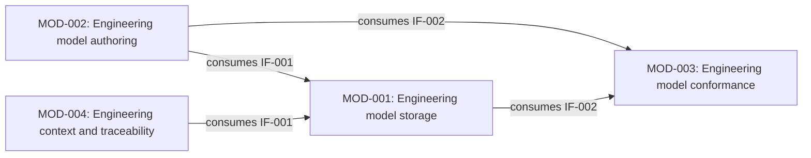

# Architecture Design

This is proposed target architecture for the REM refactor. [Architecture Allocation](../../rem/methods/architecture-allocation.md) defines the current method; the [first architecture design walkthrough](../../rem/methods/architecture-design.md) supports the initial pilot.
The [REM architecture model](../../rem/models/architecture-design.md) owns the reusable semantics; the [application profile](../support/README.md) defines the record shapes.
Existing [System and runtime contracts](../../docs/design/system.md) retain their authority. These draft Modules do not describe currently implemented packages, processes, or services.

## Scope and approach

The responsibility map covers all 63 Functions with 15 draft Modules.
The detailed first example covers the six IR-001 Scenarios, its five SRs, and the shared SR-012 interpretation responsibility from IR-005: ten ARs and two Interfaces.
The [published-product extension](../requirements/published-products.md) adds six Modules and four Interfaces for command execution, operational records, guided activities, candidate packaging, installation, and release coordination.
The remaining interactions and product ARs are deferred explicitly in each Module's `design_limits`.
This distinction permits a whole-system map without claiming that every interaction or obligation has already been designed.

The work proceeds through whole-system responsibility grouping, the IR-001 walkthrough, Interface and AR derivation, independent semantic review, and focused structural checks.
Review checks the composed SR outcomes as well as individual allocations. Schemas and cross-file checks protect record shape, identity, naming, containment, and references; they cannot prove architectural adequacy or runtime behavior.
The [source basis](../requirements/sources.md#src-architecture-pilot) records the selected choices and their limits.

## Responsibility map

<!-- responsibility-map:start -->

| Module | Responsibility | Accountable Functions | Detailed design boundary |
| --- | --- | --- | --- |
| [MOD-001](modules/MOD-001-engineering-model-storage.json) | Engineering model storage | [FUNC-001](../system/functions/FUNC-001-retain-engineering-definition.json), [FUNC-003](../system/functions/FUNC-003-resolve-engineering-entity-by-stable-id.json), [FUNC-004](../system/functions/FUNC-004-retrieve-engineering-definition-from-selected-model-state.json), [FUNC-006](../system/functions/FUNC-006-retain-applicable-decision-rationale.json) | IR-001 and shared interpretation pilot |
| [MOD-002](modules/MOD-002-engineering-model-authoring.json) | Engineering model authoring | [FUNC-005](../system/functions/FUNC-005-revise-engineering-entity-while-preserving-identity.json), [FUNC-008](../system/functions/FUNC-008-author-typed-engineering-relationships.json) | IR-001 and shared interpretation pilot |
| [MOD-003](modules/MOD-003-engineering-model-conformance.json) | Engineering model conformance | [FUNC-002](../system/functions/FUNC-002-check-entity-identity-presence-and-uniqueness.json), [FUNC-012](../system/functions/FUNC-012-interpret-a-model-with-its-declared-metamodel.json), [FUNC-013](../system/functions/FUNC-013-diagnose-model-conformance-against-declared-rules.json), [FUNC-014](../system/functions/FUNC-014-prepare-a-model-migration-candidate.json) | IR-001 and shared interpretation pilot |
| [MOD-004](modules/MOD-004-engineering-context-and-traceability.json) | Engineering context and traceability | [FUNC-007](../system/functions/FUNC-007-present-current-engineering-definition-and-applicable-rationale.json), [FUNC-009](../system/functions/FUNC-009-traverse-selected-engineering-relationships.json), [FUNC-010](../system/functions/FUNC-010-assess-declared-architectural-allocation-consistency.json), [FUNC-011](../system/functions/FUNC-011-report-possible-change-impact.json) | IR-001 and shared interpretation pilot |
| [MOD-005](modules/MOD-005-engineering-baseline-management.json) | Engineering baseline management | [FUNC-020](../system/functions/FUNC-020-establish-and-inspect-retained-engineering-baselines.json), [FUNC-021](../system/functions/FUNC-021-compare-selected-retained-engineering-states.json), [FUNC-022](../system/functions/FUNC-022-recover-the-recorded-content-of-a-retained-baseline.json) | Interfaces and ARs deferred |
| [MOD-006](modules/MOD-006-engineering-change-control.json) | Engineering change control | [FUNC-023](../system/functions/FUNC-023-record-controlled-change-transitions-and-provenance.json), [FUNC-024](../system/functions/FUNC-024-assess-and-apply-retirement-of-current-view-material.json), [FUNC-025](../system/functions/FUNC-025-retain-and-retrieve-activity-specific-change-context.json), [FUNC-026](../system/functions/FUNC-026-determine-applicable-authority-before-governed-actions.json) | Interfaces and ARs deferred |
| [MOD-007](modules/MOD-007-engineering-verification-and-assurance.json) | Engineering verification and assurance | [FUNC-027](../system/functions/FUNC-027-retain-criterion-based-verification-definitions.json), [FUNC-028](../system/functions/FUNC-028-retain-actual-verification-observations-and-provenance.json), [FUNC-029](../system/functions/FUNC-029-assess-evidence-applicability-to-a-declared-claim.json), [FUNC-030](../system/functions/FUNC-030-expose-claim-criterion-coverage-and-contradictory-evidence.json), [FUNC-031](../system/functions/FUNC-031-record-scoped-engineering-judgments-and-their-basis.json) | Interfaces and ARs deferred |
| [MOD-008](modules/MOD-008-engineering-authoring-guidance.json) | Engineering authoring guidance | [FUNC-032](../system/functions/FUNC-032-select-canonical-guidance-for-an-authoring-activity.json), [FUNC-033](../system/functions/FUNC-033-explain-engineering-authoring-and-correction-steps.json), [FUNC-034](../system/functions/FUNC-034-assess-authoring-guidance-against-prepared-task-outcomes.json) | Interfaces and ARs deferred |
| [MOD-009](modules/MOD-009-engineering-learning.json) | Engineering learning | [FUNC-035](../system/functions/FUNC-035-characterize-a-reusable-lesson-from-an-engineering-finding.json), [FUNC-036](../system/functions/FUNC-036-select-lessons-applicable-to-planned-engineering-work.json), [FUNC-037](../system/functions/FUNC-037-formulate-an-accountable-engineering-improvement-proposal.json), [FUNC-038](../system/functions/FUNC-038-assess-observed-effects-of-an-adopted-engineering-improvement.json) | Interfaces and ARs deferred |
| [MOD-010](modules/MOD-010-engineering-command-interface.json) | Engineering command interface | [FUNC-040](../system/functions/FUNC-040-admit-explicit-requests-under-declared-command-contracts.json), [FUNC-041](../system/functions/FUNC-041-discover-current-recorded-changes-without-selecting-authority.json), [FUNC-042](../system/functions/FUNC-042-read-explicitly-selected-engineering-records.json), [FUNC-048](../system/functions/FUNC-048-project-bounded-command-results-without-changing-meaning.json), [FUNC-049](../system/functions/FUNC-049-retain-and-inspect-private-invocation-diagnostics.json) | Published product Interfaces; ARs deferred |
| [MOD-011](modules/MOD-011-operational-record-persistence.json) | Operational record persistence | [FUNC-043](../system/functions/FUNC-043-inspect-identities-and-content-of-selected-engineering-subjects.json), [FUNC-044](../system/functions/FUNC-044-validate-registered-recording-candidates-and-preservation-rules.json), [FUNC-045](../system/functions/FUNC-045-construct-lossless-candidates-from-explicit-record-edits.json), [FUNC-046](../system/functions/FUNC-046-publish-fresh-record-candidates-as-coherent-transactions.json), [FUNC-047](../system/functions/FUNC-047-recover-exact-interrupted-record-transactions.json) | Published product Interfaces; ARs deferred |
| [MOD-012](modules/MOD-012-published-engineering-capability-guidance.json) | Published engineering capability guidance | [FUNC-050](../system/functions/FUNC-050-identify-a-suitable-published-engineering-capability.json), [FUNC-051](../system/functions/FUNC-051-prepare-a-portable-or-governed-capability-invocation.json), [FUNC-052](../system/functions/FUNC-052-resolve-resources-for-a-selected-capability-path.json), [FUNC-053](../system/functions/FUNC-053-guide-a-bounded-specialist-engineering-activity.json), [FUNC-054](../system/functions/FUNC-054-determine-an-applicable-engineering-handoff.json), [FUNC-055](../system/functions/FUNC-055-prepare-and-interpret-governed-recording-operations.json) | Published product Interfaces; ARs deferred |
| [MOD-013](modules/MOD-013-product-package-production.json) | Product package production | [FUNC-060](../system/functions/FUNC-060-build-supported-product-candidates.json), [FUNC-061](../system/functions/FUNC-061-derive-artifact-integrity-metadata.json), [FUNC-062](../system/functions/FUNC-062-assess-packed-cli-completeness.json) | Published product Interfaces; ARs deferred |
| [MOD-014](modules/MOD-014-verified-skill-installation.json) | Verified skill installation | [FUNC-063](../system/functions/FUNC-063-acquire-and-verify-an-installation-candidate.json), [FUNC-064](../system/functions/FUNC-064-apply-bounded-skill-installation-and-replacement.json), [FUNC-065](../system/functions/FUNC-065-present-installation-plans-and-outcomes.json) | Published product Interfaces; ARs deferred |
| [MOD-015](modules/MOD-015-product-release-coordination.json) | Product release coordination | [FUNC-066](../system/functions/FUNC-066-select-release-identity-and-execution-eligibility.json), [FUNC-067](../system/functions/FUNC-067-prepare-profile-owned-release-projections.json), [FUNC-068](../system/functions/FUNC-068-assess-release-preflight-and-qualification.json), [FUNC-069](../system/functions/FUNC-069-seal-a-qualified-immutable-release-candidate.json), [FUNC-070](../system/functions/FUNC-070-publish-an-authorized-retained-candidate.json), [FUNC-071](../system/functions/FUNC-071-observe-public-release-and-record-closeout.json), [FUNC-072](../system/functions/FUNC-072-determine-publication-recovery-disposition.json), [FUNC-073](../system/functions/FUNC-073-coordinate-an-eligible-routine-release.json) | Published product Interfaces; ARs deferred |

<!-- responsibility-map:end -->

This table is derived from Module records and Function-owned `allocated_to` references, which represent the refined REM `primaryModule` relationship. It is navigation, not a separately authored allocation source.
Each Module describes purpose, responsibilities, owned information or state, boundary exclusions, Interface participation, and design limits.
Content custody, authority over meaning, checking, and presentation are distinguished so they do not become competing authoritative copies of the same engineering fact.

## IR-001 interaction boundaries



Arrows show consumption of a provider's contract, not a transport or execution technology.
The [Interface index](interfaces/README.md) derives providers and consumers from Module records and links to their contracts.

Storage acquires raw content and the selected state's declared profile material before requesting interpretation.
Conformance interprets those supplied inputs; it does not recursively request interpreted storage access to discover the rules needed for that same interpretation.
Identity checking receives the complete relevant candidate view and its state/scope. Retention checks that the candidate and selected basis still match; a preliminary check cannot justify a changed candidate or overwriting intervening work.
Consumers preserve the selected state across definition, reference, and rationale reads. They cannot merge independently reselected versions of “current” into a supposedly complete account.

Actor-facing adapters, authorization determination, and baseline establishment are outside the detailed pilot. Requests begin with explicit state and applicable authority context; neither condition is created by storage or conformance.
The walkthrough specifies responsibility composition, not an executable call sequence. Governed Scenarios remain black-box records.

## Scenario walkthrough

| Scenario | Responsibility composition | Required observation and failure boundary |
| --- | --- | --- |
| SCN-001 — Retrieve a saved definition in a later session | MOD-001 resolves and retrieves through IF-001; MOD-003 interprets supplied state under IF-002; MOD-004 presents the definition. | Saved identity, type, content, state, and scope are identifiable without the original conversation. Unavailable, unsupported, partial, or failed access cannot become complete success or an implicit different-state read. |
| SCN-002 — Evolve an entity while retaining its identity | MOD-002 prepares the same-entity revision; MOD-003 checks candidate identities; MOD-001 retains against the same expected basis. | Names, locations, and content may change while identity and reference designation persist. Conflicts, changed bases, semantic reparenting, and unsupported split/merge operations are distinguished from successful revision. |
| SCN-003 — Understand the current definition and applicable decision rationale | MOD-004 composes MOD-001 definition, required-reference, and rationale results for one selected state. | Current meaning is understandable without replaying Changes. Required context gaps, optional missing history, and unresolved rationale applicability remain separate. |
| SCN-004 — Recognize unavailable or incomplete engineering knowledge | MOD-001 and MOD-003 preserve scoped diagnostics; MOD-004 presents those distinctions. | A clear gap explanation can satisfy this diagnostic Scenario. Hiding or misclassifying the gap fails it. Complete definition content and incomplete rationale are reported separately. |
| SCN-005 — Save an engineering definition for later sessions | MOD-001 checks supported supplied content and complete identity scope with MOD-003 before confirmed retention through IF-001. | A confirmed save survives session termination. Invalid, unchecked, unsupported, stale, or indeterminate retention cannot be reported as complete accepted content. Known partial effects remain explicit. |
| SCN-006 — Record decision rationale for a current engineering definition | MOD-001 retains supplied reasoning and its state-scoped association through IF-001; later access is available to MOD-004. | Recorded context, choice, rationale, alternatives, and consequences remain accessible while relied on, even after Change explanation cleanup. Missing details, failed retention, and a changed definition cannot silently produce a complete applicable association. |

These rows interpret the [governed IR-001 Scenarios](../requirements/scenarios/README.md), without adding Scenario fields or identities.
Canonical Function definitions and Interface operations remain the detailed behavior owners.

## Requirement and Function convergence

<!-- requirement-allocation:start -->

| AR | Parent SR | Allocated obligation | Accountable Module | Constrained Functions |
| --- | --- | --- | --- | --- |
| [AR-001](../requirements/IR-001-preserve-engineering-knowledge-across-sessions/SR-001-retain-engineering-definitions-across-sessions/AR-001-retain-accepted-definitions-beyond-the-authoring-session.json) | [SR-001](../requirements/IR-001-preserve-engineering-knowledge-across-sessions/SR-001-retain-engineering-definitions-across-sessions/sr.json) | Retain accepted definitions beyond the authoring session | [MOD-001](modules/MOD-001-engineering-model-storage.json) | [FUNC-001](../system/functions/FUNC-001-retain-engineering-definition.json) |
| [AR-002](../requirements/IR-001-preserve-engineering-knowledge-across-sessions/SR-001-retain-engineering-definitions-across-sessions/AR-002-retrieve-definitions-with-explicit-state-and-completeness.json) | [SR-001](../requirements/IR-001-preserve-engineering-knowledge-across-sessions/SR-001-retain-engineering-definitions-across-sessions/sr.json) | Retrieve definitions with explicit state and completeness | [MOD-001](modules/MOD-001-engineering-model-storage.json) | [FUNC-004](../system/functions/FUNC-004-retrieve-engineering-definition-from-selected-model-state.json) |
| [AR-003](../requirements/IR-001-preserve-engineering-knowledge-across-sessions/SR-002-unambiguous-entity-identity/AR-003-check-candidate-identities-over-an-explicit-model-scope.json) | [SR-002](../requirements/IR-001-preserve-engineering-knowledge-across-sessions/SR-002-unambiguous-entity-identity/sr.json) | Check candidate identities over an explicit model scope | [MOD-003](modules/MOD-003-engineering-model-conformance.json) | [FUNC-002](../system/functions/FUNC-002-check-entity-identity-presence-and-uniqueness.json) |
| [AR-004](../requirements/IR-001-preserve-engineering-knowledge-across-sessions/SR-002-unambiguous-entity-identity/AR-004-resolve-identities-without-hiding-absence-or-ambiguity.json) | [SR-002](../requirements/IR-001-preserve-engineering-knowledge-across-sessions/SR-002-unambiguous-entity-identity/sr.json) | Resolve identities without hiding absence or ambiguity | [MOD-001](modules/MOD-001-engineering-model-storage.json) | [FUNC-003](../system/functions/FUNC-003-resolve-engineering-entity-by-stable-id.json) |
| [AR-005](../requirements/IR-001-preserve-engineering-knowledge-across-sessions/SR-003-preserve-identity-through-entity-evolution/AR-005-preserve-identity-when-applying-supported-definition-revisions.json) | [SR-003](../requirements/IR-001-preserve-engineering-knowledge-across-sessions/SR-003-preserve-identity-through-entity-evolution/sr.json) | Preserve identity when applying supported definition revisions | [MOD-002](modules/MOD-002-engineering-model-authoring.json) | [FUNC-005](../system/functions/FUNC-005-revise-engineering-entity-while-preserving-identity.json) |
| [AR-006](../requirements/IR-001-preserve-engineering-knowledge-across-sessions/SR-004-understand-current-definitions-without-history-replay/AR-006-expose-current-authoritative-content-without-history-replay.json) | [SR-004](../requirements/IR-001-preserve-engineering-knowledge-across-sessions/SR-004-understand-current-definitions-without-history-replay/sr.json) | Expose current authoritative content without history replay | [MOD-001](modules/MOD-001-engineering-model-storage.json) | [FUNC-004](../system/functions/FUNC-004-retrieve-engineering-definition-from-selected-model-state.json) |
| [AR-007](../requirements/IR-001-preserve-engineering-knowledge-across-sessions/SR-004-understand-current-definitions-without-history-replay/AR-007-present-current-meaning-with-explicit-context-gaps.json) | [SR-004](../requirements/IR-001-preserve-engineering-knowledge-across-sessions/SR-004-understand-current-definitions-without-history-replay/sr.json) | Present current meaning with explicit context gaps | [MOD-004](modules/MOD-004-engineering-context-and-traceability.json) | [FUNC-007](../system/functions/FUNC-007-present-current-engineering-definition-and-applicable-rationale.json) |
| [AR-008](../requirements/IR-001-preserve-engineering-knowledge-across-sessions/SR-005-retain-applicable-decision-rationale/AR-008-retain-decision-reasoning-and-its-definition-association.json) | [SR-005](../requirements/IR-001-preserve-engineering-knowledge-across-sessions/SR-005-retain-applicable-decision-rationale/sr.json) | Retain decision reasoning and its definition association | [MOD-001](modules/MOD-001-engineering-model-storage.json) | [FUNC-006](../system/functions/FUNC-006-retain-applicable-decision-rationale.json) |
| [AR-009](../requirements/IR-001-preserve-engineering-knowledge-across-sessions/SR-005-retain-applicable-decision-rationale/AR-009-present-applicable-rationale-separately-from-definition-completeness.json) | [SR-005](../requirements/IR-001-preserve-engineering-knowledge-across-sessions/SR-005-retain-applicable-decision-rationale/sr.json) | Present applicable rationale separately from definition completeness | [MOD-004](modules/MOD-004-engineering-context-and-traceability.json) | [FUNC-007](../system/functions/FUNC-007-present-current-engineering-definition-and-applicable-rationale.json) |
| [AR-010](../requirements/IR-005-keep-engineering-models-valid-and-consistently-interpreted/SR-012-interpret-model-states-using-their-identified-metamodel/AR-010-interpret-content-under-the-selected-state-profile.json) | [SR-012](../requirements/IR-005-keep-engineering-models-valid-and-consistently-interpreted/SR-012-interpret-model-states-using-their-identified-metamodel/sr.json) | Interpret content under the selected state profile | [MOD-003](modules/MOD-003-engineering-model-conformance.json) | [FUNC-012](../system/functions/FUNC-012-interpret-a-model-with-its-declared-metamodel.json) |

<!-- requirement-allocation:end -->

This view is derived from AR containment and authored `allocated_to` / `constrains` relationships. Each AR's acceptance criteria explain its contribution to the SR.
Several ARs may converge on one Function, and one SR may require several accountable Modules. No one-to-one pairing is required.
AR-010 retains SR-012 as its sole parent under IR-005; using that shared responsibility here does not duplicate or reparent it.
The pilot's ordinary and adverse outcomes are reviewed against SR-001 through SR-005. It does not claim full architecture coverage of SR-012 or the remaining IRs.

## Review and validation

The following review describes the earlier 139-entity architecture pilot and retains its original subject. The [published-product review](../requirements/published-products.md#review-and-validation) records the later 247-entity extension and current checks.

Independent semantic review assessed the nine proposed Module boundaries, 33 Function allocations, two Interface contracts, ten ARs, and the IR-001 walkthrough against SR-001 through SR-005 and shared SR-012.
One material finding was corrected: interpretation initially exposed the declared profile without the governing definitions required by SR-012/FUNC-012. IF-002 now returns those definitions or resolvable state-bound references; IF-001 preserves that context for consumers, and AR-010 includes the corresponding acceptance criterion. Independent rereview closed the finding with no remaining material issues in the bounded semantic subject.
The candidate identity view also explicitly distinguishes replacing the same original subject from omitting distinct entities that could expose a duplicate identity.

Separate independent inspection of the schemas and focused tests found no actionable structural-contract defect or meaningful missing negative coverage within the selected profile.
Independent documentation review reconciled the indexes, source ownership, draft scope, and allocation tables with the JSON records; it also reconstructed and confirmed the earlier system-analysis digest from `5cf0c7b6` without retargeting that historical review.
The following commands were actually run and passed:

```bash
python3 tests/engineering/validation/requirement_schema_tests.py
python3 tests/engineering/validation/system_design_schema_tests.py
python3 tests/engineering/validation/architecture_schema_tests.py
```

The requirement suite passed 13 tests, the system/model suite 18, and the architecture suite 11: 42 tests total.
The architecture suite validates independent positive/negative fixtures and current record shape, unique operation names, and pilot Interface participation. Shared model checks cover identities, naming, AR containment, typed links, and source IDs.
A direct preservation comparison against `5cf0c7b6` confirmed that all 118 previous entities retain their identities, requirement/behavior content, and prior provenance; only Function allocation disposition and appended architecture sources changed. All five previously existing schemas remain byte-for-byte unchanged.
Local Markdown path/anchor checks and whitespace inspection passed.

Review subject digest: `6e61f01d5419c623f7e846cf47218f672b57f5ebad2ee572947af9a09e11077e`. This SHA-256 covered the sorted repository-relative paths and SHA-256 content digests of all 139 entity JSON files then under `design/`, excluding schemas. It identifies the earlier pilot rather than the current extended model and does not replace the retained earlier system-analysis subject.

These are structural checks and a bounded design review. No CI or runtime verification ran; none of the AR acceptance criteria are claimed as executed product evidence. All new architecture/AR records and existing Function allocations remain `draft`; confirmed Scenarios retain their prior status.

## Remaining design scope

Extend the walkthrough to relationship authoring, traversal, impact, migration, baselines, controlled changes, assurance, authoring guidance, and learning.
Reconcile the existing Module boundaries as those interactions become concrete; the current map is a proposal, not a constraint requiring future obligations to fit it.
Define remaining Interfaces and ARs before claiming their architectural coverage.
For the published-product extension, complete the specialist cooperation contracts and source-qualified AR derivation before claiming full architecture coverage of IR-008 through IR-010. MOD-011's operational record protocol remains distinct from MOD-001's proposed REM model storage; this analysis does not relax existing transaction guarantees or adopt the REM JSON profile as a public CLI format.
Realization mapping, runtime integration, adoption of new lifecycle states, and migration of existing product contracts require their own explicit design and evidence.
