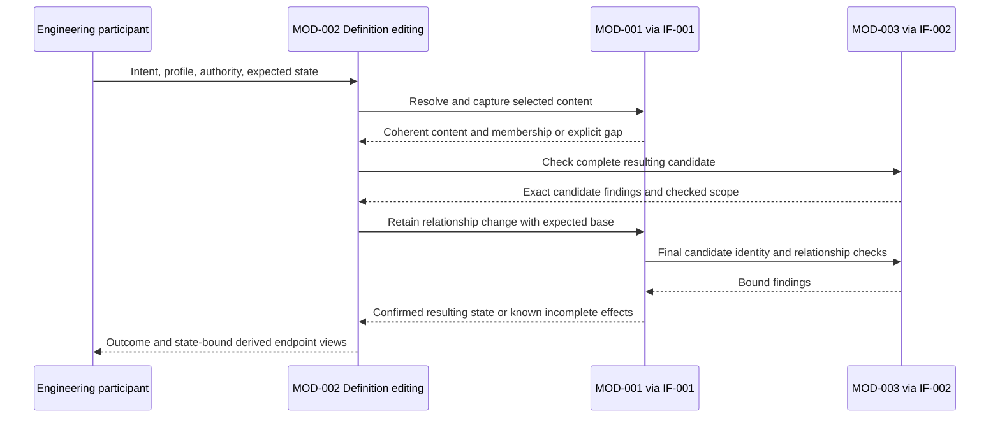

# Definition editing

MOD-002 owns FUNC-005 identity-preserving revisions and FUNC-008 relationship editing. [Module responsibility](module.json) retains the authoritative allocation. The following is proposed architecture for SR-008, implemented by no claim in this document. AR-057 owns editing, AR-058 owns relationship admission in MOD-003 and AR-059 owns relationship retention in MOD-001.

## Same-entity revision

FUNC-005 and AR-005 cover an explicitly resolved existing entity. Obtain its exact identity, selected base/profile and complete relevant content through IF-001; the caller supplies the proposed name, location or definition change and applicable authority. Form the resulting candidate without changing that identity or its semantic containment parent. A distinct entity cannot take the old identity by calling the operation a rename; unsupported split/merge or identity replacement receives an explicit outcome.

In the current profile, a descriptive folder or filename move may preserve identity and parentage, while moving an SR/AR beneath another requirement or a Module beneath another Module changes semantic containment. The latter needs the separately governed relationship operation below. A same-parent rename of a containing directory includes its entire descendant membership, stable identities, relative authoritative references and any supported source/locator paths affected by the move. Check target absence/collision and the complete resulting model scope; do not claim a successful leaf rename while silently losing descendants. ID-based references continue to designate the same entities; path references must be reconciled or exposed as unresolved before complete acceptance.

Submit the explicit complete write/move candidate to [MOD-001's retention boundary](../MOD-001-engineering-model-storage/README.md#confirmed-definition-and-rationale-retention). The storage owner rechecks the actual candidate, base and profile under exclusion; preliminary checking grants no save or approval. An intervening edit requires reconciliation, never overwrite from the old selection. Rationale association is content-specific: preserve its original basis and obtain an explicit new association or expose an applicability gap. A confirmed identity-preserving edit does not renew review or verification.

A directory move is not presumed to be an atomic multi-file transaction. Use the same staging, durable unresolved marker, coherent-read exclusion and inspected-effect recovery as other definition writes. Return actual retained state, or known partial/failed effects and unresolved membership. The logical editing result stays separate from derived view success and from a future callable editor/CLI adapter.

## Request and result boundary

An engineering participant submits an explicit create, replace or remove intent to MOD-002's logical authoring boundary: selected model and expected base, declared profile, typed endpoints, original fact for replacement/removal, requested resulting fact, and applicable authority. MOD-002 owns admission and presentation at this boundary. These are logical inputs, not a newly callable command or wire schema. No MOD-010 caller or cross-parent Interface is implied; a future command adapter requires its own reviewed boundary contract.

Only the profile-declared authoritative representation is edited. In this repository, SR/AR parentage comes from physical containment; typed cross-domain facts use the declared source fields. The relation is identified by its type, source and target identities and provenance within the selected state; a displayed inverse has the same fact identity and original direction. Labels or traversal direction do not create another authored fact. Existing identical creation is an explicit unchanged outcome only after complete checks establish that fact; absent removal is unchanged only after complete state-bound inspection. Missing replacement originals and ambiguous selections are rejected rather than treated as creation.

Semantic reparenting is a relationship replacement, with explicit authority and reconsidered derivation. It never uses FUNC-005's rename operation or AR-005's preserved-parent revision guarantee. Removing a required parent without a valid replacement is rejected. A replace is checked as one resulting candidate, so its temporary remove/add construction cannot become an accepted parentless state.

## Responsibility and interactions

[IF-001](../../../../interfaces/IF-001-engineering-definition-access/interface.json) owns resolution, coherent acquisition and final retention. [IF-002](../../../../interfaces/IF-002-engineering-model-interpretation-and-identity-checks/interface.json) supplies declared rules and candidate findings without writing or approving. MOD-002 forms the resulting candidate by applying only the requested change to the acquired complete model membership. Unchanged entities and incoming facts remain in the checking scope wherever identity, endpoint, cardinality or containment rules depend on them. Candidate identity binds bytes, membership and profile, not just the edited source file.

MOD-003 first rejects unknown operation and relationship types, then checks resolved endpoint kinds, authoritative representation, cardinality and acyclic single-parent containment. Whole-model conformance remains a separate responsibility; a complete scoped relationship check is not a whole-model validity judgment. Existing AR-003/004/010 retain identity, resolution and interpretation obligations; AR-058 adds relationship-specific admission only.

MOD-001 stages the supplied write set, holds model write exclusion for final base comparison, checking and publication, and uses matching read exclusion or an immutable snapshot for coherent readers. It owns final acceptance even when MOD-002 already checked the candidate. Read sets include competing incoming edges and parent ancestry; a change in any relevant base invalidates previous findings. All affected content and containment membership must match the accepted candidate before success. Existing AR-001/002/006 retain definition custody and access; AR-059 adds relationship-change-set acceptance and failure scope.

## Outcomes and endpoint consistency

| Situation | Authoring outcome and reader meaning |
| --- | --- |
| Valid creation | Confirm the resulting state and derive both endpoint views from its one authoritative fact. |
| Valid replacement or removal | Rebuild views from the confirmed resulting state; the previous inverse cannot survive as a current edge. |
| Unknown type, missing/ambiguous endpoint, invalid kind/cardinality/parentage | Return invalid or unsupported findings and affected scope; no accepted change. |
| Changed base, candidate, profile or authority | Report stale selection and require a reconciled request; never overwrite using earlier findings. |
| Write fails or completion is uncertain | Report known effects and unresolved scope, with no accepted completion or assumed rollback. |
| Write confirmed but view acquisition fails | Preserve confirmed retention separately and report unavailable/incomplete views; do not invent rollback or a complete pair of views. |

Derived endpoint indexes are disposable views keyed by model, exact state, profile and content identity. MOD-002 derives them from the same interpreted fact set for both endpoints. MOD-004's [traversal](../MOD-004-engineering-context-and-traceability/traversal.md) and AR-056 reuse that single-fact meaning for general reading; no second authoritative inverse list or additional traversal ownership is introduced. Replacement invalidates the old current-state cache selection rather than mutating historical views. A frozen older view remains explicitly older; it is never relabeled current.

If publication is interrupted, the storage owner preserves a durable unresolved-write marker before changing authoritative members, identifying the base, candidate identity and write scope. After restart it withholds coherent reads and further writes of the affected model until exact membership and bytes are inspected and the effects reconciled. The marker is recovery metadata, not another relationship fact. Uncertainty must survive process loss; merely holding a process lock is insufficient. Reconciliation establishes an attributable state or retains the gap, never blindly retries or claims rollback. An acknowledged confirmed write whose response is lost likewise remains uncertain to the caller until inspected.

## Realization, compatibility and acceptance intent

The proposed shared local model engine separates MOD-002's candidate construction and endpoint projection from MOD-003's pure profile checks and MOD-001's filesystem custody, staging, exclusion and durable recovery marker. These are responsibilities within the existing proposed engine, not additional REM Modules or an adoption of MOD-011's operational SQLite protocol. No database, public command grammar or new package dependency is introduced here.

The write boundary must be used by supported engine writers. External filesystem edits cannot be fenced by advisory locking alone: storage detects changed membership/content before confirmation, and uncertain publication remains incomplete. A future runtime must either enforce the required custody boundary or reject a coherence claim; repeated live scans do not prove consistency. Existing direct repository authoring is not evidence that this proposed engine exists.

The change extends IF-001/002 with distinct logical operations and preserves existing definition and identity behavior. Existing readers retain state/completeness distinctions; newer content does not reinterpret earlier profiles or accepted states. Parent reassignment preserves entity identity but does not renew engineering approval or verification.

Acceptance walkthroughs include typed creation, replacement and removal from either endpoint; required-parent replacement and rejected orphaning; unknown relationship types; competing incoming cardinality; ambiguous identity; changed base during checking; and interruption before, during and after publication. These are Design acceptance intentions. Runtime tests, implementation evidence and verification judgments remain separate.
