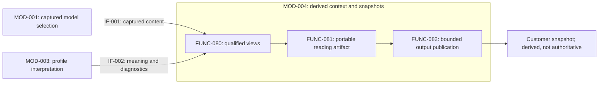

# Views and traceability

[MOD-004](module.json) owns derived engineering context, qualified view composition and portable browser output. This is the target design for SR-084–088, not evidence of shipped browser commands. Entity JSON owns Function/AR allocation; [the architecture composition](../../../../README.md#customer-architecture-browser-composition) owns cross-parent cooperation. The current Python/D2 repository browser remains the observed implementation until a coordinated replacement is qualified.

General SR-009 traversal, its IF-013 boundary and AR-056 allocation are defined in [Scoped relationship traversal](traversal.md). The finite Requirements tree remains a presentation grammar, separate from general reachability.

## Logical responsibility and cooperation

FUNC-007/009 retain definition/rationale presentation and relationship navigation. FUNC-080 composes semantic views; FUNC-081 assembles the reading artifact; FUNC-082 publishes/reconciles the selected derived output. MOD-001/FUNC-079 owns input capture, MOD-003/FUNC-012/013 interprets the declared profile, and MOD-013/FUNC-083 owns packaged-customer qualification. Capture is not baseline retention; publication of local output is not release to customers.



IF-012 is provided by parent MOD-016, consumed by MOD-010. The parent composes its children's contributions; it does not take their direct allocations. MOD-004 consumes IF-001/002 internally. IF-007 remains the Baseline contract. Inputs exclude operational SQLite records and arbitrary filesystem traversal. A source link does not authorize acquisition of its target.

## Current definition and rationale presentation

FUNC-007 supplies SR-004/005 through AR-007/009. Bind one selected model state and profile through IF-001, resolve the requested identity over complete required membership, then compose definition content, current authoritative references and recorded rationale from that same captured state. [Definition storage](../MOD-001-engineering-model-storage/README.md) owns custody and exact association information; IF-002 supplies governing interpretation. MOD-004 owns presentation, not new authoritative facts or decision applicability judgments.

Present identity, type, selected state/profile and the authored engineering meaning: requirement obligation and criteria, Feature capability, Function behavior or Module/Interface responsibility as appropriate. Preserve authoritative-reference provenance and allow the reader to inspect the applicable governing definition. Summaries are derived and cannot replace unavailable required fields with guesses from history. No original conversation or operational Change database is required to read current content.

Expose separate outcomes for definition content, required current context, recorded rationale and optional history. Show known content with each specific unavailable, unsupported, incomplete, failed or unresolved scope. A complete definition with missing rationale remains visible as complete definition content; its explanatory context is incomplete when that rationale is required. Missing optional history is an optional-history limitation. No retrieved rationale does not mean no rationale is needed.

Display all recorded context, choice, rationale, alternatives and consequences only under their actual association basis, together with its author-supplied applicability scope. A rationale for another content/profile state may be shown as historical or unresolved, never silently relabeled current. Preserve the distinction between an explicit author disposition after a harmless edit and an inferred carry-forward. Neither rationale presentation nor a complete model establishes engineering approval or requirement satisfaction.

The derived projection retains selected-state identity, source locators, exact available content and the separate gaps. In the proposed engine this is a pure composition over captured inputs; HTML views or participant-assisted reading consume the same semantic result. Reusable views are keyed to their exact captured basis, and a state change requires a new composition. Memory limits, cancellation or missing referenced inputs produce explicit bounded results. No separate editable rationale cache or automatic history reconstruction is introduced. The present repository browser's Design pages do not by themselves qualify every target retrieval behavior.

## Technical model: browser components and contracts

This model defines the intended architectural implementation of the browser. Its component-and-contract structure is a Logical reading perspective under [REM's technical-model definition](../../../../../../rem/models/architecture-design.md#technical-model). Node, Rust and D2 remain the selected technology choices; they do not establish new REM Modules, current command availability or implemented runtime behavior. The [architecture composition](../../../../README.md#customer-architecture-browser-composition) retains cross-owner accountability.

| Component | Responsibility and authority | Architectural mapping |
| --- | --- | --- |
| Command adapter — Node.js | Admits the public request, checks packaged compatibility, supervises the engine and presents its actual outcome. It neither interprets model meaning nor mutates generated output. | MOD-010 consumes IF-012; its [browser command family](../../../MOD-018-engineering-operations/modules/MOD-010-engineering-command-interface/README.md#browser-command-family) owns public admission and results. |
| Browser engine — Rust | Composes input capture, interpretation, view projection, diagram handling, website assembly and publication/recovery in one implementation unit. The engine is the sole writer of its selected output. | Capture remains MOD-001/FUNC-079; interpretation remains MOD-003/FUNC-012/013; projection, assembly and publication remain MOD-004/FUNC-080/081/082. Shared execution does not transfer those allocations. |
| Diagram renderer — D2 | Converts admitted diagram descriptions into candidate SVG. It receives bounded rendering inputs and cannot select model membership or the published output root. The engine validates its result. | A technical dependency of MOD-004's view composition; it does not acquire an independent Module or approval role. |
| Reader platform — HTML/CSS/JavaScript | Presents supplied project data, navigation, diagrams and qualifications. It reads embedded data and changes only local UI state; it does not reinterpret engineering obligations or write model/output files. | MOD-004/FUNC-007/009 supplies definition presentation and relationship navigation; FUNC-081 composes the portable reader artifact. |

The reader template is the packaged source of that reader platform. Generated browser data and the complete website are artifacts, not additional components with independent responsibility. The selected engineering model remains authoritative input; the engine's interpretation and projections remain derived. MOD-013 owns the matched tool candidate and MOD-015 retains any external release/publication authority.

| Relationship / contract | Producer and consumer | Meaning and failure boundary | Owning detail |
| --- | --- | --- | --- |
| Browser operation | Node adapter ↔ Rust engine | One explicit request and truthful result under `browser-engine-v1`; incompatible identities reject before writes, and ambiguous response loss requires bounded recovery. | [Adapter and engine boundary](#adapter-and-engine-boundary), implementing IF-012 and the MOD-010 public contract |
| Captured model | MOD-001 capture → MOD-003 interpretation → MOD-004 composition | Exact admitted membership/content and declared interpretation; invalid or mutable input cannot become a published snapshot. | [Input and interpretation](#input-and-interpretation-contract), IF-001/002 contributions |
| Diagram rendering | Rust engine ↔ D2 | Admitted instructions and packaged renderer resources produce candidate SVG; invalid input, renderer failure or unsafe SVG stops preparation. | [Five-view contract](#five-view-and-reading-contract) and [diagram admission](#integrated-browser-reading) |
| Reader data | Engine projection → reader platform | Project identity, entities, relationships, view content and source qualifications match the packaged template's data contract. Malformed/incompatible required content rejects assembly. | [Browser-data contract](#browser-data-contract) |
| Snapshot publication | Engine → selected output; offline browser reads the completed artifact | Only the engine commits the complete website under explicit ownership and expected identity. The reader uses captured bytes; it has no live generator connection. | [Publication and recovery](#physical-view-publication-interruption-and-recovery) |
| Product resources | MOD-013 candidate → Node adapter and engine | Matched executable, renderer, interpretation and reader resources with declared identities/platform support; incomplete candidates cannot establish browser support. | [Package production](../../../MOD-019-product-delivery/modules/MOD-013-product-package-production/README.md#browser-candidate-contract) |

These rows summarize and link existing contracts; they do not create duplicate Interface definitions or new globally identified technical entities. The `browser-engine-v1` and reader-data contracts remain distinct internal boundaries. Normal generation, failed preparation and ambiguous publication outcomes must remain consistent across the linked contracts.

<!-- architecture-diagram: browser-technical-structure -->

```d2
direction: down
adapter: "Command adapter\nNode.js · MOD-010"
engine: "Browser engine\nRust · MOD-001 / MOD-003 / MOD-004"
renderer: "Diagram renderer\nD2 · MOD-004 dependency"
template: "Reader platform template\nHTML / CSS / JavaScript · MOD-004"
website: "Architecture website\nReader platform + project data"
adapter -> engine: "Browser operation contract"
engine -> renderer: "Admitted D2 / validated SVG contract"
engine -> template: "Uses matched reader-data contract"
engine -> website: "Publishes complete snapshot"
template -> website: "Supplies offline reader"
```

The boxes distinguish components from the generated website artifact. Edges describe contracts and realization relationships; they do not establish call order or process boundaries. Use [Process](#process-view-execution-topology-and-selected-interaction) for execution and [Development](#development-and-distribution-realization) for source/build organization. The [technology decision](#technology-decision) owns rationale, alternatives and consequences.

## Input and interpretation contract

The initial browser input profile is `rem-json-browser-v1`, a proposed packaging of this repository's eight entity schemas and admitted realization facets with their typed-reference rules, plus the explicitly bounded reading resources selected under the first-project adoption below. The package binds the one supported contract’s exact schema/interpretation bytes to the generator version; no user-extensible profile catalogue is required for the first version. This names a product compatibility contract, not a new REM version or an assertion that the current CLI accepts this profile. No current command is changed by this document.

The caller supplies a project identity, declared profile, explicit model root/membership and an immutable source selection. Initially admit a retained immutable version-control tree or an explicitly immutable exported tree with a supplied content manifest; do not silently default to HEAD or an unlocked dirty checkout. Capture resolves all declared model members and included explanation, rejects symlink/path escapes and duplicate ambiguous identities, and checks membership/digests against the supplied selection. A mutable export or insufficient consistency evidence rejects before publication. A customer need not use Git: an immutable export suffices. Dirty content must first be captured as an explicitly identified stable selection, not labeled with a commit alone.

Required model content and interpretation must be valid before projection. Missing optional realization/detail produces a visible gap rather than a requirement to populate every view. Required rationale that is unavailable stays visible as an explanatory limitation; it is never invented. Source text and relative locators travel with the snapshot where needed to understand selected content; optional external URLs remain labeled references. Disallowed resources such as `.rigorloop/`, credential files and unrelated checkout content cannot enter through a recursive export or linked-document fetch.

## Five-view and reading contract

| View | Authoritative basis and reader result |
| --- | --- |
| Logical | Module containment, exact Interface provider/consumer, direct Function/AR allocation and explicitly mapped technical component/contract structure. Show descendant coverage separately; do not make parents duplicate accountable owners. |
| Process | Runtime/interaction facts provide stable topology. Select sequence, activity or state details only when declared semantics establish them; a missing sequence is a gap, not inferred order. |
| Development | Recorded software organization and production/resource relationships; shared paths do not merge responsibilities. |
| Physical | Recorded execution/artifact placement, resources and isolation constraints; a logical dependency is not a machine/network connection. |
| Scenario | The selected black-box Scenario, obligations and explicitly available participation; no execution order or satisfaction inferred from reachability. |

Each topic uses owner, facet, qualification, model kind and local name plus current source pointers. Names alone cannot merge observed and proposed topics. Reading offers text equivalents, keyboard navigation, overview/detail links and source/rationale disclosure. Selected scopes and missing information remain visible when changing views. RigorLoop-specific CLI contribution panels and Scenario selections are optional project reading data, never prerequisites to another project’s model navigation or a reason to add configurable input profiles.

The initial engine projects existing admitted JSON. The earlier proposed `process_models` schema extension remains deferred. Authored Mermaid diagrams in owning design documents explain decisions now; the customer product does not scrape arbitrary Markdown into executable diagram input. Unsupported supplied behavioral details remain explicit source text until a selected source and rendering contract is admitted. D2 draws only safe generated instructions from admitted semantic facts. Do not execute user-provided D2 includes, URLs, scripts or arbitrary Mermaid text.

## Web page information design

The [unified system Requirements view](requirement-tree.md) is an optional supplementary architecture view, enabled only at the RigorLoop system root in this scope. Its system-rooted IR/SR/AR tree includes expandable Feature, Function and accountable Module references with one detail panel. It has no separate top-level destination or Module-scoped variant and is available in the repository design browser at [RigorLoop → Requirements](../../../../views/browser/index.html#requirements). The repository renderer explicitly enables this presentation; customer generator delivery remains separately scoped.

This proposed reading design refines SR-085/086 through FUNC-007/009/080/081 and AR-046/047. It reuses the existing requirement basis; it introduces no new IR, Module or approval gate. It defines the customer browser and the RigorLoop reference site's common presentation. The repository browser implements the shared scope and view navigation described under [Integrated browser reading](#integrated-browser-reading); the broader customer generator remains proposed.

AR rows distinguish definition lifecycle from [implementation and verification indicators](requirement-tree.md#ar-implementation-and-verification-indicators). An AR without a selected assessment shows Unknown and Not assessed. Explicitly selected operational accounts expose separate implementation and verification claims, criterion evidence and gaps; changed material bases retain historical detail while withholding current positive claims.

The [delivery assessment format](requirement-delivery-format.md) defines the G0 target for IR/SR/AR Implementation and Verification, with an exact version 2 schema, currentness/conflict rules and preserved version 1 compatibility. The existing Design disclosure remains separate. The repository reader accepts both delivery versions through one normalized projection. Unselected SR/IR claims continue to express absence; accepting a format never supplies an assessment.

### Delivery assessment selection

The [versioned delivery format](requirement-delivery-format.md) owns the exact admission, applicability, conflict and compatibility rules for this proposed cooperation. No live record discovery or judgment generation is delegated to the browser.

<!-- architecture-diagram: select-delivery-assessments -->

```d2
shape: sequence_diagram
assessor: "Accountable reporter / verifier"
records: "Operational records\nMOD-011 / governed CLI"
producer: "Explicit disclosure preparation"
importer: "Admission and projection\nMOD-004"
reader: "Offline Requirements reader\nMOD-004"
assessor -> records: "Record actual scoped judgment, evidence and concerns"
producer -> records: "Read explicitly selected records and retained payloads"
records -> producer: "Original identities, judgments, dispositions and limitations"
producer -> producer: "Check attribution and complete basis; select safe disclosure"
producer -> importer: "Delivery v1 or v2; separate optional Design selection"
importer -> importer: "Admit closed format, identities, coverage and safe resources"
importer -> importer: "Compare captured basis; reconcile explicit conflicts and dependencies"
importer -> importer: "Prepare bounded normalized projection or reject before publication"
importer -> reader: "Embed attributable current states, history and reasons"
reader -> assessor: "Read separate indicators and exact explanation; no live lookup"
```

### Requirements view design diagrams

The [Requirements view design](requirement-tree.md) owns the detailed tree, link and navigation rules.
These diagrams expose its proposed technical composition and offline reader interaction through the existing Logical and Process perspectives.
They describe the proposed system-only Requirements tab; they do not establish that the view is implemented.

The Logical diagram separates authoritative input from the derived artifact and disposable reader indexes.
MOD-001 captures content and MOD-003 interprets it; MOD-004 owns projection, assembly and the reader.
Canonical containment stays IR/SR/AR; the displayed tree additionally includes labeled groups and expandable Feature, Function and Module references, connected to one shared detail panel.
Arrows describe data dependencies, not execution order or independently deployed services.

<!-- architecture-diagram: requirement-view-structure -->

```d2
direction: down
model: "Selected engineering model\nAuthoritative requirements, Features, Functions and Modules"
interpretation: "Capture and interpretation\nMOD-001 / MOD-003 · IF-001 / IF-002"
views: "MOD-004 · Views and traceability" {
  assembly: "Browser projection and assembly\nFUNC-080 / FUNC-081"
  snapshot: "Derived offline artifact\nRecords, parent edges and typed links"
  reader: "Optional RigorLoop system view · FUNC-007 / FUNC-009" {
    navigation: "Architecture scope and view navigation\nRequirements enabled only at system root"
    index: "Navigation index\nContainment, bounded occurrences and inverse lookup"
    tree: "One system requirement tree\nIR / SR / AR and expandable Feature / Function / Module references"
    detail: "One optional detail panel\nSelected requirement, Feature, Function or Module"
    state: "Disposable reading state\nOccurrence selection, independent expansion, filter and focus"
    navigation -> tree: "Enabled system Requirements tab"
    index -> tree: "Requirement hierarchy and direct references"
    index -> detail: "Definitions and attributed relationships"
    tree -> detail: "Selected entity and occurrence path"
    state -> tree: "Tree context"
    state -> detail: "Selected detail and return context"
  }
  assembly -> snapshot: "Matched template and embedded model"
  snapshot -> reader.navigation: "Explicit system_requirement_view flag"
  snapshot -> reader.index: "Captured records and relationships"
}
model -> interpretation: "Selected content and profile"
interpretation -> views.assembly: "Validated model and explicit gaps"
```

The following wireframe shows the optional Requirements tab at the RigorLoop system root and the visible branches inside its one workspace.
Module scopes retain the standard five architecture perspectives and Summary; Requirements is absent there.
Edges mean display nesting, with relationship labels distinguishing shared references from requirement containment.
The RigorLoop shell illustrates placement; report-related names and letter-suffixed IDs are synthetic examples, not repository entities, and repeated FUNC-A boxes refer to the same definition through different occurrence paths.
The indented [UI wireframe and control rules](requirement-tree.md#ui-wireframe) specify the actual row layout, disclosure controls and adjacent detail panel.
Every shown branch can collapse independently; Function and Module disclosures reveal summaries rather than recursively expanding the whole engineering graph.

<!-- architecture-diagram: unified-requirement-tree -->

```d2
direction: down
navigation: "RigorLoop · System architecture\nSummary / Logical / Process / Development\nPhysical / Scenarios / [Requirements]"
system: "▼ RigorLoop · Requirements\nOne workspace · Expand all / Collapse all / SR level"
ir: "▼ IR-A · Export reliable reports"
features: "▼ Features"
feature: "▼ ↗ FEAT-A · Export reports\nconfirms"
realizing: "▼ Realizing Functions"
feature_function: "▶ ↗ FUNC-A · Generate report\nrealized by · shared reference"
sr: "▼ SR-A · Export every selected record"
functions: "▼ Functions"
sr_function: "▶ ↗ FUNC-A · Generate report\nconfirms · selected occurrence"
ars: "▼ Allocated requirements"
ar: "▼ AR-A · Complete report or failure"
module: "▶ ↗ MOD-A · Report production\nallocated to · one accountable Module"
ar_function: "▶ ↗ FUNC-A · Generate report\nconstrains · shared reference"
other: "▶ IR-B · Another stakeholder need"
navigation -> system: "Optional view enabled only at system root"
system -> ir: "Requirement branch"
system -> other: "Collapsed branch"
ir -> features: "Reference group"
features -> feature
feature -> realizing
realizing -> feature_function
ir -> sr: "Requirement child"
sr -> functions: "Reference group"
functions -> sr_function
sr -> ars: "Requirement group"
ars -> ar: "Derived requirement"
ar -> module: "Accountable Module group"
ar -> ar_function: "Constrained Functions group"
```

The Process diagram begins after a generated artifact is opened, independently of the generator, and admits Requirements only at enabled system scope.
Reading builds disposable indexes once, then expands bounded reference occurrences and selects definitions inside the same workspace.
The Feature-to-Function step is a separate traversal, not a newly inferred requirement relationship.
Back restores the prior detail selection; the explicit reveal action restores the selected occurrence's visible path.
Malformed navigation data prevents tree rendering; a missing selected identity produces a scoped unavailable result rather than another entity's details.

<!-- architecture-diagram: requirement-reader-interaction -->

```d2
shape: sequence_diagram
person: "Reader"
navigation: "Architecture navigation\nSystem / Module scope and views"
workspace: "Requirements workspace\nTree and local navigation state"
index: "Embedded model index\nRecords and typed edges"
details: "Entity detail pane"
person -> navigation: "Open RigorLoop system root and select Requirements"
navigation -> navigation: "Check explicit view enablement and system scope"
unavailable: "If disabled or a Module-scoped Requirements URL is requested" {
  navigation -> person: "Unavailable view with System / Module Summary links"
}
enabled: "If enabled at system scope" {
  navigation -> workspace: "Admit system Requirements view"
  workspace -> index: "Build containment and direct / inverse lookups"
}
invalid: "If required navigation data is malformed: stop tree rendering" {
  index -> workspace: "Bounded diagnostic"
  workspace -> person: "Requirement navigation unavailable"
}
valid: "With valid navigation data" {
  index -> workspace: "System root, IR / SR / AR children and reference groups"
  person -> workspace: "Expand an IR, its Features and a Feature's Functions"
  workspace -> index: "Derive bounded occurrences from existing edges"
  index -> workspace: "Reference rows with independent expansion keys"
  person -> workspace: "Expand an SR and select a Function reference"
  workspace -> index: "Resolve selected ID and direct relationships"
  index -> details: "One Function definition and selected occurrence path"
  workspace -> workspace: "Preserve occurrence expansion, selection, filter and focus"
  person -> workspace: "Expand an AR and its accountable Module reference"
  workspace -> index: "Resolve the AR's allocated_to edge"
  index -> workspace: "One Module reference and expandable summary"
  person -> workspace: "Select Module name"
  workspace -> index: "Resolve the selected Module identity"
  index -> details: "Module definition in the same panel"
  person -> workspace: "Collapse a branch, search, or use Back / Reveal in tree"
  workspace -> workspace: "Apply declared filter and occurrence-state rules"
  workspace -> details: "Retain or restore the selected definition"
  workspace -> person: "One tree with preserved selection and return focus"
}
missing: "If a requested identity is absent from this snapshot" {
  index -> workspace: "Selected identity unavailable"
  workspace -> person: "Explicit unavailable result with return navigation"
}
scope_change: "If the reader explicitly changes architecture scope" {
  person -> navigation: "Select a Module scope or Open Module architecture"
  navigation -> workspace: "Save system tree reading state"
  navigation -> person: "Module Summary · no Requirements tab"
  person -> navigation: "Select RigorLoop root, then Requirements"
  navigation -> workspace: "Restore saved system tree state"
  workspace -> person: "Requirements active at RigorLoop system scope"
}
```

### Reader questions and navigation

Readers should be able to establish which project/state they are reading, understand the system, select a responsibility, inspect its relevant views and explain the source of a displayed claim. Use one project browser with two independent navigation dimensions: scope (whole system or selected Module) and architectural perspective. Entity detail pages support this reading without requiring a 4+1 package for every entity.

```text
Project name                         Search by name or ID

Architecture                         Project · System / selected Module
  Project root                       Summary | Logical | Process | Development
    Parent Modules                   Physical | Scenarios | Requirements*
      Child Modules
                                     Selected view explanation and diagrams
Public capabilities                  Related definitions and applicable rationale
  Commands / Skills                  Sources and qualifications
  Architecture browser
```

The vertical tree selects scope: one selectable project root contains the Module hierarchy. Horizontal links select Summary or one of the five standard architecture views for that scope. The proposed Requirements tab marked with an asterisk is an optional supplement enabled only at the RigorLoop root; Module pages omit it. Do not repeat view links beneath each Module or in a separate system-only sidebar section. Selecting a Module or the project root preserves a current standard architecture view; selecting a view preserves scope. The explicit exception is leaving system Requirements for a Module scope: open that Module's Summary and retain the system tree state for return. Selecting the RigorLoop root from that Summary opens System Summary, then selecting Requirements restores its saved state. From a catalogue or other entity page, selecting a scope opens its Summary. Breadcrumbs expose the current scope and return path. On narrow screens, collapse the scope tree into a labeled keyboard-operable menu while keeping view links horizontally scrollable. Search and essential content must not depend on hover.

| Destination | Primary content | Boundary |
| --- | --- | --- |
| System Summary | Project purpose from an explicitly supplied source, selected model scope/state, top-level responsibilities and known omissions. | No invented purpose, completeness score or approval badge. The Logical view owns the responsibility graph. |
| System architecture views | Logical composition, runtime topology and selected cross-Module interactions, development organization, deployment/storage, and stakeholder walkthroughs. | Compose significant relationships; do not concatenate every Module's details. A graph does not imply execution order or requirement satisfaction. |
| Requirements, optional system view | One system-rooted requirement tree with expandable Feature/Function/Module references and a shared detail panel. | Proposed only at the RigorLoop root with explicit enablement; no separate top-level destination or Module variant. Selecting a Module reference keeps system scope; an explicit architecture action changes scope. |
| Module scope | Expandable parent/child navigation by title and visible ID; opens the current perspective for the selected Module. | Missing view information remains an explicit scoped gap; no silent fallback to Summary or another Module. |
| Public capabilities | Supplied command/skill catalogues and explicitly described web capabilities, with purpose, access and linked responsible Modules. | Capability descriptions are not architecture views. Omit absent kinds and omit the group when no capabilities are supplied. A renderer alone does not establish a project's public web capability. |
| Search and linked entity details | Requirements, Features, Functions, Scenarios, Modules and Interfaces by stable identity/title, with typed relationships and sources. | Requirements and Functions retain detail pages, not five artificial architecture views. Search does not expose private operational records. |

At whole-system scope, the Process page leads with material runtime topology and provides scoped detail navigation. A selected Module leads with its applicable diagrams, grouped under Runtime topology, Interactions, and State and coordination; it does not require an additional topology diagram when a focused interaction supplies the useful explanation. Registered source diagrams and structural projections share these groups; their storage or rendering method is not a navigation category. Omit empty conditional groups. Detail pages retain the scope and active view, qualification and return link; existing system-level links remain valid. Other views use their relevant detail organization without adding a third tab bar for Process topics.

### Designed public capabilities

Public capabilities is the catalogue of intended product interactions. Commands and Skills lead directly with searchable designed entries, grouped by purpose. Each entry shows its purpose, governing design contract, Function contributions, derived responsible Modules and explicit limits. Design entries do not require implementation files, current command dispatch or installed skill availability. A missing design catalogue is a declared gap; never substitute the observed source inventory.

Project `public_capabilities` from material decisions in IF-004's interaction facet and MOD-012's software facet under the [application profile](../../../../../support/README.md#public-entries-and-proposed-correspondence). These owners hold the single authored catalogue. Entry details and global search use that same designed population. Preserve a shared name's route when its design is retained; withdrawn names have no target entry. Do not infer target names from migration prose or silently merge the observed catalogue into the design.

Keep source observations available under the owning Module or Interface's Development realization, labeled **Observed public sources**, with their existing source identities. The observed requirement inventory remains an account of inspected sources. Neither that inventory nor a design catalogue establishes release or installation qualification. Check that replacement skills and successor commands are discoverable before implementation, withdrawn entries do not appear in designed search, source observations remain available, and absent design data stays visibly absent. Reuse the existing projection and offline reading checks.

### Reading zero, one, or several graphs

Selected Module realization pages display their applicable registered diagrams inline using the same panels and sources as expanded diagram pages. Each panel supplies its title, explanation, owner and Design/Observed qualification, independent Zoom/Fit controls, and an “Open expanded” link. Preserve the current expanded fragments and their same-scope return links. Rendering the same registered source in two reading modes does not create another authored diagram.

| Available content | Page behavior | Current reading example |
| --- | --- | --- |
| No graph or realization detail | Show an explicit scoped missing-detail message and retain source context/navigation; omit an empty graph area and section navigation. If other realization facts exist, display them without inventing a graph. | Lessons and improvement (MOD-009), Development |
| One graph | Show the graph directly below the introduction; omit “On this page”. | Change control (MOD-006), Process: Resume and coordinate work |
| Several graphs | Show the ordered named sections inline and provide an “On this page” list of keyboard-operable jump controls. A jump scrolls and focuses its panel without changing the Module, view or route. Expanded links supply shareable diagram destinations. | Views and traceability (MOD-004), Process: Generation topology, Generation sequence, Publication and recovery |

Use an existing overview first when it provides scope orientation, followed by relevant details. Count that overview in section navigation and render it only once. Process uses the three concern groups above; other registered topics retain their declared source order. The reader must not lose qualifications or infer execution order from section placement. Do not add another tab row or concatenate all Modules' diagrams on the system overview. Parent composition remains an attributed set of links, excluded from the child's inline graph count.

Keep applicable decisions and responsibility context below the graphs once per view. Collect diagram sources and exact source text in a collapsed attribution section; each source retains its own identity. Wide and narrow reading must preserve the page boundary, expose diagram scrolling and independent controls, support keyboard section jumps, and retain expanded/return navigation. The three real pages above are reading checks for SR-085/086, not additional architecture entities or test suites.

### Development implementation mapping

The selected Module’s Logical page leads with its responsibility overview and, when recorded, an inline Technical structure diagram. Both use the existing diagram controls, source attribution and section jumps. A Module without technical detail retains its responsibility graph without an empty technical section. The selected Module’s Development page leads with the intended source-unit/package organization and its design explanation. Include designed build/resource relationships and test organization only when recorded and relevant; a new section does not require a new graph. Design must remain understandable before implementation exists. Keep applicable rationale and limitations with the design.

Place the current implementation table in a collapsed **Implementation references** section below the design content. Preserve its responsibility, source links, purpose and limitations with an Observed label. These references support traceability and conformance assessment; they do not define or approve the design, fill missing design detail, or require a second implementation graph. The references remain accessible without a graph. Omit the section when the Module supplies no mapping; do not infer mappings from directory names or copy a parent’s mapping into a child.

For the repository browser, paired `development-implementation` comment markers in the owning README select one three-column Markdown table and optional plain-text explanatory paragraphs. This source excerpt is the sole authored implementation mapping; the browser embeds its rows, source-relative local links, explanation and document digest for offline reading. Only plain text and inline relative Markdown links are interpreted in table cells. Reject incomplete/duplicate markers, malformed tables and links outside the repository before generation writes output. Source links are navigation aids and may be unavailable when the generated snapshot is copied separately. The renderer does not inspect those targets or infer implemented behavior from their existence.

The Build and resources section uses the same bounded source-table projection with paired `development-build-resources` markers, displayed as Design after the Development diagrams and before rationale. It is optional and independent of the implementation mapping. Preserve the owning package-contract link and the distinction between product build and runtime snapshot generation. Missing build detail creates no placeholder section. The shared table presentation retains keyboard scrolling on narrow screens.

Use the current MOD-004 table as the reading example. Check row and link preservation, visible limitations, current/target distinction, collapsed placement after design content, keyboard expansion, absence for unrelated Modules, and readable wide/narrow layouts. Reuse existing source-admission and browser walkthrough checks rather than creating another test suite.

### Architecture browser as a public capability

The selected addition is one “Architecture browser” destination beside Commands and Skills, inside the existing HTML application. It explains what readers can do and how to reach that behavior; the existing architecture views remain the reading destinations. It is neither a second browser nor a sixth architecture view. The repository browser exposes this destination from the explicit binding described below; this does not establish the broader customer generator as shipped.

Reuse IR-002, FEAT-022, SR-085/086 and AR-046/047 without changing their identities, draft statuses or obligations. SCN-084 supplies the offline-reader situation; SCN-083/085/086 and SR-084/087 retain generation, failure and qualification context. Showing an existing capability adds no distinct stakeholder need or new system obligation. The whole FEAT-022 scope remains broader than today's repository browser: SR-088's customer-tool qualification and distribution obligations must not be reported as delivered because this page exists.

Use the stable presentation identity `architecture-browser` and fragment `#capability/architecture-browser`. This is a web capability detail page: highlight its Public capabilities entry and omit the architecture-view tab row. Provide direct “Technical design” and “Development design” links to the responsible Module’s existing Logical and Development pages, alongside “Explore the responsible Module”. Links into system or Module views restore their existing scope and perspective. Commands, Skills and all existing fragments keep their meanings.

| Page section | Content and source ownership |
| --- | --- |
| Purpose and readers | Display label “Architecture browser”; explain read-only architecture exploration for engineers, architects, reviewers and other project readers. Link FEAT-022 for the broader capability intent and scope, without equating its draft status with runtime availability. |
| Open and use | “Open architecture” opens the existing System Summary. Explain selecting a Module, selecting a view and using the existing search. The current repository entry is `design/architecture/views/browser/index.html`; generation instructions remain in the views guide. Do not invent a customer CLI command, download or hosted URL. |
| Available interactions | Use the source-owned reading description below, with links to existing destinations and controls. These are reader interactions, not additional REM Functions, command entries or separately owned copies of each view. |
| Current limits and proposed work | Distinguish current repository reading from proposed reusable customer generation, safe snapshot publication/recovery and qualified distribution. Link their owning design and requirements. A copied snapshot is a captured view, not a live model or a completeness/approval claim. |
| Related engineering basis | Link FEAT-022, the relevant Scenarios and SRs, and MOD-004. Resolve Function/AR accountability from canonical allocations; collaborators retain their responsibilities instead of all becoming owned by MOD-004. |
| Sources | Include the selected description and attribution in the snapshot; exact source identities are secondary disclosure. Optional links back to the repository supplement the included explanation and may be unavailable in an offline copy. |

The marked descriptions below are the reader-facing source for the capability page. They describe the repository reading surface, not qualification of the full customer product.

<!-- browser-capability: browser-purpose -->

Explore a project's architecture without editing its engineering definitions. Engineers, architects, reviewers and other project readers can inspect responsibilities, relationships and the sources behind the displayed claims.
<!-- /browser-capability: browser-purpose -->


<!-- browser-capability: browser-access -->

Open architecture to start at System Summary. Select a Module in the tree, choose a view, or search by name or ID. The current repository entry is design/architecture/views/browser/index.html. A copied HTML file opens directly in a browser with JavaScript enabled.
<!-- /browser-capability: browser-access -->


<!-- browser-capability: browser-limits -->

The repository browser provides these reading interactions. Reusable customer generation, safe snapshot publication and recovery, and qualified customer distribution remain proposed work. FEAT-022 describes that broader intent; its draft status and linked requirements do not establish delivered support.

A snapshot shows captured information, not a live model. Proposed and observed facts remain distinct; missing details remain explicit. Reading a diagram establishes neither design completeness nor approval or requirement satisfaction. Optional repository source links may be unavailable in a copied snapshot; required reading content is included.
<!-- /browser-capability: browser-limits -->


<!-- browser-capability: browser-interactions -->

| Reader interaction | Available behavior and destination |
| --- | --- |
| Browse responsibilities | Open System Summary, select a parent or child Module in the tree, and read its purpose, Interfaces and allocations. |
| Explore architecture views | Use Logical, Process, Development, Physical and Scenarios for the selected scope. Missing details remain explicit. |
| Find and follow definitions | Search by name or stable ID, then follow typed relationships and linked entity details. Catalog search remains scoped to its catalogue. |
| Inspect diagrams and sources | Open registered topics, use zoom/Fit and inspect text, source attribution and proposed/observed qualification. Rendering is not evidence of execution or satisfaction. |
| Read a copied snapshot | Open a copied generated HTML file with JavaScript enabled, without a source checkout, server, compiler or network. Essential reading content is embedded; optional repository links may not resolve. |
<!-- /browser-capability: browser-interactions -->


#### Projection and reuse

This section owns the capability-specific reading description and current limitations. FEAT-022 and the requirement records own intent and obligations; entity JSON owns relationships; [Integrated browser reading](#integrated-browser-reading) and the views guide own existing access/generation instructions. The capability page composes these sources rather than maintaining another authored overview, duplicating requirement statements or adding a capability record to SQLite.

The repository presentation binding explicitly identifies this capability as `web`, its stable identity, display label, owning MOD-004 section and related FEAT-022. The generator includes the bound explanation and source identities in its projection. Register the exact source section; do not discover public capabilities by scraping arbitrary headings or treating every Feature as shipped. Resolve entity titles and relationships from the selected model. Missing required bound sources reject preparation before replacing existing output; optional source links do not require network access.

Select the reader-facing purpose, access, interactions and limitations described above for display; projection and assessment instructions are contributor guidance, not page copy. The binding supplies locators and presentation identity, not a second authored copy of those descriptions.

The repository binding is optional `browser-capability.toml` beside its owning Module. Version 1 requires exactly `version`, `kind`, `id`, `title`, `feature`, `source`, `related` and `sections`; `kind` is `web`, `source` is the same-owner `README.md`, and `sections` supplies the four marked selectors `purpose`, `access`, `interactions` and `limits`. The owner follows placement; the Feature and related definition IDs must resolve. Paired `browser-capability` comments select nonempty plain-text paragraphs or the two-column reader-interaction table above, not arbitrary Markdown rendering. Unknown shape/version/kind, duplicate identities, missing/ambiguous selectors, invalid tables, source escapes or symlinks reject preparation. The projection carries document and binding digests and renders text safely. This is a presentation binding, not a new REM entity or a customer profile extension.

Keep web capability descriptions separate from the existing command and skill entry collections. The current convention that Interface-owned entries are Commands and other catalogue entries are Skills does not classify this web page. No new REM entity, logical Module or generic catalogue schema is adopted by this presentation design. The explicit web binding and renderer are supplied together; absent binding means absent navigation, not an invented RigorLoop capability on every customer's snapshot. Command/skill-only projects retain their catalogues, while a web-only selection still shows Public capabilities.

#### Reading assessment

Assess the page by walking from Public capabilities to its description and into the existing system/Module views; inspect the selected navigation, Back and copied deep links. Compare the displayed purpose, availability and limitations with these owning sources. Read a copied snapshot offline with repository links unavailable. Inspect a selection with no web binding and one without command/skill catalogues to ensure only supplied capabilities appear. Invalidate a required bound source and confirm preparation preserves prior output. These observations extend the existing reading acceptance intent; permanent executable cases remain deferred while the presentation design is unsettled, and actual walkthrough results remain operational evidence.

### Module page content

Each Module summary leads with purpose, responsibility/scope, parent and children, provided/consumed Interfaces, and material design limits. Separate directly allocated Functions/ARs from derived descendant coverage. Display the canonical record status separately from the proposed/observed qualification of individual realization facts; draft is not a synonym for proposed and observed is not a synonym for approved.

| Module view | Reader question | What the reader sees |
| --- | --- | --- |
| Logical | What responsibilities and contracts does this Module have? | Module and child responsibilities, neighbors and typed Interface relations, direct Functions/ARs and links to governing SR/IR detail. |
| Process | How does its behavior run and interact over time? | Declared runtime topology and a topic list for sequences, activities and lifecycles. Each topic explains triggering conditions, participants, outcomes and failure paths supported by its source. |
| Development | How is its software organized and built? | Recorded source/package organization, build/resource relationships and relevant test-design context. Shared files do not merge accountable Modules; listed tests do not mean tests passed. |
| Physical | Where does it run and keep its data? | Recorded runtime locations, artifacts, storage and external dependencies, with placement and trust/isolation boundaries where declared. |
| Scenarios | Which stakeholder situations involve or constrain it? | Stakeholder Scenario intent/outcomes, declared participation of this Module, related obligations and links to the owning composed walkthrough. A participant links to the walkthrough; it does not duplicate ownership of it. |

Keep all five view destinations discoverable. An unavailable view presents a short reason such as “No runtime detail recorded for this Module,” with relevant source/scope information. Distinguish missing information, an explicitly documented not-applicable decision and unsupported interpretation. Do not substitute an unrelated diagram or silently switch to another Module to fill the page. A topic list may be empty without making the source model invalid.

For MOD-004 specifically, Process should expose the generator topology, generation sequence and publication/recovery lifecycle. Physical explains the generator environment, owned output, immutable snapshot resources and offline reader placement. The recovery state diagram belongs to Process even though its source explanation also discusses filesystem placement. Development shows engine/profile/presentation resources and renderer/package relationships. Its Scenarios page links SCN-083–086 and shows its contribution to the qualification walkthrough led by MOD-013 for SCN-087.

### Reading hierarchy

Use the Module name as the stable page title and make the selected perspective's reader question clear in its short introduction. Summary owns the general purpose description. Other views introduce their distinct question instead of repeating the same Module description. These introductions explain the view's purpose; they must not assert runtime, deployment or coverage facts absent from the source.

The horizontal tabs are the single set of links for switching views within the selected scope. Omit a second “Related architecture views” row when its links duplicate those tabs. Keep links to specific topics, other Modules and supporting context where they help explain a relationship. A link labeled “Logical” opens Logical; a link to the Module Summary is labeled “Summary”. Existing deep links remain valid.

Lead with available architectural content. Put exact snapshot digests and general source mechanics in source disclosure, while keeping the selected scope and material proposed/observed qualifications visible. Scope limitations that change the meaning of a claim remain beside that claim. When a page has related Scenarios but no declared participation walkthrough, present the related Scenarios with their derivation explained and a concise “No participation walkthrough recorded” note. Reserve the full-page empty state for a view with no available content; distinguish unavailable participation from missing stakeholder Scenarios. On narrow screens the same content order applies, so repeated descriptions, duplicate navigation and generic notices do not push the first useful content below several screens.

### Rationale and source disclosure

Remove CLI design rationale as a separate global navigation group. Retain its useful content in context: cooperation belongs with the responsible Module and Process topic; acceptance contributions belong beside the relevant SR/AR and Module allocation. A CLI capability may link to both. Keep existing RigorLoop-specific arguments explicitly scoped to their original source and criteria; do not relabel them as generic coverage for every customer project.

For each diagram or substantial design topic, show a meaningful title, owning scope, proposed/observed qualification, short explanation, legend where needed, relevant definitions and source disclosure. Applicable decisions explain the chosen approach, rationale, material alternatives, consequences and limits near the affected view. Raw JSON and source locators are secondary detail, not the primary reading experience. Displayed current rationale comes from canonical design sources; local review history is excluded.

A diagram's text equivalent must communicate its significant relationships or ordered steps and failure outcomes. Provide keyboard-operable zoom/reset and ordinary browser history/deep links. Selected scope, topic and qualification must survive a copied URL and back/forward navigation. Unsupported or missing targets produce an explicit unavailable page with recovery navigation, never a misleading fallback view. Required explanation is included in the copied snapshot; an optional external source link cannot replace it.

### Authored diagrams and generation boundary

Generated structural diagrams continue to derive from admitted model facts. Authored design diagrams use D2 and require explicit registration binding stable topic identity, owner, view, diagram kind, qualification, exact source selector and supporting explanation. Do not infer ownership from headings or copy a Mermaid definition into another authoritative file. A source diagram can be linked from several participant pages while retaining one owner and one rendered artifact. Conflicting bindings, missing required sources or invalid required diagrams reject preparation before output publication.

The selected presentation is build-time rendering of admitted source-owned diagrams to self-contained sanitized SVG, with no CDN or reader-side Mermaid runtime. The repository-owned registration and build contract is defined under [Integrated browser reading](#integrated-browser-reading). This local integration extends the existing repository browser; it does not ship a customer generator, expand the declared customer JSON profile or qualify arbitrary Markdown compilation. MOD-003 and MOD-013 retain those customer interpretation and packaging obligations.

### Adoption and acceptance intent

The project root replaces the separate system-view sidebar links, and the Module hierarchy sits beneath it. One horizontal view navigation applies to both scopes. Public capabilities remains optional and project-derived. CLI cooperation and contribution content moves into its owning context without losing exact subject/criterion qualification. Preserve already distributed fragment links through explicit navigation to equivalent content where semantics agree; otherwise explain that the old selection is unavailable. This is compatibility for published snapshot links, not a second maintained navigation system. New generation does not rewrite older copied snapshots.

| Reading case | Required observation and governing basis |
| --- | --- |
| Open a sparse non-RigorLoop project | Overview identifies the selected project/state; no fabricated CLI/Skills sections; unavailable views explain their limits. SR-084/085. |
| Open MOD-004 and switch Logical to Process to Physical | Scope remains MOD-004; topology, sequence/state and placement remain distinguishable and source-qualified. SR-085. |
| Inspect a parent and then its child | Tree selection retains the active view; selecting the root retains that view at system scope. Direct accountability and descendant coverage remain separate; back navigation restores the previous scope/topic. SR-085. |
| Read same-named proposed and observed topics | Both retain distinct identity and visible qualification in listings, diagrams, source disclosure and deep links. SR-085. |
| Follow a command to responsibility, obligation and rationale | Public entry, Module, SR/AR and contribution explanation remain linked without implying evidence or approval. SR-085. |
| Copy the snapshot and read without network/source checkout | Essential diagrams, explanations, keyboard navigation and required source context remain usable; optional missing links are labeled. SR-086. |
| Supply hostile or invalid registered diagram content | No script, remote fetch or path escape; reject required invalid input without replacing prior output. SR-087. |
| Use a narrow viewport, keyboard, or unavailable deep link | Scope and labels remain readable, content has text alternatives, controls work without hover, and unavailable targets are explicit. SR-085/086. |

These cases define acceptance intent for the reading design. Assess information hierarchy with reader walkthroughs and actual rendered inspection; test navigation, snapshot portability and input rejection at their real boundaries. Schema checks alone cannot establish usability or safe diagram compilation. The repository integration is described below; further presentation refinements and the broader customer generator retain their own implementation and assessment scope.

## Process view: execution topology and selected interaction

<!-- architecture-diagram: generation-topology -->

```d2
direction: right
entry: "Node CLI process\nAdmission and supervision"
generator: "Rust engine process" {
  engine: "Capture, interpretation and projection\nAssembly, publication and recovery"
}
entry -> generator.engine: "Versioned request"
generator.engine -> entry: "Actual outcome"
input: "Immutable selected model"
renderer: "Bundled D2\nrenderer subprocess"
output: "Owned generated output"
reader: "Separate reader browser\nOffline"
input -> generator.engine
generator.engine -> renderer: "Bounded diagram input"
renderer -> generator.engine: "Validated SVG or failure"
generator.engine -> output: "Complete local snapshot"
output -> reader: "Copy complete snapshot"
```

The Node adapter and Rust engine are separate local processes; the engine invokes D2 as its renderer subprocess. Modules composed inside the engine remain logical responsibilities, not separately deployed services. The adapter/engine protocol and renderer are explicit failure boundaries. Reading uses copied static bytes independently of generator execution; the diagram implies no continuously running service or execution ordering beyond the selected interactions below.

The sequence below separates generation from later reading. Capture, assembly and publication lifelines are responsibilities inside the same Rust process; they are not three subprocesses. During generation, the engine projects interpreted content into browser data, renders its diagrams, checks the complete data against the [browser-data contract](#browser-data-contract) and the selected template's supported version, then embeds the reusable template and project content into a complete website. The template is a packaged resource at assembly time; it executes in the reader's browser after the website is opened. There is no live generator-to-template service connection.

<!-- architecture-diagram: generation-sequence -->

```d2
shape: sequence_diagram
user: "Engineer"
command: "Node CLI\nCommand admission"
capture: "Rust engine\nCapture and interpretation"
assembly: "Rust engine\nGenerator assembly"
publication: "Rust engine\nOutput publication"
reader: "Reader browser\nEmbedded template"
user -> command: "Select input, profile, output and expected identity"
command -> capture: "Capture selected content and interpret declared rules"
invalid: "If input is invalid, mutable or unsupported: stop" {
  capture -> command: "Scoped diagnostic"
  command -> user: "No new snapshot; prior output unchanged"
}
valid: "If capture is qualified: prepare the artifact" {
  capture -> assembly: "Content identity, interpreted model and optional gaps"
  assembly -> assembly: "Project model into browser data"
  assembly -> assembly: "Render and validate referenced diagrams"
  assembly -> assembly: "Check data contract and template compatibility"
  assembly -> assembly: "Embed template, browser data and diagrams"
  assembly -> assembly: "Validate complete offline candidate"
}
failed: "If preparation fails: stop" {
  assembly -> command: "Failed preparation; no commit"
  command -> user: "Prior output unchanged"
}
complete: "If the candidate is complete: publish" {
  assembly -> publication: "Candidate manifest and expected current output"
  publication -> publication: "Exclude writers; check ownership and expected entry"
  publication -> publication: "Retain immutable version; replace entry file"
  publication -> command: "Actual committed identity or recovery required"
  command -> user: "Actual outcome; no upload or engineering approval"
}
lost: "If the engine response is lost after launch" {
  command -> user: "Commit state unknown; inspect through recovery"
}
reading: "Later, when a reader opens a successfully published copy" {
  reader -> reader: "Load embedded template and browser data"
  reader -> reader: "Display views and handle navigation locally"
}
```

Invalid data versions, unresolved required references, failed diagram rendering or incomplete assembly stop preparation before publication. No later success branch runs after a failed prerequisite; existing output remains readable. Publication still checks ownership and expected identity at its own boundary and reports uncertainty through the existing recovery contract. A successful candidate check alone does not establish publication.

The later reading phase is a separate invocation by a reader, not a required continuation of the generator process. The embedded template renders supplied views, qualifications and missing-detail explanations; changing the selected scope or view needs no generator call, source checkout or network fetch. The template does not recompute engineering meaning. Development owns the data shape and software relationships; this Process view owns their ordering and failure handoffs, while Physical owns artifact placement and reader/runtime environments.

## Physical view: publication, interruption and recovery

The output root has an ownership marker, one entry `index.html`, immutable `snapshots/<content-digest>/` version directories and private bounded coordination state. Every version contains its own complete resource set and manifest; the root entry selects exactly one version using only local relative navigation. Version resources are never updated in place, so an already open page does not mix new assets into an old document. Copying the complete root remains portable; the entry must not reference absolute author-machine paths.

For a new output root, create and validate a sibling candidate root on the same supported filesystem, then publish with an absent-destination/no-clobber operation. For replacement, accept only a known owned root and the caller's exact expected entry/version. Inventory unexpected files and stop rather than deleting them. Reject source overlap, symlink escape and installation-root writes. Acquire exclusive writer ownership, fully prepare and flush a new immutable version, then atomically replace the root entry within the same directory. The successful entry replacement is the commit point; flush required directory state before acknowledging durable success. A platform unable to supply the qualified semantics rejects replacement rather than simulating atomicity through copy/delete.

Snapshot identity covers canonical ordered model membership/content, selected profile and interpretation resources, generator/renderer versions, reading assets and declared rendering options. Stable serialization and rendering rules exclude absolute machine paths, wall-clock execution timestamps and random operation IDs from deterministic content. Volatile execution observations stay in a separate receipt/coordination record and do not alter the snapshot digest. A changed deterministic resource requires a different identity; repeatability must be demonstrated on each qualified configuration.

The coordination record identifies operation ownership, expected old entry, candidate digest and retained version. Before commit, interruption leaves the old entry valid. After commit, the new version is selected even if response reporting fails; recovery reports that committed identity and never rolls it back merely to make a retry look successful. If the entry matches neither expected version, or filesystem durability/exclusion cannot be established, preserve bytes and report recovery required. Reconcile only the exact selected output under explicit recovery authority. Do not clear a lock based on age or PID alone; require reliable owner-death and new exclusion, otherwise stop. No automatic cleanup of earlier snapshots or unreferenced candidates is included in generation/recovery.

<!-- architecture-diagram: publication-recovery -->

```d2
direction: right
prior: "Prior snapshot readable"
preparing: "Preparing complete version"
current: "New snapshot readable"
unresolved: "Recovery required"
prior -> preparing: "Owned output and expected entry established"
preparing -> prior: "Reject or fail before entry switch"
preparing -> current: "Complete version and entry committed"
preparing -> unresolved: "Commitment or ownership uncertain"
current -> current: "Retry inspects committed identity"
unresolved -> prior: "Explicit recovery establishes old entry"
unresolved -> current: "Explicit recovery establishes committed entry"
```

States above describe output coordination, not a Change approval lifecycle. They are target semantics, not current journal phases. Source and existing output remain the observation boundary for failure proof; a renderer-only mock cannot prove filesystem publication.

## Development and distribution realization

The current repository implementation uses Python generation scripts and embedded web assets. The target customer product uses the existing Node CLI as a thin adapter to one packaged Rust browser engine, with bundled D2 and a plain HTML/CSS/JavaScript reader. These are different implementation bases; the target below is a design, not a description of a shipped customer generator.

### Technology decision

Select Node with a Rust executable for browser generation. Keep the existing JavaScript ESM CLI for public admission and result presentation; put capture, interpretation, projection, assembly and output recovery in one Rust engine. Reuse the current static reader and D2 diagram language. This is a browser realization choice, not a rewrite of the whole CLI, a new logical Module or adoption of SQLite.

The deciding constraint is the existing safe-publication contract: coordinate writers, publish a new directory without replacing an unexpected destination, replace a single entry atomically and explicitly flush durable state. Node's documented [rename API](https://nodejs.org/docs/latest-v24.x/api/fs.html#fspromisesrenameoldpath-newpath) has no no-replace flag. Rust supplies [file locking and explicit synchronization](https://doc.rust-lang.org/std/fs/struct.File.html); the selected native filesystem binding is `rustix`, whose [rename flags](https://docs.rs/rustix/latest/rustix/fs/struct.RenameFlags.html) expose Linux no-replace publication. These APIs make the required implementation practical; they do not prove our protocol correct. No measured performance advantage is claimed.

| Option | Fit and cost | Decision |
| --- | --- | --- |
| Node engine only | Reuses the CLI language and avoids another compiler, but the required locking and no-clobber directory publication need an additional native dependency or a separately justified protocol. | Not selected for the current publication contract. Reconsider if a smaller, qualified realization satisfies it. |
| Node adapter plus Rust engine | Keeps the public entry stable and gives one engine ownership of captured input, prepared output and native publication. Adds a Rust build, packaged binaries and a process protocol. | Selected; qualify those costs and boundaries before replacing the prototype. |
| Node generator plus a small native publisher | Reduces the amount ported to Rust, but splits trusted capture, candidate ownership and recovery across runtimes and requires another artifact handoff. | Not selected for the first engine. |
| Node wrapper plus current Python generator | Reuses current projection code, but adds a customer Python dependency or bundled interpreter and still requires safe publication work. | Retain only as the current repository implementation until cutover. |
| Rust-only public CLI | Could expose generation directly, but would expand this task into CLI distribution and command migration. | Outside the browser change. |

| Part | Selected technology and ownership |
| --- | --- |
| Public entry | Existing Node 24 JavaScript ESM CLI, MOD-010. Parse the public request, check candidate/platform compatibility, launch the exact bundled executable without a shell, supervise it and preserve its result. No model interpretation or output mutation in the adapter. |
| Generation engine | One Rust executable composed of internal capture, interpretation, projection, rendering, assembly and publication responsibilities. Existing MOD-001/003/004 allocations remain authoritative. Use synchronous bounded work initially; no async framework or daemon is required. |
| Native filesystem operations | Rust standard library plus `rustix` for directory-relative operations and no-replace rename on the initial Linux target. Hold descriptor-based advisory locks across writer decisions; verify object identities and reject unsupported filesystem behavior. Never substitute PID/age lock stealing or check-then-overwrite. |
| Diagrams | Bundled D2 0.9.0 subprocess: ELK for generated projections and Dagre for registered design diagrams. Rust supplies admitted instructions, bounds execution and validates resulting SVG. Customers need no Go compiler. |
| Reader platform | Existing plain HTML, CSS and JavaScript resources, adapted to supplied project data. No frontend framework, build-time web bundler, Rust/WASM download, database or reader server is required. |
| Data and source contracts | Existing REM JSON schemas, bounded TOML registrations and admitted Markdown excerpts remain the input contract. Validate structured input and preserve current interpretation; use JSON for the internal command protocol. Parser and schema-library versions must be pinned with the implementation and checked against these semantics. |

#### Adapter and engine boundary

Use one child process per operation and a versioned internal protocol, `browser-engine-v1`. It is an internal realization of IF-012, distinct from public `browser-v1` results and the reader's browser-data contract. The Node adapter locates the executable through the installed candidate manifest, checks its declared identity/platform, and uses argument-array spawning without shell interpolation or PATH fallback. The engine validates the complete request and its matching packaged resources before acquiring a writer or modifying output. Neither side accepts model-supplied executable paths or command fragments.

Send one bounded UTF-8 JSON request on stdin, terminated by EOF; receive one bounded JSON result on stdout, with diagnostics confined to bounded stderr. The request carries protocol version, request identity, operation, project/profile, explicit immutable selection, output and expected current identity, replacement/recovery intent and matched resource identity. The result echoes protocol/request identity and preserves the command owner's outcome, captured/committed identities and diagnostics. Reject unknown versions, fields, operations or outcomes, extra result messages and mismatched identities before relying on a result. Exact byte/depth limits and exit-code mapping are required implementation contracts, not implied by choosing JSON. Large evidence, captured model content and website bytes do not pass through this control protocol.

Node owns public cancellation and process supervision; Rust owns D2 supervision, operation deadlines and cleanup of its own preparation. Forward cancellation and allow bounded shutdown, then terminate remaining owned children if necessary. Qualify abrupt parent/child loss and descendant cleanup on the declared platform. A lost or malformed response after launch is not evidence that output stayed unchanged: report `recovery-required` for a potentially mutating operation, preserve its request/output identity and require bounded inspection through recovery. An explicit engine result may establish precommit failure or postcommit reporting failure. Do not automatically retry generation after ambiguous interruption. `check` remains nonmutating and cannot enter publication through the same engine.

#### Build, runtime and qualification

Build the Rust engine with a pinned stable toolchain, committed Cargo dependency lockfile and a recorded target. Select `x86_64-unknown-linux-musl` as the initial engine build target to avoid adding a customer Rust toolchain or a new engine glibc dependency; inspect the actual executable and qualify it with the bundled D2 and Node runtime. This choice does not make all Linux systems supported: Node, D2, kernel and filesystem constraints still apply. Record actual toolchain/dependency/binary identities and required system libraries in the candidate. Compilation belongs to product production, never package installation or website generation.

Bundle one qualified platform's engine, D2 and reading resources in the existing npm candidate initially. Do not add platform downloader hooks, a native Node addon or a family of platform packages before there is a demonstrated distribution need. Browser compatibility checks remain scoped to browser commands; they must not restrict unrelated existing CLI operations. The reader receives only static website resources, so it requires neither Node, Rust, D2 nor Python.

The additional language is an explicit maintenance cost: port the existing interpretation and projection semantics, maintain process compatibility and qualify native filesystem behavior. Revisit this decision if the native boundary cannot be qualified, build/distribution cost outweighs the benefit, or another target cannot implement the selected contract. A choice of Rust alone establishes neither security, durability nor speed. Before cutover, independently observe candidate execution, competing writers, new-root collision, interruption around commit, response loss, cancellation, unsupported dependencies and copied offline reading. Preserve the current Python path until those obligations and first-project parity are demonstrated; then retire the obsolete browser path coherently.

### Current repository implementation

<!-- development-implementation -->

| Software responsibility | Current source | Scope and limitation |
| --- | --- | --- |
| Model reading and interpretation | [rem_architecture_model.py](../../../../../../scripts/lib/rem_architecture_model.py) | Loads and validates the repository REM representation; it does not implement the target immutable customer input capture protocol. |
| Semantic projection | [rem_architecture_browser.py](../../../../../../scripts/lib/rem_architecture_browser.py) and its view helpers | Selects architecture relationships and reading context from the repository model. |
| Authored diagram admission | [rem_authored_views.py](../../../../../../scripts/lib/rem_authored_views.py) | Resolves registered source diagrams, applies the bounded grammar and validates compiled SVG content. |
| Rendering, assembly and output | [render-rem-architecture-browser.py](../../../../../../scripts/render-rem-architecture-browser.py) | Compiles D2, embeds model and reading resources, writes the generated browser, and checks freshness. Its writes do not implement the target atomic snapshot publication/recovery protocol. |
| Offline presentation | [HTML template](../../../../../../scripts/resources/rem-architecture-browser/index.html), [viewer script](../../../../../../scripts/resources/rem-architecture-browser/viewer.js) and [styles](../../../../../../scripts/resources/rem-architecture-browser/viewer.css) | Embedded in the generated page for offline reading; the reader does not need Python, Node or D2. |

These source relationships explain the current prototype. They do not establish clean-customer package qualification or support for the proposed profile, publication and recovery contracts.

<!-- /development-implementation -->

### Shared engine software design

The architecture website generator is one Rust engine reached through the existing Node CLI adapter; the repository generation entry invokes that same public boundary. It captures and interprets the selected engineering model, projects browser data, renders diagrams, assembles the website and publishes its complete output. Input capture and interpretation retain their existing MOD-001/MOD-003 ownership; software composition does not merge those responsibilities into MOD-004.

The reusable browser template owns page structure, styling, navigation, search, view/table presentation and diagram controls. Project names, entity identities, relationships, available views, source attribution and design/observation qualification arrive as data. The template must not encode RigorLoop-specific Module IDs, names or navigation structure. The generator owns engineering interpretation; the template presents supported data without deriving new engineering obligations.

A published architecture website has two logical parts: the platform supplied by the template, and the generated project data including selected diagram content. They may be composed into one offline HTML file. The template is a reusable product resource; a populated website is a derived project snapshot. The Logical technical model above defines components and contracts. The Development diagram below selects their intended source units and package-resource dependencies. These units may be designed before files exist; the graph does not establish runtime order or deployment placement.

<!-- architecture-diagram: browser-software-organization -->

```d2
direction: down
callers: "CLI adapter source\nJavaScript ESM"
generator: "Browser engine crate\nRust" {
  input: "Capture and interpretation modules"
  projection: "Projection module"
  diagrams: "Diagram adapter module"
  assembly: "Website assembly module"
  publication: "Publication and recovery modules"
}
contract: "Data-contract resources"
data: "Generated project browser data"
template: "Reusable browser template sources\nHTML / JavaScript / CSS"
renderer: "Bundled renderer resource"
callers -> generator: "Depends on packaged engine"
generator.projection -> generator.input: "Uses interpreted model"
generator.projection -> contract: "Conforms to"
generator.projection -> data: "Produces"
template -> contract: "Reads supported data shape"
template -> data: "Reads for presentation"
generator.diagrams -> data: "Uses selected view content"
generator.diagrams -> renderer: "Uses"
generator.assembly -> data: "Embeds project content"
generator.assembly -> template: "Embeds platform"
generator.assembly -> generator.diagrams: "Uses rendered diagrams"
generator.publication -> generator.assembly: "Uses complete website"
```

### Browser-data contract

Browser data is an internal handoff between the generator and the reusable browser template. The first version supports the existing RigorLoop engineering-model format and reading behavior. Generate the data, template and diagrams as one matched website from one tool package; customers do not assemble these parts or maintain a separate dataset. This read representation remains derived from the repository model and excludes operational records.

Reuse the current projection's records, relationships, navigation, view content and source attribution where they fit. Change its shape only where needed to remove project assumptions or realize the existing reading contract. Define and validate the concrete fields used by the shipped producer/reader together; do not make a universal section language, an independently published schema or support for arbitrary model formats prerequisites. The earlier illustrative `browser-data` version 1 envelope and generic section-role vocabulary are deferred design options, not the first release's required wire format.

| Required information | Responsibility and boundary |
| --- | --- |
| Project identity and selected source | The caller supplies project identity and explicit selection; generation preserves captured source and tool/resource identities. Titles and root labels come from data rather than RigorLoop constants. |
| Definitions and relationships | Projection supplies stable IDs, titles, required detail, typed relationships and scope containment from the supported model. The reader does not infer allocations or membership from names or ID prefixes. |
| Navigation and applicable views | Generation supplies scope roots, available content and explicit missing detail. The reader preserves the selected scope/perspective and searches supplied identities/names. Non-scope entities keep detail pages. |
| Diagrams and explanations | Generation renders admitted diagrams and preserves owner, perspective, Design/Observed qualification, text equivalents and source identity. Inline/expanded modes use the same content. |
| Applicable rationale and implementation references | Preserve the existing presentation and explicit source ownership. Current implementation references remain collapsed below the design; titles alone must not select behavior. This does not require a configurable renderer for arbitrary section kinds. |
| Optional project-specific reading content | Command/skill catalogues, contribution panels and selected walkthroughs appear only when explicitly supplied for that project. RigorLoop's own selections are project data, not special branches of the shared generator/template. |

The matched generator and template still have an internal compatibility identity recorded with the candidate. Validate required fields, references, diagram resources and compatibility before publication; reject malformed or unsupported data instead of silently omitting required meaning. New internal shapes travel with their matching template, without a separately supported template/data release matrix. Already generated websites retain their embedded resources and remain independently readable.

Keep missing detail distinct from invalid output. A view may contain text or tables and zero diagrams. One diagram is shown directly; several retain their declared order, independent controls and section jumps. Missing design detail remains a scoped explanation; a missing required resource for a claimed diagram rejects preparation. Rendering or schema validity never establishes approval or conformance.

All project text is data rather than executable HTML/script. Preserve safe structured navigation, sanitized self-contained SVG, required offline explanations and explicit source attribution. Essential reading must not fetch remote content or source files. Optional source links may be unavailable when a website is copied. Failed preparation leaves existing output unchanged under the publication/recovery contract.

#### Illustrative reading example

The primary example is RigorLoop's own selected engineering model and generated website. Existing pages provide zero, one and several diagrams as described in [Reading zero, one, or several graphs](#reading-zero-one-or-several-graphs). Use those real pages to assess preserved reading behavior through the packaged tool. Harbor Library remains a small supplementary example for detecting project-name, identifier and capability assumptions; it does not need a separate comprehensive schema, website or feature inventory before the first project works.

### Reusable template reading design

The reusable template implements the existing [web page information design](#web-page-information-design). Its five internal responsibilities are parts of one reader, not additional REM Modules, independently shipped products or required files.

```text
Reusable browser template
├── Page shell and project identity
├── Scope navigation and search
├── View and section presentation
├── Diagram controls
└── Source and qualification disclosure
```

| Responsibility | Inputs and owned behavior |
| --- | --- |
| Page shell | Supplied project/source identity and current destination; reuse the current layout and narrow-screen navigation without hard-coded project headings. |
| Scope navigation and search | Supplied hierarchy, names, IDs and optional public capabilities; derive breadcrumbs, select destinations and index names without deriving engineering facts. |
| View presentation | Supplied definitions, applicable view content and gaps; retain current page organization, rationale and collapsed implementation references. |
| Diagram controls | Supplied diagram content and qualification; preserve independent Zoom/Fit, scrolling, expanded/return navigation and zero/one/several behavior. |
| Source disclosure | Supplied source references and captured identities; keep qualifications visible and expose optional source navigation without fetching essential content. |

#### Reading state and presentation rules

Stable subject/view/diagram identities govern destinations; titles are display text. Preserve supported existing fragments during implementation. Scope changes retain the active perspective, view changes retain scope, and expanded diagrams return to their owning view. Unknown destinations show not-found rather than silently selecting another subject; missing view information keeps its valid destination and explanation. Browser Back/Forward uses the same resolution.

Zoom, scroll, tree expansion, search input and disclosures are local reading state, not engineering-state changes. Cross-session persistence is not required. Section jumps preserve the destination and other diagrams' controls. Known gaps and qualifications remain visible; optional implementation mappings and source details remain accessible without a graph. Required entity detail is embedded, not replaced by a source link. Data-load failures show an error without presenting partial interpretation as a valid model.

#### Harbor Library template walkthrough

Keep this secondary check small: substitute a different project title and valid model identities, omit public capabilities, and verify that the same reader still supplies navigation, entity detail, missing-view explanations and the established diagram controls. Use the supported model format, not a fictional second input profile. No RigorLoop title, CLI-only contribution or invented capability should leak into that project. The packaged self-use path below is the main acceptance example; this supplementary check does not claim a working second website or create permanent tests while design remains unsettled.

### RigorLoop as the first supported project

The first product outcome is this repository generating its architecture website with the same packaged public tool boundary that customers will use. Build a candidate, select an explicit immutable snapshot of this project's model, invoke that candidate, then read the generated result. The generator, browser template and their internal data are supplied together by the CLI package. Static website hosting remains an optional, separately authorized publication action.

```text
Build RigorLoop CLI candidate
          │
          ▼
Run its public browser entry with this project's selected model
          │
          ▼
Generate this project's architecture website
          │
          ▼
Read locally or publish the generated static files
```

For the first version, `rem-json-browser-v1` identifies one fixed supported model contract, not a plugin/configurable-profile system. Preserve the schema and interpretation identities already required by input capture. Its admitted source set must explicitly cover the bounded view registrations, explanation excerpts and capability bindings needed by this repository's browser, with their existing containment and safe-D2 checks. Do not add a private repository-only rendering path or accept arbitrary Markdown just to reproduce this site's diagrams.

Keep this checkout's generated reading location at `design/architecture/views/browser/`. Supply that destination explicitly; it is not a tool default for every project. Generate from a separately retained immutable source selection whose membership excludes generated output and private operational data, so output cannot become its own input. Preserve dirty model work by capturing its exact bytes rather than pretending the current commit identifies them. Replacement of the prototype output must use an explicit supported ownership/adoption decision; do not silently label an existing directory as owned by the new publisher.

The repository entry becomes a thin invocation of the packaged public `browser generate`/`browser check` boundary once implemented. It supplies this project's selection and destination and contains no second projection engine or extra rendering behavior. Those operations remain target commands under the [command owner's contract](../../../MOD-018-engineering-operations/modules/MOD-010-engineering-command-interface/README.md#browser-command-family), not commands available today.

| Current implementation gap | Smallest required product change |
| --- | --- |
| Python entry imports repository libraries and loads assets from `scripts/resources/`; the CLI package has no browser handler. | Implement the shared packaged browser engine and public admission together. Use the selected Node adapter/Rust engine and no-customer-Python target; wrapping the repository Python script does not satisfy it. |
| The entry derives its repository root/output layout and current projection contains fixed CLI/Scenario selections. | Accept explicit project, model selection and output inputs; carry RigorLoop-only reading selections as bounded project data and omit them when absent. |
| The reader contains project headings and repository-relative source assumptions. | Reuse its layout/controls while supplying project identity, optional content and source navigation from the generated dataset. |
| D2 is a separately installed build dependency and browser resources are outside the CLI package. | Include the renderer and complete generator/template/interpretation resources in the actual candidate under MOD-013's inventory and platform contract. |
| The prototype checks/rewrites generated files directly; it does not implement the designed immutable capture, ownership and publication/recovery protocol. | Realize the existing safe generation/check/recovery boundaries before replacing the repository path or claiming customer support. |

These are implementation gaps, not new architectural components or a promise that command wrapping is sufficient. Keep the current Python generator operational until the packaged replacement preserves the agreed model/view semantics and is qualified. At cutover, migrate repository generation/freshness consumers and retire the obsolete Python-only browser path in the same change; no permanent parallel engine is intended. Reconcile any helpers shared with inventory/validation before deleting them.

Completion of the first-project adoption means an actual installed candidate generates this repository's selected website using the public boundary, reports current/stale correctly, preserves prior output on rejected/failed preparation, and produces a copied site readable without the checkout, generator or network. Inspect the actual candidate and rendered output. A small independent model remains necessary to expose accidental project assumptions; it is supplementary to real self-use, not a second substantial project. No new permanent tests are introduced by this design assessment; executable proof allocation belongs to the implementation work.

Defer a universal presentation schema, configurable input profiles, plugins, separate template distribution and a comprehensive Harbor Library dataset. The existing model format, one packaged generator and one static reader are sufficient for this adoption. Requirements, source safety, portability and publication/recovery obligations remain intact.

### File and package organization

The intended browser source subtree is `packages/rigorloop/browser/`. Its generator directory is the Rust crate with Cargo manifest/lockfile and pinned toolchain; template and contract sources are authored once; profiles retain their interpretation owner and renderer files are pinned bundled inputs. MOD-013 assembles these into the generated `packages/rigorloop/dist/browser/` subtree of the existing CLI package. This classification applies to the browser subtree only; it does not reclassify the existing `dist/bin/` or `dist/lib/` files. The existing Node CLI entry launches the packaged Rust executable; the repository entry invokes that public CLI. Node adapter source follows the CLI owner’s existing source convention.

The containment graph specifies intended locations and classifications, not files that already exist. Nested boxes mean “located under”; dependencies remain in the software graph. Significant entry/contract locations are shown, while private helper filenames remain implementation choices. Project engineering definitions remain in `design/`; generated website data never becomes a second authored model.

<!-- architecture-diagram: browser-file-organization -->

```d2
direction: down
source: "Product source\npackages/rigorloop/browser/" {
  contents: "generator/ — Rust crate, lockfile and toolchain\ntemplate/ — reusable page shell, script and styles\ncontracts/ — engine protocol and browser-data rules\nprofiles/ — selected interpretation resources\nrenderer/ — pinned binaries and licenses"
}
package: "Generated package\npackages/rigorloop/dist/browser/" {
  contents: "generator/ — compiled Rust executable\ntemplate/ — packaged browser platform\ncontracts/ — packaged protocol and data contract\nprofiles/ — packaged interpretation resources\nrenderer/ — packaged binaries and licenses"
}
website: "Generated website\nSelected project output" {
  contents: "index.html — platform and embedded project data\ndiagrams/ — selected SVG exports"
}
```

Text equivalent of the intended layout:

```text
packages/rigorloop/
├── browser/                     # Authored product source and selected resources
│   ├── generator/               # Rust crate, Cargo lockfile and pinned toolchain
│   ├── template/                # Reusable browser platform
│   ├── contracts/               # Engine protocol and browser-data compatibility
│   ├── profiles/                # Selected interpretation resources
│   └── renderer/                # Pinned bundled binaries and licenses
└── dist/browser/                # Generated binaries/resources, not a source copy

Selected project website output/
├── index.html                   # Generated platform + embedded project data
└── diagrams/                    # Generated SVG exports
```

For this repository the generated reading example stays at `design/architecture/views/browser/`. Customer output remains caller-selected and subject to the existing publication/recovery design; this example does not impose that path or replace the target immutable-version storage protocol. Intermediate browser data is a generated value. A separate `architecture.json` export is optional and must never become a manually maintained source or an offline-reading prerequisite. Existing Python source locations remain observations in Implementation references until the generator replacement is implemented and qualified.

Package production (MOD-013) owns the [candidate inventory and qualification contract](../../../MOD-019-product-delivery/modules/MOD-013-product-package-production/README.md#browser-candidate-contract), including generator, browser template, data-contract, profile and renderer resources. MOD-004 owns the generation and reading design represented here; package containment does not transfer those responsibilities to the packaging owner. No second customer engine is introduced for repository generation. Reconcile prototype semantics and consumers before retiring the Python path; no permanent competing projection engines or unsupported compatibility wrapper are intended.

The assembly contains the selected reading resources and diagrams in a portable snapshot. Reader placement and generator/runtime prerequisites remain in the Physical design; invocation order and publication failures remain in Process. The source table above stays attributable to the current implementation until replacement is evidenced.

Initial proposed generation qualification is Linux x86-64 on the declared Node 24 runtime and local filesystem semantics above, with the Rust engine and D2 0.9.0 bundled. This is a target to qualify, not current support evidence. Unknown/unavailable platform or binary compatibility rejects the browser operation before input/output mutation; existing unrelated CLI commands retain their supported behavior. Node patch, Rust toolchain/build target, engine binary digest, internal protocol version, renderer binary digest, profile resources and exact Chromium/Firefox reading configurations are recorded in the release candidate's compatibility manifest. Qualify only those declared configurations; no evergreen/browser-family-wide promise follows. Additional platforms require candidate resources and actual clean-environment tests, not an automatic fallback download.

The CLI package must carry all product runtime inputs; no Python or Rust toolchain, build-from-source step, install lifecycle script or hidden downloader is added for customer generation. An explicit ordinary package-manager acquisition/update uses its established integrity/trust path and a supported isolated install prefix outside model/output roots. The browser operation itself neither installs nor updates the tool. A supplied arbitrary tarball/hash pair is not a trust root. Existing skill archives, their target installation and MOD-014 remain unchanged. Reference documentation is a separately selected generated artifact, not part of the universal customer model payload.

### Build and resources

The artifact graph distinguishes two compositions: MOD-013 packages the reusable generator, template and resources as a CLI candidate; MOD-004 assembles a project website from the packaged product, generated browser data and diagrams. Arrows describe input/output relationships, not execution order or approval. The website contains platform and project data without shipping the generator to its reader. Runtime invocation, concurrency and publication/recovery remain in Process; MOD-013 retains exact package inventory and qualification.

<!-- architecture-diagram: browser-build-packaging -->

```d2
direction: down
tool: "Reusable tool package — MOD-013" {
  generator: "Node adapter and Rust engine"
  template: "Browser template and data contract"
  profiles: "Profile resources"
  renderer: "Pinned renderer and licenses"
  assembly: "Package assembly"
  candidate: "CLI candidate"
}
website: "Project website composition — MOD-004" {
  data: "Generated project browser data"
  diagrams: "Rendered diagrams"
  assembly: "Website assembly"
  output: "Architecture website\nPlatform and embedded project data"
}
tool.generator -> tool.assembly: "Included in"
tool.template -> tool.assembly: "Included in"
tool.profiles -> tool.assembly: "Included in"
tool.renderer -> tool.assembly: "Included in"
tool.assembly -> tool.candidate: "Produces"
tool.candidate -> website.assembly: "Supplies generator and template"
website.data -> website.assembly: "Input"
website.diagrams -> website.assembly: "Input"
website.assembly -> website.output: "Produces"
```

<!-- development-build-resources -->

| Software or resource | Role in browser design | Build/package relationship |
| --- | --- | --- |
| Rust browser engine and Node adapter | Node admits and supervises the request; Rust owns capture/interpretation, projection, diagram rendering, website assembly and publication/recovery. | Compile the Rust crate with its locked toolchain/dependencies and bundle the executable in the existing CLI candidate. The repository entry invokes the same public CLI; customer generation needs no compiler. |
| Profile definitions and interpretation resources | Define which engineering inputs the engine can interpret and how their meaning is preserved. | Include the selected schemas and interpretation resources in the candidate with exact profile identities and digests. They are product inputs, not customer model content. |
| Reusable browser template | Supplies the platform: page shell, styling, navigation, search, view presentation and diagram controls. | Package the authored template with the generator and embed it in each website. The template reads project-specific data; the reader needs no generator runtime. |
| Browser-data contract | Defines supported project identity, entities, relationships, views, diagrams, source attribution and qualifications. | Package the contract with both producer and reader resources. Check template/data compatibility before website publication; no live project JSON fetch is required. |
| Pinned D2 renderer and licenses | Render the selected architecture diagrams during snapshot generation. | Bundle the declared renderer binaries and licenses for each qualified platform. Product packaging selects the binary/version; customer generation neither builds nor downloads a renderer. |
| CLI candidate and resource inventory | Combine the engine and required resources into the distributable product. | [Package production (MOD-013)](../../../MOD-019-product-delivery/modules/MOD-013-product-package-production/README.md#browser-candidate-contract) owns assembly, exact candidate inventory and qualification. MOD-004 defines the browser resource requirements; packaging does not transfer ownership of browser behavior. |

These are design relationships, independent of current source filenames or implementation progress. The Logical technical diagram explains components and contracts. The Development software-organization diagram explains source-unit dependencies, while the containment graph explains intended locations and the artifact graph distinguishes the CLI package from a generated project website. This table supplies purpose, package inclusion and ownership details for those relationships.

Product build assembles the CLI candidate. Customer snapshot generation is runtime product behavior: the installed engine consumes the selected model and packaged resources to produce an offline reader. Invocation order, failure and publication/recovery belong to the Process view. A generated customer snapshot or sample site is a separate output, not an engine build input or proof that the CLI candidate is qualified.

Exact candidate versions, digests, platform/runtime combinations and qualification results remain with Package production and its candidate records. This view states required resource relationships without claiming delivery or duplicating the release inventory.

<!-- /development-build-resources -->

## Verification intent and limits

AR-043–051 allocate the browser contributions beneath SR-084–088. All SR criterion coverage must be assessed across participants; a Function link or AR list alone is not proof. Capture requires real changed-membership/immutable-selection cases; projection requires independently expected ownership, qualification and missing-detail contrasts; assembly requires copied offline output and hostile-text tests; publication requires real filesystem interruption, concurrent writer and commit/reporting-failure observations. Package qualification uses the actual CLI candidate with independent customer IDs and no source checkout.

Representative integrated cases are: valid sparse customer model to offline copy; unsupported profile preserving old output; identical proposed/observed display names; concurrent source/output changes; failure before and after entry commitment; incomplete/corrupt output or unowned destination; renderer resources missing in the packaged artifact; and an offline page with optional unavailable links. Inspect readable/keyboard navigation and source attribution on the declared reader configurations. Existing repository tests protect only their documented prototype surfaces; they do not establish these target guarantees.

The [architecture composition](../../../../README.md#customer-architecture-browser-composition) owns cross-parent Scenario walkthroughs and the [product candidate owner](../../../MOD-019-product-delivery/modules/MOD-013-product-package-production/README.md#browser-candidate-contract) owns acquisition/qualification details. Actual assessments and execution results belong to local operational records, not this document. For the technical-model refinement, inspect the normal Node/engine/renderer/reader composition and failure contracts, verify explicit Module mappings and read the Logical and Development projections together. Logical dependencies must not be mistaken for runtime order; intended source units must not be labeled as observed files. Reuse the existing source-admission and offline browser checks for inline Logical diagrams, section jumps, expanded/return routes and retained Development links. No new test suite, implementation plan or PP milestones are introduced here.

## Integrated browser reading

Open the [single architecture browser](../../../../views/browser/index.html#home). Its vertical tree selects the project root or a Module, and horizontal Summary, Logical, Process, Development, Physical and Scenarios links retain that scope. Tree selection preserves the active perspective, including when the selected Module has no recorded detail. Catalogues remain secondary destinations with no architecture-view tabs. MOD-004's registered Process topics expose the generation topology, sequence and recovery lifecycle within that same browser. Its Logical page adds the browser technical structure below the responsibility overview. Its Development page displays source-unit organization, file/package containment and build/artifact composition diagrams inline and retains the distinction between the current Python sources and target Node/Rust design; the capability page links directly to this same Development scope. Existing overview, Module, cooperation and contribution fragments remain supported. The isolated prototype has been retired after transfer of its reading behavior.

The repository browser reads optional `browser-views.toml` beside a Module definition. Version 1 requires `version` and nonempty `topics`; each topic requires `id`, `title`, `view`, `kind`, `qualification`, `source`, `anchor` and `description`, with optional `previous_kind` for a published fragment whose diagram presentation changed. The owner is derived from the Module directory. Views are Logical, Process, Development, Physical or Scenarios, serialized lowercase; kinds are `topology`, `flowchart`, `sequence` or `state`; qualification is `proposed` or `observed`. Unknown fields/vocabulary reject before source consistency. Topic identity includes owner, view, qualification, kind and local ID, so equally named proposed/observed topics remain distinct.

The reader-facing label for `proposed` is Design; `observed` is Observed. Design identifies the current authored behavior or structure, maintained directly at its owner and revised as understanding changes. Observed identifies implementation facts supported by inspection. These labels do not create proposal or approval stages. Realization choices appear under Design decisions. Existing serialized keys and distributed fragment identities remain unchanged; neither a design label nor an observation asserts approval or successful verification.

Choose the diagram by the reader's question. Use flowcharts for decisions, blockers and correction cycles; sequence diagrams for ordered exchanges between participants; state diagrams for established state transitions; and topology diagrams for structure and dependencies. Label conditions and repeat paths in ordinary language rather than requiring UML keywords. Process flowcharts and sequences appear under Interactions. A changed presentation retains one source and one rendered artifact; `previous_kind` preserves the explicitly registered earlier browser fragment, never the retired renderer or a second diagram. Unknown or duplicate prior identities reject before source access.

A Module's Process overview and registered Process detail may link registered Process topics owned by its immediate parent under Parent composition. These are contextual links derived from declared containment, not inferred participation or child-owned realization. Preserve the parent's route, title and qualification and render its source once. Omit the section when the immediate parent has no registered Process topic; do not search unrelated Modules or manufacture a topic. Parent context does not suppress an explicit gap in the child's own Process detail. System scope already lists registered topics once and needs no parent section.

A topic selects only its own `README.md` and one uniquely marked D2 block using `<!-- architecture-diagram: ANCHOR -->` immediately before the fence. The registration supplies presentation identity and explanation without copying the diagram or redefining engineering entities. Missing/ambiguous anchors, duplicate qualified topics, source escapes, symlinks, kind mismatches, source configuration directives, executable markup or external resources reject before compilation/publication. Current scope is repository-owned authoring input; it does not admit arbitrary customer Markdown or adopt the target customer profile.

Registered D2 source uses one statement per line: lowercase identifiers with optional dot paths, double-quoted plain labels, labelled or unlabelled connections, labelled containers with balanced braces, `direction` values `right`/`down`/`left`/`up`, and `shape` values `rectangle`/`diamond`/`circle`/`oval`/`sequence_diagram`. A sequence requires one root `shape: sequence_diagram`; other kinds cannot use it. Labels may contain escaped newlines. Blank lines and whole-line `#` comments are allowed. Reserved property paths, imports, substitutions, configuration, arbitrary styles, resource references and markup are outside this source contract and reject before compilation. This is a deliberately bounded repository authoring input, not admission of arbitrary D2 files.

The generator uses D2 0.9.0 with ELK for derived projections and Dagre for registered design diagrams. It admits the bounded source grammar below before invoking the compiler, rejects executable or external SVG content, and embeds authored SVGs as isolated images. Local embedded WOFF fonts and local fragment references are permitted; arbitrary data URLs and remote resources are rejected. Source and registration digests, qualification, exact diagram text and reading explanation travel in the page. Generation needs no Mermaid, Node or Chromium. Puppeteer and Chromium remain test-only dependencies for real offline reader checks. The customer package's eventual dependency inventory and hostile-input qualification remain separate obligations.

All selected diagrams are prepared before existing generated output is written; a missing compiler or invalid topic cannot silently drop a diagram or replace prior output. `--check` compares regenerated bytes without writes. Tests cover admission vocabulary, source preservation, compiler failures, copied offline page behavior, existing fragments, source-qualified topics and navigation across scopes. The capability-to-Logical and capability-to-Development paths must select the actual bound owner, retain the selected perspective and tree selection, open the registered design with its qualification, and return to the same Module view; it must not create a second capability-specific view or claim implemented customer support. This existing repository generator does not claim the target atomic snapshot-publication/recovery protocol is implemented.

## General traversal views

### Scoped traversal structure

<!-- architecture-diagram: scoped-traversal-structure -->

```d2
direction: right
operations: "MOD-010\nRequest and result presentation"
model: "MOD-016\nIF-013 accountable boundary" {
  storage: "MOD-001 / IF-001\nCoherent complete source inventory"
  interpretation: "MOD-003 / IF-002\nSelected-profile interpretation"
  traversal: "MOD-004 / FUNC-009 / AR-056\nScoped adjacency, exploration and outcomes"
}
operations -> model: "Consumes IF-013"
model.traversal -> model.storage: "Requires exact state and full membership"
model.traversal -> model.interpretation: "Uses bound interpreted facts"
```

Arrows above are dependencies. Child participation does not transfer traversal ownership to the parent or content authority to MOD-004.

### Scoped traversal interaction

<!-- architecture-diagram: scoped-traversal-interaction -->

```d2
shape: sequence_diagram
caller: "MOD-010"
model: "MOD-016 / IF-013"
storage: "MOD-001 / IF-001"
interpretation: "MOD-003 / IF-002"
traversal: "MOD-004 / FUNC-009"
caller -> model: "Selected state, starts, types, direction and limits"
model -> storage: "Bind coherent state; obtain complete required inventory"
storage -> interpretation: "Interpret captured bytes in the same state/profile"
interpretation -> storage: "Facts and explicit interpretation scope/outcome"
storage -> model: "Bound inventory or acquisition diagnostic"
model -> traversal: "Admit resolved request and inspect bound graph"
traversal -> model: "Complete / bounded / incomplete / rejected with provenance"
model -> caller: "Preserve request, result and all limits"
```

Admission errors stop before exploration; failed acquisition does not flow as a complete graph. Cross-boundary calls above express designed cooperation, not a promise of separately deployed processes. Storage supplies raw inputs to IF-002; interpretation does not recursively request interpreted retrieval from storage.

## Allocation and impact responsibilities

[Allocation consistency and potential impact](allocation-and-impact.md) define MOD-004's logical participant request/result boundaries for SR-010/011. AR-060/061 preserve distinct rule-based findings and witnessed potential-impact outcomes. These are proposed capabilities, with callable adapters and runtime qualification still separate.

<!-- architecture-diagram: allocation-and-impact-responsibilities -->

```d2
direction: down
source: "MOD-001 / IF-001\nCoherent state and full required membership"
rules: "MOD-003 / IF-002\nProfile rules, known facts and diagnostic gaps"
analysis: "MOD-004: derived analysis" {
  allocation: "FUNC-010 / AR-060\nAllocation paths and deciding rules"
  traversal: "FUNC-009 / AR-056\nEligible graph, finite witnesses and limits"
  impact: "FUNC-011 / AR-061\nExact influence scope and potential candidates"
}
findings: "Allocation findings\nConsistent / violated / deferred / review needed / incomplete"
candidates: "Potential impact for review\nComplete / bounded / incomplete / rejected"
source -> analysis.allocation
rules -> analysis.allocation
source -> analysis.traversal
rules -> analysis.traversal
analysis.traversal -> analysis.impact: "Exact scoped witnesses; no completeness upgrade"
analysis.allocation -> findings: "Paths, rules and unassessed scope"
analysis.impact -> candidates: "Changed subjects, influence and supporting paths"
```

Arrows show data dependencies, not execution order or deployed processes. Both allocation assessment and traversal consume the coherent state-bound inventory from IF-001 and interpreted facts from IF-002. Allocation assessment uses the applicable rule basis and known gaps; traversal uses typed edges and interpretation limits. The analysis results do not write model relationships, decide requirement satisfaction or invalidate evidence. Detailed admission, failure, realization and Scenario walkthroughs remain in the owning contract.
