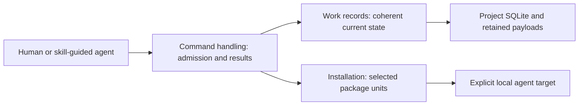
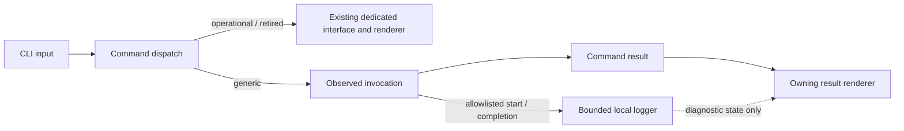
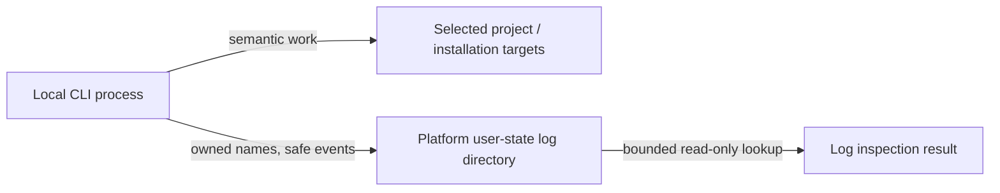

# Command interface

Owner: [MOD-010 Command handling](module.json). This is supporting contract detail, not a separate REM entity. Source-qualified clause IDs retain their existing meaning.

Model validation contract: model-document-v1

The current task interface is owned by [Command handling (MOD-010)](README.md). Its supported operational profile is `targeted-recording-v2` with `rigorloop-records-v4`. The installed executable's help and capabilities identify actual availability; target architecture does not advertise unimplemented commands.

## Subsystem design graph



Command handling owns the public interface. [Records](../MOD-011-operational-record-persistence/record-contract.md) owns current operational meaning and persistence; [Installation](../../../MOD-019-product-delivery/modules/MOD-014-verified-skill-installation/installation.md) owns package effects. The MOD-010 and MOD-011 realization views provide implementation detail without merging these responsibilities.

## Supported operational tasks

```text
rigorloop
├── change
│   ├── create
│   ├── context
│   ├── update
│   └── complete
├── review
│   ├── prepare
│   ├── show
│   └── record
├── verification
│   ├── show
│   └── record
└── store
    ├── backup
    ├── restore
    └── migrate
```

Use resource then action. Project root is explicit. Supporting account IDs are Change-local, so Review/Verification tasks include `--change ID`; they are not globally unique references. Inputs use `--input -`, with bounded UTF-8 JSON on stdin. Request and response limits are 1 MiB. Closed variants reject unknown fields/values before dependent access. Mutation requests carry an observed opaque revision; stale updates require inspection and reconciliation.

`change context` returns the current structured handoff or selected complete accounts. It does not decide engineering approval. Oversized aggregate reads explain how to retrieve the complete selector index and narrow the request; they do not truncate required content. `review prepare` observes selected subjects and constructs assessment input; it does not create approval. Assessors supply `review record` and `verification record` judgments explicitly. `change complete` requires currently supported final success and constructs the compact historical account.

[Operational recording guidance](../../../../../../templates/shared/operational-recording.md) provides request examples. [Schemas](../../../../../../schemas/targeted-recording-v2.schema.json) own the closed transport shapes; [Records](../MOD-011-operational-record-persistence/record-contract.md) owns their values. MOD-010 admits/normalizes tasks and renders truthful results. MOD-011 executes typed tasks and owns transaction outcomes. Skills use these interfaces, never SQL or private runtime-file writes.

## Maintenance and integrations

Store tasks use `store-maintenance-v1`, explicit source/destination expectations and selected preservation scope. SQLite owns ordinary transaction recovery; explicit restore/migrate resume concerns whole-store replacement, not replay of an engineering task. Backup integrity digests are transfer checks, not attachment IDs or review approval.

Installation remains under [Installation](../../../MOD-019-product-delivery/modules/MOD-014-verified-skill-installation/installation.md); diagnostics under [local observability](#local-diagnostic-logging). Git, PR and hosted CI remain optional integration surfaces and grant no workflow authority. Browser publishing remains separately qualified; this adoption does not implement a new customer browser engine.

## Compatibility and provenance

The successor has no v3 writer, raw SQL command or storage-layout fallback. An earlier qualified executable may serve explicitly retained legacy work. The bounded v3 import adapter preserves required originals and qualified current facts; old Proposal/milestone judgments are never promoted silently. Prior interface semantics are recoverable at commit `39be9c81`, under `docs/design/cli/cli.md` and `packages/rigorloop/dist/`. Installation is not workflow adoption.

## Generic commands and local observability

Operational tasks and rejected retired commands use their dedicated interface and renderer. General help/version, installation and log inspection use the shared diagnostic path. Diagnostics cannot change transaction results or engineering authority.

### Generic command results

Help exits zero and advertises implemented commands without implying retired commands work. Version exits zero and reports the package name/version. Unknown commands return actionable invalid usage. Generic results use exit classes success/warning=0, internal error=1, blocked=2, validation failure=3, invalid usage/config=4 and refused overwrite/conflict=5; Installation supplies the relevant outcomes. Recording retains its separately defined mappings.

Generic detailed JSON remains schema 1 with command, package name/version, cwd, status (`success`, `warning`, `blocked`, `error`), summary, actions, artifacts, blockers, warnings, errors and diagnostics. Actions carry type/path/status/reason; artifacts path/kind/status; diagnostics code/message and applicable path/next_action. Explicit cwd/path outputs are user-requested result data, not permission to log absolute paths. JSON stdout contains only JSON; human stdout contains human output and diagnostics may use stderr. Quiet affects nonessential human output only; debug may add diagnostic detail without removing stable fields. NO_COLOR and --no-color suppress ANSI output.

Supported generic format choices retain human/JSON, concise-human, concise-json and detailed-json; --json selects detailed JSON. Concise JSON uses schema 2, projection concise, compact encoding and only applicable common fields: schema_version, projection, invocation_id, command, operation, status, exit_code, change_id, lifecycle_revision, state_changed, next_operation, codes, finding_ids, milestone_ids, observability. Retired lifecycle-only fields are not synthesized for generic commands or imported into primary recording. Concise-human terminal results have at most two nonempty lines with command/operation, outcome, applicable identity/code, deterministically safe next operation when known, and invocation ID. Help/version, explicit detail and log-event lists are outside this terminal limit. Concise results preserve every fact necessary for safe continuation without log lookup; detailed results remain available, and shared facts, mutations and exits agree across projections. Observability (`recorded`, `degraded`, `disabled`) is diagnostic, never workflow status. No token threshold or old compatibility-window measurement gates the renderer.

### Local diagnostic logging

Each observed invocation reaching minimum logger initialization attempts one invocation-start and one invocation-complete event; interruption may leave only start. Events use schema 1, UTC RFC3339 millisecond timestamps, independent random 16-lowercase-hex invocation IDs, severity, closed command family, command, CLI version and sequence. Start uses sequence 1; complete uses 2 and additionally status, exit_code and nonnegative integer duration_ms from a monotonic source. Clock failure degrades only diagnostics. The closed family vocabulary is lifecycle, repository-setup, introspection, log-inspection and invalid-input; lifecycle is retained vocabulary, not supported retired dispatch. New observed commands require an explicit family before release.

Severities are debug/info/warning/error, with default file info and console error. Ordinary success/blocked outcomes produce no default console event; expected rejection is warning, internal/recovery/log failure is error. Extensions are allowlisted per family, not inherited from lifecycle. Do not log raw argv/requests/artifact bodies, derived request hashes, secrets/credentials, arbitrary environment, remotes, usernames/hostnames or absolute repository paths; stack traces are excluded at info/warning. Normalize or reject control/newline injection. An encoded event is at most 16 KiB; oversize becomes a bounded safe error event, never a truncated sensitive value. Do not duplicate a semantic result as a console event.

Default logs live outside the repository: XDG_STATE_HOME/rigorloop/logs or ~/.local/state/rigorloop/logs on Linux, ~/Library/Logs/RigorLoop on macOS, and LOCALAPPDATA\RigorLoop\Logs on Windows. RIGORLOOP_LOG_DIR resolves to an absolute containment root. Check the root, existing components from the nearest existing ancestor and each affected owned entry before pathname mutations without following final symlinks. Observed symlink/non-file/identity/containment failures degrade before mutation. These are observed checks, not atomic protection against another same-user or privileged pathname replacer.

Create directories/files with the most restrictive available permissions (POSIX 0700/0600). Never repair existing permissions; overly broad existing root/file access degrades with RL_LOG_UNSAFE_PATH. Owned names are rigorloop.jsonl, rigorloop.1.jsonl through rigorloop.4.jsonl and the rotation lock. Rotate before an append exceeding 5 MiB; retain active plus four archives and never rename/delete outside the root. Supported concurrent writers preserve whole JSONL records. Lock attempts are bounded to ten and 1,000 ms total per event; exhaustion, unverifiable or stale locks degrade without stealing/removing the lock. The ordinary path performs directory validation plus two bounded event appends; no daemon, database, network or unbounded traversal is involved.

File logging defaults on and may be disabled with --no-file-log or RIGORLOOP_FILE_LOG=off. File/console levels use --file-log-level/--console-log-level and matching RIGORLOOP_FILE_LOG_LEVEL/RIGORLOOP_CONSOLE_LOG_LEVEL, options overriding environment. File accepts only the four severities; console additionally accepts off. Unknown values reject before dispatch without echoing raw input. Logging configuration/availability/rotation/lookup failure cannot alter semantic command behavior, repository bytes, transaction recovery, stdout or semantic exit. Unless console is off, emit one bounded nonrecursive RL_LOG_UNAVAILABLE stderr diagnostic per affected invocation; structured observed projections still report degraded.

`logs` returns the resolved directory without creating governed state. `logs --invocation ID` validates the exact invocation ID, scans only active/four archives and returns only matching events. Distinguish RL_LOG_NOT_FOUND, RL_LOG_UNAVAILABLE and RL_LOG_CORRUPT_ENTRY; not-found cannot distinguish never-recorded from expired. Lookup is read-only, does not rerun a command or include its own lookup events, and handles unrelated corrupt/unsupported-schema lines as bounded warnings without returning raw content or interpreting unknown schemas. Local logs are not review, workflow or approval evidence.

### Diagnostic architecture and acceptance

The existing command boundary now explicitly separates the operational renderers from the observed generic path. The latter composes classification, semantic dispatch, result rendering and bounded local event writing; the event writer consumes an allowlisted projection rather than raw command inputs.





The graph supplies the additional runtime and deployment boundary; the existing CLI Context and Building Block views still own project authority and command/persistence relationships. Ordinary semantic output, explicit diagnostic lookup and private diagnostic files are different surfaces. Representative proof compares successful and rejected commands under recorded/disabled/degraded logging; checks corrupt/oversized/private input, contention, stale locks, unsafe paths and rotation; and demonstrates recorder schemas and repository bytes are unchanged. No live external task or published release is needed to establish these deterministic boundaries.


## Requirements

These stable local references reconcile the prior document contract with the current REM and Module owners linked above. They do not retain the superseded workflow or filesystem interface.

| ID | Required behavior |
| --- | --- |
| CLI-SR-01 | Inspect MUST return recorded values and separately labeled observations without authoring engineering records or choosing maintenance replacement; internal SQLite recovery may establish its already determined transaction outcome. It MUST NOT compute an authoritative next stage, approval, completion or applicability value. |
| CLI-SR-02 | Check and record MUST reject malformed records, unknown schema versions, unknown closed-vocabulary values, duplicate identities, dangling internal record references and unsafe targets before any authoritative write. Validity MUST NOT depend on whether the current workflow stage permits a proposed decision. |
| CLI-SR-03 | Every update MUST identify its expected opaque revision, declared reads and explicit task inputs. The CLI constructs one complete candidate; omission preserves existing state. Stale decisions MUST NOT be merged or replayed. |
| CLI-SR-04 | An update MUST exclude competing writers and check expected revision and declared compared reads against the candidate’s actual basis. Mismatches conflict without replay; external edits are covered at the defined observations, not locked atomically with engineering files. |
| CLI-SR-05 | Related replacements MUST be published as one logical transaction. Supported readers MUST receive a coherent before/after snapshot or an explicit busy/recovery-needed result, never a mixed snapshot presented as usable current state. A successful result means all requested bytes are durably committed. |
| CLI-SR-06 | SQLite MUST recover ordinary transaction interruption without inventing decisions. Interrupted maintenance replacement MUST retain a fence and observed recovery state for explicit finish or permitted rollback; foreign content and unknown state stop repair. |
| CLI-SR-07 | Workflow observations, including changed review subjects, failed proof or contradictory readiness claims, MUST remain separate from structural rejection and saved content. They MUST NOT silently alter decisions or prohibit recording a structurally sound blocker, invalidation or correction. A successful record result MUST explicitly limit its claim to persistence. |
| CLI-SR-08 | Repeated submission MUST NOT duplicate issues or semantic effects. A stale lost-response retry conflicts even if the first update succeeded; a fresh unchanged candidate may return unchanged without advancing revision or implying renewed approval. |
| CLI-SR-09 | All public, helper and recovery write paths MUST use the same containment, identity and transaction protections. Cross-change writes, path traversal, symlink escape and unexpected overwrite are rejected. This interface MUST NOT offer arbitrary repository file writes disguised as workflow updates. |
| CLI-SR-10 | Retired commands and unknown contracts MUST reject without fallback. Only qualified store migrate legacy-import may convert selected supported source facts with explicit disposition; ordinary reads/writes never import. |
| CLI-SR-11 | Results MUST distinguish saved, unchanged, rejected, conflict, busy and recovery-needed outcomes, name affected identities where available, and separate observations from errors. Errors MUST NOT echo arbitrary record payloads or secrets. Human and machine-readable forms must preserve the same outcome meaning. |
| CLI-SR-12 | Task mutations MUST share closed schemas, current snapshot validation, revision/read checks, atomic persistence and truthful results. Callers supply semantic values, not SQL, registry files or serialization scaffolding. |
| CLI-SR-13 | Construction MUST preserve omitted semantic values, unresolved issues, attributed judgments and unrelated current facts. Physical JSON whitespace from legacy storage is preserved in required originals, not imposed as SQLite serialization. |
| CLI-SR-14 | Context MUST honor explicit selectors, return complete selected current content and a bounded complete selector index, and distinguish omitted from absent content. It MUST NOT infer relevance, authority, approval or a next activity from selection or missing information; no pagination protocol is required. |
| CLI-SR-15 | A bounded task update MUST validate its complete combined candidate and commit all or none. Supplied entries are limited to 64 per task; the selected record/index and retained disposition reserve must fit the defined 1 MiB bounds. |
| CLI-SR-16 | Every targeted mutation MUST validate during normal execution and support a non-writing preview. Preview MUST make no reservation, return no saved claim and require the actual write to repeat freshness checks. |
| CLI-SR-17 | Public results MUST preserve the same factual scope and storage-only meaning across admitted formats. Task help MUST locate the installed closed request schema and identify its envelope; no output rendering establishes judgment. |
| CLI-SR-18 | Retirement MUST reconcile runtime dispatch, skills, resources, examples, schemas, validators, selectors and packages. Retain qualified legacy reading for import and historical source validation; remove obsolete writers and public fallback paths. |
| CLI-SR-19 | Compared reads MUST check the explicitly declared contained subjects without silently refreshing caller expectations. Reported basis remains distinguishable; no separate declared subject observation command or universal file hashing is required. |
| CLI-SR-20 | Every admitted candidate MUST have a fitting prepublication receipt. Selected content and explicit gaps remain bounded and complete; oversized requests or candidates reject before commit. Reporting failure after commitment MUST preserve the actual committed outcome and never invite semantic replay. |
| CLI-SR-21 | Scoped reads MUST expose the selected current Review, Verification, decisions and support needed for the handoff, distinguishing absent metadata and unavailable retained payloads without dumping unrelated content. |
| CLI-SR-22 | Successful Change-scoped reads MUST expose the established record contract and opaque revision from the same coherent snapshot. An actor can obtain the current expected revision without a separate inspection protocol; absent or invalid stores acquire no inferred identity. |
| CLI-SR-23 | Capabilities MUST report actual executable task availability, contract identity and observed backend standing without initializing the store, discovering a governing Change or selecting authority. |
| CLI-SR-24 | Review and Verification reads MUST return their scoped current content, support and explicit gaps. Missing information MUST NOT be presented as approval; current Change context is the resumption interface. |
| CLI-SR-25 | Review recording MUST save the supplied actual assessment against current revision and preserve undispositioned findings. Evidence replacement MUST NOT silently renew prior approvals or stale Verification. |
| CLI-SR-26 | Rendering MUST derive values from current authoritative records. Findings survive omission; explicit dispositions require the reason and accountable actor. Recovery MUST preserve selected validated state without semantic replay. |
| CLI-SR-27 | Record tasks MUST use targeted-recording-v2 with rigorloop-records-v4, and schema-4 result envelopes. Store maintenance uses its independently versioned store-maintenance-v1 input. Unknown or mixed contracts reject before mutation. |
| CLI-SR-28 | The successor MUST remove operational v3 writers and old public record-store/context families. Legacy source reading remains confined to qualified import and repository historical validation, never residue-selected dispatch. |
| CLI-SR-29 | Local observability MUST follow the Local diagnostic logging contract above, preserving bounded private non-authoritative logs. Logging cannot change command semantics, authoritative state or exit status, and is not operational evidence. |
| CLI-SR-30 | Installation, diagnostics, operational records and maintenance MUST retain their declared independent input/result domains. Init schema 2 reports actual per-unit replacement/retirement outcomes; generic logging does not run around operational tasks. |
| CLI-SR-32 | Retired workflow-context discovery MUST NOT remain a public successor command. Project capabilities and explicitly selected Change context supply factual reads without inferring activation or requirement acceptance. |
| CLI-SR-31 | The retired scripts/query-change-record.py path is not an available command. Remove exclusive callers and tests while preserving current query, validation and maintenance safety without a legacy execution fallback. |

### Boundary scan and acceptance scenarios

| Dimension | Requirement basis | Distinct outcome to demonstrate |
| --- | --- | --- |
| Input domain | CLI-SR-02, CLI-SR-15 | Unknown contracts, malformed references or unsupported scope stop the affected operation without inferred defaults. |
| State/lifecycle | CLI-SR-07, CLI-SR-25 | Progress, accepted basis, review judgment, final Verify and historical completion remain distinct; saved state alone advances none. |
| Identity/authority | CLI-SR-03, CLI-SR-19 | The actual responsible actor, declared scope and current support govern reliance; an identifier or role label does not establish authority. |
| Composition/path | CLI-SR-09, CLI-SR-18 | Changed producer and consumer contracts are reconciled together, including packaged conditional resources and referenced engineering definitions. |
| Temporal/retry | CLI-SR-04, CLI-SR-08 | A changed basis requires rereading and proportionate reassessment; an old submission does not acquire current authority on retry. |
| Failure/recovery | CLI-SR-05, CLI-SR-06 | Interrupted work exposes its actual outcome and an owned next step without erasing unresolved issues or inventing success. |
| Compatibility/migration | CLI-SR-10, CLI-SR-28 | Retired procedures remain historical; successor behavior requires explicit applicable adoption/import and cannot relabel old approval. |
| External/environment | CLI-SR-23, CLI-SR-30 | Local engineering results remain separate from installed, published or hosted outcomes; required observations must actually be made. |

## Test design

Inspect the current responsibilities and boundary scenarios against the owning REM model and Module contract. Structural checks establish format only; independent review judges semantic coverage. Runtime record behavior is exercised by the package’s operational store, update, reliance, review and maintenance tests; skill guidance is assessed in actual generated archives with the resource validator and independent scenario inspection. Required combined and negative proof is allocated in the adoption plan.
