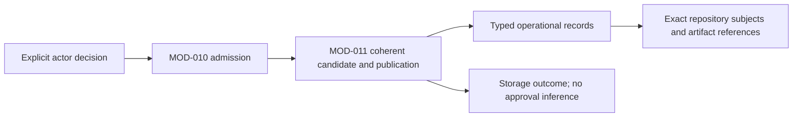

# Work record storage: successor workflow contract

This Module owns the proposed `rigorloop-records-v4` semantic representation for SR-083 and AR-040. [Governance](../../../MOD-017-engineering-governance/README.md) owns the decisions represented here; [command admission](../MOD-010-engineering-command-interface/README.md) owns requests and receipts. The [current Records contract](../../../../../../docs/design/cli/records.md) and implemented v3 schema remain the current runtime baseline. This proposal is not runtime support, a database schema migration or workflow adoption.

## Boundary and representation

V4 removes the mandatory Proposal subject and path-based registry from its public semantic representation. Supporting records use stable typed IDs within one Change; the CLI owns backend lookup and registration. Engineering definitions remain repository-held subjects, not copied IR/SR/AR tables in the operational store. Large evidence uses immutable artifact references. A serialized export is a projection of these records, not a requirement to persist one JSON file per record.

The authoritative target remains the local operational store, with SQLite as the selected storage direction under SR-074–078. To satisfy SR-083 without making database migration mandatory, the initial v4 adapter reuses the existing filesystem transaction engine with the private mapping below. It does not add v4 objects to historical v3 directories. A supported adapter must supply the atomicity and preservation below before governed recording is available; portable authoring remains usable independently. Workflow and SQLite adoption have separate acceptance criteria, with one authoritative backend selected at a time and no dual writes.

## Exact common types

All objects are closed. Every listed field is required unless marked optional; null is permitted only where stated. No semantic defaults are synthesized. Duplicate JSON keys and duplicate IDs reject. `ID`, `Text`, `Path` and `Digest` retain the v3 lexical rules: IDs are 1–80 lowercase letters/digits/hyphens starting with a letter or digit; Text contains a non-whitespace character; paths are normalized contained repository-relative paths; digests are `sha256:` plus 64 lowercase hexadecimal digits. An empty list explicitly means no entries.

| Type | Exact fields and constraints |
| --- | --- |
| Actor | `{id: ID, role}`; role is `human`, `requirement-analysis`, `system-design`, `architecture-design`, `plan`, `review`, `route`, `implement`, `verify`, or `support`. A role is attribution, not authentication or proof of independence. |
| Subject | `{path: Path, state, identity}`. `state` is `present` with a Digest, or `absent` with null identity. Absence is explicit negative evidence of deletion; it is never a fabricated content hash. One path occurs once in a subject set. |
| Ref | `{kind, id: ID}` within the containing Change. `kind` is `basis`, `candidate`, `review`, `evidence`, `decision`, `verification`, `applicability`, or `adoption`. Cross-Change or path-based implicit lookup is forbidden. |
| RequestSource | `{id: ID, locator: Text, content: Text, captured_by: Actor}`. Preserve the supplied request/proposal/incident meaning and source; a locator is attribution, never an instruction to fetch or execute it. Large exact originals may also be registered as Evidence. |
| Artifact | `{identity: Digest, byte_count: nonnegative integer, media_type: Text}`. Resolve through the artifact store; never interpret an arbitrary actor-supplied pathname as a payload location. Metadata registration alone does not establish payload availability. |
| Resolution | null for `open`; otherwise `{actor: Actor, rationale: Text, evidence_refs: [Ref]}` selecting Evidence. |
| Finding | `{id: ID, reporter: Actor, owner: Actor, subjects: [Subject], evidence: Text, required_outcome: Text, state, resolution: Resolution}`; state is `open`, `resolved`, or `deferred`. |
| FindingUpdate | `{id: ID, finding_id: ID, actor: Actor, reason: Text, account: Finding}`; account.id equals finding_id. Append in publication order to the containing review; it supplies a new current account without rewriting the original finding or earlier updates. |
| Origin | `{reporter: Actor, subjects: [Subject], evidence: Text, required_outcome: Text, rationale: Text, supporting_review: Ref or null}`. The review reference selects an immutable assessment core. Origin is captured once and never changed or removed. |
| Blocker | Finding fields plus `origin: Origin`. Current fields may be corrected explicitly; original reporter/claim basis remains in Origin. |

Common status is `pending`, `in-progress`, `blocked`, `ready`, `completed`, or `cancelled`. Stage is `requirement-analysis`, `requirement-review`, `system-design`, `architecture-design`, `design-review`, `plan`, `delivery-review`, `implement`, `code-review`, `verify`, or `support`. Unknown values reject before cross-field validation. These are recorded labels, not proof that prerequisites have been met.

## Record shapes

Every record contains `{schema_version: 4, contract: "rigorloop-records-v4", change_id: ID}`. Supporting records also have `id: ID`; IDs are unique within each kind and Change. The following table defines all additional fields. `Ref` values must select the specified kinds and actually exist in the complete candidate. Reference cycles through predecessors are invalid. Semantic lists preserve actor order; no latest-time selection is implied.

| Record kind | Additional fields |
| --- | --- |
| Change | `requests: [RequestSource]`, `workflow_contract: "requirement-first-v1"`, `requirement_basis: Ref or null`, `design_basis: Ref or null`, `plan: Subject or null`, `activity: {stage, status, owner: Actor, reason: Text}`, `work: [Work]`, `gates: [Gate]`, `blockers: [Blocker]`, `active_adoption: Ref or null` |
| Basis | `kind: requirements or design`, `subjects: [Subject]`, `decision: proposed or accepted`, `actor: Actor`, `rationale: Text`, `review_ref: Ref or null`, `predecessor: Ref or null`. A requirements basis may include unchanged IR/SR/Feature/Scenario subjects; a design basis includes applicable logical, architectural, AR and realization subjects. Acceptance is an actor assertion requiring independent applicability assessment, not an automatically derived state. |
| Candidate | `purpose: requirements or design or delivery or code`, `subjects: [Subject]`, `basis_refs: [Ref]`, `plan: Subject or null`, `scope: Text`, `coverage_rationale: Text`, `actor: Actor`, `predecessor: Ref or null`. Basis refs select Basis records; predecessor selects a Candidate of the same purpose. The rationale accounts for the complete selected scope and dependencies, including additions/deletions and dirty work. |
| Review | `target: requirements or design or delivery or code`, `scope: formal or advisory`, `gate_id: ID or null`, `candidate_ref: Ref`, `reviewer: Actor`, `contributors: [Actor]`, `independence_basis: Text`, `judgment`, `predecessors: [Ref]`, `findings: [Finding]`, `finding_updates: [FindingUpdate]`, `summary: Text`, `assessment_scope: Text`, `rationale: [Text]`, `limitations: [Text]`. Formal judgment is `approved`, `changes-requested`, `blocked`, or `inconclusive`; advisory judgment is null. |
| Evidence | `actor: Actor`, `subjects: [Subject]`, `result: passed or failed or inconclusive`, `procedure: Text`, `summary: Text`, `artifacts: [Artifact]` |
| Decision | `actor: Actor`, `subjects: [Subject]`, `decision: Text`, `rationale: Text`, `source_refs: [Ref]` |
| Applicability | `gate_id: ID`, `review_ref: Ref`, `candidate_ref: Ref`, `actor: Actor`, `value: current or stale or not-applicable`, `rationale: Text`, `evidence_refs: [Ref]`, `predecessor: Ref or null`. Evidence refs select Evidence. This is a claim about an exact review and candidate, not an approval itself. |
| Verification | `scope: scoped or final`, `verifier: Actor`, `candidate_ref: Ref`, `subjects: [Subject]`, `evidence_refs: [Ref]`, `review_refs: [Ref]`, `applicability_ref: Ref or null`, `outcome: success or failed or inconclusive`, `summary: Text`, `assessment_scope: Text`, `rationale: [Text]`, `limitations: [Text]`, `changes: [Text]`, `predecessor: Ref or null`, optional `verification_basis` using the complete v3 VerificationBasis shape. A Git-specific basis remains conditional, never a universal requirement. |
| Adoption | `source_contract: Text`, `source_identity: Digest`, `target_workflow: "requirement-first-v1"`, `actor: Actor`, `policy_subjects: [Subject]`, `guidance_subjects: [Subject]`, `candidate_identity: Digest`, `record_contract: "rigorloop-records-v4"`, `capabilities_identity: Digest`, `retained_originals: [Artifact]`, `dispositions: [{source_ref: Text, disposition: reuse or reassess or blocked or historical, rationale: Text, target_ref: Ref or null}]`, `phase: prepared or activated or unavailable`, `rationale: Text`, `predecessor: Ref or null` |

`Work` is `{id, status, owner: Actor, requirement_refs: [Text], check_refs: [Ref], blocker_ids: [ID], completion_reason: Text or null}`. Check refs select Evidence; blocker IDs select Change blockers. Completed work requires a supplied completion reason. It has no reviewer or approval field. Adequacy and failed-check effects remain semantic assessment, so failed results and truthful progress corrections remain recordable.

`Gate` is `{id: ID, target, applicability_ref: Ref or null}` with target `requirements`, `design`, `delivery`, or `code`. At most one gate per target exists within a Change. Formal reviews identify its matching gate and candidate purpose. Advisory reviews have target code and null gate_id; they cannot acquire formal judgment through a scope update. Review predecessors select formal reviews in the same gate or advisory reviews of the same scope; advisory advice can instead be cited as evidence in formal rationale. No work-item identity creates a gate.

Change requirement_basis and design_basis select Basis of the matching kind; active_adoption selects Adoption. Candidate basis_refs select Basis; Review candidate_ref selects Candidate of matching purpose; Review predecessors select Review. Verification candidate_ref selects Candidate, review_refs select Review, evidence_refs select Evidence, applicability_ref selects Applicability, and predecessor selects Verification. Applicability predecessors select Applicability in the same gate. Basis and Adoption predecessors select their own kind; Basis kind is preserved. Gate identity and target cannot change after creation. Every FindingUpdate must name an existing original finding in its containing Review. Origin supporting_review selects a formal Review. Decision source_refs may use any Ref kind. Other fields cannot silently broaden these reference domains.

When supplied, VerificationBasis is exactly `{repository_identity, remote_identity, base_branch, base_revision, merge_base_revision, head_branch, verified_subject_revision}`, all Text; no nullable/partial representation is admitted. The field retains its conditional meaning and does not make Git mandatory.

## Preservation and applicability

Basis, Candidate, Evidence, Decision, Applicability, Verification and Adoption records are immutable after creation. Review assessment fields and original findings are immutable; only append-only findings and FindingUpdates extend their current account. IDs and original contents cannot be removed or renamed. A correction creates a successor assessment/record with explicit predecessor and rationale rather than rewriting an old judgment. Change activity, selected basis/plan, work, blocker current accounts and gate/applicable-adoption pointers are explicit mutable coordination facts guarded by store revision. Clearing a reliance pointer does not delete its history.

Recording an approved formal review does not select current applicability. An actor records Applicability separately and explicitly sets the gate pointer in the same atomic batch if intended. The pointer must select an Applicability for that gate and its exact formal review/candidate; review.target, candidate.purpose and gate.target agree. A `current` record must reference an approved review. At most one pointer is selected, without deleting competing assessments. A revised candidate needs a new review attempt even when most prior evidence remains reusable; predecessor references and the rationale state what earlier assessment is retained.

Reliance also requires fresh subject observations, adequate full-scope coverage, resolved adverse evidence and applicable execution authority. A stale file, absent/present mismatch, later finding or contrary evidence is exposed to the responsible assessor; a saved `current` label does not suppress it. Final-success Verification requires a code candidate, a non-null current Applicability reference for that candidate, and its approved Review in review_refs. Structural checks verify these references; they do not certify judgment quality, reviewer independence, absence of defects or current external bytes. Missing approval can be recorded as failed/inconclusive verification, but cannot support final-success reliance.

A successor review with no findings does not resolve findings from earlier attempts. Finding current accounts and blockers retain their explicit disposition until their responsible assessor changes it. Gate/context observations expose open findings from every attempt in that gate and potentially relevant advisory findings from the Change, with exact review/finding IDs; large result sets require a bounded follow-up or explicit size-limit result, never silent omission. The actor determines relevance and adequacy rather than the CLI treating the newest attempt as a clean slate.

The same distinction permits recording an accepted requirements basis without Function/AR allocation. Requirement Review judges the obligations; System/Architecture Design completion is assessed later. An accepted Basis requires a matching approved formal Review through its Candidate, which references the earlier proposed Basis. A successor accepted Basis must preserve exactly the proposed subjects reviewed; material changes require another proposed basis and review. This avoids a self-referential acceptance cycle.

## Atomic publication and adoption

One atomic mutation unit is one Change and all supporting records touched by its batch, including gate/applicable-adoption pointers. A supplied opaque store revision binds the complete Change record set and coordination epoch. The adapter serializes participating writers, checks the revision and external read set again before publication, and preserves exact before/candidate state for recovery. Record IDs never substitute for a concurrency token. External filesystem writers are not locked by a database or CLI lock; subsequent reliance must reobserve subjects and report drift.

Recheck declared external subjects before reporting commitment. Detected drift before commit stops publication or invokes supported uncommitted recovery. Detected drift after commit reports the actual committed revision plus subject-drift and requires renewed semantic applicability; it never restores over a committed state or reports rejected/no-effects. Required referenced artifact availability must be established before publication and protected by the adapter's retention contract; incomplete payloads cannot be advertised as available evidence.

Activation is per selected Change. An actor supplies an activated Adoption record and updates active_adoption in one guarded batch, referencing a prepared predecessor and the actually observed compatible policy, installed guidance and capabilities. All dispositions and retained-original availability must be explicit. The command records this decision; it does not decide policy adoption. A project-wide completion claim requires applicable activation for every Change explicitly selected by the actor; separate Change transactions are not advertised as one atomic project migration. An unselected old Change is preserved and reported unsupported by the new runtime, not silently migrated.

Record recovery finishes or exposes the known publication outcome without replaying semantic decisions. A committed write followed by output failure remains committed and discoverable by record ID/revision; the caller rereads before any retry. An exact immutable create retry is unchanged only when its original content matches; changing a predecessor or subject with the same ID rejects. Unknown/unrecoverable state is unavailable, never an empty store or inferred rollback.

## Initial filesystem adapter and later database replacement

The initial v4 adapter uses `.rigorloop/record-store/_v4/<change-id>/` as its private Change root. A safe ID names the directory; actors never supply a record path. `change.json` is the closed storage envelope `{storage_profile: "rigorloop-record-files-v4", change: Change, records: [{kind, id, path}]}`. Each supporting record lives at exactly `records/<kind>/<id>.json`, where kind is the singular Ref kind. The envelope declares every authoritative supporting record exactly once. A missing declared object is unavailable data; an unregistered existing target is an overwrite conflict, never an empty slot. The CLI constructs and changes the envelope atomically with the selected records. The public Change value excludes this physical registry.

Reuse the existing transaction engine's full before/candidate snapshots, containment checks, writer exclusion, guarded publication and explicit recovery, with a v4 format adapter replacing hard-coded v3/path assumptions. Coordination state lives separately under `.rigorloop/record-store/_v4-coordination/<change-id>/`; it is never discovered as an authoritative Change. V4 discovery inspects only the declared private root and supported envelopes, not `docs/changes/`, transaction directories or arbitrary files. The underscore-prefixed infrastructure names cannot collide with valid v3 Change IDs; preexisting unsafe or unrecognized namespace content still blocks initialization. The existing 65-authoritative-file and 1-MiB-per-file safety bounds apply initially, including the manifest; over-limit candidates reject before writes. This is a documented adapter capacity, not silent history truncation. Later SQLite storage removes dependence on this file mapping through its own qualified migration.

V3 source directories are read only by the separately authorized importer and remain byte-for-byte unchanged. Before publishing the first v4 target, retain exact source artifacts, dispositions and the source digest; reject an occupied target rather than overwrite it. Subsequent v4 mutations affect only the selected private store. This mapping preserves local operational custody without introducing more Git-tracked Change files; `.rigorloop/record-store/` is already machine-local and ignored in this repository. Customer installation/adoption must apply the corresponding local-state exclusion without claiming that ignore rules are a backup.

Resolve Artifact payloads at `.rigorloop/artifacts/sha256/<first-two-hex-digits>/<remaining-hex-digits>` of the declared digest. Stage and verify regular-file bytes, byte count and digest before no-clobber publication; an existing object must match rather than be overwritten. Publish payloads before referencing record commit and retain them across a failed record commit. Such unreferenced objects are harmless recoverable leftovers, not evidence that the record saved. V4 performs no automatic payload garbage collection; referenced originals remain retained. The adapter must check containment, symlinks and observed payload identity before claiming availability. Corruption or later disappearance is reported as unavailable evidence, never repaired by changing the recorded digest. Backup/export and eventual retention policy remain separate SR-074–078 work; private placement is not durability qualification.

The engine must expose a durable commit point separately from result delivery. If external subject drift is detected after file replacement but before its commit marker, restore the verified before-state only under the existing guarded recovery rules or expose recovery-needed. Once committed, retain that outcome and report drift for semantic reassessment. Recovery never recomputes actor decisions. This explicit adapter boundary reconciles the current file transaction machinery with SR-044's refined commit rule.

When the SQLite store is implemented and qualified, explicit migration imports the same typed v4 records and artifacts with their identities and original provenance. Switch authoritative backend selection only after integrity, compatibility and active-work disposition succeed. The prior file store becomes retained migration evidence; no active dual-write, fallback reader or compatibility shim survives its supported retirement. Exact SQLite tables, backup/restore and physical migration remain owned by SR-074–078, not by this workflow extension.

## Compatibility and disposition

V3 bytes, paths and judgments are historical inputs after explicit selected adoption. V4 runtime does not read/write v3 or reinterpret Proposal approval as Requirement Review, milestone review as whole-change approval, or old saved applicability as present applicability. Dedicated offline import is a separately authorized migration tool, not a runtime fallback. It validates the supported source contract, archives exact originals and a digest inventory, then requires actor-supplied dispositions before constructing v4 records. Source data is never overwritten; unsupported source versions reject before target writes. Unresolved source recovery must be completed with its compatible original tooling before import.

Current public v1 transport and v3 format remain unchanged until coordinated versioned adoption. The successor client uses explicit v2 transport and v4 records; unsupported clients receive an explicit version error, not a translated old response. Retain version-pinned historical tooling only for its authorized historical recovery scope. There is no indefinite dual-write or automatic fallback in the adopted runtime.

## Test design

Use the [shared rules](../../../../../../docs/design/test-design/rules.md) and the [Operations parent groups](../../test-design.md). The following are proposed proof obligations, not passing implementation evidence.

| Group | Fault and independently observable outcome |
| --- | --- |
| Shape and reference integrity | Unknown stage, role, kind, scope and outcome; absent subject with a hash; duplicate IDs; wrong-kind and cyclic predecessor refs; unknown value plus unrelated inconsistency. Reject before publication, with unchanged store bytes/rows. |
| Requirement/design separation | Valid reuse basis has no new IR and no completed AR/Function allocation; proposed-to-reviewed-to-accepted subjects match. Future-design absence does not block requirement recording; changed accepted subjects reject structurally. |
| Assessment preservation | Candidate A changes requested, B approved in the same code gate; update a finding and compare original A bytes/core, original finding and both attempts. Advisory cannot be relabeled; a single milestone has one formal gate. |
| Current reliance | Pointer to wrong candidate, stale external bytes, absent-path reappearance, unresolved contrary evidence and a new finding after approval. Structural mismatches reject; external/semantic contradictions remain visible and prevent unsupported final reliance. |
| Publication and retry | Two actors start at one revision; only one guarded update wins. Interrupt before commit, after commit and before receipt. Independently inspect prior/candidate preservation, IDs and outcome; retry must not duplicate a decision. |
| Import and adoption | V3 source, malformed/unknown source, outstanding recovery, changed archive identity, unselected Change, partial installation and competing activation. Preserve originals and unrelated work; never infer new review authority or atomic multi-Change activation. |

Process sequencing is defined by the publication/adoption protocol; physical backend and artifact durability remain with the separate operational-store design. Existing observed realization facets remain unchanged. Alternatives rejected are reinterpretation of v3, mutable review cores, file paths as public record identities, and simultaneous authoritative backends. Revisit backend-specific transaction realization when the storage design supplies its supported adapter; do not weaken these semantic guarantees.
