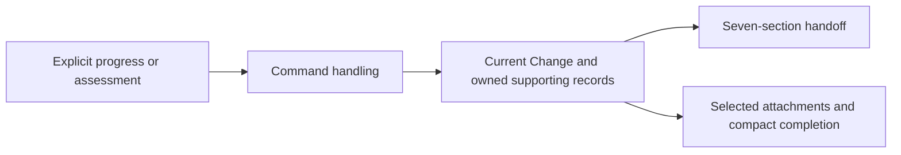

# Work record storage: current engineering handoff

This Module owns the `rigorloop-records-v4` representation for SR-006, SR-043 and SR-083/AR-040. [Governance](../../../MOD-017-engineering-governance/README.md) owns decision meaning; [Command handling](../MOD-010-engineering-command-interface/README.md) owns supported requests. The successor implements the [current v4 Records contract](record-contract.md). This project has explicitly adopted selected operational work after qualified import and original preservation. Other customer records and judgments retain their original contract until separately adopted; installation alone does not migrate them.

## Boundary and representation

Maintain the information needed to make the next sound engineering decision. Preserve older information only while its meaning still matters. The authoritative operational state is the current handoff, assembled from single-owner records. It is not an event log and need not reconstruct previous handoffs. Repository-held IR/SR/AR, Features, Scenarios, Functions, Modules and Interfaces remain the engineering definition.



SQLite is the selected first backend for v4, directly replacing the unimplemented intermediate filesystem adapter. One embedded database per local checkout stores operational accounts; the CLI opens it through MOD-011 without a database service. SQLite is a technical realization, not a new REM Module. Unmigrated v3 work requires an explicitly retained qualified prior executable; the successor has no v3 writer, v4 filesystem fallback or dual write.

## Current handoff and ownership

| Section returned by change context | Single authoritative source |
| --- | --- |
| Goal, scope and authority | Change intent and recorded authority basis/limits |
| Governing basis | Selected requirement/design Basis records and plan reference |
| Progress | Change activity and Work accounts, including remaining work and locations |
| Open issues and important rationale | Change blockers, Review findings and selected Decisions |
| Relevant evidence | Evidence summaries selected by the work and assessments that rely on them |
| Review standing | Current Review for each formal purpose, plus relevant advisory findings |
| Next action | Explicit Change next_action with owner and rationale |

The projection adds missing/conflicting/not-recorded observations, not another editable copy of facts. It never guesses a next step or grants authority. An unavailable store is not an empty handoff. Record updates at material decision changes and handoffs; do not require a record after every command, file edit or local test run.

## Engineering design stays in the repository

Git owns the current IR/SR/AR, Features, Scenarios, Functions, Modules, Interfaces, technical choices, applicable design rationale and D2 diagram sources. The SQLite database does not contain authoritative copies of these definitions or a Design entity/table. Operational subject references identify the repository basis of work and assessments without importing the engineering model into storage. A fresh clone remains understandable and buildable without another engineer's database.

An engineer changes the owning design files; change update records relevant progress and basis references; review prepare selects those files; the reviewer assesses their content and review record saves the judgment and findings in SQLite. Corrections go back to the owning files. Acceptance does not move design text into the database or create a second authoritative rationale. Skills use supported CLI tasks, never raw SQL. Generated browser views continue to derive from repository sources and require no operational database.

The [successor package boundary](../MOD-010-engineering-command-interface/README.md#successor-package-and-compatibility-boundary) selects v4 operational semantics by executing package identity. Retained v3 file-operation clauses describe the preceding package, not a live alternate backend. The successor includes only explicit qualified legacy import, never version guessing from repository state.

## SQLite representation and project association

The live database is `.rigorloop/rigorloop.db`; managed payloads remain under `.rigorloop/artifacts/changes/`. The entire runtime directory, including SQLite sidecars and temporary attachment staging, is excluded from Git. A small project-owned, Git-tracked `.rigorloop.json` declares `{schema_version: 1, project_id: UUID}`. The project owner establishes this stable identity through ordinary configuration authoring or explicit migration; it is not inferred from a directory name or Git remote. On first authorized change create, an absent database may be initialized only for that declared identity. Reads and dry-run never initialize a database or edit project configuration. A failed first creation may leave an empty correctly associated database; retry still uses absent-Change semantics. Partial or incompatible database initialization is unavailable, never an empty usable store. Connection admission protects even first creation against concurrent maintenance.

Database metadata contains project_id, an opaque store incarnation and a whole-store revision. PRAGMA user_version owns the database schema version. Opening checks project association, supported schema and required settings before returning records. A mismatch refuses access and directs explicit association/restore work; it does not rewrite either identity. Supporting IDs retain their Change-local scope. An expected Change revision is bound to the store incarnation; an explicit restore replaces that incarnation so pre-restore update tokens cannot silently become valid again.

| Relational responsibility | Intended structure and query purpose |
| --- | --- |
| Project metadata and Changes | Project association, database schema version, per-Change revision, intent, authority, activity and next action. |
| Work and issues | Named work accounts, Change blockers and Review findings with owner, state and disposition; query actionable work directly. |
| Bases, subjects and selections | Repository references and assessed/reported subject information, plus selected requirement/design bases and formal Reviews. These are operational references, not copied design definitions. |
| Reviews and Verification | Current prepared scope, attributable assessment, applicability/support standing and selected dependencies. |
| Evidence and decisions | Procedure, result, relevant scope and important operational rationale. |
| Attachments and supporting relationships | Change/name metadata and typed reference relationships needed for retained support and safe cleanup. No large payload blobs. |
| Completion and notes | Self-contained historical acceptance and explicit annotations, independent of later working-record compaction. |

Use relational keys, foreign keys, indexes and constrained status fields for identity, references and common queries. Queryable state is not hidden in a single Change JSON blob. Small structured explanatory fields may use bounded JSON where no independent query relationship is needed. The table mapping and selected Node binding below govern implementation; executable migrations remain product-source deliverables. Neither the browser's Rust engine nor a hosted service is required for this store. The Records v4 JSON exchange contract and database schema version are separate domains. Database migrations and package resources are tracked product source; live project databases are not.

## Relational schema and query boundaries

Database schema 1 maps the existing v4 record contract below; it introduces no new engineering entities. Public JSON field ownership remains in Current records. Tables expose identity, state, scope, selectors and relationships as columns. Bounded explanatory objects such as an Actor, observation, intent or disposition may use validated JSON; required relationships and status values must not be hidden inside those objects.

| Table family | Key and relational content |
| --- | --- |
| project | One row: project_id, store_incarnation and store_revision. PRAGMA user_version alone owns the database schema number. store_revision advances on every committed record mutation; it supports whole-store maintenance preconditions. |
| changes | Primary key change_id; current workflow/activity/status, per-Change revision and explanatory intent/request/authority/next-action fields. A Change has no mandatory previous-revision rows. |
| accounts | Primary key `(change_id, kind, id)`; kind is basis, review, evidence, decision, verification, adoption or work. Foreign key to changes. This is an identity registry with no record-body JSON. |
| bases, reviews, evidence, decisions, verifications, adoptions, work | One typed row per account. Each has the same composite key, a constant checked kind and a foreign key to accounts. Store queryable purpose/scope/status/judgment/applicability/result/support_state separately; preserve the existing record's other fields in their owning row or child relationship. |
| blockers, findings | Blocker key `(change_id, id)`; finding key `(change_id, review_id, id)` referencing a Review. Columns include state, owner, description and required outcome, with nullable attributable disposition. Omitted issues survive replacements. |
| selections | Key `(change_id, slot)`; target account composite foreign key. Slots are requirement-basis, design-basis, active-adoption and one review slot per formal purpose. Candidate validation checks required kind, purpose and applicability; membership alone grants no acceptance. |
| account_refs | Key `(change_id, owner_kind, owner_id, relation, ordinal)`; both endpoints reference accounts within that Change. Relations realize basis review, prepared bases, assessment evidence, Verification reviews/evidence, Decision sources and Work checks. Ordered fields retain order; repeated targets are rejected where the public contract forbids duplicates. |
| subjects | Key `(change_id, owner_kind, owner_id, role, ordinal)`; owner is the Change or an account, enforced by checked owner form plus foreign key. Store path, present/absent state and nullable compared identity. Role distinguishes current plan, prepared, assessed, governing and evidence subjects; a path is not a global identity for every assessment of that file. |
| work_blockers | Work and Change-blocker foreign keys in the same Change; preserves Work blocker_ids as queryable relationships. |
| support_summaries | Key `(change_id, owner_kind, owner_id, ordinal)` for Review or Verification. Store assessed result/explanation/limitations and source account reference; separate support_subjects rows keyed by that summary and ordinal carry its assessed basis. Replacement of source evidence cannot overwrite these assessor-owned values. |
| attachments, attachment_refs | Attachment key `(change_id, name)` with media_type and observed byte_count. Reference rows identify an Evidence, support summary or Completion owner and attachment name with foreign keys. Payloads remain external files. |
| completions, completion_notes | At most one Completion per Change; ordered explicit notes reference that Change. Preserve original Verification ID as historical attribution, not a live foreign key that would prevent allowed compaction. Completion-selected attachments remain live protected relationships. |

Use STRICT tables, NOT NULL for required fields, checks for the existing closed vocabularies and deferred foreign keys where the complete candidate contains cycles. A Basis can refer to its approving Review while that Review refers to the Basis. Validate the complete candidate and commit-time constraints together; never disable reference enforcement to import such a cycle. Deletes use NO ACTION with deferred checking, not broad cascades that could erase unresolved work. Explicitly remove an authorized unused set and its outgoing child rows; surviving incoming references block the transaction. [SQLite foreign-key semantics](https://www.sqlite.org/foreignkeys.html) supply the constraint mechanism.

The registry is internal, not a generic public CRUD interface. Each committed registry entry must have exactly one matching typed body. Candidate admission and post-import integrity validation enforce this totality and legal relation endpoints, beyond what foreign keys alone prove. An absent typed body is corruption, never an empty account. Relations and owner-role values form schema-owned closed vocabularies derived from the existing record fields; executable migration DDL and negative validation cases must implement the mapped fields above without inventing additional public record kinds.

The first indexes support changes by activity/status; blockers/findings by Change and state; reviews by Change, purpose and applicability; evidence by Change and result; subjects by path and owner; and both directions of account/attachment references. change context reads the selected Change, selections, open issues and required support in one snapshot. It does not load all Changes. Cross-Change subject queries can use the subject index later without making a new public history command part of this adoption.

### Current record relationships

This logical data diagram groups typed tables for readability. Arrows label containment or references; the table mapping owns exact keys and constraints. Repository subjects are references, not copies of the engineering model.

<!-- architecture-diagram: sqlite-record-relationships -->

```d2
direction: down
project: "Project association"
change: "Change\nIntent, authority and revision"
work: "Work and open issues"
accounts: "Current typed accounts\nBasis, Review, Evidence\nDecision, Verification, Adoption"
relations: "Selections and dependencies"
subjects: "Repository subject references"
support: "Assessed support summaries"
completion: "Compact completion"
attachments: "Attachment metadata and references"
project -> change: "Owns Changes"
change -> work: "Owns current progress"
change -> accounts: "Owns Change-local identities"
change -> completion: "At most one final account"
accounts -> relations: "Reference current accounts"
accounts -> subjects: "Identify prepared or assessed basis"
accounts -> support: "Retain relied-on meaning"
support -> attachments: "Select useful bytes"
completion -> attachments: "Protect selected payloads"
```

## Typed CLI-to-storage boundary

[IF-003](../../../../interfaces/IF-003-operational-record-access-and-publication/interface.json) is the internal engineering contract consumed by MOD-010. Its v4 inputs and outputs are closed typed values. They are not command-line strings, SQL statements, database rows, serialized record files, connection handles or filesystem readers. The following names describe contract types, not installed JavaScript exports or a new network protocol. Record field meanings remain owned by Current records; public task inputs remain owned by MOD-010.

| Type | Required fields and variants |
| --- | --- |
| QueryRequest | `{project_root, query}`. project_root is the explicitly resolved local project root. query is one of the variants below; it cannot identify a database file directly. |
| Query | `{kind: "change-context", change_id, selectors: [Selector] or null, include_observations: boolean}`; `{kind: "review", change_id, id}`; `{kind: "verification-context", change_id}`; `{kind: "verification", change_id, id}`; or `{kind: "store"}`. Null selectors requests the complete handoff; a selected list is nonempty and bounded by the public contract. Selector is the existing context kind/ID pair. |
| TaskRequest | `{project_root, task, change_id, item_id: ID or null, expected_revision: Text or null, reads: [Subject], input, receipt_profile}`. task is one of the mutation tasks below. Null expected_revision is allowed only for absent-Change creation. Input is that task's closed public semantic input after transport fields are removed; it is not an arbitrary object patch. |
| MaintenanceRequest | `{project_root, task, preview: boolean, input, receipt_profile}`. task is store.backup, store.restore or store.migrate; input is its defined initial or resume variant, including its own source/destination expectations. No Change revision is substituted for a whole-store expectation. Preview is permitted only for the initial operations whose public contract admits dry-run; resume requires false. |
| ReceiptProfile | record-json-v1, record-text-v1, maintenance-json-v1 or maintenance-text-v1. MOD-010 owns their encoding and fixed bounds; caller-supplied formats, functions and plugins are not admitted. These internal profiles are not skill configuration or a new public workflow mode. |

Task values are change.create, change.update, change.complete, review.prepare, review.record and verification.record. Review/Verification tasks require item_id; Change tasks require null. Dispatch preview through preview_record_task and execution through execute_record_task with the same request type. Command spelling, stdin parsing, transport versions and format choice are resolved by MOD-010 before dispatch. Storage independently checks the variant, current project association, expected revision, typed references, authority-bearing fields and allowed effects; a parsed request is not permission or review adequacy.

ReadOutcome is `{kind: "read", status, committed: false, records: [RecordValue], projections: [Projection], diagnostics: [Diagnostic], identity}`. A RecordValue is `{kind, id, value}` using the selected v4 record type. Projection is `{query_kind, value}` for the task-owned handoff, review standing, verification context or store observation; it is derived, not another editable record. identity is `{record_contract: Text or null, change_revision: Text or null, store_revision: Text or null}`. Populate identities only when established from the coherent observation. Unavailable selected content produces a diagnostic, never an invented empty record.

MutationOutcome is `{kind: "mutation", status, committed: boolean or null, changed: ChangeSummary or null, diagnostics: [Diagnostic], identity}`. MaintenanceOutcome has kind maintenance and additionally the task-owned maintenance details. ChangeSummary is `{count, entries: [RecordKey], omitted}` with nonnegative integers and count equal to entries.length plus omitted. A RecordKey is `{kind,id}` within the selected Change; a finding additionally names its review_id. A changed finding also lists its containing Review. Entries are deterministic and bounded; count includes all changed current records even when optional detail is omitted. Exact no-op and precommit rejection have an empty summary. Preview describes prospective records while committed remains false; unknown effects use changed=null and carry a diagnostic explaining the limit. Read outcomes imply an empty change summary. Maintenance reports an empty summary for backup and null for a whole-store replacement whose individual changed accounts are not enumerated; its maintenance details identify the authoritative effect scope.

Status and primary Diagnostic codes use MOD-010's [outcome mapping](../MOD-010-engineering-command-interface/README.md#outcome-mapping). A Diagnostic is `{code,message}`; database error numbers and raw driver messages are private diagnostic detail, not the supported public taxonomy. MOD-010 translates typed records/projections into the task's public result and text presentation; MOD-011 supplies current facts and never manufactures the next engineering decision. These type names do not create additional public versions; the selected v4 adapter is the implementation boundary.

Before an ordinary commit, MOD-011 submits the bounded typed outcome summary to the shared pure MOD-010-owned receipt codec for its selected fixed profile. The codec sees no database, filesystem reader or write authority; it must deterministically prepare the mandatory receipt within its bound. It is an internal product dependency, not a function supplied by a skill or arbitrary callback in TaskRequest. Optional changed-entry details may be omitted with explicit counts. Successful encoding is not a claim that commit has happened: only the actual storage outcome permits emission as saved. A failed commit emits the failure outcome; a later rendering/output fault preserves established commitment. This retains receipt readiness without exposing record-file serialization or an executable preview candidate.

V3 inspect/prepare/publish/recover operations in retained prior executables keep their original byte-preservation and callback realization for explicitly selected unmigrated work. They do not define the v4 API. V4 executes typed tasks against SQLite and performs its internal transaction recovery on opening. Explicit backup restoration or migration resume remains a MaintenanceRequest, never a replay of a failed engineering task. No new Interface or compatibility shim is introduced for the SQLite binding.

## SQLite binding and software organization

Select the built-in node:sqlite DatabaseSync API for the initial Node 24 profile, minimum 24.15.0, with the module's backup API for database snapshots. This fits the existing Node CLI and avoids adding an npm native-addon build or a separate Rust record service. [Node 24.15.0](https://nodejs.org/en/blog/release/v24.15.0) advances node:sqlite to release-candidate status and includes SQLite 3.51.3. Require that SQLite minimum as well as the Node floor and reject known withdrawn or unqualified builds: [SQLite 3.51.3](https://www.sqlite.org/releaselog/3_51_3.html) fixes a WAL-reset corruption defect affecting the earlier library used by the local Node 24.14.1 environment. Keep the binding behind MOD-011's adapter; release-candidate API status remains a compatibility consideration. Qualify the selected patched Node/platform builds before adopting the runtime floor in package metadata and CI; the minimum is not a recommendation to ignore later fixes. The successor package and CI declare this runtime floor; earlier published packages retain their original identity. Candidate qualification and publication remain separate decisions.

Use bound parameters for values and packaged SQL for schema/queries. Configure defensive mode, disable loadable extensions and double-quoted string literals, enable foreign keys and verify WAL/FULL. Ordinary writes use a bounded 5-second busy timeout; failure returns busy. Read integer revisions as BigInt internally and serialize opaque revision tokens without JavaScript number truncation. A Change token combines store incarnation and its integer revision; whole-store tokens combine incarnation and store_revision. Both counters are nonnegative SQLite 64-bit integers; exhaustion rejects without wraparound. Exact no-ops do not advance either counter. SQLite settings and counters do not authenticate actors.

Keep synchronous work bounded to the selected snapshot/transaction. The backup API may be awaited while maintenance exclusion remains held; do not hold an ordinary Change write transaction over an asynchronous callback. Unknown/future schemas and unsupported runtime profiles reject before record mutation. CLI JSON remains on stdout; runtime warnings and diagnostics remain separate. No runtime fallback selects a different binding silently.

### Persistence software organization

These are cohesive implementation responsibilities within MOD-011, not new Modules or mandated filenames. Package SQL migrations beside the adapter's product sources and include them in the distributed CLI; user data never enters that package.

<!-- architecture-diagram: sqlite-software-organization -->

```d2
direction: down
cli: "MOD-010\nTask admission and results"
store: "MOD-011 — Work record storage" {
  candidate: "Current-account rules\nCandidate and dependency validation"
  adapter: "SQLite adapter\nQueries, revisions and transactions"
  payloads: "Named attachment handling\nCapture, references and cleanup"
  maintenance: "Backup, restore and migration\nAdmission and activation recovery"
  migrations: "Packaged schema migrations"
}
binding: "Node runtime\nnode:sqlite"
cli -> store.candidate: "Explicit Change tasks"
cli -> store.maintenance: "Explicit store maintenance"
store.candidate -> store.adapter: "Validated current-state updates"
store.adapter -> store.payloads: "Coordinate selected bytes before commit"
store.maintenance -> store.adapter: "Snapshot or validate staged state"
store.maintenance -> store.payloads: "Capture or restore selected payloads"
store.maintenance -> store.migrations: "Apply supported ordered upgrades"
store.adapter -> binding: "Prepared SQL and transaction operations"
```

## Common types and identity

All record objects are closed; listed fields are required unless marked optional or nullable. Reject duplicate keys, unknown values and invalid reference kinds before consistency checks. Exact JSON schemas are an implementation deliverable that must preserve these semantics.

- ID: 1–80 lowercase letters/digits/hyphens, starting with a letter or digit. Change IDs are project-local. Supporting IDs are unique within Change and kind; finding IDs are unique within their Review. No cross-Change implicit lookup.
- Actor: `{id, role}` with role human, requirement-analysis, system-design, architecture-design, plan, review, route, implement, verify or support. Attribution is not authentication or proof of independence.
- Text: a non-whitespace string. Path: a normalized contained repository-relative path. Subject: `{path, state, identity}` with state present/absent; identity is a SHA-256 digest for a mechanically compared present file, otherwise null. An absent file has null identity. Present with null identity is a reported basis, never mechanical proof of unchanged bytes. No source copies or whole-repository snapshot are required.
- BasisObservation: `{method, actor, scope, summary}` with method reported, compared or unknown. Compared requires actual scoped observations, not a timestamp or actor assertion. Missing support remains unknown.
- Ref: `{kind, id}` selecting basis, review, evidence, decision, verification or adoption within the same Change. References resolve against the complete proposed current state. Names and IDs do not replace the opaque store revision used for concurrency.
- Issue: `{id, reporter, owner, scope, description, required_outcome, state, disposition}`. State is open, resolved, withdrawn or deferred. Open has null disposition; other states require `{actor, reason, follow_up}` where follow_up is Text or null. Deferral requires an accountable follow-up and cannot waive mandatory acceptance. Omitting an issue preserves it.
- Attachment: `{name, media_type, byte_count}`. Name is unique within a Change, 1–120 ASCII letters/digits/dots/underscores/hyphens, starts alphanumeric and is neither a path nor `.`/`..`. Payload identity is its Change and name; hashes and deduplication are not required. byte_count is engine-observed metadata, not an actor-maintained integrity promise.

Current status is pending, in-progress, blocked, ready, completed or cancelled. Activity stage is requirement-analysis, requirement-review, system-design, architecture-design, design-review, plan, delivery-review, implement, code-review, verify or support. Status is a reported fact, not proof of a gate or authority.

### Retrievable accounts and disposition capacity

Every current Change or supporting account must fit its complete smallest supported exact-selector response within the public 1 MiB JSON limit. Measure the encoded UTF-8 bytes, including escaping, response metadata and maximum supported revision/identity overhead, rather than only the SQL row or unescaped narrative. The aggregate context may require narrower selectors; an individual retained account cannot become inaccessible by accumulation. The Change-only query additionally returns the complete derived available_selectors index defined by MOD-010, including unselected/advisory Reviews. Its encoded response plus Issue-disposition reserve must also fit 1 MiB after every mutation/import. This supplies a known bounded discovery route when aggregate context is too large; rejecting new growth preserves access to every existing obligation.

Each non-null Issue disposition is limited to 16 KiB of encoded UTF-8 JSON. For every retained Issue occurrence in that smallest response, reserve max(0, 16 KiB minus the encoded current disposition size), plus enough bytes for the longest permitted issue-state spelling. Apply this reserve to open, deferred and disposed issues until explicit safe compaction, so later resolution or correction of an earlier short disposition remains possible. The encoded response plus this reserved growth must fit the bound after every mutation and import. Replacing a disposition within its limit consumes previously reserved space; it cannot exceed the invariant merely because the account was otherwise full.

Reject growth that would violate retrievability with size-limit before commitment, preserving existing meaning. Additional concerns can be recorded in another prepared Review; all retained open concerns remain visible regardless of the selected formal Review. Issue compaction still requires explicit disposition and resolved reliance. There is no automatic deletion, truncation, duplicate activity history or new pagination/cursor protocol. Input/output schema artifacts and real boundary tests must enforce these limits at implementation.

## Current records

All records carry `{schema_version: 4, contract: "rigorloop-records-v4", change_id}`. Supporting records also carry id. The engine supplies these fields.

| Record | Current content |
| --- | --- |
| Change | `intent: {goal, scope, exclusions}`, `request: {locator, content, captured_by}`, `authority: {source, allowed, limits, reported_by}`, `workflow_contract: "requirement-first-v1"`, `requirement_basis: Ref or null`, `design_basis: Ref or null`, `plan: Subject or null`, `activity: {stage, status, owner, reason}`, `work: [Work]`, `blockers: [Issue]`, `reviews: [{purpose, review: Ref}]`, `next_action: {action, owner, rationale} or null`, `active_adoption: Ref or null`, `attachments: [Attachment]`, `completion: Completion or null`, `completion_notes: [{actor, reason, explanation}]` |
| Basis | `kind: requirements or design`, `subjects: [Subject]`, `decision: proposed or accepted`, `actor`, `rationale`, `review: Ref or null`. Creating or replacing a Basis with decision=accepted requires the current applicable formal approved Review of that subject scope. Later support changes preserve the recorded decision and expose a current reliance gap, as defined below. |
| Review | `purpose: requirements or design or delivery or code`, `scope: formal or advisory`, `prepared: ReviewInput`, `assessment: Assessment or null`, `applicability: {value, actor, rationale, observation}`, `findings: [Issue]` |
| Evidence | `actor`, `reported_at: Text`, `procedure`, `scope`, `subjects: [Subject]`, `observation: BasisObservation`, `result: passed or failed or inconclusive`, `summary`, `limitations: [Text]`, `attachments: [name]` |
| Decision | `actor`, `scope`, `decision`, `rationale`, `source_refs: [Ref]` |
| Verification | `scope: scoped or final`, `verifier`, `subjects: [Subject]`, `governing_basis: [Subject]`, `review_refs: [Ref]`, `evidence_refs: [Ref]`, `observation: BasisObservation`, `outcome: success or failed or inconclusive`, `summary`, `rationale: [Text]`, `limitations: [Text]`, `support: [SupportSummary]`, engine-maintained `support_state: current or needs-reassessment` |
| Adoption | `actor`, `source_contract`, `target_workflow`, `source_basis: Text`, `compatibility: Text`, `disposition: Text`, `phase: prepared or activated or unavailable`, `rationale`. It describes selected transition facts, not a general activity history. |

Work is `{id, status, owner, scope, locations: [Path], remaining: Text or null, check_refs: [Ref], blocker_ids: [ID], completion_reason: Text or null}`. Completed/cancelled work requires a reason. Check refs select Evidence; blocker IDs select Change blockers. There is no milestone approval field.

ReviewInput is `{subjects: [Subject], basis_refs: [Ref], plan: Subject or null, scope: Text, coverage_rationale: Text, prepared_by: Actor}`. Basis refs select Basis; a selected plan is included among subjects. Assessment is `{reviewer, contributors: [Actor], independence_basis, judgment, assessed_subjects: [Subject], governing_basis: [Subject], summary, rationale: [Text], limitations: [Text], evidence_refs: [Ref], support: [SupportSummary]}`. Formal judgment is approved, changes-requested, blocked or inconclusive; advisory judgment is null and cannot support a formal gate.

Applicability value is current, needs-reassessment or not-applicable; observation is a BasisObservation. Missing assessment cannot be current. SupportSummary is `{source: Ref, scope, basis: [Subject], result: Text, explanation, limitations: [Text], attachments: [name]}`: the small amount of assessment-owned support still needed to explain the conclusion if a working Evidence is replaced. It is not an independently editable duplicate of current evidence. Selected attachments are referenced separately and retained only when their bytes matter. A changed current evidence summary never rewrites this assessed support.

Open findings from every retained formal/advisory Review remain visible, including unselected review accounts. Selecting a replacement Review is never a disposition of those findings.

There is one selected formal Review per purpose in Change.reviews. Reassessment can update that same Review ID; optional advisory Reviews remain distinct. Candidate, Gate, Applicability and FindingUpdate are no longer separate v4 record kinds. Their former unimplemented predecessor chains are retired, not retained as aliases. Historical v3 representations remain governed by their original supported tooling until adoption.

## Updating current state without losing decision meaning

Current Basis, Evidence, Decision, Review and Verification accounts can be explicitly replaced through their owning tasks. Use the inspected store revision; omission preserves neighbors. No mandatory previous version, event stream, retry ledger of semantic actions or summary of each intermediate test run is created.

A Review preparation updates its current proposed input; it does not rewrite its last assessment or assert that the reviewer examined the new input. An unchanged input leaves standing unchanged. Changed input conservatively marks needs-reassessment. The responsible engineer can explicitly establish harmless continuation against the retained assessed scope and governing basis; material or unknown effects require independent reassessment in the same gate. This may replace superseded assessment detail after open issues are dispositioned. Preserve only the support needed for the current decision, including cumulative comparison where prior approval is still relied upon.

Replacing an assessment resets its applicability to needs-reassessment unless the same task supplies an explicit valid current disposition for the new assessment. An old current label cannot silently carry over to a replacement judgment.

A new evidence result can replace the previous account for the same procedure and relevant scope. A smoke-test pass cannot replace an unrelated integration failure. Material scope/procedure changes require another Evidence ID. A replacement affecting a selected Review or Verification exposes support changes; it cannot silently renew that assessment. Relevant dependencies trigger needs-reassessment or a displayed verification-support gap until the responsible actor supplies a disposition. Unknown effects are not harmless by default. An exact no-op creates no invalidation or new record.

While the Change is active, Verification support_state persists in the same atomic update as a support change. Replacing referenced Evidence or a Review's assessment, changing its prepared input, applicability or findings, or changing the Verification's governing basis marks it needs-reassessment, even when the same record ID remains. Final Verification also depends on the Change's scope/authority, selected bases/plan/reviews, work completion and issue dispositions; changes to these completion inputs mark its support needs-reassessment. Scoped Verification follows its declared scope and dependencies. Next-action wording, unrelated records, cleanup of unused disposed detail and exact no-ops do not invalidate support. Unknown dependency effects remain needs-reassessment. Merely accepting an unchanged reviewed Basis or selecting its approving Review does not change that Review's assessed engineering basis.

Basis acceptance admission and continued reliance are distinct. Creating or replacing a Basis with decision=accepted requires current compatible formal approval of its subjects. Once recorded, later Evidence or Review changes do not automatically rewrite that actor's decision to proposed. Structural validity continues to require a resolving typed Review reference; it does not require perpetual approval. Reads expose when an accepted decision no longer has current compatible support. Corrective Evidence and adverse Review updates remain recordable. Any dependent gate reliance, successful final Verification or closeout requires currently supported acceptance, not the accepted label alone. Reestablishing support does not itself renew an earlier Verification assessment.

A later current Review cannot clear an earlier Verification support gap. Only verification record can renew support by submitting the verifier's explicit assessment against the reconciled current inputs; even an otherwise identical submission must explicitly reassess a needs-reassessment account. The engine sets current after the submission's admission and dependency checks, not from a caller-supplied flag. Current means no unresolved recorded support change, not a proof of unreported repository stability or a successful outcome. The original outcome and assessed support remain readable while needs-reassessment, but cannot qualify closeout. Proportionate reassessment may reuse unaffected checks and approval; it neither requires a new Code Review for an evidence-only retry nor a permanent history of support changes.

Findings and blockers survive omission and newer clean reviews until an explicit disposition. Responsible actors decide resolution, withdrawal or deferral; persistence enforces attributable input and does not decide adequacy. Disposed issue detail and unreferenced supporting records may be explicitly compacted with a reason once no current decision or retained account needs them. Do not silently compact during reads or remove open issues, selected bases/reviews in active Changes, active authority or required attachments. Closed compaction follows the completion rules below. Evidence loss must remain reportable even when the missing payload prevents renewed reliance.

## Completion record and preservation

Completion is a self-contained historical account: `{actor, verification_id: ID, summary, reason, delivered_scope, governing_references: [Text], acceptance: [Text], limitations: [Text], retained_attachments: [name]}`. The acceptance entries identify the actual review and final Verify conclusions, their scope and accountable sources; no full log is mandatory. The CLI constructs this account from the explicit closeout input and selected current support without inventing assessment meaning. verification_id retains the selected final Verification as historical attribution, not a live Ref requiring permanent retention of its working account. Together with the other supplied fields, it permits exact closeout-input comparison after compaction; acceptance entries are generated once and are not recomputed on retry.

Only change complete writes completion and verify/completed activity atomically. It requires an applicable whole-change approval, current successful final Verify, accepted governing bases and reviewed delivery basis, finished/dispositioned work and no unresolved mandatory concern. Authority and judgment adequacy remain actor responsibilities. A scope-wide final Verify does not become another approval merely because closeout is saved.

Once complete, reads return this historical account without comparing its subjects to the current repository or advertising present system health. Later regression starts a new Change whose request locator cites this one. An error in the original assessment can receive an explicit completion note; the original account is not silently rewritten. Closed Changes permit notes and safe compaction of unused working detail, not resumed work or another final success. Selected completion attachments remain stable while referenced; all other supporting material may be dropped when no surviving obligation requires it. Exact closeout retries preserve the original account and do not reassess current repository files.

Closed compaction may explicitly remove completed/cancelled Work and obsolete supporting records together. When a selected Basis, Review or Adoption is dropped, clear only its obsolete Change coordination selector in that same transaction. Validate references against the entire surviving candidate: a retained Work, assessment, decision or other record still protects its dependencies. Remove mutually referencing unused accounts together or keep them; never rewrite a surviving assessment to make deletion possible. Completion, its notes, original goal/request/authority, open issues and completion-selected attachments are protected. A deferred issue remains protected until its accountable follow-up is preserved in the completion account or explicitly transferred to another owner; deletion cannot count as resolution. The actor identifies no-longer-needed detail and supplies the retention reason. Reads show compacted detail as unavailable, not as a new empty active workflow, and do not invalidate historical completion.

## Selective attachments

Working outputs such as a repeatedly overwritten test-output.txt stay caller-owned until explicitly selected for retention. A task attachment input names a contained regular source file, a safe attachment name and media type. The CLI stages its bytes, records the actual size and publishes a managed copy before committing the Evidence reference. It never accepts a storage destination, follows symlinks or interprets the file as instructions. Detect source changes during capture and reject uncertain collection; this is a bounded file copy, not a universal filesystem snapshot.

The initial bound is 64 attachments and 64 MiB total new payload bytes per task, streamed separately from the 1 MiB JSON request limit. Larger reports must be reduced or explicitly left external with an unavailable-retained-payload limitation; no silent truncation. These are adapter limits, not a requirement to archive output. Names are scoped to Change and independent equal files may be stored twice. Existing names cannot be replaced while referenced; new content uses a new name. An unreferenced orphan from a failed record commit can be reused only after exact byte comparison, or explicitly removed under guarded cleanup. No digest or automatic deduplication is needed.

Payloads live privately at `.rigorloop/artifacts/changes/<change-id>/<name>`. A working Evidence can be replaced without retaining its old log if no current assessment or completion still needs it. Explicit compaction removes the reference before payload cleanup; interrupted cleanup can leave an unreferenced file but cannot leave a supposedly available referenced payload deleted. Missing or unreadable retained files produce limitations. New attachments and new claims of availability require actual bytes; preserving an old unavailable reference while reporting its loss is allowed.

## Atomic publication and recovery

One command publishes one coherent Change update in a short SQLite transaction, including selected supporting rows, issue dispositions, dependency invalidation and the next revision. Use BEGIN IMMEDIATE for mutation admission, check the expected revision inside the transaction, build the complete candidate against that snapshot, validate references and receipt readiness, recheck declared external observations, then commit. A stale revision rejects; it is not automatically merged. Tests, design authoring and review execution happen before recording, outside the transaction. Database writer contention uses a bounded wait and returns busy when exhausted; it does not authorize replay of stale semantic intent.

The initial deployment profile is one local machine with a supported local filesystem, WAL mode, synchronous=FULL and foreign_keys=ON on each connection. Verify effective settings rather than silently accepting unavailable durability or reference checks. SQLite owns database locking, journaling and transaction recovery. Local WAL permits concurrent readers with one writer; network/shared-filesystem deployments are outside this initial profile. Journal settings and platform behavior must be qualified with the selected binding and package. [SQLite transactions](https://www.sqlite.org/lang_transaction.html), [WAL](https://www.sqlite.org/wal.html) and [connection settings](https://www.sqlite.org/pragma.html) provide the mechanism basis; they do not establish RigorLoop's application correctness.

Read related records in one consistent read transaction. A logical read does not alter engineering records, initialize or migrate the schema, compact evidence or choose a recovery outcome; opening SQLite may perform its own journal recovery and coordination. Dry-run validates a candidate without engineering-record writes or attachment publication and reserves nothing for later execution. Temporary connection-admission leases described below are coordination only. Recheck on actual execution. Direct SQL or external editing of the live database is unsupported; repository design files remain outside SQLite's lock and retain the declared observed-check limits.

Before commit, any failed application condition aborts the transaction; do not leave an errored statement's earlier updates eligible for accidental commit. After confirmed commit, response or diagnostic failure cannot roll back the saved decision. If commit outcome cannot be established, report committed unknown and require inspection; a new connection reads recovered current facts before any reconciled retry. SQLite recovery never proves an engineering judgment or repairs arbitrary corruption. Unreadable, corrupt, wrong-project or unsupported-schema stores remain unavailable; never replace them with an empty database or guessed records.

The v4 contract has no application-managed before/candidate record-file journal, per-record publication protocol or caller-selected complete/restore/finish action. The old change recover draft is withdrawn. Supported v3 explicit recovery remains version-scoped. Backup restoration, import and attachment cleanup have distinct explicit scope; none is automatic replay of a failed command.

### Attachment coordination

Capture selected report bytes in a private unique staging file before acquiring the database writer. Detect unstable or unsafe sources; stage without overwriting an existing retained name. Inside the short record transaction, validate the Change revision and destination, publish a stable managed copy with the qualified filesystem durability steps, then insert its metadata and references before commit. A copied payload followed by a database rollback can leave an unused file, never a committed reference to bytes not successfully captured. SQLite does not make external file writes transactional.

Database writers also serialize managed-name publication and explicit unused-payload cleanup. Before deleting an unused managed name, acquire writer exclusion and recheck that no committed reference or retained metadata protects it; keep exclusion through the deletion. Removal of referenced metadata first commits the authorized retention update, then cleanup reacquires exclusion and rechecks current use. A concurrent actor may have reused or selected the name; such a file must remain. Staging is invocation-owned and is not swept while capture is active. Failed cleanup leaves a reportable unused file; it does not undo the record update. No background deletion based solely on age or a directory scan is admitted.

### Inspect after an interrupted update

This target path starts with a lost or interrupted recording call. The caller inspects current context; SQLite resolves its own transaction state. The old design's user-selected record-file recovery actions are no longer needed.

<!-- architecture-diagram: recover-record-update -->

```d2
shape: sequence_diagram
agent: "Engineering agent"
cli: "Command handling\nMOD-010"
store: "Work record storage\nMOD-011"
db: "Embedded SQLite"
agent -> cli: "change context: inspect after interruption"
cli -> store: "Read the selected Change without replay"
store -> db: "Open associated database and establish a read snapshot"
db -> db: "Resolve journal state using SQLite recovery"
db -> store: "Return a coherent committed snapshot or an explicit error"
store -> cli: "Return current facts and revision; report any limitation"
cli -> agent: "Show current handoff or explain store unavailability"
agent -> agent: "Reconcile intent before any new update"
```

The success path returns the state SQLite establishes; the diagram does not claim that an error path supplies a snapshot. If the original transaction did not commit, its database changes are absent. If it committed, current state may include that update or subsequent updates. Matching IDs alone cannot prove a permanent operation receipt. Missing report bytes remain visible as an evidence limitation. An unreadable store requires investigation or authorized backup restoration, not another automatic attempt to complete the original intent.

### Transaction states

These are application-visible transaction outcomes, not stored workflow states or a second recovery journal. SQLite makes a database transaction all-or-nothing. Unknown is the caller's knowledge after an uncertain response; it is not a partially approved or usable record state.

<!-- architecture-diagram: record-transaction-states -->

```d2
direction: down
ready: "Coherent current state"
active: "Write transaction\nUncommitted changes"
saved: "Committed\nNew coherent state"
prior: "Rolled back\nPrior coherent state"
unknown: "Caller outcome unknown\nDo not replay"
inspect: "Reopen and inspect\nSQLite resolves journal state"
unavailable: "Store unavailable\nInvestigate or restore backup"
ready -> active: "Begin write; check expected revision"
active -> saved: "Commit validated update"
active -> prior: "Abort; SQLite rolls back uncommitted changes"
active -> unknown: "Connection or process interrupted"
saved -> unknown: "Response not delivered"
unknown -> inspect: "Read current context"
inspect -> ready: "Coherent current snapshot established"
inspect -> unavailable: "State cannot be read safely"
```

Inspection may reveal later committed work; it does not recreate a receipt history. A confirmed commit is never rolled back to compensate for response loss. An unused attachment may survive either failed recording path until guarded cleanup, while database records remain coherent. Restoring a backup is a separately authorized replacement of operational data, not transaction rollback or a continuation of an old command.

### Target operational storage placement

The first v4 implementation uses one SQLite database per local checkout. Nested boxes mean containment. Engineering design, applicable rationale and diagram sources remain in Git; only operational accounts and selected payloads are private local data.

<!-- architecture-diagram: operational-storage-placement -->

```d2
direction: down
project: "Selected local project" {
  definitions: "Git-tracked engineering model\ndesign/ and source code\n.rigorloop.json — project identity"
  private: "Private runtime area\n.rigorloop/ — excluded from Git" {
    current: "Operational accounts\nrigorloop.db\nSQLite-owned WAL and SHM sidecars"
    attachments: "Selected retained payloads\nartifacts/changes/\n{change-id}/{name}"
    staging: "Temporary attachment staging\nartifacts/.staging/\nInvocation-owned copies"
    maintenance: "Maintenance coordination\naccess/ leases and maintenance/\nFence, candidate and retained prior bytes"
  }
}
```

SQLite sidecars are operational database state, not extra authoritative record stores or files users should clean manually. The generated Physical placement records the current source-observed SQLite realization. Source observation alone does not establish runtime qualification or project activation. The withdrawn v4 filesystem paths and coordination snapshots are not implementation targets. Schema/migration code belongs to the packaged product; backup output belongs to an explicitly selected destination outside the live store.

## Database schema, backup and migration

The maintenance contract serves SR-074–077 through store backup, store restore and store migrate, specified by [Command handling](../MOD-010-engineering-command-interface/README.md#store-maintenance). Transfer uses a selected backup and restore into a matching empty destination; there is no separate transfer or general SQL command. Database schema 1 and record exchange v4 are independently versioned. Maintenance never edits repository design, project identity, approvals or skill installation.

### Maintenance admission

Maintenance needs a quiescent local store, including attachment capture/cleanup. Every supported operational invocation publishes an invocation-owned connection lease under `.rigorloop/access/` before opening the database or capturing attachments, rechecks for a maintenance fence, and closes all resources before removing the lease. Capability inspection may read the fence and its observation token without opening the database or removing it. A maintenance operation exclusively creates `.rigorloop/maintenance/active.json` before checking leases; new ordinary operations return busy while it exists. Check-fence, publish-lease, recheck-fence closes the admission race: a late entrant seeing the fence must exit before database access. Reads and dry-run use the same temporary admission protocol without changing engineering records or reserving future updates.

Maintenance waits at most 5 seconds for admitted operations to leave, then returns busy without replacement and removes only its own unused fence; it does not kill another actor. An ordinary lease can be removed as stale only after its local owner is conclusively absent. PID reuse, permission errors or uncertain process identity are not evidence of absence. A crashed maintenance owner leaves its fence and manifest for explicit resume, not age-based deletion. Bind exclusion and owned paths to the project and store incarnation. Local process checks and filesystem durability require supported-platform proof. Arbitrary direct SQL/file editing is outside this cooperation contract.

Explicit resume attempts serialize through a private per-operation SQLite exclusion transaction in the maintenance directory, using the same qualified binding. This temporary coordination database contains no engineering records or recovery history; process death releases its lock without deleting another actor’s lock file. Exclude only its fixed coordination files from the maintenance observation and recheck the caller’s selected observation after acquiring exclusion.

This small admission protocol exists because replacing a database plus external attachments cannot be protected solely by a lock inside a database being replaced. SQLite still owns ordinary transaction atomicity and concurrent reads/writes; the fence is used only for maintenance. No per-Change filesystem transaction journal is reintroduced.

### Backup scope and format

A backup input selects all retained Changes or an explicit nonempty list of Change IDs. Snapshot the database with the binding's backup API while holding maintenance exclusion, then, for a selected subset, remove excluded Changes and their owned rows only from the private snapshot. Validate the resulting closure. Finalize the staged snapshot in rollback-journal mode and close it before hashing so database.sqlite is self-contained; live WAL/SHM files are not backup members. Record excluded Change IDs and external repository references explicitly. Each included Change brings its complete currently retained accounts and registered attachments; compact unnecessary detail explicitly before backup if desired. No discarded run history or unselected directory contents are reconstructed.

Publish an absent destination directory containing `manifest.json`, `database.sqlite`, `attachments/<change-id>/<name>` and a final `complete.json`. The manifest declares backup format 1, backup ID, project ID, source incarnation/store revision, database schema, record contract, included/excluded Changes, external references and a list of each included file's path, byte count and SHA-256 digest. complete.json contains the manifest digest and is written only after database checks, payload checks and durable publication succeed. The exact archive/container can be added later; the first format is a portable directory that existing backup tools can copy.

Backup-specific digests detect corruption of retained bytes; they are not attachment IDs, deduplication keys, assessment approval or a requirement to hash every working file. Validate the manifest and its completion marker before trusting members; unknown fields/versions, duplicate or escaping paths, symlinks, digest/size mismatch and missing required payloads reject. A package with no valid completion marker is incomplete. Stage output beside the destination, never replace an existing backup, and report incomplete staging after failure. The source and other backups remain unchanged. The [SQLite backup API](https://www.sqlite.org/backup.html) covers the database snapshot; RigorLoop owns attachment capture and complete-bundle validation.

### Create a coherent backup

<!-- architecture-diagram: sqlite-backup-sequence -->

```d2
shape: sequence_diagram
actor: "Engineer or agent"
cli: "Command handling\nMOD-010"
store: "Work record storage\nMOD-011"
db: "SQLite"
files: "Private backup staging"
actor -> cli: "store backup: scope and absent destination"
cli -> store: "Validate explicit request"
store -> store: "Fence new access; wait for active leases"
store -> db: "Snapshot associated store through backup API"
db -> files: "Write standalone database snapshot"
store -> files: "Select Change closure; copy required attachments"
store -> files: "Check integrity; write manifest and completion marker"
store -> store: "Publish backup directory; release maintenance fence"
store -> cli: "Return captured scope, revision and backup identity"
cli -> actor: "Report complete backup or explicit failure"
```

Snapshot and artifact capture share exclusion, so cleanup cannot delete a needed file between them. Failure before complete publication never reports a restorable backup. This is an intentionally short offline maintenance window, not a claim of uninterrupted recording during arbitrary large backups.

### Restore and staged activation

Restore validates a complete backup, project association, schema support and all selected payloads in private staging before touching active data. Run database integrity_check, foreign_key_check and semantic validation, including typed-account totality and required attachment coverage. A subset backup restores exactly its declared subset into an empty destination or explicitly replaces the entire selected live operational store; it never merges with the destination's other Changes. Show the omitted destination scope in the request assessment. Restored conclusions retain their original applicability, and context does not claim they were newly assessed against current repository files.

An occupied destination requires an expected whole-store revision token and explicit replacement intent. Recheck under maintenance exclusion after staging. An unreadable destination instead requires a fresh recovery observation identifying the exact existing file set and explicit replacement intent; do not invent a normal revision. capabilities supplies either kind of bounded store observation. Reject foreign files or changed destination identity rather than guessing overwrite authority. Configure the staged candidate for the active WAL profile and close/checkpoint it before its final file identities are recorded. Restore creates a new store incarnation, preserving original Change revisions and recording source identity in the maintenance receipt; old expected-revision tokens cannot match it.

Before replacing an existing store, checkpoint the quiescent live database where possible and close all connections. A corrupt unreadable store is preserved with its sidecars as a displaced set; it is never mixed with the replacement. A temporary manifest under `.rigorloop/maintenance/<operation-id>/` declares the operation, expected destination, exact before/candidate file identities, selected backup identity and candidate incarnation. Preserve the previous database/sidecars and managed `artifacts/changes/` in the operation's displaced directory, then install the validated candidate database and attachments at their canonical paths. Other `.rigorloop` contents remain untouched. All moves use the qualified same-filesystem protocol and durable directory updates.

Multiple path moves are not one filesystem transaction. Keep the fence present while installing, reopening and validating the candidate. Only a durable activated marker establishes publication; then release the fence and return the prepared result. Interruption before activation leaves the store unavailable, with before/candidate bytes preserved. Explicit resume uses the operation ID and manifest observation token and selects finish or rollback. Reconcile each path against the recorded before/candidate identities; any foreign or ambiguous value stops. Rollback restores only verified prior operational bytes and is allowed only before activation. After activation, finish may validate and release the fence but cannot undo committed replacement. A lost result never authorizes restoring the old store over subsequent work. Displaced data remains reported and retained until separately authorized retirement resolves current reliance; it is not automatically deleted as cleanup.

### Restore an authorized snapshot

<!-- architecture-diagram: sqlite-restore-sequence -->

```d2
shape: sequence_diagram
actor: "Engineer or agent"
cli: "Command handling\nMOD-010"
store: "Work record storage\nMOD-011"
staging: "Validated candidate and retained prior store"
live: "Active SQLite and managed attachments"
actor -> cli: "store restore: backup and destination expectation"
cli -> store: "Admit explicit replacement scope"
store -> staging: "Validate backup, project, records and payloads"
store -> store: "Fence access; wait for leases; recheck destination"
store -> staging: "Retain recovery manifest and prior bytes"
staging -> live: "Install candidate while access remains fenced"
store -> live: "Reopen and validate new store incarnation"
store -> staging: "Durably mark activated"
store -> store: "Release fence; retain prior store for explicit retirement"
store -> cli: "Return replacement outcome and retained prior location"
cli -> actor: "Report restored scope; no renewed engineering approval"
```

The diagram shows successful activation. Before the activated marker, failure leaves the fenced recovery state; after it, reporting failure preserves the activated result. Resume never replays engineering decisions.

### Schema upgrades and legacy import

store migrate has two explicit modes. Schema-upgrade validates the current project and supported source user_version, creates a complete pre-upgrade backup, copies the live store into private staging and applies packaged ordered migrations transactionally there. Update user_version only with a successfully validated migration step; reject newer unknown schemas. Activate the completed candidate through the same fenced replacement protocol, with a new incarnation. Reads never run migrations. A failed upgrade preserves the original active or recoverable store and the pre-upgrade backup.

Legacy-import is a supported-source transformation into an absent destination, never a merge with an existing SQLite history. The request selects source contract/root, Change IDs, exact source observations, required original-retention destination and attributable dispositions. Classify each selected source record as imported with unchanged meaning, retained original with explicit current disposition, or blocked. Preserve the original bytes and source identity of imported/archival material in the selected external originals package; source docs/changes remains untouched. Capture source records through their supported coherent reader; unresolved source transactions or unavailable registered content block import. Quiesce legacy writers during capture and recheck the source basis before activation; the v4 maintenance fence does not control an old v3 executable or arbitrary external editor. Package source adapters explicitly enumerate supported versions and field mappings; an unknown format is not accepted by a generic JSON converter.

A legacy Proposal or milestone approval is not a requirements or whole-change approval. Preserve its original meaning in retained source material. Imported active work must explicitly expose missing target bases/reviews and all unresolved issues; mapping a source approval into an incompatible target purpose is blocked. Any identity collision, unresolved reference or unexplained change in decision meaning blocks activation. Reusable IDs are preserved; mappings that require identity changes need explicit disposition and source attribution, never silent renumbering. A successful import reports the disposition of every selected source record and the preserved originals location; it neither retires source data nor activates workflow policy automatically. Subsequent ordinary operation uses only SQLite, without v3 fallback or dual writes.

### Browser navigation walkthrough

For chg-browser-navigation, create one Change and its revision; record Work navigation, Evidence navigation-checks and any named selected report in one transaction. Repeating local tests replaces the comparable Evidence account and relevant work links, not an activity ledger. review prepare creates the code Review's prepared subjects; review record supplies the independent conclusion and findings. verification record supplies the distinct final assessment, and change complete saves the compact historical account once its prerequisites are satisfied. The database contains references to the browser design and implementation files, never their authoritative definitions.

Agent B reading an older revision cannot overwrite Agent A's update. Interruption before commit leaves the previous records and possibly an unused report copy; interruption after commit with a lost response requires current-context reconciliation. Replacing evidence after review exposes its support change. At completion the selected acceptance support survives optional working-account compaction. A backup of that Change contains only its currently retained scope; restoring it preserves the historical account and changes the store incarnation, not the review's engineering meaning.

## Adoption and compatibility

SR-083 adoption reconciles policy, guidance, validators, recording and active-work dependencies together. Prepared Adoption does not activate anything; activated requires the actor's compatible installed/canonical basis and selects active_adoption, while unavailable clears it. Installation or a saved record cannot decide adoption. Per-Change activation is atomic; multiple Changes are not advertised as an atomic project migration.

V3 and any explicitly retained source data retain their original meaning under the supported migration contract. A qualified importer preserves required originals and records active-work disposition; this design edit does not migrate or delete user evidence. V4 selects SQLite directly with no filesystem fallback, dual-write or withdrawn draft-command aliases. SR-074–078 retain their selected backup, restoration, transfer, migration and bounded history-query obligations. They do not impose an exhaustive activity history. Publishing the browser or installing skills does not activate this backend.

## Test design

Apply [Operations integration intent](../../test-design.md) and the shared test rules. Compare a complete handoff with omitted review standing, missing authority and unavailable evidence: the gaps must remain visible. Compare replacement of an equivalent working check with a smoke pass that would hide another failure. Replace an assessment after correction while preserving an omitted open finding; permit explicit disposition and later safe compaction. Retain a compact assessed support summary when a current evidence account changes. Exercise atomic updates, stale writers, uncertain receipts, SQLite interruption outcomes, unavailable stores and explicit attachment ingestion/cleanup. A completed Change read must be stable after unrelated repository edits, while a linked new regression remains actionable. These are design observations; no successor runtime implementation or new executable suite is claimed.

### Deferred cross-Change history query

SR-078 / FUNC-077 remains a draft cross-Change subject-history requirement. The selected v2/v4 task contract implements current explicitly selected Change context and maintenance, not this history lookup or its continuation protocol. Define and review its bounded public query and persistence allocation before implementing or advertising it; no current capability or adoption satisfaction claim includes SR-078.

## Supporting contracts

These documents retain detailed clauses and proof under this Module; they are not additional REM entities.

- [Operational records](record-contract.md)
