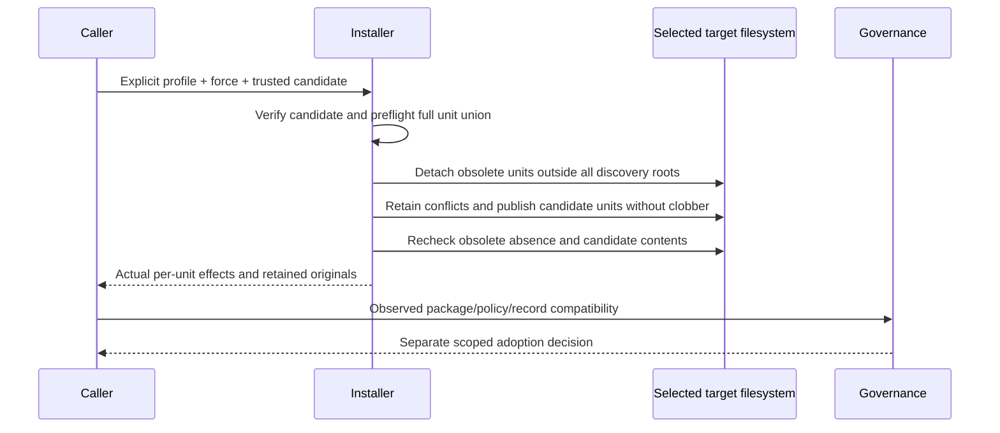

# Verified installation: explicit workflow replacement

This successor contract settles AR-042's bounded replacement mechanism. It extends the [Installation contract](../../../../../../docs/design/cli/installation.md) in the 2.0.0 candidate. Installation remains distinct from project workflow adoption. Existing `init --force` remains replacement of candidate destination units; it does not acquire authority to remove unrelated directories. The installer never creates a workflow activation or engineering approval.

## Candidate contract and authority

[Package production](../MOD-013-product-package-production/README.md) owns an archive member named `rigorloop-workflow.json`. Its exact bytes are covered by the already trusted archive checksum and inventory. It is a support member, not installed project state. For this transition it declares the sole replacement profile `requirement-first-v1` and the fixed obsolete names `proposal`, `proposal-review`, `design`. Unknown fields, versions or profiles reject; package content cannot supply arbitrary removal paths.

The successor public invocation extends existing `rigorloop init codex|claude` with `--replace-workflow requirement-first-v1`. Mutation requires `--force` as well. The flag explicitly selects removal of the three named obsolete units under the selected target root and replacement/creation of that candidate's installed units. It does not select `.codex/skills`, another target, all skills, project policy, user work or operational records. The selected target roots remain `.agents/skills` for codex and `.claude/skills` for claude. No new target or alias is introduced.

Unknown/duplicate flags, unsupported profile and missing --force reject before acquisition or writes. `--dry-run` remains a preliminary non-mutating plan: it reports the fixed possible removals and unresolved candidate/destination checks without fetching or claiming preflight success. Only real verified acquisition establishes candidate membership. Local-archive and network acquisition use the same trusted metadata and validation boundary.

Without the new flag, an otherwise valid replacement-profile candidate encountering any of the three obsolete installed units blocks before writes, including with ordinary --force. This is an explicit migration conflict, not permission to remove those units. If all are absent, normal candidate installation may proceed. Every successor candidate requires the verified workflow descriptor, whether or not retirement is requested. Missing or malformed descriptors reject. Historical archives require their matching earlier executable; they cannot trigger obsolete-unit removal through the successor.

## Complete preflight and unit sequence

The unit set is the sorted union of all verified candidate install units and the three fixed obsolete units beneath the selected root. The sets must be disjoint: a target candidate containing an obsolete skill rejects. Obsolete absence is a successful observation, not an error or deletion. Candidate units that already exist are subject to the same explicit force and preservation contract as today. Standalone support members are never installed or used as destination paths.

Preflight the complete union before any installed-unit mutation: contained roots, regular files/directories, no symlinks, snapshots of bytes/types/membership, ancestor identities, same-filesystem retention and descriptor-anchored parent operations. Existing file content inside a selected obsolete directory may be customized: the explicit flag plus force authorizes detachment of that whole selected unit, while exact originals are retained for inspection. No name-based ownership inference authorizes a broader sweep. Unsafe placement or unavailable filesystem primitives blocks before detachment.

Detach obsolete units first, in sorted path order, to the existing unpredictable outside-discovery retention directory using the current anchored two-parent rename and detached-snapshot check. Do not recursively delete public paths. Preserve the complete old object even on a detected source race. A destination that reappears stops installation; it is never detached a second time under the original authorization. Absence must be rechecked before each subsequent unit operation and final success.

Then perform the existing retained-conflict/no-clobber candidate publication sequence, in sorted unit order. Verify actual exact member paths and hashes. Final success requires all obsolete selected paths absent and all candidate units matching the verified inventory at the observation point. A recreated old unit, changed ancestor, changed staged content or missing conditional resource is failure; it is not a successful mixed installation. Arbitrary external writers cannot be prevented forever: current checks establish observed state, and adoption/reliance must inspect it again.

## Failure, reporting and recovery

Retain all detached originals outside every configured discovery root after success or failure; no hidden sibling under a skill root is acceptable. The selected retention map identifies original and retained paths. Never restore, parse as state, or delete retained originals automatically on retry. Installation does not promise multi-unit atomicity or whole-project rollback.

The result adds a closed `unit_results` list to the versioned successor init result: each item is `{path, action, outcome, retained_path}`. Action is `install`, `replace`, or `retire`; outcome is `completed`, `absent`, `partial`, `failed`, or `untouched`; retained_path is a path or null. `absent` is allowed only for retire. `partial` identifies an incomplete destination or a detached original whose replacement did not finish. Existing diagnostic privacy, target/release identity and failure exits remain; reporting failure after actual mutation must retain known effects and cannot claim rollback. The CLI result version for this extended init contract is 2; clients must select that version before reading unit_results. This version is separate from targeted-recording result version 4.

On any failure stop further writes and report completed, detached/partial, failed and untouched units. Reacquire and reverify the candidate on retry, then preflight actual current state. Existing candidate units conflict unless force is explicitly supplied again; absent obsolete units remain absent and their earlier retained originals remain untouched. Recovery that restores an earlier coherent workflow is a separately authorized operation, with no-clobber checks on every destination and verification that all required earlier components are intact. Until compatible recovery or completed replacement is established, affected workflow use remains unavailable. The installer neither writes an adoption marker nor inspects record-store authority.

## Verification intent and decision

| Group | Independently observed outcome |
| --- | --- |
| Selection and authority | Default and force-only attempts with obsolete units leave all destinations unchanged; explicit replacement selects exactly three names under one root. Unknown profile, duplicate flag and missing force reject before acquisition. |
| Package integrity | Missing/malformed descriptor, unknown fields, obsolete candidate names, wrong target, altered archive bytes, missing required entrypoint/reference and path traversal reject before destination changes. |
| Preservation | Customize each selected old directory; preserve exact bytes outside discovery after detachment. Unrelated skills, mirrors, other targets and project files stay untouched. Real agent discovery must not encounter retained originals. |
| Races and failures | Change an ancestor, hold an old file open, recreate an obsolete path, interrupt between retirements or during candidate publication, and fail result output. Observe actual paths, retained bytes and truthful effects; never overwrite the competing destination or infer rollback. |
| Retry and adoption | Retry from partial output with explicit flags; missing obsolete paths are benign, existing candidate units remain guarded. A successful install alone cannot populate an activated Adoption record or approve a Change. |

Use the existing Installation test harness and independent byte/inventory oracles, plus the [Governance adoption group](../../../MOD-017-engineering-governance/test-design.md). Canonical source inspection is insufficient for installed-resource and recovery claims. Physical placement and anchoring follow the current installer; no service, managed project-state format or automatic recovery controller is added.

The chosen mechanism is explicit profile-limited detachment with preservation. Ordinary force cannot safely infer removal of noncandidate units; a generic remove-path option grants excessive scope; automatic cleanup based on old names hides authority. Revisit the fixed profile only through a separately versioned reviewed replacement contract, not by expanding an installed candidate's arbitrary path list.
