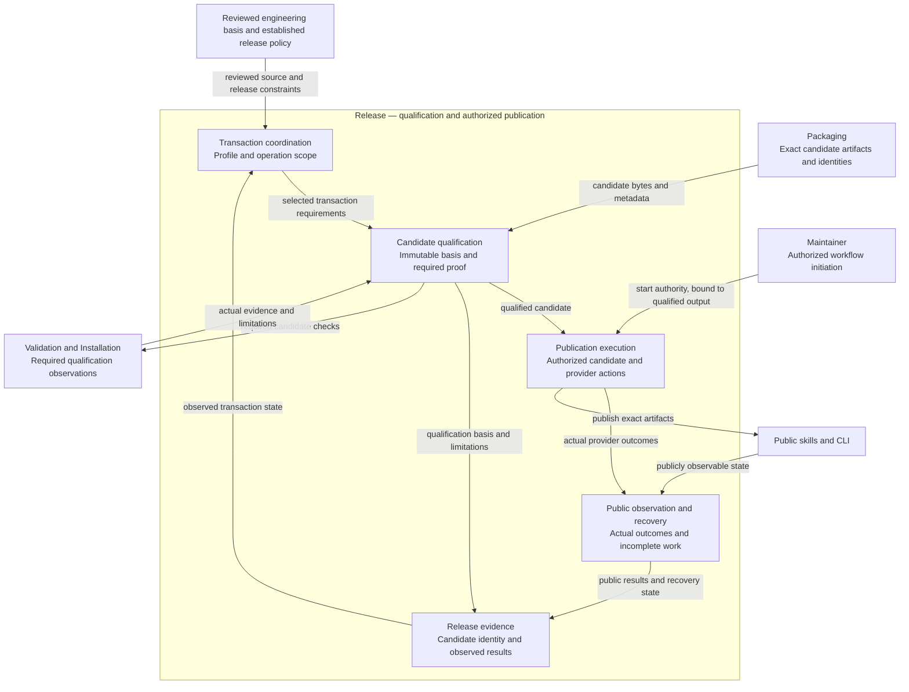
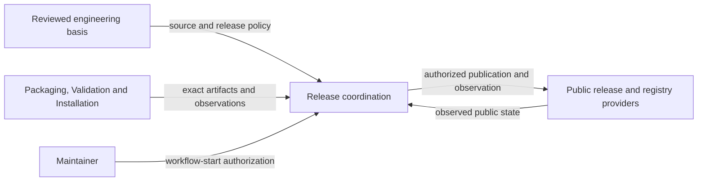

# Engineering Release Model Design

Owner: [MOD-015 Release coordination](module.json). This is supporting contract detail, not a separate REM entity. Stable clause IDs retain their responsibility; the workflow-start authority refinement below deliberately revises the former candidate-approval policy. Historical judgments retain their original meaning.

Model validation contract: model-document-v1

Related cooperating contract: [Engineering](../../../../../support/development.md#release).

Release coordination owns publication of the skills and CLI: candidate qualification, authorization, public observations and recovery. It consumes Packaging and CLI Installation contracts and applies Skill Assessment behavior.


Original composition adoption: three-model reconciliation (historical operational material, unavailable in the current tree).

Prior refinement: independent parallel tests (historical operational material, unavailable in the current tree); its selected behavior and evidence retain their own scope.

For this repository’s complete source retirement (historical operational material, unavailable in the current tree), current responsibilities are self-contained in the owning Designs. Original source-transfer inventories remain recoverable through [Historical provenance](#historical-provenance); their instructions to retain or amend legacy specs, architecture, activation state or retired engines are historical and superseded by this complete retirement. Source-qualified IDs and original judgments keep their original meaning; provenance is not a runtime input or current approval. Customer source documents retain their project-owned authority and historical meaning. Current RigorLoop output and format support follow Design; source interpretation does not authorize retired feature/proof operations or automatic conversion.

## Introduction and Goals

Release owns the recurring operation that prepares, verifies, publishes and records an already-reviewed release, including identity, transaction-profile authority, publication boundaries, evidence and recovery. The [approved direction](../../../../../../docs/proposals/2026-09-09-release-model-source-consolidation.md) selects this model and removal of superseded design sources. The owning change (historical operational material, unavailable in the current tree) records exact subjects, assessments and adoption evidence.

See the [publication sequence](README.md#publication-flow) and separate [recovery flow](README.md#publication-recovery).

| Phase | Responsible actor | Observable result |
| --- | --- | --- |
| Initiate | Authorized maintainer through the configured release trigger | Permission to prepare and publish the selected reviewed source under the established release policy; no later approval. |
| Prepare | CLI/CI using reviewed work and established policy | Determined candidate, generated profile/artifacts and release summary; unresolved decisions are explicit exceptions. |
| Check | CLI/CI consuming applicable engineering assessments | Current required candidate evidence; failed or incomplete prerequisites prevent publication. |
| Publish and observe | Authorized CLI/CI | That candidate is published and its public assets, registry identity and fresh smoke are observed. |
| Report | CLI/CI | Durable actual outcome, including failed-before, uncertain or failed-after publication and any required intervention. |

For supported routine releases, initiating the authorized release workflow is the publication authorization. With the selected main-push trigger, a permitted push to protected `main` supplies that initiation for the exact event commit. It is not a second manual workflow-dispatch action. After preparation and required checks pass, execution continues without a maintainer confirmation, environment reviewer or approval API check. A local check, PR validation run, unrelated workflow or unsupported event is not an authorized release start.

The permission covers the selected source, established version/channel, destinations and allowed deterministic preparation. The actual resulting packages must still be qualified and bound to that start before publication. There is no approval of unknown bytes by implication: the grant is conditional on that derivation and qualification. Changed source or material configuration needs a new authorized start; failed checks stop publication. Future additional approval gates are not part of this design.

### Adoption boundary

The checked-in workflow and coordinator implement workflow-start authority: preparation binds the qualified candidate to its initiating run, and execution checks current run/source/artifact/environment facts without reading reviewer approvals. Local implementation does not establish live adoption. Before the first hosted release, reconcile protected main, the release environment without reviewer or waiting rules, trusted publishing and evidence-ref configuration together with the deployed workflow. Do not disable a live gate while an older publisher remains active.

Candidates carry the `workflow-start-v1` initiation policy. Approval-era candidates or active attempt records cannot resume under this executor; it stops without rewriting their original evidence. Preserve them and resolve any partial publication under its original scope before preparing a new authorized run. Historical completed outcomes remain readable and retain their original meaning.

The dedicated evidence-ref simplification discussed separately remains pending. This authority refinement retains the current reporting/recovery persistence contract so removal of approval does not silently remove durable outcome or concurrency protections. Customer-browser publication remains separately scoped and is not an available product inferred from this workflow.

## Distribution support transition

The [Distribution direction](../../../../../../docs/proposals/2026-09-10-distribution-model-and-opencode-retirement.md) originally selected a combined package/installation owner, now split into Engineering Packaging and CLI Installation, withdrawal of OpenCode, and removal of managed-state creation and automatic managed upgrades under its owning change (historical operational material, unavailable in the current tree). The current implementation of REL-SR-03 has exactly Codex and Claude Code as routine adapter targets; the removal is a compatibility break governed by REL-SR-02, not a patch-only packaging cleanup. Existing historical releases, profiles, observations and their three-target evidence retain their original identities and meaning.

[Packaging](../MOD-013-product-package-production/packaging.md) owns generation and package representation; [CLI Installation](../MOD-014-verified-skill-installation/installation.md) owns trusted acquisition and safe destination writes. REL-SR-08/09/13/19/21–24 consume its supported-target inventory and real packed/public installation proof. Current smoke exercises install-only delivery for both targets; positive managed-state/upgrade smoke requirements are superseded. Retain proof that every default conflict, including identical/empty existing units, stops the entire install after archive verification and before installed-file mutation. Packed-CLI proof includes complete `--force` replacement with obsolete-file removal, preservation of unrelated skills/state, and safety rejection in both modes. State paths do not select behavior; negative coverage still includes `--write-state`. Default conflict semantics and explicit force replacement form part of the compatibility change under REL-SR-02. Historical evidence readers do not require installer state parsing or marker guards. Current candidate derivation, artifact inventory, bundled metadata, schema/profile validation, public smoke and reports must change coherently; stale three-target inputs reject rather than silently dropping OpenCode. A previously approved candidate with a materially changed target/artifact population requires fresh candidate preparation and authorization under REL-SR-23. No existing approval publishes the new population.

Retire current calls to the standalone `build-skills.py` mirror check only after its required content/resource protection is present in the retained canonical/package checks. Keep the full release verifier and observed public evidence. Historical investigation may separately use the original source and its original commands; it does not require current tooling to dispatch old recipes or retain an active OpenCode generator. REL-SR-25 governs current-tool admission; no historical check is forged. Packaging and Installation proof does not reclassify public failures, remove timing diagnostics or relax remaining release safeguards. This amendment grants no publication or remote configuration authority.

## Architecture Overview



Release owns the transaction responsibilities inside the boundary. [Routine coordination and immutable candidate](#routine-coordination-and-immutable-candidate), the [Building Block View](#building-block-view), [Runtime View](#runtime-view) and [Deployment View](#deployment-view) own qualification, execution and recovery detail. [Packaging](../MOD-013-product-package-production/packaging.md) supplies artifacts; [Validation](../../../../../support/validation.md) and [Installation](../MOD-014-verified-skill-installation/installation.md) retain check execution and install behavior. [Engineering Development](../../../../../support/development.md#development) supplies the assessed source basis. Authorized release initiation supplies publication permission; neither an engineering Verify nor candidate qualification creates it. [Authoritative facts and durable evidence](#authoritative-facts-and-durable-evidence) owns the actual release account.

### Supporting-view decisions

| View | Necessity and reason | Owning detail |
| --- | --- | --- |
| Context | Necessary: Reviewed source, exact candidate proof, workflow-start authority and provider outcomes are separate authority boundaries. | [Context view](#context-view) |
| Development | Necessary: Existing coordinator, candidate, execution and evidence helpers compose the transaction without a new policy service. | [Building Block view](#building-block-diagram) |
| Process | Necessary: Initiation, qualification, uncertain publication and failed-after-publication paths require explicit ordering and recovery. | [Runtime view](#introduction-and-goals) |
| Physical | Necessary: Default-branch preparation, publishing execution and external providers have different credentials and mutation authority. | [Deployment view](#deployment-diagram) |


## Context and Scope

Release is a supporting engineering capability for occasional publication of this repository's skills and CLI. Its recurring scope is the current stable package and supported targets. The following outcomes set the test-design boundary; helper count, serialized field count and historical release count do not expand it.

| Release outcome | Required protection |
| --- | --- |
| Prepare the intended release | Resolve reviewed version intent and project the correct local files while preserving human content and earlier evidence. |
| Qualify the actual artifacts | Bind source, profile, package and archives; consume Packaging and Installation proof for those exact bytes. |
| Publish only within workflow-start authority | Enforce workflow-start authority bound to the qualified candidate, prevent substitution and conflicting or duplicate immutable writes. |
| Report and recover honestly | Observe public identity and installation, preserve failure evidence, and resume safely after partial or uncertain completion. |

Release owns the integration with Packaging and Installation, whose detailed behavior remains at those owners. Parser variations and diagnostic-format checks remain useful implementation tests without requiring individual model-level scenarios. Timing remains diagnostic under REL-SR-18. Exceptional authentication and incident correction are assessed when requested; their policy does not introduce another routine workflow or require simulating an emergency for every release.

One-time source consolidation and test-maintenance assessments belong to their owning changes and the shared Design, System test-policy and Assessment rules. They are not recurring release operations. The current refinement (historical operational material, unavailable in the current tree) retains their disposition and acceptance duties. Existing publication safeguards and supported command behavior remain the operational contract.

Established configuration and reviewed upstream decisions supply the release policy. An authorized workflow start drives CLI/CI to derive routine inputs, prepare and check a candidate, then publish and observe it automatically without another confirmation. Missing version intent, unsupported configuration or unavailable credentials is an exception with an actionable owner decision, not a routine manual checklist. An engineering change is not a release transaction, and a transaction profile is not an engineering change record.

| Relationship | Owner and boundary |
| --- | --- |
| System composition | [System](../../../../composition.md) identifies actors, Release and its producers/consumers; it does not duplicate this contract. |
| Skill and generated packages | [Skill](../../../MOD-018-engineering-operations/modules/MOD-012-published-engineering-capability-guidance/capability-contract.md) owns common content; retained adapter invocation/archive contracts own generation, target layout and identities. Release consumes their proof and publishes the selected artifacts. |
| Installation | [CLI Installation](../MOD-014-verified-skill-installation/installation.md) owns filesystem mutation and archive trust under the scoped adoption above. Release requires applicable packed/public installation proof without redefining installation. |
| Engineering assessment and recording | [Review and Closeout](../../../MOD-017-engineering-governance/modules/MOD-007-engineering-verification-and-assurance/assessment.md) owns assessment/applicability; Workflow coordinates; Record Format/CLI own current engineering records. Release evidence retains its own version-scoped formats. |
| Validation | [System](../../../../composition.md#living-test-design-composition) owns protective-value criteria; [Validation](../../../../../support/validation.md) owns shared selection/execution without a validation cache. Release owns the operation-specific composition and public evidence obligations below. |
| Version-specific contracts | Named npm, adapter and activation release contracts may impose stricter rules for their population. They remain necessary dependencies, not automatically transferred histories. |

The amended direction selects bounded coordination of existing Release mechanisms and their necessary CLI/CI, profile/evidence and timing-validation changes. Automated publication after authorized workflow initiation and successful qualification is required; unauthorized triggers remain prohibited. No new hosted service, general workflow engine, staging publication channel, customer governance adoption, general validation redesign or other model extraction is selected. Actual publication while implementing this change remains separately authorized. This is a behavior change as well as source consolidation; earlier documentation-only scope does not govern the amended package.

## Architecture Constraints

Constitution and explicit execution permissions govern. Routine publication starts from reviewed and merged source that introduces no unapproved engineering decision. The bounded, deterministic release-only preparation described below may produce a derived candidate commit; its exact allowed diff is disclosed in the candidate summary and bounded by the initiating policy, and no unreviewed product or executable change is admitted. Authentication, provenance, identity, release proof and immutable-publication recovery remain mandatory under their applicable contracts. This model transfers current authority; it does not reactivate old lifecycle writers, first-rollout authoring gates or retrospective benchmarks.

Operational release profiles, generated metadata, templates, fixtures and recovery inputs are not superseded prose. Historical releases and recorded judgments keep their original subjects and meaning. Removing an explanatory source does not remove its tests or waive a real operation's checks. Current rules and necessary evidence remain understandable from the checkout.

## Architectural supporting views

These views elaborate the overview at the owning model boundary. Existing detailed contracts, scenario tables and external owners retain their authority.

### Context View



Reviewed source, exact candidate proof, workflow-start authority and provider outcomes are separate authority boundaries. Detailed requirements and scenarios in this model remain authoritative.

### Building Block diagram

See the [Development: release code and dependencies diagram](README.md#release-code).

Existing coordinator, candidate, execution and evidence helpers compose the transaction without a new policy service. Detailed requirements and scenarios in this model remain authoritative.

### Deployment diagram

See the [Physical: release jobs and destinations diagram](README.md#release-placement).

Default-branch preparation, publishing execution and external providers have different credentials and mutation authority. Detailed requirements and scenarios in this model remain authoritative.

## Requirements

| ID | Required behavior |
| --- | --- |
| REL-SR-01 | A routine publish MUST introduce no new product, implementation, package-surface, adapter-target, install-root, evidence-location, gate, authentication, provenance, versioning or publish-mechanics decision. Such changes require their normal reviewed engineering lifecycle first. An already-approved breaking source change may be published routinely with its major-version decision and upstream approval identified. Routine execution alone requires no new proposal or plan. |
| REL-SR-02 | Every attempt MUST identify its release type, version decision, source commit/branch, package, tag and npm dist-tag before publication. No-change and already-published-version attempts MUST stop without overwriting publication and record duplicate, recovery or no-op meaning. Patch means backward-compatible fixes/docs/internal work without public additions; minor means compatible public additions; major means breaking public behavior/contracts. Stable npm publication uses `latest`; prereleases use an approved non-`latest` tag, but this policy does not imply that the current stable-only automation supports prereleases. |
| REL-SR-03 | Routine profile-driven releases MUST use one `release-profile-v1` profile at `docs/releases/profiles/<tag>.yaml` as authority for release/package identity, target set, artifact expectations, publication/evidence/validation requirements and generated preparation. Routine automation applies only to the same npm package, supported target set (codex, claude, opencode), publication channels and evidence schema, with no emergency/security exception, new adapter class, release-schema migration or historical-evidence rewrite. This population is narrower than routine publication under REL-SR-01: prior approval of an excluded change does not make it routine automation. Special handling requires an explicit owner decision, which neither reclassifies the release as routine nor establishes tool support. Scripts MUST NOT replace profile authority with current-version constants. Missing/malformed profiles or unsupported values reject; special releases require an explicit owner decision and MUST NOT be forced through routine handling. |
| REL-SR-04 | Every release-preparation surface MUST be classified as profile-owned generated, human-authored profile-checked or historical immutable. Preparation MUST derive generated surfaces and current fixture data from the profile, preserve human narrative outside declared regions, and never generate test logic or rewrite historical evidence. Manual generated overrides require visible rationale and preflight assessment. Generated diffs remain reviewable tracked artifacts in the prepared candidate. Their routine authorization is included in the workflow-start grant; an unexpected semantic edit returns to engineering review. |
| REL-SR-05 | Preparation MUST be idempotent for the same complete profile and repository state, validate pending evidence and allowed placeholders, and MUST NOT publish, create tags, push, create GitHub releases or query npm publication state. Interrupted or partial preparation does not imply readiness; inspect affected outputs and rerun/check from their actual basis before relying on them. |
| REL-SR-06 | Python-owned release preflight MUST be idempotent and side-effect-light: no release-artifact writes except explicitly requested timing/log output, no credentials requirement and no full release check, broad adapter tests, archive generation/validation, package pack smoke or public smoke. It MUST check profile completeness, package/version agreement, metadata pointers, literal ownership, pending evidence, required local inputs, release-output state and tag conflicts. Reachable remote conflicts block; unavailable remote state is reported, never a pass. An explicitly allowed local conflict still requires its owner decision. |
| REL-SR-07 | Newly changed unauthorized current-version literals MUST fail. Existing baseline drift remains reported until corrected/classified. Historical literals need explicit historical classification/rationale; generated-current literals need a profile or generated-region owner. Diagnostics identify file, literal, classification, expected owner and corrective action. A cheap same-input drift found only by full verification MUST gain preflight regression protection when corrected. |
| REL-SR-08 | Before publication and again for applicable boundary safeguards at execution, all applicable non-deferred release checks MUST pass: clean tree or recorded intentional release artifacts; release notes or a recorded not-required rationale, with tracked notes mandatory for the applicable adapter/release contract; current generated outputs; selected tests/CI/broad smoke; package-content preview; npm build/pack and local packed-install smoke; archive inventory/checksums, adapter/package/release metadata consistency, security and rollback consistency; selected authentication/provenance path, prepared evidence and absence of unresolved blockers. Missing evidence, forbidden package inclusions, required omissions or failed checks block. Preview/smoke MUST concern the candidate package, not repository source substituted for it. |
| REL-SR-09 | `scripts/release-verify.sh <tag>` remains the full local release-verification entrypoint; local and CI release paths MUST use the same repository-owned command set for the profile. Release checks compose current skill/package proof or its deterministic owners without a third definition of correctness. Preflight, caching, dry-run, model validation or package success MUST NOT replace required release/public proof or grant permission. Reuse requires affirmative applicability under the existing evidence policy and never overrides explicit fresh execution. |
| REL-SR-10 | Every publish attempt MUST create/update version-scoped evidence at `docs/releases/v<version>.md`, preserving the applicable companion records under `docs/releases/<tag>/`. Record the exact identity, required checks/results, preview, publish path/event, registry and smoke results, failure/recovery and follow-up fields defined below. Related engineering changes link the evidence; routine publication does not update `docs/plan.md` unless its governing lifecycle requires it. Update an existing release index where applicable. CI links supplement, never replace, durable evidence. |
| REL-SR-11 | Trusted publishing/OIDC is the preferred npm path. Manual token/2FA fallback requires its applicable first-rollout or approved emergency authority, recorded reason and preserved authentication policy; it MUST NOT bypass non-deferred checks or evidence. A profile or version contract requiring trusted publishing is not overridden by fallback prose. Staged publication is not introduced. Provenance SHOULD be automatic when trusted publishing is used; an applicable supported CI/CD provenance fallback SHOULD use supported provenance generation such as `npm publish --provenance`. Publish commands/results MUST exclude credentials and identify provenance honestly. |
| REL-SR-12 | Publication MUST bind the checked source, requested tag, package/profile identity and artifact proof to the actual external operation. The retained trusted tag path checks hosted ref, immutable tag commit and checked HEAD against the trusted commit. The selected workflow-start path binds the reviewed upstream commit, sealed prepared commit, workflow/configuration identity and qualified artifact identities before creating the exact tag; it does not claim a default-branch event was a tag event. Both paths reject a conflicting existing tag. A legacy tag trigger cannot independently publish the new routine candidate without its matching authorization. Concurrent changes or mismatched identities stop affected reliance. Existing per-ref workflow serialization is preserved; it is not a distributed publication lock or permission to retry uncertain writes. |
| REL-SR-13 | Post-publication verification MUST observe the public registry's version, intended dist-tag and integrity metadata when exposed, plus required fresh installed/CLI smoke; local build results are insufficient. Profile-driven closeout MUST read public GitHub assets and npm metadata and run fresh public `npx` version and supported-target init smoke before marking those results passed. Archive hashes, root-qualified tree hashes, file counts, command strings and closeout states MUST match their supported evidence formats. |
| REL-SR-14 | Public closeout MUST be rerunnable, report unavailable public evidence explicitly and leave pending evidence/unrelated files unchanged when required public evidence is unavailable, apart from requested logs. It MUST NOT invent successful publication or smoke. Failed post-publish verification remains failed-after-publish until supported correction/recovery disposition; registry uncertainty is not a reason to repeat publication. |
| REL-SR-15 | Failed-before publication MUST stop and record no successful publish; failure during or with uncertain publication MUST record failure and inspect registry state before retry; failure after publication MUST record failed-after-publish and recovery. Published npm versions MUST NOT be overwritten. Recovery uses fix-forward, appropriate dist-tag correction or deprecation with recorded outcomes. No rollback may silently erase failed evidence, prior public identity or unrelated state. |
| REL-SR-16 | Emergency deferrals are exceptional owner decisions, not a normal alternate route. Each names the deferred item, approving owner/stage, emergency rationale, reason, validation impact, accepted risk, follow-up and deadline/next stage; non-deferred checks still pass. Evidence creation, secret suppression, source/package/version/dist-tag and publish-path recording, post-publish registry verification and recovery/follow-up recording MUST NOT be deferred. Fresh registry install smoke may be deferred only with that complete basis. Failed results remain failed or deferred-with-owner-risk, and deferred work remains open until completed, replaced by approved recovery or explicitly closed by its owner. |
| REL-SR-17 | Release tools, previews, overrides and evidence MUST exclude tokens, OTPs, credentials, private keys, environment dumps, private hosts/usernames, raw proxy values and machine-local paths. Secret-bearing package contents block publication. Use bounded public identities and command/result summaries, preserving manual-fallback 2FA/token requirements. Diagnostics remain concise and actionable; large external logs are not the sole proof. |
| REL-SR-18 | For routine releases under this adopted path, tooling MUST collect duration telemetry automatically when available. Missing or unavailable timing alone MUST NOT block preparation, publication or otherwise successful closeout. Separate available preflight, local verification, GitHub-job, npm-job, public-smoke and closeout observations remain diagnostic facts; aggregate durations do not substitute for available separate measurements. Unavailable data is reported without invented durations. Malformed emitted timing is a reported tooling defect and fails its diagnostic format check, not publication correctness by itself. Timing-format validation remains fail-closed for unknown values. Required identity, actual check results and publication-event/outcome facts remain mandatory even if collected by the same logger. This explicitly supersedes mandatory duration-presence and release-blocking timing consequences from Transaction R39–42 and their tests for this population; historical records and separately scoped special-release policies are not rewritten. |
| REL-SR-19 | The representation contracts below MUST preserve generated-region matching/non-nesting, literal-baseline classification, timing fields and supported evidence routing. Unknown closed values reject rather than silently skip checks. Existing operational schemas, baseline, fixtures and generators retain their identities/locations unless changed with actual consumers; historical records need no migration into current shapes. |
| REL-SR-20 | Consolidation MUST transfer all selected surviving obligations and meaningful rationale before removing their definitions, reconcile actual consumers and preserve explicit mixed-source remainders. Apply the displacement map and Design DES-SR-21; old judgments are not approval of new subjects. No automatic archive, redirect or duplicate is required for these selected sources. Current relied-on evidence remains available; no test or operational record is deleted by source retirement. |
| REL-SR-21 | Proof of this consolidation MUST observe semantic preservation, one accessible owner, precise removal boundaries and coherent readers. Source-only changes do not require publication, live public smoke or unrelated historical suites. A changed executable/package dependency requires its protective checks; unknown impact requires investigation. Existing final independent whole-change Code Review and distinct Verify remain required. Actual release safeguards and explicit freshness obligations remain, with only the diagnostic timing consequence amended by REL-SR-18. |
| REL-SR-22 | For a supported routine release of already-reviewed and merged work, CLI/CI MUST complete preparation, required checks, publication, public verification and durable reporting with initiating the authorized release workflow as the sole normal maintainer action, with no subsequent approval. It MUST derive profiles, notes and evidence from authoritative inputs without duplicated manual entry or generated success assertions. Ambiguous engineering/version decisions and unavailable prerequisites stop the affected operation with a precise intervention request. Established credentials and supported release configuration are setup prerequisites, not repeated release tasks. |
| REL-SR-23 | Workflow initiation MUST identify the selected reviewed source, version/channel, destinations and execution policy. Before publication, bind its qualified deterministic prepared source and artifacts to that initiation. No subsequent routine human approval is required. Material changes stop that run and require a new authorized start and qualification. Stale, incomplete, failed or contradicted required evidence blocks execution without being waived by initiation authority. A fresh satisfactory recheck or retry of the unchanged candidate needs no additional approval. Duplicate events/retries confer no new semantic authority or duplicate write; inspect authoritative external state before retrying an uncertain publication. A conflicting public artifact stops without overwrite or substitution. |
| REL-SR-24 | Every repeated fact MUST have an authoritative source and generated projections. Prepared evidence MUST distinguish policy/intent, generated expectations and observed results; generation cannot manufacture a pass or a semantic approval. Persist initiating workflow/source identity, its qualified candidate binding and actual outcomes durably with the existing version-scoped evidence; exclude self-referential identities and separate final observations from immutable candidate inputs. Loss of reporting after a public write is incomplete closeout, never permission to republish. |
| REL-SR-25 | Current release tooling MUST qualify explicitly selected current source or a prepared candidate under its profile and existing freshness/authorization rules. Retire hardcoded retrospective validation branches that require completed v0.1.x production reports or old generators from the current checkout. Unsupported historical replay requests MUST reject before generation or publication; historical investigation uses recorded source separately and MUST NOT run implicitly during current qualification. |
| REL-SR-26 | Current release qualification MUST use the supported exact source/profile/candidate contract, not the retired v0.1.4 bootstrap, FU-010 closeout, first-release inventories or specs-hosted activation recipes. Named historical outcomes retain provenance but provide no new publication authority. |

## Solution Strategy

Separate standing requirements from per-release state and from observations. This Design owns the standing rules; the profile owns the selected routine transaction values; evidence records what actually happened. Original source displacement mappings remain recoverable through [Historical provenance](#historical-provenance). Historical acceptance commands do not become a universal check list.

## Building Block View

[Engineering ENG-SR-16](../../../../../support/development.md#repository-tooling-organization) owns tooling placement. Internal release modules live under `scripts/lib/release/`; operator commands retain their paths, including a thin `scripts/release_evidence.py` command. Imports, copied source fixtures and workers use the same implementation. Loaded/candidate source-integrity comparison extends the existing top-level script identity to the complete authored scripts tree recursively, including nested modules and authored resources, before and after preparation; generated bytecode is excluded. No current or historical supported command is silently redirected to different semantics.

| Existing block | Responsibility and contracts consumed |
| --- | --- |
| `scripts/lib/release/release_transaction.py` | Profile parsing, preparation, preflight, surface/literal/timing validation and public closeout helpers; owns no independent release policy. |
| `scripts/prepare-release.py`, `release-preflight.py`, `close-release-publication.py` | Existing operator entrypoints delegating to the shared implementation; preparation is local, preflight may observe refs, public closeout uses external evidence. |
| `scripts/release-verify.sh`, `validate-release.py` | Full release composition, release/artifact checks and CI contract checks. Shared skill/package invariants come from their owners. |
| `scripts/lib/release/release_candidate.py`, `release_execution.py`, `release_coordination.py`, `release-coordinator.py` | Immutable candidate construction, provider-bound execution, separate-ref evidence and the thin CI dispatcher compose the existing helpers. Operational evidence readers consume the configured ref; historical checked-in evidence keeps its original readers. |
| `.github/workflows/release.yml` | Default-branch preparation precedes an executor requiring successful preparation with no human approval gate for publication, public observation and reporting. Repository commands own checks; serialized execution does not cancel an active transaction. The old tag-triggered publisher is removed from this selected path. |
| `docs/releases/profiles/`, version directories and `templates/release-evidence.md` | Transaction values, generated/human release evidence, notes, timing and standing checklist template; no conversion to engineering-record JSON is selected. |
| `docs/reports/adapter-artifacts/releases/`, package-bundled adapter metadata | Published archive/source identities consumed by release and installation. Generation remains separately owned. |
| `tests/fixtures/release-transaction/` and existing release tests | Safe positive/negative contract and regression subjects, including generated output and external-evidence substitutes. No live publication is needed for fixtures. |

### Standalone command disposition

The canonical recorded-source check is `python scripts/validate-release.py --recorded-source-auto --version <tag>`. Retire `scripts/validate-release-ci.py`: it only prepends that option, and current check selection already invokes the canonical command. Its filename is no longer a supported entry point. Retain canonical recorded-source validation for an admitted current source/profile or prepared candidate, including validation against its explicit recorded commit, under REL-SR-25. Completed historical recipes that depend on old generators or production reports are no longer dispatched by current tooling; the wrapper-specific delegation test also retires. A selector may recognize the deleted path to validate its retirement without retaining executable compatibility. Historical command references describe their original executions and do not require restoring the wrapper.

Keep `prepare-release.py` for standalone local profile preparation/check mode, `release-preflight.py` for cheap independently invocable diagnostics, and `close-release-publication.py` for separately authorized public-evidence closeout of supported historical or exceptional transactions. These thin entry points delegate to `release_transaction.py`; they neither duplicate the routine coordinator nor authorize publication. The workflow-start routine path uses their shared implementation without making these separate invocations normal maintainer tasks. `release-verify.sh` and `validate-release.py` remain actual consumers in that path. This disposition applies REL-SR-06/09/14/19; it does not retire their protective checks or supported non-routine operations.

### Retained representation and applicability

These are surviving operational contracts, not historical illustrations. They retain existing formats except the exact timing consequence and candidate-binding additions selected here. Consumer amendments must be coordinated; no historical-record migration or general record service is selected.

| Surface and population | Surviving rule and approved/current boundary |
| --- | --- |
| Routine profile | `release-profile-v1`: `release_kind`, `release_tag`, `package_version`, `npm_package`, `targets`, `adapter_artifacts`, `publication`, `evidence`, `validation`; selected `npm_dist_tag` also agrees with publication. Artifact fields are `required`, `metadata_file`, `archive_version`; publication fields are `github_release_required`, `npm_publication_required`, `trusted_publishing_required`, `public_smoke_required`; evidence names `release_yaml`, `release_notes`, `npm_publication`, `public_target_init_smoke`, `archive_hashes`, `tree_hashes`, `file_counts`, `timing`; validation names `local_release_verify_required`, `ci_release_verify_required`, `security_scanning_required`. Required protections cannot be removed by changing a value. The profile can represent routine/special classification, but the REL-SR-03 exclusions still determine routine-automation eligibility and special execution needs supported, explicitly selected handling. Current tooling admits package `@xiongxianfei/rigorloop`, supported targets codex/claude/opencode and stable `latest`; legacy v0.3.5/v0.3.6 implicit-latest input remains compatible. General prerelease policy does not expand these accepted inputs. |
| Generated Markdown | Both comment markers begin with the literal prefix `<!-- rigorloop:generated:`. Append `start release-transaction surface=<surface-id> profile=<profile-path> -->` for the start, or `end release-transaction surface=<surface-id> -->` for the end, with no whitespace between prefix and suffix. Namespace/surface must match, start identifies profile, and nesting/missing end/unknown surface reject. Surfaces: `release-metadata`, `adapter-artifact-expectations`, `pending-npm-publication`, `published-npm-publication`, `target-init-smoke`, `current-version-fixtures`, `timing-evidence`. Unauthorized interior edits fail or require independent review/regeneration proof; human text outside remains unchanged. |
| Surface inventory | `release-surface-inventory-v1` records real path ownership: `profile-owned-generated`, `human-authored-profile-checked`, `historical-immutable`. Preserve required path/classification and rationale for overrides; a class name is not authorization to rewrite history. |
| Literal baseline | Use the tracked Release-owned resource `scripts/resources/release/literal-audit-baseline.yaml`. Preflight requires it: missing, unreadable or malformed input rejects with its path instead of silently skipping literal checks. The former implicit Change-directory lookup is retired without fallback. `release-literal-audit-baseline-v1` identifies `change_id`, `baseline_created_at`, `audited_release_tag`, `release_profile` and `entries` with `id`, `literal`, `file`, `line`, `classification`, `expected_owner`, `disposition`, `rationale`. Classifications: `generated-current`, `profile-owned`, `historical-fixture`, `version-independent`, `baseline-drift`, `unauthorized`; dispositions: `allowed`, `report-only`, `must-fix`. Unknown/missing classifications fail; historical entries require rationale; generated entries identify their owner; unauthorized diagnostics include corrective action. The audit is a reviewed classification inventory, not an automatic exhaustive source scanner. Its tag, profile and line fields identify the observation basis, not the active release selector; new source literals still require engineering ownership review. Current audit entries are newly authored observations; they do not reconstruct or relabel the missing historical baseline. |
| Timing | `docs/releases/<tag>/timing.yaml`, `release-timing-v1`, identifies `release_tag`, `release_profile`, `created_at`, `phases` and `checks`. Each phase has `id`, `command`, `duration_seconds`, `result`; each check has `id`, `command`, `phase`, `duration_seconds`, `result`. Phase IDs: `prepare_release`, `preflight`, `local_release_verify`, `ci_release_verify`, `publication_wait`, `public_closeout`; result values: `pass`, `fail`, `skipped`, `pending`, `not-applicable`. For an emitted complete timing document, phase presence, durations and references remain diagnostic format checks under REL-SR-18; pending/skipped is not executed proof. Separate GitHub-job, npm-job and public-smoke measurements use distinct `checks` rows whose `phase` references the relevant existing phase; check IDs identify observations without becoming new phase values. Available job/smoke measurements are retained separately from an aggregate closeout duration. Record unavailable observations and their limits truthfully using the supported result representation, not fabricated duration/proof. Above-target duration is advisory. The new routine path reports absent telemetry without fabricating a complete timing document; legacy `evidence.timing: required` is interpreted as automatic collection/reporting duty for this path, not a publication-blocking duration prerequisite. The standalone diagnostic validator still rejects malformed documents; release composition must explicitly separate its diagnostic result from required correctness checks. |
| Standing publish evidence | Required sections remain Result, Version decision, Preflight gate, Package contents, Publish event, Registry verification, Recovery/rollback notes and Follow-up under the existing template. Required facts: release type/no-new-decision claim; version rationale; source commit/branch; package name/version/dist-tag; publish path/provenance; tree/notes/generated-output/validation/preview/packed-smoke results; unexpected contents; command family, registry, public package reference and publish time; registry version/dist-tag/integrity; install/CLI smoke; phase failures and recovery; blockers and emergency deferrals. Preserve `failed-before-publish`, failed-during/uncertain meaning, `failed-after-publish`, `deferred-with-owner-risk`, `emergency-with-deferred-gate` distinctions in supported fields. A dry-run says no package was published. Flat `docs/releases/v<version>.md` paths select release-evidence/checklist validation without `manual-routing-required` or `release-version-required`; existing directory-based release/notes/npm evidence routing remains supported. |
| Adapter/public companion evidence | `docs/reports/adapter-artifacts/releases/<version>.yaml` retains source commit, generator command, canonical source/manifest, archive names/SHA-256 and validation command/result. Per-adapter archives are public assets; a combined archive is optional. Public closeout records URLs/integrity, exact version and each target's archive/tree verification, file count, smoke command, blockers and closeout state. Hashes use `sha256:<hex>` and root-qualified values for multi-root targets. Command serialization matches validators, excluding convenience flags such as `-y` where not part of the contract. |

The required audit resource follows Engineering's authored-resource layout and is included in the existing recursive scripts source/candidate identity. Resource-only edits select the release regression checks. Private release fixtures supply an explicit valid audit before negative mutations; tests exercise real preflight consumption, missing/malformed input and changed unauthorized entries, with unchanged-file observations. Historical v1 parser fixtures retain their original meaning. The resource location and required admission change no publication authority, profile selection, SQLite storage or historical-record bytes.

The original specifications named version-specific fixture files to implement their first slices. Preserve the existing fixture families (profiles, surface inventory/generated regions, literal audit, pending/published/invalid evidence, timing and commands) and their protective intent. Generated expected files are explicit data, invalid cases carry expected diagnostics, and historical versus current subjects remain distinguishable. File names and old milestone numbers are not permanent mandatory execution policy.

### Routine coordination and immutable candidate

Use a bounded repository-owned coordinator around the existing prepare/preflight/verify/closeout functions and CI workflow. A default-branch merge triggers read-only eligibility/input resolution and preparation; a missing required decision produces an exception report rather than publication. Existing helper entrypoints remain available for diagnosis and explicitly supported exceptional handling. Their invocation sequence is automated; no new general workflow scheduler is required.

The initial supported input policy uses a reviewed next package version already present in merged source and its approved version rationale, the configured stable channel/package/targets, and existing reviewed change summaries since the prior release. The resolver reads the public version for duplicate/no-op/conflict detection; that observation is outside the side-effect-limited preparation helper. It constructs the profile and notes automatically. A version that is not ahead of the public version, a missing/contradictory rationale, or changes whose approved scope cannot be determined cannot be guessed from filenames, the numeric version alone or a generated `pass` field. Already-published unchanged work is a reported no-op; unreleased work without an adequate version decision is an explicit upstream exception. This slice does not add a new per-release form or require editing generated files to make preparation succeed.

Let **S** be the exact reviewed merged source. Preparation may produce **C**, a deterministic child commit containing only approved generator-owned release projections such as profile, package metadata, tracked notes and current fixture data. Executable/test-logic changes and unexplained narrative edits are ineligible for this derivation and return to engineering review. Evidence identifies S, C and the allowed diff; the candidate summary exposes that diff within the initiating grant. C is sealed before artifact building. Its identity describes the source tree, while the candidate identity additionally binds the generated build overlay and final artifacts; these are distinct subjects, not a claim that generated package bytes already exist in C. The build dependency order below is mandatory. Post-publication observations never mutate C, the overlay or qualified artifacts. This explicitly narrows the older merged-source constraint for deterministic release preparation; it does not permit unmerged engineering changes.

1. Build and validate the selected adapter archives from C using the existing owning builder. Record actual archive bytes, hashes, inventory and source identity.
2. In an isolated build overlay based on C, generate `packages/rigorloop/dist/metadata/adapter-artifacts-<tag>.json` from those archive facts and the declared source/destinations. Generate `dist/metadata/releases.json` with the digest of the exact bundled metadata bytes. Preserve historical entries. This metadata is a required package input, not a report that can be supplied after packing. Its facts and digest chain must satisfy the existing installer/metadata contracts; a local candidate placeholder is not evidence of publication.
3. Pack npm from that declared overlay, then run content, bundled-metadata/index and packed-install checks against the exact resulting tarball and selected archives. Record C, generator/configuration identity and the allowlisted overlay diff so a changed generated input cannot be mistaken for the approved source alone. Unexpected source or overlay edits stop preparation.
4. Compute the final tarball digest and generate outer candidate binding evidence binding C, the overlay inputs, bundled metadata/index and every final artifact. This outer evidence is not inserted back into the tarball. Later public-event facts belong to separate standing/companion observations. Neither a source commit nor a package or metadata file embeds its own final byte digest; each digest is carried by its consuming descriptor or outer evidence under the applicable format.

After this sequence, bind the complete qualified candidate to its authorized start. Material source, overlay, artifact, channel or destination changes require a new start and affected qualification. Publication and retries retrieve the retained tarball and assets without regeneration.

Retain the exact candidate commit/bundle, tarball and archives, profile/notes, metadata and check summary as one immutable workflow artifact set. The manifest identifies repository, initiating workflow/run and event source, prepared source, version/channel, targets, destinations, configuration and actual package digests. Store the provider artifact identity outside its own hashed contents. No input is reread from a mutable branch or silently rebuilt for publication.

Validate the initiating repository, main-push event, exact source and permitted workflow configuration. Bind the prepared manifest and artifact to that run. Runtime credentials and the selected trusted-publishing identity remain prerequisites. The executor performs these mechanical checks before writes without consulting a required-reviewer approval API. The `release` environment may remain a credential/deployment scope, but required-reviewer protection is not part of the target routine path. An environment configuration that still waits for approval is an adoption mismatch, not a hidden second gate.

Serialize supported release execution and retain existing active-attempt protection. Cancellation or unavailable execution authority prevents subsequent writes where observable; already completed public writes cannot be undone by cancelling a run. A retry may continue only the original start's scope and retained candidate after inspecting actual public state. Changed source or configuration requires a new start; an unrelated run cannot adopt the candidate merely by naming its version. Retired tag-triggered publishers and PR/local checks cannot independently enter this publication path.

### Release preparation in ordinary CI

GitHub approving reviews are not required for this repository. Protect the source branch with pull requests and required CI, while retaining independently recorded engineering assessment and distinct Verify. GitHub review counts do not replace those assessments. A permitted release-triggering push authorizes the target routine publication; no release-environment reviewer confirmation follows checks.

Ordinary PR and main CI MUST distinguish authored release intent, the prepared package and historical publication evidence. A pending standing record supplies the selected version, major/minor/patch rationale and notes; it does not claim generated checks or public observations have completed. Offline CI validates intent syntax, required rationale, supported decision values and agreement with the stable source package version. It does not query the public registry or establish that the declared increment is eligible against the latest published version. Missing, contradictory or unknown authored state fails before downstream reliance. Completed historical records retain their existing recorded-source checks.

For selected package/release checks on a pending release, compose the existing candidate builder in an isolated checkout of the exact checked source. This local preparation has no publication or deployment authority and need not be a merged default-branch release. Use its real generated sections, archive-derived metadata/index and exact packed runtime as the check subject. Keep the original checkout unchanged. Preserve the selected checks, their failure propagation and source/evidence identities; where a command checks the prepared subject rather than the authored input, report that subject explicitly. Do not pass pending input to the historical finalized-release validator, invent publication fields, or copy an older candidate's digests into a new source.

Current-version CLI fixtures derive their expectations from the actual package under test; explicitly historical and incompatible-version cases remain fixed. Generated test data may describe the current version without changing test logic during candidate preparation. CI candidates MUST be explicitly identified as CI-only and rejected by publication authority validation; they cannot be promoted into publishable candidates. Ordinary checks may therefore validate the same source after its version has been published without pretending it is eligible for another publication. After merge, hosted Release still observes the actual public version, enforces the existing version-decision and increment rules, builds from the exact merged source and binds the initiating authority to that fresh candidate; a PR pass or premerge artifact is never publication authorization.

Representative proof includes a new stable major version without per-version executable edits; invalid intent, failed build/check or stale package metadata rejecting; unchanged historical checks; original checkout preservation; CI-only candidates rejected for publication; hosted preparation rejecting an invalid increment against the observed public version; and workflow-start authority without an extra approval gate. This is a bounded correction to CI integration under REL-SR-02/08/09/22–24, not a new runner, registry, approval stage or weakened check policy.

### Authoritative facts and durable evidence

| Fact | Authority and generated consumers |
| --- | --- |
| Version rationale, change scope and user-relevant notes | Reviewed merged source and its applicable engineering decisions/summaries; resolver derives profile/notes, reports ambiguity rather than inventing intent. |
| Package, targets, channel and destinations | Established supported release configuration plus the derived profile; summary and publish arguments are projections of the same values. |
| Candidate source and artifacts | Sealed C, actual builder output and observed digests; package/archive metadata and workflow binding derive from these bytes. |
| Required checks | Actual command results or explicitly applicable prior evidence; generated pending templates never supply passes. |
| Publication authority | Authorized initiating event and source/configuration, then the qualified candidate bound to that run; distinct from engineering review and check success. |
| Public result | Observed registry, tag/assets and fresh public smoke; standing and companion evidence are generated from the same observations. |
| Duration telemetry | Actual available measurements; missing/malformed telemetry is reported separately from release correctness. |

Use existing version-scoped evidence paths and formats in an automatically maintained repository evidence ref, separate from the immutable release tag/source. The executor writes and reads that configured ref with compare-and-swap updates; concurrent evidence changes are reconciled without overwriting unrelated versions or prior failed attempts. Release navigation and validators must identify that ref when reading new-path operational evidence. The candidate summary includes this reporting destination. Persist pending/start-authority and candidate-binding evidence before the first external publication, then append observed outcomes after each boundary and on failure. Mirror the final evidence bundle with the release assets when possible; durable repository evidence remains the authority rather than an expiring CI log. Reporting failure leaves incomplete closeout and a recoverable retained observation bundle; restoring reporting needs no new publication. No maintainer copy/commit/merge of generated evidence is required in the normal path. Historical checked-in release evidence remains unchanged and readable.

## Runtime View

1. An authorized main-push event selects the exact reviewed source and release policy. The coordinator resolves supported version intent and destinations; missing or unsupported decisions stop preparation.
2. Preparation derives allowed release projections, builds and qualifies the actual packages, and retains them with their manifest and real check results. Failed required checks block publication without asking for approval.
3. The executor automatically retrieves that retained set, verifies its binding to the initiating run, checks current authority/credentials and inspects public state. It never substitutes a later branch tip or rebuilt package.
4. Publish only confirmed missing work in tag, GitHub assets, then npm order. Persist actual outcomes before advancing. Matching earlier publication stays intact; unknown or conflicting state stops affected writes.
5. Perform fresh public installation checks and identity rechecks, persist the actual result and report completion or the precise remaining failure. Failed smoke remains failed-after-publication; lost reporting does not permit republishing.

Retries stay within the original initiation's scope and exact retained candidate. Ambiguous version choices, changed source/configuration, conflicting public identity or exceptional authentication/deprecation/channel changes return to their decision owner. Starting a release does not authorize arbitrary recovery actions.

## Deployment View

Local Python/shell checks use temporary repositories and controlled external services; they do not publish. The selected GitHub workflow starts on a permitted push to `main`, checks out the exact event commit and prepares the candidate with read-only provider permissions. A retry retrieves the original candidate rather than rebuilding it.

After preparation succeeds, the dependent execution job proceeds automatically with its required `contents: write`, `actions: read` and `id-token: write` capabilities. It may retain the `release` environment for credential/deployment scoping without required reviewers. No publication step waits for another human action or depends on approval-provider reads. Remote protection and trusted-publisher configuration require reconciliation during adoption; repository edits do not change those remote settings.

GitHub hosts the tag/assets, npm the packed CLI, workflow artifacts the retained candidate, and the existing separate Git ref the operational evidence. Variables `RELEASE_EVIDENCE_REF` and `RELEASE_TRUSTED_PUBLISHER` remain under this bounded authority change. Workflow concurrency retains `rigorloop-release` and `cancel-in-progress: false`; no competing routine publisher is permitted. Concurrency reduces overlapping execution but never establishes whether an uncertain write committed.

Changes to release orchestration, profile/input derivation, generated evidence, validators or CI consumers return to their engineering owners and applicable review. Canonical skill changes are limited to directly necessary guidance. Inspect current candidate metadata and directly dependent assertions; record unaffected dispositions where appropriate. If a necessary correction changes packaged bytes, regenerate affected current metadata with its existing builder and validate direct consumers; never invent hashes or rewrite historical release metadata.

## Publication procedure

This is the operator path implemented by the checked-in workflow, subject to the remote setup and historical-state checks in [Adoption boundary](#adoption-boundary). See the [publication sequence](README.md#publication-flow), [recovery flow](README.md#publication-recovery), [Development](README.md#release-code) and [Physical](README.md#release-placement) views.

1. **Initiate the intended release.** Under the configured main-push policy, merging reviewed release-ready input to protected `main` starts and authorizes the release. Its version intent, notes and destinations must be established. There is no separate manual start or candidate approval.
2. **Let preparation qualify and retain packages.** The workflow derives supported release inputs, builds and checks the packages, and retains the exact set with its manifest. Failed preparation stops; it cannot be bypassed by the authority to start.
3. **Publish automatically after checks pass.** Execution retrieves the same packages, validates run/source/configuration binding and public state, then publishes only missing authorized work. Local or PR-only candidates cannot be promoted by name.
4. **Inspect the actual outcome.** Confirm GitHub/npm publication and fresh public checks. Partial publication, failed smoke or unavailable reporting remains incomplete.
5. **Retry from known state.** Reuse the original run's packages and observations. Matching public artifacts are not written again. Missing originals, changed material scope or conflicting/unknown state require an explicit recovery decision. Cancellation cannot undo a completed public write.

Read-only status commands remain useful:

```bash
gh run list --workflow release.yml --branch main
gh run view RUN_ID --json headSha,status,conclusion,jobs,url
gh release list
npm view @xiongxianfei/rigorloop version dist-tags --json
```

Actual run identities, qualification, failures and outcomes belong to operational records. A workflow start is authority within its defined scope, not proof that publication succeeded.

## Crosscutting Concepts

### Boundary scan and acceptance scenarios

| Dimension | Requirement basis | Distinct outcome to demonstrate |
| --- | --- | --- |
| Input domain | REL-SR-02, REL-SR-03, REL-SR-07, REL-SR-19 | A complete supported profile is usable; missing/unknown profile, marker or literal values reject. Missing timing is nonblocking; malformed emitted telemetry yields a diagnostic defect without becoming a correctness pass. A stable-only tool rejects unsupported prerelease inputs without contradicting the broader policy. An already-approved emergency/security exception or release-schema migration remains outside routine automation and requires explicit supported special handling. |
| State/lifecycle | REL-SR-01, REL-SR-05, REL-SR-10, REL-SR-13, REL-SR-22, REL-SR-24 | From reviewed merged work plus established policy, the full operator path automatically prepares/checks and completes publication, observation and reporting with one authorized workflow start, no subsequent approval and no manual data preparation. Missing prerequisites prevent publication. Generated pending evidence cannot mark unobserved checks or smoke passed. |
| Identity/authority | REL-SR-08, REL-SR-11, REL-SR-12, REL-SR-16, REL-SR-23, REL-SR-24 | Changing candidate source, artifact, channel or destination after initiation blocks reliance on the original authorization; unchanged rechecks need no additional approval. Wrong hosted tag/commit/package identity blocks despite local proof. A manual path cannot bypass a trusted-only profile; emergency records cannot defer registry verification or conceal failures. |
| Composition/path | REL-SR-08, REL-SR-09, REL-SR-13, REL-SR-20, REL-SR-22, REL-SR-24 | Archive facts generate bundled metadata and its index digest before npm packing; packed-install proof reads that exact bundle. A wrong bundled digest blocks publication even if outer archive evidence is valid. Skill/package proof, release identity and public evidence concern the same artifacts. A valid model with a stale actual consumer is insufficient for source retirement. |
| Temporal/retry | REL-SR-05, REL-SR-12, REL-SR-14, REL-SR-15, REL-SR-23 | Identical preparation is stable; duplicate events/delivery produces no duplicate external write; uncertain publication causes registry inspection before retry; delayed registry visibility permits closeout rerun without another publish or invented evidence. |
| Failure/recovery | REL-SR-14, REL-SR-15, REL-SR-16, REL-SR-17 | Bad published contents yield recorded fix-forward/deprecation rather than overwrite; unavailable public evidence preserves pending/unrelated files; secret-bearing preview blocks. |
| Compatibility/migration | REL-SR-04, REL-SR-19, REL-SR-20, REL-SR-21, REL-SR-25, REL-SR-26 | Historical profiles/evidence and literal baseline remain usable unchanged; all mapped surviving rules have current owners before six design-source removals, while mixed architecture and version-specific contracts retain their remainders. Retirement of the redundant recorded-source wrapper preserves the canonical mode for admitted current source/profile or prepared-candidate validation against its recorded commit, under REL-SR-25. Historical replay rejects before writes; current explicit profile/candidate qualification works without retired production reports or tracked adapter metadata. A fully matching supported candidate uses current qualification; old bootstrap instructions cannot grant publication or bypass missing proof. |
| External/environment | REL-SR-06, REL-SR-09, REL-SR-13, REL-SR-18, REL-SR-21 | Offline preflight reports the missing remote fact; local fixture proof does not claim hosted/public success. Available GitHub-job, npm-job and public-smoke measurements remain distinct check observations under existing phases; an aggregate closeout duration cannot substitute for them. Absent timing does not block otherwise correct publication/closeout; malformed telemetry is reported separately and no measurements are invented. Missing credentials or unavailable evidence persistence produce explicit exceptions. Fixture orchestration proof neither runs real publication nor claims hosted success. |

Material integrated hazards are a valid local archive with mismatched published metadata (REL-SR-08/12/13), delayed registry response after a successful immutable write (REL-SR-14/15), and lost durable reporting after public mutation (REL-SR-15/24). Observe the real identity, publication and persistence boundaries; helper-only parsing cannot establish those composed outcomes.

### Test design

Release owns the separate [Release test design](test-design/test-design.md). It derives profile/input, preparation, preflight, candidate identity, authority/recovery and evidence/closeout coverage from this model using risk analysis, input partitions, decision tables, state transitions, properties and controlled faults. It records important targets, independent observations, fixture strategy, current test locations and known gaps. Requirements and acceptance outcomes remain owned here; review the companion and this model together.

The [Release JSON case catalog](test-design/test-cases.json) indexes outcome-driven scenarios in seven existing group files, with concrete conditions, independent observations, supporting test links and explicit gaps. A model-level scenario can be realized by several unit, command and integration tests. Native test discovery owns the executable inventory; adding a helper or field variation does not require a new catalog row. The index and its declared files are a draft for user review before shared schema adoption or CLI case operations. Review the complete catalog together with this owner and the companion.

The [release suite entrypoint](../../../../../../tests/engineering/release/test-release-transaction.py) remains the normal discovery/filter boundary. Engineering and System own additional interactions across their children. The companion's [requirement accounting](test-design/test-design.md#requirement-accounting-and-proof-limits) covers every current Release requirement, distinguishing recurring scenarios from scoped source-consolidation acceptance. Apply [System's selection procedure](../../../../../support/test-design/rules.md#select-requirements-and-proof) alongside that package. Existing partial/proposed realization remains an implementation obligation; complete Design coverage does not certify every assertion, fixture or observed release.

[Validation](../../../../../support/validation.md#execution-cost-reporting) owns per-case execution costs and complete native population accounting; REL-SR-18 retains its distinct operational duration semantics. Release cases use their existing native caller and private mutable fixtures, and the catalog remains descriptive. Missing test timing cannot become publication permission or a reason to fabricate an operational measurement. The current overview and supporting views remain applicable: this coverage reconciliation adds no publisher, approval boundary, release schema or deployed component.

### Release compatibility and proof

Current release consumers use the supported candidate population, profile, tarball integrity and public-evidence contract above. The release literal audit baseline named in the representation table remains an operational input. Historical release approvals and source IDs do not authorize replay or change current admission boundaries.

Run actual validators and preserve meaningful success and failure coverage; success stubs and zero-case passes cannot establish qualification. A correction restores a coherent source and consumer set and reassesses current applicability. It does not rewrite historical approvals, revert an already published version or migrate historical records.

## Architecture Decisions

| ID | Context and decision | Alternatives and consequences |
| --- | --- | --- |
| REL-DEC-01 | Routine publication operates on already-reviewed work; policy/product changes need engineering review. Version-scoped evidence remains separate from plan progress. | Ad hoc releases lose repeatability; a fresh proposal/plan for every ordinary publish adds ceremony without a new decision; change-only evidence misses releases independent of an initiative. |
| REL-DEC-02 | Preserve exact publication identity, explicit permissions, trusted-publishing preference, narrow emergency exceptions and fix-forward recovery. | A passing local check cannot establish public success or grant credentials/authority. Immediate unrestricted automation and blind retry risk immutable incorrect publication; manual fallback is bounded, not a bypass. |
| REL-DEC-03 | A version-scoped profile owns transaction state, generated outputs derive from it, and preflight catches cheap drift before full verification. | More checklists leave duplicate literals; script-owned profiles hide reviewable state; preflight-only and templates-only each leave part of the duplication. Separate human/history regions require safe generation and reviewable diffs. |
| REL-DEC-04 | Public closeout derives validator-compatible evidence from observed GitHub/npm/smoke facts; timing informs optimization without hard duration gates. | Handwritten post-publish shapes caused avoidable validation loops. Parallelism-first does not fix state drift; premature latency budgets fail for environmental delays. Rerunnable observation must preserve failure/uncertainty rather than invent success. |
| REL-DEC-05 | Consolidate necessary Release meaning and remove six fully superseded design sources while retaining operational inputs and mixed remainders. | Archiving every original preserves duplicate reading burden; deleting all Release-adjacent files breaks baselines and historical evidence. Precise mapping and coordinated adoption are required alongside the selected routine-operation changes. |
| REL-DEC-06 | Authorized workflow initiation is the publication authority; no second routine approval is required; bounded CI coordination prepares, checks, publishes sealed outputs, observes and persists outcomes. | A documentation-only transfer or several manually invoked helpers cannot establish the requested outcome. A workflow start without source/configuration and derived artifact binding would cover too broad a subject. One general workflow engine is unnecessary; immutable candidate retention and explicit setup remain real integration obligations. |
| REL-DEC-07 | Duration measurements are automatically collected diagnostics; their absence alone is not a publication failure. Required identity, check and public-event evidence remains blocking. | Earlier R39–42 and timing tests coupled diagnostic presence to release success. Silently ignoring a failing validator would conceal the change; explicit composition and consumer amendments retain format honesty while separating consequences. |
| REL-DEC-08 | Preserve an immutable prepared commit/artifact basis and record later facts separately with generated projections. | Rebuilding the package after qualification can change bytes; committing a commit's own identity creates a circular basis; asking a maintainer to copy facts across reports restores manual coordination. A configured evidence ref adds a bounded read/write integration that must be tested and documented. |

## Quality Requirements

Current release requirements must be usable from this owner and its named dependencies. Review assesses the four recurring outcomes, meaningful failure distinctions and evidence limits. Source-consolidation acceptance remains with the governing change and shared authoring rules. Mechanical model/link checks establish structure and references, not release correctness.

For affected execution boundaries, proof preserves profile/marker/timing invalid-input rejection, generated idempotency and narrative/history preservation, cheap preflight versus full-command scope, local/CI parity, public-unavailable behavior and immutable retry/recovery. Use real command boundaries in safe modes or inspect actual composition; stubbing public services is appropriate, replacing the protected validator with a success stub is not. Expected tests executing zero cases fail rather than supply evidence. The complete routine scenario must drive the actual coordinator from reviewed input through an authorized trigger with no later approval to publication, observation and durable report using safe external substitutes; helper tests alone are insufficient. Include prerequisite failure, candidate invalidation, unauthorized triggers and duplicate events, lost publication response/delayed visibility, partial publication, failed public smoke, unavailable timing and failed evidence persistence. Required validators must actually execute rather than be replaced by success stubs. Fixtures prove orchestration, not a successful public release; no live release is needed to implement this change.

The retained preflight target is under 30 seconds on a typical maintainer machine through bounded work, not an adoption gate or measured claim. Full release verification may be slower. Evidence remains concise, searchable and sufficient without external logs; no new UI or accessibility platform is introduced.

## Risks and Technical Debt

Legacy public-package contracts contain version-specific policies that cannot be generalized by a heading rename. The stable-only current profile/workflow does not implement every policy-permitted prerelease or fallback; this slice does not add prerelease or fallback support. A fully automatic version bump without adequate reviewed intent is not selected; the explicit upstream version-decision dependency must be exercised in successful and ambiguous-input scenarios. Runtime conformance has not been established by this Design inspection.

A historical directory can hold a live operational baseline. Deleting by directory or treating every old link as current authority is unsafe in opposite directions. Source retirement needs the mapped reader checks. Distribution, Installation, general validation, timing optimization, staged publishing and backport/LTS policy remain with their separately authorized owners/follow-ups. No numerical savings or successful public release is asserted.

## Current qualification and retired release history

The cleanup withdraws current-checkout replay of completed historical release recipes, including the special v0.1.1 token-report gate and v0.1.2 tracked-adapter compatibility branch. For an ordinary or `--recorded-source-auto` request, the requested tag must match the package version of the explicitly selected current source and its matching current release profile; do not recover that identity from an old production report. An explicit recorded commit must agree with that profile/source basis. For `--prepared-candidate`, the candidate manifest, selected source package version, profile and artifact identities must agree and pass the current supported candidate contract. A missing or mismatched basis, or a request that can only be satisfied through the retired version-specific recipes, rejects before generation, report writes or external activity. A version number alone never causes rejection if a fully matching supported candidate exists; duplicate-publication protection remains separate. Their old outcomes and source identities remain recoverable history. Version strings alone are not qualification authority: current profile/prepared-candidate inputs, source identity, package version, target descriptors and required observations must agree. Do not replace old special cases with a new hardcoded newest-version list or reinterpret an old report as current evidence. An unsupported old invocation rejects with a historical-replay diagnostic before writes; current supported candidate qualification retains its ordinary interface and fail-closed profile checks.

`docs/reports/` may contain newly produced or currently relied-on evidence, but no current release gate requires the continued presence of a completed report solely because that release happened. Remove selected historical reports only after their current operational readers are retired or replaced and any live reliance is resolved under Assessment. Keep actual candidate/report generation at its existing version-scoped paths when required by a current release; removal of historical files does not retire the report schema or future report production. Current installer trust metadata remains available in the actual package and is not reconstructed from deleted reports.

Release preparation, artifact validation and literal/path checks must consume Packaging's generated candidate manifest reference rather than demand `dist/adapters/manifest.yaml`. Keep immutable candidate identity, workflow-start authority, no-overwrite recovery, fresh public smoke and truthful observed outcomes. Refactor old-version parser/containment tests to owned fixtures when they protect current behavior; retire assertions that merely require a finished production release to remain reproducible by current code. No public publication, network fetch, archive migration or historical-record rewrite is part of this cleanup.

The existing qualification runtime and deployment views remain valid: an explicit profile/source produces an isolated candidate, and authorized workflow initiation plus qualification governs public writes. The removed path is historical production evidence feeding current qualification by a hardcoded version exception. The combined hazard is a missing historical report plus stale package metadata: current qualification must validate the real candidate or fail, never bypass manifest or trust checks to obtain a pass.

### Token-cost qualification removal

[Validation VAL-SR-25](../../../../../support/validation.md#token-cost-feature-retirement) retires all current token-cost qualification duties, including optional reporting and the historical version-specific token gate. Reconcile release wrappers, adapter qualification, metadata expectations and tests so an otherwise valid supported release candidate needs no token report or benchmark execution. Preserve current profile/candidate/source identity, version agreement, artifact integrity, publication permission and failure-before-side-effect requirements. Do not reinterpret historical reports as current qualification, emit a fake token pass or remove non-token release checks. Historical release judgments remain unchanged; reviewed implementation and successful cleanup Verify are still required.

## Remaining named-release disposition

The original npm-publication v0.1.4 bootstrap and FU-010 closeout, multi-agent first-public-release recipe, v0.4.0 boundary activation/rollback release and compatibility-era command/adapter inventories are completed release-specific instructions. Their specs and proof recipes may retire after live consumers are reconciled. They neither require current historical replay nor qualify a new release. Current installer trust metadata, exact tarball/archive identity, package allowlist, actual packed/public smoke, provenance, duplicate-publication protection and separately authorized writes remain required under this model and Packaging.

REL-SR-11 governs publication mechanism: trusted publishing is preferred, with only its explicitly authorized and evidence-bound fallback permitted. This current policy supersedes the old npm-publication R48/R58 bootstrap-era unconditional follow-on requirement; removal of the source does not invent an unreviewed credential path. Current release profiles and candidate authorization still decide actual permitted publication. No release or credential setup is performed by repository cleanup.

Qualification uses current model/resource validation and package projection integrity, not historical boundary activation state or rollback artifacts. Removing those historical consumers must not turn a missing current profile, package member, trust input or required smoke into a skipped check. Existing qualification and deployment views remain: only the obsolete historical-input edge disappears. The combined acceptance case is an otherwise valid current candidate with all specs/ and historical activation absent; qualification runs its real checks, while a candidate missing current integrity evidence still fails before side effects.

## Historical provenance

Completed source-transfer mappings and original adoption handoffs are recoverable at `38a3042e63c7c2462ecf8ffed29f4ac0cbb8923f:docs/design/engineering/release.md`. Their source-qualified IDs and judgments retain their original scope; they do not supply current approval or operational inputs. Current behavior and proof obligations are specified in this Design and its named owners.
