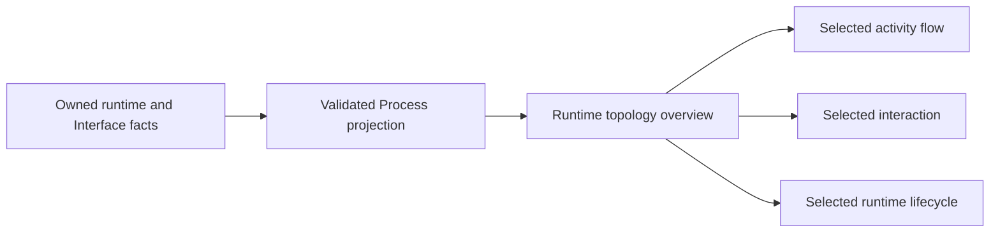

# Operational Support

This directory defines RigorLoop's representation and validation of its engineering model.
The reusable [REM Operational Support model](../../rem/models/operational-support.md) describes the responsibilities independently of storage format or tooling.

The [initial authoring profile decisions](../requirements/sources.md#src-question-resolution) locate the selected requirements for model scope, retention, recovery, evidence, metamodel compatibility, authoring guidance, handoffs, authority, and learning.
They define intended behavior and assessment boundaries; the schemas below implement record-shape checks only.

## Record schemas

The current draft authoring profile uses eight self-contained entity schemas and seven self-contained realization-facet schemas, all JSON Schema Draft 2020-12:

| Record | Schema | Meaning |
| --- | --- | --- |
| `ir.json` | [ir.schema.json](schemas/ir.schema.json) | Initial need with 5W2H analysis and attributed sources |
| `sr.json` | [sr.schema.json](schemas/sr.schema.json) | System obligation with 5W2H analysis, acceptance criteria, and attributed sources |
| `AR-*.json` | [ar.schema.json](schemas/ar.schema.json) | Lower-level obligation with 5W2H analysis, acceptance criteria, and one accountable Module |
| `SCN-*.json` | [scenario.schema.json](schemas/scenario.schema.json) | Governed stakeholder situation, observable interaction and outcomes, and links to its primary Feature and SRs |
| `FEAT-*.json` | [feature.schema.json](schemas/feature.schema.json) | Durable capability, scope, and realizing Functions |
| `FUNC-*.json` | [function.schema.json](schemas/function.schema.json) | Logical behavior, inputs, outputs, failures, and allocation disposition |
| `module.json` | [module.schema.json](schemas/module.schema.json) | Architectural responsibility, state ownership, boundaries, and Interface references |
| `interface.json` | [interface.schema.json](schemas/interface.schema.json) | Operations, outcomes, consistency, and compatibility at an interaction boundary |

Each schema contains its own field rules; requirement schemas contain their inline analysis definitions.
There is no shared schema or separate 5W2H schema.
The [requirement authoring guide](../requirements/README.md#record-content-and-schemas) explains the fields and directory conventions.

The IR, SR, and AR schemas require nonblank text and all seven 5W2H objects under `analysis`, including `what`.
The requirement `statement` remains authoritative; `analysis.what` explains its problem and desired outcome without copying it.
Stakeholder, condition, context, and source lists must be nonempty.
SRs and ARs additionally require nonempty acceptance criteria.
The required root lists `assumptions` and `constraints` may be empty.
For IR, SR, AR, and Scenario, `open_questions` is optional and contains exactly one nonblank entry when present. Omit it when no consequential question remains; empty lists are rejected.
The [question-selection rule](../../rem/methods/requirement-analysis.md#keep-one-consequential-open-question) defines how to select and ask one valuable question at a time; schema validation enforces the count, while engineering review assesses its value and whether independent questions have been bundled.
Optional fields may be omitted, optional 5W2H lists may be empty, and no field accepts `null`.
Unknown fields and unsupported vocabulary are rejected: each schema fixes its record `type`, and `5W2H` is the selected requirement-analysis method.
IR, SR, AR, Feature, Function, Module, and Interface schemas currently permit only `draft` status. Scenario status may be `draft`, `confirmed`, or `obsolete` under the [Scenario lifecycle](../../rem/models/scenarios.md#lifecycle).
An empty list does not establish completeness, approval, or satisfaction; the authoring guide explains each field's meaning.

The schemas describe the contents of one record.
A validator must explicitly select the schema by the declared collection and filename above; placing the schemas here does not automatically validate files.
Cross-file and engineering review must still check:

- Unique identities across the governed model and their agreement with directory names.
- Exactly one IR parent for each SR and exactly one SR parent for each AR.
- Exactly one owning IR for each Scenario, recorded by an incoming IR `confirms` reference.
- Resolvable, correctly typed relationships and attributable sources.
- Clear names, sound derivation, meaningful analysis, and assessable obligations.
- Valid lifecycle transitions, including sufficient downstream obligation analysis before Scenario confirmation.
- Applicable evidence before a satisfaction claim.

Lifecycle transitions beyond the selected Scenario profile and runtime validation integration remain to be defined as the model develops.

A product-specific analysis walkthrough is optional supporting material. Before removing one, reconcile its unique conclusions with the owning requirement/design records and refresh derived views. Keep review evidence and migration history in the associated supporting change record, with the original assessed subjects and limits preserved; they do not become current architectural definitions.

## Scenario and system-design records

[Scenarios](../requirements/scenarios/README.md) live in `design/requirements/scenarios/<SCN-ID>-<title-slug>.json` as governed Requirement Analysis entities, outside the requirement containment tree.
Each records its actor, goal, context, trigger, preconditions, observable interaction, expected outcome, alternatives, failures, and typed relationships.
Each `interaction` entry has `actor` and `action`, with observable system responses represented as actions by the system. It must remain meaningful independently of internal solution design.
`exercises` records at most one primary Feature; it may be empty in a draft. Confirmed Scenarios require exactly one primary Feature, which must also be confirmed by their owning IR, and this profile retains that reference when they become obsolete.
The schema permits an empty `informs` array, but does not authorize lifecycle confirmation. Refined Scenario Analysis requires sufficient downstream SR analysis or an explicit conclusion before confirmation; a Scenario introducing no additional obligation may record that conclusion in `coverage_note`.
That completion rule and the validity of lifecycle transitions require engineering review; accepting the state vocabulary in JSON does not perform those reviews.

[Features](../system/features/README.md) live in `design/system/features/<FEAT-ID>-<title-slug>.json` and describe durable capability through `description` and `scope.includes` / `scope.excludes`.
Their required `realized_by` list may be empty until SR analysis establishes Functions.
[Functions](../system/functions/README.md) live in `design/system/functions/<FUNC-ID>-<title-slug>.json` and define inputs, preconditions, outputs, behavior, and failure behavior.
Each Function has exactly one of `allocated_to` (one accountable Module) or `unallocated_reason` (explicit reason and limits for deferred allocation).
All 63 current Functions retain draft `allocated_to` references to the 15 child Modules within the proposed 19-Module hierarchy. The four parents expose derived descendant coverage without acquiring duplicate allocations. The [Architecture Design](../architecture/README.md) distinguishes this responsibility map from the bounded Interface and AR coverage developed so far.

Every new record begins with a stable ID, type, title, draft status, and nonempty attributed `sources` using the [source register](../requirements/sources.md).
Scenarios may record one consequential `open_questions` entry under the same rule as IRs and SRs. Feature and Function records have no `open_questions` field; their closed schemas reject it.
Scenario alternatives and failures, and Function failures, use closed `{ "condition": "...", "outcome": "..." }` objects.
Scenario alternatives achieve the stated goal through a different path; failures prevent or limit that goal. Honest retrieval diagnostics can therefore be successful alternatives when recognizing gaps is the goal.
Preconditions, alternatives/failure lists, and scope exclusions may be empty when none are recorded; required interactions, inputs, outputs, behavior, and Feature inclusions are nonempty.
Text is nonblank, objects reject undeclared fields, and `null` is unsupported throughout.
5W2H is not mechanically copied into Scenarios or system assets.

## Architecture and allocated-requirement records

[Modules](../architecture/modules/README.md) begin at `design/architecture/modules/<MOD-ID>-<retained-slug>/module.json`. Children live recursively in their parent's `modules/<MOD-ID>-<retained-slug>/module.json` collection.
Each records its `description`, nonempty `responsibilities`, `owned_state`, and `scope.includes` / `scope.excludes`.
The required `provides` and `consumes` lists reference Interfaces through unique stable IDs; they may be empty.
`owned_state` may be empty for a Module that owns no enduring state. Nonempty `design_limits` records the scope of the proposed design and any deferred contract detail.
Do not interpret an empty Interface list as evidence that all dependencies have been analyzed; inspect the Module's stated limits.

[Interfaces](../architecture/interfaces/README.md) live in `design/architecture/interfaces/<IF-ID>-<title-slug>/interface.json`.
Each has a description, nonempty `operations`, `consistency_rules`, and `compatibility_rules`.
An operation records a lowercase snake_case `name`, `purpose`, nonempty `inputs`, `outputs`, and `behavior`, plus `preconditions` and `failure_behavior` lists that may be empty.
Failure entries use closed `{ "condition": "...", "outcome": "..." }` objects.
Operation names must be unique within the Interface; the focused check below enforces that rule beyond JSON Schema.
Provider and consumer views are derived from Module references, never repeated in Interface fields. Each of the ten current Interfaces has one provider and at least one consumer. Refined REM requires exactly one provider and allows zero or more consumers; the stronger current consumer-count check is a property of this authored model, beyond the individual-record JSON Schema.
`provides` identifies the Module accountable for the Interface contract. A parent may own that contract while its children retain the Functions and ARs that realize the behavior. Implementation location does not create another provider; child realization does not by itself add a `consumes` relationship. The existing allocations and responsibility definitions describe those contributions without adding a duplicate realization relationship.

Module parentage is authored once by directory containment. Top-level Modules have no Module parent; every nested Module has one enclosing Module. Each enclosing owner must have a valid `module.json`, and every level uses the same identity and retained-directory naming rules. Do not add `parent_module`, `children`, or copied descendant allocations to JSON. Discover nested Modules only through the named `modules/` collections and reject unsupported JSON placement, missing owners, repeated identities, and symbolic-link containment. The current representation has four Module trees and imposes no additional fixed depth limit.

An Interface may author `exposed_through`, a nonempty array of unique Module IDs. Omit it when no parent exposure is declared. Every exposure target must be a strict ancestor of the Interface's single provider. Exposure through a higher ancestor requires exposure through every intervening provider ancestor. For each declared consumer, every provider-side parent whose subtree excludes that consumer must expose the Interface. A consumer parent's ancestry does not itself create an exposure requirement. Exposure for an external actor may be declared even when no Module consumer crosses that boundary.

Exposure preserves Interface identity and the original provider; it creates no wrapper or additional provider. Parent exposure lists and collapsed collaboration views are derived from the Interface field. In the current model, MOD-018 directly provides IF-004 and MOD-019 directly provides IF-006, so neither Interface declares `exposed_through`. MOD-012 remains the IF-004 consumer and MOD-010 remains the IF-006 consumer. MOD-010/MOD-011 and MOD-014 retain their respective command/record and installation behavior allocations. IF-001/002/003/005 retain their child providers and internal scope. Absence of further exposure or collaboration does not establish that all cross-parent contracts have been designed. The ownership refinement record (historical operational reference; original assessment unavailable in the current tree) identifies this bounded change and its preservation checks.
MOD-016 also provides IF-007 to MOD-005, while MOD-017 provides IF-008 to MOD-012 and IF-009/IF-010 to MOD-015. These selected parent-owned contracts declare no descendant exposure. State acquisition remains distinct from Baseline retention; adopted model-authoring guidance remains a bounded specialist branch; action authority and evidence support remain separate inputs to release qualification. The parent-boundary contract record (historical operational reference; original assessment unavailable in the current tree) identifies their derivation and retained gaps.

An AR lives directly inside its owning SR directory as `<AR-ID>-<title-slug>.json`.
Its `statement`, inline 5W2H `analysis`, `acceptance_criteria`, `assumptions`, `constraints`, and `sources` use the requirement profile described above, with exactly one scalar `allocated_to` Module reference.
Optional `constrains` links identify Functions shaped by the obligation. ARs do not have `confirms`, a copied parent ID, or an unallocated disposition.
Containment supplies exactly one parent SR, and the stable AR identity does not encode that parent.
An AR may record one consequential open question under the requirement rule. Modules and Interfaces, like Features and Functions, reject `open_questions`.

The current target architecture contains 19 draft Modules (four parents and 15 children), ten draft Interfaces, and 28 draft ARs: nine under IR-001, one under IR-005's SR-012, and 18 under IR-008's eight SRs. The complete model contains 273 engineering entities.
Detailed AR coverage includes the first pilot and the [CLI allocation](../architecture/views/browser/index.html#cooperation). The original six Interfaces retain their contracts; IF-007/008/009/010 add the selected [parent-boundary cooperation](../architecture/views/browser/index.html#scenarios). Further interactions and ARs remain explicit `design_limits`.
These records propose an architecture. Selected owners additionally carry explicitly attributed implementation observations under the subordinate profile below; those observations do not establish conformance or complete architectural coverage of all ten IRs.

### Subordinate realization views

Each Module or Interface owns one directory containing its logical definition and optional realization facets. This applies REM's [architecture realization model](../../rem/models/architecture-design.md#architecture-realization-views) without making subordinate records independent entities.

```text
architecture/
├── modules/
│   └── MOD-018-engineering-operations/
│       ├── module.json
│       └── modules/
│           └── MOD-010-engineering-command-interface/
│               ├── module.json
│               └── realization/
│                   ├── software.json
│                   ├── runtime.json
│                   ├── persistence.json
│                   ├── deployment.json
│                   └── technology.json
├── interfaces/
│   └── IF-004-scoped-public-command-execution/
│       ├── interface.json
│       └── realization/
│           ├── interaction.json
│           └── representation.json
└── views/
    ├── README.md                Reading and generation instructions
    └── browser/                 Generated HTML and D2/SVG diagrams
        ├── index.html
        ├── diagrams/
        └── manifest.sha256
```

The logical record owns stable `id` and readable `title`. A Module directory retains its ID-prefixed descriptive suffix when the title changes; Interface directories retain title-derived naming. Containment determines the facet's owner. Do not repeat an owner ID, add a global entity ID/type/status, or embed a second inline `realization` in the logical JSON.
Facet content inherits the owning record's lifecycle and attributed design basis. The owning definition remains authoritative for logical responsibility, state authority, operations, and typed relationships.

| Owner | Optional facet | Material content and schema |
| --- | --- | --- |
| Module | `software.json` | Software/source units, production paths, test groups, published procedural entries and their contributions: [software schema](schemas/realization/software.schema.json) |
| Module | `runtime.json` | Process, execution, lifecycle, isolation, and concurrency: [runtime schema](schemas/realization/runtime.schema.json) |
| Module | `persistence.json` | Physical retention of owned or used state: [persistence schema](schemas/realization/persistence.schema.json) |
| Module | `deployment.json` | Packaging, placement, deployment, and external runtime dependencies: [deployment schema](schemas/realization/deployment.schema.json) |
| Module or Interface | `technology.json` | Material technology observations and selection rationale: [technology schema](schemas/realization/technology.schema.json) |
| Interface | `interaction.json` | Mechanism, concrete bindings, public command entries, addressing, and physical failure/compatibility behavior: [interaction schema](schemas/realization/interaction.schema.json) |
| Interface | `representation.json` | Exchanged data, serialization, and encoding: [representation schema](schemas/realization/representation.schema.json) |

Create only material facets. A Module need not have all five files, and an Interface need not have all three. Missing files do not prove completeness. Keep unresolved work in a relevant facet's `deferred` section or the owning logical definition's existing limits; do not create empty placeholders.

Each facet file is a closed object with at least one of these sections:

| Section | Content |
| --- | --- |
| `observed` | Attributed implementation facts. Requires nonempty `sources` in the existing source/locator/basis format and at least one permitted content field. |
| `proposed` | Nonempty list of material choices. Each requires `choice`, `rationale`, and nonempty `alternatives`, `consequences`, and `revisit_when` lists. Explain why alternatives were not selected. |
| `deferred` | Nonempty list describing unresolved realization work and its scope or completion boundary. This is not an `open_questions` list. |

`software.json` permits `observed.software_units`; `runtime.json` permits `observed.runtime`; `persistence.json` permits `observed.persistence`; `deployment.json` permits `observed.packaging`; `technology.json` permits `observed.technologies`; and `representation.json` permits `observed.representation`.
`interaction.json` permits `observed.bindings`, `mechanism`, `addressing`, and `failure_compatibility`.
`software_units` and `bindings` contain `{ "path": "repository-relative/source/file", "role": "..." }` objects; paths identify inspected source artifacts, not new REM entities. Describe relevant symbols and their contribution in `role`.
Software observations may also contain `production_paths`: named mappings with nonempty `inputs`, one `transformation`, and nonempty `outputs`. Each input/output contains `path` and `role`; the transformation contains `path` and `description`. Input and transformation paths identify inspected repository sources. Output paths describe candidate-relative layouts or templates, whose base and qualification belong in their roles; they are not source links or evidence that an artifact has been built. Existing observation attribution is required. The browser renders these declared mappings directly instead of inferring a production chain from prose or catalog membership. This additive authoring-profile field does not change existing records or product runtime contracts.
Runtime observations may contain one `execution` object with `name`, `environment`, participating `modules`, `entry_interfaces`, conditional `calls`, and `constraints`. Each call has `caller`, `callee`, and `interface`. Module and Interface references must resolve; call endpoints belong to that execution context, the caller consumes the contract, and the callee is its provider or a contributing descendant. An entry contract's provider contains a participating Module or participates itself. Execution participation never adds a logical provider, allocation, or Module containment edge. The current shared CLI process is authored once under MOD-010; calls describe selected paths, not a sequence or a promise that every path runs.
Deployment and persistence observations may contain `placements`, each with `name`, `location`, participating `modules`, `paths`, and `constraints`. Paths describe installed, retained, or candidate locations and are not automatically repository source links. Each execution/placement includes its accountable facet owner; text and reference lists are nonempty, with `calls` allowed to be empty. References and paths are unique within their lists. These subordinate structures retain the facet's existing observation sources and qualification. Graph handles derive from owner, facet, and field position; they are not independently authored engineering identities. Physical participation does not transfer logical state authority.
Physical relationships refer to those existing facts by scope. A placement reference contains `owner`, `facet` (`deployment` or `persistence`), and its exact local `name`. An execution reference contains `owner` and its exact local `name`, resolving the owner's runtime `execution`. Similar location text does not establish shared machines, roots, or filesystems. These references create neither independent entities nor duplicate Module allocations.
Deployment observations may contain `physical_bindings`. Each has `name`, `execution`, `package` (a placement reference), `accesses`, and nonempty `constraints`. Each access has a participating Module in `participant`, a `placement` reference, `mode` (`read`, `write`, or `read-write`), `purpose`, and nonempty `conditions`. Accesses may be empty for a package-only binding. The accountable owner participates in the referenced execution; the package placement contains that owner and the participating Modules. An access participant must belong to that execution. Conditional access does not establish sequence, successful effects, or that every participant accesses every store. A package remains an artifact, distinct from execution and host placement.
Deployment observations may also contain `production_placement`, with three distinct placement references named `source`, `workspace`, and `output`, plus nonempty `constraints`. These roles describe one source-observed production arrangement without asserting three machines, three processes, publication, or delivery to a consumer. Transformations remain in the owning software `production_paths`.
Deployment and persistence observations may contain `location_constraints`. Each has `name`, `relation` (`disjoint` or `same-filesystem`), exactly two distinct `placements`, nonempty `conditions`, and `rationale`. At least one referenced placement includes the accountable facet owner. `disjoint` describes the declared containment scopes rather than device separation; `same-filesystem` states a conditional placement requirement rather than a platform qualification. Constraints retain their conditions and do not become transfer edges.
Interaction observations may contain `artifact_acquisition`, with `name`, an `execution` reference, executing `participant`, named `artifact`, nonempty alternative `sources`, and nonempty `constraints`. Each source has `name`, descriptive `transport`, `address`, and nonempty `conditions`. The participant belongs to the referenced execution and the Interface provider boundary. Transport and address describe an inspected acquisition choice; they do not assert availability, every network hop, a deployed artifact, or successful acquisition. An explicit local source is not implicitly connected to producer output. Dry-run and other non-acquiring paths retain their conditions. These structures share the containing facet's source attribution and reject unknown fields, blank required text, and unresolved references.
Interaction observations may contain `sequences`: named, source-observed interactions for an `operation` on the containing Interface. Each requires `participants`, `preconditions`, ordered `steps`, an `outcome`, `failures`, and `constraints`. A step has `name`, `participant`, and `action`; its optional `branches` contain a `condition`, flat ordered `steps` of the same basic shape, and an `outcome`. Every branch is a terminal alternative: it does not rejoin the main sequence. Each failure contains its `condition`, `outcome`, and known `effects`; unknown effects must remain explicit. All lists are nonempty when present. Participants must resolve to Modules in the provider or declared consumer boundaries, include the provider or a contributing descendant, and cover every main/branch step. A parent-owned contract does not make its parent an executing participant; exact Interface ownership remains unchanged. Operation names resolve to the containing Interface. Local sequence and step names must be unambiguous within their enclosing structure; they create no independent engineering identities. Source inspection, rather than Scenario reachability, establishes the recorded order and conditional alternatives.
Runtime observations may contain `lifecycles` of Module-owned coordination, each with `name`, named `states` and their `meaning`, guarded `transitions`, and `constraints`. Each transition names existing `from`/`to` states, a `trigger`, nonempty `guards`, and nonempty `effects`. Unknown fields, unresolved states, duplicate local names or duplicate transitions reject. A descriptive absence state must be distinguished from actual stored discriminators; missing or untrusted evidence does not acquire an inferred state or repair transition. These lifecycles describe inspected runtime coordination, not workflow approval or completion. The current record-journal lifecycle separates the only stored phases, `prepared` and `committed`, from physical journal absence and preserves reader gates, writer exclusion, and unresolved outcomes in its constraints.
The public-entry structures below are additional permitted content in software and interaction facets. Remaining content fields are nonempty lists of nonblank text. All objects reject unknown fields and `null`; JSON names use `snake_case`.

An observation needs attribution and content. A proposed-only or deferred-only file is valid when material; none of these partial states establishes completeness. Proposed choices can retain a sourced mechanism with a reason or describe a future mechanism without implying implementation.
Author each fact at one scope. For example, MOD-010's deployment facet owns the shared CLI package mapping and MOD-011 refers to it. A shared source file can appear for different responsibility contributions without becoming an exclusive Module boundary.
Technology selection rationale belongs once in the owning `technology.json`; another facet can refer to that file and owner without duplicating the decision. Behavioral or sequencing decisions belong in their applicable facet. Moving a record must preserve these references and the meaning of every observation, choice, and deferral.

The [aggregate views](../architecture/views/README.md) derive from canonical definitions, facet files, and attributed requirement analysis where needed for traceability. They introduce no independent requirements, ownership, allocations, or technology choices. Refresh affected views when canonical information changes; the remaining unmodeled scope stays visible.
The first populated example covers MOD-010/MOD-011 and IF-003/IF-004. Their 14 facet files retain the source observations, choices, and deferrals from the earlier inline views. MOD-012 additionally owns a software facet for public skill entries. Product production and installation contribute further bounded observations as recorded in their owning facets; the current view selection discovers these material facets directly. Other logical architecture records need no empty realization directory. A parent may own material realization in its own right; child realization is not copied into it.

Cross-file checks select logical entities only from valid recursive Module owner directories or the shared Interface collection, select facet schemas by owner kind and filename, and reject unsupported, misplaced, or orphan JSON files. Facets do not add to the governed entity count or become typed relationship targets.
Source inspection must still check observed paths and symbols against their attributed revision. Neither schema acceptance nor a linked path establishes implementation conformance or architectural adequacy.

### Test architecture observations

Module software observations may contain nonempty `test_groups`. Each group records a locally unique readable `name`, a repository Markdown `contract` for its coverage authority, nonempty `test_sources`, an `observation_boundary`, `fixtures`, `execution`, `required_artifacts`, and nonempty `limits`. Source and fixture entries contain an exact repository file `path` and a group-specific dependency `role`. Fixture lists may be empty; shared helper files can describe their fixture population without duplicating it in the engineering model.

`execution` records the retained execution `owner_contract`, `selection`, `runners`, and `entrypoints`. Each dependency list uses the same path/role shape. Selection may be empty for a direct group; runners and entrypoints are nonempty. Paths must resolve to files contained in the selected repository. Contracts may include a Markdown heading fragment. Repeated paths in different groups represent distinct uses of the same dependency, not independent copies or new ownership. Required artifacts are descriptive prerequisites, not paths asserted to exist; this list may be empty. Unknown fields, blank required text, duplicate names or paths within a list, and missing references reject before rendering. Existing facet `sources` supplies attribution.

The containing Module is the responsibility under assessment. Test groups are separate from `software_units` and add no Function allocation, implementation ownership, logical edge, global identity or lifecycle. The coverage contract defines protected outcomes; the execution contract owns scheduling and machinery; assessment retains evidence applicability and judgment. The current bounded CLI, Records, Installation and Packaging observations reference retained Engineering/Validation execution ownership. Its mapping to a REM Module remains explicitly unresolved; MOD-007's assurance-information responsibility does not fill that gap.

The Development browser derives its test overview and subject details from these groups. It preserves boundaries, prerequisites, provenance and limits, and links to the maintained coverage and execution contracts rather than copying test cases or results. Test-source existence does not establish sufficient coverage or passing tests. Material runtime scheduling and physical test environments remain Process and Physical concerns; this refinement makes no new claims about those concerns.

### Public entries and proposed correspondence

The [REM discoverability principle](../../rem/principles/README.md) is implemented through the existing interaction and software facets. IF-004's `interaction.json` owns exact public command names. MOD-012's `software.json` owns public skill names. These subordinate entries have no independent REM type, global identity, or lifecycle.

`observed.public_entries` is an optional nonempty array. Each entry requires `name`, `group`, `purpose`, `source_path`, and `contract`. Names are unique within the facet; groups are readable navigation labels, not closed architectural categories. `source_path` identifies an existing repository-relative file, and `contract` identifies a local Markdown contract with an optional anchor. Command entries also require `operation`, resolving to an operation on the owning Interface. Software entries reject that field. Paths to SKILL.md may be checked for existence without reading or invoking the skill.

A reasoned `proposed` choice may add `public_entry_mappings`. Each mapping requires `entry`, `functions`, and `limits`. `entry` references an observed name in the same facet. Every observed entry has exactly one mapping across the facet's choices; orphaned and duplicate mappings reject. Every Function contribution requires a compatible `function` reference, a closed `relation` value, and explanatory `contribution` text. The relation vocabulary is:

| Relation | Proposed contribution |
| --- | --- |
| `guides` | Directs a participant's performance of the behavior |
| `invokes` | Requests the behavior through an execution path |
| `realizes` | Contributes implementation of the behavior |

An empty Function list requires a nonempty `limits` list explaining the unresolved correspondence. Nonempty mappings may also retain limitations. Function/relation pairs are unique within an entry. Schema validity does not establish that a contribution is semantically adequate.

A material `proposed` choice may separately declare `public_capabilities`, the intended public design. Each entry requires `name`, `group`, `purpose`, `contract`, `functions` and `limits`. Names are unique across all choices in the owner/facet. Function contributions use the same vocabulary and validation above, including explicit limits when unresolved. The contract must resolve to an existing contained design source. Implementation source paths and current Interface dispatch operations are not required or inferred. A retained capability is selected explicitly in the design catalogue; observed entries are never copied into it by the renderer. These subordinate entries add no REM entity or approval state.

Observed entries describe the inspected source population; proposed mappings remain engineering analysis. Neither establishes installed availability, product qualification, complete specialist coverage, or satisfaction. Derive Feature context from `realized_by` and responsibility from each Function's `allocated_to` or explicit unallocated disposition. Catalog placement supplies navigation ownership, not a new behavior allocation, Interface provider, or Scenario execution edge. A skill's common invocation mapping does not replace its detailed specialist owner.

Keep exact syntax, flags, procedural detail, authority, and failure guarantees at the linked source contract. Public capabilities and its entry search project only the designed catalogues; absent design data remains an explicit gap. Development retains attributed observed source entries. The marked skill inventory in [published products](../requirements/published-products.md#existing-published-capabilities-and-owners) continues to project observed entries for its current-source analysis. That document retains its separate source-qualified specialist obligation analysis outside the generated block. The public-entry record (historical operational reference; original assessment unavailable in the current tree) records this profile extension and its bounded evidence.

## Four plus one view projection

The [five architecture views](../architecture/views/README.md) implement REM's [4+1 method](../../rem/methods/architecture-views.md) for this draft application profile. `scripts/lib/rem_architecture_model.py` reads canonical JSON into a validated relationship index and derives the shared semantic projections. `scripts/render-rem-architecture-browser.py` renders their maintained browser presentation. `scripts/render-rem-product-inventory.py` independently refreshes the marked public skill inventory in `requirements/published-products.md`, preserving the rest of that document. These repository tools are implementation choices, separate from the tool-independent REM method and the published RigorLoop CLI.

The Logical projection begins with the four parent Modules and their visible boundary Interfaces, then reveals child responsibilities and internal collaboration. Direct allocations and descendant coverage remain distinct, with exact accountable owners and unique-entity totals. Process, Development, and Physical select their material facet kinds from all recorded owners, retaining containment and source qualifications. The original CLI scope, MOD-012 software catalog, and bounded product-production/installation observations share the same projection rules; a catalog alone supplies no runtime or deployment facts. The +1 projection uses the following explicit contract scopes; these are bounded view selections, not additional authored Scenario relationships or complete satisfaction claims.

| Selected Scenario | Interface scope | Bounded contribution |
| --- | --- | --- |
| SCN-019 | IF-007 | Acquire selected-state content and interpretation; Baseline retention remains MOD-005's responsibility and requires separate confirmation |
| SCN-046 | IF-003, IF-004 | Coherent publication and faithful command outcomes |
| SCN-047 | IF-003, IF-004 | Explicit verified recovery and its reported outcome |
| SCN-053 | IF-008 | Select and explain adopted model-authoring guidance within the specialist activity |
| SCN-066 | IF-005, IF-009, IF-010 | Supply candidate artifacts and separate authority/evidence inputs; exact release qualification remains with MOD-015 |

Ancestry supplies structural context rather than extra executing participants. Include a selected contract's actual provider as context when it is reached through an allocated consumer's `consumes` relationship or through the selected ancestor-owned contract. Both roles must follow actual Module `provides`/`consumes` facts. Do not inherit every ancestor-owned Interface into every descendant Scenario. Displaying contract-owner context does not create another allocation or assert that the provider executes in that Scenario.

### Scenario outcome reading profile

The shared projection's `scripts/lib/rem_architecture_scenarios.py` selects explanatory context for the eleven expected, alternative and failure outcomes of SCN-046 publication and SCN-047 recovery. It implements REM's [outcome walkthrough method](../../rem/methods/architecture-views.md#outcome-walkthroughs). Canonical Scenario records and their schema retain only their existing stakeholder meaning and requirement relationships. No internal architecture or outcome-coverage assertion is added to them.

Each projected outcome retains its exact Scenario source pointer, condition and outcome text. Short labels are navigation aids. Pilot selections identify existing SR/AR acceptance criteria and material realization fields; the generated representation retains their canonical paths and field pointers. Selected SRs must be informed by that Scenario, and selected ARs must belong to an informed SR. Accountable Modules derive from the selected AR allocations; Interface provider context retains the logical model's exact ownership. Reading selection does not add a logical relationship or turn contextual parents into executing participants.

A source criterion explaining unresolved wording may appear separately under reading limits, with its exact pointer and text. Such a limitation reference is not a supporting obligation and does not contribute an outcome allocation. SCN-046 retains this distinction for AR-018's batch-creation wording; the profile exposes the ambiguity without rewriting the requirement or deciding its resolution.

Process, Development and Physical selections identify compatible realization facts within the selected architecture scope. Named structured items are resolved before emitting their current source pointers, so moving an item within its array does not silently select another named item. The browser uses these source references to open applicable view details and retains the exact selected content, its qualifiers and attribution beside the link. A broader destination diagram remains contextual; it cannot expand the selected outcome's scope. Internal sequence comes only from recorded Process interactions, never from the order of outcome cards or a list of selected criteria.

Test-group references select contextual test organization. They retain observation boundaries, prerequisites and limitations; this profile contains no outcome-specific coverage argument or applicable execution evidence. The UI states that distinction instead of treating a shared Module as proof of coverage. It also distinguishes no selected detail from an architectural absence. All outcomes of the other three selected Scenarios remain visible with detailed reading selections explicitly undeveloped, while their existing broad traceability and source qualifications remain available.

Validate the entire selected profile before rendering or invoking a compiler. Reject unsupported selector shapes, missing or incompatible references, out-of-scope requirements, unresolved named realization items and duplicate outcome selections. A newly added or removed pilot outcome requires reconciliation of its reading scope. View presentation and source selection are implementation-owned under Operational Support; changes to actual guarantees, allocation, collaboration or realization return to their canonical owners.

Logical CLI cooperation uses the following explicit reading selections, carried forward from the earlier derived walkthrough. These select related obligations for explanation; they do not add Scenario relationships, claim complete applicability, or assert execution. Canonical Scenario outcomes, AR statements/criteria/allocation, Interface contracts and source-owned contribution arguments supply the content. Broad traversal through an informed SR must not silently expand these selected AR sets.

| CLI walkthrough | Selected ARs |
| --- | --- |
| SCN-041 | AR-013, AR-014 |
| SCN-042 | AR-013, AR-014, AR-024 |
| SCN-043 | AR-015 |
| SCN-044 | AR-017, AR-019, AR-020 |
| SCN-045 | AR-016, AR-017 |
| SCN-046 | AR-020, AR-021, AR-025, AR-026 |
| SCN-047 | AR-022, AR-023 |
| SCN-048 | AR-011, AR-012 |
| SCN-049 | AR-027, AR-028 |

The cooperation overview groups the IF-003/IF-004 contract into admission, coherent reads, declared-subject inspection, preview, fresh construction, publication, truthful outcomes and recovery reading topics. Their ordering supports comprehension and does not define an observed runtime sequence. All 44 CLI acceptance-contribution arguments are separately readable with their exact SR criterion, AR contributors and source attribution.

The offline [architecture browser](../architecture/views/browser/index.html), generated by `scripts/render-rem-architecture-browser.py`, presents all five views from the shared validated model. It embeds source-qualified records, shared view selections, Scenario participation slices, navigation indexes, and linked SVG diagrams for every view. Process selects runtime/interaction facets; Development selects software/representation/technology facets plus interaction facets containing concrete bindings; Physical selects deployment/persistence facets plus interaction facets containing explicit artifact acquisition. Material records are discovered rather than limited to the original CLI pilot. A facet's inclusion retains its owning concern and qualification. D2 0.9.0 with ELK is the pinned layout compiler; the browser requires no compiler, CDN, fetch, or server. The companion generated D2 and SVG files are replaceable presentation artifacts, not authored design sources. `manifest.sha256` identifies their bytes and compiler. UI templates are authored under `scripts/resources/rem-architecture-browser/`.

Process graphs derive execution boundaries and conditional paths from `observed.execution`; they do not turn runtime callees into logical Interface providers. Development graphs derive software/binding mappings and explicit production paths without treating shared files as dependency edges. Its Test architecture perspective derives assessment and supporting dependency relationships from `observed.test_groups`, preserving execution ownership and observation limits separately from product implementation. Physical graphs derive the existing placements and explicit consumer bindings, conditional storage accesses, location constraints, production arrangement, and acquisition alternatives. They preserve source qualifications and distinct logical state authority without inventing hosts, transfers, or a producer-to-consumer delivery. Scenario graphs reuse the selected requirement/allocation/context slices below; their arrows describe traceability and contract context, not a call sequence. Each graph explains its edge meanings and links to its owning facts. Focused graphs supplement overview summaries where full inventories would obscure the concern.

The overview shows four parent responsibilities and declared cross-parent collaboration, with draft/selected-scope qualification and access to the owners' recorded `design_limits`. Missing edges do not imply independence. Render limits directly without guessing categories from prose or inventing collaboration. Counts are descriptive and do not establish coverage adequacy. Separate searchable Commands and Skills pages present designed names, Function correspondence, derived Feature/Module context and limits. Observed names remain attributed Development facts. Catalog placement does not change exact accountability.

RigorLoop applies REM's [optional Logical reading perspectives](../../rem/methods/architecture-views.md#logical-reading-perspectives) through the following browser organization. These choices belong to this application profile; the [original method and REM adaptation](../../rem/methods/architecture-views.md#origin-and-reference) do not prescribe these pages or product categories.

| Reading perspective | RigorLoop presentation |
| --- | --- |
| Architecture overview | Parent responsibility diagram, Module cards, and recorded scope limits |
| Technical structure | Registered Logical component-and-contract diagrams beneath the selected Module's responsibility overview; MOD-004 supplies the browser example with technologies and explicit realization ownership in its source |
| Public capabilities | Commands and Skills catalogs with individual entry details; the explicitly bound Architecture browser page is defined by MOD-004's owning reading design |
| Module structure | Module page, immediate child cards, and responsibility/state/scope details |
| Collaboration | Scoped diagram and named Interface list on the overview or selected Module page |
| Interface contract | Interface detail page with exact owners, operations, guarantees, failures, and compatibility |
| Behavior and requirement allocation | Public-entry Function correspondence and Module Function/AR disclosures, retaining distinct direct and descendant allocations |

The shared **Public capabilities** grouping is a reading level, not an additional Module or architectural dependency layer. The Commands catalog remains owned by IF-004's interaction facet under MOD-018's public-contract accountability; MOD-010 retains its allocated command behavior. The Skills catalog remains owned by MOD-012's software facet, with specialist Functions retaining their actual accountable Modules. Grouping the catalogs does not require every skill to invoke a command, establish execution order, or change published product support.

The [Architecture browser capability design](../architecture/modules/MOD-016-engineering-model-management/modules/MOD-004-engineering-context-and-traceability/README.md#architecture-browser-as-a-public-capability) defines a distinct web reading destination to this grouping. Its explicit binding, availability limits and source composition belong to MOD-004; it is not another `observed.public_entries` command or skill. This design does not extend the admitted entity/facet schemas or establish customer-tool availability. The generated catalogues remain Commands and Skills; a supplied web binding adds its separate capability description under the same navigation heading.

Product production remains a separate responsibility within Packaging and distribution. The Logical view exposes MOD-013's candidate-production Functions and IF-005 artifact contract. Its software realization now records bounded canonical-source, transformation, and candidate-output mappings for the Development view; deployment observations explain production and installation placement in the Physical view. These declarations describe building from canonical skill and CLI sources; they do not establish automatic synthesis of new skill instructions or command implementations from REM entities. Observed source behavior, proposed choices, deferred conformance, and unperformed product qualification remain distinct.

Browser Module routes show one level of child responsibility and relevant collaboration, with breadcrumbs and ordinary browser history. Interface routes show exact providers, consumers, operations, and contract details. Allocations, realization, and provenance are secondary disclosures. Logical navigation also exposes CLI cooperation and all 44 attributed acceptance-contribution arguments. Cooperation walkthroughs cover SCN-041 through SCN-049 and retain their selected obligations and failure boundaries; they are explanations of contract responsibilities, not observed runtime sequences. Canonical JSON remains separately reachable. Empty allocation text distinguishes a leaf from a parent with actual descendant allocations; an empty `owned_state` list reports only the absence of directly recorded state.

Resolve declared references by stable identity and compatible type before rendering. Derive SR/AR parentage and Module parentage from their separate containment structures, and derive inverse relationships from their authored direction. Validate continuous provider-side Interface exposure before projecting a collapsed boundary. The derived 4+1 Architecture View Graph remains a replaceable read model with exact source attribution. Keep facet ownership inherited from its directory. Render linked source paths/fields and a deterministic source digest identifying the actual working input bytes. Output ordering is stable, and generation does not modify source records. The inventory `--check` compares its marked region without writes. The browser `--check` recompiles with pinned D2 and compares its page, diagrams, and manifest without writes. Both fail on missing or stale outputs; invalid references or compilation failures reject before publication. The retired Markdown views and renderer have no compatibility entrypoints or duplicate-output path.

`Scenario.informs` selects relevant SRs; their `confirms` references and contained ARs identify Functions and allocated responsibilities. These relations produce a participation slice that may include behavior beyond one Scenario's execution. Do not infer call order, concurrency, topology, or satisfaction from reachability. Architecture operations and realization facts supply those concerns where modeled. Existing prose facets can support attributed text and source mappings; gaps requiring finer diagram relationships remain explicit until the owning model is refined.

Keep observations, proposals, and deferrals distinct in every projection. Software paths may contribute to several logical responsibilities; showing a shared file must not merge the Modules. Physical storage location must not become logical data authority. Expose missing placement, compatibility, and realization scope alongside the relevant facets. Generated pages do not establish product verification or change an entity's lifecycle.

The direct [projection tests](../../tests/engineering/validation/architecture_view_tests.py) exercise canonical-input changes, recursive hierarchy, allocation summaries, visible limits, reference/exposure rejection and marked inventory preservation in private temporary roots. Browser generation and inspection cover rendered navigation, regeneration, drift and failure-before-write behavior. Independent source comparison assesses diagram and prose meaning. The parent-boundary contract record (historical operational reference; original assessment unavailable in the current tree) owns the expanded Scenario-selection scope and its proof. The Logical refinement record (historical operational reference; original assessment unavailable in the current tree), bounded projection record (historical operational reference; original assessment unavailable in the current tree), and hierarchy migration record (historical operational reference; original assessment unavailable in the current tree) retain their earlier subjects and checks. The [browser tests](../../tests/engineering/validation/architecture_browser_tests.py) additionally protect offline embedding, graph ownership, generation failures, and drift. The browser-view record (historical operational reference; original assessment unavailable in the current tree) records actual rendered navigation and readability inspection; successful structural checks alone do not establish usability. CI integration is outside this manual refactor slice.

## Entity naming and filenames

Apply REM's [clarity principle](../../rem/principles/README.md), [Scenario criteria](../../rem/models/scenarios.md), and [System Design criteria](../../rem/models/system-design.md) to the name and definition before deriving a physical label.
Names communicate engineering meaning; identities preserve continuity.
The title must identify the engineering purpose and subject, distinguish the entity from its neighbors, and agree with its current scope.
Scenario titles describe a stakeholder goal and situation; Feature titles describe a stakeholder capability; Function titles describe a logical action. Prefer action plus subject and add conditions when they distinguish the meaning.
Module titles identify a cohesive architectural responsibility; Interface titles identify the interaction contract; AR titles identify the allocated obligation.

For Scenario, Feature, Function, and AR records, use `<ID>-<title-slug>.json`. For Modules, use `<MOD-ID>-<retained-slug>/module.json`; for Interfaces, use `<IF-ID>-<title-slug>/interface.json`.
The JSON `id` owns stable identity and `title` owns the readable name. Derive the suffix using the same [full-title normalization](../requirements/README.md#directory-naming) as IR and SR directory names.
For a new Module, derive the initial directory suffix from its full title. Retain that suffix when refining the title so existing paths, containment and source links remain stable. The retained suffix must contain lowercase letters/digits separated by single hyphens, and its ID prefix must match the record. Other entity kinds continue to require the current full-title suffix. Do not add a `slug` field or a second display-name field.

For example:

```text
requirements/scenarios/SCN-001-retrieve-a-saved-definition-in-a-later-session.json
system/features/FEAT-001-inspect-engineering-definitions-and-their-rationale.json
system/functions/FUNC-001-retain-engineering-definition.json
architecture/modules/MOD-016-engineering-model-management/modules/MOD-001-engineering-model-storage/module.json
architecture/interfaces/IF-001-engineering-definition-access/interface.json
```

Module title changes preserve the existing owner directory and all subordinate paths; reconcile current readable references and regenerate views. For other entity kinds, a title change still requires renaming the corresponding filename or owner directory and reconciling current path-based links and consumers. Move all subordinate facets with an owner directory when a move is required.
Keep the entity ID and ID-based relationships unchanged when the same entity is renamed.
Check the destination before renaming; a collision or unsupported filename must be resolved without overwriting another record, truncating the title silently, or generating a replacement ID.
Historical paths retain the meaning of their original states.

IRs and SRs use title-derived directories containing `ir.json` or `sr.json`. AR files use the full-title filename convention directly within their single parent SR directory, without an additional AR directory.
It is a repository representation choice. REM's clarity principle also applies to implementations that do not use files.
JSON Schema checks required text and shape; checking filename or directory agreement requires reading the file path, and judging clarity requires engineering review.

## Relationship ownership

JSON names use `snake_case`. REM `realizedBy` is represented by `realized_by`. The existing Function field `allocated_to` represents the accountable `primaryModule` relationship in the refined REM; the same field on an AR represents `allocatedTo`. This task preserves that selected serialized spelling rather than renaming existing records. Supporting Module cooperation is described through the scoped Interface contracts; this profile has not added a separately authored per-Function supporting-Module field.

| Authored record | JSON field | Compatible targets |
| --- | --- | --- |
| IR | `confirms` | Feature or Scenario |
| Scenario | `exercises` | One primary Feature; may be empty in a draft |
| Scenario | `informs` | SR |
| SR | `confirms` | Function |
| SR | `constrains` | Feature or Function |
| Feature | `realized_by` | Function |
| Function | `allocated_to` | Module, when allocated |
| AR | `allocated_to` | Exactly one Module |
| AR | `constrains` | Function |
| Module | `provides` | Interface |
| Module | `consumes` | Interface |
| Interface | `exposed_through` | Strict provider-ancestor Modules, with continuous exposure through intervening ancestors |

All fields except `allocated_to` are arrays of unique stable IDs; schema checks enforce their target prefixes.
The IR and SR relationship fields and AR `constrains` are optional so partial drafts remain valid. Interface `exposed_through` is optional and nonempty when present; omit it when no exposure is declared. The other array fields are required.
Scenario `exercises` has at most one entry, with exactly one required for confirmed and obsolete records.
An empty `informs` in a draft requires SR reconciliation or an explicit no-additional-obligation conclusion before confirmation. An empty `realized_by` leaves logical realization to later SR analysis.
The current analysis records system-design connections across all ten IRs. Functions carry proposed primary Module allocations. Detailed AR coverage includes IR-001, its shared SR-012 dependency, and IR-008; Interface coverage includes the first pilot, the four original published-product contracts, and four selected parent-boundary contracts. Further interactions remain explicitly limited rather than inferred from containment or allocation.
Actual target existence, type, and compatibility require cross-file checks; a correctly spelled ID alone is insufficient.

Author each relation at its source in this table and derive reverse views. Do not add inverse lists or parent IDs to the target.
Requirement parentage still comes solely from directory containment. Scenario ownership is a separate relationship: exactly one IR must reference each Scenario through `confirms`.
Scenarios may inform multiple SRs, and an SR may be informed by multiple Scenarios, without changing requirement parentage.
Textual requirement `constraints` remain distinct from typed `constrains` links.
For Features and Functions, `confirms` records an analysis conclusion. For a Scenario, the IR reference records ownership while its own `status` records lifecycle confirmation separately.
These references grant no approval, execution authority, or satisfaction claim.

## Compatibility and adoption

This extends the unpublished draft profile: existing IR/SR records remain valid without the new optional relationships, and their identities and containment stay unchanged.
Consumers of the extended profile must use the updated schemas; earlier closed schemas correctly reject the new fields.
The question-field refinement permitted the field on IR, SR, and Scenario only when exactly one consequential question was recorded; the architecture extension applies the same rule to ARs. Earlier profiles required IR/SR/Scenario question lists and allowed multiple Scenario questions; consumers must adopt the new optional-field and cardinality rules.
The fourteen IR/SR records and six Scenarios present at that refinement had empty question lists; those fields were removed without discarding any question. A future migration containing several unresolved questions must resolve or reconcile them explicitly rather than truncate the list. Features and Functions continue to reject the field.
The asset naming refinement moved the two Feature and seven Function drafts from ID-only filenames to the title-derived convention. Their IDs, relationship targets, scope, and draft status remained unchanged; collection links were reconciled. Consumers discover these files by collection and read `id` from JSON, rather than treating the full filename stem as identity.
The governed Scenario refinement replaced `flow` with structured `interaction`, added `goal` and `failures`, removed `candidate_behavior`, restricted each Scenario to one primary Feature, and defined the three lifecycle states.
SCN-001 through SCN-004 retain their identities and main stakeholder meanings. Their embedded save and record-rationale goals receive new SCN-005 and SCN-006 identities, all owned by IR-001. The [source register](../requirements/sources.md#src-scenario-model-refinement) records that analysis and its existing SR coverage.
Earlier Scenario JSON must be reconciled with these rules; it will not validate unchanged. That refinement preserved the six Scenario drafts and the existing SR, Feature, and Function meanings.
The Scenario naming refinement moved those six records from ID-only filenames to `<SCN-ID>-<title-slug>.json`, preserving their JSON content, including identity, title, references, scope, sources, and draft status.
Current links use the new paths. Consumers discover Scenarios through `SCN-*.json` and read the JSON `id`; an ID-only filename or the complete filename stem must not be assumed to be the identity.
Current product contracts and runtime validators under `docs/` are unaffected. These authoring schemas do not adopt a new production format or claim that the CLI implements REM.
Current requirements and assets retain draft status. The subsequent seven-IR analysis completed the connected definitions and confirmed 35 Scenarios after semantic review and correction; the format migrations themselves did not confer that status.

The first architecture extension added three self-contained schemas and Module, Interface, and AR records without changing existing Function behavior, requirement parentage, or stable identities.
Each of the then-existing 33 Function records replaced its deferred allocation reason with one draft Module reference and appended the architectural basis in `sources`.
The existing Function schema already supports this representation. Consumers that enumerate entity kinds or validate cross-file references must include the new collections and relationships before relying on the extended model.

The [published-product extension](../requirements/published-products.md) adds three IRs, 29 SRs, nine Features, 30 Functions, 27 confirmed Scenarios, six Modules, and four Interfaces using those same eight schemas. It reconciles IR-006's current schema-availability statement and adds SR-014's confirmation of the two existing Functions it already governs under refined Functional Analysis. Earlier requirement meanings, acceptance criteria, and Function behavior remain unchanged. It does not alter stored CLI record formats, installed guidance, package formats, or release behavior.
The subsequent CLI allocation added 18 ARs using the unchanged AR schema and refined MOD-010/MOD-011 and IF-003/IF-004. Relative to the 247-entity starting subject at `9055b3c0`, all prior requirements, Scenarios, Features, Functions, and other architecture entities retained their bytes. That allocation pass introduced no schema or runtime-format migration.
The earlier realization refinement added optional inline `realization` to the Module and Interface schemas and populated those same four records. The subsequent directory migration supersedes that representation: all 21 logical records move into owner directories, the four views split into 14 facet files, and logical schemas reject inline realization. Seven self-contained facet schemas select permitted content independently of entity identity. Consumers must adopt directory-aware discovery and facet validation together; prior flat paths and inline records are no longer current-profile inputs. Stable identities, logical definitions, allocation, prior provenance, and realization meaning are preserved. No production runtime format is changed.
The responsibility map is a proposed target; detailed contracts and realization mappings beyond the bounded CLI scope remain later work.

## Focused local check

From the repository root, run:

```bash
python3 tests/engineering/validation/requirement_schema_tests.py
python3 tests/engineering/validation/system_design_schema_tests.py
python3 tests/engineering/validation/architecture_schema_tests.py
```

This check requires Python 3 and a `jsonschema` installation supporting Draft 2020-12.
These direct checks validate the schemas and current records, and exercise malformed and unsupported records using independent fixtures.
Requirement checks cover IR/SR 5W2H and optional typed references; requirement and Scenario/system checks cover omission or exactly one nonblank question for IR/SR/Scenario and reject empty or multiple entries.
Scenario/system checks also cover interaction and outcome content, lifecycle vocabulary, primary-Feature cardinality, staged empty links, target prefixes, duplicate references, explicit allocation disposition, and rejection of open questions on Features and Functions.
The Scenario/system suite also checks unique identities, title-derived names, SR and AR containment, exactly one IR owner per Scenario, and compatible existing targets across the current requirement, system-design, and architecture collections.
It checks that the completed analysis has IR-to-SR/Feature/Scenario connections, SR design effects, Scenario coverage references, Function realization and requirement basis, and registered source identifiers. These are properties of this authored analysis; early drafts remain permitted by the schemas.
Architecture checks cover the three new record shapes, AR 5W2H and acceptance criteria, one accountable Module, optional typed constraints and one-question cardinality, required Interface operation content, and closed vocabulary and object fields.
Independent malformed fixtures exercise rejection of duplicate links, wrong target types, copied parent and inverse fields, unsupported names, blank content, and multiple owners. Current-record checks require one provider and at least one consumer for each authored Interface and unique operation names within it.
Realization fixtures cover partial observations, choices, and deferrals; reject observations without attribution or content, choices without reasoning or revisit conditions, and empty or undeclared structures. Current-model checks resolve facet source references and reject unsupported owner/facet combinations, old inline records, and misplaced or orphan realization JSON. Directory naming and logical-entity discovery exclude subordinate files.
Public-entry fixtures additionally cover observed entry shape, operation binding, complete unique mapping dispositions, closed relation vocabulary, compatible Function references, safe existing local source/contract paths, and explicit unmapped limits. Catalog paths may be inspected without reading skill instructions. Projection checks protect derived ownership, public-entry navigation, and the marked inventory against drift.
Those checks expose missing or incompatible connections, not whether linked behavior actually satisfies an obligation. No suite establishes semantic coverage, the adequacy of a source basis, valid lifecycle transitions, or intended product behavior; Interface failure and consistency behavior still require implementation and applicable evidence.
CI integration is not part of this initial profile.

Schema conformance establishes structural validity only.
IR/SR/AR/Feature/Function/Module/Interface records remain drafts; confirmed Scenarios express accepted analysis knowledge. The existing repository contracts retain their authority during migration.

## Current contribution projection and historical provenance

The local operational-history refinement distinguishes current `SRC-CLI-ALLOCATION` contribution arguments from retained `SRC-CLI-ALLOCATION-BEFORE-LOCAL-STORE` history. The current contribution view must project only the former while preserving both source populations in full record detail. Historical arguments cannot be retargeted to newly edited criterion text as current coverage. The existing projection test compares the exact current source references, arguments, criteria and allocations and verifies exclusion plus preservation of historical entries; browser integration checks retain the active-source boundary. These checks protect projection meaning, not the semantic adequacy of an allocation or successful runtime storage migration. The [source register](../requirements/sources.md#src-local-operational-analysis) identifies the affected scope and outstanding architecture reconciliation.

## Workflow architecture projection scope

The [workflow composition and owning records](../architecture/README.md#requirement-first-workflow-composition) adds FUNC-078, IF-011 and AR-029–042 under existing Module boundaries. Projection checks retain explicit expected child allocations, empty allocations for unaffected Modules, parent roll-ups without duplicate ownership, and the exact additional MOD-012 consumption of IF-009–011. Browser checks preserve the matching cross-parent edges. This updates the earlier fixed empty/count expectations; it does not weaken ownership assertions or claim the workflow has been implemented. The CLI-only contribution panel retains its existing source scope; workflow criterion-composition arguments remain in the owning design.


## Process projection refinement

Scope disposition: the structured `process_models` extension below is retained as a deferred design option, not a prerequisite for refining the current Process View or an accepted customer product contract. Its former PP delivery allocation has been withdrawn. Current registered architecture explanations use D2 in owning documents and links from the views guide; existing admitted JSON and generated views retain their current contracts. The [customer browser composition](../architecture/README.md#customer-architecture-browser-composition) owns proposed product integration, and requirement/design assessment must settle that scope before any renderer extension is scheduled.

This proposed application-profile refinement applies the [REM Process method](../../rem/methods/architecture-views.md#process-view). It defines the source mapping and projection behavior for subsequent schema and renderer work; the fields described as proposed below are not yet admitted by the current schemas. Existing observed execution, interaction and lifecycle records remain valid and retain their original qualification. This section owns projection mechanics; [Operations](../architecture/modules/MOD-018-engineering-operations/README.md) owns workflow cooperation and [Governance](../architecture/modules/MOD-017-engineering-governance/README.md) owns approval and applicability semantics.

### Projection structure and source mapping

The primary Process page presents runtime topology, followed by selectable activity, interaction and lifecycle details. Diagram type expresses the question being answered; a sequence is not a replacement for topology. Participant and topic handles are local projection references, not new REM entities or independently governed records.



These arrows describe projection and navigation, not product execution. Topics without an established runtime participant remain accessible in a qualified topic list; navigation must not invent a topology node to attach them.

| Presentation | Existing source and owner | Required refinement and interpretation |
| --- | --- | --- |
| Runtime topology | MOD-010 `runtime.json`, `observed.execution`: `name`, `environment`, `modules`, `entry_interfaces`, `calls`, `constraints` | Preserve the observed shared CLI process. Module boxes identify responsibilities inside the execution boundary; they are not independent processes. Calls retain their recorded conditional meaning. |
| Additional runtime participants and channels | Owning Module runtime facets and runtime-significant Interface interaction facets | Proposed `process_models` entries of kind `topology` carry named participants and channels. Record participant kind, accountable Module, material multiplicity/isolation/failure constraints, and channel endpoints, kind, logical Interface where applicable, and communication constraints. Unknown behavior remains explicit. |
| Requirement-first activity | MOD-018 handoff protocol, MOD-017 gate rules, and MOD-012 proposed runtime decision | Proposed MOD-018 runtime `process_models` entries of kind `activity` express authorized control flow. Nodes reference the responsible owner and governing contract; edges carry explicit conditions. Review roles and skills are activities, not new processes. |
| Selected runtime interactions | Interface `observed.sequences`: `operation`, `participants`, `preconditions`, `steps`, `outcome`, `failures`, `constraints` | Retain existing observed interactions. New proposed interactions need equally explicit ordering and source qualification. Existing terminal branches cannot represent an activity loop, fork or join. |
| Runtime lifecycle | Module `observed.lifecycles`: named `states`, guarded `transitions`, `constraints` | Preserve journal coordination semantics. Do not reuse journal lifecycle fields for requirement acceptance, review applicability or final completion; those belong to Governance and constrain activity edges. |
| Scenario entry to Process detail | Governed Scenario plus explicitly selected architecture/realization references | Link a relevant runtime topic as supporting detail. Preserve the black-box Scenario and do not infer sequence from SR/Function/Module reachability. |

### Proposed structured source contract

Add an optional `process_models` collection to an individual proposed realization decision, retaining that decision's rationale, alternatives, consequences and revisit conditions. Each model declares one kind (`topology`, `activity`, `interaction` or `lifecycle`), a local name, exact governing source references and constraints. This keeps proposed semantics separate from `observed`; the current `proposed` decision representation must not be silently reinterpreted as observations. The collection is a design for a schema extension, not a currently supported JSON field. Existing observations use their current structures without duplicate authoring.

A topology contains locally named participants and directed channels. A participant identifies an accountable Module or an explicitly external runtime/resource; external actors do not receive invented Module IDs. A channel references existing participants and identifies the realized Interface where one is established. The projection retains containment, proposal/observation qualification and source pointers on every displayed item. Similar labels, shared files or shared locations do not merge participants. Missing multiplicity or synchronization detail is shown as unspecified, never defaulted to one instance or synchronous execution. Actual filesystem/database placement remains a Physical concern.

An activity contains locally named nodes, directed edges and entry/exit nodes. Node kinds are `action`, `decision`, `merge`, `fork`, `join`, `entry` and `exit`. Actions identify responsible owners and the invoked responsibility; decision exits carry explicit guards. A fork/join requires explicit concurrency and synchronization semantics. An iterative System/Architecture Design relationship alone does not justify a fork. Correction edges name the responsible destination and the condition requiring reconsideration of prior reliance. Activities reference gate predicates owned by Governance; they do not define a competing gate state machine. These vocabularies are proposed closed sets: implementation must reject unknown kinds before consistency checks.

Runtime facets admit proposed topology, activity and lifecycle models; Interface interaction facets admit proposed interaction models. Runtime topology channels may reference Interface facts without giving the Interface a second topology owner. Other facet/model combinations reject. Proposed model names are unique across all decisions within the same owner, facet and kind.

Resolve topic references by owner, facet, qualification (`observed` or `proposed`), model kind and local name, then emit the current source pointer. Observed and proposed models may share a name but must have distinct routes and qualification. The observed `sequences` field maps to model kind `interaction`; observed `execution` maps to `topology`. Reordering a source array must not select a different topic. Reject unresolved endpoints, duplicate names, incompatible facet/model kinds, or unsupported control-flow semantics before producing output. Keep the existing observed sequence and lifecycle validation rules. A proposed interaction/lifecycle must receive the same semantic checks as its observed counterpart plus explicit design-source attribution; it cannot acquire observed status merely by passing validation.

No automatic promotion from proposed to observed is defined here. Later implementation inspection establishes fresh observed facts and their source basis; any retirement of proposed facts reconciles consumers explicitly. Render mixed scopes with visible qualification per item and never combine them into an unqualified execution path. Where facts establish only topology, render only topology and explain the absent behavioral detail. Timing and formal-concurrency projections are deferred because this scope establishes neither deadlines nor a formal liveness/deadlock analysis question.

### Workflow activity selection

The first proposed activity selects the [Operations handoff protocol](../architecture/modules/MOD-018-engineering-operations/README.md#authoring-assessment-and-handoff-protocol), without copying its detailed obligations into another workflow document. Its main path covers requirement analysis/review, iterative System/Architecture Design, integrated Design Review, planning/delivery review, checked implementation, whole-change Code Review and separate Verify. RR is input. Optional PR requires separate authorization.

The activity must distinguish required conditions from automatic execution. Requirement acceptance enables authorized design even when Function/AR allocations are incomplete. Milestone completion with required checks permits otherwise authorized continuation; it does not require a review record. Interim advice is optional and cannot establish gate approval. A direct isolated invocation exits at its authorized scope rather than following the whole path automatically.

Corrections return to the responsible requirement, design or implementation owner. Whole-change correction and reassessment remain within one gate, with distinct truthful attempts and current subject applicability. Verify failures distinguish engineering changes requiring affected reassessment from evidence-only retries. Failed required checks and missing authority block affected work. Persistence success cannot satisfy any of these engineering predicates. These conditions are selected from Governance and Operations, not inferred from arrows or the latest record timestamp.

### Verification intent and delivery boundary

The shared projection and browser test owners remain the existing architecture view/browser suites. Extend their realistic private-root fixtures when implementing this profile; this document does not claim those cases already exist. Use independently specified expected relationships and meanings rather than deriving expectations from the projection under test.

| Risk and representative condition | Required observation |
| --- | --- |
| Logical allocation or shared filenames mistaken for runtime topology | Only authored execution/participant/channel facts create topology; containment and actual Interface ownership remain visible. |
| Proposed workflow mistaken for implemented execution | Observed CLI facts retain their qualification; proposed activity and participants carry distinct labels and source links throughout overview and detail. |
| Invalid local name, endpoint, model kind or node kind | Specific rejection precedes consistency inference and generation leaves prior output unchanged. |
| Source models reordered, two owners reuse a local name, or observed/proposed models share a name | Fully qualified topic selection reaches the same intended model and current pointer without collision; duplicate names within one qualified scope reject. |
| Only topology exists | Overview remains useful and explicitly reports missing behavioral detail without manufacturing order or concurrency. |
| Accepted requirements lack Function/AR allocation; a checked milestone lacks review | Activity permits the relevant authorized design/implementation continuation and makes no design-completeness or approval claim. |
| Clean advisory review; whole-change corrections; changed subjects; evidence-only retry | Semantic walkthrough preserves one formal gate, applicable reassessment, independent judgment and distinct Verify, with no milestone gate or unnecessary review restart. |
| Scenario navigation opens a runtime interaction | Selected Scenario meaning and source qualification remain unchanged; broader topic detail does not expand Scenario coverage. |

Automated schema/projection checks protect admissibility, topology, references, qualification and generation preservation. An explicit semantic comparison against the owning handoff and gate contracts assesses activity meaning; rendered inspection checks legibility and navigation. Passing structural checks alone cannot establish either claim. Preserve existing publication/recovery regression coverage. Delivery must allocate source/schema changes, projection and navigation changes, generated output regeneration, and these observations together before implementation; this design does not change product CLI behavior, adopt SQLite or grant review approval.

## Repository engineering support

[Ownership](ownership.md) defines canonical placement. [Development](development.md) governs repository engineering cooperation; [Validation](validation.md) owns check admission, execution and reporting. [Shared test-design rules](test-design/rules.md) and [coverage navigation](test-design/README.md) retain system-wide proof policy and owner-specific coverage. These supporting practices do not add product Modules.
