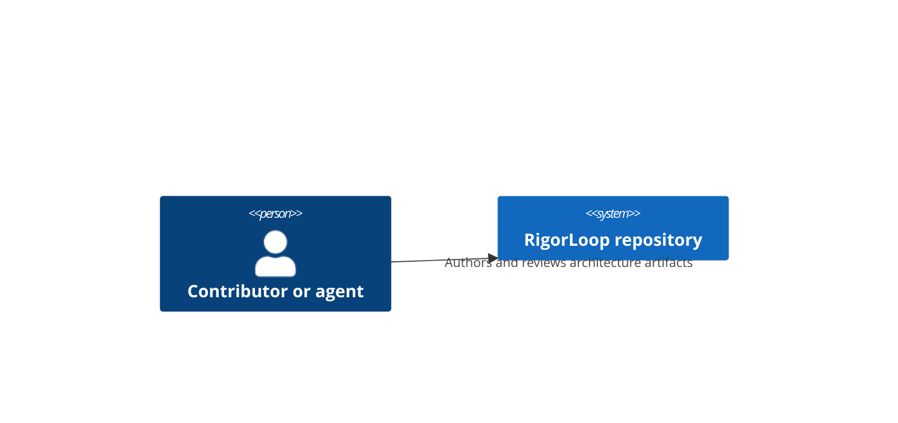

# Architecture Package Authoring

You are making the technical design visible before implementation.

The architecture artifact explains how the repository or system is shaped to satisfy the spec. It should expose structure, runtime flow, deployment impact, cross-cutting rules, quality concerns, risks, and durable decisions without becoming an execution task list.

## Inputs to read

Read, if present:

- `AGENTS.md`
- `CONSTITUTION.md`
- accepted proposal
- approved feature spec and spec-review findings
- `specs/architecture-package-method.md` when architecture package shape is in scope
- canonical architecture package under `docs/architecture/system/`
- change-local architecture delta under `docs/changes/<change-id>/architecture.md`
- related ADRs under `docs/adr/`
- research artifacts and `docs/project-map.md`
- existing source interfaces, schemas, APIs, modules, CI, deployment config

## Default Package Model

Use the approved C4, arc42, and ADR method when architecture work is required.

Canonical current architecture lives at:

```text
docs/architecture/system/architecture.md
docs/architecture/system/diagrams/context.mmd
docs/architecture/system/diagrams/container.mmd
```

Change-local working architecture lives at:

```text
docs/changes/<change-id>/architecture.md
docs/changes/<change-id>/diagrams/
```

Use a change-local architecture delta only when the change is architecture-significant enough to need reviewable working design reasoning before accepted content is merged into the canonical package. A change-local delta is not a competing canonical source. After acceptance, merge durable content back into the canonical package and leave the delta as historical evidence only.

Use `templates/architecture.md` and `templates/adr.md` as scaffolds. They are canonical authored templates, not live architecture or ADR records.

Leaf changes that do not affect architecture boundaries, data flow, generated-output flow, deployment, packaging, adapters, quality targets, cross-cutting rules, or durable decisions should record a no-architecture-impact rationale instead of creating or updating architecture artifacts.

## arc42 Sections

The canonical `architecture.md` uses repository lifecycle metadata before all 12 official arc42 sections, in this order:

1. Introduction and Goals
2. Architecture Constraints
3. Context and Scope
4. Solution Strategy
5. Building Block View
6. Runtime View
7. Deployment View
8. Crosscutting Concepts
9. Architecture Decisions
10. Quality Requirements
11. Risks and Technical Debt
12. Glossary

Keep the content concise. Do not remove or rename sections to make the document lighter. Use `Not applicable` only with a short rationale.

Sections 1 through 5 should usually contain current-system content for real architecture work. Update section 6 when behavior, orchestration, failure paths, command flow, generated-output flow, or operational flow changes. Update section 7 when environments, packaging, generated outputs, adapters, release layout, infrastructure, or execution boundaries change. Update section 8 when validation, security, caching, portability, generation, observability, or other cross-cutting rules change. Section 9 is always present and either links ADRs or states that no ADRs are required for the update.

## C4 Guidance

Default required C4 diagrams for the canonical package:

- system context diagram: `docs/architecture/system/diagrams/context.mmd`
- container diagram: `docs/architecture/system/diagrams/container.mmd`

Use Mermaid source text for the first implementation. Add a component diagram only when container-level structure is not enough to explain changed responsibilities, internal boundaries, or interactions. Add a deployment diagram only when infrastructure, runtime environment, packaging, adapter distribution, or deployment mapping needs visual explanation beyond arc42 section 7.

Update the lowest affected C4 level first, then propagate upward only when the higher-level view actually changes. Do not make generated images, screenshots, or external diagram links the only source of truth.



Keep diagrams small and accurate. Prefer multiple focused diagrams over one unreadable diagram.

## ADR Rules

Create an ADR when the change introduces or revises a durable architecture decision, including:

- system boundary changes
- adapter generation or packaging rules
- validation architecture
- cache or indexing strategy
- portability constraints
- release architecture
- major workflow architecture decisions

Use `templates/adr.md` and store real ADRs under `docs/adr/`. Each ADR includes title, status, context, decision, alternatives considered, consequences, and follow-up.

Accepted or active ADRs are decision history. Later changes should supersede or deprecate an old ADR with a new ADR or explicit lifecycle update rather than rewriting the old decision as if it had always been different.

Status vocabulary:

```text
draft | proposed | accepted | active | deprecated | superseded | archived | abandoned
```

## Authoring Rules

- Update only the arc42 sections and C4 views the change actually affects.
- Merge accepted durable content from change-local deltas into the canonical package before an architecture-significant change is complete.
- Keep legacy `docs/architecture/` documents as legacy or historical context until the legacy normalization artifact classifies them.
- Do not write an execution milestone list here; use `plan` after design review.
- Do not hide tradeoffs.
- Do not introduce architecture that the spec does not require.
- Do not change behavior in the architecture doc without updating the spec.
- Do not claim compatibility, rollback, or performance safety without explaining the mechanism.
- Do not use `reviewed` as a durable architecture status. Once the design is relied on, normalize the tracked artifact to `approved` or the appropriate terminal state.
- Preserve `Next artifacts` as planning history. Use `Follow-on artifacts` for actual downstream artifacts, replacement, or terminal closeout.
- If an architecture document is superseded, identify the replacement with `superseded_by` or equivalent labeled text.
- Do not include secrets, credentials, private keys, tokens, or machine-local debug-only data.

## Evidence Collection Efficiency

Use summary and stable-ID first reasoning before broad reads or raw excerpts. Prefer check IDs, requirement IDs, section numbers, ADR IDs, diagram paths, file paths, and line citations. Read exact sections first, then expand only when the narrower evidence cannot answer the architecture question.

## Workflow handoff behavior

- In a workflow-managed flow, successful `architecture` completion hands off to `architecture-review` when that review is the next required or default downstream stage.
- If the design still has open questions that block safe review, stop and report the blocker instead of implying `architecture-review` can proceed.
- This v1 contract does not imply `architecture-review -> plan`; review-to-next-authoring transitions remain outside the autoprogression boundary unless a later approved change adds them.

## When full-file read is required

Read the full file when creating or replacing the canonical architecture package, when the whole file is the review target, when checking all 12 arc42 headings or lifecycle metadata, when merge-back may affect multiple sections, when superseding or deprecating an ADR, when legacy status affects the conclusion, when the relevant section cannot be isolated safely, when bounded searches disagree, or when a behavior-changing edit depends on the whole source-of-truth artifact.

## Expected output

- canonical architecture package path or change-local delta path;
- changed arc42 sections and C4 diagram paths;
- requirement-to-architecture mapping;
- ADR paths for durable decisions, or a clear no-ADR-required rationale;
- merge-back status for change-local deltas;
- alternatives, consequences, risks, quality concerns, deployment impact, and security/privacy notes where relevant;
- readiness statement for `architecture-review` or blocker state.
