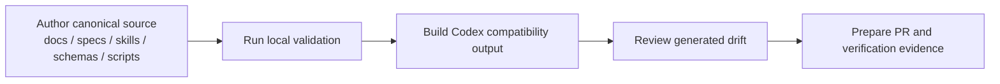
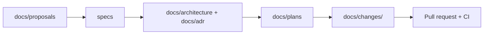
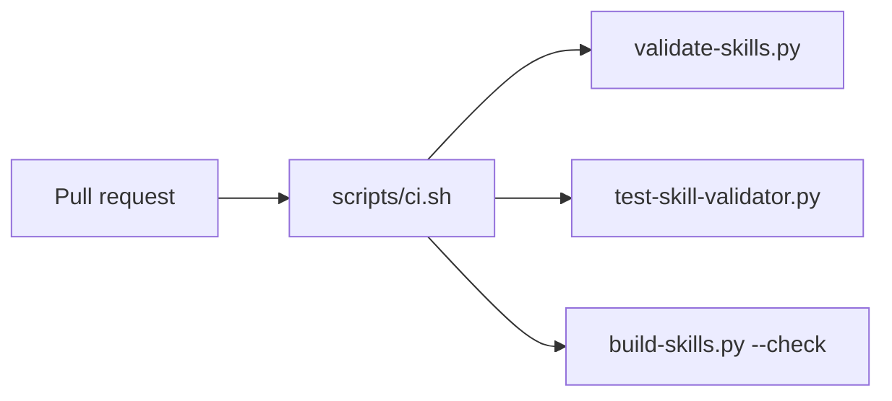

# RigorLoop First-Release Repository Architecture

## Status
- archived

## Closeout

- Final disposition: archived/historical snapshot.
- Canonical current architecture: `docs/architecture/system/architecture.md`.
- Merge-back evidence: `docs/changes/2026-04-29-legacy-architecture-lifecycle-normalization/architecture.md`.
- Archive rationale: accepted current source-layout, generated-output, change-memory, planning, and CI-wrapper content was merged into the canonical package during legacy architecture normalization. This file preserves first-release repository architecture rationale and should not be used as the current architecture source for downstream work.

## Related artifacts

- Proposal: `docs/proposals/2026-04-19-rigorloop-project-direction.md`
- Proposal: `docs/proposals/2026-04-19-implementation-milestone-commit-policy.md`
- Exploration: `docs/proposals/2026-04-19-rigorloop-workflow-product.explore.md`
- Spec: `specs/rigorloop-workflow.md`
- Project map: none yet
- ADR: `docs/adr/ADR-20260419-repository-source-layout.md`

## Summary

The first RigorLoop release should keep the repository structurally close to its current template shape while making one long-lived design decision explicit: canonical generic workflow content lives in normal repository paths, and Codex-facing runtime content is generated from that source rather than edited directly. In practice, `docs/`, `specs/`, `skills/`, `schemas/`, and `scripts/` become the authored source of truth; `.codex/skills/` becomes generated compatibility output for the current Codex runtime; change memory lives under `docs/changes/<change-id>/`; and CI validates authored source plus generated-output drift. This satisfies the workflow spec without forcing a larger `method/`, `adapters/`, or `dist/` reorganization in the first release.

## Requirements covered

| Requirement IDs | Design area |
| --- | --- |
| `R6`-`R9a` | Workflow stages, planned milestone work, PR boundary rules, CI surface separation |
| `R10`-`R12c` | PR summary, explain-change split, review-resolution storage |
| `R13`-`R19` | Skill validator example, fixtures, drift checks, and CI commands |
| `R20`-`R24a` | Canonical versus generated layout, Codex adapter boundary, concrete directory layout |
| `R25`-`R27` | `change.yaml`, traceability storage, Git/PR/CI as source of truth |

## Current architecture context

- The repository is still visibly a template:
  - `README.md` is placeholder content.
  - `scripts/ci.sh` and `scripts/release-verify.sh` are template scripts.
  - `docs/workflows.md` predates the normative workflow spec.
- Generic workflow skills currently exist in two trees:
  - `skills/`
  - `.codex/skills/`
- Those two trees have already drifted:
  - `skills/plan/SKILL.md` differs from `.codex/skills/plan/SKILL.md`
  - `skills/implement/SKILL.md` differs from `.codex/skills/implement/SKILL.md`
- GitHub workflow integration already exists under `.github/workflows/`, but the current `ci` and `release` jobs call generic shell wrappers rather than workflow-specific validation logic.
- Current Codex usage in this repository reads from `.codex/skills/`, so the first release must preserve that compatibility surface even if it is no longer the authored source of truth.

## Proposed architecture

### Concrete repository layout

The first-release repository layout should be:

```text
AGENTS.md                              # repo-specific durable guidance
README.md                              # public project entrypoint
.github/
  ISSUE_TEMPLATE/                      # repo integration surface
  pull_request_template.md             # reviewer-facing template
  workflows/                           # CI and release integration
docs/
  workflows.md                         # operational summary; spec remains normative
  plan.md                              # plan index
  roadmap.md                           # unapproved future ideas
  proposals/                           # decision-oriented product and policy proposals
  architecture/                        # technical architecture docs
  adr/                                 # long-lived design decisions
  plans/                               # living execution plans and plan template/example
  changes/<change-id>/                 # durable per-change reasoning and change.yaml
specs/
  rigorloop-workflow.md                # normative workflow contract
  *.test.md                            # contract-to-test mappings
  feature-template.md                  # feature-spec template
  feature-template.test.md             # test-spec template
skills/
  <skill>/SKILL.md                     # canonical generic skill source
schemas/
  change.schema.json                   # canonical machine-readable traceability schema
  skill.schema.json                    # canonical skill-structure schema
scripts/
  validate-skills.py                   # structural validator
  test-skill-validator.py              # fixture-driven validator tests
  build-skills.py                      # generate Codex compatibility output and drift checks
  ci.sh                                # CI entrypoint
  release-verify.sh                    # release verification entrypoint
.codex/
  skills/<skill>/SKILL.md              # generated Codex compatibility output; do not hand-edit
```

### Component responsibilities and boundaries

| Component | Responsibility | Source of truth | Notes |
| --- | --- | --- | --- |
| `docs/proposals/` | product and workflow direction decisions | authored | Initiative-level decision memory |
| `specs/` | normative workflow and feature contracts | authored | Test-spec files live here too |
| `docs/architecture/` and `docs/adr/` | technical shape and long-lived design choices | authored | Architecture explains layout, ADR records decisions |
| `docs/plans/` and `docs/plan.md` | execution planning and progress | authored | `docs/plans/0000-00-00-example-plan.md` is canonical plan template/example |
| `docs/changes/<change-id>/` | per-change durable reasoning and traceability | authored | Contains Markdown artifacts plus `change.yaml` |
| `skills/` | generic reusable skill definitions | authored | Primary source for all workflow skills |
| `.codex/skills/` | Codex runtime compatibility output | generated | Must be rebuildable from `skills/` |
| `schemas/` | machine-readable contracts | authored | Validates `change.yaml` and skill structure |
| `scripts/` | build, validation, and check entrypoints | authored | CI calls these scripts instead of duplicating logic |
| `.github/` | GitHub-native integration | integration surface | Calls repo scripts and exposes review templates |

### Canonical versus generated content

The first release should enforce these rules:

- Contributors edit canonical workflow source in:
  - `docs/`
  - `specs/`
  - `skills/`
  - `schemas/`
  - `scripts/`
- Contributors do not hand-edit generated Codex compatibility output in:
  - `.codex/skills/`
- `docs/plans/0000-00-00-example-plan.md` is the canonical plan template/example.
- Planning guidance lives only in `docs/plans/0000-00-00-example-plan.md`; `.codex/PLANS.md` is removed and must not be reintroduced as a second source of truth.

## Data model and data flow

### Authored data model

| Entity | Location | Ownership | Purpose |
| --- | --- | --- | --- |
| Initiative proposal | `docs/proposals/*.md` | authored | Product and workflow direction |
| Workflow/feature spec | `specs/*.md` | authored | Normative contract |
| Architecture doc | `docs/architecture/*.md` | authored | Concrete repo and component design |
| ADR | `docs/adr/*.md` | authored | Long-lived design decisions |
| Execution plan | `docs/plans/*.md` | authored | Milestones, validation, recovery |
| Change artifact set | `docs/changes/<change-id>/` | authored | Per-change durable reasoning |
| Traceability metadata | `docs/changes/<change-id>/change.yaml` | authored | Machine-readable traceability |
| Skill source | `skills/<skill>/SKILL.md` | authored | Generic workflow skill definition |
| Skill schema | `schemas/skill.schema.json` | authored | Validator contract |
| Change schema | `schemas/change.schema.json` | authored | `change.yaml` contract |
| Codex skill output | `.codex/skills/<skill>/SKILL.md` | generated | Runtime compatibility copy |

### Artifact and packaging flow



### Change-memory flow



## Control flow

### Contributor control flow

1. Initiative or workflow direction changes begin in `docs/proposals/`.
2. Normative behavior is defined in `specs/`.
3. Long-lived layout and source-of-truth decisions are recorded in `docs/architecture/` and `docs/adr/`.
4. Planned implementation work uses `docs/plans/`.
5. Contributors edit canonical source only.
6. Validation scripts check canonical source and rebuild compatibility output.
7. Per-change reasoning and metadata are stored in `docs/changes/<change-id>/`.
8. PR text, CI, and human review remain the final authority.

### CI control flow

The first-release CI flow should be:



The CI workflow remains a thin integration layer; the repository scripts define the real validation behavior.

## Interfaces and contracts

### Skill contract

- Canonical skill source lives at `skills/<skill>/SKILL.md`.
- First-release skill validation follows the contract in `specs/rigorloop-workflow.md`:
  - YAML frontmatter
  - non-empty `name`
  - non-empty `description`
  - exactly one top-level `#` title
  - one `## Expected output` section
- Generated Codex output must preserve the skill content required at runtime, but it is not edited directly.

### Change-traceability contract

- Non-trivial changes store machine-readable traceability at:
  - `docs/changes/<change-id>/change.yaml`
- The canonical schema lives in:
  - `schemas/change.schema.json`
- Durable Markdown artifacts stored beside `change.yaml` are the narrative source of truth; `change.yaml` is the machine-readable index, not a narrative replacement.

### Planning and milestone contract

- The canonical plan template/example lives in:
  - `docs/plans/0000-00-00-example-plan.md`
- Planned milestone work follows the workflow spec:
  - milestone closeout evidence in the plan
  - milestone commit subject `M<n>: <completed milestone outcome>`
  - one PR may contain one or more completed milestone commits

### Root guidance contract

- `AGENTS.md` stays repo-specific and points contributors to:
  - canonical authored locations
  - generated locations that must not be hand-edited
  - validation commands
- `docs/workflows.md` stays short and operational, but the normative behavior contract remains in `specs/rigorloop-workflow.md`.

## Failure modes

- If a contributor edits `.codex/skills/` directly, the next drift check should fail because generated output no longer matches `skills/`.
- If `skills/` contains duplicate names, missing required sections, or placeholder text, local validation and CI fail before PR completion.
- If root guidance, skills, or docs keep referencing `.codex/PLANS.md` after its removal, contributors may follow a missing or stale path; the remedy is to point all planning guidance to `docs/plans/0000-00-00-example-plan.md`.
- If a non-trivial change omits `change.yaml` or required PR evidence, the change is incomplete even if code or docs were edited.
- If the repository uses squash or rewritten merge history, milestone commit boundaries may disappear on the default branch; branch and PR review remain the durable review surface.
- If `docs/workflows.md` is not aligned after the spec and architecture stabilize, contributors may follow outdated operational guidance.

## Security and privacy design

- Baseline structural validation must run without secrets and without external network access.
- Skill validation, fixture tests, and drift checks operate only on repository files.
- `change.yaml`, plans, specs, and PR summaries must not be used to store credentials or sensitive runtime configuration.
- The release workflow is isolated from baseline validation:
  - `.github/workflows/release.yml` may use `GITHUB_TOKEN`
  - normal CI validation must not depend on that token
- Human review and repository controls remain authoritative even when Codex compatibility output is generated automatically.

## Performance and scalability

- Validation and build scripts are file-system scans and deterministic transforms; they should scale linearly with the number of skills and change artifacts.
- The first release does not need a separate build service, cache layer, or database.
- Keeping generated compatibility output committed in-repo avoids extra installation steps for repo-local Codex usage, at the cost of requiring drift checks.

## Observability

- Validation commands should emit file- and skill-specific failures with non-zero exit codes.
- CI should surface the exact script or command that failed rather than only wrapper-script output.
- `docs/changes/<change-id>/verify-report.md`, PR text, and `change.yaml` together provide reviewer-visible verification evidence.
- Drift checks should identify which canonical file and generated output path diverged.
- Generated output warnings should explicitly say "do not hand-edit generated output" to reinforce the source-of-truth split.

## Compatibility and migration

The first release should use an incremental migration rather than a top-level reorganization:

1. Preserve the current top-level repo shape.
2. Declare `skills/` canonical and `.codex/skills/` generated compatibility output.
3. Add `docs/architecture/`, `docs/adr/`, `docs/changes/`, and `schemas/` as new authored roots.
4. Move the canonical plan template role to `docs/plans/0000-00-00-example-plan.md`.
5. Remove `.codex/PLANS.md` and update `AGENTS.md`, skills, and docs to point directly to the canonical plan template.
6. Update `README.md`, `docs/workflows.md`, `AGENTS.md`, and CI scripts so they identify actual canonical and generated paths.

This migration preserves compatibility with the current Codex runtime while removing the architectural ambiguity caused by two editable skill trees.

## Alternatives considered

### Alternative 1: Make `.codex/skills/` the canonical skill source

Rejected.

- Advantages:
  - Matches the current runtime path directly.
  - Avoids a build step for skills in the short term.
- Disadvantages:
  - Mixes generic workflow content with adapter-specific runtime layout.
  - Makes source-of-truth separation harder to explain.
  - Leaves the repo coupled to a Codex-specific namespace.

### Alternative 2: Keep both `skills/` and `.codex/skills/` editable

Rejected.

- Advantages:
  - No migration work.
  - Contributors can edit whichever tree they encounter first.
- Disadvantages:
  - Already proven to drift in this repository.
  - Makes validation and review ambiguous.
  - Violates the intended canonical-versus-generated contract.

### Alternative 3: Introduce `method/`, `templates/`, `adapters/`, and `dist/` immediately

Rejected for the first release.

- Advantages:
  - Clean conceptual separation.
  - Easier future multi-adapter expansion.
- Disadvantages:
  - Large migration cost relative to current repository size.
  - Requires moving many current files without improving first-release behavior proportionally.
  - Adds top-level churn before the workflow proves value.

## ADRs

- `ADR-20260419-repository-source-layout`: canonical generic workflow content uses normal repository paths; `.codex/` is a generated or adapter-scoped compatibility surface.

## Risks and mitigations

- Risk: contributors keep editing `.codex/skills/` because that is what the current runtime sees.
  - Mitigation: make `skills/` canonical, generate `.codex/skills/`, and label generated paths clearly in root guidance and validation output.
- Risk: contributors keep looking for `.codex/PLANS.md` after it is removed.
  - Mitigation: point `AGENTS.md`, skills, README, and workflow docs directly to `docs/plans/0000-00-00-example-plan.md`.
- Risk: placeholder README and CI scripts make the repo look less mature than the architecture claims.
  - Mitigation: plan early documentation and CI alignment work immediately after architecture acceptance.
- Risk: the repository delays `schemas/` and `docs/changes/` too long, leaving traceability behavior partially documented but not implemented.
  - Mitigation: make those authored roots part of the first implementation plan rather than optional follow-up.

## Open questions

- None for layout or source-of-truth decisions. The remaining work is implementation planning, not architecture discovery.
