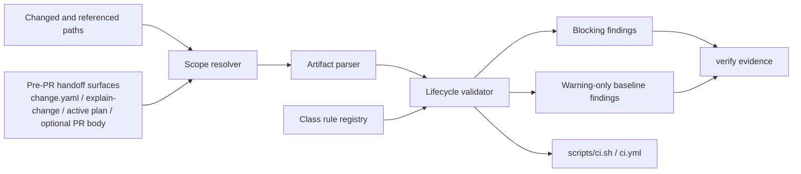
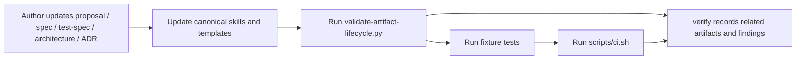

# Artifact Status Lifecycle Ownership Design

## Status
- archived

## Closeout

- Final disposition: archived/historical snapshot.
- Canonical current architecture: `docs/architecture/system/architecture.md`.
- Merge-back evidence: `docs/changes/2026-04-29-legacy-architecture-lifecycle-normalization/architecture.md`.
- Archive rationale: accepted current lifecycle-validator, artifact-local status, scope-resolution, block-versus-warning, and CI-integration content was merged into the canonical package during legacy architecture normalization. This file preserves the historical lifecycle ownership design rationale and should not be used as the current architecture source for downstream work.

## Related artifacts

- Proposal: `docs/proposals/2026-04-20-artifact-status-lifecycle-ownership.md`
- Spec: `specs/artifact-status-lifecycle-ownership.md`
- Existing architecture: `docs/architecture/2026-04-19-rigorloop-first-release-repository-architecture.md`
- ADR: `docs/adr/ADR-20260419-repository-source-layout.md`
- Project map: none yet

## Summary

This change should add a small repo-owned artifact lifecycle validation subsystem rather than a new registry or a broad markdown-schema framework. The design keeps artifact-local status as the source of truth, introduces class-specific lifecycle rules for proposals, specs, test specs, architecture docs, and ADRs, resolves related-scope inputs for `verify`, and extends the existing script-first CI pattern so validation remains deterministic, file-based, and thinly wrapped by GitHub Actions.

## Requirements covered

| Requirement IDs | Design area |
| --- | --- |
| `R1`-`R3c` | In-scope artifact coverage, workflow-summary integration, delegated detailed contracts |
| `R4`-`R7e` | Durable state model, settlement versus terminal closeout, status semantics |
| `R8`-`R10e` | Transition ownership, closeout timing, superseded versus archived handling |
| `R11`-`R12` | Related-scope verification, block versus warning behavior, stale-state detection |
| `R13`-`R13c` | Minimal validator, fixtures, verify integration, CI entrypoint, objective-only enforcement |
| `R14`-`R15b` | Canonical guidance updates, generated-boundary handling, migration of stale relied-on artifacts |

## Current architecture context

- The repository already uses repo-owned Python validation scripts and a thin CI wrapper:
  - `scripts/validate-skills.py`
  - `scripts/skill_validation.py`
  - `scripts/validate-change-metadata.py`
  - `scripts/ci.sh`
  - `.github/workflows/ci.yml`
- Existing validation is split by concern:
  - skill structure is validated with a focused Python helper
  - change metadata is validated against `schemas/change.schema.json`
  - generated Codex skill drift is checked by `scripts/build-skills.py --check`
- The repository does not yet have a validator for lifecycle state across:
  - `docs/proposals/`
  - top-level feature specs in `specs/`
  - `specs/*.test.md`
  - `docs/architecture/`
  - `docs/adr/`
- Canonical versus generated ownership is already an approved architectural boundary:
  - authored workflow content lives under normal repo roots
  - `.codex/skills/` is generated compatibility output and not a source of truth
- The current repo has only partial template coverage for in-scope artifact classes:
  - feature spec and test-spec templates exist
  - proposal, architecture, and ADR lifecycle details are currently taught mainly through skills and approved examples
- The approved spec for this feature is now the intended governing contract, but the implementation surfaces named by that spec do not exist yet.

## Proposed architecture

### Design direction

Implement the feature as one focused validation subsystem plus canonical guidance updates:

1. A new artifact lifecycle validator checks status vocabulary, settlement-versus-closeout rules, replacement-pointer rules, identifier rules where defined, and canonical-versus-generated boundaries.
2. A deterministic scope-resolution layer runs in explicit modes so local `verify`, PR CI, push-to-`main` CI, and explicit-path checks all derive related scope without guesswork.
3. A single stable artifact contract registry defines the validator's executable required-section and lifecycle rules for each artifact class.
4. Canonical docs, skills, and templates are updated so human guidance describes the same contract, but examples remain illustrative rather than normative enforcement sources.
5. `scripts/ci.sh` and `.github/workflows/ci.yml` keep the existing thin-wrapper pattern and run the same repo-owned verification path.

The design stays intentionally small:

- no central status registry
- no database or persistent cache
- no GitHub API dependency for PR-body inspection
- no mandatory YAML frontmatter for all markdown artifacts
- no broad generic markdown schema framework in v0.1

### Components, responsibilities, and boundaries

| Component | Responsibility | Source of truth | Notes |
| --- | --- | --- | --- |
| `scripts/artifact_lifecycle_contracts.py` | Stable executable registry for per-class lifecycle rules | authored | Sole validator enforcement source for required sections, status sets, and identifier policy |
| `scripts/artifact_lifecycle_validation.py` | Shared parsing and rule evaluation for in-scope artifacts | authored | New focused helper module for lifecycle-managed artifacts |
| `scripts/validate-artifact-lifecycle.py` | CLI entrypoint for lifecycle validation | authored | Emits blocking errors and warning-only baseline findings; requires an explicit mode |
| Scope resolver inside validator or helper module | Expands changed paths into related artifact scope | authored | Uses repo files only; mode-specific and deterministic |
| Human-readable contract surfaces | Contributor-facing lifecycle guidance | authored | `specs/rigorloop-workflow.md`, skills, and templates must stay aligned with the registry |
| Fixture tests | Prove validator behavior on valid and invalid cases | authored | New focused fixture set for lifecycle validation |
| `scripts/ci.sh` | Repository CI wrapper | authored | Calls validator directly alongside existing checks |
| `.github/workflows/ci.yml` | Hosted integration layer | integration surface | Remains a thin wrapper over `scripts/ci.sh` |
| `.codex/skills/` | Generated compatibility guidance | generated | Never authoritative for lifecycle state |

### Validation pipeline

## Data model and data flow

### Runtime data model

The validator should use in-memory records rather than a new checked-in registry.

| Record | Key fields | Purpose |
| --- | --- | --- |
| `ArtifactContractRegistryEntry` | class name, path matcher, durable status vocabulary, settlement states, terminal states, required sections by state, identifier policy, replacement-pointer policy | Single executable contract record for one artifact class |
| `ArtifactClassRule` | class name, path matcher, settlement states, terminal states, required sections by state, identifier policy, replacement-pointer policy | In-memory evaluated rule view derived from one registry entry |
| `ArtifactRecord` | path, class, identifier when defined, status, section presence, readiness text, `Next artifacts` text, `Follow-on artifacts` text, superseded metadata | Parsed view of one tracked artifact |
| `ValidationFinding` | path, severity, rule id or message, blocker/warning classification | User-visible result emitted by the validator |
| `ValidationScope` | mode, changed paths, related artifact paths, baseline-only paths, generated paths, authoritative roots, input source | Controls block-versus-warning behavior deterministically |

### Identifier model

First-release identifier handling should stay class-specific and avoid introducing new required metadata where the repository already has stable path conventions.

| Artifact class | Identifier contract | Enforcement owner |
| --- | --- | --- |
| Skill | frontmatter `name` | existing skill validator |
| Proposal | full file stem `YYYY-MM-DD-slug` | artifact lifecycle validator |
| Top-level spec | file stem `slug` for `specs/<slug>.md` | artifact lifecycle validator |
| ADR | full file stem `ADR-YYYYMMDD-slug` | artifact lifecycle validator |
| Change metadata | YAML `change_id` | existing change-metadata validator |
| Other markdown artifacts | none by default; optional `artifact_id` opt-in only | not enforced unless opted in |

Normalized naming should follow existing repository conventions rather than inventing new ones:

- proposals: date-prefixed lowercase kebab-case filename
- top-level specs: lowercase kebab-case filename
- ADRs: `ADR-YYYYMMDD-kebab-case`

### Data flow

### Contract-source model

Validator enforcement must read from one stable executable contract registry:

- `scripts/artifact_lifecycle_contracts.py` is the sole enforcement source for:
  - allowed status vocabulary
  - settlement states
  - terminal states
  - required sections by lifecycle state
  - identifier and naming policy
  - replacement-pointer requirements
- Human-readable docs, skills, and templates remain normative for contributors, but the validator does not scrape required sections from those files at runtime.
- Approved examples are illustrative only and may be reused as fixtures, but they are not enforcement sources.

Per-class enforcement should read from registry entries like this:

| Artifact class | Executable enforcement source | Human alignment surfaces |
| --- | --- | --- |
| Proposal | `artifact_lifecycle_contracts.py` proposal entry | proposal skills and approved proposal structure |
| Feature spec | `artifact_lifecycle_contracts.py` spec entry | `specs/feature-template.md`, spec skill, workflow summary |
| Test spec | `artifact_lifecycle_contracts.py` test-spec entry | `specs/feature-template.test.md`, test-spec skill |
| Architecture doc | `artifact_lifecycle_contracts.py` architecture entry | architecture skill and approved architecture structure |
| ADR | `artifact_lifecycle_contracts.py` ADR entry | ADR format guidance and existing ADR conventions |

### Scope mode model

Validator scope must be deterministic by mode:

| Mode | Primary input source | Required input contract | Failure behavior |
| --- | --- | --- | --- |
| `explicit-paths` | exact paths passed by caller | one or more repo-relative paths | fail with input error if no paths are supplied |
| `local` | local working tree relative to `HEAD` | no network; uses staged, unstaged, and untracked repo files | fail only if repo state cannot be read |
| `pr-ci` | explicit PR diff range | base SHA and head SHA or equivalent caller-supplied diff range | fail with input error if base/head is missing |
| `push-main-ci` | explicit push diff range | before SHA and after SHA or equivalent caller-supplied diff range | fail with input error if before/after is missing |

Mode selection must be explicit in the CLI. The validator must not silently guess between local, PR, and push semantics.

1. The scope resolver receives explicit changed paths and related artifact hints from repo-owned surfaces.
2. The parser reads each authoritative artifact and extracts:
   - status
   - lifecycle sections
   - readiness wording
   - replacement metadata when present
   - identifier when defined by class contract
3. The rule registry evaluates:
   - allowed status vocabulary
   - settlement versus terminal-state expectations
   - required closeout presence
   - `None yet` handling for premature follow-on sections
   - superseded replacement pointers
   - identifier and naming rules for classes that define them
   - generated-source boundary errors
4. The validator emits:
   - blocking findings for related artifacts
   - warning-only findings for unrelated stale baseline artifacts
5. `verify` and CI record the same command and findings in contributor-visible evidence.

## Control flow

### Authoring and verification flow

### Scope-resolution flow

1. Select one explicit validator mode:
   - `explicit-paths`
   - `local`
   - `pr-ci`
   - `push-main-ci`
2. Derive changed files deterministically from that mode:
   - `explicit-paths`: use caller-supplied paths exactly
   - `local`: use staged, unstaged, and untracked repo files relative to `HEAD`
   - `pr-ci`: use the explicit base-to-head diff range
   - `push-main-ci`: use the explicit before-to-after push diff range
3. Add artifact paths referenced by:
   - `docs/changes/<change-id>/change.yaml`
   - the explain-change artifact when present
   - the active plan
   - draft PR text only when the selected mode provides local PR-body text or an explicit PR-body input file
4. Add authoritative artifacts for the changed area:
   - governing specs
   - governing architecture docs or ADRs
   - governing test specs
   - governing active plans
5. Classify all other in-scope tracked artifacts as baseline-only candidates for warning output.
6. If a mode requires explicit diff-range inputs and they are missing, terminate with a clear input error instead of falling back to repo-wide inference.

The first release should keep this flow explicit and file-based. It should not depend on live GitHub API calls or branch-name heuristics.

## Interfaces and contracts

### New script surfaces

The implementation should add these repo-owned interfaces:

- `scripts/artifact_lifecycle_validation.py`
  - shared parser and rule engine
- `scripts/artifact_lifecycle_contracts.py`
  - stable per-class contract registry
  - sole executable source for required sections and lifecycle enforcement
- `scripts/validate-artifact-lifecycle.py`
  - CLI entrypoint
  - supports explicit mode selection and related-scope inputs
  - exits non-zero only on blocking findings
- `scripts/test-artifact-lifecycle-validator.py`
  - focused fixture-driven tests for the new validator

The CLI should be designed so `verify` and CI can use the same command shape with different explicit modes rather than maintaining separate logic paths.

Recommended command shape:

- local verification:
  - `python scripts/validate-artifact-lifecycle.py --mode local`
- explicit narrow check:
  - `python scripts/validate-artifact-lifecycle.py --mode explicit-paths --path <repo-path> [...]`
- PR CI:
  - `python scripts/validate-artifact-lifecycle.py --mode pr-ci --base <sha> --head <sha>`
- push-to-main CI:
  - `python scripts/validate-artifact-lifecycle.py --mode push-main-ci --before <sha> --after <sha>`

### Existing interfaces to update

- `scripts/ci.sh`
  - add the artifact lifecycle validator and its fixture tests
  - call the validator in CI mode with explicit SHA inputs when available
- `.github/workflows/ci.yml`
  - no major redesign; continue calling `bash scripts/ci.sh`
  - pass the event SHAs or equivalent diff inputs into the script environment
- Canonical guidance surfaces:
  - `specs/rigorloop-workflow.md`
  - `docs/workflows.md`
  - relevant skills such as `proposal`, `proposal-review`, `spec`, `spec-review`, `test-spec`, `architecture`, `architecture-review`, `verify`, and `workflow`
- Canonical templates:
  - `specs/feature-template.md`
  - `specs/feature-template.test.md`
- Illustrative examples and fixtures:
  - approved proposal and architecture examples may be cited or copied into fixtures
  - those examples are non-normative and MUST NOT be scraped as runtime enforcement sources

### Boundaries

- `change.schema.json` remains the schema contract for `change.yaml`; the new validator consumes `change.yaml` references but does not replace its schema.
- Existing skill validation remains authoritative for skill-structure checks; the new validator must not duplicate all skill-validator behavior.
- `artifact_lifecycle_contracts.py` is the sole executable enforcement source for artifact lifecycle rules. Templates, skills, and examples are alignment surfaces, not runtime rule sources.
- Generated `.codex/skills/` output remains governed by `build-skills.py --check`; the lifecycle validator only guards against treating generated output as authored source of truth.

## Failure modes

- If a review outcome is only recorded in chat and the next stage relies on the artifact without normalizing its tracked status, the validator blocks the related change.
- If a terminal or historical artifact is missing required closeout surfaces, the validator blocks.
- If a `Follow-on artifacts` section exists early but is empty rather than `None yet`, the validator blocks.
- If a superseded artifact lacks a replacement pointer, the validator blocks.
- If unrelated baseline artifacts are stale, the validator warns but does not block unless the current change relies on them.
- If final PR text adds new authoritative references after `verify`, the prior verify result becomes stale and must be re-run.
- If contributors edit generated skill output and then rely on it as source, drift and source-boundary validation fail.
- If required mode inputs such as PR base/head or push before/after SHAs are missing, the validator fails with a clear input error rather than guessing scope.
- If scope resolution grows too implicit or magical, contributors may not understand why findings are blocking; the design therefore keeps scope inputs explicit and file-based.
- If examples drift away from the registry, they may become confusing, but they must not change validator behavior because examples are non-normative.

## Security and privacy design

- The validator must run on local repository files only.
- No network calls or GitHub API reads are required for baseline validation.
- Optional PR-body inspection should use a local file or caller-supplied text, not hosted state fetched at runtime.
- No secrets are required for the validator, fixture tests, or baseline CI path.
- Findings must not leak host-local paths or environment-specific details into committed artifacts.

## Performance and scalability

- The validator should operate as a bounded file scan over explicit scope plus optional baseline roots.
- Parsing and rule checks should remain linear in the number of files inspected.
- The first release does not need caching, indexing, or a persistent artifact graph.
- Keeping rule evaluation class-specific in code is cheaper and easier to review than a generalized policy engine for the current repository size.

## Observability

- Validator output should identify:
  - mode used
  - scope input source
  - artifact path
  - artifact class
  - status seen
  - rule violated
  - whether the result is blocking or warning-only
- `verify` evidence should record which related artifacts were evaluated and which baseline-only warnings were surfaced.
- `scripts/ci.sh` output should continue to print the exact command being run so hosted logs are actionable.
- Source-boundary errors should explicitly say that generated paths are not authoritative.

## Compatibility and migration

This should be implemented as an incremental repository migration:

1. Normalize the already-approved proposal and spec artifacts so downstream work does not rely on stale `draft` state.
2. Add the new validator, helper module, and fixture tests.
3. Add the stable contract registry and make the validator read only from it for executable enforcement.
4. Update workflow docs, skills, and canonical template surfaces to match the approved spec and the registry.
5. Extend `scripts/ci.sh` and keep `.github/workflows/ci.yml` as a thin wrapper.
6. Wire deterministic mode inputs for local use, PR CI, and push-to-main CI.
7. Normalize already-known stale relied-on artifacts covered by the spec.

Rollback remains straightforward:

- revert the validator and guidance changes if the design proves too rigid
- keep truthful status corrections where possible, because they reduce repository ambiguity even if the enforcement mechanism changes

## Alternatives considered

### Alternative 1: Central lifecycle registry

Rejected.

- Advantages:
  - machine-readable one-stop status inventory
  - easier broad audits
- Disadvantages:
  - duplicates artifact-local state
  - creates a second source of truth
  - adds workflow complexity before the repo needs it

### Alternative 2: Schema-first markdown validation for every artifact

Rejected for v0.1.

- Advantages:
  - more declarative rule surface
  - potential reuse across artifact classes
- Disadvantages:
  - current markdown lifecycle rules depend on section timing and cross-field semantics
  - would force more template normalization than the spec requires
  - adds abstraction before the rules have stabilized

### Alternative 3: Manual `verify` only with no executable validator

Rejected.

- Advantages:
  - smallest immediate implementation
  - no new scripts or fixtures
- Disadvantages:
  - contradicts the approved spec's executable first-enforcement step
  - repeats the ad hoc cleanup failure mode this feature is meant to stop
  - makes CI unable to prove the lifecycle contract

### Alternative 4: Infer scope implicitly from branch names or host state

Rejected.

- Advantages:
  - less CLI input in the short term
  - fewer explicit mode flags
- Disadvantages:
  - non-deterministic across local use, PR CI, and push CI
  - hard to test and reason about
  - risks silent block-versus-warning misclassification

## ADRs

- Existing ADR: `ADR-20260419-repository-source-layout` continues to govern canonical versus generated workflow content and thin CI wrappers.
- No new ADR is proposed in this change. The design extends the existing repo-owned-script and canonical-source boundaries rather than introducing a new repository-wide platform boundary.

## Risks and mitigations

- Risk: scope resolution becomes too complex for contributors to predict.
  - Mitigation: keep scope inputs explicit, file-based, and visible in `verify` evidence rather than hidden in implicit host integrations.
- Risk: class rules drift away from human guidance.
  - Mitigation: keep one stable executable contract registry and update canonical skills, workflow docs, and templates in the same change as registry logic.
- Risk: the validator becomes a catch-all markdown linter.
  - Mitigation: limit v0.1 to objective lifecycle defects and keep subjective quality issues in review.
- Risk: identifier enforcement blocks unrelated files that do not have stable identifiers.
  - Mitigation: enforce identifiers only for classes that already define them, and require explicit opt-in for other markdown artifacts.
- Risk: unrelated stale baseline debt blocks unrelated improvements.
  - Mitigation: preserve block-versus-warning scope separation in both the CLI and verify evidence model.
- Risk: examples drift and contributors mistake them for enforcement rules.
  - Mitigation: treat examples as illustrative only, keep enforcement in the registry, and use fixtures for executable examples.

## Open questions

- None blocking execution planning. If implementation later reveals repeated parsing needs across markdown validators, that can be handled as an internal refactor without changing this architecture contract.

## Readiness

This architecture record is archived as historical evidence.

No current downstream workflow handoff is owned by this artifact. Downstream work should use `docs/architecture/system/architecture.md` as the current architecture source and the related spec or ADR for the lifecycle contract.
