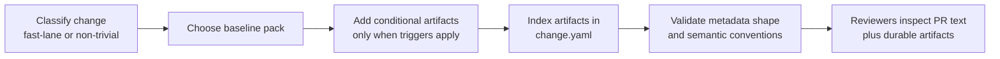

# Docs Changes Usage Policy Design

## Status
- approved

## Related artifacts

- Proposal: `docs/proposals/2026-04-20-docs-changes-usage-policy.md`
- Spec: `specs/docs-changes-usage-policy.md`
- Governing workflow contract: `specs/rigorloop-workflow.md`
- Existing architecture: `docs/architecture/2026-04-19-rigorloop-first-release-repository-architecture.md`
- ADR: `docs/adr/ADR-20260419-repository-source-layout.md`
- Example pack: `docs/changes/0001-skill-validator/`
- Legacy durable reasoning examples: `docs/explain/`

## Summary

This change should remain a small workflow-contract and validation-alignment design, not a new subsystem. It standardizes how contributors package `docs/changes/<change-id>/` for non-trivial work: `change.yaml` remains required, `docs/changes/<change-id>/explain-change.md` becomes the default durable reasoning surface for new work, legacy approved top-level `docs/explain/` artifacts remain valid until retired, and conditional artifacts such as `review-resolution.md` and `verify-report.md` are added only when their objective trigger rules apply. The design preserves the current `change.yaml` schema shape, keeps `docs/changes/` concise, and reuses repo-owned validation rather than introducing a second registry or new storage model.

## Requirements covered

| Requirement IDs | Design area |
| --- | --- |
| `R1`-`R1b` | Normative home, summary-surface alignment, source-of-truth boundaries |
| `R2`-`R3f` | Baseline non-trivial pack, durable reasoning default, legacy-compatibility rule |
| `R4`-`R6b` | Artifact-role separation, conditional review-resolution, conditional verify-report triggers |
| `R7`-`R8` | Concision boundary, rich-example handling, contributor-facing packaging rule |
| `R9`-`R9c` | `change.yaml` indexing, canonical snake_case keys, scalar string value shape |

## Current architecture context

- The first-release repository architecture already defines `docs/changes/<change-id>/` as the authored home for per-change durable reasoning and `change.yaml`.
- The current workflow contract already requires:
  - `docs/changes/<change-id>/change.yaml` for non-trivial work;
  - durable Markdown reasoning beyond `change.yaml`;
  - PR summary as the reviewer-facing surface;
  - conditional standalone `review-resolution.md` when durable review memory requires it.
- The current `schemas/change.schema.json` and `scripts/validate-change-metadata.py` enforce the existing `change.yaml` shape:
  - `artifacts` is an object;
  - artifact-map values are plain string paths;
  - property names are not yet semantically constrained beyond being non-empty strings.
- The shipped `0001-skill-validator` example already uses canonical snake_case artifact keys:
  - `test_spec`
  - `verify_report`
  - `explain_change`
  - `review_resolution`
- The repository also has approved top-level durable reasoning artifacts under `docs/explain/`, created before this packaging rule existed.
- No current architecture document defines whether new work should prefer change-local `explain-change.md` over new top-level `docs/explain/*.md` artifacts.

## Proposed architecture

### Design direction

Implement this feature as a contract-and-validation alignment change across four existing surfaces:

1. `specs/rigorloop-workflow.md` remains the normative home for packaging rules.
2. `CONSTITUTION.md`, `docs/workflows.md`, and `AGENTS.md` summarize the rule without competing with it.
3. `docs/changes/<change-id>/` remains the default authored location for new non-trivial change packs.
4. Existing repo-owned change-metadata validation remains the enforcement path for `change.yaml` shape, with any new semantic checks added as small validator logic rather than a schema redesign.

The design intentionally does not add:

- a new change-artifact registry;
- nested artifact objects in `change.yaml`;
- a database, cache, or workflow state store;
- a new top-level authored root;
- mandatory migration of existing approved `docs/explain/*.md` artifacts before new work can proceed.

### Components, responsibilities, and boundaries

| Surface | Responsibility | Source of truth | Notes |
| --- | --- | --- | --- |
| `specs/rigorloop-workflow.md` | Normative packaging rule for non-trivial change-local artifacts | authored | Owns baseline vs conditional contract |
| `specs/docs-changes-usage-policy.md` | Focused contract for packaging semantics and trigger rules | authored | Sharpens the existing workflow contract without redesigning it |
| `docs/workflows.md` | Contributor-facing rule-of-thumb summary | authored | Must stay concise and derivative |
| `AGENTS.md` | Agent-facing operational summary | authored | May reference the packaging rule briefly |
| `CONSTITUTION.md` | High-level governance and source-of-truth boundary | authored | Must keep the normative-vs-summary split explicit |
| `docs/changes/<change-id>/` | Default authored home for new non-trivial change packs | authored | Holds `change.yaml` plus applicable Markdown artifacts |
| `docs/explain/` | Legacy top-level durable reasoning surfaces | authored | Remain valid until migrated or retired; not the default for new change work |
| `schemas/change.schema.json` | Structural contract for `change.yaml` | authored | Keeps current object/string shape; no nested redesign |
| `scripts/validate-change-metadata.py` | Repo-owned executable validation of `change.yaml` | authored | Existing enforcement path; may gain lightweight semantic checks without schema redesign |

## Data model and data flow

### Data model

| Entity | Location | Ownership | Purpose |
| --- | --- | --- | --- |
| Change metadata | `docs/changes/<change-id>/change.yaml` | authored | Machine-readable index and traceability |
| Durable reasoning | `docs/changes/<change-id>/explain-change.md` by default | authored | Human-readable rationale for new non-trivial work |
| Legacy durable reasoning | `docs/explain/*.md` | authored | Valid existing reasoning artifacts until retired |
| Review-resolution memory | `docs/changes/<change-id>/review-resolution.md` when triggered | authored | Durable review disposition |
| Verification record | `docs/changes/<change-id>/verify-report.md` when triggered | authored | Standalone verification evidence |

### Artifact-map contract

The design keeps the current `change.yaml` artifact-map shape:

- `artifacts` remains a flat mapping;
- keys are canonical snake_case artifact names;
- values remain plain scalar string paths.

Canonical artifact keys include:

- `proposal`
- `spec`
- `architecture`
- `adr`
- `plan`
- `test_spec`
- `change_summary`
- `explain_change`
- `review_resolution`
- `verify_report`
- `pr_body`
- `retrospective`

### Data flow

## Control flow

1. The contributor classifies the change as fast-lane or non-trivial using the governing workflow contract.
2. For non-trivial work, the contributor creates `docs/changes/<change-id>/change.yaml`.
3. The default durable reasoning artifact for new work is `docs/changes/<change-id>/explain-change.md`.
4. Standalone `review-resolution.md` is added only when the workflow contract's standalone review-memory triggers apply.
5. Standalone `verify-report.md` is added only when the packaging spec's standalone verification triggers apply.
6. Every present change-local artifact is indexed in `change.yaml` under canonical snake_case keys with scalar string path values.
7. Reviewers use PR text for reviewer-facing summary, and use the change-local Markdown artifacts for durable reasoning, review memory, and verification evidence where applicable.
8. Existing approved top-level `docs/explain/*.md` artifacts remain acceptable for older work and are not force-migrated by this change.

## Interfaces and contracts

- `specs/rigorloop-workflow.md` remains the only normative home for workflow-contract behavior.
- `specs/docs-changes-usage-policy.md` defines the packaging policy details without changing the underlying `change.yaml` schema shape.
- `change.yaml` continues to satisfy the existing schema contract:
  - `artifacts` is an object;
  - artifact-map values are strings;
  - unknown keys are structurally allowed by schema today.
- If implementation adds executable enforcement for canonical artifact keys, that enforcement should live in `scripts/validate-change-metadata.py` or equivalent repo-owned validator logic, not by redesigning `change.yaml` into nested objects.
- New authored non-trivial change work should default to `docs/changes/<change-id>/explain-change.md`.
- New top-level explain artifacts are outside the default path and require explicit allowance from the workflow spec.

## Failure modes

- Contributors treat `change.yaml` as sufficient for non-trivial work and omit durable reasoning.
  - Mitigation: keep the default `explain-change.md` rule explicit in the workflow contract and summaries.
- Contributors create new top-level `docs/explain/*.md` artifacts for fresh change work, bypassing the default change-local path.
  - Mitigation: document legacy validity separately from the default location for new work.
- Contributors treat the `0001-skill-validator` pack as the minimum required pack for every non-trivial change.
  - Mitigation: document it as a rich reference example only.
- `change.yaml` artifact keys drift between snake_case and other spellings.
  - Mitigation: define canonical snake_case keys in the contract and reuse them in examples, tests, and validator logic.
- Implementation accidentally changes `change.yaml` values from scalar strings to nested objects.
  - Mitigation: keep schema shape unchanged and state that semantic tightening must not redesign the value shape.
- Contributors overproduce `verify-report.md` because its triggers remain fuzzy.
  - Mitigation: use only the objective trigger set from the spec and avoid example-driven cargo culting.

## Security and privacy design

- No new secret or credential handling is introduced.
- `change.yaml`, `explain-change.md`, `review-resolution.md`, and `verify-report.md` remain prohibited locations for secrets or sensitive runtime configuration.
- Keeping change-local artifacts concise reduces pressure to copy large internal discussions or operational details into durable docs unnecessarily.

## Performance and scalability

- No new runtime or persistent subsystem is introduced.
- Validation remains file-based and local.
- Any semantic checks added to `scripts/validate-change-metadata.py` should remain lightweight and linear in the size of one `change.yaml` file.

## Observability

- Reviewers should be able to determine from `change.yaml` which durable change-local artifacts exist.
- Contributor-facing summaries should make baseline versus conditional artifacts visible without requiring readers to infer policy from the `0001` example.
- If validator logic is extended later, its failures should distinguish:
  - missing baseline artifact indexing;
  - invalid artifact key naming;
  - invalid artifact-map value shape.

## Compatibility and migration

- This design preserves the current `change.yaml` schema shape and parser behavior.
- Existing `docs/changes/0001-skill-validator/` remains valid and needs no reduction.
- Approved legacy top-level `docs/explain/*.md` artifacts remain valid durable-reasoning surfaces until migrated, superseded, archived, or otherwise retired.
- New non-trivial authored change work should default to `docs/changes/<change-id>/explain-change.md`.
- New top-level explain artifacts should not be created unless the workflow spec explicitly allows that artifact class.
- If repo-owned validation later adds semantic key enforcement, it should do so as a lightweight post-schema rule rather than a schema redesign.

## Alternatives considered

### Keep the policy implicit

- Requires no new contract surface.
- Rejected because contributors already misclassify baseline versus conditional change-local artifacts.

### Require every non-trivial change to match the full `0001` example pack

- Maximizes consistency.
- Rejected because it turns a rich example into unnecessary ceremony for ordinary non-trivial work.

### Move all durable reasoning to top-level `docs/explain/`

- Keeps reasoning in one root.
- Rejected because it conflicts with the existing `docs/changes/<change-id>/` design as the default authored home for per-change reasoning and metadata.

### Redesign `change.yaml` to use nested artifact objects

- Could carry richer metadata per artifact.
- Rejected because this feature is packaging clarification, not schema redesign, and the existing scalar path shape is already sufficient.

## ADRs

- No new ADR is required.
- This design extends `docs/architecture/2026-04-19-rigorloop-first-release-repository-architecture.md` and remains consistent with `ADR-20260419-repository-source-layout.md`.

## Risks and mitigations

- Risk: the spec and summaries drift again.
  - Mitigation: keep the workflow spec normative and treat summary surfaces as aligned derivatives.
- Risk: semantic artifact-key enforcement becomes broader than the approved contract.
  - Mitigation: keep enforcement lightweight and limited to documented canonical keys and scalar string values.
- Risk: legacy `docs/explain/` artifacts are treated as invalid before migration exists.
  - Mitigation: explicitly preserve them as valid until retired.
- Risk: contributors keep using PR text as a substitute for durable reasoning.
  - Mitigation: maintain the explicit “PR text alone is not enough” rule.

## Open questions

- None blocking design review.

## Next artifacts

- `specs/docs-changes-usage-policy.test.md`
- summary-surface updates in `specs/rigorloop-workflow.md`, `docs/workflows.md`, `AGENTS.md`, and `CONSTITUTION.md` during implementation
- any repo-owned change-metadata validator or fixture updates needed to support the approved contract

## Follow-on artifacts

- `specs/docs-changes-usage-policy.test.md`

## Readiness

This architecture is approved.

No further `architecture-review` action is pending.

Test-spec work is now tracked in `specs/docs-changes-usage-policy.test.md`.

The next stage is `implement`.
