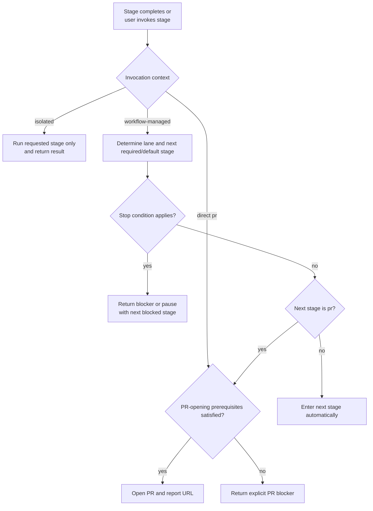

# Workflow Stage Autoprogression Design

## Status
- approved

## Related artifacts

- Proposal: `docs/proposals/2026-04-21-workflow-stage-autoprogression.md`
- Spec: `specs/workflow-stage-autoprogression.md`
- Governing workflow contract: `specs/rigorloop-workflow.md`
- Operational summary: `docs/workflows.md`
- ADR: `docs/adr/ADR-20260419-repository-source-layout.md`
- Project map: none yet

## Summary

This change should remain a small workflow-policy and skill-behavior design, not a new orchestration subsystem. In v1, autoprogression applies only to full-feature execution flow from `implement` through `pr`, plus the authoring-to-review handoffs `proposal -> proposal-review`, `spec -> spec-review`, and `architecture -> architecture-review` when those review stages are the next required or default downstream step. The design should use the current lane, explicit invocation context, the completed stage outcome, stop conditions, and existing PR-readiness surfaces so stage skills can continue automatically where allowed while leaving fast-lane and bugfix execution on the repository's existing explicit-step behavior.

## Requirements covered

| Requirement IDs | Design area |
| --- | --- |
| `R1`-`R2g` | Invocation-context model, isolated-stage boundary, direct-`pr` behavior, bounded v1 scope |
| `R3`-`R3f` | Full-feature downstream transition rules, conditional `ci`, and post-`ci` handoff |
| `R5`-`R6c` | Stop-condition evaluation, PR-opening prerequisites, PR-opening boundary |
| `R7`-`R8d` | Review gates, pause behavior, advice-only stage handling |
| `R9`-`R10a` | Readiness wording, compatibility boundary, non-expansion into destructive automation |

## Current architecture context

- The repository already has a lane model and stage-classification contract in `specs/rigorloop-workflow.md`.
- Operational workflow behavior is expressed primarily through canonical docs and skills under:
  - `docs/`
  - `specs/`
  - `skills/`
- `.codex/skills/` is generated compatibility output, not an authored source of truth.
- The current workflow guidance requires the user to invoke each next stage explicitly, even when the lane already defines the next required or default downstream step.
- The repository does not have a repo-owned executable workflow router today. Stage progression is driven by the agent following the workflow contract and the relevant stage skills.
- The `pr` stage already owns PR preparation and opening behavior, but the current guidance does not make direct PR submission the default outcome once readiness is satisfied.

## Proposed architecture

### Design direction

Implement autoprogression as a lane-aware, context-aware workflow decision layer expressed through the canonical workflow contract and the affected stage skills.

The design should use five inputs:

1. the current lane;
2. the invocation context;
3. the completed stage and its outcome;
4. explicit pause or blocker conditions;
5. the existing PR-readiness surfaces used by `pr`.

The design should keep responsibility boundaries narrow:

- `workflow` owns lane classification, invocation-context classification, and the generic continuation rule.
- Authoring stages `proposal`, `spec`, and `architecture` own automatic handoff into their matching review stages when those review stages are the next required or default downstream step for the active lane.
- Full-feature execution stages `implement`, `code-review`, `review-resolution`, `verify`, `ci` when triggered, `explain-change`, and `pr` own the downstream continuation behavior inside the bounded `implement`-through-`pr` execution segment.
- `pr` remains the only stage that opens a pull request.
- Direct `pr` invocation remains in scope and still performs the `pr` stage itself when readiness passes, even when no downstream continuation context exists.
- Direct `code-review`, `verify`, and `explain-change` invocation remain isolated by default unless workflow-managed context is present.
- Fast-lane and bugfix execution remain on the repository's existing explicit-step behavior in v1.
- `learn` remains advice-only and does not auto-run by default in v1.

The design intentionally does not add:

- a persistent workflow state store;
- a new orchestration daemon or queue;
- a second readiness registry separate from existing workflow and PR artifacts;
- merge, release, deploy, or destructive Git automation.

### Components, responsibilities, and boundaries

| Surface | Responsibility | Source of truth | Notes |
| --- | --- | --- | --- |
| `specs/rigorloop-workflow.md` | Lane definitions, stage classification, and authoritative downstream-stage model | authored | Must remain the source of truth for stage order and lane rules |
| `specs/workflow-stage-autoprogression.md` | Continuation contract, stop conditions, and PR-opening prerequisites | authored | Defines when the workflow continues or stops |
| `docs/workflows.md` | Short operational summary of autoprogression behavior | authored | Human-readable summary, not the normative contract |
| `AGENTS.md` | Repository-level execution summary | authored | Must reflect the new default continuation behavior briefly |
| Canonical stage skills in `skills/` | Stage-local continuation behavior and readiness wording | authored | `workflow`, `proposal`, `spec`, `architecture`, `implement`, `code-review`, `ci`, `verify`, `explain-change`, `pr`, and `learn` are the primary touch points |
| `.codex/skills/` | Compatibility output | generated | Must be regenerated, never hand-edited |

## Data model and data flow

No new persistent data model is required. The decision can be made from transient workflow context plus already-authored repository artifacts.

| Input | Source | Purpose |
| --- | --- | --- |
| `lane` | workflow classification and governing workflow contract | Determines the next required or default downstream stage |
| `invocation_context` | upstream stage handoff or direct user request classification | Distinguishes workflow-managed continuation, isolated stage execution, and direct-`pr` behavior |
| `completed_stage` and `stage_outcome` | current stage result | Determines whether the workflow may continue, must loop, or must stop |
| `stop_conditions` | user instruction, review findings, validation results, tool limits, plan checkpoints | Prevents surprising or unsafe continuation |
| `pr_readiness` | branch/worktree state, validation evidence, lifecycle truthfulness | Determines whether `pr` opens a PR or reports a blocker |

The data flow is:

1. a stage completes or the user directly invokes a stage;
2. the workflow classifies one of three contexts:
   - workflow-managed continuation;
   - isolated direct stage execution;
   - direct `pr` execution;
3. if the context is workflow-managed, the active lane and stage outcome identify the next required or default downstream stage;
4. stop conditions are evaluated before continuation;
5. the next stage is entered automatically, or a blocker/pause result is returned;
6. if the active step is `pr`, the existing readiness surfaces determine whether to open the PR directly.

## Control flow

## Interfaces and contracts

- The lane model and stage table remain owned by `specs/rigorloop-workflow.md`; this feature must not create a second source of truth for stage order.
- The autoprogression contract remains owned by `specs/workflow-stage-autoprogression.md`; the design must not broaden beyond that spec.
- `pr` must reuse existing readiness surfaces rather than inventing a separate “autoprogression ready” state.
- Invocation-context classification should be carried ephemerally through stage handoff and direct-request interpretation, not through a new persisted store.
- Skill guidance should be updated so stage-local behavior matches the lane-aware model:
  - `proposal -> proposal-review` when the lane requires it;
  - `spec -> spec-review` when the lane requires it;
  - `architecture -> architecture-review` when the lane requires it;
  - `implement -> code-review` in the full-feature lane;
  - `code-review <-> review-resolution` when findings are accepted for action;
  - `verify -> ci` when the governing workflow contract elevates `ci`;
  - `verify -> explain-change` otherwise;
  - `ci -> explain-change` in the full-feature lane;
  - `explain-change -> pr` in the full-feature lane;
  - direct `pr` still opens the PR when readiness passes;
  - direct `code-review`, `verify`, and `explain-change` remain isolated by default;
  - fast-lane and bugfix execution keep their existing explicit-step behavior in v1;
  - `learn` remains explicit rather than automatic.
- `pr` output must distinguish:
  - PR opened successfully;
  - PR ready but blocked by known prerequisite failure;
  - PR opening failed because of network or tool limitations.

## Failure modes

- Wrong lane inference applies the wrong next stage.
  - Mitigation: stop when lane classification is ambiguous instead of guessing.
- Direct `pr` is treated as a no-op because isolation was interpreted too broadly.
  - Mitigation: keep direct-`pr` as a first-class invocation context that still executes the `pr` stage itself.
- Isolated review-only requests continue unexpectedly.
  - Mitigation: treat review-only and explicitly isolated stage requests as non-autoprogressing by contract.
- Review-to-next-authoring transitions continue unexpectedly.
  - Mitigation: keep those transitions explicitly out of v1 scope.
- `code-review` findings that need a product or design choice are treated as fix-only loops.
  - Mitigation: stop when findings require a real user decision.
- Full-feature flow skips conditional `ci` or fails to return to `explain-change` afterward.
  - Mitigation: keep `verify -> ci/explain-change -> pr` explicit in the contract and mirrored in the affected skills.
- `pr` opens against the wrong base or with unrelated tracked changes.
  - Mitigation: keep explicit PR-opening prerequisites and block when they are not met.
- The workflow expands implicitly into merge, release, deploy, or destructive Git actions.
  - Mitigation: keep those actions outside the autoprogression boundary by explicit rule.

## Security and privacy design

- No new secrets, credentials, or external services are introduced by this design.
- The strongest default external action remains PR creation, which is already reviewable and reversible in a way merge and release are not.
- The design must continue to exclude unrelated tracked or local-only files from PR scope.
- The design must not authorize destructive Git operations, deployment actions, or publication steps without explicit user intent.

## Performance and scalability

- The design should reduce unnecessary chat turns without adding meaningful runtime cost.
- Because v1 remains guidance- and skill-driven, there is no new long-running subsystem or persistent state to scale.
- Any future executable router should be evaluated separately if the repository decides that guidance-only enforcement is insufficient.

## Observability

- Stage outputs should state when autoprogression is happening and name the next stage.
- When continuation stops, the output should identify the paused or blocked stage and why continuation stopped.
- Stage outputs should make invocation-context classification visible when that classification changes behavior, especially for isolated direct stage execution and direct `pr`.
- `pr` output should state whether a PR was opened or merely blocked.
- Plans and other workflow-managed readiness surfaces should reflect the actual next downstream stage rather than implying manual re-invocation is required.

## Compatibility and migration

- This is a workflow-behavior change, not a product-runtime compatibility change.
- Existing lane definitions and stage order remain intact.
- Fast-lane and bugfix execution remain intentionally unchanged in v1.
- Review-only requests remain intentionally isolated, except that direct `pr` still performs its own stage action when readiness passes.
- Migration consists of aligning:
  - the workflow contract;
  - the operational summary;
  - repository guidance;
  - canonical stage skills;
  - generated `.codex/skills/`.
- If the repository later chooses to add executable workflow orchestration, that should happen in a separate change after this contract-level behavior is stable.

## Alternatives considered

### Keep explicit user confirmation between every stage

- Simpler behavior model.
- Rejected because it keeps the user acting as a manual router for already-known downstream gates.

### Hard-code only `implement -> code-review` and `pr -> open PR`

- Small immediate fix.
- Rejected because it patches symptoms rather than defining a consistent continuation policy across lanes and stages.

### Apply the mechanism to full-feature, fast-lane, and bugfix execution in v1

- Broader behavioral consistency.
- Rejected because the approved spec intentionally narrows v1 to the high-friction full-feature path and authoring-to-review handoffs.

### Add a repo-owned workflow router script now

- Could make continuation rules executable immediately.
- Rejected for v1 because the spec only requires workflow-contract and stage-skill behavior, and a new router would add a second implementation surface before the policy is stable.

## ADRs

- No new ADR is required for v1.
- This design extends the existing canonical-source boundary from `ADR-20260419-repository-source-layout.md` rather than creating a new architecture decision record.

## Risks and mitigations

- Risk: the design is implemented inconsistently across stage skills.
  - Mitigation: keep the lane model in the workflow contract and update all affected canonical skills together.
- Risk: users who want one-stage output perceive continuation as surprising.
  - Mitigation: keep isolated stage requests and explicit pause instructions as first-class stop conditions.
- Risk: readiness wording drifts and still implies manual downstream invocation.
  - Mitigation: update readiness text in affected artifacts and keep review/verify expectations explicit.
- Risk: the repository later needs executable enforcement and the guidance-only design becomes insufficient.
  - Mitigation: keep v1 small now and treat any router or validator addition as a separate follow-on decision.

## Open questions

- Should a later revision add a structured `pause-after` or `checkpoint` syntax, or remain chat-instruction-only?
- If the repository later wants executable workflow orchestration, should it live in repo-owned scripts or remain skill-guidance-only?

These questions do not block planning or implementation sequencing.

## Next artifacts

- `specs/workflow-stage-autoprogression.test.md`
- update `specs/rigorloop-workflow.md`, `docs/workflows.md`, `AGENTS.md`, and the affected canonical skills during implementation
- `docs/plans/2026-04-21-workflow-stage-autoprogression.md`

## Follow-on artifacts

- `docs/plans/2026-04-21-workflow-stage-autoprogression.md`

## Readiness

- This architecture is approved.
- Architecture review is complete.
- The next stage is `plan`.
- No separate ADR is required unless implementation expands into repo-owned executable workflow orchestration.
