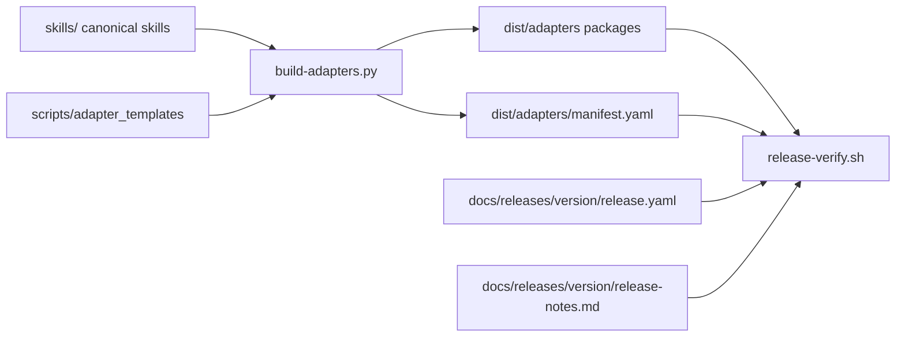
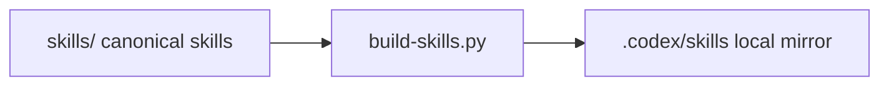
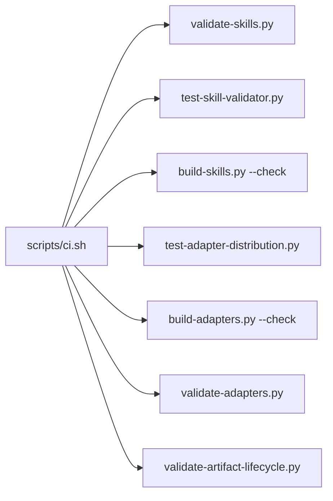

# Multi-Agent Adapter Distribution Architecture

## Status
- archived

## Closeout

- Final disposition: archived/historical snapshot.
- Canonical current architecture: `docs/architecture/system/architecture.md`.
- Merge-back evidence: `docs/changes/2026-04-29-legacy-architecture-lifecycle-normalization/architecture.md`.
- Archive rationale: accepted current adapter-package, generated-manifest, release-metadata, tracked release-notes, generated-surface validation, and release-verification content was merged into the canonical package during legacy architecture normalization. This file preserves the historical multi-agent adapter distribution design rationale and should not be used as the current architecture source for downstream work.

## Related artifacts

- Proposal: `docs/proposals/2026-04-24-multi-agent-adapters-first-public-release.md`
- Spec: `specs/multi-agent-adapters-first-public-release.md`
- ADR: `docs/adr/ADR-20260424-generated-adapter-packages.md`
- Existing architecture: `docs/architecture/2026-04-19-rigorloop-first-release-repository-architecture.md`
- Existing ADR: `docs/adr/ADR-20260419-repository-source-layout.md`
- Project map: none yet

## Summary

RigorLoop should add a public generated distribution layer under `dist/adapters/` while preserving the existing canonical-source model. Authored workflow skills remain in `skills/`, authored thin adapter entrypoint templates live under `scripts/adapter_templates/`, and repo-owned Python scripts generate and validate installable Codex, Claude Code, and opencode packages plus `dist/adapters/manifest.yaml`. The existing `.codex/skills/` tree remains a local generated Codex runtime mirror, not the public package surface. Release metadata and smoke evidence live in tracked `docs/releases/<version>/release.yaml`, with tracked release notes beside it, and `scripts/release-verify.sh` becomes the release gate that ties canonical skills, generated adapters, release metadata, release notes, smoke evidence, and security checks together.

## Requirements covered

| Requirement IDs | Design area |
| --- | --- |
| `R1`-`R10` | Canonical skills, generated adapter package roots, deterministic output, installable package boundaries |
| `R11`-`R15` | Thin instruction entrypoint templates and target package entrypoints |
| `R16`-`R28` | Portable-core validation and adapter-specific skill inclusion |
| `R29`-`R35` | Generated adapter manifest data model and consistency checks |
| `R36`-`R38` | Public documentation and contributor expectations |
| `R39`-`R42a` | Release metadata and smoke matrix schema |
| `R43`-`R47` | RC/final release verification gates and release notes consistency |
| `R48` | CI integration for adapter validation |
| `R49`-`R50` | Existing `.codex/skills/` generated mirror compatibility |
| `R51`-`R53` | Non-goals, dependency/security limits, no default permission broadening |

## Current architecture context

- Canonical authored workflow content currently lives in `docs/`, `specs/`, `skills/`, `schemas/`, and `scripts/`.
- `skills/` is the canonical authored skill tree.
- `.codex/skills/` is generated Codex compatibility output derived from `skills/`.
- `scripts/build-skills.py` currently performs a byte-for-byte sync from `skills/` to `.codex/skills/` and checks drift.
- `scripts/skill_validation.py`, `scripts/validate-skills.py`, and `scripts/test-skill-validator.py` provide first-release skill validation.
- `scripts/ci.sh` delegates to repo-owned validation commands and filters `.codex/skills/*` out of authored artifact lifecycle validation.
- `.github/workflows/release.yml` currently calls `scripts/release-verify.sh`, then creates a GitHub release with generated notes.
- `scripts/release-verify.sh` is still a placeholder checklist and must become repository-specific before release claims are valid.
- The existing ADR intentionally avoided a larger `dist/` layout for the first repository baseline; the accepted adapter spec now requires `dist/adapters/` as the first public adapter package surface.

## Proposed architecture

### Repository layout

The adapter distribution architecture should use this layout:

```text
skills/
  <skill-name>/SKILL.md                      # canonical authored skill source
scripts/
  adapter_distribution.py                    # shared adapter generation, validation, parsing, security helpers
  build-adapters.py                          # generate or check dist/adapters/
  validate-adapters.py                       # validate generated package shape, manifest, portability, security
  test-adapter-distribution.py               # fixture/regression tests for adapter generation and validation
  validate-release.py                        # validate docs/releases/<version>/release.yaml and release notes
  release-verify.sh                          # release gate orchestrator
  adapter_templates/
    codex/AGENTS.md                          # authored thin template
    claude/CLAUDE.md                         # authored thin template
    opencode/AGENTS.md                       # authored thin template
dist/
  adapters/
    manifest.yaml                            # generated support matrix and portability record
    codex/
      AGENTS.md
      .agents/skills/<skill-name>/SKILL.md
    claude/
      CLAUDE.md
      .claude/skills/<skill-name>/SKILL.md
    opencode/
      AGENTS.md
      .opencode/skills/<skill-name>/SKILL.md
docs/
  releases/
    v0.1.0-rc.1/
      release.yaml                           # authored release metadata and smoke matrix
      release-notes.md                       # authored release notes checked by release verification
    v0.1.0/
      release.yaml
      release-notes.md
.codex/
  skills/<skill-name>/SKILL.md               # existing generated local Codex runtime mirror
```

### Component responsibilities and boundaries

| Component | Responsibility | Ownership |
| --- | --- | --- |
| `skills/` | Canonical RigorLoop skill source. | Authored |
| `scripts/adapter_templates/` | Thin adapter entrypoint templates only; no skill bodies. | Authored |
| `scripts/adapter_distribution.py` | Shared adapter package model, simple YAML parsing/writing, portability checks, manifest checks, drift collection, security scans. | Authored |
| `scripts/build-adapters.py` | CLI to generate `dist/adapters/` or fail on drift with `--check`. | Authored |
| `scripts/validate-adapters.py` | CLI to validate generated adapter packages, manifest, portability outcomes, and security constraints without writing files. | Authored |
| `scripts/test-adapter-distribution.py` | Fixture-driven regression coverage for portable, transformed, excluded, and invalid skills plus release metadata edge cases that do not need real tools. | Authored |
| `dist/adapters/` | Public tracked generated adapter packages and manifest. | Generated |
| `docs/releases/<version>/release.yaml` | Authoritative release metadata, smoke matrix, and gate status for a tag. | Authored |
| `docs/releases/<version>/release-notes.md` | Tracked release notes source checked by release verification and used by GitHub release creation. | Authored |
| `.codex/skills/` | Local generated Codex runtime mirror for this repository's own Codex sessions. | Generated |
| `scripts/release-verify.sh` | Release-gate orchestrator. | Authored |
| `.github/workflows/release.yml` | Thin GitHub integration wrapper around `scripts/release-verify.sh` and tracked release notes. | Integration |

### Source-of-truth boundary

The design has three distinct surfaces:

- Authored source: `skills/`, `scripts/adapter_templates/`, validation scripts, docs, specs, architecture, release metadata, and release notes.
- Public generated distribution: `dist/adapters/`.
- Local generated runtime mirror: `.codex/skills/`.

`dist/adapters/` and `.codex/skills/` are both generated, but they serve different consumers. `dist/adapters/` is the installable public package surface. `.codex/skills/` preserves the current local Codex runtime behavior and remains on the existing `build-skills.py --check` proof path until a later accepted change explicitly retires or migrates it.

## Data model and data flow

### Adapter manifest

`dist/adapters/manifest.yaml` is generated and contains:

```yaml
version: 0.1.0
skills:
  workflow:
    portable: true
    adapters: [codex, claude, opencode]
  example-codex-only:
    portable: false
    adapters: [codex]
    reason: Uses Codex-only invocation assumptions.
```

The manifest is the generated support matrix. It is validated against the generated file tree rather than treated as a separate source of truth.

### Release metadata

`docs/releases/<version>/release.yaml` is authored release evidence:

```yaml
version: v0.1.0-rc.1
release_type: rc
manifest_version: 0.1.0-rc.1
supported_tools:
  - codex
  - claude
  - opencode
adapter_paths:
  codex: dist/adapters/codex/
  claude: dist/adapters/claude/
  opencode: dist/adapters/opencode/
instruction_entrypoints:
  codex: dist/adapters/codex/AGENTS.md
  claude: dist/adapters/claude/CLAUDE.md
  opencode: dist/adapters/opencode/AGENTS.md
smoke:
  codex:
    result: not-run
    tool_version: unknown
    evidence: ""
    reason: "RC published before full smoke."
    owner: maintainer
  claude:
    result: not-run
    tool_version: unknown
    evidence: ""
    reason: "RC published before full smoke."
    owner: maintainer
  opencode:
    result: not-run
    tool_version: unknown
    evidence: ""
    reason: "RC published before full smoke."
    owner: maintainer
validation:
  generated_sync: pass
  release_notes_consistency: pass
  placeholder_release_check: pass
  security: pass
```

The release metadata is not generated because it records maintainer smoke evidence and release decisions. Validation may create example fixtures, but the real release metadata remains authored.

### Data flow



### `.codex/skills/` mirror flow



`dist/adapters/codex/` is not the source for `.codex/skills/`, and `.codex/skills/` is not the source for `dist/adapters/codex/`. Both are generated from canonical `skills/` through their own explicit check paths.

## Control flow

### Adapter generation and validation

1. Read canonical `skills/<skill-name>/SKILL.md`.
2. Parse supported frontmatter with the existing simple YAML-frontmatter approach.
3. Apply portable-core validation for each target adapter.
4. Decide adapter inclusion, exclusion, or explicit transform.
5. Render generated skill files to each target package path.
6. Render thin instruction entrypoints from `scripts/adapter_templates/<adapter>/`.
7. Generate `dist/adapters/manifest.yaml`.
8. In write mode, synchronize `dist/adapters/` and remove unexpected generated files.
9. In check mode, compare expected generated files with tracked `dist/adapters/` and fail on missing, stale, or unexpected output.
10. Validate generated output shape, manifest consistency, unsupported metadata removal, and security scans.

### CI flow



`scripts/ci.sh` should filter generated `dist/adapters/*` paths out of authored artifact lifecycle validation for the same reason it filters `.codex/skills/*`: generated outputs are checked by drift and adapter validation, not by authored lifecycle rules.

### Release flow

1. Maintainer prepares `docs/releases/<version>/release.yaml` and `release-notes.md`.
2. Maintainer runs release verification locally or through the tag workflow.
3. `scripts/release-verify.sh` determines the release version from an argument or `GITHUB_REF_NAME`.
4. `scripts/release-verify.sh` invokes:
   - skill validation;
   - skill regression validation;
   - `.codex/skills/` drift check;
   - adapter distribution regression tests;
   - adapter generation drift check;
   - adapter validation;
   - release metadata validation;
   - security checks.
5. For `v0.1.0-rc.1`, release verification allows `not-run` smoke and externally blocked smoke only with reason and owner, and rejects known smoke failures.
6. For `v0.1.0`, release verification requires every smoke row to pass.
7. `.github/workflows/release.yml` uses the tracked `release-notes.md` file instead of generated release notes when creating the GitHub release.

## Interfaces and contracts

### Adapter generation CLI

`scripts/build-adapters.py` should expose:

```text
python scripts/build-adapters.py
python scripts/build-adapters.py --check
python scripts/build-adapters.py --version 0.1.0-rc.1
python scripts/build-adapters.py --version 0.1.0 --check
```

The default version should be explicit in the implementation plan or script help. Release verification should always pass the tag-derived version rather than relying on a default.

### Adapter validation CLI

`scripts/validate-adapters.py` should validate the already-generated package tree:

```text
python scripts/validate-adapters.py --version 0.1.0-rc.1
python scripts/validate-adapters.py --version 0.1.0
```

The command should fail on portability, manifest, generated path, unsupported metadata, and security violations.

### Release metadata validation CLI

`scripts/validate-release.py` should validate the release metadata and release notes for one tag:

```text
python scripts/validate-release.py --version v0.1.0-rc.1
python scripts/validate-release.py --version v0.1.0
```

The command should read:

- `docs/releases/<version>/release.yaml`
- `docs/releases/<version>/release-notes.md`
- `dist/adapters/manifest.yaml`
- generated adapter package paths named by release metadata

### Release verification shell contract

`scripts/release-verify.sh` should be the public release gate:

```text
bash scripts/release-verify.sh v0.1.0-rc.1
bash scripts/release-verify.sh v0.1.0
```

When no argument is given in GitHub Actions, it may use `GITHUB_REF_NAME`. It must not remain a checklist-only script.

### YAML parsing contract

The first implementation should use a repository-owned minimal YAML parser for the constrained manifest and release metadata shapes, or reuse the existing limited metadata parsing style. It should not add PyYAML or a broader dependency unless a later architecture update justifies that dependency.

## Failure modes

- Canonical skill parse failure: adapter generation and validation fail before writing partial output.
- Portable-core failure: the target adapter either excludes the skill with a manifest reason or applies an explicitly tested transform.
- Unsupported metadata leak: validation fails if generated non-Codex output still contains disallowed metadata.
- Manifest/file mismatch: validation fails if a manifest entry points to a missing generated skill or a generated skill is absent from the manifest.
- Drift: `build-adapters.py --check` fails on missing, stale, or unexpected generated files.
- Stale `.codex/skills/`: `build-skills.py --check` fails independently of adapter package drift.
- Release metadata mismatch: `validate-release.py` fails when release metadata, manifest, release notes, and generated adapter paths do not name the same supported tools/version.
- RC smoke failure: release verification fails on any `fail` smoke row.
- Final smoke incompleteness: release verification fails on any `fail`, `not-run`, or `blocked` smoke row.
- Placeholder release checks: release verification fails if placeholder text remains or required repository-specific checks are not invoked.
- Partial release workflow failure: GitHub release creation does not run until `scripts/release-verify.sh` passes.

## Security and privacy design

- Generation and validation use only repository files and standard-library logic.
- Adapter packages must not contain credentials, tokens, private keys, or machine-local paths.
- Adapter packages must not generate tool-specific permission bypass configuration by default.
- Security validation should scan generated adapter files, templates, release metadata, and release notes for:
  - common secret markers;
  - private key delimiters;
  - absolute machine-local paths;
  - placeholder permission-bypass language.
- `docs/releases/<version>/release.yaml` records smoke evidence and owner names only; it must not store credentials, session tokens, or private tool logs.
- Hosted CI status must not be claimed unless observed; release metadata should link or summarize evidence rather than pretending hosted CI passed.

## Performance and scalability

- Adapter generation is a filesystem transform over `skills/` plus a small fixed adapter set, so it should scale linearly with the number of skills and generated files.
- Validation should avoid invoking Codex, Claude Code, or opencode in ordinary CI.
- Maintainer smoke is intentionally outside ordinary contributor validation to keep local contribution setup lightweight.
- Drift checks should compare bytes for generated files after deterministic rendering.

## Observability

Repo-owned commands should print:

- release version under validation;
- adapter package paths checked or written;
- count of skills included and excluded per adapter;
- manifest path and version checked;
- release metadata path checked;
- named release gate failures;
- smoke row failures with adapter name and result.

Error messages should include the skill name, adapter name, and path whenever possible.

## Compatibility and migration

- Existing `.codex/skills/` remains generated output and continues to be checked by `scripts/build-skills.py --check`.
- New public adapter packages live under `dist/adapters/` and are checked by `scripts/build-adapters.py --check` plus `scripts/validate-adapters.py`.
- The first implementation should update root guidance and public docs to explain both generated surfaces:
  - `.codex/skills/` is a local Codex runtime mirror used by this repository.
  - `dist/adapters/codex/` is the public Codex adapter package.
- The previous ADR remains valid for the first repository baseline. The new ADR extends the generated-output model for public adapter packaging and does not make `.codex/skills/` authored.
- Rollback before a release tag can remove generated `dist/adapters/`, adapter scripts, templates, release metadata, and docs without touching canonical `skills/`.
- Rollback after a release tag should use patch release notes or a patch tag; released tag history should not be rewritten.

## Alternatives considered

### Alternative 1: Hand-author each adapter package

Rejected because it creates three competing skill trees, makes drift likely, and violates the accepted proposal's source-authored-once direction.

### Alternative 2: Replace `.codex/skills/` with `dist/adapters/codex/`

Rejected for this initiative because `.codex/skills/` is the existing local runtime compatibility surface. Removing it would create migration risk unrelated to proving the public adapter package contract.

### Alternative 3: Generate `.codex/skills/` from `dist/adapters/codex/`

Rejected because it would make a generated public package a source for another generated surface. Both generated surfaces should derive from canonical `skills/` instead.

### Alternative 4: Add a general-purpose YAML dependency

Rejected for the first implementation because the manifest and release metadata shapes are constrained, existing repository scripts avoid third-party dependencies, and release validation should run without network setup.

## ADRs

- `docs/adr/ADR-20260424-generated-adapter-packages.md`: accept generated public adapter packages under `dist/adapters/` while preserving `.codex/skills/` as a separate local generated mirror.

## Risks and mitigations

- Risk: `dist/adapters/codex/` and `.codex/skills/` drift independently.
  Mitigation: keep separate explicit drift checks for each generated surface in CI and release verification.
- Risk: Portable-core validation excludes too many skills for the first public package.
  Mitigation: record exclusions in `dist/adapters/manifest.yaml` and treat portability improvements as follow-up work.
- Risk: Release metadata becomes another stale artifact.
  Mitigation: `validate-release.py` compares metadata against generated packages, manifest, release notes, and smoke rules.
- Risk: Generated output creates noisy PRs.
  Mitigation: keep deterministic ordering and require PR summaries to group generated files separately from authored changes.
- Risk: Minimal YAML parsing under-validates future shapes.
  Mitigation: keep the first schema constrained and require architecture/spec updates before adding richer nested structures.

## Open questions

None that block execution planning.

The execution plan should still decide the milestone order and exact fixture coverage.

## Next artifacts

None for this archived record. Current architecture truth lives in `docs/architecture/system/architecture.md`.

## Follow-on artifacts

- Final disposition: archived/historical snapshot after accepted current content was merged into `docs/architecture/system/architecture.md`.
- Historical scope: multi-agent adapter distribution design rationale and original release architecture context.

## Readiness

This architecture record is archived as historical evidence.

No current downstream workflow handoff is owned by this artifact. Downstream work should use `docs/architecture/system/architecture.md` as the current architecture source, `specs/multi-agent-adapters-first-public-release.md` for the behavior contract, and `docs/adr/ADR-20260424-generated-adapter-packages.md` for the durable adapter-package decision.
