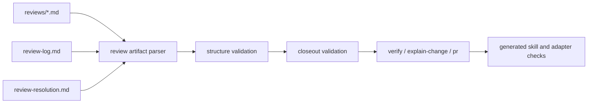

# Review Finding Resolution Contract Architecture

## Status

- approved

## Related artifacts

- Proposal: `docs/proposals/2026-04-24-review-finding-resolution-contract.md`
- Spec: `specs/review-finding-resolution-contract.md`
- Governing workflow contract: `specs/rigorloop-workflow.md`
- Related architecture: `docs/architecture/2026-04-21-docs-changes-usage-policy.md`
- Related architecture: `docs/architecture/2026-04-24-multi-agent-adapter-distribution.md`
- Related ADR: `docs/adr/ADR-20260419-repository-source-layout.md`
- Related ADR: `docs/adr/ADR-20260424-generated-adapter-packages.md`
- Change-local review log: `docs/changes/2026-04-24-review-finding-resolution-contract/review-log.md`
- Change-local review resolution: `docs/changes/2026-04-24-review-finding-resolution-contract/review-resolution.md`
- Project map: none yet

## Summary

This change should be implemented as a small review-artifact contract and validation layer on top of the existing change-local artifact model. Detailed review files, `review-log.md`, and `review-resolution.md` remain authored Markdown under `docs/changes/<change-id>/`; a new repository-owned validator parses stable field labels, checks Review ID and Finding ID relationships, validates canonical review-log blocks, and offers a closeout-gated mode for `verify`, `explain-change`, and `pr`. Canonical workflow skills remain the source for stage behavior, and any shipped skill changes must flow through the existing `.codex/skills/` and public adapter generation paths.

## Requirements covered

| Requirement IDs | Design area |
| --- | --- |
| `R1`-`R1d` | Complete material finding structure and incomplete-finding boundary |
| `R2`-`R2o` | Detailed review record metadata, first-pass timing, reconstructed records, and append-only review history |
| `R3`-`R3p` | Required review-log, canonical `### Review entry` block parsing, resolution links, closed open-finding state, and exact-once Review ID references |
| `R4`-`R4c` | Material Finding IDs and Finding ID uniqueness |
| `R5`-`R5i` | Required review-resolution entries before fixes, initial decisions, final actions, and validation targets |
| `R6`-`R6m` | Disposition vocabulary, top-level closeout status, final disposition rules, and closeout blockers |
| `R7`-`R7d` | Disposition-specific action, rationale, follow-up, and validation evidence records |
| `R8`-`R10c` | `verify`, `explain-change`, and `pr` closeout behavior |
| `R11`-`R11b` | Minimal structural validation, closeout-gated validation, and semantic-automation boundary |
| `R12`-`R12c` | Generated skill and adapter synchronization after canonical skill changes |
| `R13`-`R13b` | Clean-review lightweight path and conditional artifact creation |
| `R14`-`R14a` | Governance, workflow contract, and skill vocabulary alignment |

## Current architecture context

- `docs/changes/<change-id>/` is already the authored home for non-trivial change-local metadata and durable Markdown reasoning.
- `docs/changes/<change-id>/change.yaml` is validated by `scripts/validate-change-metadata.py`, which owns change metadata shape rather than detailed review Markdown semantics.
- `scripts/artifact_lifecycle_validation.py` validates lifecycle-managed top-level artifact status, references, generated-output scope, and stale readiness, not per-change review findings.
- Existing historical `review-resolution.md` examples predate this contract and use loose tables without stable Finding IDs.
- The accepted spec-review rerun approved the normative closeout, reconstructed-record, and canonical review-log requirements.
- The first architecture-review found two design gaps: parseable review-resolution closeout fields and exact-once review-log parsing. This revision resolves those gaps before planning.
- Historical review artifacts are not required to migrate unless they are touched, generated, or relied on as current authoritative guidance.
- `skills/` remains the canonical authored skill tree.
- `.codex/skills/` and `dist/adapters/` are generated outputs that must be refreshed and validated when shipped canonical skills change.

## Proposed architecture

### Design direction

Add a dedicated review-artifact validation path instead of broadening lifecycle or change-metadata validators beyond their current ownership.

The implementation should introduce:

| Component | Responsibility | Ownership |
| --- | --- | --- |
| `docs/changes/<change-id>/reviews/*.md` | One detailed formal lifecycle review event per file | authored |
| `docs/changes/<change-id>/review-log.md` | Canonical line-block ledger of detailed review records and open-finding state | authored |
| `docs/changes/<change-id>/review-resolution.md` | Top-level closeout status plus material Finding ID dispositions, rationale, actions, and evidence | authored |
| `scripts/review_artifact_validation.py` | Shared parser and validation rules for change-local review artifacts | authored |
| `scripts/validate-review-artifacts.py` | CLI wrapper for explicit change-root validation | authored |
| `scripts/test-review-artifact-validator.py` | Regression coverage for valid and invalid review artifact packs | authored |
| `scripts/ci.sh` | Orchestrates review-artifact validation for touched or explicitly selected change roots | authored |
| `skills/code-review`, `skills/workflow`, `skills/verify`, `skills/explain-change`, `skills/pr` | Stage guidance for findings, dispositions, closeout, and PR summary | authored |
| `.codex/skills/` | Generated local Codex mirror after canonical skill updates | generated |
| `dist/adapters/` and `dist/adapters/manifest.yaml` | Generated public adapter packages after canonical skill updates | generated |

### Source-of-truth boundary

The review artifact files are authored source. The validator is a structural consistency checker, not the source of truth for review decisions.

The validator owns:

- required field presence;
- exact-one and uniqueness checks for Review IDs;
- canonical review-log block parsing;
- review-log references and dangling-reference checks;
- Finding ID uniqueness;
- resolution references to known findings;
- required presence of material Finding IDs in `review-resolution.md`;
- allowed disposition values;
- top-level closeout status values;
- disposition-specific closeout field presence in closeout-gated mode.

The validator does not own:

- whether review evidence is persuasive;
- whether a suggested solution is best;
- whether a rejection rationale is substantively correct;
- whether a deferred follow-up is strategically acceptable;
- whether a recorded validation command is the ideal proof surface.

### Validation modes

The validator should support two modes:

| Mode | Used by | Blocking behavior |
| --- | --- | --- |
| `structure` | authoring, local checks, CI for touched change roots | Fails malformed review artifacts, duplicate or dangling IDs, unsupported disposition values, missing material resolutions, invalid reconstructed records, and invalid closeout status values |
| `closeout` | `verify`, `explain-change`, and `pr` handoff | Includes `structure` checks, then requires `Closeout status: closed`, no `needs-decision`, empty review-log open-finding sets, and disposition-specific closeout fields |

`structure` mode may accept `Closeout status: open`. `closeout` mode must reject it.

## Data model and data flow

### Markdown field convention

New detailed review files should use stable field labels near the top of the file:

```md
Review ID: code-review-r1
Stage: code-review
Round: 1
Reviewer: Codex code-review skill
Target: git diff main...HEAD
Status: changes-requested
```

A normal first-pass record may omit `Record mode`. A reconstructed record must explicitly include:

```md
Record mode: reconstructed
Original review source: <chat transcript, issue comment, artifact, or unavailable>
Original review evidence: <durable link, copied evidence summary, or unavailable with reason>
Created after fixes began: yes
Loss of fidelity: none | <known loss>
```

Material findings should use stable Finding IDs:

```md
Finding ID: CR1-F1
```

For v1, every `Finding ID:` in a detailed review file is treated as material and must appear in `review-resolution.md`. Non-material positive notes, nits, or informational observations should omit Finding IDs unless they intentionally require a disposition.

`review-log.md` must use one canonical block per detailed review event:

```md
### Review entry
Review ID: code-review-r1
Stage: code-review
Round: 1
Status: changes-requested
Detailed record: reviews/code-review-r1.md
Resolution: review-resolution.md#code-review-r1
Material findings: CR1-F1, CR1-F2
Open findings: CR1-F1
```

For v1, `Resolution:` is a repository-internal symbolic reference and must be exactly `review-resolution.md#<Review ID>`. When `review-resolution.md` exists, the referenced Review ID must be represented by a matching review section heading such as `### code-review-r1`.

For v1, the validator counts only `Review ID: <id>` lines inside `### Review entry` blocks as review-log ledger references. Incidental prose mentions do not satisfy the ledger requirement and do not create duplicate-ledger failures.

When `review-resolution.md` is closed, every review-log entry must have `Open findings: None`.

`review-resolution.md` must carry a top-level closeout status and one entry for each material Finding ID:

```md
Closeout status: open

Finding ID: CR1-F1
Disposition: accepted
Owner: implementer
Owning stage: implement
Chosen action: Add direct regression coverage for the missing edge case.
Rationale: The review evidence showed the edge case had no direct proof.
Validation target: Run the focused regression test and review-artifact validator.
Validation evidence: pending
```

When the disposition is `needs-decision`, the entry must identify the decision owner, decision needed, and owning stage:

```md
Finding ID: CR1-F2
Disposition: needs-decision
Decision owner: maintainer
Decision needed: Choose whether broad documentation migration is in scope.
Owning stage: plan
Stop state: blocked until owner decision
Validation target: Owner decision recorded or finding deferred with rationale.
```

When the disposition is `partially-accepted`, the entry must make the sub-decisions parseable:

```md
Finding ID: CR1-F3
Disposition: partially-accepted
Accepted portion: Add missing validator regression coverage.
Rejected or deferred portion: Defer broad historical artifact migration.
Rationale: Historical migration is outside this change's approved scope.
Follow-up owner: maintainer
Validation evidence: Focused validator regression passed.
```

The implementation may support table forms later, but the initial validator should require and document the label-based convention for new artifacts. That keeps parsing deterministic and avoids semantic judgment.

### Logical records

The validator should build an in-memory model for one change root:

| Record | Fields |
| --- | --- |
| `ReviewRecord` | `path`, `line`, `review_id`, `stage`, `round`, `reviewer`, `target`, `status`, `record_mode`, `reconstructed_metadata` |
| `FindingRecord` | `path`, `line`, `review_id`, `finding_id` |
| `ReviewLogEntry` | `path`, `line`, `review_id`, `stage`, `round`, `status`, `detailed_record`, `resolution_anchor`, `material_finding_ids`, `open_finding_ids` |
| `ReviewResolution` | `path`, `closeout_status`, `entries` |
| `ResolutionRecord` | `path`, `line`, `finding_id`, `disposition`, `owner_or_decision_owner`, `owning_stage`, `action_or_stop_state`, `rationale`, `validation_target`, `validation_evidence`, `follow_up`, `sub_decisions` |

Approved disposition values are:

- `accepted`
- `rejected`
- `deferred`
- `partially-accepted`
- `needs-decision`

Final closeout values are:

- `accepted`
- `rejected`
- `deferred`
- `partially-accepted`

`needs-decision` is represented as a valid intermediate disposition that always blocks closeout.

### Data flow



## Control flow

1. A formal lifecycle review that returns material feedback writes one detailed file under `docs/changes/<change-id>/reviews/` before review-driven fixes begin.
2. If fixes have already begun, the repair path is a reconstructed review record with explicit reconstructed metadata and fidelity-loss disclosure.
3. If `reviews/` exists, the change also writes `review-log.md`.
4. The detailed review file records exactly one Review ID plus stage, round, reviewer, target, and status.
5. Material findings receive Finding IDs and complete review text that names evidence, required outcome, and a safe resolution path or decision-needed rationale.
6. `review-log.md` references each detailed Review ID exactly once through a canonical `### Review entry` block and does not reference IDs without detailed files.
7. `review-resolution.md` is created when material findings exist, starts with `Closeout status: open`, and records each material Finding ID exactly once before review-driven fixes begin.
8. During revision work, `review-resolution.md` records final action, rationale, touched artifacts when known, validation target, and validation evidence as those facts become available.
9. A blocking review outcome such as `revise`, `changes-requested`, or `blocked` remains blocking until same-stage re-review or explicit reviewer or owner closeout exists.
10. `verify` runs closeout-gated validation before claiming readiness and blocks `Closeout status: open`, unresolved `needs-decision`, missing material resolutions, and missing accepted-fix evidence.
11. `explain-change` and `pr` reuse the validated resolution state and keep summaries concise.
12. When canonical skills are updated, `build-skills.py`, adapter generation, adapter validation, and generated-output drift checks run through the existing generated-output pipeline.

## Interfaces and contracts

### Review artifact validator

The new CLI should support explicit change roots:

```text
python scripts/validate-review-artifacts.py docs/changes/<change-id>
python scripts/validate-review-artifacts.py --mode closeout docs/changes/<change-id>
```

Default mode should be `structure`. An optional repository-wide or changed-path mode may be added only if it preserves the compatibility rule that historical artifacts are not retroactive blockers unless touched or relied on.

Validation output should include:

- relative file path;
- line number when available;
- offending Review ID or Finding ID when available;
- validation mode;
- a short reason.

### CI and workflow integration

`scripts/ci.sh` should invoke the review-artifact validator in structure mode for changed `docs/changes/<change-id>/` roots or for explicitly configured release/change roots. It should not blindly fail the whole repository on older historical review-resolution examples.

`verify`, `explain-change`, and `pr` should invoke closeout mode for the active change root when review artifacts or material findings are present.

### Skill and adapter generation contract

Canonical skill changes should be made only under `skills/`. After those changes, implementation must regenerate or check:

```text
python scripts/build-skills.py --check
python scripts/build-adapters.py --check
python scripts/validate-adapters.py --version <current-version>
```

The exact commands may be adjusted by the active plan and test spec, but the source/generated boundary remains fixed.

## Failure modes

- `reviews/` exists without `review-log.md`: fail the change-root validation.
- A detailed review file has zero or multiple Review IDs: fail with the detailed file path.
- A detailed review file lacks stage, round, reviewer, target, or status: fail with the detailed file path and field.
- A reconstructed review record lacks required reconstructed metadata: fail with the detailed file path and field.
- Two detailed review files reuse a Review ID in one change: fail with both paths when available.
- A canonical review-log block lacks Review ID, stage, round, status, detailed record, resolution, material findings, or open findings: fail with the log path and block line.
- A canonical review-log block has a malformed `Resolution:` target, mismatched anchor, duplicate `Resolution:` field, or a missing referenced Review ID in `review-resolution.md` when the artifact exists: fail with the log path and Review ID.
- `review-log.md` omits a detailed Review ID, references an unknown Review ID, or repeats a Review ID inside canonical blocks: fail with the log path and ID.
- A prose Review ID mention outside a canonical block is ignored as a ledger reference; if the required canonical block is missing, fail for omission.
- Two material findings reuse a Finding ID in one change: fail with both paths when available.
- `review-resolution.md` is missing when material Finding IDs exist: fail in structure mode.
- `review-resolution.md` lacks `Closeout status: open` or `Closeout status: closed`: fail in structure mode.
- `review-resolution.md` references an unknown Finding ID: fail with the resolution path and ID.
- A material Finding ID is missing from `review-resolution.md`: fail before `verify` or `pr` readiness.
- A resolution uses an unsupported disposition: fail with the disposition value.
- A resolution remains `needs-decision`: structure mode may parse it as valid, but closeout mode must fail.
- A resolution with `accepted` lacks chosen action or validation evidence: fail in closeout mode.
- A resolution with `rejected` lacks rationale: fail in closeout mode.
- A resolution with `deferred` lacks deferral rationale plus follow-up owner, owning stage, or explicit no-follow-up reason: fail in closeout mode.
- A resolution with `partially-accepted` lacks accepted portion, non-accepted portion, rationale, or validation evidence for the accepted portion: fail in closeout mode.
- `review-resolution.md` has `Closeout status: open`: pass only structure mode; fail closeout mode.
- `review-resolution.md` has `Closeout status: closed` but `review-log.md` still lists open findings: fail closeout mode.
- A global validation mode starts failing old examples: fix the validation scope rather than retroactively editing historical artifacts unless the plan explicitly includes migration.

## Security and privacy design

- The validator reads repository files only and needs no network, credentials, tokens, or external review tools.
- Validation output should cite paths, line numbers, IDs, and reasons, not large excerpts that might expose sensitive context.
- Review artifacts must not record secrets, private keys, credentials, or sensitive runtime values from validation output.
- Generated adapter updates must preserve existing security scans and must not add tool permissions, shell execution, model overrides, or approval-behavior assumptions.

## Performance and scalability

- Validation is linear in the size of the selected change root's review Markdown files.
- The expected file count per change is small, so no cache, index, database, or parallel worker design is justified.
- CI should keep the validation scope narrow by selecting changed or explicitly named change roots.

## Observability

- Validator failures should be deterministic and actionable: path, line, ID, validation mode, and reason.
- A successful structure-mode run may report counts for detailed reviews, findings, review-log entries, and resolution entries.
- A successful closeout-mode run may also report closeout status and disposition counts.
- `verify` should name unresolved `needs-decision` findings and accepted or partially accepted findings that lack validation evidence.
- PR output should show counts by disposition and link `review-resolution.md` instead of repeating detailed findings.

## Compatibility and migration

- Existing historical review artifacts remain valid historical records unless touched, generated, or relied on as current authoritative guidance.
- New review artifacts created under this contract should use the label-based field convention.
- The clean-review path remains lightweight: no `reviews/`, `review-log.md`, or `review-resolution.md` is required solely because the change is non-trivial.
- If `reviews/` exists for archival reasons, `review-log.md` is still required even with no material findings.
- Existing `review-resolution.md` table examples do not become the parser contract for new work.
- Existing prose references to Review IDs in `review-log.md` do not satisfy the canonical ledger entry contract.
- No runtime product behavior, external API, or package layout changes are introduced.
- Rollback can remove the new validator and skill guidance while preserving older accepted/rejected/deferred review-resolution behavior.

## Alternatives considered

### Extend `scripts/artifact_lifecycle_validation.py`

This would reuse an existing validation entrypoint. It is rejected because lifecycle validation owns top-level artifact status, readiness, and references, while this feature owns per-change review record structure and finding resolution links.

### Extend `scripts/validate-change-metadata.py`

This would keep change-local validation in one script. It is rejected because that script validates `change.yaml` metadata shape. Parsing detailed review Markdown would blur the metadata boundary and make future maintenance harder.

### Enforce everything through skill text only

This is simple but rejected because the spec requires repository-owned structural validation for missing IDs, duplicate IDs, dangling references, unsupported dispositions, and closeout-gated failures.

### Add semantic review-quality automation

This could catch weak findings, but it is rejected for v1 because the approved contract explicitly limits automation to structure and leaves substantive review judgment to humans and stage owners.

## ADRs

- No new ADR is required.
- This design follows `ADR-20260419-repository-source-layout.md` by keeping workflow content in canonical authored repository paths.
- This design follows `ADR-20260424-generated-adapter-packages.md` by regenerating `.codex/skills/` and `dist/adapters/` from canonical `skills/` when shipped skills change.

## Risks and mitigations

- Risk: the validator becomes too broad and blocks old historical artifacts.
- Mitigation: validate explicit, touched, or active change roots first; add global validation only after a deliberate migration.
- Risk: authors use Finding IDs on non-material notes and accidentally require resolution.
- Mitigation: document that Finding IDs mean material for v1, and tell authors to omit IDs for positive notes, nits, and informational observations.
- Risk: field-label parsing is stricter than ad hoc Markdown habits.
- Mitigation: provide concise examples in workflow docs and skills before requiring the validator in closeout.
- Risk: closeout validation becomes semantic review-quality automation.
- Mitigation: check required field presence and known values only; do not score evidence or rationale quality.
- Risk: workflow guidance changes but generated adapter packages drift.
- Mitigation: keep generated-output checks in the implementation plan and release verification.

## Open questions

- None blocking architecture review.

## Next artifacts

- implement
- code-review
- verify

## Follow-on artifacts

- `docs/changes/2026-04-24-review-finding-resolution-contract/reviews/architecture-review-r1.md`
- `docs/changes/2026-04-24-review-finding-resolution-contract/reviews/architecture-review-r2.md`
- `docs/plans/2026-04-25-review-finding-resolution-contract.md`
- `specs/review-finding-resolution-contract.test.md`

## Readiness

Approved by `architecture-review-r2`. Plan-review approved the active plan. Test spec is active. The active plan and test spec now govern the execution lane.
