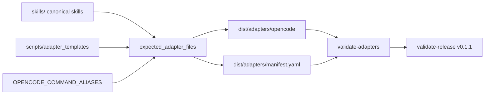

# Skill Invocation Commands for Adapter Packages Architecture

## Status
- archived

## Closeout

- Final disposition: archived/historical snapshot.
- Canonical current architecture: `docs/architecture/system/architecture.md`.
- Merge-back evidence: `docs/changes/2026-04-29-legacy-architecture-lifecycle-normalization/architecture.md`.
- Archive rationale: accepted current OpenCode command-alias, manifest `command_aliases`, generated command wrapper, validation, security, and release-evidence content was merged into the canonical package during legacy architecture normalization. This file preserves the historical skill invocation command design rationale and should not be used as the current architecture source for downstream work.

## Related artifacts

- Proposal: `docs/proposals/2026-04-24-skill-invocation-commands-for-adapters.md`
- Spec: `specs/skill-invocation-commands-for-adapters.md`
- Existing adapter architecture: `docs/architecture/2026-04-24-multi-agent-adapter-distribution.md`
- Existing ADR: `docs/adr/ADR-20260424-generated-adapter-packages.md`
- Project map: none yet

## Summary

RigorLoop should extend the existing generated adapter distribution pipeline with an OpenCode-only command alias layer for the curated lifecycle command set. Canonical skills remain authored under `skills/`, generated adapter packages remain under `dist/adapters/`, and command aliases are deterministic generated prompt wrappers under `dist/adapters/opencode/.opencode/commands/`. The adapter manifest grows a `command_aliases` section that records exact generated command paths, and release verification grows `v0.1.1` support plus command-alias smoke evidence checks.

## Requirements covered

| Requirement IDs | Design area |
| --- | --- |
| `R1`-`R3` | Canonical skill ownership and preserved OpenCode skill output |
| `R4`-`R14` | Curated OpenCode command alias generation and thin wrapper constraints |
| `R15`-`R18`, `R23`-`R27`, `R47` | Drift and validation failure behavior |
| `R19`-`R22` | Manifest `command_aliases` data model |
| `R28`-`R39` | Claude/OpenCode entrypoint and README invocation guidance |
| `R40`-`R44`, `R48` | `v0.1.1` release metadata, release notes, and smoke evidence |
| `R45`-`R46` | Patch-level compatibility and contributor validation boundaries |

## Current architecture context

- `scripts/adapter_distribution.py` owns adapter configuration, manifest rendering/parsing, expected generated file calculation, drift detection, adapter validation, release metadata parsing, release target support, release notes consistency, and security scanning.
- `scripts/build-adapters.py --check` compares `dist/adapters/` against `expected_adapter_files(...)`.
- `scripts/validate-adapters.py --version <version>` validates the generated adapter tree and manifest.
- `scripts/validate-release.py --version <tag>` and `scripts/release-verify.sh <tag>` validate release metadata, notes, generated output, and security.
- `dist/adapters/manifest.yaml` currently records only `version` and `skills`.
- `dist/adapters/opencode/` currently contains `AGENTS.md` and `.opencode/skills/<skill-name>/SKILL.md`.
- `dist/adapters/claude/` currently contains `CLAUDE.md` and `.claude/skills/<skill-name>/SKILL.md`.
- The existing release target registry supports `v0.1.0-rc.1` and `v0.1.0`; `v0.1.1` is not yet represented.

## Proposed architecture

### Repository layout extension

The generated OpenCode package gains command aliases:

```text
dist/
  adapters/
    manifest.yaml
    opencode/
      AGENTS.md
      .opencode/
        commands/
          proposal.md
          proposal-review.md
          spec.md
          spec-review.md
          plan.md
          plan-review.md
          test-spec.md
          implement.md
          code-review.md
          pr.md
        skills/
          <skill-name>/
            SKILL.md
```

The generated Claude package does not gain `.claude/commands/`.

### Component responsibilities and boundaries

| Component | Responsibility |
| --- | --- |
| `skills/` | Canonical skill bodies. Command aliases never become authored behavior. |
| `scripts/adapter_distribution.py` | Curated alias set constant, alias rendering, manifest command metadata rendering/parsing, drift checks, validation, release target support, release-specific smoke/notes checks. |
| `scripts/adapter_templates/opencode/AGENTS.md` | Authored thin OpenCode entrypoint guidance that explains `.opencode/skills/` and `.opencode/commands/`. |
| `scripts/adapter_templates/claude/CLAUDE.md` | Authored thin Claude Code entrypoint guidance that explains native `/skill-name` usage and avoids `.claude/commands/` wrappers. |
| `dist/adapters/opencode/.opencode/commands/` | Generated command alias prompt wrappers for only the curated lifecycle command set. |
| `dist/adapters/manifest.yaml` | Generated support matrix plus exact command alias paths. |
| `docs/releases/v0.1.1/` | Authored release evidence and notes for the patch release. |

### Curated command alias set

The curated set should be a single deterministic source in `scripts/adapter_distribution.py`:

```python
OPENCODE_COMMAND_ALIASES = (
    "proposal",
    "proposal-review",
    "spec",
    "spec-review",
    "plan",
    "plan-review",
    "test-spec",
    "implement",
    "code-review",
    "pr",
)
```

Generation fails or validation fails if a curated alias's matching skill is not included in the OpenCode adapter.

### Command wrapper rendering

Command aliases should be generated by a single renderer rather than by ten authored files. The rendered body should be deterministic and thin:

```text
---
description: Use the RigorLoop <skill-name> skill.
---

Load and follow the `<skill-name>` skill for this request:

$ARGUMENTS
```

The renderer must not include shell interpolation, file interpolation, model overrides, agent overrides, or permission settings.

## Data model and data flow

### Manifest extension

`dist/adapters/manifest.yaml` extends the existing shape:

```yaml
version: 0.1.1
skills:
  proposal:
    portable: true
    adapters: [codex, claude, opencode]
command_aliases:
  opencode:
    count: 10
    aliases:
      proposal: dist/adapters/opencode/.opencode/commands/proposal.md
      proposal-review: dist/adapters/opencode/.opencode/commands/proposal-review.md
      spec: dist/adapters/opencode/.opencode/commands/spec.md
      spec-review: dist/adapters/opencode/.opencode/commands/spec-review.md
      plan: dist/adapters/opencode/.opencode/commands/plan.md
      plan-review: dist/adapters/opencode/.opencode/commands/plan-review.md
      test-spec: dist/adapters/opencode/.opencode/commands/test-spec.md
      implement: dist/adapters/opencode/.opencode/commands/implement.md
      code-review: dist/adapters/opencode/.opencode/commands/code-review.md
      pr: dist/adapters/opencode/.opencode/commands/pr.md
```

The parser should stay repository-owned and constrained. A small typed model such as `CommandAliasSection` can be added to `AdapterManifest`; no third-party YAML dependency is justified.

### Data flow



## Control flow

### Adapter generation

1. Collect and validate canonical skill reports.
2. Render existing adapter entrypoints and skill files.
3. Confirm every curated OpenCode command alias has a matching included OpenCode skill.
4. Render expected command alias files under `opencode/.opencode/commands/`.
5. Render `manifest.yaml` with both skill entries and `command_aliases.opencode`.
6. In write mode, synchronize generated files and remove unexpected files.
7. In check mode, report missing, stale, or unexpected generated files.

### Adapter validation

1. Parse the extended manifest.
2. Validate existing skill inclusion rules.
3. Collect generated OpenCode command files.
4. Compare command files to `command_aliases.opencode.aliases`.
5. Reject missing declared aliases, extra aliases, path/key mismatches, paths outside `dist/adapters/opencode/.opencode/commands/`, aliases for excluded skills, and aliases outside the curated set.
6. Validate each command alias against the deterministic thin wrapper.
7. Run security scans across generated output and templates.

### Release verification

1. Add `v0.1.1` to the release target registry as `final` with manifest version `0.1.1`.
2. Validate `docs/releases/v0.1.1/release.yaml`, `release-notes.md`, generated adapters, manifest, and security.
3. Require final smoke rows to pass, using the existing stable-release smoke rule.
4. For OpenCode, require evidence that a command alias invocation loaded, followed, or produced behavior specific to the matching RigorLoop skill.
5. Allow README and release notes to mention `opencode run --command ...` only when that exact one-shot form is represented in passing smoke evidence.

## Interfaces and contracts

### Adapter generation CLI

The CLI contract remains:

```text
python scripts/build-adapters.py --version 0.1.1
python scripts/build-adapters.py --version 0.1.1 --check
```

The default adapter version should move to `0.1.1` when this feature becomes the current generated package version.

### Adapter validation CLI

```text
python scripts/validate-adapters.py --version 0.1.1
```

The command should fail on manifest command alias mismatch, generated command drift, command alias security violations, and existing adapter-package validation errors.

### Release metadata validation CLI

```text
python scripts/validate-release.py --version v0.1.1
bash scripts/release-verify.sh v0.1.1
```

`v0.1.1` is a stable patch release target, not an RC target.

## Failure modes

- Missing curated skill in OpenCode adapter: generation or validation fails before publishing a dangling command.
- Missing declared command alias file: adapter validation fails with tool, alias, and path.
- Extra command alias file: adapter validation fails with tool, alias, and path.
- Manifest path outside the OpenCode commands root: adapter validation fails.
- Manifest key and command file stem mismatch: adapter validation fails.
- Stale command body: `build-adapters.py --check` and adapter validation fail.
- Command body duplicates a skill body: adapter validation fails by checking against the deterministic wrapper.
- Command body includes unsafe OpenCode interpolation or permission/model settings: security validation fails.
- OpenCode one-shot form is documented without smoke evidence: release validation fails.
- `v0.1.1` release metadata is missing or uses the wrong manifest version: release validation fails.

## Security and privacy design

- Generated command aliases are prompt text only and do not execute shell commands.
- Command aliases pass user input only through `$ARGUMENTS`.
- Command aliases do not include secrets, machine-local paths, model settings, agent settings, or permission changes.
- Existing security scanning should be extended or reused to cover generated command aliases and updated entrypoint templates.
- Smoke evidence in release metadata must summarize results and tool versions only; it must not include credentials, private tool logs, or session tokens.

## Performance and scalability

- Command generation is fixed-size for v1: ten files.
- The validation algorithm is linear in generated command aliases plus generated adapter files.
- Non-smoke validation remains local filesystem validation and does not invoke Claude Code or OpenCode.

## Observability

- Drift and validation errors should include the `opencode` tool slug, command alias name, and generated path.
- Generation output should continue to report the generated adapter root.
- Release verification should surface unsupported release targets and command-alias smoke evidence gaps distinctly from ordinary smoke-row failures.
- Release notes and README expose the supported alias set so users do not need to inspect the manifest.

## Compatibility and migration

- Existing `v0.1.0` adapter package users can continue using `.opencode/skills/` without command aliases.
- `v0.1.1` users can copy the updated OpenCode adapter package to add `.opencode/commands/`.
- The manifest shape is additive; consumers that only read `version` and `skills` can ignore `command_aliases`.
- The release target registry must retain `v0.1.0-rc.1` and `v0.1.0` support while adding `v0.1.1`.
- Rollback before release removes generated commands, manifest command metadata, docs, and release artifacts.
- Rollback after release uses a follow-up patch release or release note; tag history is not rewritten.

## Alternatives considered

### Alternative 1: Generate OpenCode aliases for every portable skill

Rejected because the proposal intentionally limits aliases to the curated lifecycle set. Full skill discovery remains available under `.opencode/skills/`.

### Alternative 2: Generate Claude Code command wrappers too

Rejected because Claude Code already exposes skills as slash commands and `.claude/commands/` wrappers would duplicate or confuse that surface.

### Alternative 3: Record only command alias counts in the manifest

Rejected because counts cannot prove exact generated-path consistency. The spec requires exact command alias paths.

### Alternative 4: Author ten command alias files by hand

Rejected because hand-authored generated behavior would create a second source of truth and reintroduce drift risk.

## ADRs

No new ADR is required for this patch. The existing generated adapter package ADR remains the governing long-lived decision; this design is an additive extension inside that package boundary.

## Risks and mitigations

- Risk: command aliases are mistaken for skill bodies.
  Mitigation: generated alias bodies stay deterministic and thin, and docs state `.opencode/skills/` remains the reusable skill surface.
- Risk: manifest parser complexity grows.
  Mitigation: keep a constrained section shape and typed parser rules for only `command_aliases.opencode`.
- Risk: command smoke proves only file existence.
  Mitigation: release validation and release notes require evidence that the alias loaded or followed the matching skill behavior.
- Risk: docs overclaim one-shot support.
  Mitigation: gate one-shot examples on explicit smoke evidence for that exact form.
- Risk: users expect aliases for every skill.
  Mitigation: README, entrypoints, and release notes list the curated alias set and state that other skills remain available through skill discovery.

## Open questions

None that block execution planning.

## Next artifacts

None for this archived record. Current architecture truth lives in `docs/architecture/system/architecture.md`.

## Follow-on artifacts

- Final disposition: archived/historical snapshot after accepted current content was merged into `docs/architecture/system/architecture.md`.
- Historical scope: skill invocation command design rationale and original patch-release architecture context.

## Readiness

This architecture record is archived as historical evidence.

No current downstream workflow handoff is owned by this artifact. Downstream work should use `docs/architecture/system/architecture.md` as the current architecture source, `specs/skill-invocation-commands-for-adapters.md` for the behavior contract, and `docs/adr/ADR-20260424-generated-adapter-packages.md` for the durable adapter-package decision.
