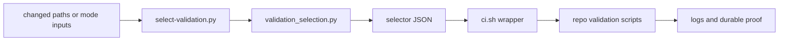

# Test Layering and Change-Scoped Validation Architecture

## Status

- approved

## Related artifacts

- Proposal: `docs/proposals/2026-04-25-test-layering-and-change-scoped-validation.md`
- Spec: `specs/test-layering-and-change-scoped-validation.md`
- Existing workflow contract: `specs/rigorloop-workflow.md`
- Existing workflow summary: `docs/workflows.md`
- Existing validation wrapper: `scripts/ci.sh`
- Project map: none yet

## Summary

RigorLoop should add a small, repository-owned validation selection layer in front of the existing validation scripts. `scripts/select-validation.py` emits JSON-only selection results from a shared Python module, and `scripts/ci.sh` becomes the execution wrapper that consumes those results. The selector owns path classification, stable check IDs, affected roots, broad-smoke trigger detection, and non-fail-open behavior; the existing validators continue to own the actual proof work.

## Requirements covered

| Requirement IDs | Design area |
| --- | --- |
| `R1`-`R2c` | Layered validation model and targeted proof versus broad smoke |
| `R3`-`R5t` | Selector CLI, JSON contract, status enum, exit codes, check catalog, and placeholder substitution |
| `R6`-`R15b` | First-slice path categories, path classification, affected roots, and non-fail-open fallback or blocking behavior |
| `R16`-`R16d` | `scripts/ci.sh` as wrapper and non-recursive broad-smoke execution |
| `R17`-`R20` | Authoritative broad-smoke trigger sources and handoff gates |
| `R21`-`R21n` | Structured manual proof records and closeout behavior |
| `R22`-`R26` | Fixture-driven selector tests, stable check IDs, and actionable failure output |

## Current architecture context

- Repository-owned validation scripts already exist for skills, generated skills, adapter distribution, adapters, change metadata, artifact lifecycle, review artifacts, release metadata, and CI orchestration.
- `scripts/ci.sh` currently runs a fixed broad set of checks and derives some changed-root scope internally for review artifacts and lifecycle artifacts.
- `scripts/validate-artifact-lifecycle.py` already supports explicit paths, local mode, PR CI ranges, and push-to-main ranges.
- `scripts/validate-review-artifacts.py` validates explicit `docs/changes/<change-id>` roots and has a closeout mode.
- `scripts/validate-change-metadata.py` validates one or more `change.yaml` files without third-party YAML dependencies.
- `scripts/build-adapters.py`, `scripts/validate-adapters.py`, and `scripts/validate-release.py` own generated-output and release correctness.
- No current component emits a parseable check-selection result that local runs, hosted CI, and future tooling can share.

## Proposed architecture

### Components

| Component | Responsibility | Ownership |
| --- | --- | --- |
| `scripts/validation_selection.py` | Shared selector domain model, check catalog, path classifier, mode handling, broad-smoke trigger model, JSON rendering | authored |
| `scripts/select-validation.py` | Thin CLI wrapper around `validation_selection.py`; validates args, prints JSON to stdout, maps status to exit code | authored |
| `scripts/test-select-validation.py` | Regression fixtures for path categories, modes, JSON shape, exit codes, unclassified blocking, and future fallback non-execution guards | authored |
| `scripts/ci.sh` | Wrapper that calls the selector, validates selector JSON, executes selected commands, and reports actual commands run | authored |
| Existing validation scripts | Execute the selected checks; no selection ownership | authored |
| Hosted CI workflow | Thin shell around `scripts/ci.sh` with PR, main, or release inputs | authored |
| `docs/changes/<change-id>/verify-report.md` | Durable manual-proof records for normal changes | authored |
| `docs/releases/<version>/release.yaml` | Durable release smoke and release manual-proof source | authored |

### Source-of-truth boundary

The selector owns validation routing. It does not validate skills, adapters, review artifacts, release metadata, or lifecycle artifacts directly.

The check catalog is a repository contract, not a shell-script implementation detail. It should live in Python data in `scripts/validation_selection.py` so selector tests can assert exact check IDs and commands without grepping `scripts/ci.sh`.

`scripts/ci.sh` owns command execution and log formatting. It must not maintain a second path classifier after selector adoption.

### Module shape

The shared selector module should expose small, testable functions:

```python
select_validation(request: SelectionRequest) -> SelectionResult
classify_path(path: str) -> PathClassification
catalog_command(check_id: str, context: CommandContext) -> list[str]
selection_result_to_json(result: SelectionResult) -> str
```

The module should use only the Python standard library. No new dependency is justified for path matching, JSON output, or simple command catalog data.

## Data model and data flow

### Selection request

`SelectionRequest` should contain:

| Field | Purpose |
| --- | --- |
| `mode` | `local`, `explicit`, `pr`, `main`, or `release` |
| `paths` | Explicit changed paths for `local` or `explicit` mode |
| `base` / `head` | Diff range for `pr` and `main` mode |
| `release_version` | Required release target for `release` mode |
| `broad_smoke` | Explicit broad-smoke override |
| `trigger_context_paths` | Optional authoritative artifact paths to inspect for broad-smoke triggers |
| `repo_root` | Repository root for path normalization and Git commands |

Local mode without explicit paths may derive changed paths from both tracked worktree changes and untracked files using Git. This avoids reporting empty targeted proof while authored artifacts are still untracked.

### Selection result JSON

The selector prints JSON with the spec-required top-level fields:

```json
{
  "mode": "local",
  "status": "ok",
  "changed_paths": ["skills/code-review/SKILL.md"],
  "classified_paths": [
    {"path": "skills/code-review/SKILL.md", "category": "skills"}
  ],
  "unclassified_paths": [],
  "selected_checks": [
    {
      "id": "skills.validate",
      "command": "python scripts/validate-skills.py",
      "reason": "Changed canonical skill source requires skill validation."
    }
  ],
  "affected_roots": ["skills/code-review"],
  "broad_smoke_required": false,
  "broad_smoke": {
    "required": false,
    "sources": []
  },
  "blocking_results": [],
  "rationale": ["Changed canonical skill source requires skill validation."]
}
```

The `command` field should be the catalog command string after documented placeholder substitution. For safe execution, the wrapper should rehydrate argv from the trusted catalog and selected check context, or consume an optional argv field that is validated against the catalog. It must not execute arbitrary JSON command strings through `eval`.

### Broad-smoke trigger model

Broad-smoke state should be represented as source-attributed data, not as a bare boolean:

```yaml
broad_smoke:
  required: true
  sources:
    - type: mode
      value: release
    - type: active_plan
      path: docs/plans/<plan>.md
    - type: review_resolution
      path: docs/changes/<change-id>/review-resolution.md
```

`broad_smoke_required` remains the compatibility boolean required by the spec and is derived from `broad_smoke.required`.

The selector should preserve trigger source attribution for all authoritative trigger sources:

| Trigger source | Detection or input path | Output source record |
| --- | --- | --- |
| Selector mode `main` | `--mode main` | `{type: "mode", value: "main"}` |
| Selector mode `release` | `--mode release` | `{type: "mode", value: "release"}` |
| Explicit CLI override | `--broad-smoke` | `{type: "explicit_flag", value: "--broad-smoke"}` |
| Active execution plan | Active plan path supplied by the wrapper, `verify`, or an explicit selector context path | `{type: "active_plan", path: "<plan-path>"}` |
| Test-spec validation requirement | Test spec path supplied by the wrapper, `verify`, or an explicit selector context path | `{type: "test_spec", path: "<test-spec-path>"}` |
| Review-resolution requirement | `review-resolution.md` path supplied by the wrapper, `verify`, or an explicit selector context path | `{type: "review_resolution", path: "<review-resolution-path>"}` |
| Release metadata requirement | Release metadata path derived from `--release-version` or supplied as context | `{type: "release_metadata", path: "docs/releases/<version>/release.yaml"}` |

The selector should not scan the entire repository for possible active artifacts. It should evaluate trigger sources from mode, explicit flags, release version, changed paths, and context paths supplied by the wrapper or handoff stage. This keeps local selection deterministic and prevents broad-smoke requirements from being created by unrelated baseline artifacts.

When `broad_smoke.required` is true, `scripts/ci.sh` selects or executes `broad_smoke.repo` and logs each source record. When a downstream handoff stage such as `verify` finds an authored trigger not present in earlier selector output, it should preserve that authoritative source in the verify evidence and require broad smoke before closeout.

### Check catalog

The selector should encode the v1 catalog with stable IDs, category, command template, and scope requirements:

| Check ID | Command template | Scope inputs |
| --- | --- | --- |
| `skills.validate` | `python scripts/validate-skills.py` | none |
| `skills.regression` | `python scripts/test-skill-validator.py` | none |
| `skills.drift` | `python scripts/build-skills.py --check` | none |
| `adapters.regression` | `python scripts/test-adapter-distribution.py` | none |
| `adapters.drift` | `python scripts/build-adapters.py --version <adapter-version> --check` | adapter version |
| `adapters.validate` | `python scripts/validate-adapters.py --version <adapter-version>` | adapter version |
| `review_artifacts.regression` | `python scripts/test-review-artifact-validator.py` | none |
| `review_artifacts.validate` | `python scripts/validate-review-artifacts.py <change-root>...` | one or more change roots |
| `artifact_lifecycle.regression` | `python scripts/test-artifact-lifecycle-validator.py` | none |
| `artifact_lifecycle.validate` | `python scripts/validate-artifact-lifecycle.py --mode explicit-paths --path <path>...` | one or more touched paths |
| `change_metadata.regression` | `python scripts/test-change-metadata-validator.py` | none |
| `change_metadata.validate` | `python scripts/validate-change-metadata.py <change-yaml>...` | one or more `change.yaml` files |
| `release.validate` | `python scripts/validate-release.py --version <version>` | release version |
| `selector.regression` | `python scripts/test-select-validation.py` | none |
| `broad_smoke.repo` | `bash scripts/ci.sh --mode broad-smoke` | none |

Placeholder values come from selector inputs, inferred paths, or repository defaults. The first implementation can use the same current adapter version default as `scripts/ci.sh`, then move that default into a single release metadata source when a later release-contract change requires it.

### Manual proof model

Manual proof is not selector state. The selector may select or report a check ID that is manual by design, but durable proof ownership belongs to the handoff artifacts.

For normal changes, required manual proof should live in `docs/changes/<change-id>/verify-report.md` using a parseable record shape:

```md
| Check ID | Type | Result | Why manual | Performer | Date | Evidence | Reason | Owner | Follow-up |
|---|---|---|---|---|---|---|---|---|---|
| MP-001 | manual | pass | manual by design: requires live tool UI interaction | maintainer | 2026-04-25 | docs/releases/v0.1.1/smoke.md | n/a | n/a | n/a |
```

For release smoke, the durable manual-proof source is release metadata under `docs/releases/<version>/release.yaml`, including the release smoke matrix and any release-specific allowance for `blocked` or `not-run`.

`verify` owns manual-proof closeout validation. It should read the relevant `verify-report.md` for normal changes and release metadata for release smoke, enforce required fields, reject `fail`, and keep handoff open for `blocked` or `not-run` unless the governing contract explicitly allows that state with rationale, owner, and follow-up.

### Data flow



## Control flow

### Selector CLI flow

1. Parse `--mode` and mode-specific inputs.
2. Resolve changed paths from explicit arguments, local Git state, PR range, main range, or release metadata.
3. Normalize paths to repository-relative POSIX paths and reject paths outside the repository.
4. Classify every path against the first-slice path rules.
5. Add selected checks, affected roots, rationale, and broad-smoke state.
6. If any path is unclassified in v1, return `blocked` with `unclassified-path`.
7. Print JSON to stdout and diagnostics, if any, to stderr.
8. Exit with `0`, `2`, `3`, or `4` according to selector status.

### CI wrapper flow

1. Parse wrapper mode and pass selector-relevant inputs through to `scripts/select-validation.py`.
2. For normal modes, capture selector stdout even when the selector exits with code `2` or `3`.
3. Validate that stdout is parseable JSON with the expected fields.
4. If status is `ok`, execute selected checks in deterministic catalog order.
5. If status is `fallback`, report fallback status and fail unless a later approved architecture defines an exact fallback check set for that mode.
6. If status is `blocked`, fail with the blocking result details and do not run a partial check set.
7. If status is `error` or JSON is malformed, fail without running implicit defaults.
8. Print each command actually run.

### Broad-smoke flow

`bash scripts/ci.sh --mode broad-smoke` is a non-selecting execution mode. It runs the repository-defined broad smoke list directly and must not call the selector in a way that selects `broad_smoke.repo` again.

When normal selector modes select `broad_smoke.repo`, the wrapper executes the non-recursive broad-smoke path.

### Hosted CI flow

Hosted PR CI should call the wrapper in PR mode with base and head SHAs. Main CI should call main mode with the push range. Release automation should keep release verification authoritative, but may call selector release mode to select `release.validate` and any release-required broad smoke.

## Interfaces and contracts

### Selector CLI

```text
python scripts/select-validation.py --mode local --path <path>...
python scripts/select-validation.py --mode explicit --path <path>... [--broad-smoke]
python scripts/select-validation.py --mode pr --base <sha> --head <sha>
python scripts/select-validation.py --mode main --base <sha> --head <sha>
python scripts/select-validation.py --mode release --release-version <version>
```

### Wrapper CLI

`scripts/ci.sh` should support at least:

```text
bash scripts/ci.sh --mode local [--path <path>...]
bash scripts/ci.sh --mode explicit --path <path>... [--broad-smoke]
bash scripts/ci.sh --mode pr --base <sha> --head <sha>
bash scripts/ci.sh --mode main --base <sha> --head <sha>
bash scripts/ci.sh --mode release --release-version <version>
bash scripts/ci.sh --mode broad-smoke
```

Existing direct validation commands remain public contributor commands and should not be removed.

### Path classification contract

The first implementation should classify these paths:

| Path pattern | Category | Selected check IDs |
| --- | --- | --- |
| `skills/**` | `skills` | `skills.validate`, `skills.regression`, `skills.drift`, and adapter drift or validation when public adapter output can be affected |
| `.codex/skills/**` | `generated-skills` | `skills.drift` |
| `dist/adapters/**` | `generated-adapters` | `adapters.regression`, `adapters.drift`, `adapters.validate` |
| `scripts/adapter_distribution.py`, `scripts/build-adapters.py`, `scripts/validate-adapters.py`, adapter templates | `adapters` | `adapters.regression`, `adapters.drift`, `adapters.validate` |
| `docs/changes/<change-id>/change.yaml` | `change-metadata` | `change_metadata.validate`, `change_metadata.regression` |
| `docs/changes/<change-id>/reviews/**`, `review-log.md`, `review-resolution.md` | `review-artifacts` | `review_artifacts.validate` scoped to `docs/changes/<change-id>/` |
| Recognized lifecycle artifacts under `docs/proposals/`, `specs/`, `docs/architecture/`, `docs/adr/`, `docs/plans/`, and `docs/explain/` | `lifecycle` | `artifact_lifecycle.validate` scoped to touched paths |
| `docs/releases/<version>/**` | `release` | `release.validate` scoped to inferred version |
| `scripts/select-validation.py`, `scripts/validation_selection.py`, `scripts/test-select-validation.py` | `selector` | `selector.regression` |
| Existing validator scripts | matching validator category | matching regression check when one exists |
| `docs/workflows.md`, `AGENTS.md`, `CONSTITUTION.md`, `templates/**`, `schemas/**` | `workflow-guidance` or `governance` | deterministic contract checks when available, otherwise `unclassified-path` blocking manual routing rather than empty proof |

For recognized `docs/changes/<change-id>/` files that are not review artifacts or `change.yaml`, the selector should either route to an existing lifecycle or change-local check when the filename is supported, or block with a manual-routing result. It must not silently ignore the file.

## Failure modes

- Missing mode-specific arguments: selector returns `error` and exit code `4`.
- Empty changed path set without a valid release context: selector returns `blocked` and exit code `2`.
- Path outside repository: selector returns `blocked` or `error`, depending on whether it is a user input error or classifier result.
- Unclassified path: selector returns `blocked` with `unclassified-path`.
- Mixed classified and unclassified paths: selector reports both and must not run only classified targeted proof.
- Missing release version for release validation: selector blocks unless a safe version can be inferred.
- Placeholder cannot be substituted: selector returns `error` before emitting an executable selected check.
- Malformed selector JSON: `scripts/ci.sh` fails instead of running defaults.
- Selected command missing from the workspace: `scripts/ci.sh` fails and identifies the check ID and command.
- Selected command fails: `scripts/ci.sh` preserves the command output and exits non-zero.
- Broad-smoke recursion risk: `scripts/ci.sh --mode broad-smoke` bypasses selector selection.
- Manual proof missing or failed: `verify` keeps downstream `explain-change` and `pr` blocked according to the governing contract.

## Security and privacy design

- Selector output must contain repository-relative paths, not absolute machine-local paths.
- The selector must not print secrets, credentials, tokens, private keys, or private tool output.
- The wrapper should execute commands as argument arrays, not via `eval` or shell string interpolation.
- Placeholder substitution is limited to known values such as version, adapter version, changed paths, change roots, and release versions.
- The selector must reject or normalize paths that escape the repository root.
- The selector must not weaken release security checks or generated-output drift checks when targeting smaller proof.

## Performance and scalability

- Selector execution should be fast and should not run validation commands.
- Local and PR mode path resolution should call Git once per changed-path source.
- Classification is linear in the number of changed paths.
- Duplicate selected checks should be deduplicated while preserving deterministic catalog order.
- Broad smoke remains available for handoff, main, release, and triggered contexts without making every local run pay its cost.

## Observability

- Selector stdout is JSON and stable for machine consumers.
- Human-readable diagnostics should go to stderr so stdout remains parseable.
- `scripts/ci.sh` logs selector mode, selector status, selected check IDs, affected roots, and every command run.
- Blocking results include mode, affected path or root, code, message, and rationale when available.
- If a future selector emits `fallback`, wrapper output clearly names that fallback validation was selected because classification was incomplete before failing or executing the later-defined fallback set.
- Broad-smoke-required output names every trigger source that caused broad smoke.
- Manual proof records remain durable in `verify-report.md` for normal changes and release metadata for release smoke, not only in CI logs.

## Compatibility and migration

Adoption should be staged:

1. Add `validation_selection.py`, `select-validation.py`, and `test-select-validation.py` while leaving direct validation commands intact.
2. Teach `scripts/ci.sh` to consume selector output for normal modes and preserve a non-recursive `--mode broad-smoke`.
3. Preserve existing direct validator CLIs and wrapper behavior needed by contributors during migration.
4. Update hosted CI to call `scripts/ci.sh` with PR, main, or release mode rather than embedding selection logic in workflow YAML.
5. Update workflow docs and stage skills only when their canonical guidance changes; regenerate skill outputs if canonical adapter-shipped skills change.

Rollback is to direct explicit validation commands and the previous broad wrapper behavior while selector rules are repaired. Rollback must not remove the spec requirement that unknown paths cannot fail open once the selector is active.

The v1 fallback decision is intentionally conservative: unclassified paths always block with `unclassified-path`. The `fallback` status remains part of the spec interface, but this architecture does not implement conservative fallback until a later approved change defines the exact fallback check set and version-inference behavior.

## Alternatives considered

### Keep selection inside `scripts/ci.sh`

This avoids a new Python module, but it makes selection logic harder to test, encourages brittle shell-string tests, and keeps local, PR, and future tooling coupled to one wrapper implementation.

### Make hosted CI always run broad smoke

This is safe but does not solve the project problem. It keeps broad validation as the first proof step and does not give contributors a local, reviewable targeted-proof contract.

### Add a general dependency graph

A dependency graph could eventually select narrower proof, but it is unnecessary for the repository-governance and artifact-centric first slice. Path-based selection is simpler, more reviewable, and aligned with the current validation surfaces.

## ADRs

No separate ADR is required for this slice. The long-lived decision is the spec-approved contract that the selector is the validation-routing source of truth and `scripts/ci.sh` is the wrapper. This architecture records the implementation shape for that decision.

## Risks and mitigations

- Risk: selector misses a path and skips proof. Mitigation: unknown paths block with `unclassified-path`; fixture coverage includes unclassified paths.
- Risk: `ci.sh` and selector diverge. Mitigation: remove path classification from `ci.sh` after adoption and test wrapper consumption of selector JSON.
- Risk: fallback becomes too expensive and recreates broad-first behavior. Mitigation: do not implement fallback in v1; unclassified paths block until routed explicitly.
- Risk: broad-smoke command recurses. Mitigation: implement `--mode broad-smoke` as a non-selecting wrapper path.
- Risk: examples drift from stable check IDs. Mitigation: selector tests assert check IDs from the v1 catalog.
- Risk: manual proof remains loose prose. Mitigation: store normal manual proof in `verify-report.md`, release smoke proof in release metadata, and make `verify` own manual-proof closeout validation.

## Open questions

None.

## Next artifacts

- `docs/plans/2026-04-25-test-layering-and-change-scoped-validation.md`
- `plan-review`
- `specs/test-layering-and-change-scoped-validation.test.md`
- Implementation after plan-review and test-spec

## Follow-on artifacts

- `docs/changes/2026-04-25-test-layering-and-change-scoped-validation/reviews/architecture-review-r1.md`
- `docs/changes/2026-04-25-test-layering-and-change-scoped-validation/reviews/architecture-review-r2.md`
- `docs/changes/2026-04-25-test-layering-and-change-scoped-validation/review-resolution.md`
- `docs/plans/2026-04-25-test-layering-and-change-scoped-validation.md`

## Readiness

Approved by `architecture-review-r2`. The execution plan is active and ready for `plan-review`; the test spec should be created after plan-review before implementation.
