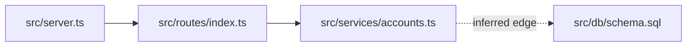

# Representative Project-Map Outputs

Change: `2026-06-23-evidence-bound-incremental-project-map`

Milestone: M3. Representative Output and Preservation Evidence

Status: representative evidence recorded

Representative fixture excerpts, not claims about this repository.

## Scope

These excerpts prove the first-slice output behavior that is most likely to drift:
metadata, freshness, evidence labels, command auditability, root and area map
registration, current-versus-planned handling, correction notes, and placeholder
removal.

They are deliberately small excerpts rather than a project-map artifact validator.

## Root Map Excerpt

### Map metadata

- Map status: current
- Scope: repository
- Baseline: abc1234+dirty
- Last reviewed: 2026-06-23
- Coverage: `package.json`, `src/server.ts`, `src/routes/index.ts`, `src/db/schema.sql`, `.github/workflows/ci.yml`
- Exclusions: `docs/archive/`, because it is historical material outside the mapped runtime scope
- Parent map: not-applicable
- Known gaps: none
- Inspected uncommitted paths: `src/server.ts`, `.github/workflows/ci.yml`

## Map metadata

The representative root map records the baseline, dirty working-tree state, inspected uncommitted paths, coverage, exclusions, parent-map status, and known gaps before describing architecture.

## Purpose and scope

Observed: this root map orients the repository runtime and test surfaces using `package.json`, `src/server.ts`, `src/routes/index.ts`, `src/db/schema.sql`, and `.github/workflows/ci.yml`.

Incidental note: file names are shown only to make the excerpt readable. The material claim above cites the inspected paths that support the current-state summary.

## System overview

Observed: `src/server.ts` creates the HTTP server and imports route registration from `src/routes/index.ts`.

Inference: `src/services/` appears to contain application services because `src/routes/index.ts` delegates request handling into `src/services/accounts.ts`, but no explicit repository rule declares that boundary.

Planned state: `docs/proposals/2026-06-20-service-split.md` describes a future `services/billing` deployment.

Current state: no inspected source path defines a deployed `services/billing` service, so that proposal is not represented as deployed or current implementation.

## Repository layout

Observed: `src/db/schema.sql` is the inspected schema source for account records, and `.github/workflows/ci.yml` is the inspected CI workflow.

Not observed in the mapped scope. The fixture has no separate `infra/` directory; deployment ownership is therefore not inferred from directory names.

## Runtime flow

Runtime-flow evidence: statically traced from `src/server.ts` to `src/routes/index.ts` and then to `src/services/accounts.ts`.

Observed: request routing starts in `src/server.ts` and reaches account handlers through `src/routes/index.ts`.

Diagram evidence: `src/server.ts`, `src/routes/index.ts`, and `src/services/accounts.ts`.

The dashed edge is an inferred edge because static inspection showed account-service database access, but the fixture did not execute a runtime request.

## Data flow

Data-flow evidence: demonstrated by tests in `tests/accounts.test.ts` for account creation, and partially inferred for schema persistence from `src/services/accounts.ts` to `src/db/schema.sql`.

Observed: `tests/accounts.test.ts` covers account creation through the route layer.

Inference: account persistence appears to use the schema in `src/db/schema.sql`; runtime database writes were not observed.

## External boundaries

Observed: `src/services/email.ts` imports `@vendor/mail`, so email delivery is an external integration boundary.

Unknown: no inspected file identifies the production email provider credentials or deployment environment. Record this under Open questions rather than guessing.

## Test map

Configured command, not executed in this mapping session: `npm test`, found in `package.json`.

Executed command: `git rev-parse --short HEAD`

Exit code: 0

Result: command execution proved only the baseline lookup. It did not prove the test suite passes.

## CI and release map

Observed: `.github/workflows/ci.yml` configures install and test jobs for pull requests.

Configured command, not executed in this mapping session: `npm ci`, found in `.github/workflows/ci.yml`.

## Architecture rules observed

Observed instance: `src/routes/index.ts` delegates account work to `src/services/accounts.ts`.

Inference: route modules appear to avoid direct schema writes in the inspected fixture paths, but this is not a repository-wide rule because only one route area was inspected.

## Risk areas

Risk: email delivery configuration is an external boundary with unknown production credentials; evidence is limited to `src/services/email.ts`.

Risk routing: this is orientation evidence only. It is not an approved backlog item, plan task, review resolution, or follow-up commitment.

## Open questions

Unknown: which deployment environment supplies email credentials is not shown by `src/services/email.ts`, `.env.example`, or `.github/workflows/ci.yml` in the inspected fixture.

## Area maps

| Area | Map | Scope | Baseline | Freshness | Known gaps |
| --- | --- | --- | --- | --- | --- |
| API service | `docs/project-map/api.md` | `src/server.ts`, `src/routes/`, `src/services/` | abc1234+dirty | current | none |

## Area Map Excerpt

### Map metadata

- Map status: current
- Scope: area:api
- Baseline: abc1234+dirty
- Last reviewed: 2026-06-23
- Coverage: `src/server.ts`, `src/routes/`, `src/services/`, `tests/accounts.test.ts`
- Exclusions: `src/db/schema.sql`, owned in the root data-flow summary
- Parent map: docs/project-map.md
- Known gaps: none
- Inspected uncommitted paths: `src/server.ts`

Durable-boundary rationale: the API area has its own runtime entry point in `src/server.ts`, route surface in `src/routes/`, service surface in `src/services/`, and focused tests in `tests/accounts.test.ts`.

Overlap owner: the area map owns detailed API runtime flow; the root map links to it and keeps only repository-level flow and data summaries.

Contradiction handling: if the root map and `docs/project-map/api.md` disagree about route ownership, the refresh result is blocked until one description is corrected.

## Stale and Correction Excerpt

### Stale case

- Map status: stale
- Scope: repository
- Baseline: def5678
- Last reviewed: 2026-06-23
- Coverage: `src/server.ts`, `src/routes/index.ts`
- Exclusions: none
- Parent map: not-applicable
- Known gaps: `src/routes/index.ts` was removed after the cited baseline

Freshness result: stale, because a cited route registration path no longer exists.

### Wrong-at-baseline case

Correction note: the previous map was wrong at the previous baseline when it said `src/routes/index.ts` registered billing routes. The inspected file only registered account routes.

Corrected current-state claim: `src/routes/index.ts` registered account routes only.

Evidence: `src/routes/index.ts`, `tests/accounts.test.ts`.

Prior reliance risk: downstream work that relied on billing route registration from that map section was unsafe, even if no later repository change caused the mismatch.

## Placeholder Audit

Placeholder audit: passed.

The representative excerpts contain concrete fixture values for metadata, paths, baselines, statuses, commands, and evidence. They do not intentionally leave fill fields behind.
