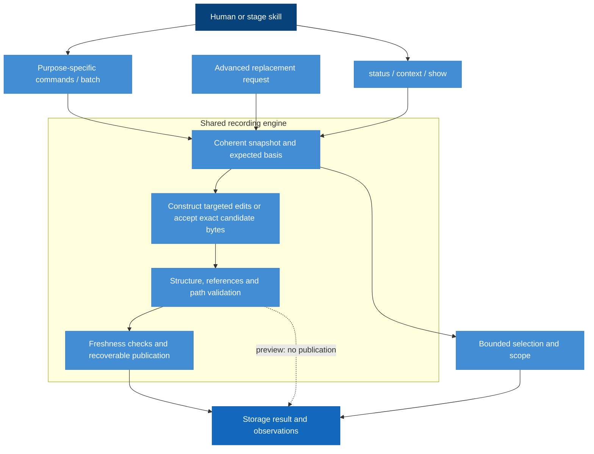

# CLI Model Design

Model validation contract: explicit-recording-v1

## Introduction and Goals

Make the CLI a small repository-local tool that reads records, reports observations, validates explicit updates and persists them safely. The user or agent supplies status and decisions. The CLI never chooses a stage or turns another edit into a workflow decision.

Simplicity means removing semantic transition orchestration, not removing schema validation, concurrency protection or recovery. A lifecycle may need human judgment; safely writing bytes must not require the lifecycle first to become semantically complete.

### Design at a glance

The CLI turns an actor's explicit decision into a safely stored update. Humans and skills use purpose-specific commands; one shared recording engine constructs candidates, checks structure and identities, and publishes recoverable changes. Read commands expose recorded information and observations with a stated scope.

| Reader question | Start here |
| --- | --- |
| Which command serves my task? | [Public command catalogue](#primary-public-command-contract) |
| What do I submit? | [Targeted requests and operations](#targeted-request-and-operation-definitions) |
| What does a query return or omit? | [Bounded queries](#bounded-queries-and-scope) |
| What does a save or preview mean? | [Primary results](#primary-result-schema-diagnostics-and-preview) |
| How are neighboring content, conflicts and recovery handled? | [Candidate construction](#lossless-candidate-construction-and-shared-engine), [retry](#batch-composition-no-op-and-retry) and [save safety](#save-safety-and-recovery-boundary) |
| How does this interact with workflow decisions? | [Correction walkthrough](#correction-walkthrough-recording-behavior) and the [Workflow model](workflow.md) |
| Where is the maintenance interface? | [Advanced requests](#advanced-candidate-update-contract) and [advanced results](#advanced-result-schema-and-exit-behavior) |

## Context and Scope

The CLI receives an exact change target, explicit decisions expressed as targeted operations, and expected current identities from an actor. It returns stored content, observations or a persistence result. The Workflow model interprets that result and decides what to do next. Filesystem permissions and runtime restrictions bound execution; the CLI cannot grant external permissions.

The primary public surface is `status`, `context`, purpose-specific `show` and mutation commands, and `batch`. The existing `record-store inspect|check|record|recover` surface remains advanced tooling with its v1 request/result contract. Historical semantic command handlers and installation/release commands retain their separate meanings; no alias dispatches a targeted command into their eligibility engines.

### Model boundary

| Concern | Owning model | This model's relationship |
| --- | --- | --- |
| Meaning of activity, work, findings, blockers, judgments and applicability | [Workflow](workflow.md#context-and-scope) | Accept and preserve explicitly supplied values |
| Record types, relationships and decision ownership | [Workflow record model](workflow.md#record-model) | Consume the stored-record contract |
| Command syntax, request/result shapes and bounded selection | CLI | Define the public interface |
| Encoding, byte preservation, identities, publication and recovery | CLI | Define and enforce mechanical storage safety |
| Adequacy of evidence and justified progression | Workflow | Return observations without making those decisions |

### Contract names and versions

The public documentation calls stored data the **RigorLoop Record Format**. Its existing identifier remains unchanged; this presentation introduces no new format or migration. A transport version describes an interface envelope, while the stored contract identifies persisted record meaning.

| Surface | Existing or designed discriminator | Contract owner |
| --- | --- | --- |
| Stored records | `contract: explicit-recording-v1` on the change; `schema_version: 1` on each record | Workflow owns fields/meaning; CLI owns encoding and safety |
| Primary targeted requests | `interface: targeted-recording-v1`, `schema_version: 1` | CLI targeted request definitions |
| Primary query/mutation results | `interface: targeted-recording-v1`, `schema_version: 2` | CLI primary result definitions |
| Advanced record-store requests/results | `schema_version: 1`; request also names the stored contract | CLI advanced definitions |

The existing [machine-readable schema](../../schemas/explicit-recording-v1.schema.json) includes stored types and advanced transport definitions. It does not yet implement the designed targeted request/result schemas. Schema linkage is structural evidence, not a claim that the primary commands are published or implemented.

## Architecture Constraints

Use exact local identities and explicit paths. Do not require Git, PR access, network services or a daemon. Data safety is enforced mechanically; workflow authority is not inferred from a caller's role string. Never use the new recorder as an implicit interpreter for an old contract.

The existing record-store foundation is the shared persistence boundary. Targeted commands construct candidates and enter its validation and transaction path; they do not delegate to the compact eligibility engine. Reuse is subject to preservation, conflict and recovery proof, not inferred from module names. No project-map inference is used: the proposed boundary is grounded in the proposal, governance and directly inspected persistence surface.

## Solution Strategy

Separate structural validation from workflow diagnosis and separate both from persistence. A targeted adapter constructs complete candidate bytes from explicitly named edits against one coherent snapshot. Advanced `record-store record` instead accepts exact complete bytes. Both feed one structural validator, identity checker and recoverable publisher; neither invokes advance-stage, settle-review or reopen-owner semantics. The CLI may generate content hashes, storage revisions and transaction bookkeeping, but all substantive status values come from submitted records.

An old reviewed-subject hash is a legitimate reference to what was reviewed, not a foreign key that must equal today's file hash. Observed drift must be visible without making it impossible to save the correction that addresses it.

## Requirements

| ID | Required behavior |
| --- | --- |
| CLI-SR-01 | Inspect MUST return recorded values and separately labeled observations without altering authoritative records or performing recovery. It MUST NOT compute an authoritative next stage, approval, completion or applicability value. |
| CLI-SR-02 | Check and record MUST reject malformed records, unknown schema versions, unknown closed-vocabulary values, duplicate identities, dangling internal record references and unsafe targets before any authoritative write. Validity MUST NOT depend on whether the current workflow stage permits a proposed decision. |
| CLI-SR-03 | Every write MUST identify the expected revision, expected identities and exact target set. Primary commands MUST construct complete candidates from targeted actor-supplied edits; advanced record MUST accept complete explicit replacements. Unnamed files and omitted workflow decisions MUST remain unchanged. It MUST NOT merge stale decisions, fill semantic defaults or rewrite an old review to claim it assessed new content. |
| CLI-SR-04 | An update MUST exclude competing CLI writers and check expected revision, target identities and declared decision-basis identities before publication. Observed mismatches reject the update with a conflict; the caller must reread and decide again. External edits are covered at the observed checks, not atomically with replacement; the Save safety and recovery boundary applies. |
| CLI-SR-05 | Related replacements MUST be published as one logical transaction. Supported readers MUST receive a coherent before/after snapshot or an explicit busy/recovery-required result, never a mixed snapshot presented as usable current state. A successful result means all requested bytes are durably committed. |
| CLI-SR-06 | Interrupted writes MUST preserve sufficient local recovery information to restore a verified before-state or complete the exact prepared candidate. Recovery MUST NOT generate new workflow decisions and MUST stop when a target check observes bytes matching neither recorded state. Missing or tampered recovery evidence requires a reported recovery stop, not guessed repair. The same external-edit boundary applies to record and recovery. |
| CLI-SR-07 | Workflow observations, including changed review subjects, failed proof or contradictory readiness claims, MUST remain separate from structural rejection and saved content. They MUST NOT silently alter decisions or prohibit recording a structurally sound blocker, invalidation or correction. A successful record result MUST explicitly limit its claim to persistence. |
| CLI-SR-08 | Repeated submission MUST NOT duplicate findings or apply incremental semantic effects. The engine persists explicit candidate bytes; a lost-response retry with an old revision MUST conflict, including when the first write succeeded. No operation may duplicate an entry or increment semantic state on retry. It MUST NOT imply that the workflow action was newly approved. |
| CLI-SR-09 | All public, helper and recovery write paths MUST use the same containment, identity and transaction protections. Cross-change writes, path traversal, symlink escape and unexpected overwrite are rejected. This interface MUST NOT offer arbitrary repository file writes disguised as workflow updates. |
| CLI-SR-10 | Unsupported or historical lifecycle contracts MUST be identified explicitly and MUST NOT be silently rewritten using this recording contract. An adoption mechanism requires its own approved exact mapping and recovery contract. Ordinary inspect, check and record MUST NOT migrate data. |
| CLI-SR-11 | Results MUST distinguish saved, unchanged, rejected, conflict, busy and recovery-required outcomes, name affected identities where available, and separate observations from errors. Errors MUST NOT echo arbitrary record payloads or secrets. Human and machine-readable forms must preserve the same outcome meaning. |
| CLI-SR-12 | Purpose-specific writes and batch MUST use the same closed targeted-operation definitions and shared snapshot, validation, identity, publication and recovery path. Missing semantic inputs MUST reject with named required fields, never invented decisions. Ordinary skills MUST NOT reconstruct complete files. |
| CLI-SR-13 | Candidate construction MUST preserve omitted fields, entries, review subjects and unrelated narrative bytes. Only explicitly selected values and necessary syntax/registry bookkeeping may change; unchanged values MUST not trigger formatting rewrites. |
| CLI-SR-14 | Status, context and show MUST expose their exact selection, revision, returned/total counts, omission and continuation information. They MUST NOT infer relevance, readiness, approval or a next activity from selection or absent observations. |
| CLI-SR-15 | Batch MUST contain a bounded set of the same targeted operations, construct and validate one combined candidate and publish all or none. Conflicting overlapping edits MUST reject; intermediate structural incompleteness MUST NOT require simultaneous actor decisions. |
| CLI-SR-16 | Every targeted mutation MUST validate during normal execution and support a non-writing preview. Preview MUST make no reservation, return no saved claim and require the actual write to repeat freshness checks. |
| CLI-SR-17 | Public query/mutation JSON MUST be versioned and compact by default, with text conveying identical scope and storage-only meaning. Per-command help MUST disclose only that operation's input contract and common safety fields. |
| CLI-SR-18 | Adoption MUST coordinate runtime, consuming skills/resources, examples, schemas, validation and supported adapters. Existing persisted explicit-recording-v1 records MUST remain readable without migration; historical contracts and advanced v1 behavior MUST retain their identity and safety boundaries. |

## Building Block View

The decoder recognizes the selected contract and bounded record kinds. The structural validator checks only data representation and integrity. The snapshot reader and transaction layer coordinate access to authoritative files. The observer reports factual differences without selecting decisions. The renderer makes the distinction visible to humans and agents.

The diagram shows responsibilities and alternative read/write paths, not an instruction to execute every edge. Queries stop at projection; previews stop after candidate validation; actual writes use the shared publisher. Detailed exclusion, rechecking and recovery obligations remain in the sections below.

### Primary public command contract

CLI-SR-12 through CLI-SR-18 refine CLI-SR-01 through CLI-SR-11. The actor supplies the decision; the command records that decision and handles necessary bookkeeping without making additional workflow decisions. All commands require one `--root PATH` and one `--change ID`; neither is inferred. `--format json|text` defaults to text. Write input is UTF-8 JSON via required `--input -`; no arbitrary patch, file path input, shell expression or `--force` is supported. `--dry-run` is accepted once by every primary mutation, including creation and batch. It is not accepted by queries. Unknown or duplicate flags and extra positionals reject before filesystem access or stdin consumption. `--help` alone after a recognized command prints its bounded schema, required selectors, examples and storage-only limit without reading the repository.

| Public invocation after `rigorloop` | Input operation / selection |
| --- | --- |
| `status` | Recorded activity plus aggregate work/blocker/finding/proof counts; no input body |
| `context --for SKILL` | A static skill-specific starting projection defined below; no input body |
| `work show ID`, `review show ID`, `blocker show ID`, `evidence show ID`, `decision show ID` | Exact entry, check, decision or review ID in the selected change |
| `finding show ID --review REVIEW-ID` | Exact finding scoped to one review; never search for a matching ID across reviews |
| `change create`, `change link`, `activity set` | `change.create`, `change.link`, `activity.set` respectively |
| `work add`, `work set`, `review record` | `work.add`, `work.set`, `review.record` |
| `finding add`, `finding set`, `blocker add`, `blocker set` | Same dot-separated operation names |
| `evidence record`, `applicability set`, `decision record`, `verify record` | Same dot-separated operation names |
| `batch` | One explicit list of targeted operations; no replacement-file or generic patch entries |

Creation/link are the two deliberate administrative verbs beyond show/add/set/record. There are no independent start/pause/resume/reopen/complete aliases. `next`, `advance`, `auto-approve`, `auto-resolve`, `complete-if-ready` and bare `verify` are not recording commands. Any preexisting unrelated command family keeps its separate dispatch; duplicate public command names must be reconciled explicitly before adoption, never resolved by falling through to an eligibility handler.

### Targeted request and operation definitions

A single mutation has exactly `{schema_version: 1, interface: "targeted-recording-v1", contract: "explicit-recording-v1", change_id, expected_revision, reads, operation}`. A batch replaces `operation` with `operations`, a nonempty array of at most 64 operations. `reads` retains the advanced `{path, expected_identity}` shape and limits. Expected revision is a digest, or null only for `change.create`. Every operation has exactly `{op, target, values}` plus optional `registration` only for the four supporting-record producers defined below. Command and `op` must agree; batch admits only the closed mutation catalogue. CLI and input change IDs must agree. Creation is a standalone command, excluded from batch; it is followed by independently requested operations once its actual revision is known.

All nested values use Workflow's closed schema and vocabularies. A target is an exact object from the table, never a glob, array offset, free-form JSON pointer or inferred owner. `set` requires an existing entry and a nonempty subset of its listed mutable fields; explicit null is legal only where the stored schema permits it and never means deletion. `add` requires absence. `record` creates an absent selected entry or replaces only that entry's fully supplied decision fields. A duplicate add at a current revision rejects with `target-exists`; a missing set target rejects with `target-not-found`. There is no delete operation or bulk implicit clearing.

| Operation | Exact target | Values and allowed effect |
| --- | --- | --- |
| `change.create` | `{}` | Exactly `proposal`, `models`, `activity`, `plan`, `work`, `blockers` from Workflow's change schema, including explicit empty arrays/null where intended. CLI supplies only schema/contract/change identity and initially empty registry/applicability arrays; supporting records are not created. |
| `change.link` | `{kind: "proposal"}` or `{kind: "plan"}` or `{kind: "model", id}` | Exactly `{subject: Subject}`. Replace that proposal/plan reference; append an absent model ID or replace that model's subject. No unlink or model rename. Does not change applicability or historical reviews. |
| `activity.set` | `{}` | Exactly `{stage, status, owner, reason}`. Replace only the activity value, without changing work, applicability or Verify. |
| `work.add` | `{id}` | Exactly `{status, owner, requirement_refs}`; the CLI inserts the target ID. No status/default owner is inferred. |
| `work.set` | `{id}` | Nonempty subset of `status`, `owner`, `requirement_refs`; replace selected fields only. |
| `review.record` | `{id}` | Exactly `{target, reviewer, contributors, independence_basis, subjects, judgment, body}`. Every assessment is complete and explicit, including narrative rationale. Creates metadata with an empty findings collection when absent; on an existing review preserves all findings and replaces only supplied assessment/body fields. Findings require separate explicit operations. |
| `finding.add` | `{review, id}` | All Blocker fields except `id`; inserted into that existing review. State and resolution are explicit. No review is fabricated. |
| `finding.set` | `{review, id}` | Nonempty subset of Blocker fields other than `id`; state/resolution changes must supply both. Review judgment, assessment and narrative remain unchanged. |
| `blocker.add` | `{id}` | All Blocker fields except `id`; inserted into change-level blockers. |
| `blocker.set` | `{id}` | Same field rules as finding.set, scoped to change-level blockers. |
| `evidence.record` | `{id}` | Exactly `{actor, subjects, result, procedure, summary}` for that check. Preserve all other checks. |
| `applicability.set` | `{path}` | Exactly `{value, actor, reason}` for an already registered supporting record. Path is not a check/finding selector. |
| `decision.record` | `{id}` | Exactly `{actor, subjects, rationale, source_refs}` for that material decision; preserve all other decisions. |
| `verify.record` | `{}` | Exactly `{verifier, subjects, evidence_refs, review_refs, outcome: "success", body}` for the success report. Does not set activity completion. |

For `review.record`, `evidence.record`, `decision.record` or `verify.record` that creates a supporting file, `registration` is required and has exactly `{applicability: {value, actor, reason}, body}` for a decisions file, or `{applicability: {value, actor, reason}}` for the other kinds. `body` is the actor's nonempty initial Markdown narrative; review/Verify bodies come from their values. Registry path/kind and common metadata are mechanical consequences of the exact operation target. The command must not choose applicability. On an existing supporting file, `registration` is forbidden; change applicability only through an explicit `applicability.set`, optionally in the same batch. A batch creating a shared evidence/decisions file has exactly one registration declaration on its first operation for that file; later entries in that batch omit it. Supporting-file creation means both registry membership and the file are absent. A registered missing file is not a new empty collection: primary mutations targeting it reject with broken-reference and a missing-content observation, rather than synthesizing missing neighbors. Explicit reconstruction of a lost whole record remains an advanced repair operation with known replacement content and normal absent-file/conflict preconditions. An unregistered existing file is an unexpected overwrite and rejects; it is never imported automatically. An empty new collection is representation bookkeeping, not an assertion that the actor assessed the absence of defects.

For existing material-decisions narrative, `decision.record` optionally accepts `body` in values only when the actor explicitly wants to replace that whole narrative; omission preserves its bytes. This exception does not add a body field to individual decision metadata. There is no implicit synthesis of review rationale, decision narrative, Verify explanation, status, applicability, ownership, disposition or evidence results. Missing required values return `missing-input` with typed field locations; commands never prompt interactively or infer them. Unknown fields reject before consistency checks. No command supplies another actor's decisions merely to satisfy structural validation.

The common expected revision covers the manifest and all registered records, so callers need not repeat neighboring record hashes. The adapter resolves exact affected file identities from that same verified snapshot and passes them to the shared engine. `reads` carries current expected identities for the externally selected decision basis; subject identities inside historical records remain assertions about assessed content and are never substituted with newly computed hashes. `change.link` additionally requires its supplied subject identity as an equal read-set expectation. Other subject-bearing commands retain the ability to record historical or incomplete evidence; the actor explicitly declares the current basis it actually relied on. The CLI computes identities, not the adequacy of that basis.

### Bounded queries and scope

Primary queries read one coherent full registered snapshot internally to establish its revision and structural observations; output is bounded, not falsely claimed to be a partial storage read. They never scan directories for authority or repair files. `status` returns recorded `activity`, `proposal`, `models`, `plan` and counts grouped by explicit work status, blocker/finding state, review judgment and evidence result. Counts distinguish records missing from the snapshot, and are counts of stored labels rather than a readiness calculation. Full record content is available through the explicit advanced inspect path.

`context --for SKILL` accepts exactly the published stage/support names `proposal`, `proposal-review`, `architecture`, `spec`, `design-review`, `plan`, `delivery-review`, `implement`, `code-review`, `verify`, `route`, `bugfix`, `ci-maintenance`, `research`, `explore`, `learn`, `pr`, `project-map`, `vision`, `constitution`. Unknown skills reject; a new profile requires a reviewed interface change. A profile chooses a deterministic starting projection, not relevant evidence or the next skill. All contexts include the same change header as status and aggregate counts, full recorded subject references and registry/applicability identities, including the identities of omitted supporting records. Entries are selected by the following static table; none is filtered by inferred owner, readiness, judgment quality or applicability.

| Profile | Entry collections selected |
| --- | --- |
| `route`, `verify`, `pr` | All work, blockers, findings, reviews, evidence and decisions |
| `proposal-review`, `design-review`, `delivery-review`, `code-review` | All work, blockers, findings, reviews, evidence and decisions |
| All other recognized profiles | All work, blockers, findings and review summaries; evidence and decision collections are explicitly omitted |

A context item is `{kind, target, path, identity, fields}`. Work fields are status, owner and requirement_refs; blocker/finding fields are reporter, owner, subjects, state and required_outcome; review fields are target, reviewer, contributors, subjects and judgment; evidence fields are actor, subjects and result; decision fields are actor, subjects and source_refs. Narrative evidence, procedures, rationales, resolutions and Markdown bodies are not returned by context; its scope lists those omissions. `show` returns the exact selected object's full structured fields, plus a body for reviews. Singleton supporting files are addressed through their entries; advanced inspect remains available for complete Verify or decisions narrative. Missing targets return `target-not-found`, distinct from empty collections; a registered missing file is reported with null identity and a missing-content observation and is never presented as an empty set of findings/checks.

The nested query schema is closed. `Header` is exactly `{change_identity, activity, proposal, models, plan, counts, registry}`. The first field is the manifest byte digest; activity/proposal/models/plan retain Workflow's exact types. `counts` is exactly `{work, blockers, findings, reviews, evidence, decisions}`. Each member is `CountGroup = {known_total, total, by_value, missing_paths}`: known_total is a nonnegative integer counting readable entries, total is that integer when all contributing registered files are readable and null otherwise, and missing_paths is a sorted unique path array. `by_value` contains every admitted label with a nonnegative known count, including zero: work uses Workflow status labels; blockers/findings use Blocker state labels; reviews use judgment labels; evidence uses result labels; decisions uses the empty object because decisions have no status. Counts concern entries, except reviews which count readable review records. A zero known count with missing_paths is never a claim that no entries exist. Unregistered optional evidence/decision files contribute a known zero; registered unreadable content makes its affected group incomplete. Work/blocker groups depend on the manifest, so a manifest that cannot be read rejects the query instead of supplying a header.

For status, registry is null (omitted by this projection). For context it is the path-sorted array of exactly `{path, kind, identity, applicability}` for every registered supporting record, including omitted collections. Kind is Workflow's record-kind enum; identity is its digest or null for missing content; applicability is exactly `{value, actor, reason}` from the corresponding manifest declaration. The manifest digest covers these applicability declarations; the supporting-file digest must not be presented as the applicability entry's identity. A structurally broken registry/applicability relationship rejects rather than inventing a declaration.

Every context/show item has exactly `{kind, target, path, identity, fields}`. The closed `kind` enum is `work`, `review`, `finding`, `blocker`, `evidence`, `decision`. Target is `{id}` for all except finding, whose target is `{review, id}`. Work/blocker paths identify change.yaml; review/finding paths identify reviews/<review-id>.md; evidence and decision paths identify their singleton supporting files. Identity is the containing file's byte digest, not an independently mutable entry digest. Context fields are exactly the kind-specific field lists above; show fields are the full Workflow object for that entry, including its id. Review show fields are its entire metadata object plus `body`; no other item adds a body. Context never adds id to fields because target already identifies it. For sorting/cursors, target ID is the id string; the containing review path disambiguates finding IDs.

Scope has closed collection names `work`, `blockers`, `findings`, `reviews`, `evidence`, `decisions`, `registry`, `verify`. Omitted_fields is an array of exactly `{kind, fields}`, where kind is one of the six item kinds and fields is a sorted array of omitted Workflow field names plus `body` where applicable. Context lists every excluded field for selected kinds, even fields retained in target; it always omits verify body/metadata through omitted_collections because no Verify item is defined. Status selects work/blockers/findings/reviews/evidence/decisions aggregates, omits registry/verify, and lists all per-entry fields as omitted; aggregate presence does not imply entry details were returned. Show selects only its containing collection, marks all other collections omitted, and has empty omitted_fields because it returns the complete selected object. Neither an omitted collection nor omitted field is inferred from an empty result.

A successful status has scope target/profile null, returned=1 for its aggregate header, total=1, complete=true, next=null; missing_paths still lists all missing registered files and individual count groups retain unknown totals. This completeness describes delivery of the aggregate header, not completeness of stored data. Successful show has profile=null, target exactly `{kind, target}` using the item kind and target above, returned=1, total=1, complete=true, missing_paths empty and next=null. A context has profile=the requested skill, target=null, returned=number of items on this page and total=the number of selected entries across all pages, or null if selected missing files make that number unknown. Context complete=true only when no selected known items remain after this page and missing_paths is empty; otherwise false. Its missing_paths is the sorted list of missing files contributing to the selected collections. Missing files solely in omitted collections remain visible in the header registry/counts and observations; they do not alter the selected-entry total. No next token is issued when only unknown/missing content remains, so complete=false and next=null is an explicit acquisition/repair boundary, not an invitation to retry the same page.

If the containing file is registered but missing, show returns rejected/2 with one `broken-reference` error naming that file, a `missing-content` observation, and the failure envelope's null data/scope. It never returns target-not-found because entry absence cannot be established. For example, `evidence show final-validation` against a registered but missing evidence.yaml reports unavailable evidence content; the same ID absent from a readable evidence.yaml returns target-not-found. A missing optional file that is not registered establishes that it has no authoritative entry, so target-not-found is justified. A registered unreadable or malformed file is rejected with io-failure or invalid-input respectively, never treated as an empty collection. An absent change root yields inspected/0 for status/context with absent-change observation, data `{header: null, items: []}`, returned=0, total=0, complete=true, no missing_paths/next, and null revision. Scope retains the requested profile and its stated selected/omitted collections; no entry fields are present. This means the selected change is absent, not that an existing change has no problems. Show on an absent root returns target-not-found with absent-change. Non-creation mutations on an absent root reject; only explicit change.create can establish it. Missing content is the sole inspectable incomplete-record case; unsafe targets always reject. These examples illustrate CLI-SR-02/14/17, not additional outcomes.

Every query returns scope with the profile/target, selected and omitted collections/fields, `returned`, `total`, `complete`, and continuation data. `complete` means only all items within that stated projection were returned. Counts are exact for readable selected collections; when missing registered content prevents a count, `total` is null and the affected paths are listed. The header itself describes the whole registry; it never says absent observations prove absence of workflow problems.

Context pagination uses `--limit N` (default 20, range 1–100), optional `--after TOKEN` and `--expected-revision DIGEST`. The latter two must occur together. Items sort by ASCII `(path, kind, target ID)`; continuation tokens are unpadded base64url of UTF-8 compact JSON with exactly `{version: 1, last: {path, kind, id}, profile, revision}`. They are at most 8192 ASCII characters; path/kind/id use the query item types and profile is a recognized context skill. Only context accepts tokens, so the operation is fixed. Fields, version, ordering-key membership and expected revision must all validate against the selected snapshot before use. Tokens are validated as bounded closed input, not authentication. A token is returned only when more selected items exist. A page on a changed revision returns conflict without items; tokens from another query reject. A fresh first page can explicitly assert `--expected-revision` without a token. `show` and status are single-result queries and reject pagination flags.

All three queries accept `--max-bytes N`, default 262144, minimum 4096, maximum 8388608. Results are never silently truncated: context returns the largest whole-item prefix satisfying both limits, with a continuation token, or `limit-exceeded` if the header/first item cannot fit. Status/show return `limit-exceeded` if their complete selected result cannot fit. The safe error identifies the necessary next action: increase the admitted byte budget or use advanced inspect. No body is cut mid-value and no empty page with a non-progressing token is returned. Text honors the same selected items, counts and byte budget; deterministic selection uses the JSON encoding size, and a renderer exceeding the requested text budget fails without partial output. Optional richer reading is explicit; a successful write needs no mandatory full inspection or separate check ritual.

### Primary result schema, diagnostics and preview

Primary commands use a distinct JSON envelope: exactly `{schema_version: 2, interface: "targeted-recording-v1", operation, status, change_id, revision, candidate_revision, effects, data, scope, observations, errors, transaction, claim}`. `operation` is a recognized dot mutation name, `batch`, `status`, `context` or a recognized `KIND.show`; `claim` is always `storage-only`. Revision and transaction have the advanced meanings. `candidate_revision` is non-null only for valid preview. `effects` is an array of `{operation_index, target, path, before_identity, after_identity, changed_fields, bookkeeping}` for requested operations and any automatic registry entry construction; `bookkeeping` is a boolean and identifies mechanical registration separately from explicitly supplied applicability. Target is the typed operation target, and changed_fields lists direct field names, not payload values. An unchanged operation has empty changed_fields. A failed write has no published effects.

Queries return `data: {header, items}` where header is the status header defined above (including registry/applicability for context) and items are context or exact-show items; status has no items. For show, header is null. Query `scope` is exactly `{profile, target, selected_collections, omitted_collections, omitted_fields, returned, total, complete, missing_paths, next}` with the nested types and accounting above; unused profile/target are null, unused lists empty, and `next` is null or `{token, expected_revision}`. Mutation data/scope are null, and default effects never echo bodies. Mutations report the new revision for saved/unchanged and the original revision plus candidate_revision for preview. New-root preview has revision null and a non-null candidate revision. `valid` means a structurally valid preview, not a saved state or judgment approval.

Primary observations/errors are `{code, path, field, operation_index, message}` with nullable locations and a safe summary. Codes retain the advanced vocabulary and add only `missing-input`, `target-not-found`, `target-exists`, `overlapping-operation`, `invalid-cursor`, `missing-content`. Missing-content is an observation; the other additions are errors. Observations describe the full examined registry snapshot, with exact paths, independently of the bounded selected items; they are factual diagnostics, not completeness of engineering assessment. If observations/effects make the result exceed the applicable response bound, reject with limit-exceeded before publication; do not save and then report rejected due only to rendering. A prepared bounded success envelope must therefore fit before any authoritative replacement. Primary mutation results use the same 8 MiB maximum as query results.

Primary statuses/exits are `inspected/0` for queries, `valid/0` for dry-run, `saved/0` and `unchanged/0` for writes, and `rejected/2`, `conflict/3`, `busy/4`, `recovery-required/5` for failures. Failure data/scope/candidate_revision are null and effects empty; observations may retain safe inspected facts on command-scoped failures, while selector errors have empty observations. The advanced recovery response remains schema 1 with recovered/0. Primary selector errors mirror the advanced no-access rule: invalid/unavailable operation or change_id is null, independently valid selectors are retained, exactly one invalid-input error is returned, and revision/transaction are null. Invalid format selects text. No invalid selector or raw payload is echoed.

Human text prints the same storage outcome, selected scope or effects, revision, observations and actionable errors, without color dependencies. No renderer translates saved/valid or an empty observations list into approval, applicability or readiness. The existing global result/logging layer must carry this typed result unchanged in meaning; raw bodies belong only in an explicit query response, never error or diagnostic logs.

### Lossless candidate construction and shared engine

The primary adapter parses the admitted JSON-subset YAML or Markdown front matter with source spans. It retains the original byte buffer and builds an index of object fields and stable entry IDs. Replacement edits change only the selected value token span; inserting an entry adds a serialized element plus the necessary comma at the array end. Existing entry bytes, order, whitespace, front-matter delimiters and Markdown body bytes remain unchanged outside explicit target spans. An unchanged semantic value produces no byte edit even if the caller's whitespace or object-key order differs. No metadata change alone rewrites a body. An explicit body replacement changes only the body span and must already meet the LF/final-newline/nonempty encoding rules.

New objects and value tokens use deterministic JSON encoding: keys sorted by ASCII field name, arrays in supplied order, compact separators, Unicode retained as UTF-8 except JSON-required escaping, finite numbers only, and a final LF for a complete new file. A new Markdown file is `---\n` plus its compact metadata and `\n---\n` plus the actor body. Existing object members are not reordered. The lossless parser must either preserve the admitted source representation or reject structurally; silently canonicalizing an existing file is forbidden. Only necessary adjacent commas may be inserted when adding members/elements. This is a narrow replacement of the old full-file primary interface, while the advanced exact-byte contract remains intact.

The construction phase has no filesystem write capability. It returns complete before/candidate bytes, explicit target effects and expanded registry/applicability effects. A shared transaction executor acquires writer exclusion, reads a coherent snapshot, verifies expected revision and declared basis, applies construction against that exact snapshot, validates the combined final candidate, prepares recovery and publishes using CLI-SR-04/05/06/09. The advanced adapter supplies bytes directly at the same candidate-validation boundary. Preview uses a coherent read without reserving it, constructs and validates the same candidate, and creates no lock/reservation/transaction files. A real write must start again under writer exclusion and repeat all checks; it cannot trust a preview.

No adapter writes files independently or calls compact/lifecycle eligibility first. Targeted and advanced writers use the same per-change exclusion domain and private recovery location. Recovery consumes the exact prepared bytes; it never reruns targeted operations against newer state. The external-edit limitation in Save safety and recovery boundary applies unchanged to all paths.

### Batch composition, no-op and retry

Batch constructs operations in listed order against an in-memory candidate based on one revision. Internal references are validated against the complete final candidate, permitting a new review and its finding or a check and referencing blocker in one transaction. An operation can select an entry created earlier in the batch. Each selected semantic field may be assigned at most once: overlapping writes, two adds with the same ID, two recordings of the same check or review, or incompatible registration declarations reject with `overlapping-operation`, even if supplied values agree. An ancestor replacement overlaps any descendant edit except the expressly separate review assessment/findings and decision metadata/body spans. Adding a new review and then its findings is permitted because new empty findings are representation scaffolding, not an explicit clearing operation. Changes to distinct named fields/entries in the same file compose deterministically. Physical registry/applicability bookkeeping is coalesced once.

No intermediate candidate is published, and structural validation is not applied as a workflow eligibility check between operations. Invalid final references, missing applicability decisions, limits or conflicts reject the entire batch. A batch cannot include raw record-store requests, recovery, queries, arbitrary engineering edits or cross-change writes. Individual commands remain sufficient for independent decisions; no transaction requires Route or every responsible actor to participate.

Expected revision is checked before no-op recognition. Identical candidate bytes with satisfied current preconditions return `unchanged`; old-revision retries return `conflict`, including after a lost success response. A fresh retry of add against an existing ID returns `target-exists`; callers inspect rather than invent new IDs to bypass uncertainty. A repeated record at a fresh revision with identical decision values returns unchanged. There is no persistent idempotency ledger, semantic increment, automatic retry merge or automatic regenerated decision basis.

### Paths and command interface

CLI-SR-02/03/09/10/11 own this interface. `--root` is an explicit existing repository directory and `--change` is a Workflow-model change ID. Inputs and outputs are not inferred from the current working directory. Supported authoritative paths relative to that root are exactly `docs/changes/<id>/change.yaml`, `docs/changes/<id>/reviews/<review-id>.md`, and the three conditional files `evidence.yaml`, `material-decisions.md`, `verify-report.md` in that change directory. Registry entries cannot expand this allowlist. The review filename and metadata ID must agree.

| Proposed invocation | Input and behavior |
| --- | --- |
| `rigorloop record-store inspect --root PATH --change ID --format json` | No stdin; returns the registered snapshot, byte identities, computed revision and observations. An absent root is an absent observation, not an invitation to create it. |
| `rigorloop record-store check --root PATH --change ID --input - --format json` | Reads one request from stdin, validates the candidate against a snapshot, writes nothing and makes no reservation. |
| `rigorloop record-store record --root PATH --change ID --input - --format json` | Reads the same request form, repeats all freshness checks and commits only explicit writes. CLI and envelope change IDs must match. |
| `rigorloop record-store recover --root PATH --change ID --transaction ID --expected-recovery DIGEST --action restore --format json` | Explicitly restores the verified before-state of an interrupted transaction; `--action complete` selects the exact candidate instead. No other action is accepted. |

`--format` accepts `json` or `text`, defaulting to text; all other shown selectors are required. Unknown flags, extra positional arguments, contradictory selectors or non-stdin input selectors reject. No permanent operation request file is created. `record` also performs initial creation using absent preconditions; a separate automatic initialization step is unnecessary. An existing directory, even without a manifest, is not an absent root and cannot be adopted by creation.

New-root creation may create only the selected change directory and required `reviews` directory; it may not claim an existing root. Existing registry membership cannot be removed in this first version: retirement is recorded with explicit applicability and retained bytes. Registered missing files may be restored through an explicit absent write precondition. A candidate can introduce a new registered file in the same transaction. Writes to unregistered sidecars, unsupported paths or existing unregistered files reject. Abandoned unrelated files are never overwritten or silently imported.

All paths are nonempty ASCII repository-relative paths with `/` separators, no empty, dot or dot-dot segments, backslashes, control characters or absolute prefixes. Symlinks in the root's descendants and hard-linked authoritative files are rejected; targets must be regular files or explicitly absent. The implementation must protect path resolution against concurrent substitution, not merely check a string once. Decision-basis paths cannot name transient store data. The request read set is not required to repeat historical subject hashes as current expectations: doing so would recreate the stale-review correction cycle.

### Advanced candidate update contract

The transient request is UTF-8 JSON with exactly `schema_version: 1`, `contract: explicit-recording-v1`, `change_id`, `expected_revision`, `writes` and `reads`. `writes` is a nonempty array of `{path, expected_identity, content}`; `reads` is an array of `{path, expected_identity}`. Content is a UTF-8 string containing the complete replacement file. Expected identities are exact SHA-256 digests; null means the target must be absent. Null `expected_revision` is allowed only when creating an absent change root. IDs and record kinds come from the Workflow model. Duplicate keys, duplicate paths and unknown fields reject the request.

The first contract stores JSON-subset YAML: `.yaml` files contain a single JSON object; Markdown records begin with `---`, a single JSON metadata object, another `---`, then the Markdown body. Delimiters occupy their own lines. JSON objects admit no duplicate keys, comments or nonfinite numbers. Content uses LF newlines, no BOM and a final newline; other encodings are rejected rather than silently normalized. Advanced record parses content to validate it but persists the exact supplied bytes. Object order and whitespace are not semantically significant, but remain significant to byte identity. Its no-rewrite guarantee remains unchanged. Primary targeted commands instead use the lossless construction rules below to produce those bytes; neither path supplies semantic defaults.

The change revision is computed, never written into the record: hash the compact JSON encoding of a path-sorted array of `[path, exact-byte-digest]` pairs for `change.yaml` and every file listed by its `records` registry. Paths use ASCII and sort by byte order. This avoids a self-referential hash and catches supporting-record changes even when the manifest bytes did not change. Candidate revision uses the candidate registry and bytes. Broken current references can be repaired: inspect reports missing registered content using a null digest in the revision array, and record validates the complete candidate rather than demanding a semantically valid before-state. An unreadable/malformed manifest cannot supply a registry and requires explicit external repair under user authority; the CLI does not guess one from directory scans.

The first recording contract supports creation and replacement of allowed workflow records only, not unrestricted deletion or arbitrary edits to engineering documents. Authors edit model documents through their normal scoped editing workflow and include their identities in the recording read set. This avoids pretending that a review-record transaction also atomically edited all design or implementation files.

The write set is restricted to the exact selected change's recognized record surfaces. Decision-basis reads may reference safe repository-local model documents and proof inputs. An entire repository scan is neither required nor permitted as a substitute for a declared basis. Undeclared semantic dependencies remain an actor/reviewer responsibility.

### Advanced result schema and exit behavior

Every advanced record-store JSON result has exactly `{schema_version: 1, operation, status, change_id, revision, files, snapshot, observations, errors, transaction, claim}`. `operation` is one of the four command names; `claim` is always `storage-only`. `revision` is a digest or null when unavailable; `files` is an array of `{path, identity}` where identity is a digest or null for an absent path. `transaction` is null or `{id, recovery_identity}` with a digest when recoverable metadata exists, otherwise null for that identity. Observations and errors are arrays of `{code, path, message}`, with path null for non-path-specific conditions. Messages are safe summaries, not raw payloads.

CLI-SR-02/11 defines one narrow selector-error exception: before dispatch, an unavailable `operation` or `change_id` is represented by null, never a fabricated sentinel or an echo of invalid input. An operation is available only when the subcommand is one of the four recognized names. A change ID is available only when exactly one `--change` selector supplies a valid Workflow-model ID. Missing, invalid or repeated change selectors make that identity unavailable, even when repeated values are equal. Each independently available selector is retained. Unknown flags or other argument errors do not erase otherwise available identities.

Any result with a null selector MUST have `status: rejected`, exit code 2, `revision: null`, `files: []`, `snapshot: null`, `observations: []`, `transaction: null`, `claim: storage-only`, and exactly one non-path-specific `invalid-input` error with a safe message. All argument-validation failures use that same empty, non-mutating rejection shape, retaining available selectors; they perform no repository access or stdin read. Every non-rejected result requires both valid selectors. Unknown non-null values remain invalid. This extends the single result envelope rather than adding a separate usage-error schema or weakening request and persisted-record identities. For invalid or repeated `--format`, output falls back to text with exit code 2; exactly one valid `--format json` selects JSON even when another argument is invalid. No raw rejected selector value appears in text, JSON or diagnostic logs. These input-rejection rules do not change command-scoped storage failures or successful results.

For `inspect` with status `inspected`, `snapshot` is exactly `{records: [{path, content}]}`. It contains `change.yaml` and every registered supporting record in path order, with the same paths and identities as `files`, all obtained from one coherent snapshot. `content` is the exact UTF-8 file content as a JSON string, using the record encodings and Workflow-model definitions already specified; this introduces no second schema for activity, reviews or evidence. Missing registered supporting files remain present with null content and null identity and a `subject-drift` observation. They are not silently omitted or synthesized. An absent change root returns an empty records array, empty files array, null revision and the existing `absent-change` observation. An unreadable, malformed or unsafe manifest cannot establish the registry and returns a rejection with null snapshot.

For every other operation or any non-`inspected` result, `snapshot` is null. In particular, busy or recovery-required inspection never exposes partial content as a usable snapshot, and check/record/recover do not echo record bodies. Text inspection presents the same content and missing-file distinctions. Content belongs only in the explicit inspection payload, never diagnostic messages. These presence rules realize CLI-SR-01/05/11; inspect remains read-only and its content is recorded data, not derived workflow judgment.

Status and exit pairs are `inspected/0`, `valid/0`, `saved/0`, `unchanged/0`, `recovered/0`, `rejected/2`, `conflict/3`, `busy/4`, `recovery-required/5`. `inspected` and `valid` belong only to inspect/check; `saved` and `unchanged` to record; `recovered` to recover. Failure statuses apply to any relevant operation. `unchanged` requires both satisfied current preconditions and identical candidate bytes; a lost-response retry with an old revision returns conflict even if the candidate was already saved. This intentionally avoids an operation ledger.

The closed v1 diagnostic codes are `invalid-input`, `unsupported-contract`, `unsafe-path`, `broken-reference`, `identity-conflict`, `store-busy`, `recovery-needed`, `io-failure`, `limit-exceeded`, `absent-change`, `subject-drift`, `failed-evidence`, `inconsistent-claim`. Only the last four are observations. The observer reports absent roots, missing/changed referenced subjects, explicitly failed evidence checks, and a recorded completed activity coexisting with an open blocker or failed evidence. It does not implement general workflow eligibility. Unknown diagnostic codes require a version change rather than silent consumer fall-through. Diagnostics alone do not change record status or an exit-0 storage outcome.

## Runtime View

### Correction walkthrough: recording behavior

This is the same example as Workflow's [actor-decision walkthrough](workflow.md#correction-walkthrough-actor-decisions). The selected change has a recorded completed activity, and a later Verify attempt detects a defect. The rows illustrate CLI-SR-03/04/05/07/08/12–17; they add no new command, status or ownership rule. Requests carry the explicit revision and decision basis required by their normal contracts.

| Step | Public interaction | CLI records or returns | Preserved boundary |
| --- | --- | --- | --- |
| 1. Inspect the basis | `context --for verify`, with selected `show` calls and engineering reads | Scoped recorded data, subject identities, counts and observations | No claim that the view is sufficient for Verify |
| 2. Record failure | `batch` containing `evidence.record` and `blocker.add` | One combined candidate containing the supplied failed result and blocker | Activity remains completed unless explicitly changed; a newly created evidence file requires actor-supplied applicability |
| 3. Select correction | Route invokes `activity set` and any explicit `work add/set` | The requested activity/work fields | No automatic routing from the failed check; steps 2 and 3 may be separate transactions |
| 4. Record correction proof | `work set` and `evidence record` | Selected work fields and check results | Existing findings, blockers and applicability remain unchanged unless explicitly updated |
| 5. Record reassessment | `review record`, with a separately explicit applicability declaration where needed | The supplied independent judgment against exact subjects | No hash-based approval restoration or automatic blocker closure |
| 6. Record disposition and success | Verify uses `blocker set`, then `verify record`; explicit completion may be batched | The supplied blocker resolution, success report and any explicitly requested activity decision | Storage does not assess correction adequacy or perform Verify |

An old revision conflicts before publication, even when the request concerns only one entry. An interrupted batch exposes recovery-required rather than a usable mixed snapshot. A missing registered evidence file is unavailable content, not an empty check collection. These are the same failure outcomes defined by the request, query and recovery contracts.

### Read and check

Resolve the exact target and contract, establish a coherent snapshot and report stored values plus observations. An unknown contract can be identified without claiming its state was interpreted. Check evaluates candidate structure against a snapshot without writing; a check result is not a reservation and record must repeat freshness checks.

### Explicit status recording

An actor submits a targeted operation or batch. The adapter constructs only its intended edits; advanced callers may still submit complete replacements. The CLI validates targets and representations, prevents conflicting saves, rechecks expected identities and prepares recoverable before/candidate data. It commits the named replacements and returns their identities. It does not select another stage or change any review judgment as a consequence.

### Artifact changed after review

A retained review can cite an earlier hash while the current model file has a newer one. This is a drift observation, not malformed data. The author can save explicit applicability and correction updates without first making the old review match the file. If the model file changes again after the author read it, the decision-basis identity check rejects the write as a conflict.

### Concurrent update and ambiguous retry

Two CLI candidates based on the same revision cannot both replace it unnoticed. The losing actor receives busy or conflict, not an automatic merge. If a result is lost after commit, the actor inspects current bytes; retry must not add another finding or duplicate an action. No permanent request ledger is required merely to repeat replacement content.

### Interrupted transaction

Readers and writers encountering an unfinished transaction report recovery-required instead of interpreting partial records. Explicit recovery verifies the recorded before/candidate identities and either completes the candidate or restores the before-state according to the caller's explicit action. An observed unrelated external edit stops recovery for reconciliation. Recovery bookkeeping is private mechanical support, not durable workflow evidence or a review receipt.

### Save safety and recovery boundary

CLI-SR-04/05/06 define observable save-safety outcomes, not an operating-system protocol. OS selection, platform exclusions, filesystem-specific mechanisms and a separate OS-lock feasibility investigation are outside this design's scope by user direction. Retain the existing project's execution assumptions; this draft makes no expanded platform-support claim.

Do not manually edit record files, or let other tools edit them, while `record` or `recover` is running. CLI writers coordinate with each other; outside tools do not. For external edits, freshness is guaranteed only at the observed identity checks. An exact-target edit after the final check and before replacement may be overwritten; preventing that race is not a requirement. This limit applies equally to save, completion and restoration. Observed conflicts and unknown third states still stop the operation, and path containment—including protection against substituted ancestors—remains required under CLI-SR-09. This is the user-selected scope refinement for ER-M2-005, not a new storage mechanism.

Private transaction data lives under `.rigorloop/record-store/<change-id>/`, outside lifecycle authority. A competing save returns busy or conflict without overwriting newer work. Readers receive a coherent snapshot or busy/recovery-required, never partially saved records presented as usable state. Inspect and check do not create transaction data or repair records. The implementation mechanism for meeting these outcomes is not prescribed here.

Before replacing authoritative content, retain enough private before/candidate data to recover the exact requested transaction. Report saved only when all requested replacements are committed; an incomplete save remains explicitly recoverable and cannot be consumed as current state. At most one unfinished transaction exists per change. A private manifest identifies the exact write/read set, before/candidate identities and whether the transaction is prepared or committed. Its digest is the expected-recovery identity; transaction IDs are opaque storage identifiers, not workflow IDs.

Explicit `complete` requires unchanged declared read-set inputs and verified candidate snapshots; `restore` requires verified before snapshots and leaves external read-set files untouched. In either case each authoritative target must equal its before or candidate bytes (including absence) at the identity check; an observed unknown third state stops recovery. A committed manifest permits only completion/cleanup, never rollback of acknowledged success. Restoring initial creation removes only transaction-created files and empty transaction-created directories, never preexisting or externally added content within the external-edit boundary above. Recovery can itself be interrupted and repeated with refreshed recovery identity. After a verified terminal outcome, private transaction snapshots may be removed; they are not part of current workflow evidence.

Decision-basis files are checked immediately before publication and again before reporting commitment. They are outside the recorder's write set. Observed drift after replacement triggers restoration when safe, otherwise recovery-required; drift after the final check is an ordinary new external edit. The guarantee is freshness at the observed check, not prevention of every out-of-band edit. Downstream actors must still inspect current identities before reliance.

## Deployment View

The model remains a local CLI/library within existing distribution boundaries. No new service, database, OS-specific dependency or platform restriction is selected. This change preserves the existing project's execution assumptions and does not add an OS investigation or platform-certification gate. Basic conflict, partial-save and recovery behavior remains subject to normal implementation testing.

Old clients must reject an unknown recording contract; new clients must dispatch historical contracts without changing their meaning. Supporting old contracts does not require extending the old correction engine as a prerequisite to the new recorder.

### Storage replacement inventory

This is the CLI-owned companion to the Workflow model's adoption inventory. The following replacements apply only to `explicit-recording-v1`; existing command handlers, schemas and persisted records retain their registered contracts. A reused implementation helper does not carry its old semantic authority into the new recorder.

| ID | Existing source and exact rule area | Proposed replacement or preservation | New requirement basis |
| --- | --- | --- | --- |
| CLI-MAP-01 | [Compact record contract](../../specs/compact-current-state-change-record.md), SR-19–25 and SR-46: projection, permitted operations, semantic requests, evaluator-derived candidate and milestone transitions | Replace for new contract with record-store commands, explicit candidates and storage-only results. Do not call the old eligibility engine before a record operation. | CLI-SR-01/02/03/07/11 |
| CLI-MAP-02 | Compact record contract, SR-26–31: identities, writer exclusion, multi-file publication, recovery and replay | Preserve safety outcomes with the new revision/read-set, save-safety, explicit recovery and stale-retry rules; do not prescribe OS mechanisms. Existing transaction code is a reuse candidate only. | CLI-SR-04/05/06/08 |
| CLI-MAP-03 | Compact record contract, SR-33 and SR-37–39: path safety, schema identities, YAML/front matter and closed shapes | Preserve fail-closed containment and vocabulary; introduce the explicit-recording schema and exact-byte JSON-subset encoding. Do not widen the old schema to accept new shapes. | CLI-SR-02/03/09/10 |
| CLI-MAP-04 | [Governed lifecycle CLI spec](../../specs/governed-lifecycle-cli.md), R2–5, R7–17, R19–25 and R28: lifecycle commands, effective-state projection, semantic registration/settlement, automatic invalidation and migration | Retain for its historical handlers. New record-store commands reject those contracts; they do not replace `lifecycle` by an alias or use its migration operation. | CLI-SR-01/03/07/10/11 |
| CLI-MAP-05 | [System architecture](../architecture/system/architecture.md), Building Block View → Governed Lifecycle CLI: pure interpretation, transition evaluation and transaction adaptation | Add a contract-separated recording path with no transition evaluator. Keep old engine responsibilities described as historical-contract behavior. | CLI-SR-01–10 |
| CLI-MAP-06 | [Compact schema](../../schemas/compact-current-state-v1.schema.json) and [compact templates](../../templates/compact/current-review.md) with evidence, decisions and Verify siblings | Retain old schema and templates. Author separate new-contract validation/scaffolding from the two model designs during implementation; never reinterpret old front matter. | CLI-SR-02/03/10 and WF-SR-02/10 |
| CLI-MAP-07 | [Metadata validator](../../scripts/validate-change-metadata.py), [metadata regression tests](../../scripts/test-change-metadata-validator.py), [compact canonical-contract tests](../../scripts/test-compact-current-state-canonical-contract.py) | Add explicit contract dispatch and new-record coverage while preserving historical expectations. Split semantic readiness assertions from structural recording checks. | CLI-SR-02/07/10 |

Runtime impact candidates are the [CLI dispatcher](../../packages/rigorloop/dist/bin/rigorloop.js), new record-store parsing/validation/persistence, and compatibility tests. Existing [compact operations](../../packages/rigorloop/dist/lib/compact-operations.js), [eligibility](../../packages/rigorloop/dist/lib/compact-eligibility.js), [projection](../../packages/rigorloop/dist/lib/compact-projection.js) and [transaction code](../../packages/rigorloop/dist/lib/compact-transaction.js) are not deletion targets. Any extracted safety helper must preserve their behavior through regression proof. Exact implementation modules and test files belong to Delivery planning after Design Review; these links identify impact boundaries, not authorization to refactor them now.

Installation, release publication, general observability, cache policy and hosted integrations remain unchanged unless a concrete incompatibility is demonstrated. In particular, the system architecture's CLI Observability and Result Projection section is an integration dependency: the new storage-only result and exit statuses must coexist with its renderer without granting logs lifecycle authority. Any required mapping belongs in this model before implementation, not an unreviewed global renderer change.

### Adoption and proof boundary for the primary interface

This amendment preserves stored schema_version 1 and contract explicit-recording-v1. Existing records in that exact contract can be targeted without rewriting their encoding, historical judgments or file identities merely to adopt the commands. Other contracts reject with unsupported-contract. No new targeted schema accepts a historical record by coercion; advanced requests/results retain schema 1 and exact-byte behavior. The new primary envelope is separately versioned, so old clients must reject it explicitly rather than infer v1 fields.

The CLI and Workflow adoption inventories remain impact references; the targeted amendment adds shared candidate construction, public dispatch/help, static context projection, lossless serialization and bounded renderers. Implementation must prove public-command/engine parity, registry/application decision separation, unchanged-neighbor bytes including noncanonical valid whitespace, retry and mixed advanced/targeted concurrency, stale declared basis, pagination drift, output limits before writes and existing interrupted-save/recovery outcomes. A failed check and new blocker after completed work must remain recordable, with Route deciding its own later activity. No new OS/platform guarantee or installation/release mechanism is introduced.

Token evaluation compares complete representative interactions on identical starting fixtures: append a finding to a review with neighbors and narrative; record a check plus a blocker after completed work; explicitly revise applicability and later record reassessment. Include loaded skill/help guidance, all inspection pages/show calls, requests, results, previews actually used and follow-up conflict reads. Record tokenizer/tool versions and totals by component; compare targeted commands with the retained full-record path, including large-record cases. No numerical saving or universal improvement is assumed. Preservation and sufficient decision basis are mandatory even if a measurement favors the older path; Delivery owns concrete checks and acceptance evidence, and a failure to reduce routine reconstruction/context returns to the owning Design decision before adoption.

## Crosscutting Concepts

### Hard rejection versus observation

| Condition | CLI treatment | Workflow responsibility |
| --- | --- | --- |
| Unknown field in a closed schema, invalid enum or duplicate record ID | Reject structurally | Supply valid explicit data |
| Internal reference names a missing record or finding | Reject structurally | Repair the reference or include the referenced record |
| A check observes a file differing from the caller's expected write/read-set hash | Reject with conflict | Reread and reassess |
| Retained review subject differs from today's model file | Report drift; do not reject solely for that difference | Explicitly assess applicability and correction |
| Caller records completed status while required proof is failed | Preserve explicit data with a visible observation when detectable | Block downstream reliance and correct the decision |
| Requested correction owner was previously completed or is not currently pending | No transition rejection | Route chooses and records justified ownership |
| Caller labels itself reviewer | Treat as attribution, not authenticated permission | Establish actual independent judgment |
| Recovery data is incomplete, unsafe or contradicted by external bytes | Stop recovery | Reconcile safely under explicit authority |

Structural references resolve to record identities; subject hashes describe evaluated content. They must not be conflated. Semantic diagnostics are not a hidden eligibility engine: unknown or undetectable workflow problems are not implied absent by a clean check.

### Boundary scan and acceptance scenarios

These rows use the [Workflow-owned model validation and proof mapping](workflow.md#model-validation-and-proof-mapping). CLI-SR IDs remain local to this model; all eight dimensions apply. Delivery maps these rows and the combined hazards below to concrete checks and evidence. This document does not duplicate the mapping rule or claim that its validator is implemented.

| Dimension | Requirement basis | Distinct outcome to demonstrate |
| --- | --- | --- |
| Input domain | CLI-SR-02, CLI-SR-03, CLI-SR-12, CLI-SR-13, CLI-SR-17 | Unknown fields/opcodes, missing decisions, oversized requests/results and ambiguous targets fail closed; targeted edits preserve neighbor bytes and narrative. |
| State/lifecycle | CLI-SR-01, CLI-SR-07 | A terminal recorded stage does not prevent safely recording a correction. |
| Identity/authority | CLI-SR-04, CLI-SR-09 | Stale identities and escaped targets reject; role labels confer no execution authority. |
| Composition/path | CLI-SR-05, CLI-SR-09, CLI-SR-12, CLI-SR-15 | Purpose commands, batch, advanced writes and recovery share safety protections; overlapping operations reject and valid combined references save atomically. |
| Temporal/retry | CLI-SR-04, CLI-SR-08, CLI-SR-14, CLI-SR-16 | Mixed advanced/targeted writers conflict; stale cursor/preview/retry cannot silently reuse a decision or duplicate an entry. |
| Failure/recovery | CLI-SR-05, CLI-SR-06 | Interrupted multi-record save yields coherent recovery, never usable mixed state. |
| Compatibility/migration | CLI-SR-10, CLI-SR-18 | Existing explicit records remain targetable without migration; historical handlers and advanced v1 envelopes preserve meaning and new primary envelopes are explicitly versioned. |
| External/environment | CLI-SR-04, CLI-SR-06, CLI-SR-09, CLI-SR-11 | Unsafe paths and observed external identity changes stop safely; exact-target edits after the final check are outside the concurrency guarantee. Sensitive payloads stay out of errors. |

Important composed hazards are stale review plus correction recording, concurrent writer plus decision-basis drift, partial commit plus retry or external edit, new supporting record plus missing applicability, paginated context plus concurrent edits, and output overflow plus publication. CLI-SR-04/05/06/07/08/12/14/15/16/17 govern them. Rejecting a conflicting save is a data-safety outcome, not the semantic stage dependency this design removes.

### Observability, security and accessibility

Expose exact result categories and safe path/identity references in text and machine-readable output. Do not require color or a graphical UI. Do not print raw evidence bodies on failure. File permissions, runtime authority and independent reviewer provenance are not supplied by record labels. No telemetry or additional committed operation logs are introduced.

### Performance and limits

Work is bounded by the selected record set and declared decision basis, not project history or network availability. V1 limits are 8 MiB of UTF-8 stdin, 1 MiB per authoritative file, 64 registered supporting records, 65 writes, 256 read-set paths, JSON nesting depth 32 and 1,024 bytes per path. Before/candidate authoritative totals are each bounded by 65 MiB, bounding their combined snapshot payload at 130 MiB plus bounded metadata. Limits apply before allocation or publication where applicable; excess returns limit-exceeded without writes. Decision-basis files are streamed for hashing rather than loaded as request payloads. No latency SLA is claimed. Increasing any limit requires a reviewed contract revision, not an undocumented flag.

## Architecture Decisions

| ID | Decision and rationale | Alternative and consequence |
| --- | --- | --- |
| CLI-DEC-01 | Revised: use purpose-specific operations over one candidate/recording engine. Retain full replacements only as the advanced foundation. | The earlier full-file primary interface moved preservation and serialization onto callers. Automatic transition commands would again couple corrections to readiness. |
| CLI-DEC-02 | Separate reference integrity, optimistic concurrency and observed subject drift. | Requiring every old review hash to match today's subject makes invalidation depend on first destroying or falsifying old evidence. |
| CLI-DEC-03 | Preserve transaction machinery as a separately evaluated reuse candidate. | Removing all safety code would simplify code superficially but expose lost updates and partial records. Existing semantic validators cannot be reused unchanged. |
| CLI-DEC-04 | Read operations never repair data; recovery is explicit and mechanical. | Silent recovery during context lookup blurs inspection and mutation and hides interrupted state. |

CLI-DEC-01 explicitly replaces the full-file primary interface decision; CLI-DEC-02/03/04 retain their safety and authority rationale. Lossless token-span editing is selected over canonical whole-file serialization to preserve unrelated bytes. A shared candidate engine is selected over independent command implementations to prevent safety drift. No separate ADR or implementation change is created.

## Quality Requirements

| Quality | Acceptance condition | Requirement coverage |
| --- | --- | --- |
| Faithful recording | Supplied decisions remain unchanged; no lifecycle field is inferred or added. | CLI-SR-01, CLI-SR-03, CLI-SR-07 |
| Fail-closed input handling | Unknown schema vocabulary and unsafe/dangling references fail before writes. | CLI-SR-02, CLI-SR-09 |
| Concurrency safety | Competing CLI writers are excluded and stale identities reject at the observed checks; simultaneous external target edits are unsupported. | CLI-SR-04 |
| Recoverability | Every interrupted transaction has a verified before/after recovery outcome or an explicit safe stop. | CLI-SR-05, CLI-SR-06 |
| Retry safety | A repeated replacement cannot duplicate workflow effects. | CLI-SR-08 |
| Compatibility and clarity | Old contracts retain identity and every result distinguishes persistence from substantive approval. | CLI-SR-10, CLI-SR-11 |

These are proof obligations for later Delivery allocation, not claims of tests run or behavior implemented.

## Risks and Technical Debt

The main risk is moving the old engine into validators or diagnostics and still blocking correction recording. The inverse risk is callers treating a saved but semantically inconsistent record as readiness; the Workflow model owns preventing that reliance. External edits after the final target check may be overwritten; users must avoid simultaneous manual/tool edits during save or recovery. Observed drift and unknown recovery content still require a safe stop.

The targeted request/result shapes and command adapters are prospective Design decisions. The advanced foundation exists, but this document does not claim publication or proof of the targeted interface. The storage replacement inventory identifies principal contract and implementation boundaries, not completed adoption diffs. Model validation follows the Workflow-owned mapping; any newly discovered interface gap returns to Design before dependent implementation. There is no OS-lock feasibility prerequisite. Existing historical handlers remain unchanged; this namespace rejects their contracts with unsupported-contract rather than trying to reinterpret them. Independent Design Review assesses adequacy and unnecessary complexity before Delivery planning.

## Glossary

Candidate: complete replacement content constructed from targeted edits or explicitly submitted by advanced callers. Read set: exact inputs on which the caller based its decisions. Conflict: a current identity differs from an expected one. Drift: an observed difference between a record's subject and actual content. Transaction: recoverable publication of a bounded set of replacements. Observation: a fact reported without mutating workflow decisions.

## Drafting basis and authority

This living model combines requirements, architecture and decisions. The targeted-interface amendment is authored under the user's explicit request to finish Design and obtain independent Design Review. Its exact package is this file (`cli`) and `workflow.md` (`workflow`), with no separate specification or ADR sibling. The existing `record-store` foundation is present on the synchronized main branch; the purpose-specific interface specified here remains prospective. Editing this model does not publish commands, change executable behavior, migrate records or authorize implementation.

Current direction: [Make Targeted Recording the Primary CLI Interface](../proposals/2026-09-07-targeted-recording-primary-cli.md), its [independent Proposal Review](../changes/2026-09-07-targeted-recording-primary-cli-review-recording/reviews/proposal-review-r1.md), and the user-supplied purpose-specific command boundary. Earlier direction: [Explicit Workflow Recording and Model-Centered Design](../proposals/2026-09-05-explicit-recording-and-model-centered-design.md). The [Workflow model](workflow.md) owns lifecycle meaning, decision responsibilities and model-document conventions. The current [Constitution](../../CONSTITUTION.md) governs explicitly selected recording contracts. The prior proposal review is direction evidence, not a claim of historical lifecycle settlement. This file addresses workflow recording, not a redesign of installation, release or every public CLI command.

## Next artifacts

Refine these two model designs and their adoption contract before an explicitly authorized independent Design Review. Delivery planning allocates validation and recovery proof after approval.

## Follow-on artifacts

None yet.
