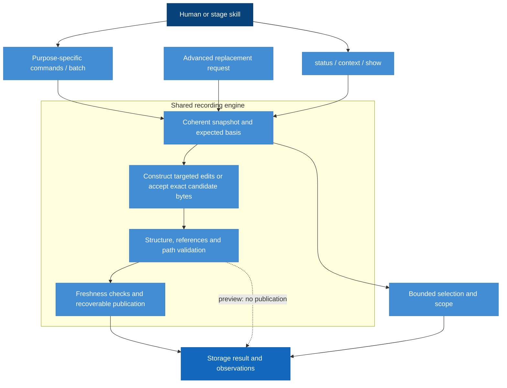

# CLI Model Design

Model validation contract: model-document-v1

The [structured-assessment interface amendment](#structured-assessment-interface) selects prospective v3 operations and result changes. Existing v2 interface sections below remain the exact continuation profile except for the explicitly mapped new-store creation boundary after adoption.

## Introduction and Goals

Make the CLI a small repository-local tool that reads records, reports observations, validates explicit updates and persists them safely. The user or agent supplies status and decisions. The CLI never chooses a stage or turns another edit into a workflow decision.

Simplicity means removing semantic transition orchestration, not removing schema validation, concurrency protection or recovery. A lifecycle may need human judgment; safely writing bytes must not require the lifecycle first to become semantically complete.

### Design at a glance

> Agents spend tokens understanding engineering meaning; the CLI spends computation on identities, selection, preservation, serialization, registration and persistence.

The CLI turns an actor's explicit decision into a safely stored update. Humans and skills use purpose-specific commands; one shared recording engine constructs candidates, checks structure and identities, and publishes recoverable changes. Read commands expose recorded information and observations with a stated scope.

| Reader question | Start here |
| --- | --- |
| Which command serves my task? | [Public command catalogue](#primary-public-command-contract) |
| What do I submit? | [Targeted requests and operations](#targeted-request-and-operation-definitions) |
| What does a query return or omit? | [Bounded queries](#bounded-queries-and-scope) |
| What does a save or preview mean? | [Primary results](#primary-result-schema-diagnostics-and-preview) |
| How are neighboring content, conflicts and recovery handled? | [Candidate construction](#lossless-candidate-construction-and-shared-engine), [retry](#batch-composition-no-op-and-retry) and [save safety](#save-safety-and-recovery-boundary) |
| How does this interact with workflow decisions? | [Correction walkthrough](#correction-walkthrough-recording-behavior) and the [Workflow model](../workflow/workflow.md) |
| Where is the maintenance interface? | [Advanced requests](#advanced-candidate-update-contract) and [advanced results](#advanced-result-schema-and-exit-behavior) |

## Context and Scope

The CLI receives an exact change target, explicit decisions expressed as targeted operations, and expected current identities from an actor. It returns stored content, observations or a persistence result. The Workflow model interprets that result and decides what to do next. Filesystem permissions and runtime restrictions bound execution; the CLI cannot grant external permissions.

The primary public surface is `status`, `context`, purpose-specific `show` and mutation commands, and `batch`. The existing `record-store inspect|check|record|recover` surface remains advanced tooling with its versioned request/result contract. The retired semantic command families are removed as specified below. Installation/release commands retain their separate meanings; no alias dispatches a targeted command into an eligibility engine.

### Model boundary

| Concern | Owning model | This model's relationship |
| --- | --- | --- |
| Meaning of activity, work, findings, blockers, judgments and applicability | [Workflow](../workflow/workflow.md#context-and-scope) | Accept and preserve explicitly supplied values |
| Stored record types, relationships, versions and preservation | [Record Format](../record-format/record-format.md) | Consume the stored-record contract |
| Command syntax, request/result shapes and bounded selection | CLI | Define the public interface |
| Encoding, byte preservation, identities, publication and recovery | CLI | Define and enforce mechanical storage safety |
| Adequacy of evidence and justified progression | Workflow | Return observations without making those decisions |

### Contract names and versions

The public documentation calls stored data the **RigorLoop Record Format**. V2 is the retained runtime contract; the exact retired set is owned by Record Format RF-SR-06. No existing records are migrated. A transport version describes an interface envelope, while the stored contract identifies persisted record meaning.

| Surface | Existing or designed discriminator | Contract owner |
| --- | --- | --- |
| Stored records | rigorloop-records-v2 / schema_version 2 only after retirement. | Record Format owns the [complete stored-record definition](../record-format/record-format.md#explicit-record-schema); CLI owns encoding and safety |
| Primary targeted requests | `interface: targeted-recording-v1`, `schema_version: 1` | CLI targeted request definitions |
| Primary query/mutation results | `schema_version: 2`, operation-specific tagged result | CLI primary result definitions |
| Advanced record-store requests/results | V2 requests use schema 2 and rigorloop-records-v2; advanced results retain schema 1 | CLI advanced definitions |

The model-document validation marker at the top of this file versions document structure only. It does not select a stored format. Stored schema versions, primary transport versions and advanced transport versions are independent; commands dispatch on the explicit contract and the version rules of their own surface.

The [v2 stored schema](../../../schemas/rigorloop-records-v2.schema.json) and [targeted transport schema](../../../schemas/targeted-recording-v1.schema.json) already exist. Advanced result validation currently depends on definitions housed with explicit-recording-v1; the removal contract below separates that shared dependency. Schema linkage does not establish retirement implementation or review approval.

### Examples

The [CLI example index](examples/README.md) separates current v2 messages, internal observation-digest inputs, and proposed v3 complete recording, Review updates and Verify updates. Each scenario declares its own starting state and links to its stored-record owner.

| Example | Scope and starting state | Requirement basis |
| --- | --- | --- |
| [Work update request](examples/v2-work-status-update/request.json) and [saved receipt](examples/v2-work-status-update/response.json) | Complete primary JSON messages for work.set on existing work-1, whose status is pending in example-change. Expected revision is current; no extra subject basis is claimed for this status-only decision. | CLI-SR-03/12/16 |
| [Scan observing B](examples/observation-freshness/scan-b.json), [scan observing C](examples/observation-freshness/scan-c.json), and [expected comparison](examples/observation-freshness/expected.json) | Complete internal digest inputs plus an explanatory expectation object, not public request/response envelopes. Historical subject A differs from both B and C; revision and diagnostics stay identical. | CLI-SR-14/20 |

Digests are illustrative, not reproducible fixture hashes or runtime evidence. The command is rigorloop work set work-1 with the explicit root/change and request on stdin. The actor chooses in-progress; the CLI preserves omitted ownership, requirements and neighboring entries. The response reports storage only. No complete stored file is submitted. Stored representations belong to the [Record Format examples](../record-format/record-format.md#examples); actor sequencing belongs to [Workflow](../workflow/workflow.md#examples).

## Architecture Constraints

Use exact local identities and explicit paths. Do not require Git, PR access, network services or a daemon. Data safety is enforced mechanically; workflow authority is not inferred from a caller's role string. Never use the new recorder as an implicit interpreter for an old contract.

The existing record-store foundation is the shared persistence boundary. Targeted commands construct candidates and enter its validation and transaction path; they do not delegate to the compact eligibility engine. Reuse is subject to preservation, conflict and recovery proof, not inferred from module names. No project-map inference is used: the proposed boundary is grounded in the proposal, governance and directly inspected persistence surface.

## Solution Strategy

Separate structural validation from workflow diagnosis and separate both from persistence. A targeted adapter constructs complete candidate bytes from explicitly named edits against one coherent snapshot. Advanced `record-store record` instead accepts exact complete bytes. Both feed one structural validator, identity checker and recoverable publisher; neither invokes advance-stage, settle-review or reopen-owner semantics. The CLI may generate content hashes, storage revisions and transaction bookkeeping, but all substantive status values come from submitted records.

An old reviewed-subject hash is a legitimate reference to what was reviewed, not a foreign key that must equal today's file hash. Observed drift must be visible without making it impossible to save the correction that addresses it.

## Requirements

| ID | Required behavior |
| --- | --- |
| CLI-SR-01 | Inspect MUST return recorded values and separately labeled observations without altering authoritative records or performing recovery. It MUST NOT compute an authoritative next stage, approval, completion or applicability value. |
| CLI-SR-02 | Check and record MUST reject malformed records, unknown schema versions, unknown closed-vocabulary values, duplicate identities, dangling internal record references and unsafe targets before any authoritative write. Validity MUST NOT depend on whether the current workflow stage permits a proposed decision. |
| CLI-SR-03 | Every write MUST identify the expected revision, expected identities and exact target set. Primary commands MUST construct complete candidates from targeted actor-supplied edits; advanced record MUST accept complete explicit replacements. Unnamed files and omitted workflow decisions MUST remain unchanged. It MUST NOT merge stale decisions, fill semantic defaults or rewrite an old review to claim it assessed new content. |
| CLI-SR-04 | An update MUST exclude competing CLI writers and check expected revision, target identities and declared decision-basis identities before publication. Observed mismatches reject the update with a conflict; the caller must reread and decide again. External edits are covered at the observed checks, not atomically with replacement; the Save safety and recovery boundary applies. |
| CLI-SR-05 | Related replacements MUST be published as one logical transaction. Supported readers MUST receive a coherent before/after snapshot or an explicit busy/recovery-required result, never a mixed snapshot presented as usable current state. A successful result means all requested bytes are durably committed. |
| CLI-SR-06 | Interrupted writes MUST preserve sufficient local recovery information to restore a verified before-state or complete the exact prepared candidate. Recovery MUST NOT generate new workflow decisions and MUST stop when a target check observes bytes matching neither recorded state. Missing or tampered recovery evidence requires a reported recovery stop, not guessed repair. The same external-edit boundary applies to record and recovery. |
| CLI-SR-07 | Workflow observations, including changed review subjects, failed proof or contradictory readiness claims, MUST remain separate from structural rejection and saved content. They MUST NOT silently alter decisions or prohibit recording a structurally sound blocker, invalidation or correction. A successful record result MUST explicitly limit its claim to persistence. |
| CLI-SR-08 | Repeated submission MUST NOT duplicate findings or apply incremental semantic effects. The engine persists explicit candidate bytes; a lost-response retry with an old revision MUST conflict, including when the first write succeeded. No operation may duplicate an entry or increment semantic state on retry. It MUST NOT imply that the workflow action was newly approved. |
| CLI-SR-09 | All public, helper and recovery write paths MUST use the same containment, identity and transaction protections. Cross-change writes, path traversal, symlink escape and unexpected overwrite are rejected. This interface MUST NOT offer arbitrary repository file writes disguised as workflow updates. |
| CLI-SR-10 | The exact retired stored-contract set in RF-SR-06 and unknown contracts MUST reject safely without fallback, migration, reinterpretation or legacy recovery writes. Retired command families MUST be unavailable as specified below. Ordinary inspect, check and record MUST NOT convert historical data. |
| CLI-SR-11 | Results MUST distinguish saved, unchanged, rejected, conflict, busy and recovery-required outcomes, name affected identities where available, and separate observations from errors. Errors MUST NOT echo arbitrary record payloads or secrets. Human and machine-readable forms must preserve the same outcome meaning. |
| CLI-SR-12 | Purpose-specific writes and batch MUST use the same closed targeted-operation definitions and shared snapshot, validation, identity, publication and recovery path. Missing semantic inputs MUST reject with named required fields, never invented decisions. Callers MUST NOT assemble registry entries or serialization scaffolding. Ordinary skills MUST NOT reconstruct complete files. |
| CLI-SR-13 | Candidate construction MUST preserve omitted fields, entries, review subjects and unrelated narrative bytes. Only explicitly selected values and necessary syntax/registry bookkeeping may change; unchanged values MUST not trigger formatting rewrites. |
| CLI-SR-14 | Context MUST apply explicit actor-selected filters and return full useful selected records by default, including finding origin and evidence rationale. Status, context and show MUST expose their exact scope, revision, relevant counts, omissions and continuation information. They MUST NOT infer relevance, readiness, approval or a next activity from selection or absent observations. |
| CLI-SR-15 | Batch MUST contain a bounded set of the same targeted operations, construct and validate one combined candidate and publish all or none. Conflicting overlapping edits MUST reject; intermediate structural incompleteness MUST NOT require simultaneous actor decisions. |
| CLI-SR-16 | Every targeted mutation MUST validate during normal execution and support a non-writing preview. Preview MUST make no reservation, return no saved claim and require the actual write to repeat freshness checks. |
| CLI-SR-17 | Public query/mutation JSON MUST be versioned, operation-specific and compact by default, omit irrelevant empty fields and expose mechanical detail only on request. Text MUST convey identical scope and storage-only meaning and display decoded multiline narratives readably without interpreting literal escape sequences. Per-command help MUST disclose only that operation's input contract and common safety fields. |
| CLI-SR-18 | Retirement MUST coordinate runtime dispatch, consuming skills/resources, examples, schemas, validators, selectors and supported adapters. Exclusive legacy machinery MUST be removed; shared v2 safety and independent transport/document version contracts MUST remain supported. Historical bytes and identities MUST remain untouched. |
| CLI-SR-19 | Subject inspection MUST compute identities for explicit contained subjects and optionally return the same inspected bytes. Writes MUST check those actor-declared expected identities without silently refreshing them. |
| CLI-SR-20 | Every admissible structurally valid mutation MUST have a prepublication storage receipt that fits independently of diagnostic volume. A bounded observation summary MUST disclose omitted detail and permit explicit retrieval; its observation identity MUST bind the record revision, exact observed subject basis and diagnostics so subject changes cannot be hidden by unchanged diagnostic text; diagnostic expansion alone MUST NOT prevent recording a correction or turn a successful publication into rejected output. |
| CLI-SR-21 | Normal targeted reads MUST expose the complete recorded Verify assessment/explanation and shared material-decisions narrative, with exact identities, applicability and explicit absence/missing-content distinctions, without requiring the caller to receive or inspect unrelated registered record bodies. |
| CLI-SR-22 | Every successful primary change-scoped read MUST expose record_contract and revision from the same coherent snapshot, independently of selected items or pagination. A fresh actor MUST be able to obtain the exact contract and expected revision for its first targeted update without advanced inspection. Absent or invalid stores MUST NOT acquire an inferred contract. |
| CLI-SR-23 | Current-work discovery MUST apply the exact structural classification below without interpreting archival lifecycle data. Malformed or ambiguous v2 candidates MUST remain explicit errors, not disappear as archives. Discovery MUST NOT derive readiness or select workflow authority. |
| CLI-SR-24 | V3 review.show and verify.show MUST support closed top-level field projection as defined below. Unselected content MUST be omitted with explicit selection, omissions and optional-member absence metadata while identity, revision, contract and applicability remain available. Default reads remain complete; unknown selection rejects without mutation. |
| CLI-SR-25 | V3 review.set and verify.set MUST replace only a nonempty subset of their closed explanation-field lists against an existing complete record. They MUST use the shared revision/read-set, candidate, overlap, no-op, preview and recovery protections and MUST NOT change applicability or assessor/basis/judgment implicitly. |
| CLI-SR-26 | Full review recording and explanation updates MUST preserve complete findings. Explicit finding operations and advanced replacement MUST preserve v3 finding IDs while allowing current-field corrections under RF-SR-13; v2 and blocker origin rules remain. Recovery MUST preserve exact prepared bytes. Rendering MUST derive readable selected values without parsing, synthesizing or caching a second authoritative explanation. |
| CLI-SR-27 | Recognized review.set and verify.set MUST use primary response schema 3 for every outcome, including before store validation, without broadening schema 2. Coordinated adoption MUST introduce explicit v3 dispatch, new-store creation and compatible transport validation while retaining existing-v2 operations and recovery under RF-SR-12. Mixed stores, unsupported field operations, unknown versions and cross-version replacement MUST reject without conversion; all primary and advanced consumers must agree. |

## Building Block View



The decoder recognizes the selected contract and bounded record kinds. The structural validator checks only data representation and integrity. The snapshot reader and transaction layer coordinate access to authoritative files. The observer reports factual differences without selecting decisions. The renderer makes the distinction visible to humans and agents.

The diagram shows responsibilities and alternative read/write paths, not an instruction to execute every edge. Queries stop at projection; previews stop after candidate validation; actual writes use the shared publisher. Detailed exclusion, rechecking and recovery obligations remain in the sections below.

### Primary public command contract

CLI-SR-12 through CLI-SR-22 refine CLI-SR-01 through CLI-SR-11. The actor supplies the decision; the command records that decision and handles necessary bookkeeping without making additional workflow decisions. Change-record commands require one --root PATH and one --change ID; neither is inferred. Subject inspection requires only its explicit root and paths. `--format json|text` defaults to text. Write input is UTF-8 JSON via required `--input -`; no arbitrary patch, file path input, shell expression or `--force` is supported. `--dry-run` is accepted once by every primary mutation, including creation and batch. It is not accepted by queries. Unknown or duplicate flags and extra positionals reject before filesystem access or stdin consumption. `--help` alone after a recognized command prints its bounded schema, required selectors, examples and storage-only limit without reading the repository.

| Public invocation after `rigorloop` | Input operation / selection |
| --- | --- |
| `status` | Recorded activity plus aggregate work/blocker/finding/proof counts; no input body |
| `context --input -` | Explicit record selectors with full selected entry content by default; optional --for attributes activity but selects nothing |
| `subject inspect --path FILE` | Compute identities for explicitly selected engineering subjects; optionally return the same inspected content |
| `work show ID`, `review show ID`, `blocker show ID`, `evidence show ID`, `decision show ID` | Exact entry, check, decision or review ID in the selected change |
| `finding show ID --review REVIEW-ID` | Exact finding scoped to one review; never search for a matching ID across reviews |
| `verify show`, `decisions show` | The selected change's complete Verify report or complete material-decisions record, including its shared narrative; no synthetic singleton ID |
| `observations show` | Explicit bounded diagnostic detail for the selected change; this is a read, not an engineering assessment |
| `change create`, `change link`, `activity set` | `change.create`, `change.link`, `activity.set` respectively |
| `work add`, `work set`, `review record` | `work.add`, `work.set`, `review.record` |
| `finding add`, `finding set`, `blocker add`, `blocker set` | Same dot-separated operation names |
| `evidence record`, `applicability set`, `decision record`, `verify record` | Same dot-separated operation names |
| `batch` | One explicit list of targeted operations; no replacement-file or generic patch entries |

Creation/link are the two deliberate administrative verbs beyond show/add/set/record. There are no independent start/pause/resume/reopen/complete aliases. `next`, `advance`, `auto-approve`, `auto-resolve`, `complete-if-ready` and bare `verify` are not recording commands. Any preexisting unrelated command family keeps its separate dispatch; duplicate public command names must be reconciled explicitly before adoption, never resolved by falling through to an eligibility handler.

### Finding origin construction

Record Format's [retained-origin contract](../record-format/record-format.md#retained-judgments-for-unresolved-findings) owns rigorloop-records-v2 concerns. Origin remains inside each finding or blocker; understanding it does not require a review-history lookup. Retiring older formats leaves the v2 construction forms and preservation invariant unchanged.

On v2 finding.add or blocker.add, values contain the mutable Concern fields except id and origin plus required `basis: {rationale, supporting_judgment}`. This basis is input, not an additional stored field. Supporting_judgment is exactly null, `{snapshot: JudgmentBasis}`, or `{from_review: ID, rationale}`. The latter explicitly selects a registered review in this change's coherent candidate at that operation, including explicitly supplied earlier batch operations: the CLI copies its reviewer, contributors, independence_basis, subjects and judgment, using the actor-supplied finding-specific rationale rather than copying the entire review body. That rationale is the actor's explicit account of the supporting judgment, not a claim that it reproduces every sentence of the review. A missing/unreadable selected review rejects; the CLI never selects the latest or most favorable judgment. The expected change revision binds the before-state and batch order fixes any explicitly updated source content. Later operations do not retarget the captured origin. The actor need not separately copy or hash the source review.

The CLI constructs origin by copying reporter, subjects, evidence and required_outcome from the actor's supplied concern, attaching the supplied rationale and exact selected supporting judgment. It preserves that origin thereafter. Finding.set and blocker.set cannot name basis or origin; their current fields and explicit disposition remain editable under the existing owner rules. Review.record preserves all concern origins along with the findings. Advanced v2 replacements reject modifications or removals of existing origins under the same concern ID, and recovery preserves exact before/candidate bytes. A new review judgment never supplies a new origin or closes a concern.

Actor labels and copied provenance remain attribution rather than authenticated independence. Retired records are not decoded to manufacture a v2 concern or origin.

### Targeted request and operation definitions

A single mutation has exactly `{schema_version: 1, interface: "targeted-recording-v1", contract, change_id, expected_revision, reads, operation}`. A batch replaces `operation` with `operations`, a nonempty array of at most 64 operations. `contract` is exactly `rigorloop-records-v2` and must match the selected stored root. A retired or unknown contract rejects with unsupported-contract and no writes, including primary creation; no request version implies a stored-format fallback. `reads` is an array of `{path, identity}`, using the subject-inspection output directly; identity may be null only to declare expected absence. The adapter translates it to the advanced expected_identity form internally. Existing read-set limits apply. Expected revision is a digest, or null only for `change.create`. Every operation has exactly `{op, target, values}` plus optional `applicability: {value, actor, reason}` only for the four supporting-record producers defined below. Command and `op` must agree; batch admits only the closed mutation catalogue. CLI and input change IDs must agree. Creation is a standalone command, excluded from batch; it is followed by independently requested operations once its actual revision is known.

Stored-value fields use Record Format's closed types and vocabularies; the CLI owns the targeted request shapes that carry them. A target is an exact object from the table, never a glob, array offset, free-form JSON pointer or inferred owner. `set` requires an existing entry and a nonempty subset of its listed mutable fields; explicit null is legal only where the stored schema permits it and never means deletion. `add` requires absence. `record` creates an absent selected entry or replaces only that entry's fully supplied decision fields. A duplicate add at a current revision rejects with `target-exists`; a missing set target rejects with `target-not-found`. There is no delete operation or bulk implicit clearing.

| Operation | Exact target | Values and allowed effect |
| --- | --- | --- |
| `change.create` | `{}` | Exactly proposal, models, activity, plan, work and blockers, including explicit empty arrays/null where intended. Values use Record Format types, except v2 initial blockers supply id plus blocker.add values/basis, from which the CLI constructs origin. CLI supplies schema/contract/change identity and initially empty registry/applicability arrays; supporting records are not created. Initial blocker from_review is therefore unavailable; its supporting judgment is explicit null or a supplied snapshot. |
| `change.link` | `{kind: "proposal"}` or `{kind: "plan"}` or `{kind: "model", id}` | Exactly `{subject: Subject}`. Replace that proposal/plan reference; append an absent model ID or replace that model's subject. No unlink or model rename. Does not change applicability or historical reviews. |
| `activity.set` | `{}` | Exactly `{stage, status, owner, reason}`. Replace only the activity value, without changing work, applicability or Verify. |
| `work.add` | `{id}` | Exactly `{status, owner, requirement_refs}`; the CLI inserts the target ID. No status/default owner is inferred. |
| `work.set` | `{id}` | Nonempty subset of `status`, `owner`, `requirement_refs`; replace selected fields only. |
| `review.record` | `{id}` | Exactly `{target, reviewer, contributors, independence_basis, subjects, judgment, body}`. Every assessment is complete and explicit, including narrative rationale. Creates metadata with an empty findings collection when absent; on an existing review preserves all findings and replaces only supplied assessment/body fields. Findings require separate explicit operations. |
| `finding.add` | `{review, id}` | All mutable Concern fields except `id` and `origin`, plus the required basis input for v2. Insert into that existing review and construct immutable origin for v2. State and resolution are explicit; no review is fabricated. |
| `finding.set` | `{review, id}` | Nonempty subset of mutable Concern fields other than `id` and `origin`; state/resolution changes must supply both. Review judgment, assessment and narrative remain unchanged. |
| `blocker.add` | `{id}` | All mutable Concern fields except `id` and `origin`, plus the required basis input for v2. Insert into change-level blockers and construct immutable origin for v2. |
| `blocker.set` | `{id}` | Same current-field rules as finding.set, scoped to change-level blockers; v2 origin is immutable. |
| `evidence.record` | `{id}` | Exactly `{actor, subjects, result, procedure, summary}` for that check. Preserve all other checks. |
| `applicability.set` | `{path}` | Exactly `{value, actor, reason}` for an already registered supporting record. Path is not a check/finding selector. |
| `decision.record` | `{id}` | Exactly `{actor, subjects, rationale, source_refs}` for that material decision; preserve all other decisions. |
| `verify.record` | `{}` | Exactly `{verifier, subjects, evidence_refs, review_refs, outcome: "success", body}` for the success report. Does not set activity completion. |

Review/evidence/decision/Verify producers resolve their file, record kind, common metadata and registry membership mechanically. There is no `registration` request object or caller-supplied registry entry. Optional applicability is an explicit actor decision: if supplied, set that containing record's declaration to exactly those values; if omitted on an existing record, preserve its declaration. A newly created supporting file requires this input and otherwise returns missing-input naming applicability. The same operation shape therefore works without the actor reconstructing registry rules. In a batch, one explicit applicability assignment per path is allowed; duplicate assignments reject even if equal.

Review and Verify narrative come from values.body. This writes the required body property of the JSON record. Decision.record accepts optional values.body for the containing material-decisions narrative; it is required when creating that supporting record and otherwise preserved when omitted. No narrative or semantic default is synthesized. The engine constructs schema/change metadata, array containers, deterministic paths and registry entries, and validates the combined candidate. Empty new collections are bookkeeping, not assertions of engineering assessment.

Supporting-file creation requires both registry membership and the file to be absent. A registered missing file is unavailable data, not a new empty collection: a primary mutation targeting it rejects with broken-reference plus missing-content observation. An unregistered existing file rejects as an unexpected overwrite. Advanced explicit restoration remains available with actual replacement content and all normal safety checks. Unknown fields and missing actor decisions reject before writes; no command prompts interactively or invokes another actor to invent the missing decision.

The common expected revision covers the manifest and all registered records, so callers need not repeat neighboring record hashes. The adapter resolves exact affected file identities from that same verified snapshot and passes them to the shared engine. `reads` carries current expected identities for the externally selected decision basis; subject identities inside historical records remain assertions about assessed content and are never substituted with newly computed hashes. `change.link` additionally requires its supplied subject identity as an equal read-set identity. Other subject-bearing commands retain the ability to record historical or incomplete evidence; the actor explicitly declares the current basis it actually relied on. The CLI computes identities, not the adequacy of that basis.

### Bounded queries and scope

The actor explicitly selects the records useful for its decision. `context --input -` reads exactly `{schema_version: 1, select: [Selector]}` plus optional detail. Select contains 1–64 selectors; detail is `full` or `summary`, defaulting to full if omitted. Optional `--for SKILL` is an attribution label only, does not alter selection or requirements, and accepts the existing 1–80-character lowercase ID grammar without maintaining a CLI-owned stage catalogue. Context with no selectors rejects rather than returning a broad static skill profile. No record is added because the CLI thinks it relevant to a stage. Attributed --for is not echoed as a second selection or used to authorize the request.

A Selector is `{kind, where}` with closed kinds and filters below. Where is an object; an explicit empty object selects every member of that kind. Omitted filter keys impose no restriction; an empty supplied filter array is invalid. Arrays contain unique valid values. Conditions within a selector are AND; selectors are OR and duplicate results are returned once. No free-form query language, inferred dependency expansion or relevance ranking is introduced.

| Kind | Admitted where keys, each an array unless noted | Full item fields |
| --- | --- | --- |
| `work` | ids, status | Full work object |
| `review` | ids, target, judgment, subject_paths | Complete review fields excluding findings, including body; select findings separately |
| `finding` | ids, review_ids, state, subject_paths | Complete finding including current evidence, required outcome, disposition and v2 origin |
| `blocker` | ids, state, subject_paths | Complete change-level concern, including v2 origin |
| `evidence` | ids, result, subject_paths | Complete check including procedure and summary |
| `decision` | ids, subject_paths | Complete individual decision including rationale and source_refs |
| `verify` | No filters; where must be empty | Complete Verify fields including body, which carries the final assessment and explanation |
| `decisions` | No filters; where must be empty | Complete material-decisions fields, including all decisions and the shared body |
| `model` | ids, subject_paths | `{id, subject}` from the change |
| `proposal`, `plan`, `activity` | No filters; where must be empty | The selected Workflow value; a null plan yields a present null value |
| `applicability` | paths, value | Complete manifest applicability entry |

IDs and enum values retain Record Format types; paths use the existing containment grammar. Subject_paths matches exact current recorded subject paths, not hashes or inferred dependency relationships. A finding's origin subjects do not silently influence selection; select its known ID when evaluating a changed current subject. This keeps filtering a literal request, not semantic relevance judgment.

Items have exactly `{kind, target, path, identity, fields}` plus origin_available only for finding/blocker and applicability only for verify/decisions. Target is `{id}` for work/review/blocker/evidence/decision/model, `{review, id}` for finding, `{path}` for applicability, and `{}` for proposal/plan/activity/verify/decisions. Path and identity identify the containing authoritative file. Verify/decisions items additionally contain applicability exactly `{value, actor, reason}` from the manifest; their path/identity identify the report, while the response revision covers that declaration. Other item shapes retain their existing members. Fields follow the table; they do not duplicate unrelated records. V2 finding/blocker items expose `origin_available: true` and include actual origin in full fields. This existing transport member is retained; retired records are not returned. Summary is an explicit cheaper projection: work retains id/status/owner; review id/target/reviewer/subjects/judgment; finding/blocker id/reporter/owner/subjects/state/required_outcome; evidence id/actor/subjects/result; decision id/actor/subjects/source_refs. Summary for verify retains schema_version/change_id/verifier/subjects/evidence_refs/review_refs/outcome and omits body; summary for decisions retains schema_version/change_id and omits decisions/body. These omissions are listed explicitly. Other kinds retain full fields. Scope explicitly lists omitted field names, including origin where summary omits it.

`review show ID` returns full review metadata including findings and body. `verify show` and `decisions show` return one full singleton item with body and applicability, exactly as a full context selection of that kind. `decision show ID` continues to address an individual decision, so it is distinct from decisions show. Other existing show commands return the same full entry fields as context. Missing entry in a readable containing record returns target-not-found. A registered missing container returns rejected/2 with broken-reference and missing-content; it cannot establish entry absence. Missing unregistered optional content establishes no authoritative entry. Malformed/unreadable/unsafe content rejects with the existing structural/I/O/path errors rather than returning an empty collection.

Context/show do not prepend every work count, model, applicability entry or registry identity. Context scope is exactly `{select, detail, returned, total, complete, omitted_fields, missing_paths, next}`. Next is null or `{token, expected_revision}`. Select repeats the normalized selector expressions; returned is the item count on this page, total the selected count across pages or null when selected missing files make it unknown. Complete describes only that selection: true when no known selected items remain and no selected content is missing. Omitted_fields is an array of `{kind, fields}` for an explicitly requested summary; it also lists review.findings excluded by the review projection. Unselected kinds are outside scope by definition, never implied irrelevant. Missing_paths names selected unavailable files. No next token is issued when only unknown content remains; complete=false with next=null is a repair/read boundary. Full detail still lists the deliberately excluded review findings in omitted_fields; other full entry fields are not omitted. A selected kind with no entries has total=0, distinct from total=null for missing content.

Show scope has the same shape, using a single exact-ID selector or `{kind: "verify" or "decisions", where: {}}` for the singleton commands, full detail, returned=total=1 and next=null on success; finding's selector includes review_ids. Review/verify/decisions show have no omitted_fields because they include the complete selected record and narrative. An unregistered singleton is absent: show returns target-not-found and context returns zero selected items. A registered missing singleton is unavailable: show rejects with broken-reference/missing-content and context has null total, complete=false and its path in missing_paths. A malformed or unreadable record rejects rather than suggesting that a final assessment does not exist. Neither a saved outcome nor applicability current authenticates the report or establishes present readiness. Status is a separate aggregate view: data is exactly `{activity, counts}`, with counts keyed by work, blockers, findings, reviews and evidence. Each group is `{known_total, total, by_value, missing_paths}`; by_value includes every admitted stored status/state/judgment/result with known counts including zero. Total is null for groups with unreadable registered missing content; zero known counts do not imply absence. No semantic readiness is calculated. Status scope is exactly `{view: "recorded-summary", complete, missing_paths}`; complete is false if any count group is unknown. Model/proposal/plan references and full applicability are requested explicitly through context rather than attached to every response.

Context/record-show data is exactly `{items: [Item]}`; observations.show uses its separate paginated diagnostic data/scope below; status data is the aggregate object specified above. A review show uses the full fields exception stated above. Queries internally establish one coherent registered snapshot and its revision. They do not discover authority by directory scan or recover storage. Normal change-scoped reads carry the bounded observation_summary defined below when nonempty, so unselected diagnostic detail cannot crowd out the requested report. Observations are mechanical checks, not engineering completeness. A missing file outside the selected items may generate an observation but does not turn the selected total into null. An absent root returns empty items (or null status data), absent-change observation and null revision. Context retains normalized select/detail with returned=total=0, complete=true, empty missing_paths and next=null; status has its named view, complete=true and empty missing_paths; show returns target-not-found. Broken registry/applicability structure rejects rather than inventing entries.

Context pagination accepts --limit N (default 20, range 1–100), --after TOKEN and --expected-revision DIGEST. After requires expected-revision; a first page may assert only a revision. Items sort by ASCII `(path, kind, canonical target JSON)` after deduplication. Token is unpadded base64url of compact JSON exactly `{version: 1, last: {path, kind, target}, selection_identity, revision}`; selection_identity hashes normalized select/detail, and token length is at most 8192 ASCII characters. Normalize selector objects by key, filter arrays by ASCII encoded value, and selector array by canonical JSON order; use SHA-256 of compact UTF-8 JSON. Tokens from another selection reject with invalid-cursor. Tokens must identify an item present in the checked selected snapshot; malformed keys or nonmember keys reject. A changed expected revision conflicts without items; a token is a continuation aid, not authority or a reservation.

Context, show and status accept --max-bytes N (default 262144, range 4096–8388608). Select the largest whole-item prefix fitting count and JSON byte limits; if the header/scope/first item cannot fit, return limit-exceeded with no partial item and guidance to narrow selection, explicitly choose summary, or increase the allowed budget. Never silently remove origin, evidence or rationale to fit. No empty non-progressing page is returned. Text carries the same selected information and scope; if its rendering exceeds the budget, fail before output. Queries other than context and observations.show reject pagination flags.

### Subject inspection and mechanical identities

`subject inspect --root PATH --path FILE [--path FILE ...] --content full|none --format json|text` reads explicitly named engineering subjects. Root is required, paths are repeatable (1–256 distinct contained regular-file paths); content defaults to none. No --change is needed because hashing a subject does not depend on a registered workflow root. The command does not select subjects from a stage, execute files or authenticate the caller. It admits --max-bytes with the query limits above and rejects all mutation, context-pagination and unrelated selectors.

The response data is `{subjects: [{path, identity}]}` with an additional `contents: [{path, content}]` only for explicitly requested full content. Subject entries can be copied directly into stored subjects or primary request reads; no separate hashing command or digest reformatting is required. Full content and its identity must describe the same bytes read; IDs are not calculated from a later reopen after returning content. None mode streams hashing without retaining full payloads. Unsafe/symlinked/nonregular files reject; missing subjects return a null identity and subject-drift observation, usable only as an explicit expected-absence read, not as a stored non-null Subject.

If an observed file change during inspection prevents a coherent identity/content result, return conflict without a partial subject set. This does not promise to exclude all simultaneous external edits; the observed-check limitation remains. A changed subject after inspection is caught when the write checks the actor's submitted reads. The CLI must never silently refresh that expected identity during a mutation. Content exceeding the response bound rejects without truncation; the actor can inspect selected smaller subjects or use identity-only mode while obtaining adequate engineering context separately.

### Primary result schema, diagnostics and preview

Primary output is an operation-specific tagged union, not a large fixed envelope. Every JSON result has exactly the common fields `{schema_version: 2, operation, status, claim: "storage-only"}` plus the required/conditional members below. Unknown members reject under the result schema. The targeted interface is identified by this schema/version and operation family; no redundant interface field is required in the response. Text preserves the same meaning.

Primary text output presents the decoded result as labeled YAML fields after the storage-only header. LF-separated narratives use literal multiline blocks so paragraphs, lists and code blocks retain their line breaks and indentation. Strings that require quoting for exact value preservation or control-character safety remain quoted. Literal backslash sequences such as `\n`, forward-slash text such as `/n`, Unicode and intentional content whitespace retain their values; the renderer never globally replaces escape sequences. Every selected field, identity, diagnostic, absence value, scope and continuation value remains present. Text and JSON preserve equivalent decoded data, with the existing text byte-limit check performed before output and prepublication receipt sizing unchanged. JSON responses remain compact and use required JSON string escaping; this presentation creates no Markdown report file or alternative authoritative record.

| Variant | Required additional fields | Conditional fields |
| --- | --- | --- |
| Saved/unchanged write | change_id, revision, changed | observation_summary only when nonempty; details only when requested |
| Valid preview | change_id, revision, candidate_revision, changed | Same conditional diagnostics/details; no persistence claim |
| Context/show/status inspected (except observations.show) | change_id, record_contract, revision, data, scope | Nonempty observation_summary |
| Observations inspected | change_id, record_contract, revision, data, scope | None; detail scope replaces observation_summary |
| Subject inspected | data | Nonempty observations with observations_scope: "selected-subjects" |
| Rejected/conflict/busy/recovery-required | errors | Independently available valid change_id, inspected revision, a nonempty bounded observation_summary for a change-scoped scan (or selected-subject observations for subject inspection); transaction only for recovery-required when recovery metadata is available |

Record_contract is exactly the supported stored manifest contract: rigorloop-records-v2. It is a required top-level field for inspected status, context and all change-scoped show results, including observations.show. It is returned even for an empty selection, summary projection or continuation page and comes from the same coherent snapshot as revision. It is not a transport version, document-validation marker, inferred default or workflow judgment. Human output labels it “Record contract” and displays the same value.

For a successfully inspected absent root, record_contract and revision are both null; text explicitly reports that no stored contract exists. This is not a creation choice. An existing directory without a valid manifest, an unknown contract or a mixed-version store retains its rejection behavior; no successful read invents a contract. Failure variants omit record_contract rather than report an unvalidated value. Subject inspection has no change-scoped contract and omits the field. Advanced result envelopes and mutation receipts retain their existing shapes.

The actor copies a successful existing-store read's record_contract into the targeted request's contract and revision into expected_revision. It still supplies the intended decision and relevant subject identities, which subject.inspect can compute. The actual write repeats freshness checks; exposing the contract neither reserves the snapshot nor makes stale retries safe. These fields participate in ordinary read byte limits and do not expand diagnostic detail.

Changed is a deduplicated array of `{kind, target}` naming explicitly requested entries that changed, using query kinds plus `change` and `verify` with target `{}`. It is empty for unchanged. Review updates name the review; incidental registry construction does not inflate the ordinary response into a mechanical edit trace. `--details` is an optional mutation flag exposing `details: {included: true, files, effects}` when that optional expansion fits: files are `{path, identity}` for affected files; effects are `{operation_index, path, target, changed_fields, bookkeeping}`. Bookkeeping marks derived registry/container work separately from actor decisions. Effects contain no record bodies. If this optional expansion cannot fit alongside the guaranteed receipt, emit exactly `details: {included: false, reason: "response-limit"}` instead; its omission is explicit and never blocks the write. No historical effect-log retrieval is promised by this optional field; current recorded values remain available through targeted reads. Preview's changed/details describe candidates, not published effects. Actual candidate bytes and expanded target identities remain internal to validation/persistence unless such detail is explicitly requested.

Errors/observations are `{code, message}` plus path, field and operation_index only where those locations apply. Retain the existing advanced code vocabulary; primary adds missing-input, target-not-found, target-exists, overlapping-operation, invalid-cursor, immutable-origin and missing-content. Missing-content is an observation; the other additions are errors. Messages are safe summaries, never raw rejected fields or bodies. Operation is one of the dot-separated mutations, batch, status, context, subject.inspect or a recognized KIND.show, including verify.show, decisions.show and observations.show. Scope tags identify what was examined; absence of observations says nothing about unassessed engineering concerns.

Statuses/exits remain inspected/0, valid/0, saved/0, unchanged/0, rejected/2, conflict/3, busy/4 and recovery-required/5. Revision is null only for an absent root or unavailable snapshot; optional failure fields are omitted when unavailable instead of emitted as null placeholders. Transaction is `{id, recovery_identity}` with the existing digest/null availability rule. Selector failures occur before repository/stdin access, with operation null only if no valid operation is known, one safe invalid-input error and any independently valid change_id; invalid format falls back to text. Subject inspection errors have no invented change identity. No failure reports a partially published changed list.

The primary mutation output limit remains 8 MiB, but mandatory receipt data is guaranteed to fit within 512 KiB independently of diagnostic volume, as established below. Prepare that receipt before publication. Optional diagnostic/mechanical expansion is summarized or explicitly omitted, never grounds for rejecting an otherwise valid correction. A successfully published write must retain saved/unchanged meaning; failure to deliver stdout is a transport failure or lost-response retry, not a false storage rejection. Per-operation help includes its values, common basis/safety inputs and relevant optional applicability/body rules only. It does not load all other record kinds, registered-file shapes or advanced transaction envelopes into an agent's normal context.

### Bounded storage receipt and diagnostic detail

CLI-SR-20 selects a bounded summary with explicit detail retrieval. Normal primary mutation/status/context/show receipts use the summary, including when --details is requested; only the explicit observations.show detail view returns a diagnostic page. When observations exist, observation_summary is exactly `{scope, total, by_code, details_included: false, observation_identity}`. Scope is registered-snapshot for saved/unchanged results and registered-state reads, and candidate-snapshot for a valid preview. By_code has exactly the five observation keys absent-change, subject-drift, failed-evidence, inconsistent-claim and missing-content with nonnegative integer counts. Total is their sum. Omission of observation_summary means zero occurrences of these mechanical diagnostic kinds in that scan, not an assurance that engineering concerns are absent.

Counts cover distinct diagnostic locations in the inspected snapshot, not just the returned context page. Each (code, record/subject location) contributes at most once; counting and hashing stream over deterministic traversal rather than constructing one giant response array. With at most 65 MiB of authoritative bytes and 256 declared external basis paths, the number of admitted structural locations and these five code occurrences is below 2^31. Counts therefore have at most ten decimal digits. Unknown diagnostic vocabulary remains fail-closed; it is not silently dropped to preserve the bound.

The mandatory mutation receipt contains the previously defined common fields, change_id, revision, changed, and at most this summary. A preview additionally has candidate_revision. At most 64 explicit operations produce at most 128 changed targets, including any explicitly supplied producer applicability targets. IDs are at most 80 ASCII characters and paths at most 1024; each serialized changed entry is bounded by 2304 UTF-8 bytes, including worst-case admitted JSON escaping. The remaining fixed receipt fields, digests and five counts fit within 16 KiB. Thus 128 × 2304 + 16384 = 311296 bytes, below the reserved 512 KiB and the 8 MiB mutation limit. Human receipts use bounded templates carrying the same fields and satisfy the same reserve. No diagnostic messages, evidence bodies, per-location paths or raw payloads occur in that bound. A request within the existing structural limits does not gain a new eligibility test based on observation volume.

A candidate receipt and any optional fitting details are serialized before publication. Adding arbitrarily many admitted diagnostic occurrences changes only these bounded counts and digest. Diagnostic expansion that exceeds the optional response space selects the compact receipt; it does not reject the candidate. Unexpected rendering failure detected before publication can stop before writing, but is an implementation failure to fix, not an admissible overflow policy. After a committed save, reporting rejected due to renderer or output delivery failure remains prohibited. Recovery and lost-response handling retain their existing outcomes.

`observations show --root PATH --change ID --format json` retrieves explicit current detail. It accepts the same --limit (1–100, default 20) and --max-bytes bounds as context, plus optional --expected-revision DIGEST and --expected-observations DIGEST supplied together. For an absent root the explicit revision selector is the literal absent, corresponding to null revision. The observation identity is SHA-256 of the compact UTF-8 JSON encoding of exactly `{schema_version: 2, revision, observed_subjects, observations}`. This schema_version identifies the internal digest preimage, not a stored-record or response version. All object keys, including the top-level object and subject pairs, are sorted lexicographically; arrays retain the deterministic orders below. No final LF is hashed. Observations are ordered by ASCII record/subject path (null first), structural location and code. Diagnostic objects use lexicographically sorted keys, compact separators and the existing JSON escaping rules before hashing, so printer whitespace does not alter the detail identity. Structural location is the bounded field/index path used by the observer; ties retain deterministic traversal order. The digest covers exact safe messages and locations as returned. The same observer runs over candidate or current registered data and observed referenced-subject identities; it includes no request-specific operation_index or other transport metadata that could prevent equivalent read-side reconstruction. It can be computed incrementally without materializing the serialized list. No new diagnostic artifact, request ledger or historical snapshot archive is created.

Observed_subjects is a deduplicated array of exactly `{path, identity}` pairs sorted by ASCII path. Its scope is every Subject.path in the complete selected store's structured records: manifest proposal/models/plan, review and concern subjects, retained origin/supporting-judgment subjects, evidence, material decisions and Verify subjects. Include paths regardless of applicability, selection page or whether they yield a diagnostic. Only schema-defined Subject fields participate; body text, EntryRef values and arbitrary strings are not traversed as subjects. Paths already in the authoritative record set use the same snapshot bytes; all remaining paths are observed external subjects. The expected historical identities do not replace the observed current identities.

Each unique subject path is observed once per scan, and every diagnostic for that path uses the same observed result. A readable file contributes the digest of its exact inspected bytes; confirmed absence contributes null. Unreadable or unsafe subjects retain the existing error outcome and cannot be encoded as null or omitted. There is no new 256-subject admission limit on stored references: the existing authoritative-byte limits bound their population; the 256 request-read limit still applies only to declared mutation basis. Counting and hashing the subject array can stream without placing it in a receipt.

Candidate scans enumerate the combined candidate's Subject fields, while current reads enumerate the current registered snapshot using the same rule. Request-only reads are checked independently for mutation freshness and do not enter this reconstructible diagnostic basis. No reread silently replaces identities already used by that scan. Every continuation recomputes the complete observation identity before returning a page; matching record revision is insufficient when any observed subject identity or absence changes. These are identities observed during the scan under the existing external-edit limitation, not a promise of atomic filesystem snapshots or detection of edits reverted before the next scan.

The added basis is internal digest input only. The receipt still contains bounded counts and one digest; detail retrieval still returns diagnostics with explicit scope and does not become a prerequisite for saving a correction. Preview and saved/read-side reconstruction retain their existing candidate/current revision rules.

Returned data is exactly `{observations: [Diagnostic]}`, using the primary diagnostic type plus required location, a string identifying the checked structural field/index location (empty for a root-level occurrence). Scope is `{view: "observations", observation_identity, returned, total, complete, next}`. Next is null or `{token, expected_revision, expected_observations}`. Tokens are unpadded base64url of compact UTF-8 JSON exactly `{version: 1, offset, revision, observation_identity}`, at most 1024 ASCII characters; offset is a nonnegative integer into the deterministic sequence. --after requires both expected selectors, rejects out-of-range offsets and uses the existing invalid-cursor outcome for malformed tokens. Pages return whole diagnostics within count/byte limits; an oversized single diagnostic produces a read-only limit-exceeded response, with guidance to increase the byte budget. Each diagnostic is at most 16 KiB when serialized: messages use fixed safe templates with at most 512 UTF-8 bytes and location/path fields obey the existing 1024-byte limit. Long unsafe inputs are represented by a safe structural location, not echoed. Thus every individual diagnostic fits the admitted 8 MiB read limit, while pagination bounds arbitrarily larger detail sets.

A published receipt's revision and observation_identity can be used as these two expected selectors. A changed record revision or changed observed external subject produces conflict without detail; an identical record revision alone does not establish identical observations. Callers may request a fresh first page and reassess. This is an explicitly current diagnostic view, not guaranteed replay of a historical mutation receipt. A preview summary describes its candidate_revision rather than its before-state revision and cannot be retrieved as saved state; detail retrieval may conflict until an identical candidate is committed. Previews may inspect candidate-relevant record fields through their normal request/basis without requiring a persistent preview archive. Summary counts remain usable even when current detail has changed.

Observations.show itself carries no recursive observation_summary; its data/scope already expose the exact detail view and identity. Registered-state reads retain the same coherent-snapshot and busy/recovery rules; diagnostic pagination does not perform recovery or change decisions. Subject inspection remains a separate bounded selected-subject read with at most 256 subjects and its existing observation shape. Full Verify and decisions reads do not include unrelated diagnostic bodies, so a diagnostic-heavy store does not force advanced inspection to retrieve the final explanation.

### Lossless candidate construction and shared engine

The primary adapter parses the complete v2 JSON object with source spans. It retains the original byte buffer and builds an index of object fields and stable entry IDs. Replacement edits change only the selected value token span; inserting an entry adds a serialized element plus the necessary comma and local indentation at the array end. Existing entry bytes, order and whitespace remain unchanged outside explicit target spans. An unchanged semantic value produces no byte edit even if the caller's whitespace or object-key order differs. Changing other fields does not rewrite body. A v2 body replacement changes only that JSON string token, escaping its supplied content mechanically; the string must be nonempty but need not itself end in LF. The complete file retains the final-LF encoding rule.

New stored files use deterministic JSON encoding: keys sorted by ASCII field name, arrays in supplied order, two-space indentation, Unicode retained as UTF-8 except JSON-required escaping, finite numbers only, and a final LF. Empty arrays and objects remain inline. A new v2 file is one complete JSON object with no delimiters or trailing narrative. In an existing multiline file, a replaced value uses two-space nested indentation relative to its line and an appended array element uses two-space indentation relative to the array line. Existing compact files retain compact replacement and append encoding. Existing object members are not reordered. The lossless parser must either preserve the admitted source representation or reject structurally; silently canonicalizing an existing file is forbidden. Only necessary adjacent commas and inserted local whitespace may accompany added members/elements; existing neighboring bytes remain unchanged. No bulk reformatting or historical migration is implied. Compact machine results, canonical hash preimages and cursor encodings are unchanged, and stored-file byte limits include indentation. This is a narrow replacement of the old full-file primary interface, while the advanced exact-byte contract remains intact.

The construction phase has no filesystem write capability. It returns complete before/candidate bytes, explicit target effects and expanded registry/applicability effects. A shared transaction executor acquires writer exclusion, reads a coherent snapshot, verifies expected revision and declared basis, applies construction against that exact snapshot, validates the combined final candidate, prepares recovery and publishes using CLI-SR-04/05/06/09. The advanced adapter supplies bytes directly at the same candidate-validation boundary. Preview uses a coherent read without reserving it, constructs and validates the same candidate, and creates no lock/reservation/transaction files. A real write must start again under writer exclusion and repeat all checks; it cannot trust a preview.

No adapter writes files independently or calls compact/lifecycle eligibility first. Targeted and advanced writers use the same per-change exclusion domain and private recovery location. Recovery consumes the exact prepared bytes; it never reruns targeted operations against newer state. The external-edit limitation in Save safety and recovery boundary applies unchanged to all paths.

### Batch composition, no-op and retry

Batch constructs operations in listed order against an in-memory candidate based on one revision. Internal references use the [Record Format resolution table](../record-format/record-format.md#entry-reference-resolution) and are validated against the complete final candidate, permitting a new review and its finding or a check and referencing blocker in one transaction. An operation can select an entry created earlier in the batch. Each selected semantic field may be assigned at most once: overlapping writes, two adds with the same ID, two recordings of the same check or review, or duplicate or incompatible applicability assignments reject with `overlapping-operation`, even if supplied values agree. An ancestor replacement overlaps any descendant edit except the expressly separate review assessment/findings and decision entry/shared-body spans. Adding a new review and then its findings is permitted because new empty findings are representation scaffolding, not an explicit clearing operation. Changes to distinct named fields/entries in the same file compose deterministically. Physical registry construction is coalesced once; each applicability value remains an explicit actor assignment.

No intermediate candidate is published, and structural validation is not applied as a workflow eligibility check between operations. Invalid final references, missing applicability decisions, limits or conflicts reject the entire batch. A batch cannot include raw record-store requests, recovery, queries, arbitrary engineering edits or cross-change writes. Individual commands remain sufficient for independent decisions; no transaction requires Route or every responsible actor to participate.

Expected revision is checked before no-op recognition. Identical candidate bytes with satisfied current preconditions return `unchanged`; old-revision retries return `conflict`, including after a lost success response. A fresh retry of add against an existing ID returns `target-exists`; callers inspect rather than invent new IDs to bypass uncertainty. A repeated record at a fresh revision with identical decision values returns unchanged. There is no persistent idempotency ledger, semantic increment, automatic retry merge or automatic regenerated decision basis.

### Paths and command interface

CLI-SR-02/03/09/10/11 own this interface. `--root` is an explicit existing repository directory and `--change` is a Record Format change ID. Inputs and outputs are not inferred from the current working directory. V2 authoritative paths relative to that root are exactly `docs/changes/<id>/change.json`, `docs/changes/<id>/reviews/<review-id>.json`, and the conditional files evidence.json, material-decisions.json and verify-report.json in that change directory. Registry entries cannot expand this allowlist. The review filename and stored ID must agree. Explicit reads use the classification in Current-work discovery and retired inputs below. Both manifests present rejects invalid-input; a sole change.yaml rejects unsupported-contract without decoding it. A sole change.json must identify v2; unknown/mismatched contracts reject unsupported-contract. Neither manifest in an existing directory is invalid-input, not absent-change. Creation still requires an entirely absent root. Registry paths must match the selected format; no extension fallback, directory discovery or implicit conversion is allowed.

| Proposed invocation | Input and behavior |
| --- | --- |
| `rigorloop record-store inspect --root PATH --change ID --format json` | No stdin; returns the registered snapshot, byte identities, computed revision and observations. An absent root is an absent observation, not an invitation to create it. |
| `rigorloop record-store check --root PATH --change ID --input - --format json` | Reads one request from stdin, validates the candidate against a snapshot, writes nothing and makes no reservation. |
| `rigorloop record-store record --root PATH --change ID --input - --format json` | Reads the same request form, repeats all freshness checks and commits only explicit writes. CLI and envelope change IDs must match. |
| `rigorloop record-store recover --root PATH --change ID --transaction ID --expected-recovery DIGEST --action restore --format json` | Explicitly restores the verified before-state of an interrupted transaction; `--action complete` selects the exact candidate instead. No other action is accepted. |

`--format` accepts `json` or `text`, defaulting to text; all other shown selectors are required. Unknown flags, extra positional arguments, contradictory selectors or non-stdin input selectors reject. No permanent operation request file is created. `record` also performs initial creation using absent preconditions; a separate automatic initialization step is unnecessary. An existing directory, even without a manifest, is not an absent root and cannot be adopted by creation.

New-root creation may create only the selected change directory and required `reviews` directory; it may not claim an existing root. Existing registry membership cannot be removed in this first version: retirement is recorded with explicit applicability and retained bytes. Registered missing files may be restored through an explicit absent write precondition. A candidate can introduce a new registered file in the same transaction. Writes to unregistered sidecars, unsupported paths or existing unregistered files reject. Abandoned unrelated files are never overwritten or silently imported.

All paths are nonempty ASCII repository-relative paths with `/` separators, no empty, dot or dot-dot segments, backslashes, control characters or absolute prefixes. Symlinks in the root's descendants and hard-linked authoritative files are rejected; targets must be regular files or explicitly absent. The implementation must protect path resolution against concurrent substitution, not merely check a string once. Decision-basis paths cannot name transient store data. The request read set is not required to repeat historical subject hashes as current expectations: doing so would recreate the stale-review correction cycle.

### Advanced candidate update contract

The advanced transient request is UTF-8 JSON with exactly `schema_version: 2`, `contract: rigorloop-records-v2`, `change_id`, `expected_revision`, `writes` and `reads`. It admits only v2 candidate records and enforces immutable concern origin against the checked before-state. Retired, unknown or mismatched version/contract pairs reject as unsupported-contract without writes. Advanced v2 origin-preservation failures use the existing invalid-input diagnostic with a safe explanation; immutable-origin is a primary-only diagnostic, so the advanced result vocabulary remains stable. `writes` is a nonempty array of `{path, expected_identity, content}`; `reads` is an array of `{path, expected_identity}`. Content is a UTF-8 string containing the complete replacement file. Expected identities are exact SHA-256 digests; null means the target must be absent. Null `expected_revision` is allowed only when creating an absent change root. IDs and record kinds come from the Record Format model. Duplicate keys, duplicate paths and unknown fields reject the request.

V2 stores a single JSON object in each .json file. Reviews, material decisions and Verify contain their narrative in body; front matter or content after the JSON object rejects. JSON objects admit no duplicate keys, comments or nonfinite numbers. Content uses LF newlines, no BOM and a final newline; other encodings are rejected rather than silently normalized. Advanced record parses content to validate it but persists the exact supplied bytes. Object order and whitespace are not semantically significant, but remain significant to byte identity. Its no-rewrite guarantee remains unchanged. Primary targeted commands instead use the lossless construction rules below to produce those bytes; neither path supplies semantic defaults.

The change revision is computed, never written into the record: hash the compact JSON encoding of a path-sorted array of `[path, exact-byte-digest]` pairs for change.json and every file listed by its `records` registry. Paths use ASCII and sort by byte order. This avoids a self-referential hash and catches supporting-record changes even when the manifest bytes did not change. Candidate revision uses the candidate registry and bytes. Broken current references can be repaired: inspect reports missing registered content using a null digest in the revision array, and record validates the complete candidate rather than demanding a semantically valid before-state. An unreadable/malformed manifest cannot supply a registry and requires explicit external repair under user authority; the CLI does not guess one from directory scans.

The first recording contract supports creation and replacement of allowed workflow records only, not unrestricted deletion or arbitrary edits to engineering documents. Authors edit model documents through their normal scoped editing workflow and include their identities in the recording read set. This avoids pretending that a review-record transaction also atomically edited all design or implementation files.

The write set is restricted to the exact selected change's recognized record surfaces. Decision-basis reads may reference safe repository-local model documents and proof inputs. An entire repository scan is neither required nor permitted as a substitute for a declared basis. Undeclared semantic dependencies remain an actor/reviewer responsibility.

### Advanced result schema and exit behavior

Advanced results retain their existing storage-result schema for v2 requests; they do not echo record bodies except inspect. Every advanced record-store JSON result has exactly `{schema_version: 1, operation, status, change_id, revision, files, snapshot, observations, errors, transaction, claim}`. `operation` is one of the four command names; `claim` is always `storage-only`. `revision` is a digest or null when unavailable; `files` is an array of `{path, identity}` where identity is a digest or null for an absent path. `transaction` is null or `{id, recovery_identity}` with a digest when recoverable metadata exists, otherwise null for that identity. Observations and errors are arrays of `{code, path, message}`, with path null for non-path-specific conditions. Messages are safe summaries, not raw payloads.

CLI-SR-02/11 defines one narrow selector-error exception: before dispatch, an unavailable `operation` or `change_id` is represented by null, never a fabricated sentinel or an echo of invalid input. An operation is available only when the subcommand is one of the four recognized names. A change ID is available only when exactly one `--change` selector supplies a valid Workflow-model ID. Missing, invalid or repeated change selectors make that identity unavailable, even when repeated values are equal. Each independently available selector is retained. Unknown flags or other argument errors do not erase otherwise available identities.

Any result with a null selector MUST have `status: rejected`, exit code 2, `revision: null`, `files: []`, `snapshot: null`, `observations: []`, `transaction: null`, `claim: storage-only`, and exactly one non-path-specific `invalid-input` error with a safe message. All argument-validation failures use that same empty, non-mutating rejection shape, retaining available selectors; they perform no repository access or stdin read. Every non-rejected result requires both valid selectors. Unknown non-null values remain invalid. This extends the single result envelope rather than adding a separate usage-error schema or weakening request and persisted-record identities. For invalid or repeated `--format`, output falls back to text with exit code 2; exactly one valid `--format json` selects JSON even when another argument is invalid. No raw rejected selector value appears in text, JSON or diagnostic logs. These input-rejection rules do not change command-scoped storage failures or successful results.

For `inspect` with status `inspected`, `snapshot` is exactly `{records: [{path, content}]}`. It contains the selected manifest and every registered supporting record in path order, with the same paths and identities as `files`, all obtained from one coherent snapshot. `content` is the exact UTF-8 file content as a JSON string, using the record encodings and Record Format definitions already specified; this introduces no second schema for activity, reviews or evidence. Missing registered supporting files remain present with null content and null identity and a `subject-drift` observation. They are not silently omitted or synthesized. An absent change root returns an empty records array, empty files array, null revision and the existing `absent-change` observation. An unreadable, malformed or unsafe manifest cannot establish the registry and returns a rejection with null snapshot.

For every other operation or any non-`inspected` result, `snapshot` is null. In particular, busy or recovery-required inspection never exposes partial content as a usable snapshot, and check/record/recover do not echo record bodies. Text inspection presents the same content and missing-file distinctions. Content belongs only in the explicit inspection payload, never diagnostic messages. These presence rules realize CLI-SR-01/05/11; inspect remains read-only and its content is recorded data, not derived workflow judgment.

Status and exit pairs are `inspected/0`, `valid/0`, `saved/0`, `unchanged/0`, `recovered/0`, `rejected/2`, `conflict/3`, `busy/4`, `recovery-required/5`. `inspected` and `valid` belong only to inspect/check; `saved` and `unchanged` to record; `recovered` to recover. Failure statuses apply to any relevant operation. `unchanged` requires both satisfied current preconditions and identical candidate bytes; a lost-response retry with an old revision returns conflict even if the candidate was already saved. This intentionally avoids an operation ledger.

For advanced check/record/recover, diagnostic expansion must likewise not prevent a fitting storage receipt. If full observations would exceed the 8 MiB response budget, retain the existing result schema and replace them with at most one aggregate diagnostic per existing observation code: path is null and message is a fixed safe template stating the count and that details were omitted. The code still names the factual observation category; there is no new advanced-result enum or hidden claim of complete detail. Existing advanced record receipts have at most 65 file identities and no snapshot/body, so this summary fits comfortably within the same reserve. Use normal observations show to retrieve current detail. Advanced inspect keeps its explicit full-record read purpose; its read-side limits do not become write prerequisites.

The closed advanced schema-1 diagnostic codes are `invalid-input`, `unsupported-contract`, `unsafe-path`, `broken-reference`, `identity-conflict`, `store-busy`, `recovery-needed`, `io-failure`, `limit-exceeded`, `absent-change`, `subject-drift`, `failed-evidence`, `inconsistent-claim`. Only the last four are observations. The observer reports absent roots, missing/changed referenced subjects, explicitly failed evidence checks, and a recorded completed activity coexisting with an open blocker or failed evidence. It does not implement general workflow eligibility. Unknown diagnostic codes require a version change rather than silent consumer fall-through. Diagnostics alone do not change record status or an exit-0 storage outcome.

## Runtime View

### Normal interaction: select, inspect, decide, record

The following illustration is governed by CLI-SR-03/12/13/14/17/19. The actor selects known relevant models, unresolved findings and a named proof check. Full selected entries include rationale, current evidence and retained origin where available; no static skill-wide shallow catalogue is inserted.

```bash
rigorloop context --root "$ROOT" --change "$CHANGE" \
  --for design-review --input - --format json <<'JSON'
{"schema_version":1,"select":[{"kind":"model","where":{"ids":["cli","workflow"]}},{"kind":"finding","where":{"review_ids":["design-review"],"state":["open"]}},{"kind":"evidence","where":{"ids":["model-validation"]}}]}
JSON

rigorloop subject inspect --root "$ROOT" \
  --path docs/design/cli/cli.md --path docs/design/workflow/workflow.md --path docs/design/record-format/record-format.md \
  --content full --format json
```

The actor assesses that engineering basis, then supplies finding.add or evidence.record with the returned subject identities and its explicit decisions. The command determines physical registration, preserves unrelated content, constructs serialized candidates, checks current identities and publishes through the shared transaction engine. A normal successful result contains only its typed storage outcome, new revision and changed target; a bounded observation summary appears only when nonempty. Diagnostic detail is retrieved separately. It does not require the actor to hash files, reconstruct registry entries or parse empty unrelated result sections.

### Read the final deliverable

These normal reads illustrate CLI-SR-14/21. They return the complete selected report or decision record, not every registered file:

```bash
rigorloop verify show --root "$ROOT" --change "$CHANGE" --format json
rigorloop decisions show --root "$ROOT" --change "$CHANGE" --format json
```

A single context request may instead select `{kind: "verify", where: {}}` and `{kind: "decisions", where: {}}` with full detail. An existing Verify result includes its exact subjects, verifier, supporting references, recorded success outcome, final explanation and explicit record-level applicability. Reading that assertion does not re-run verification or approve present progression. Unregistered, registered-missing and malformed reports retain their distinct outcomes.

### Correction walkthrough: recording behavior

This is the same example as Workflow's [actor-decision walkthrough](../workflow/workflow.md#correction-walkthrough-actor-decisions). The selected change has a recorded completed activity, and a later Verify attempt detects a defect. The rows illustrate CLI-SR-03/04/05/07/08/12–17; they add no new command, status or ownership rule. Requests carry the explicit revision and decision basis required by their normal contracts.

| Step | Public interaction | CLI records or returns | Preserved boundary |
| --- | --- | --- | --- |
| 1. Inspect the basis | `context --input -` selecting the needed concerns/proof, then `subject inspect` for the explicit engineering basis | Scoped recorded data, subject identities, counts and observations | No claim that the view is sufficient for Verify |
| 2. Record failure | `batch` containing `evidence.record` and `blocker.add` | One combined candidate containing the supplied failed result and blocker | Activity remains completed unless explicitly changed; a newly created evidence file requires actor-supplied applicability |
| 3. Select correction | Route invokes `activity set` and any explicit `work add/set` | The requested activity/work fields | No automatic routing from the failed check; steps 2 and 3 may be separate transactions |
| 4. Record correction proof | `work set` and `evidence record` | Selected work fields and check results | Existing findings, blockers and applicability remain unchanged unless explicitly updated |
| 5. Record reassessment | `review record`, with a separately explicit applicability declaration where needed | The supplied independent judgment against exact subjects | No hash-based approval restoration or automatic blocker closure |
| 6. Record disposition and success | Verify uses `blocker set`, then `verify record`; explicit completion may be batched | The supplied blocker resolution, success report and any explicitly requested activity decision | Storage does not assess correction adequacy or perform Verify |

An old revision conflicts before publication, even when the request concerns only one entry. An interrupted batch exposes recovery-required rather than a usable mixed snapshot. A missing registered evidence file is unavailable content, not an empty check collection. These are the same failure outcomes defined by the request, query and recovery contracts.

### Read and check

Resolve the exact target and contract, establish a coherent snapshot and report stored values plus observations. An unknown contract can be identified without claiming its state was interpreted. Check evaluates candidate structure against a snapshot without writing; a check result is not a reservation and record must repeat freshness checks.

### Explicit status recording

An actor submits a targeted operation or batch. The adapter constructs only its intended edits; advanced callers may still submit complete replacements. The CLI validates targets and representations, prevents conflicting saves, rechecks expected identities and prepares recoverable before/candidate data. It commits the named replacements and returns their identities. It does not select another stage or change any review judgment as a consequence.

### Artifact changed after review

A retained review can cite an earlier hash while the current model file has a newer one. This is a drift observation, not malformed data. The author can save explicit applicability and correction updates without first making the old review match the file. If the model file changes again after the author read it, the decision-basis identity check rejects the write as a conflict.

### Concurrent update and ambiguous retry

Two CLI candidates based on the same revision cannot both replace it unnoticed. The losing actor receives busy or conflict, not an automatic merge. If a result is lost after commit, the actor inspects current bytes; retry must not add another finding or duplicate an action. No permanent request ledger is required merely to repeat replacement content.

### Interrupted transaction

Readers and writers encountering an unfinished transaction report recovery-required instead of interpreting partial records. Explicit recovery verifies the recorded before/candidate identities and either completes the candidate or restores the before-state according to the caller's explicit action. An observed unrelated external edit stops recovery for reconciliation. Recovery bookkeeping is private mechanical support, not durable workflow evidence or a review receipt.

### Save safety and recovery boundary

CLI-SR-04/05/06 define observable save-safety outcomes, not an operating-system protocol. OS selection, platform exclusions, filesystem-specific mechanisms and a separate OS-lock feasibility investigation are outside this design's scope by user direction. Retain the existing project's execution assumptions; this draft makes no expanded platform-support claim.

Do not manually edit record files, or let other tools edit them, while `record` or `recover` is running. CLI writers coordinate with each other; outside tools do not. For external edits, freshness is guaranteed only at the observed identity checks. An exact-target edit after the final check and before replacement may be overwritten; preventing that race is not a requirement. This limit applies equally to save, completion and restoration. Observed conflicts and unknown third states still stop the operation, and path containment—including protection against substituted ancestors—remains required under CLI-SR-09. This is the user-selected scope refinement for ER-M2-005, not a new storage mechanism.

Private transaction data lives under `.rigorloop/record-store/<change-id>/`, outside lifecycle authority. A competing save returns busy or conflict without overwriting newer work. Readers receive a coherent snapshot or busy/recovery-required, never partially saved records presented as usable state. Inspect and check do not create transaction data or repair records. The implementation mechanism for meeting these outcomes is not prescribed here.

Before replacing authoritative content, retain enough private before/candidate data to recover the exact requested transaction. Report saved only when all requested replacements are committed; an incomplete save remains explicitly recoverable and cannot be consumed as current state. At most one unfinished transaction exists per change. A private manifest identifies the exact write/read set, before/candidate identities and whether the transaction is prepared or committed. Its digest is the expected-recovery identity; transaction IDs are opaque storage identifiers, not workflow IDs.

Explicit `complete` requires unchanged declared read-set inputs and verified candidate snapshots; `restore` requires verified before snapshots and leaves external read-set files untouched. In either case each authoritative target must equal its before or candidate bytes (including absence) at the identity check; an observed unknown third state stops recovery. A committed manifest permits only completion/cleanup, never rollback of acknowledged success. Restoring initial creation removes only transaction-created files and empty transaction-created directories, never preexisting or externally added content within the external-edit boundary above. Recovery can itself be interrupted and repeated with refreshed recovery identity. After a verified terminal outcome, private transaction snapshots may be removed; they are not part of current workflow evidence.

Decision-basis files are checked immediately before publication and again before reporting commitment. They are outside the recorder's write set. Observed drift after replacement triggers restoration when safe, otherwise recovery-required; drift after the final check is an ordinary new external edit. The guarantee is freshness at the observed check, not prevention of every out-of-band edit. Downstream actors must still inspect current identities before reliance.

## Deployment View

The model remains a local CLI/library within existing distribution boundaries. No new service, database, OS-specific dependency or platform restriction is selected. This change preserves the existing project's execution assumptions and does not add an OS investigation or platform-certification gate. Basic conflict, partial-save and recovery behavior remains subject to normal implementation testing.

The retained CLI rejects retired stored input and never dispatches historical handlers. Old released binaries and historical approvals are archival facts, not a supported continuation facility in this release.

### Storage replacement inventory

This inventory is the CLI-owned companion to Workflow's retirement allocation. Its stable mapping IDs now select removal of exclusive legacy machinery under RF-SR-06, replacing their earlier retention dispositions. A reused implementation helper does not carry old semantic authority into the v2 recorder. Historical records and approved identities remain unchanged.

| ID | Existing source and exact rule area | Proposed replacement or preservation | New requirement basis |
| --- | --- | --- | --- |
| CLI-MAP-01 | [Compact record contract](../../../specs/compact-current-state-change-record.md), SR-19–25 and SR-46: projection, permitted operations, semantic requests, evaluator-derived candidate and milestone transitions | Remove the compact projection, semantic operation and eligibility engine when exclusive; retain primary/advanced v2 commands and storage-only results. | CLI-SR-01/02/03/07/11 |
| CLI-MAP-02 | Compact record contract, SR-26–31: identities, writer exclusion, multi-file publication, recovery and replay | Preserve safety outcomes with the new revision/read-set, save-safety, explicit recovery and stale-retry rules; do not prescribe OS mechanisms. Existing transaction code is a reuse candidate only. | CLI-SR-04/05/06/08 |
| CLI-MAP-03 | Compact record contract, SR-33 and SR-37–39: path safety, schema identities, YAML/front matter and closed shapes | Preserve fail-closed containment and vocabulary; retain v2 JSON encoding and schema. Extract shared transport definitions before removing old stored schemas/codecs. | CLI-SR-02/03/09/10 |
| CLI-MAP-04 | [Governed lifecycle CLI spec](../../../specs/governed-lifecycle-cli.md), R2–5, R7–17, R19–25 and R28: lifecycle commands, effective-state projection, semantic registration/settlement, automatic invalidation and migration | Remove lifecycle dispatch, mutation, interpretation and migration handlers; reject retired input without a lifecycle alias or migration operation. | CLI-SR-01/03/07/10/11 |
| CLI-MAP-05 | [System architecture](../../architecture/system/architecture.md), Building Block View → Governed Lifecycle CLI: pure interpretation, transition evaluation and transaction adaptation | Disconnect and remove the old engine from current architecture and runtime; retain historical documentation as evidence, clearly outside current support. | CLI-SR-01–10 |
| CLI-MAP-06 | [Compact schema](../../../schemas/compact-current-state-v1.schema.json) and [compact templates](../../../templates/compact/current-review.md) with evidence, decisions and Verify siblings | Remove exclusive old schemas, templates and activation metadata; preserve shared v2 dependencies and archival records without front-matter reinterpretation. | CLI-SR-02/03/10 and WF-SR-02/10 |
| CLI-MAP-07 | [Metadata validator](../../../scripts/validate-change-metadata.py), [metadata regression tests](../../../scripts/test-change-metadata-validator.py), [compact canonical-contract tests](../../../scripts/test-compact-current-state-canonical-contract.py) | Remove positive acceptance and completed-rollout assertions for retired behavior. Retain v2 structural/safety proof and focused retired-input rejection; reconcile selectors and direct callers. | CLI-SR-02/07/10 |

Runtime removal targets include the dispatcher branches for compact/lifecycle/new-change, their exclusive engines and helpers, and old stored-format acceptance in record-store and validators. Shared safety helpers survive only through their v2 responsibility and regression proof. Delivery expands the dependency table below into exact files and checks; a filename containing v1, compact or lifecycle is not by itself a deletion criterion.

Installation, release publication, general observability, cache policy and hosted integrations remain unchanged unless a concrete incompatibility is demonstrated. In particular, the system architecture's CLI Observability and Result Projection section is an integration dependency: the new storage-only result and exit statuses must coexist with its renderer without granting logs lifecycle authority. Any required mapping belongs in this model before implementation, not an unreviewed global renderer change.

### Current-work discovery and retired inputs

CLI-SR-10/18/23 own this mechanical boundary; RF-SR-06 owns the retirement set, and WF-SR-10 owns its adoption and contrary-residue disposition. Classification never grants progression or archival approval.

| Observed change directory | Unscoped current-work discovery | Explicit change-scoped runtime input |
| --- | --- | --- |
| Sole change.json with supported v2 discriminator/version | Candidate; validate through the retained v2 reader before presenting records | Existing v2 read/write/recovery contract |
| Both change.json and change.yaml | Explicit invalid-input diagnostic; no usable candidate for this ID | Reject invalid-input without choosing a manifest |
| Sole change.yaml, no reserved v2 record paths | Exclude without parsing or invoking historical validation | Reject unsupported-contract without decoding historical payload |
| Sole change.json with retired/unknown discriminator or incompatible version | Explicit unsupported-contract diagnostic; do not classify as archival | Reject unsupported-contract |
| Malformed/unreadable change.json or invalid registered v2 content | Explicit structural/I/O diagnostic, never archival exclusion | Existing structural/I/O rejection or supported missing-content observation, as applicable |
| No change.json but a reserved v2 record path | Explicit invalid-input missing-manifest diagnostic, even if change.yaml exists | Reject; do not import supporting files or infer a registry |
| Existing directory with no manifest and no reserved v2 record path | Exclude as non-current material without interpreting its contents | Reject invalid-input; creation cannot claim an existing directory |
| Absent selected directory | No candidate | Existing absent-change observation with null revision/record_contract; creation still requires explicit absent preconditions |

Reserved v2 record paths mean evidence.json, material-decisions.json, verify-report.json, or immediate reviews/*.json under the exact change directory. Recognition uses path presence, not successful content parsing; it does not register supporting files. Both-manifest ambiguity takes precedence, then a present change.json, then missing-manifest v2 residue, then yaml-only archival exclusion. Thus corruption cannot change a recognized v2 candidate into an ignored archive. Unsafe path components, symlinks or unreadable enumeration are explicit diagnostics; do not follow them or claim complete inspection. Historical record contents are never required for this classifier. Safe candidate IDs use the existing change-ID grammar.

Retain `workflow-context [--change ID] [--format human|json]` and its existing --json spelling as a read-only project-facts interface using the existing repository-root resolution. Replace its old effective-state/eligibility projection; no implicit selection occurs when one candidate exists. For an explicit ID, report that selection only and apply the table above. Primary status/context/show remain the normal exact-record interface; project discovery does not replace them.

The changed workflow-context JSON response uses schema_version 2 and exactly `{schema_version, command, status, configuration, locations, selection, candidates, scope, errors}`. Command is workflow-context; status is success or rejected. Success exits 0; any error exits 2 and partial candidates cannot be described as a complete usable selection. No lifecycle_contract, derived stage, readiness, permitted-operation list, blocker interpretation or recovery action is returned.

- Configuration is null on configuration failure, otherwise the existing `{schema_version: 1, source, path}` provenance object. This independent configuration version does not imply stored-record support.
- Locations is the resolved mapping of supported artifact kinds to `{path_template, owner, provenance}`; it is empty when configuration is invalid. These are placement facts, not discovered artifacts or writable-path authority.
- Selection is `{requested_change: ID or null}`. Candidates contain `{change_id, path, record_contract: rigorloop-records-v2, revision}` only for coherent valid v2 snapshots; path names change.json and revision is the existing exact registered-set digest. Candidate identity must be reread before any later update.
- Scope is `{mode, inspected_directories, excluded_noncurrent, candidate_count, complete}`. Mode is explicit or discovery; counts describe the inspected scope only, and complete is false on any enumeration, candidate or limit failure. Excluded_noncurrent counts structural exclusions, not verified completed work. There is no continuation cursor in this bounded project query.
- Errors is an array of `{code, path, message}` using the retained primary diagnostic vocabulary and safe fixed-template messages. Unknown fields/values reject in validation; human rendering conveys the same selection, errors and completeness.

Bound discovery to 1,024 immediate directories, 64 returned candidates and the existing 8 MiB response budget; exceeding a bound returns limit-exceeded and scope.complete false rather than silently truncating or selecting the first candidate. Sort safe IDs by ASCII for deterministic output. Explicit --change bypasses unrelated-directory enumeration and applies existing per-store limits. V2 store reads retain writer exclusion/recovery-required outcomes; the project query reports their codes as errors without performing recovery. Discovery is an observation, not an atomic cross-change snapshot or promise of continued freshness.

Retain rigorloop.workflow.yaml configuration schema 1 for non-record artifact placement, including existing proposal/spec/architecture/ADR/plan overrides and their validation. Record-owned defaults become change.json, evidence.json, verify-report.json and stable reviews/<target>-review.json paths; remove the review-resolution kind because disposition is stored in concerns. Configured record-owned paths must equal their v2 fixed templates (and existing owner labels); old .yaml/.md overrides reject invalid-input without fallback. Unknown kinds and unsafe paths still reject. Separate the safe configuration YAML parser from retired lifecycle record interpretation; retaining YAML for configuration does not retain a stored-format reader. The separate spec/architecture-to-design skill refactor is not required.

### Removal dependency contract

| Inspected dependency | Selected treatment | Retained protection / boundary |
| --- | --- | --- |
| Public dispatcher, new-change.js, compact-cli.js and lifecycle CLI family | Remove compact, lifecycle and new-change commands, help, imports and exclusive handlers. An invocation rejects as an unsupported command before reading request bodies or mutating files; no alias to change.create. | Primary explicit v2 creation and advanced v2 recording retain their own input/actor requirements; installation and unrelated commands stay separate. |
| workflow-context.js imports compact activation/projection and lifecycle discovery/interpretation | Replace with the factual v2 query above; remove derived-state and active-contract selection. | Configuration path safety and provenance survive independently. All direct consumers must handle schema 2 and explicit selection. |
| record-store-format.js V1_FORMAT and v1 request/record dispatch; record-store.js uses v1 pathKind/defaults | Remove v1 dispatch/codecs; bind allowlist/path classification and construction to v2. | Preserve exact v2 bytes, revision, absent-root rules, lost-response conflicts and shared targeted/advanced publication. |
| Advanced result validation currently imports record-store-contract.js definitions housed in explicit-recording-v1.schema.json | Extract the still-used result envelope, diagnostics and common transport validation into a format-neutral transport schema/module, then remove exclusive stored-v1 definitions/imports. | Advanced result schema 1 and vocabulary remain byte/shape compatible; inspect validates its v2 snapshot against the v2 stored schema. Targeted request schema 1/interface targeted-recording-v1 and primary result schema 2 remain unchanged. No legacy stored validator may survive merely to validate a v2 receipt. |
| Shared v2 publisher, locks and private recovery data under .rigorloop/record-store | Retain v2 transaction logic. Existing journal `version` is the stored-format selector: only version 2 is supported; version 1 selects the retired v1 format and must reject before restore/complete writes. | Version-2 journals, including initial creation with an absent manifest, remain recoverable using their exact recorded snapshots and read set. Before/candidate manifests when present must identify rigorloop-records-v2. Version 1, unknown versions, mismatched or ambiguous recovery basis stop with recovery-required/recovery-needed and preserve evidence; no version is guessed or rewritten. Advanced result schema 1 is a separate transport contract, not this journal selector. |
| Compact/lifecycle transaction and eligibility helpers, old schemas/templates/fixtures, activation metadata in canonical and packaged locations | Remove when exclusively supporting the retired set; disconnect all imports and consumers. Do not retain disabled activation machinery. | Shared filesystem/configuration utilities are extracted or kept with their surviving owner, not deleted by prefix. Archival change records and recorded identities are untouched. |
| Metadata validation, current-work selection, test selectors, package manifests and generated adapters | Current discovery uses the classifier above; explicit stored validation rejects the retired set. Remove exclusive acceptance tests and completed rollout assertions with their capability. Reconcile positive current checks, no-fallback/no-mutation coverage and generated resources. | Model/feature-document validation remains distinct; standalone document markers and transport versions are not retired. Normal project validation does not invoke old lifecycle validators on archives. |
| Direct callers in automation, calibration or release tooling | Each affected call is removed if exclusively legacy, adapted if it has a valid v2 storage purpose, or explicitly rejected as unsupported before effects. | No caller points to deleted code or silently falls back. Broader mechanism retirement and historical release rebuilding remain separate scope; do not invent v2 semantic orchestration to reproduce a removed call. |

Delivery must inspect transitive imports/resources and expand these boundaries into exact removals, retained helpers and affected caller dispositions. This table does not claim that all callers or private journals have already been enumerated. Concrete contradictory residue follows WF-SR-10; it does not require a general legacy continuation program. Release packaging must exclude exclusive old code/schemas/fixtures and current guidance must state the deliberate compatibility break.

### Adoption and proof boundary for the primary interface

The v2-only boundary replaces prior compatible v1 reads, updates and advanced creation. V2 request/record shapes, origin preservation and safe persistence remain unchanged. Advanced result schema 1, targeted request schema 1/interface targeted-recording-v1 and primary result schema 2 remain independently versioned. Shared validation must survive without a legacy stored reader. Queries accept v2 and reject retired, unknown or mixed formats; no command upgrades an archive.

The CLI and Workflow adoption inventories, together with Record Format's stored-schema and preservation obligations, remain impact references; the targeted amendment adds shared candidate construction, public dispatch/help, explicit context selection, lossless serialization and bounded renderers. Implementation must prove public-command/engine parity, registry/application decision separation, unchanged-neighbor bytes including noncanonical valid whitespace, retry and mixed advanced/targeted concurrency, stale declared basis, pagination drift, guaranteed receipt size under maximum diagnostic density, diagnostic-detail pagination/drift, complete targeted Verify/decisions reads, self-contained origin preservation, CLI-computed subject identity/content agreement and existing interrupted-save/recovery outcomes. A failed check and new blocker after completed work must remain recordable, with Route deciding its own later activity. No new OS/platform guarantee or installation/release mechanism is introduced.

Earlier targeted-interface token-evaluation methodology is historical adoption evidence, not a new prerequisite for this retirement. Delivery demonstrates retained v2 protections and removal/rejection of the selected capabilities. Test counts, code reductions and runtime/token savings are distinct observations; none is inferred from static declarations or deletion size.

## Structured assessment interface

This amendment follows the [approved proposal](../../proposals/2026-09-10-structured-assessment-explanations.md) and its [owning change](../../changes/2026-09-10-structured-assessment-explanations/change.json). It is a prospective design, activated only with the coordinated boundary in RF-SR-12 and Workflow's amendment. Current commands do not acquire this behavior through Design approval. RF-SR-09–11 owns stored fields; RC-SR-19/20 owns reliance and conditional verification basis.

### Version domains and dispatch

Primary targeted requests retain `interface: targeted-recording-v1` and request `schema_version: 1`. The explicit contract accepts v3 after adoption and must equal the selected manifest. Existing v2 requests retain their exact definitions. New primary or advanced creation accepts only v3 after adoption; existing-v2 writes remain supported. The advanced request envelope retains schema_version 2, independently of stored schema_version 3, and dispatches its complete content using `contract`. Advanced result envelopes retain schema_version 1 with the contract-selected snapshot definition. No envelope number is inferred from a stored number.

Primary response dispatch first recognizes the public command, before repository or stdin access. A recognized `review.set` or `verify.set` always uses result schema_version 3, including selector errors and every failure before or after store validation. Schema 3 retains schema 2's closed result variants, statuses/exits, diagnostics and receipt guarantees except the explicitly changed operation/item/scope definitions. Its operation vocabulary is the retained primary vocabulary plus review.set and verify.set; no unknown tag is admitted. This response version identifies the interface, not an inferred stored contract.

For other recognized primary operations, results remain schema 2 until a v3 store or v3 creation candidate has been validated, then use schema 3. Subject inspection and discovery retain schema 2. An unrecognized command uses the retained schema-2 selector-error response with operation null. A batch keeps the recognized operation tag batch: failures before validated v3 selection remain schema 2 even if input mentions a new nested operation. Neither untrusted request.contract nor nested operation text selects a response version.

| Recognized command and condition | Result schema | Exact outcome |
| --- | --- | --- |
| review.set / verify.set; invalid arguments or selectors | 3 | rejected/2 with one safe invalid-input error, before repository/stdin access. Retain the recognized operation and an independently valid change_id; omit unavailable change_id. |
| review.set / verify.set; malformed request | 3 | rejected/2 with the applicable retained input diagnostic; no writes or inferred store identity. |
| review.set / verify.set; valid request, absent change store | 3 | rejected/2 with target-not-found; omit revision and record_contract. No incomplete assessment is created. |
| review.set / verify.set; valid request, existing v2 store | 3 | rejected/2 with unsupported-contract; v2 gains no new operation. |
| review.set / verify.set; valid request, unknown or mixed stored contract/version | 3 | rejected/2 with unsupported-contract; no fallback or inferred validated contract. |
| review.set / verify.set; validated v3 store | 3 | Existing structural errors, conflicts, busy/recovery outcomes and saved/unchanged receipts apply. |
| Other recognized operations; before validated v3 selection or on v2 | 2 | Retained operation tag and safe outcome; new tags are never added to the schema-2 vocabulary. |
| Other recognized operations; validated v3 selection | 3 | Retained operation tag with the explicitly defined v3 item/scope profile. |

Selector validation precedes stdin/repository access; request syntax/shape validation precedes candidate construction, and store validation precedes field mutation. The store rows above assume valid selectors and request. Malformed/unreadable stores retain their structural/I/O diagnostics rather than claiming absence. A failure never reports a partially published changed list. Failure variants omit record_contract in both response versions; revision is included only when a coherent snapshot revision has been established, otherwise omitted. Recognizing a new command alone supplies neither. Existing safe selector rules apply independently: an invalid or repeated change selector is omitted, not echoed or replaced with a fabricated ID. Invalid format retains the text fallback.

Consumers dispatch by result schema_version first, then status and operation. Successful change-scoped reads additionally expose the actual record_contract; a schema-3 error alone never establishes v3 storage, adoption or approval. Unsupported response versions fail closed in clients; the server must not downgrade a new operation into a schema-2 tag or disguise it as review.record/verify.record.

Discovery retains response schema_version 2 and the same candidate shape, now admitting validated v2 or v3 discriminator/version pairs. Both remain visible; discovery does not infer completion, exclude existing v2 stores as archives or select which one an actor should use. Reserved JSON paths, malformed/current-store diagnostics, yaml-only archive exclusion and unknown-format rejection retain their existing meaning. The observation digest preimage remains internal schema 2; it traverses the same Subject-typed members. Explanation and verification_basis strings are not new Subject paths and are never parsed as Git or filesystem instructions.

### V3 finding operations

For `finding.add`, the v3 values are exactly `reporter`, `owner`, `subjects`, `evidence`, `required_outcome`, `state` and `resolution`, using RF-SR-13 types. The target supplies the ID. No `basis`, `origin` or supporting-judgment input is accepted or constructed. For `finding.set`, values are a nonempty subset of those same fields; state/resolution updates still supply both. ID is a selector, never an editable value. The review assessment and its explanation remain unchanged. Existing subject identities are actor-supplied assessed facts; request `reads` still declares the current decision basis.

The shared candidate validator rejects missing existing IDs or invalid current fields; it does not compare non-ID v3 finding fields for immutability. Primary invalid finding fields use invalid-input; advanced preservation errors retain advanced invalid-input. The v2 immutable-origin diagnostic and basis construction remain contract-specific. Observation hashing visits the v3 finding's current subjects and no nonexistent finding origin; v3 blocker origins still contribute their declared subjects. Recovery and no-op behavior use the same contract-selected candidate.

For v3 Finding items, full context and finding.show return exactly `{kind, target, path, identity, fields}`. They omit `origin_available` entirely: origin is not a member of the v3 Finding contract, and its absence is not missing evidence. Full fields contain all eight RF-SR-13 members. Summary fields contain exactly id, reporter, owner, subjects, state and required_outcome; scope.omitted_fields names exactly evidence and resolution for the finding kind, in ASCII order. Neither full nor summary results list origin as omitted or absent. Finding reads do not gain the Review/Verify --fields or absent_fields extensions. V3 review.show embeds the same eight-member Finding objects in its findings array, without item metadata inside that array.

This replaces the retained finding item/summary rule only for a validated v3 store. V2 Finding and Blocker items retain origin_available:true and their existing full/summary fields and origin omission reporting. V3 Blocker items also retain origin_available:true: full fields contain origin and summary omissions still include origin along with the other omitted Concern fields. No consumer may infer missing history, reduced completeness or a weaker approval from the absence of the v3 Finding metadata flag. Apply record contract, actual fields and explicit scope when assessing reliance.

### Full assessments and narrow updates

| Proposed public command | Operation and target | Exact values for v3 |
| --- | --- | --- |
| `review record ID` | `review.record`, `{id}` | Required `target`, `reviewer`, `contributors`, `independence_basis`, `subjects`, `judgment`, `summary`, `assessment_scope`, `rationale`, `limitations` |
| `review set ID` | `review.set`, `{id}` | Nonempty subset of `summary`, `assessment_scope`, `rationale`, `limitations` |
| `verify record` | `verify.record`, `{}` | Required `verifier`, `subjects`, `evidence_refs`, `review_refs`, `outcome: success`, `summary`, `assessment_scope`, `rationale`, `limitations`, `changes`; optional `verification_basis` |
| `verify set` | `verify.set`, `{}` | Nonempty subset of `summary`, `assessment_scope`, `rationale`, `limitations`, `changes` |

All fields use RF-SR-09–11 types. Body is not admitted. Full record operations create complete assessments or replace their assessment fields, preserving Review findings exactly. On full Verify replacement, omitted optional verification_basis explicitly removes the old basis: the submitted complete assessment is authoritative, so a newly local-only reassessment cannot silently inherit an earlier Git claim. Supplying a new object replaces it completely. Null does not mean removal. Narrow Verify updates cannot name, remove or refresh verification_basis; changing it uses verify.record. Likewise judgment, exact subjects, actors and evidence/review references cannot be partially retargeted by set.

Only the existing four full supporting-record producers accept inline applicability. The two new set operations do not. Related applicability changes use the existing explicit applicability.set operation in one batch when atomic publication is needed. Omission preserves the current declaration byte-for-byte; the CLI never restores or invalidates it from explanatory prose. A valid explanatory edit can be stored while its claim is inadequate; RC-SR-19 controls subsequent reliance.

Set requires a registered, readable complete existing record. An unregistered absent target returns target-not-found; a registered missing file returns the existing broken-reference/missing-content outcome, and malformed or unregistered existing content rejects safely. Set never constructs a review, findings collection or successful report from fragments. Existing creation and complete replacement retain their missing-applicability, missing-input and structural errors. Empty values, wrong types and unknown members return invalid-input; stale expected_revision or declared current basis returns conflict. V2 stores reject v3 set operations and field projections with unsupported-contract, while their existing full record/body operations remain unchanged.

Whole strings/arrays are replaced using the existing source-span index. No array-index path, list merge, per-paragraph identity or JSON patch is accepted. Omitted fields, all finding bytes, whitespace and key order outside explicit spans remain unchanged; semantically equal replacements produce no edit, even if request formatting differs. Before publication the candidate is complete and validated under its own contract. Advanced writers retain full-byte replacement semantics. For v3 Review findings, they admit valid replacements of every non-ID field, including evidence, reporter and disposition; removal or renaming of existing IDs rejects with invalid-input. V2 concerns and v3 blockers retain immutable origin. Advanced requests contain candidate bytes, not targeted operations, and must not be required to encode a concern operation. Cross-version replacement rejects. Recovery restores or completes exact prepared bytes, never regenerates explanation.

Batch overlap detection expands the full assessment field set, including optional verification_basis removal, before comparing writes. Distinct explanation fields in separate set operations compose; two writes to the same field reject even when equal. Record plus set on the same assessment overlaps and rejects. The existing explicit assessment/findings separation remains: review.record or review.set can compose with a distinct finding operation when target and contract-specific finding/blocker preservation rules permit it. New review followed by its finding remains valid; set cannot manufacture a missing assessment. Applicability is a separate explicit target and must still be assigned at most once. Revisions, lossless semantic no-ops, lost-response conflicts, output bounds and preview rechecks remain unchanged.

### Named read projection and readable output

Only `review show ID` and `verify show` gain `--fields NAME[,NAME...]` in this first slice. It is one flag containing a nonempty comma-separated list of unique, case-sensitive top-level stored member names, with no whitespace, empty member, wildcard or dotted/index path. The admitted vocabulary is the complete corresponding v3 record's field set, including findings for Review and verification_basis for Verify. Unknown names, repeated names/flag, wrong-record names and invalid syntax reject as invalid-input; valid projection against v2 rejects as unsupported-contract. Metadata is not selected as stored content. Other commands and context reject --fields; context retains full/summary selection and can read all new fields in its full v3 profile.

Without --fields, show returns the full selected v3 record. With --fields, `item.fields` contains exactly the requested stored members that are present; it does not add judgment, summary, subjects or body implicitly. Item metadata retains kind, target, path, identity and explicit record applicability. V3 Review items gain applicability `{value, actor, reason}` from the same manifest snapshot, including context full/summary results; Verify retains it. Top-level record_contract and revision still bind that snapshot.

V3 show scope retains the existing shape and adds optional `fields` only for explicit projection, plus required `absent_fields` (an array of absent selected optional names, otherwise empty). Fields lists the normalized requested names in ASCII order; omitted_fields lists all admitted stored names not requested, in ASCII order, including optional names. Absent selected verification_basis is therefore distinguishable from an omitted or unavailable value without synthesizing null. Unselected optional membership is not disclosed as presence/absence. Full Verify shows an empty absent_fields when basis is present and lists verification_basis when absent; full Review has none. Existing `detail: full` describes decoding of selected content, and `complete` still describes retrieval completeness, not completeness of the assessment read. Text labels an explicit fields request “Selected fields” and displays omissions/absence even when complete=true. Clients cannot use complete=true alone as proof of a full assessment read.

Context scope does not gain per-item fields selection or absent_fields. Full v3 context includes all present explanation fields and preserves its deliberate Review-findings omission. Summary review retains its existing id/target/reviewer/subjects/judgment selection; summary Verify retains its existing schema/change/actor/subjects/references/outcome selection and omits all explanation members plus optional verification_basis. Scope lists these admitted omissions independently of their stored presence. Summary does not become a substitute for the reasoning required by the assessor.

Rendering uses the same decoded selection as JSON. Display selected summary, assessment scope, rationale, limitations and changes under meaningful headings; preserve every character and item order within supplied strings, including multiline paragraphs and literal backslash sequences. Render an empty limitations array as “No listed limitations”; render an absent selected basis as absent, never “not applicable” or a successful branch assessment. A single rationale item is a complete reason, not a line counter. Derived headings/list markers and JSON encoding introduce no editable body, Markdown cache, prose inference or semantic selection. Existing pre-render byte limits and no-partial-output errors apply to all projections.

### Recovery, consumer reconciliation and displacement

V3 uses the same private transaction layout with journal version 3 selecting the v3 record validator; journal version 2 continues to select v2. Before/candidate stores must agree with the journal selector, including creation where the before manifest is absent. Unsupported/mixed journal versions stop with recovery-required without rewriting either state. Completion, restore, third-state detection, read-set freshness, acknowledged-commit limits and exact-byte guarantees remain unchanged. Rolling back code after v3 creation must preserve access to this recovery capability; no downgrade or journal conversion is introduced.

| Earlier interface clause | Prospective replacement or preserved scope |
| --- | --- |
| Contract/version table, targeted contract discriminator, advanced snapshot validation and discovery | Add explicit v3 dispatch as above; retain v2 definitions for existing stores and separate request/result/document domains. |
| review.record / verify.record value tables and values.body paragraphs | V3 full assessment table replaces only these two bodies; decision.record body is unchanged. |
| finding.add/set basis construction, finding query shape and advanced origin checks | V3 uses RF-SR-13 without origin/basis or Finding item origin_available. Finding summary omits exactly evidence/resolution. Explicit finding and advanced corrections permit every non-ID field. Retain exact v2 and v3 blocker rules. |
| Producer-only optional applicability and mutation catalogue | Add two set operations without inline applicability; explicit batch applicability remains supported. |
| Query fields, result schema-2 closed items/scope and human narrative renderer | Retain v2 output; schema-3 v3 results support named projections, Review applicability and derived explanation output. |
| Lossless construction, overlap, recovery and receipt limits | Extend the existing engine and field index; retain all safety guarantees and bounds. |
| CLI-SR-10/18/23 and earlier retirement/removal inventories | Earlier retired formats stay rejected. This amendment does not remove existing-v2 support or standalone document validators; only new-v2 creation changes at adoption. |

Delivery must reconcile public dispatch/help, request/result schemas and validators, stored schema dispatch, source-span construction, advanced writers, journals, context/show/renderer, metadata validation and selection, and every canonical recording consumer before package adoption. A successful local helper or a schema-only change cannot establish that integrated contract. The [new-command failure examples](examples/v3-assessment-update-errors/README.md), [finding-correction example](examples/v3-finding-correction/README.md), [complete-recording examples](examples/v3-complete-assessment-recording/README.md), [Review update/projection examples](examples/v3-review-limitations-update/README.md) and [Verify update/projection examples](examples/v3-verify-limitations-update/README.md) are part of the reviewed subject set; their v3 messages are proposed, with explicit unavailable-schema limits.

For CLI-SR-24–27, observe a limitations-only read/edit/read cycle with preserved findings and omitted bytes; a stale retry must conflict. Combine a substantive limitation with explicit applicability restriction in a batch and verify that neither command invents that restriction. Observe no-op bytes, missing-record rejection, complete reassessment removing optional basis, overlap rejection, interrupted v3 publication/recovery and independent v2 continuation. Compare text and JSON for multiline rationale and empty limitations, with explicit omissions and optional absence. Exercise unknown fields/operations/versions, dual body representations and output-limit failures at public boundaries. Exercise the dispatch table through both new commands: selector failure before I/O, absent/v2/unknown/mixed stores, and validated-v3 failure/success. Verify omitted unavailable identities and unchanged schema-2 operation vocabulary, including batch and unrecognized-command controls. Compare full and summary Finding responses against RF-SR-13, with no origin_available or fictitious origin omissions, and retain the v2/v3 Blocker contrast. Also demonstrate an accepted v3 finding evidence/subject correction, accepted resolved disposition, rejected ID rename/removal and rejected origin/basis input through the applicable targeted and advanced paths. These supplement the corresponding eight boundary dimensions; Delivery allocates concrete proof without altering their intended outcomes.

## Crosscutting Concepts

### Hard rejection versus observation

| Condition | CLI treatment | Workflow responsibility |
| --- | --- | --- |
| Unknown field in a closed schema, invalid enum or duplicate record ID | Reject structurally | Supply valid explicit data |
| Internal reference names a missing record or finding | Reject structurally | Repair the reference or include the referenced record |
| A check observes a file differing from the caller's expected write/read-set hash | Reject with conflict | Reread and reassess |
| Retained review subject differs from today's model file | Report drift; do not reject solely for that difference | Explicitly assess applicability and correction |
| Caller records completed status while required proof is failed | Preserve explicit data with a visible observation when detectable | Block downstream reliance and correct the decision |
| Requested correction owner was previously completed or is not currently pending | No transition rejection | Route chooses and records justified ownership |
| Caller labels itself reviewer | Treat as attribution, not authenticated permission | Establish actual independent judgment |
| Recovery data is incomplete, unsafe or contradicted by external bytes | Stop recovery | Reconcile safely under explicit authority |

Structural references resolve to record identities; subject hashes describe evaluated content. They must not be conflated. Semantic diagnostics are not a hidden eligibility engine: unknown or undetectable workflow problems are not implied absent by a clean check.

### Boundary scan and acceptance scenarios

These rows use the [Workflow-owned model validation and proof mapping](../workflow/workflow.md#model-validation-and-proof-mapping). CLI-SR IDs remain local to this model; all eight dimensions apply. Delivery maps these rows and the combined hazards below to concrete checks and evidence. This document does not duplicate the mapping rule or claim that its validator is implemented.

| Dimension | Requirement basis | Distinct outcome to demonstrate |
| --- | --- | --- |
| Input domain | CLI-SR-02, CLI-SR-03, CLI-SR-12, CLI-SR-13, CLI-SR-17, CLI-SR-24, CLI-SR-25 | Unknown fields/opcodes, missing decisions, oversized requests/results and ambiguous targets fail closed; targeted edits preserve neighbor bytes and narrative. V3 rejects unknown/empty/repeated projected fields and illegal set members before any update. |
| State/lifecycle | CLI-SR-01, CLI-SR-07, CLI-SR-20, CLI-SR-25 | A terminal recorded stage and maximum admitted diagnostic volume do not prevent recording a structurally sound correction; publication still has a truthful bounded receipt. A saved limitations edit neither supplies applicability nor hides the need for actor reassessment. |
| Identity/authority | CLI-SR-04, CLI-SR-09, CLI-SR-19 | CLI-computed but subsequently stale identities and escaped targets reject; role labels confer no execution authority. |
| Composition/path | CLI-SR-05, CLI-SR-09, CLI-SR-12, CLI-SR-15, CLI-SR-21, CLI-SR-24, CLI-SR-25, CLI-SR-26 | Purpose commands, batch, advanced writes and recovery share safety protections; overlapping operations reject and valid combined references save atomically. Normal singleton/context reads return final explanations and shared decision narratives without unrelated record bodies. V3 projections expose exact content/omissions and Review applicability; named updates, complete assessment and batch agree on preserved findings and optional basis removal. |
| Temporal/retry | CLI-SR-04, CLI-SR-08, CLI-SR-14, CLI-SR-16, CLI-SR-20, CLI-SR-25 | Mixed advanced/targeted writers conflict. With historical subject A, scans observing B then C must have different observation identities and continuation must conflict even when record revision and all diagnostics are identical. Disappearance/reappearance and changes to previously matching subjects also invalidate continuation; duplicate references to one path use one observed identity. Stale previews/retries cannot duplicate an entry. A stale v3 explanation retry conflicts, and a fresh semantic no-op preserves every source byte. |
| Failure/recovery | CLI-SR-05, CLI-SR-06, CLI-SR-26, CLI-SR-27 | Interrupted multi-record save yields coherent recovery, never usable mixed state. V3 journal restore/complete preserves exact explanation, current findings and blocker origins; unknown selectors stop. |
| Compatibility/migration | CLI-SR-10, CLI-SR-18, CLI-SR-22, CLI-SR-23, CLI-SR-27 | Exercise every retired contract through explicit read/write/validation and removed command boundaries without mutation or fallback. V2 primary and advanced transports retain their independent versions and first-read/update flow. Discovery skips yaml-only archives but diagnoses malformed JSON, missing v2 manifests and mixed manifests. Fresh reads and retries retain revision conflicts. The prospective amendment adds v3 creation/results and existing-v2 continuation with explicit independent transport dispatch; no stored or journal conversion occurs. |
| External/environment | CLI-SR-04, CLI-SR-06, CLI-SR-09, CLI-SR-11 | Unsafe paths and observed external identity changes stop safely; exact-target edits after the final check are outside the concurrency guarantee. Sensitive payloads stay out of errors. |

For CLI-SR-11/14/17/21, compare primary review.show, verify.show and full context text/JSON using a body with multiple paragraphs, a fenced code block, Unicode and a literal backslash-n example. Text shows ordinary paragraph/code line breaks while decoding either projection yields the same fields and scope. Assert exact text byte-boundary success, over-budget rejection without partial output, and unchanged source bytes. New-file and later targeted-edit examples demonstrate two-space stored JSON without changing compact machine output, canonical digest inputs, semantic no-op bytes or unrelated neighbors.

Important composed hazards are stale review plus correction recording, concurrent writer plus decision-basis drift, partial commit plus retry or external edit, new supporting record plus missing applicability, paginated context plus concurrent edits, diagnostic expansion plus correction publication, and final-report retrieval plus unrelated diagnostic volume. CLI-SR-04/05/06/07/08/12/14/15/16/17/20/21 govern them. Rejecting a conflicting save is a data-safety outcome, not the semantic stage dependency this design removes.

### Observability, security and accessibility

Expose exact result categories and safe path/identity references in text and machine-readable output. Do not require color or a graphical UI. Do not print raw evidence bodies on failure. File permissions, runtime authority and independent reviewer provenance are not supplied by record labels. No telemetry or additional committed operation logs are introduced.

### Performance and limits

Work is bounded by the selected record set and declared decision basis, not project history or network availability. Retained storage limits are 8 MiB of UTF-8 stdin, 1 MiB per authoritative file, 64 registered supporting records, 65 writes, 256 read-set paths, JSON nesting depth 32 and 1,024 bytes per path. Before/candidate authoritative totals are each bounded by 65 MiB, bounding their combined snapshot payload at 130 MiB plus bounded metadata. Limits apply before allocation or publication where applicable; excess returns limit-exceeded without writes. Decision-basis files are streamed for hashing rather than loaded as request payloads. The guaranteed storage-receipt bound and optional diagnostic-detail policy apply independently of raw diagnostic expansion. These bounds apply to v2 targeted and advanced paths; origin consumes the same file budget and is never silently evicted. No latency SLA is claimed. Increasing any limit requires a reviewed contract revision, not an undocumented flag.

## Architecture Decisions

| ID | Decision and rationale | Alternative and consequence |
| --- | --- | --- |
| CLI-DEC-01 | Revised: use purpose-specific operations over one candidate/recording engine. Retain full replacements only as the advanced foundation. | The earlier full-file primary interface moved preservation and serialization onto callers. Automatic transition commands would again couple corrections to readiness. |
| CLI-DEC-02 | Separate reference integrity, optimistic concurrency and observed subject drift. | Requiring every old review hash to match today's subject makes invalidation depend on first destroying or falsifying old evidence. |
| CLI-DEC-03 | Preserve transaction machinery as a separately evaluated reuse candidate. | Removing all safety code would simplify code superficially but expose lost updates and partial records. Existing semantic validators cannot be reused unchanged. |
| CLI-DEC-04 | Read operations never repair data; recovery is explicit and mechanical. | Silent recovery during context lookup blurs inspection and mutation and hides interrupted state. |
| CLI-DEC-05 | Add top-level show projection and two whole-field explanation updates over the existing engine, with an independently versioned v3-result profile. | Generic patching, per-paragraph locks and prose inference exceed the selected scope. Explicit omission/absence avoids claiming complete assessment context; separate full reassessment protects actors, subjects and evidence basis. |

CLI-DEC-01 explicitly replaces the full-file primary interface decision; CLI-DEC-02/03/04 retain their safety and authority rationale. Lossless token-span editing is selected over canonical whole-file serialization to preserve unrelated bytes. A shared candidate engine is selected over independent command implementations to prevent safety drift. Explicit context selection with complete selected entries replaces static shallow skill profiles; subject inspection replaces manual hashing; compact tagged results replace the fixed primary envelope. Agents spend tokens on engineering meaning while the CLI computes selection, identities, registration, preservation, serialization and persistence. No separate ADR or implementation change is created.

| CLI-DEC-06 | Select schema-3 responses for recognized review.set/verify.set before store validation; retain existing-operation dispatch. | New tags require a valid failure envelope even without a store. A transport version does not assert a stored contract. This preserves schema-2 clients and avoids a new compatibility reader. |

## Quality Requirements

| Quality | Acceptance condition | Requirement coverage |
| --- | --- | --- |
| Faithful recording | Supplied decisions remain unchanged; no lifecycle field is inferred or added. | CLI-SR-01, CLI-SR-03, CLI-SR-07 |
| Fail-closed input handling | Unknown schema vocabulary and unsafe/dangling references fail before writes. | CLI-SR-02, CLI-SR-09 |
| Concurrency safety | Competing CLI writers are excluded and stale identities reject at the observed checks; simultaneous external target edits are unsupported. | CLI-SR-04 |
| Recoverability | Every interrupted transaction has a verified before/after recovery outcome or an explicit safe stop. | CLI-SR-05, CLI-SR-06 |
| Retry safety | A repeated replacement cannot duplicate workflow effects. | CLI-SR-08 |
| Compatibility and clarity | Old contracts retain identity and every result distinguishes persistence from substantive approval. | CLI-SR-10, CLI-SR-11 |
| Correction availability under diagnostic load | Every admissible correction has a bounded prepublication receipt; increasing diagnostic detail cannot cause a volume-based write rejection. | CLI-SR-07, CLI-SR-20 |
| Accessible final explanation | Normal singleton/context reads return complete Verify and shared decisions narratives with identities and applicability, without unrelated record bodies. | CLI-SR-14, CLI-SR-21 |

These are proof obligations for later Delivery allocation, not claims of tests run or behavior implemented.

## Risks and Technical Debt

The main risk is moving the old engine into validators or diagnostics and still blocking correction recording. The inverse risk is callers treating a saved but semantically inconsistent record as readiness; the Workflow model owns preventing that reliance. External edits after the final target check may be overwritten; users must avoid simultaneous manual/tool edits during save or recovery. Observed drift and unknown recovery content still require a safe stop.

The retained v2 interface exists; retirement is not yet implemented by this Design. The dependency inventory identifies removal and safety boundaries, not completed diffs or regression results. Any concrete interface gap returns to Design before dependent implementation. No additional OS-lock guarantee, readiness engine or historical recovery program is selected.

## Glossary

Candidate: complete replacement content constructed from targeted edits or explicitly submitted by advanced callers. Read set: exact inputs on which the caller based its decisions. Conflict: a current identity differs from an expected one. Drift: an observed difference between a record's subject and actual content. Transaction: recoverable publication of a bounded set of replacements. Observation: a fact reported without mutating workflow decisions.

## Drafting basis and authority

This revision follows the [approved retirement direction](../../proposals/2026-09-08-retire-compact-workflow-mutations.md), its independent Proposal Review and the user's continuation into focused Design. Owning record: [change.json](../../changes/2026-09-08-retire-compact-workflow-mutations/change.json). The exact package comprises Record Format, CLI and Workflow; Review and Closeout and Test remain unchanged policy dependencies. The owner confirms that legacy work is complete and v2 is operational; this is an attributed operating baseline, not an independently executed completion query. The selected retirement supersedes earlier compatibility-retention clauses prospectively. Prior subjects, approvals and archival records retain their original meaning. This Design does not implement retirement, activate a release or authorize publication.

## Next artifacts

Independent Design Review assesses the exact Record Format, CLI and Workflow package, including removal dependencies, archival separation and retained v2 safety. Delivery planning follows Design approval and authorized continuation; implementation and final closeout require their normal independent assessments.

## Follow-on artifacts

None yet.
