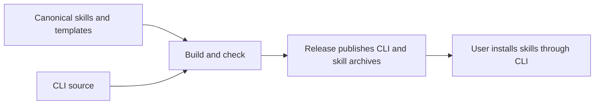

# Distribution Model Design

Model validation contract: model-document-v1

## Introduction and Goals

Distribution owns the complete path from canonical skills to generated target packages and safely installed project support. Installation is an internal responsibility of this model. The [proposal](../../proposals/2026-09-10-distribution-model-and-opencode-retirement.md) selects this combined owner, removal of superseded design sources, withdrawal of OpenCode support, removal of managed-state creation and automatic managed upgrades, explicit conflict replacement with `--force`, and bounded script retirement. The [owning change](../../changes/2026-09-10-distribution-model-and-opencode-retirement/change.json) holds exact subjects, reviews, evidence and activity.

This is a prospective contract. Transfer and support withdrawal take effect only through reviewed coordinated implementation and successful Verify. Existing owners retain their applicable contracts until then. Neither this Design nor its adoption authorizes publication or deletion of an existing user installation.



## Context and Scope

Maintainers author canonical skills and target templates; contributors generate and validate packages; users request target installation; Release consumes artifact identities and installation proof. External boundaries are public GitHub archive delivery, the package carrying trusted metadata, the user's filesystem and configured agent runtimes. Distribution does not authenticate human approval or certify that an agent follows prose.

Skill owns content, applicability, resources and public portability invariants. Design owns model conventions and withdrawn authoring invocations. Distribution materializes those contracts. Release owns publication authority, version decisions, public observations and publication recovery. Workflow, Review and Closeout, Test, Record Format and CLI retain their adopted coordination, assessment, proof-quality and engineering-record responsibilities. The shared CLI executable implements installation without merging its project installation state into the engineering record store.

The current supported target set after adoption is exactly `codex` and `claude`. OpenCode is a retired target, including its command aliases and older skills-only installation route. There is no new target, plugin marketplace, runtime service, generalized installer repair command, proxy dispatcher or separate Installation/Validation Execution model. Historical packages and judgments remain attributable to their original versions.

## Architecture Constraints

Canonical skill source remains `skills/`. Target templates remain authored inputs under `scripts/adapter_templates/`. Generated public bodies and archives are not tracked source; `dist/adapters/README.md` and `dist/adapters/manifest.yaml` remain the tracked support surface. Generated output never supplies canonical input to another generator.

Use the existing Python adapter builder/validator and Node installer. Preserve current archive names and integrity algorithms. Installation is decided by actual destination conflicts; project-root `rigorloop.yaml` and `rigorloop.lock` neither block nor authorize it and are not inspected or modified. There is no state format, reader or writer owned by the installer. Do not add a dependency or rename the internal adapter vocabulary merely to name the model Distribution. All closed target, schema, source, result and diagnostic vocabularies reject unknown values before consistency checks.

Model adoption is repository-local governance, not automatic customer activation. Package production grants neither local installation permission nor publication permission. Safe local fixture proof is sufficient for implementation; actual public release evidence remains Release-owned and cannot be replaced by fixtures.

## Requirements

| ID | Required behavior |
| --- | --- |
| DIST-SR-01 | Distribution MUST own the mapped package-generation and installation contract as one responsibility, referencing Skill, Design, Release and assessment owners without redefining their policy. Transfer MUST follow the exact source/consumer map and preserve original judgments. |
| DIST-SR-02 | Current target selection MUST accept exactly `codex` and `claude`. `init opencode`, its aliases, missing/unknown targets and removed `--adapter` syntax MUST reject before network acquisition, extraction, target or state writes. Diagnostics MUST identify supported target-native forms; a pinned old archive MUST NOT restore OpenCode installation in the current CLI. |
| DIST-SR-03 | Generation MUST derive the exact supported inventory from canonical skills, approved inclusion/transform decisions and thin target templates. Codex installs at `.agents/skills`; Claude Code at `.claude/skills`. Untransformed resources MUST retain raw bytes and all mapped dependencies; transformed bodies MUST preserve selected skill behavior. Unsupported frontmatter/runtime dependencies MUST be rejected or excluded with a manifest reason, not silently shipped. |
| DIST-SR-04 | The current support manifest MUST agree with generated inventory and version, name no active OpenCode target or alias, and contain no generated bodies. Generation MUST be deterministic for identical inputs. Current packages MUST contain the expected entrypoint and skill resources, without `.claude/commands` wrappers, OpenCode output, secrets or permission-broadening instructions. |
| DIST-SR-05 | Build/check operations MUST use temporary or explicitly selected package-output locations and MUST NOT create or synchronize an active project skill installation. The separate `.codex/skills` generator and its normal validation obligation MUST retire. Existing runtime directories MUST NOT be automatically deleted, copied over or treated as authored input. |
| DIST-SR-06 | Public distribution MUST supply separate versioned archives for each supported target through the Release-authorized channel; an optional combined archive MUST contain only the selected supported population. Archive/member inventory, checksums, source identity, generator identity and actual validation results MUST agree with recorded metadata. Generated expectations MUST NOT assert unexecuted validation success. |
| DIST-SR-07 | Both network and `--from-archive` installation MUST verify package-bundled metadata against its release index before trusting archive identity. Metadata MUST identify target, compatible release, filename, exact official URL, SHA-256, available size, expected roots, tree algorithm, hashes, counts and passing validation. Missing compatible metadata blocks; supplied archive paths MUST NOT provide a substitute metadata trust root. |
| DIST-SR-08 | Acquisition MUST use only the selected trusted official URL or the explicitly supplied local archive. Wrong filename, target, release, hash or declared size MUST fail before extraction. Extraction MUST reject absolute, empty, parent-traversing, drive-letter and unsupported symlink entries and unexpected out-of-root files; only the declared package support entrypoint may exist outside install roots and it MUST NOT be installed into the project; installed candidate hashes and file counts MUST match trusted metadata before success. Unrelated unmanaged files remain untouched and are excluded from candidate-only verification. Candidate hashing does not read or validate any recorded managed-tree basis. |
| DIST-SR-09 | `rigorloop-tree-hash-v1` MUST retain the representation below, including normalization, regular-file membership, path ordering and independent counts. Unknown algorithms MUST reject. Target root safety MUST be checked separately; excluding symlinks from a hash does not authorize writing through them. |
| DIST-SR-10 | After acquiring, verifying and staging the selected package, installation MUST preflight every destination unit before changing installed files. Without `--force`, any existing destination skill directory or declared standalone file MUST be reported as a conflict, including empty directories and byte-identical content. Report all discovered conflicts and stop without installing any units, even when other destinations are absent. |
| DIST-SR-11 | The CLI MUST reject `--write-state` before acquisition, extraction or filesystem mutation, including dry-run, pinned-release and local-archive forms. Installation MUST NOT create, update, migrate or delete managed state. Diagnostics MUST explain that only install-only operation remains; no hidden alias or upgrade flag may restore state writing. |
| DIST-SR-12 | Conflict scope MUST be each candidate skill directory and any explicitly declared standalone install file, not the shared `.agents/skills` or `.claude/skills` parent. Existing project-root `rigorloop.yaml` and `rigorloop.lock` MUST remain untouched and MUST NOT be read, validated or checked as installation admission markers. Their presence, absence, contents or version MUST NOT select behavior. Unrelated skills and files remain outside replacement scope. |
| DIST-SR-13 | `--force` MUST explicitly permit replacement only of conflicting destination units from the verified candidate. Replace each conflicting skill directory completely, including obsolete files, rather than overlaying its contents; replace a conflicting standalone file at its exact path. An existing regular file or directory at a selected unit path is replaceable, but shared parents and unrelated units MUST NOT be replaced. Help and results MUST name the replacement scope and warn that local changes inside replaced skill directories will be lost. |
| DIST-SR-14 | Both modes MUST retain archive integrity, destination containment and symlink protections. Unsafe or inaccessible destinations, symlinked ancestors/units or symlinks within a replacement tree MUST block; `--force` MUST NOT bypass these checks. Preflight the whole candidate and stage verified bytes before mutations. Recheck the selected filesystem basis before replacement, stop on intervening changes, and use exclusive creation for absent destinations. No automatic managed upgrade, state migration, retired-skill cleanup or full-project replacement is authorized. |
| DIST-SR-15 | Dry-run MUST report planned destination checks, potential conflicts and explicit `--force` replacements without downloading, extracting or changing project files. Distinguish preliminary checks based on bundled inventory from complete archive-verified conflict preflight; unperformed checks MUST remain visible. Real installation MUST report its full conflict set after package verification and before installed-file mutation. Human and JSON results MUST preserve applicable envelopes/exit classes, distinguish blocked/planned/actual replacements, and never claim state writes. |
| DIST-SR-16 | Network/proxy diagnostics MUST retain the safe fields and closed values below, with no extra network probes or programmatic proxy dispatcher. Local archive fallback MUST retain all verification. Secrets, credentials, raw proxy values, private hosts, usernames, request headers and machine-local archive paths MUST NOT enter durable state, generated packages or diagnostics. |
| DIST-SR-17 | Current generation, manifests, CLI help, package metadata, public guidance, CI selection, release candidates and installed smoke MUST agree on the two-target population. Historical three-target facts MUST remain unchanged and explicitly scoped. Current runtime rejection MUST precede any historical metadata selection that could otherwise reinstall OpenCode. |
| DIST-SR-18 | Required package proof MUST exercise real generated archives, trusted metadata and actual packed-CLI install-only operation for both supported targets, including default conflicts for identical/empty/existing destinations, whole-skill `--force` replacement, unrelated-file/state preservation, and rejection of unsafe destinations in both modes. Local helper success or dry-run alone MUST NOT prove the composed path. Release retains fresh public smoke and publication safeguards; retained integrity and protection against unauthorized data loss MUST survive. |
| DIST-SR-19 | Fully superseded source documents and the specifically obsolete scripts MUST be removed only after necessary meaning, decisions, current readers and protective proof are reconciled. Mixed sources retain explicit owners. Unknown consumers block affected removal; no blanket archive, test, directory or historical-record deletion is authorized. |
| DIST-SR-20 | Support withdrawal MUST be disclosed as a public compatibility break and consumed by Release versioning. Failed adoption MUST retain or restore a coherent source/consumer slice without rewriting published versions, old evidence or user state. Design approval alone MUST NOT claim source retirement, implementation or publication. |

## Solution Strategy

Keep one package-producing path and one explicitly requested installer path. `build-adapters.py` and `adapter_distribution.py` remain the package owners in code; remove the local mirror alternative rather than redirecting it into `.agents/skills`. Builds use output directories outside active installation roots, reject destinations that overlap canonical sources or active target roots, and never use build-time cleanup as an installer. `--check` performs generation and validation in temporary output, retaining support-manifest consistency without requiring tracked generated bodies.

Retain target descriptors for Codex and Claude Code; withdraw OpenCode from public dispatch and current generation. Retain only independently required historical release-evidence readers with identified consumers. They are separate from installation; neither historical evidence nor old project-state schemas reopen installer compatibility. Current archive production never recreates an OpenCode package; archived-version checks that require the old producer execute against their recorded source instead of a current OpenCode template.

## Building Block View

| Existing block | Selected responsibility and change |
| --- | --- |
| `scripts/adapter_distribution.py`, `build-adapters.py`, `validate-adapters.py` | Deterministic supported-target generation, portability, manifest parity, archives, structural/security checks and clean-install proof; retain these independent capabilities and remove current OpenCode generation. |
| `scripts/adapter_templates/codex/AGENTS.md`, `claude/CLAUDE.md` | Retain thin target guidance; use Codex `$skill` and Claude native slash-skill invocation without cross-target syntax claims. Retire `scripts/adapter_templates/opencode/AGENTS.md`. |
| `packages/rigorloop/dist/lib/adapters.js`, installer dispatch in `dist/bin/rigorloop.js` and its acquisition/extraction helpers | Retained descriptors, early retired-target rejection, trusted acquisition and filesystem mutation. No new installation entrypoint. |
| `packages/rigorloop/dist/lib/lockfile.js` and manifest safety readers | Remove installer state readers, schema branches, serializers, recorded-tree verification and managed migration/replacement orchestration. Retain shared candidate/archive hashing and independently required functions according to actual callers; a module filename alone is not a deletion criterion. |
| Adapter artifact reports, bundled metadata/index and current release profiles | Actual archive identities feed installer and Release. Current population is two targets; immutable historical documents keep their original populations. |
| `scripts/skill_validation.py` and canonical skill/resource maps | Retain content validation and resource integrity under Skill. Remove dependencies that exist solely for the local mirror; do not delete shared validators. |
| `scripts/validation_selection.py`, `scripts/ci.sh`, `scripts/release-verify.sh` and tests | Remove calls and check definitions for the retired mirror after transferring necessary package checks. Keep current package generation and actual installer/release proof. |

### Stable representations

| Surface | Retained representation and constraints |
| --- | --- |
| Target descriptor | `codex`: `.agents/skills`, `rigorloop-adapter-codex-<release>.zip`; `claude`: `.claude/skills`, `rigorloop-adapter-claude-<release>.zip`. Package entrypoints remain generated archive members; the CLI mutates only its declared installation roots, not project `AGENTS.md` or `CLAUDE.md`. |
| Support manifest | Existing version and skill inclusion/portable/reason fields remain. Portable means compatible with the current supported population. Omit the current `command_aliases.opencode` section; neither retained target generates command aliases. Unsupported target names or unexpected alias sections reject. |
| Archive evidence | Preserve YAML artifact report schema/version, source commit, release/date, generator command, canonical source, manifest reference, per-target archives/checksums/roots, validation command/result and timestamp. Release's immutable-candidate and observed-evidence separation takes precedence over any older prose treating generation as a pass. |
| Hash algorithm | Regular files only; exclude directories, symlinks, metadata/times/ownership, absolute paths, the lockfile and temporary files. Relative UTF-8 POSIX paths have no leading `./` or trailing `/` and sort lexicographically. Normalize generated text to UTF-8/LF and remove a BOM without trimming whitespace or semantic normalization; binary files retain raw bytes under the existing deterministic classification. Each file digest is SHA-256 of those bytes. Hash UTF-8 `rigorloop-tree-hash-v1\n` followed by sorted `<relative_path>\t<file_sha256>\n` rows. |
| Failure classes | Preserve successful exit 0; unexpected failure 1; unsupported target/installation context or recoverable missing metadata/network 2; archive/metadata/integrity verification 3; independently applicable configuration errors 4; mutation/file-type conflicts 5. Preserve current stable codes where applicable; retired OpenCode uses the current unsupported-target class with explicit retirement guidance, not a new successful no-op. Destination conflicts return blocked/exit 5 with their paths and `--force` guidance where replacement is safe. Unsafe-path errors remain blocking with `--force`. State files produce no installer diagnostic because they are not inspected. |
| Proxy diagnostics | Variable names only from `HTTP_PROXY`, `HTTPS_PROXY`, `NO_PROXY`, `http_proxy`, `https_proxy`, `no_proxy`; `node_env_proxy_status` is `enabled`, `disabled`, `unsupported`, `unknown`; `download_failure_class` is `dns`, `tls`, `timeout`, `http-status`, `proxy`, `network`, `unknown`. Include selected target/release, trusted public `archive_url` and verified local-archive fallback. Uncertain runtime capability is `unknown`; no claimed support based on guessing. |

### Destination conflicts and explicit replacement

An installation unit is one complete skill directory from the verified candidate, such as `.agents/skills/proposal`, or an explicitly declared standalone install file. Shared target parents may already contain other skills; their existence alone is not a conflict. Package support entrypoints outside installation roots remain uninstalled under DIST-SR-08. Project-root state files are unrelated content and receive no special inspection, even when they are malformed, unreadable or symlinks.

| Request and starting condition | Required result |
| --- | --- |
| All candidate destination units are absent | Install after package verification and complete destination safety preflight. |
| Any candidate skill directory/file exists, including empty or byte-identical content; no `--force` | List all discovered conflicts after archive verification and stop before modifying any installed unit. |
| Some units conflict and others are absent; no `--force` | Stop the entire installation; do not install the non-conflicting subset. |
| `--force` with safe existing destination units | Report their replacement, replace each conflicting skill directory/file completely from staged candidate bytes, and install absent units. Obsolete content inside replaced directories is removed. |
| A destination or its ancestor is a symlink, a replacement tree contains symlinks, or safe containment/access cannot be established | Block in both modes; do not follow symlinks or treat uncertainty as absence. |
| Unrelated skills, `.opencode` files, or project-root state paths exist | Preserve them; their presence does not constitute a destination conflict. Do not open or validate state files. |
| Any OpenCode install or `--write-state` request, including pinned/local/dry-run forms | Reject before acquisition and all writes; `--force` does not restore removed support. |
| Existing `.codex/skills` mirror | Build/check ignores it and never repairs it. Force installation affects only the selected target's candidate units, never that unrelated mirror. |

For example, a default install whose verified candidate conflicts with two installed skills reports:

```text
Installation stopped: destination skills already exist:
  .agents/skills/proposal/
  .agents/skills/design/

Run again with --force to replace these skills.
Local changes inside replaced directories will be lost.
```

The `--force` help text is: “Replace existing destination skills. Local changes within replaced skill directories will be lost.” The option applies consistently to both targets and network/local archive acquisition. An agent still needs applicable execution authority to invoke it; defining the option does not authorize replacement of this repository's installed skills.

Candidate `spec`/`architecture` skills and aliases remain invalid. Installed retired authoring entries retain the Design-owned inventory guard and exact-path diagnostic; `--force` does not delete noncandidate retired entries or perform a workflow-to-route migration. TNI-DES-01/06 inventory/preservation intent survives with this explicit transition; TNI-DES-02–05 managed-basis, state-writing and transaction obligations remain withdrawn. The earlier unconditional no-force, identical-no-op and state-marker rejection choices are expressly superseded by DIST-SR-10–15; their historical judgments keep their original meaning.

### Partial failure and retry

Use a per-unit detach-and-publish sequence, reusing the filesystem primitives in `managed-authoring-replacement.js` without its lockfile eligibility, state publication, recovery schema, scanner or rollback controller:

1. Verify and stage the complete candidate. Preflight every unit and capture an in-memory snapshot of its regular-file bytes, types and directory membership, plus the device/inode identities of the project root and destination ancestors. Reject symlinks or inaccessible entries. This is a snapshot of actual destinations, not a stored managed-tree basis.
2. Before detachment, allocate a private retention directory such as `<project>/.rigorloop-install-retained-<random>` outside `.agents/skills`, `.claude/skills`, `.codex/skills`, `.opencode` and every other explicitly configured skill discovery root. If safe non-discovery placement cannot be established, stop force replacement. Require the retention directory and selected unit to be on the same filesystem, and establish anchored access to both parents. Use descriptor-relative rename or an equivalent operation that keeps both inspected parent objects fixed; if the platform cannot supply this capability, reject force before moving existing content. The existing single-parent helper is a useful primitive, not proof of this two-parent extension. Then recheck the unit snapshot and ancestor identities. Pin the verified destination parent using the existing synchronous parent-as-working-directory pattern and perform basename-only operations against that pinned parent. Check that the pinned inode matches the inspected parent; never reopen a mutable ancestor path for deletion, publication or chmod.
3. For a force conflict, move the existing unit directly into a fresh unpredictable name in the anchored retention directory. Never detach to a sibling beneath a runtime skill root, even temporarily. The move detaches the old object without recursively deleting a public path. Inspect the detached object immediately against the captured snapshot. If a writer won the source race or any basis changed, retain that object, stop and report its location; do not publish over a new public destination or roll back over an independent change.
4. Publish the staged candidate using no-clobber operations: exclusive directory creation and atomic same-filesystem hard-link publication for staged regular files. Pin and check each parent before child operations. A destination that appears after preflight causes a conflict even under force; do not detach it as a second, newly authorized replacement. Recheck expected filesystem contents and ancestor identities between unit operations and verify candidate hashes/counts before reporting success. If the platform/filesystem cannot provide the required primitives, stop safely rather than fall back to overwriting rename/copy.
5. Retain detached originals in that outside-discovery directory after both success and failure. An already-open writer may continue writing an old inode after the last check; retaining the original preserves those bytes without claiming that external writers were excluded. Runtime exclusion comes from placement outside discovery roots, not hidden-name filtering or CLI/package inventory. Normal agent discovery must not encounter a retained `SKILL.md`; guidance identifies retained paths as originals, never another active installation. The report names each original destination and retained path; operator inspection and explicit cleanup are separate from installation. Do not automatically delete, parse or restore retained originals on retry.

The installer does not promise to prevent all concurrent writes. It stops on detected changes, preserves detached originals and uses no-clobber publication so a competing destination is not overwritten. A changed staged file, detached original or installed candidate observed during verification is a failure, not successful installation. A late write through an old open handle remains in the retained original; success describes the verified active candidate at the observation point, not perpetual filesystem immutability.

A failure stops further writes and reports completed, failed and untouched units, including detached or partial destinations and retained-original locations. Unrelated content and project state remain untouched; there is no filesystem-wide rollback or automatic recovery. Retry repeats full acquisition/verification and preflight: completed or partial public units conflict by default, and the caller must explicitly supply `--force` again for replacement. Private retained names supply no eligibility or state-repair authority. This bounded retention is filesystem preservation, not a managed-state format or recovery service.


## Runtime View

1. A contributor generates supported packages into temporary or explicit non-installation output. Validate canonical skill/resource meaning and package transforms, inventory, metadata and actual archives. A missing mapped resource or unsupported target blocks; do not create local runtime copies as part of validation.
2. Release consumes the verified identities under its own candidate approval and publication rules. Installer metadata derives from actual archive bytes. Changing the target population or package bytes invalidates any prior material candidate approval; final public proof remains separate.
3. A user requests `init codex` or `init claude`, optionally with `--force`. Parse target/flags and verify metadata trust. A dry-run reports preliminary plans and unperformed archive checks without acquisition or writes.
4. Acquire the selected archive, verify its identity and safe members, and stage its contents. Inspect every candidate destination unit. Without force, list all conflicts and stop before installed-file changes. With force, list replacements; safety failures still block the entire preflight.
5. Install absent units and, only with `--force`, completely replace selected conflicting units. Recheck destinations, preserve intervening changes and verify installed candidate hashes/counts. Report actual results or bounded partial failure. Never inspect or write installation state files.


## Deployment View

Python generates packages in repository or CI scratch output. The Node CLI carries executable code and trusted metadata, not canonical skill bodies or bundled adapter ZIPs; archives remain Release assets. Installed targets operate in existing user environments. Neither supported agent runtime nor live network/credentials is required for ordinary structural/package fixtures. Real public release smoke remains separately authorized.

The first release adopting OpenCode withdrawal and removal of `--write-state`/managed upgrades and the new default conflict/explicit-force behavior is compatibility-breaking under REL-SR-02. Do not choose or publish its version here. Current candidate metadata must be regenerated coherently for the selected release; historical archive reports, published bytes and recorded-source validators keep their original identities. Do not backfill old releases with a two-target support claim.

## Crosscutting Concepts

### Source displacement and preservation

The five spec families below are selected for full source retirement, each with its matching `.test.md`: `skill-invocation-commands-for-adapters`, `stop-tracking-generated-public-adapter-skill-bodies`, `target-native-init`, `multi-adapter-init-and-proxy-aware-download`, and `rigorloop-cli-lockfile`. This selects ten files, not their operational fixtures, proposals, plans or historical review records. Numbered ranges include lettered subclauses. The disposition below reconciles superseded commands/schema versions before transferring meaning; no old command is restored by its historical ID.

| Selected source clauses | Destination or explicit disposition |
| --- | --- |
| Target-native TNI-R1–13, R29–35, R92–94 | DIST-SR-02–04/15/17: retained target-native commands, roots, no aliases/removed syntax, clear manual/pinned automation guidance. OpenCode operations and three-target lists explicitly superseded by the two-target population. |
| TNI-R14–28, R50–85 | DIST-SR-10–15 replace state interpretation, selected ownership/drift checks, schema definitions, state writing/migration and successful managed/disjoint installation with destination-conflict checks and explicit `--force` replacement. Preserve no-write/dry-run and applicable result envelopes; no historical state schema remains an installer input. |
| TNI-R36–49, R86–91 | DIST-SR-07–09/18 and Release REL-SR-08/09/13: trusted metadata/archive/install verification and actual packed/public smoke for supported targets. The prior three-target smoke population is superseded prospectively; historical smoke judgments remain unchanged. |
| TNI-DES-01–06; E-DES-01–06; BND-INPUT/STATE/AUTH/COMPOSE/TEMPORAL/RECOVERY/COMPAT/ENV-001 and INT-001–003 | DIST-SR-13/14 preserve candidate/installed inventory guards for supported projects, user content and unmanaged inspection/backup. Managed original-basis interpretation, replacement, state writes and transaction/retry paths are withdrawn. Destination conflict handling replaces managed-project interpretation; historical IDs and judgments retain their meaning. |
| Multi-adapter MAI-R1–16, R39–46 including subclauses | DIST-SR-02–05/12/17: descriptors and retained roots survive; `--adapter` already retired by TNI. OpenCode installation, aliases and skills-only fallback now explicitly withdrawn; legacy project-root interpretation is withdrawn; project state is not inspected. |
| MAI-R17–38 | DIST-SR-07–09 and representation table: metadata trust/index, compatible releases, exact official URLs, local fallback, identity/size/hash/path checks, passing metadata validation and installed counts. OpenCode alias metadata is historical read-only evidence. |
| MAI-R47–76 | DIST-SR-10–15 supersede state creation, updates, migration, schema parsing, selected recorded-root checks and successful compatibility operations. State contents are irrelevant; default destination conflicts preserve all installed files, and force replaces only declared candidate units. |
| MAI-R77–95 | DIST-SR-15–18: safe network diagnostics and existing output/flags; generated temporary-output proof and no hand edits. Supported-target changes do not relax integrity or privacy. |
| Lockfile R1–23 (including R17a–h, R18a–i and R23a–k) | DIST-SR-07–12/15 retain candidate metadata trust and delivery-mode truth while withdrawing installer lockfile shapes, strict state parsing, recorded identities, all writing/serialization and managed-project success. State files are neither read nor used as admission markers. |
| Lockfile R24–33 | DIST-SR-09 retains candidate tree hashing: normalized bytes, canonical framing, ordering and regular-file membership. Recorded manifest/tree verification is no longer an installer operation; retain shared hashing only for independently needed callers. |
| Lockfile R34–53 including R45a–e | DIST-SR-10–15 preserve no-write reporting and filesystem conflict protection. State-field validation, recorded-basis drift checks, state mutation and managed replacement all retire. No state-presence guard or schema diagnosis remains; file conflicts and explicit force scope determine installation. |
| Lockfile R54–66 | DIST-SR-15/20: stable init output/exit classes, no obsolete pending-approval warning, package-local and installed execution, project-state presence does not affect eligibility and publication is independent. Default identical-install no-ops are superseded by conflict rejection; `--force` selects explicit replacement. |
| Adapter invocation R1/2/14, R28–30, R35–39, R43/46/47 | DIST-SR-03/04/15/18 and Skill: canonical ownership, deterministic supported output, Claude native skill invocation without command wrappers or unsmoked one-shot claims, target-specific guidance, no ordinary installed-agent requirement and useful diagnostics. OpenCode portions of shared documentation clauses are withdrawn. |
| Adapter invocation R3–13, R15–27, R31–34, R38, R40–42/R44/45/48 | OpenCode current generation/alias/support obligations are superseded by DIST-SR-02/04/17. Exact v0.1.1 smoke, release-note and patch-only decisions remain historical; they do not classify this breaking withdrawal as patch-level. Preserve historical metadata validators and evidence consumers where still exercised. |
| Archive-install R0–2, R9–13, R25/31, R42, R46–50 | Preserve v0.1.2 compatibility-window and v0.1.3 untracking/public-archive history under DIST-SR-06/17/20; no repeat of completed releases or retroactive invalidation. Named historical release and measurement evidence stays in place. |
| Archive-install R3–8, R14–24, R26–41 including R15a–d/R41a–g, R43–45/R51 | DIST-SR-03–08/17–19: authored-once, complete supported packages, tracked support only, temporary generation, metadata/checksums/source identity, exact current navigation and release composition. OpenCode population/alias requirements are explicitly superseded. Current package changes must use actual builders and validators. |
| Archive-install R52–57 | Retain applicable measurement authority at `specs/token-cost-measurement-baseline-and-proposal-scope-preservation.md` and `specs/release-token-friendliness-benchmark-for-skills.md`, with `single-authored-skill-source-generated-output.md` R61–66 for source selection. These v0.1.3 historical report obligations do not introduce a new report/benchmark gate for this initiative. |
| Archive-install R58–68 | DIST-SR-19/20 and Test: no history rewrite, unrelated skill optimization or ledger move; preserved cross-source, metadata, archive and tracked-fragment protection. Concrete allocation belongs to Delivery; no new standalone test specification is created. |

All five sources' unnumbered goals, glossary, inputs/outputs, state/invariants, error/compatibility, privacy, UX/performance, examples, edge cases and acceptance lists follow the corresponding outcomes above. Preserve no-write/dry-run, wrong archive, missing metadata, traversal/symlink, size/count/hash, unknown package-field/value, unmanaged file conflicts, partial failure, proxy secrecy and unsupported-target behavior. Linear archive/tree work and no unrelated-root reads remain quality constraints. OpenCode positive installation/alias examples cease to specify current behavior and gain explicit rejection/preservation outcomes. Their Status, Readiness, Next and Follow-on sections and appended prospective stage-owned lifecycle notices are historical authoring evidence, not current workflow instructions. Workflow, Record Format and Review and Closeout retain current lifecycle/settlement policy; no retired stage-owned format is restored.

The matching test-spec requirement maps, cases and fixture/mocking sections retain proof intent through DIST-SR-07–19 and the scenarios below: use real temporary filesystem/archive/metadata paths, do not mock a validator into success, keep independent hash oracles and real packed install, and use safe external substitutes for automated network checks. OpenCode and managed-state/upgrade success cases become historical validation or current rejection/state-preservation coverage according to their actual consumer. Positive compatibility tests and tests exclusive to old state parsing, recorded-tree verification, writers, schema migration or automatic replacement retire with those capabilities. Proof that project state is untouched and does not affect destination decisions replaces schema/marker permutations; preserve shared candidate hashing, archive integrity, containment and package proof. Exact old milestone commands and manual publication schedules are not universal obligations; useful tests cannot be removed just because their test-spec file is retired.

### ADR and mixed-source dispositions

| File or exact section | Disposition at coordinated implementation |
| --- | --- |
| `docs/adr/ADR-20260424-generated-adapter-packages.md` | Remove. DIST-DEC-01/02 preserve authored-once, thin templates, deterministic manifest and generated-from-canonical rationale. Tracked public output was superseded by archive installation; separate local mirror preservation is explicitly superseded now. |
| `docs/adr/ADR-20260513-v0-1-3-adapter-release-archive-install-surface.md` | Remove. DIST-DEC-02 preserves compatibility-window reasoning, archive-only public installation, temporary validation, complete packages and immutable history; historical measurement/source decisions retain the named measurement owners. |
| `docs/adr/ADR-20260516-rigorloop-cli-lockfile.md` | Remove. DIST-DEC-03 and DIST-SR-09–15 preserve candidate integrity, delivery-mode truth and bounded replacement and filesystem safety. State input parsing, recorded identity verification, writing and serialization are expressly withdrawn. Old schema/command choices retain historical meaning. |
| `docs/adr/ADR-20260518-multi-adapter-init-and-proxy-download.md` | Remove. DIST-DEC-03/04 preserve descriptors, Codex root, trusted local fallback, no npm-bundled ZIPs, safe diagnostics and no new Undici dispatcher. OpenCode support and all project-state interpretation/writing are superseded within the selected installer population. |
| `docs/adr/ADR-20260524-target-native-init-state-boundary.md` | Remove. DIST-DEC-03 preserves target-native syntax and real install proof motivated by the v0.2.0 dry-run gap. Explicit state creation and schema interpretation are now withdrawn; destination conflicts and `--force` replace prior state-marker rejection. No hidden `--adapter` alias or full internal-name rewrite returns. |
| Mixed architecture: `Level 2 White-Box: RigorLoop CLI Package` | Transfer installer descriptor/acquisition/proxy/extraction/manifest/lockfile/mutation bullets and their introductory install responsibility here; retain the command parsing/output-envelope bullet and broader executable delivery boundary with a Distribution reference. |
| Mixed architecture: `CLI target-native init, download, state, and release-smoke flow` | Replace the complete 17-step subsection with Distribution Runtime and Release references. Shared command envelope and npm package responsibility remain with their existing owners. |
| Mixed architecture: `Generated output` | Replace its two paragraphs with Distribution's source/package boundary and a concise explicit v0.1.2/v0.1.3 historical note; no active local-mirror regeneration obligation survives. |
| Mixed architecture: `Release and adapter evidence` | Replace the first paragraph's current package-evidence definition with Distribution/Release references. Retain the second and third paragraphs as named-version history. |
| Mixed architecture: `CLI package, project scaffold, and lockfile boundary` | Transfer paragraphs beginning “For `0.3.0`”, “The generated project manifest”, “`rigorloop.lock`”, “State write ordering”, “The CLI updates”, “Local archive mode” and “Network archive download”. Retain opening package boundary, the two `new-change` paragraphs and final named-version npm history, with current install/smoke references to Distribution/Release. |
| Mixed architecture navigation and Architecture Decisions | Replace current links/summaries for the five removed ADRs and five spec families with Distribution; preserve the complete historical Follow-on artifacts section and unrelated diagrams/prose. No diagram is selected for deletion solely because it mentions an adapter. |
| `specs/single-authored-skill-source-generated-output.md` | Retain mixed measurement and historical migration authority. At adoption, R2/10–17/68/71 no longer mandate a separate local mirror; DIST-SR-05/18/19 replace that capability/proof. R1/3–5/18–42/49–60/67/69/70/72/73 refer to Distribution for current delivery with Skill content ownership; R47's approved support-change exception applies. R6–9/43–48 historical sequence and R61–66 measurement/source semantics retain their original scope. |
| `specs/multi-agent-adapters-first-public-release.md`, `public-adapter-artifact-migration-examples-concise-skill-release.md`, their tests and CLI package/init spec/ADR | Retain named-release, measurement, packaging/envelope and other mixed remainders. Current distribution/installation references resolve through this map and the new-profile ownership notices; historical three-target release judgments stay unchanged. They cannot mandate current OpenCode output or the retired local mirror. |
| `specs/published-skill-first-repository-simplification.md` | Retain its bounded operational remainder, existing Test exception and Release R7/R8 transfer. Current supported-target/package claims consume Distribution; this does not retire shared check selection or grant a general test-retirement exception. |

The selected source removal is ten spec/test-spec files and five ADRs. No other source deletion is implied. Historical activation inventories and operational baseline paths remain unchanged where they name original subjects; current validation must distinguish those identities from live navigation. If an actual reader of a selected source needs its bytes rather than transferred meaning, reconcile that reader or retain the exact source with a named unresolved need before removal.

### Script retirement and consumer reconciliation

| Surface | Exact selected outcome and protection |
| --- | --- |
| `scripts/build-skills.py` | Remove the standalone mirror producer, including its default `.codex/skills` and arbitrary mirror-output modes. No forwarding wrapper. Current canonical validation plus supported adapter generation supply necessary production/proof. Preserve unknown-value rejection and raw mapped-resource integrity in their actual owners. |
| `scripts/test-build-skills.py` | Remove only after its useful independent byte oracle, complete resource inventory, missing/stale resource failures and malformed generated-skill detection are represented in `test-adapter-distribution.py`/`test-skill-validator.py` against retained production paths. Mirror-specific CLI/default-output assertions retire with the capability. No claim that existing tests already provide equivalent protection. |
| `scripts/adapter_templates/opencode/AGENTS.md`; current OpenCode alias rendering/descriptor branches | Remove template and current producer/installer branches together. Retain only explicitly bounded independently required historical release-evidence parsing, not reusable current OpenCode production. |
| `build-adapters.py`, `validate-adapters.py`, `adapter_distribution.py`, CLI acquisition/lockfile helpers | Retain shared acquisition, package metadata parsing and candidate hashing. Remove readers, schema branches, recorded-tree verification, writers and positive tests exclusive to withdrawn project-state compatibility, along with their callers. Inspect actual function consumers before deleting a whole helper module; this Design does not claim that caller audit has already run. Amend the current target domain and actual affected consumers. A thin entrypoint remains useful when it offers an independent supported operation; filename age is not a retirement reason. |
| CI, validation selectors and release verifier | Remove `skills.generation_regression`/`skills.drift` mirror commands where they exclusively invoke the retired scripts. Supported package checks inherit necessary protection; historical check records retain their IDs/results without a fake pass alias. Reconcile selectors and command-manifest tests, including deleted-path selection, so no stale executable call remains. |
| Current README/package README, install guide, contributor governance, workflows and canonical skill guidance | Teach only current supported targets, archive/install paths and retained builder usage. Remove active OpenCode invocation examples, local mirror regeneration, state-conflict reporting and `--write-state`/managed-upgrade instructions and two-independent-model guidance; preserve explicitly historical statements. Skill method and customer permissions remain unchanged. |
| Release profiles, schema/metadata readers, fixtures and candidate builders | Reconcile current target validation, archives, public smoke and metadata together under Release. Inspect history-aware checks separately; do not shrink all historical target lists globally. No hardcoded version switch or fabricated checksum is introduced. |
| System, Skill and Design | Apply reciprocal model amendments in this package. Design's TNI-DES references resolve through Distribution's explicit preservation and supersession map after adoption; Skill's content/resource invariants stay unchanged. |
| Follow-up register FU-013 | Route records the combined owner and completed scope only when implementation and Verify establish adoption. Do not close FU-012, FU-014 or other consolidation work. |

### Boundary scan and acceptance scenarios

| Dimension | Requirement basis | Distinct outcome to demonstrate |
| --- | --- | --- |
| Input domain | DIST-SR-02, DIST-SR-04, DIST-SR-07, DIST-SR-08 | Missing/unknown/retired target, removed syntax, invalid metadata, wrong archive and unknown closed values reject at the public boundary before prohibited effects. Both supported targets succeed with matching trusted inputs. |
| State/lifecycle | DIST-SR-10, DIST-SR-11, DIST-SR-12, DIST-SR-15 | State presence, absence or malformed contents never select installation behavior and files stay untouched. Existing candidate units conflict even when identical or empty. No-force preflight installs nothing if any unit conflicts. Force replaces only candidate units. |
| Identity/authority | DIST-SR-01, DIST-SR-06, DIST-SR-07, DIST-SR-13, DIST-SR-14 | Archive identity and installed candidate hashes agree. Force scope is the exact verified candidate units, with explicit local-change-loss guidance. Shared target parents and unrelated skills cannot be replaced; no lockfile identity supplies replacement authority. |
| Composition/path | DIST-SR-03, DIST-SR-05, DIST-SR-17, DIST-SR-18, DIST-SR-19 | Actual builder-to-archive-to-packed-CLI path installs complete mapped resources for both targets. No build creates `.codex/skills` or active installation output; a stale Release/CLI/manifest target list fails despite passing local helpers. |
| Temporal/retry | DIST-SR-09, DIST-SR-11, DIST-SR-13, DIST-SR-14 | Generation remains deterministic. A repeated default install reports conflicts, including identical destinations. Force replaces complete skill trees and removes obsolete files. Ancestor/source races and a new destination after detachment stop writes without clobbering the competing object. Late open-inode writes survive in retained originals outside discovery roots; no intermediate or failed step leaves a discoverable duplicate skill. After partial failure, retry preflights again and requires explicit force for existing public units. |
| Failure/recovery | DIST-SR-08, DIST-SR-13, DIST-SR-14, DIST-SR-15, DIST-SR-16 | Wrong archives, unsafe destinations, symlinks and inaccessible paths block in both modes. A known preflight conflict without force leaves every unit unchanged. Mid-operation failures report actual completed/detached/partial/untouched units and retained-original locations without claiming rollback or success. Unavailable two-parent anchoring, cross-filesystem retention or unsafe discovery placement blocks force before detachment; interrupted operations retain originals outside discovery roots. |
| Compatibility/migration | DIST-SR-02, DIST-SR-12, DIST-SR-17, DIST-SR-19, DIST-SR-20 | Both targets install regardless of unrelated state files. No old-state parser or marker guard is invoked. Current OpenCode installs still reject, unrelated OpenCode content survives, and historical release facts remain unchanged. Removed helper consumers are reconciled. |
| External/environment | DIST-SR-07, DIST-SR-08, DIST-SR-15, DIST-SR-16, DIST-SR-18 | Local fallback verifies against bundled metadata without trusting a supplied manifest; proxy failures disclose only safe fields. Actual public success requires Release's observations, not fixture or dry-run evidence. |

Material combined hazards are a two-target producer with a three-target consumer; pinned/local retired-target dispatch; using shared parent existence as a conflict; copying non-conflicting skills before discovering a later conflict; force overlay leaving obsolete files; symlink or concurrent-write bypass under force; unrelated state influencing admission; a missing resource hidden by mirror-test retirement; and source deletion leaving live readers. Observe real command dispatch, archive members, installed filesystem and state bytes, result classes and resolved owner references. These are representative outcomes, not an exhaustive whitelist for tests. Test criteria govern additional protective cases; Delivery owns concrete groups and execution allocation.

## Architecture Decisions

| ID | Context and decision | Alternatives and consequences |
| --- | --- | --- |
| DIST-DEC-01 | One Distribution responsibility covers package production and safe installation, with explicit internal trust/write boundaries. | Separate models repeat the archive/root interface before an independent ownership need exists; one undifferentiated builder/installer confuses output generation with write authority. Keep separate operations inside one contract. |
| DIST-DEC-02 | Retire the local mirror producer and use the supported adapter pipeline; preserve authored-once and archive-only public delivery. | Hand-authored target copies and generated-from-generated packages create competing truth. Keeping both active runtime copies repeats the observed discovery ambiguity. Redirecting a build into `.agents/skills` would make builds mutate user installations. Historical compatibility-window and former mirror-preservation choices retain their original reasons but no current production mandate. |
| DIST-DEC-03 | Default installation rejects every existing candidate unit; explicit `--force` completely replaces conflicting skill directories/files. Ignore project state and preserve unrelated content. | Identical-file no-ops hide the existence-based boundary; overlays leave obsolete files; state parsing or marker rejection adds an unrelated admission rule. Force is explicit filesystem replacement, not a managed upgrade or safety bypass. Packed archive/install proof remains required. |
| DIST-DEC-04 | Retain trusted package metadata for both network and local acquisition, descriptors, existing roots and safe Node proxy diagnostics. | Bundled ZIPs duplicate release artifacts; user metadata weakens trust; moving Codex roots adds migration without value; a new proxy dispatcher adds credential handling. Local fallback changes delivery, not the trust root. |
| DIST-DEC-05 | Withdraw OpenCode completely from current operations; retain only independently required historical release-evidence reading. | Continuing pinned/skills-only installation would preserve hidden support; treating old state as disposable risks data loss; project state stays untouched and has no admission role. Earlier read-only compatibility and marker-rejection designs retain their original judgments but are superseded by explicit destination-based installation. |
| DIST-DEC-06 | Remove fifteen fully superseded design sources and two obsolete mirror script/test files only with complete meaning and protection transferred. | Automatic archive copies preserve duplicate reading burden; deleting every adapter-related file loses operational readers and named-release evidence. Retain mixed remainders explicitly and test actual consumer corrections. |

## Quality Requirements

A contributor can locate supported commands, trust rules, conflict reporting and bounded partial-failure behavior here without reconstructing deleted sources. Review checks the clause/decision transfer and precise historical exceptions. Archive generation, tree hashing and validation remain proportional to selected bytes/files; do not scan unrelated runtime trees or introduce numerical performance claims. Diagnostics distinguish caller error, unsupported/retired input, integrity failure, configuration failure and mutation conflict without sensitive content. No graphical UI is introduced.

Independent semantic assessment and concrete protective proof are both necessary. Removing the mirror's seven tests is not evidence that equivalent checks exist elsewhere; demonstrate the complete resource/invalid-output detection against retained production. External fixtures may substitute the archive server and public services, but not the validator whose protection is claimed. No real publication or customer installation is needed to author or implement this change.

## Risks and Technical Debt

Force replacement removes local changes and obsolete files from each selected active skill directory; detached originals are retained at reported private paths outside supported discovery roots for separate operator inspection and cleanup. Its help and reported scope must make that effect clear. Existing state files remain unchanged and may no longer describe the replaced skills; the installer does not reconcile or claim consistency for them. Default repeat installs now conflict even when bytes match. Complete preflight, staged candidates, anchored detach/no-clobber publication, retained originals and honest partial-failure reporting protect the supported operation without a persistent state manager or filesystem-wide transaction.

The retained mixed source families still contain measurement, first-release and CLI-package obligations; their owner notices must stay precise. Source identity drift requires applicability assessment, not retargeting prior review. Scope does not include remaining validation/observability model extraction or a new release.

## Next artifacts

Independent Design Review of Distribution, System, Skill, Design, Release and the scoped mixed-source notices, including the exact retirement and consumer map. The revised proposal requires renewed independent Proposal Review; prior approvals do not cover destination-based conflicts and explicit force replacement. After the applicable reviews, Delivery allocates conflict preflight and explicit force replacement, removal of state interpretation, writers and managed upgrades, OpenCode withdrawal, mirror retirement and source cleanup with retained protective proof. Source/script removals and generated output changes occur only in reviewed implementation.
