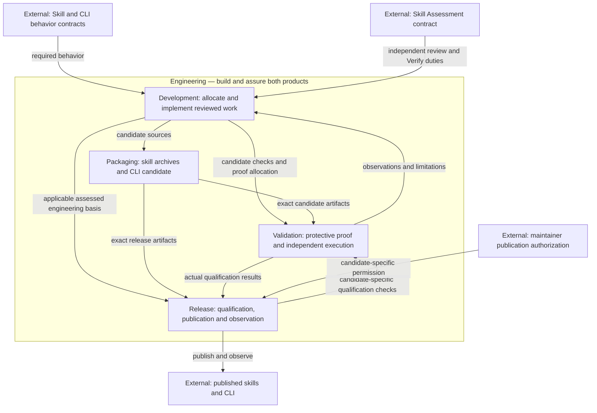
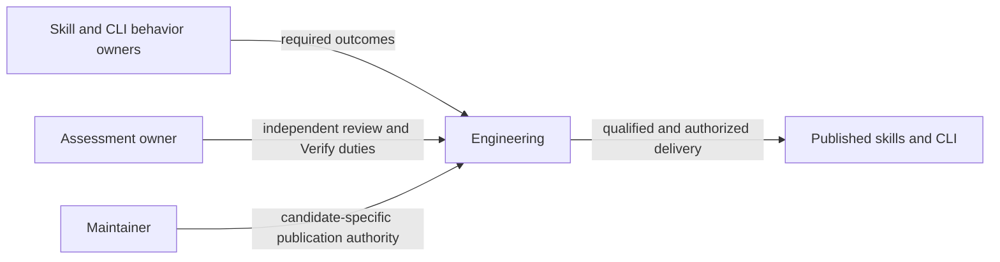
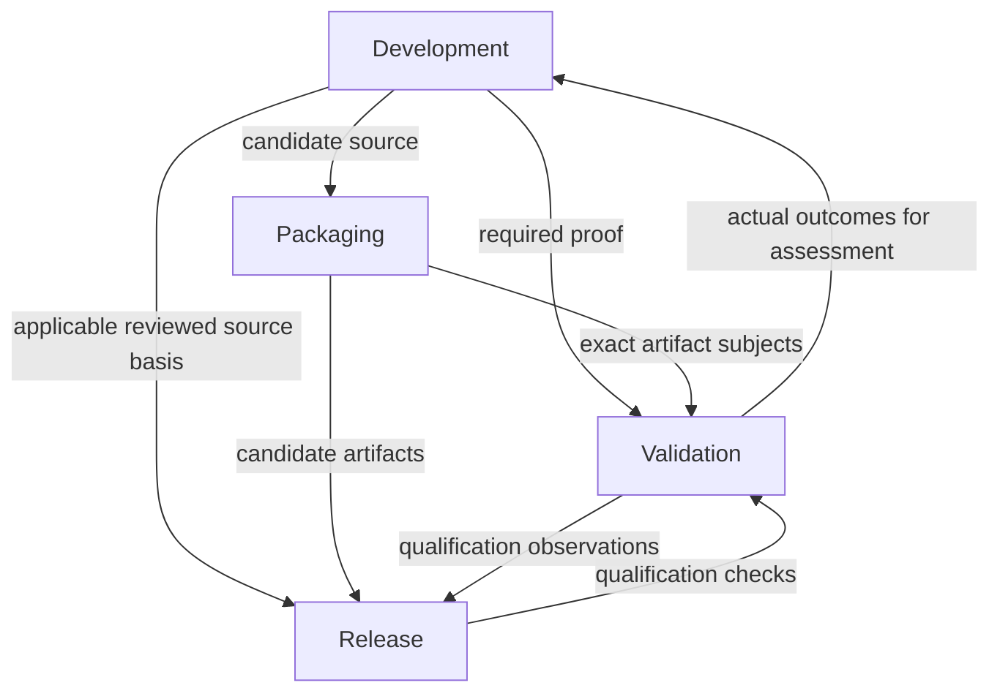
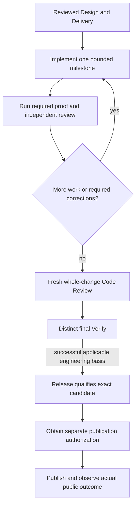
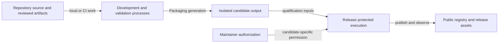
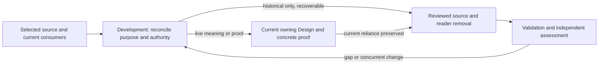

# Engineering Model Design

Model validation contract: model-document-v1

Owning change: [current-design repository cleanup](../../changes/2026-09-13-current-design-repository-cleanup/change.json).

Original composition adoption: [three-model reconciliation](../../changes/2026-09-12-unified-validation-model/change.json).

Prior refinement: [independent parallel tests](../../changes/2026-09-13-independent-parallel-tests/change.json); its selected behavior and evidence retain their own scope.

## Introduction and Goals

Engineering owns how this repository builds, proves and delivers high-quality published skills and the CLI. It uses RigorLoop's published behaviors as development tools while retaining an independent assessment of the candidate. System defines the product composition; Skill and CLI define what the delivered products must do.

## Context and Scope

Inputs are authorized product direction, exact affected contracts, the selected development tool basis and repository sources. Outputs are implemented candidates, attributable validation and assessment evidence, distributable packages and authorized public release observations. No hosted agent runtime, third customer executor product or automatic external action is introduced.

| Submodel | Owner | Product contribution |
| --- | --- | --- |
| Development | [Development](#development) | Plan and implement the product using its behaviors, obtain independent assessment and maintain a resumable basis. |
| Validation | [Validation](validation.md) | Useful proof, isolated execution, bounded concurrency and truthful results without a validation cache. |
| Packaging | [Packaging](packaging.md) | Reproducible skill archives, CLI package composition and installer metadata. |
| Release | [Release](release.md) | Candidate qualification, publication authority, observed public identity and recovery. |

## Architecture Overview

### Subsystem design graph

Engineering owns these four children's composition under [System's parent graph rule](../system.md#parent-graph-ownership); the submodel table links each contract. Development performs repository work using published behaviors and obtains independent assessment under Skill Assessment. Validation reports proof; assessors judge it. Release consumes an applicable engineering basis, qualifies its exact candidate and retains separate publication authority. Feedback edges describe interactions, not permission to bypass milestone reviews, final Code Review or Verify. Internal Validation execution belongs in Validation, and artifact formats remain in Packaging.

[Skill](../skill/skill.md) and [CLI](../cli/cli.md) own behavior inputs; [Assessment](../skill/assessment.md) owns independent judgment policy. [Integrated operation and failure](#integrated-operation-and-failure) owns the end-to-end cooperation and exception paths; [Deployment and maintenance](#deployment-and-maintenance) owns the repository execution context.

### Supporting-view decisions

| View | Necessity and reason | Owning detail |
| --- | --- | --- |
| Context | Necessary: Product contracts, assessment policy, maintainer permissions and public products bound engineering work. | [Context view](#context-view) |
| Building Block | Necessary: Development, Validation, Packaging and Release compose distinct implementation, proof and delivery responsibilities. | [Building Block view](#building-block-view) |
| Runtime | Necessary: Implementation, independent assessment and publication cannot be treated as one successful command. | [Runtime view](#runtime-view) |
| Deployment | Necessary: Local/CI execution, candidate roots and protected release jobs have distinct resource and authority boundaries. | [Deployment view](#deployment-view) |

## Architecture Constraints

Canonical skill content remains in `skills/`; executable source remains under `packages/rigorloop/`. Repository scripts implement development validation and package production; hosted CI delegates to them. Shared criteria can be referenced by published capabilities, but repository-specific operations are not a customer prerequisite. Original adoption and historical review identities remain scoped to their actual subjects.

## Architectural supporting views

These views elaborate the overview at the owning model boundary. Existing detailed contracts, scenario tables and external owners retain their authority.

### Context View

Product contracts, assessment policy, maintainer permissions and public products bound engineering work. Detailed requirements and scenarios in this model remain authoritative.

### Building Block View

Development, Validation, Packaging and Release compose distinct implementation, proof and delivery responsibilities. Detailed requirements and scenarios in this model remain authoritative.

### Runtime View

Implementation, independent assessment and publication cannot be treated as one successful command. Detailed requirements and scenarios in this model remain authoritative.

### Deployment View

Local/CI execution, candidate roots and protected release jobs have distinct resource and authority boundaries. Detailed requirements and scenarios in this model remain authoritative.

## Requirements

| ID | Required behavior |
| --- | --- |
| ENG-SR-01 | Engineering MUST realize and assess the Skill and CLI product contracts using the Development, Validation, Packaging and Release submodels; it MUST reference product behavior rather than redefine it. |
| ENG-SR-02 | Development MUST identify the approved product subjects, active work and required reviews before implementation, use bounded milestones and route a behavioral gap to its owning Design. |
| ENG-SR-03 | When developing RigorLoop with RigorLoop, Development MUST distinguish the tools and skill versions used to perform work from the candidate under assessment. Candidate self-use alone MUST NOT establish correctness or independent approval. |
| ENG-SR-04 | Repository work MUST retain actual implementation evidence, required milestone reviews, fresh independent whole-change Code Review and distinct final Verify under the Skill Assessment contract before governed closeout is claimed. |
| ENG-SR-05 | Validation MUST derive protective checks from product contracts, execute isolated cases with bounded shared parallelism, report actual results and limitations, and remove validation-result caching under its exact cleanup map. |
| ENG-SR-06 | Packaging MUST produce the supported skill archives and CLI npm candidate from canonical sources in isolated output, preserving their declared contents, identities and common interface without mutating active skill installations. |
| ENG-SR-07 | Integrated proof MUST assess generated/packed skills and the actual candidate CLI at their documented command, resource, record and installation boundaries; independent local passes MUST NOT substitute for compatibility evidence. |
| ENG-SR-08 | Release MUST qualify an exact candidate, obtain required external authorization, publish only that candidate and record observed public outcomes and recovery limitations. Local validation and engineering closeout MUST NOT supply publication authority. |
| ENG-SR-09 | A failed check, inconsistent contract, changed evidence basis or interrupted operation MUST return to the affected owner with its actual state preserved. Corrections MUST receive affected reassessment before renewed reliance. |
| ENG-SR-10 | Source retirement MUST preserve stable requirements, decisions, useful negative/regression proof and historical record identities, reconcile actual readers and remove superseded sources and exclusive machinery. Unknown live consumers MUST block their affected removal. |
| ENG-SR-11 | Repository engineering procedures MUST remain contributor/governance content. Published skills MUST NOT require this repository’s executor, paths or internal record identities for ordinary customer use. |
| ENG-SR-12 | The three-model transfer MUST include coherent Skill/CLI instructions, recording and package consumers, and the selected no-cache/source cleanup before adoption. Design authoring MUST NOT claim implementation, final Verify or customer activation. |
| ENG-SR-13 | Development MUST reconcile the exact retirement set, baseline identities, surviving obligations, current consumers and justified retention in change-local evidence. Current claims and open work MUST remain self-contained. Historical-only sources MAY be deleted after recoverability and current-reliance closure; a tracked citation, successful old review or retired filename alone MUST NOT decide current applicability. |
| ENG-SR-14 | Cleanup MUST remove selected superseded sources and exclusive readers together, preserve uncommitted and unrelated files, and re-evaluate any changed source or newly discovered consumer before its removal. Retained fixtures MUST prove current behavior independently of archived production records. Final closeout MUST account for every selected family and actual residual exceptions; an inventory-only result is insufficient. |
| ENG-SR-15 | Complete spec retirement MUST account for all baseline specs and the full repository test/fixture population, including embedded data and generators. Retain, refine or remove each assessed family with its current owner, protective purpose and consumer disposition; unresolved required knowledge or proof blocks completion. A family inventory alone MUST NOT stand in for assessment of its cases. |

## Development

Development applies Skill Workflow, Authoring, Implementation and Assessment. It records which installed or checkout tools performed work and which source/package identities are the candidate. For this repository, `node packages/rigorloop/dist/bin/rigorloop.js` is a checkout entrypoint; its use is not evidence that the candidate CLI is correct. Candidate tests exercise the actual relevant package/record/installation boundary with independent assertions.

The approved proposal and exact affected Designs feed a stable delivery plan and independent Delivery Review. Implementation proceeds through bounded milestones, recording commands actually run and outcomes. A non-final milestone review can permit the next allocated milestone; final whole-change Code Review remains fresh and distinct from Verify. A specification gap returns to Authoring, a test defect to its implementation owner, and an assessor's finding remains with that assessor for disposition.

## Validation

[Validation](validation.md) is the sole owner of reusable proof criteria and repository check execution. Its [structural graph](validation.md#structural-design-graph) and [invocation flow](validation.md#invocation-flow-graph) explain the internal check pipeline and canonical check composition. Skill capabilities consume the reusable criteria under their applicability; this repository's plan allocates the concrete tests. All workers, nested invocations and independent cases share the declared budget; deterministic summaries expose missing, skipped, failed and interrupted work. No cache restores prior execution as a current pass.

For the current refinement, Development allocates the complete remaining automated test inventory in bounded groups under [Validation VAL-SR-19–22](validation.md#requirements). Validation owns canonical check selection and which cases can be consolidated; product owners retain the protected behavior. Assessment judges retained protection and actual isolation. Candidate changes, package-build dependencies and Release freshness obligations remain visible, when focused and broad scopes select the same check once. An unassessed serial remainder cannot become a completed delivery claim.

## Packaging

[Packaging](packaging.md) owns canonical-to-artifact generation and the installer-consumed metadata/hash representation. Skill owns content and capability behavior. CLI Installation owns target writes and safe replacement. Their shared package boundary is explicit: producing an archive never installs it, and local archive installation never supplies an alternate trust root.

## Release

[Release](release.md) consumes exact package identities, applicable engineering assessments and actual validation. Its preparation and public-observation work is distinct from the implementation candidate used during development. Required external authorization remains separate from Code Review, Verify and any saved status. An uncertain public write is inspected under Release recovery rather than blindly repeated.

## Integrated operation and failure

A Skill or CLI requirement change identifies both affected consumers before implementation. After the reviewed work is implemented, generated skill resources and documented requests are checked against the actual CLI candidate. Negative cases demonstrate missing resources, unknown input, stale revisions, unsafe installation destinations and mismatched artifact identity where applicable. A passing checker with an unmet requirement remains inadequate evidence; independent assessment returns the work to its owner.

If the development CLI cannot safely persist a decision, stop that write and preserve the actual outcome. Do not use the candidate's success label to manufacture a review or bypass conflict recovery. A failed validation/package/release operation reports partial work and limits under its own contract. Active governing records, installed customer files and unrelated source changes are not cleanup targets. Completed historical records follow the current retirement contract below.

## Deployment and maintenance

Development tools operate in the repository under its existing permissions. Package output uses temporary or explicitly selected non-installation locations. Publication uses the exact Release-owned authorization and public endpoints. Individual skills remain independently usable by customers; choosing governed recording or CLI installation introduces the corresponding CLI dependency, not a dependency on this repository's engineering environment.

## Acceptance and boundaries

### Boundary scan and acceptance scenarios

| Dimension | Requirement basis | Distinct outcome to demonstrate |
| --- | --- | --- |
| Input domain | ENG-SR-02, ENG-SR-05, ENG-SR-15 | An authorized Skill or CLI change has a named product contract and bounded proof; missing authority is surfaced before dependent implementation. Audit includes a helper-generated case and inline fixture as well as standalone test files. |
| State/lifecycle | ENG-SR-02, ENG-SR-04 | Progress through milestones retains required reviews; a local pass or non-final review cannot close the whole change. |
| Identity/authority | ENG-SR-03, ENG-SR-08 | The development tool basis and candidate identities remain distinguishable; independent assessment and publication authority are not inferred from self-use. |
| Composition/path | ENG-SR-01, ENG-SR-07, ENG-SR-13, ENG-SR-14, ENG-SR-15 | Generated skills and the packed CLI agree on resources, commands and records; a helper-only pass cannot hide incompatible products. Removing an archive input and its exclusive reader leaves current CLI, package and evidence consumers self-contained. A current reader or a distinct protected failure prevents classifying its fixture as orphaned. |
| Temporal/retry | ENG-SR-05, ENG-SR-09 | Concurrent cases share one budget; changed subjects trigger affected proof and reassessment rather than cached success. |
| Failure/recovery | ENG-SR-09, ENG-SR-10, ENG-SR-14 | Failed or interrupted operations preserve actual partial state and route correction without deleting unrelated sources or historical records. Changed bytes, a new reader or missing historical revision stops the affected deletion; restore the coherent source/consumer slice. |
| Compatibility/migration | ENG-SR-10, ENG-SR-12 | Every retired source has a resolved consumer/meaning disposition; the hierarchy does not silently revive retired runtime formats or remove required proof. |
| External/environment | ENG-SR-08, ENG-SR-11 | Customer individual skills work without this repository executor; public release claims require real Release observations and authorization. |

## Decisions and assessment basis

The development process is a consumer of published capability behavior, not a second copy of it. Separate Development from Skill Implementation because one defines this repository's allocation and tooling basis while the other defines reusable agent behavior. Separate Packaging from CLI Installation because artifact production and user filesystem mutation have different inputs, authority and failure recovery. Release keeps publication ownership. The integrated counterexamples above justify these boundaries without claiming executed candidate tests.

## Source disposition and follow-through

The [reconciliation evidence (`design-preservation-delta`)](../../changes/2026-09-12-unified-validation-model/evidence.json) identifies exact source identities, retained contracts, Distribution's split and current consumers. The mapped Validation cache/source/script retirement is recorded as completed in the [original adoption](../../changes/2026-09-12-unified-validation-model/change.json). It is not implementation work for the current initiative; the current scope is the check composition, test maintenance and remaining case independence defined by Validation. Detailed retained specifications remain named authorities for unmigrated obligations. Source changes do not establish reviewed implementation or successful Verify.

## Next artifacts

Independent Design Review of System, Skill, CLI, Engineering and the affected child/legacy contracts, followed by Delivery allocation. Required candidate tests, reviews and distinct final Verify establish coherent implementation; publication retains separate authority.

## Repository retirement

The change-local source disposition includes audited whole-source mappings and named retained specialist contracts. In particular, the June 29 release-transaction root remains available because its literal-audit baseline is a live Release input; removing historical evidence must not turn an absent safety input into a skipped check.

Development applies the Constitution's current-tree retention policy. A source is current when it still defines an applicable obligation, supplies operational input, or supports an actual current assessment or unfinished work. Completed record directories and superseded documentation are historical when none of those needs remains; absence from CLI discovery alone is not sufficient evidence of that distinction.

The change-local source disposition records baseline file identities and a recoverable commit, exact selected removals, current receiving owners and necessary consumer corrections. Before a removal is relied upon, the author reconciles numbered and unnumbered requirements, decisions, exceptions and unique proof intent. Existing complete source maps may be reused within their actual scope. Unmapped responsibilities remain expressly retained; a transfer candidate is not deletion permission. The broad cleanup does not silently expand an earlier narrow model adoption.

Current-reliance closure includes runtime imports and path construction, resource manifests, catalog routes, package/release preparation, current registry subjects and evidence references, and current navigation. Distinguish a historical provenance citation from evidence used to justify a current claim. Convert provenance to a commit and path; preserve or replace the full necessary basis of a live claim under Assessment. A current CLI operation never retrieves deleted history to manufacture its required input. Historical record bytes and judgments are not rewritten to fix links.

For reusable regression scenarios, materialize owned fixtures from current contracts, including meaningful legacy rejection where supported, rather than importing a completed production change pack. A copied historical directory with renamed paths is not a justified replacement fixture. Discovery still excludes unrelated archives and rejects malformed current stores. No legacy operational reader, format migration or automated garbage collector is added.

This retirement procedure refines Development's existing implementation/proof loop; current source, isolated candidate output and historical Git storage are the existing deployment boundaries. A shallow checkout without the needed historical revision cannot establish recoverability and blocks that deletion until the source is available. A changed file or surprise reader invalidates its prior disposition. Recovery restores the affected source, reader, catalog and fixture slice together; it neither rewrites history nor removes unrelated data. A successful build alone cannot establish semantic preservation or current-evidence adequacy.

### Token-cost feature retirement

Retire the inconclusive token-cost measurement/reporting experiment under [Validation VAL-SR-25](validation.md#token-cost-feature-retirement), including exclusive tools, checks, fixtures and report duties. Skill owns concise evidence-sufficient operation; Packaging and Release reconcile qualification consumers. Preserve actual shared utilities and independently useful proof, not infrastructure solely to maintain a retired feature. This is a selected repository capability removal requiring coherent implementation and verification, not a claim that the current executable tree has already been cleaned.

## Complete cleanup delivery boundary

Use the selected change's exact baseline inventory and source-family disposition, not filename age, to bound retirement. Record important numbered and unnumbered obligations, unique failure intent and decisions with their receiving owners or explicit retirement. Completed rollout constraints, obsolete metrics, historical positive acceptance of retired runtimes and duplicate prose may retire; publication permissions, meaningful negative tests, current command behavior and partial-failure protections may not disappear by implication.

Audit test entrypoints, individual cases and case generators across scripts, packages, workflow jobs and other tracked locations; include inline objects, temporary-tree builders and every fixture reader. Discover generated cases through the runner or builder where source enumeration is incomplete. One family-level disposition is sufficient only when it explains all members and identifies every exception. A test whose only assertion is an obsolete heading or implementation detail may be removed after its distinct protection is checked. Preserve implementation-sensitive fixtures when they still expose a real fault.

The implementation records actual retained/refined/removed populations and remaining live readers, alongside proof of the protected behaviors. Current registry subjects, review reliance and release inputs require an explicit replacement assessment; do not repair old judgments by changing their subjects. Recheck baseline identities and uncommitted content before removal. Restore a failed source/resource/reader/test slice together. The final whole-change review and Verify cover the complete target, including newly discovered dependencies; an unresolved family cannot become a later cleanup proposal while this initiative is reported complete.
