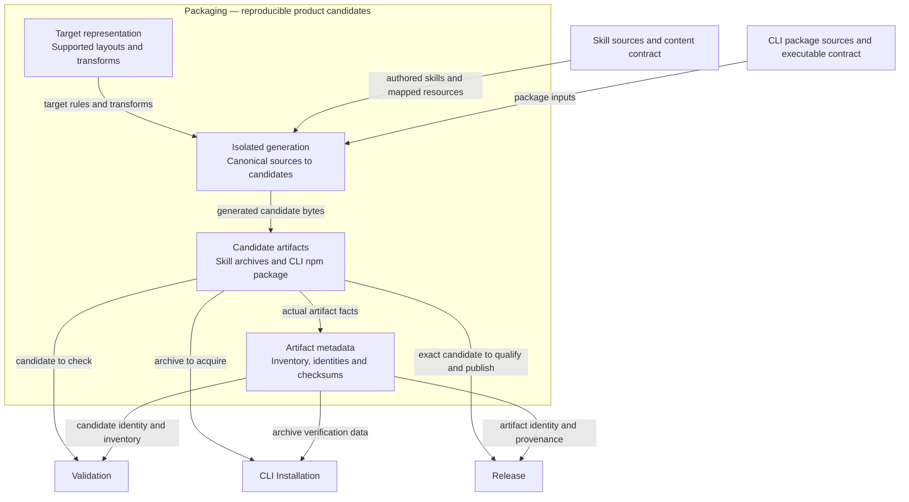
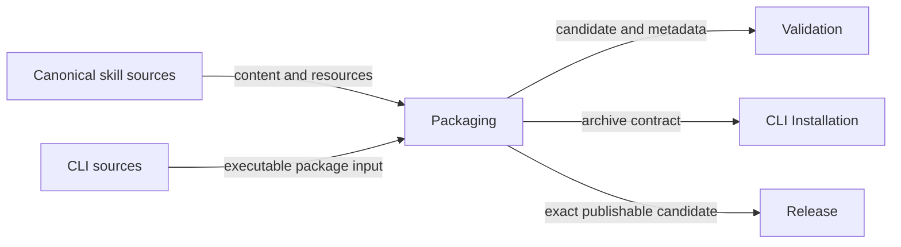
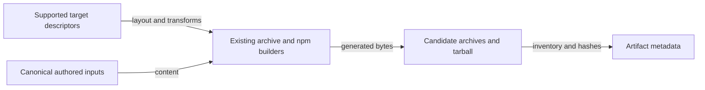
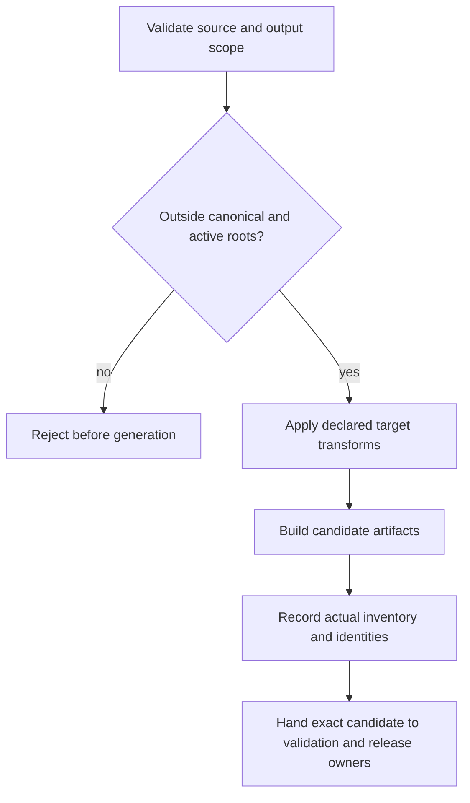
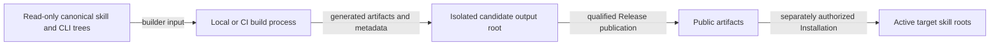

# Packaging Model Design

Model validation contract: model-document-v1

Parent model: [Engineering](engineering.md#packaging).

Owning change: [current-design repository cleanup](../../changes/2026-09-13-current-design-repository-cleanup/change.json).

Original composition adoption: [three-model reconciliation](../../changes/2026-09-12-unified-validation-model/change.json).

Prior refinement: [independent parallel tests](../../changes/2026-09-13-independent-parallel-tests/change.json); its selected behavior and evidence retain their own scope.

For this repository’s [complete source retirement](../../changes/2026-09-14-retire-specs-and-stale-tests/source-disposition.md), current responsibilities are self-contained in the owning Designs. Original source-transfer inventories remain recoverable through [Historical provenance](#historical-provenance); their instructions to retain or amend legacy specs, architecture, activation state or retired engines are historical and superseded by this complete retirement. Source-qualified IDs and original judgments keep their original meaning; provenance is not a runtime input or current approval. Customer source documents retain their project-owned authority and historical meaning. Current RigorLoop output and format support follow Design; source interpretation does not authorize retired feature/proof operations or automatic conversion.

## Introduction and Goals

Packaging owns deterministic generation of supported skill archives, CLI candidate composition and the shared metadata/identity contract consumed by CLI Installation and Release. It does not install into a project or authorize publication. The former Distribution contract is split by responsibility: its installation requirements and filesystem behavior now live in [Installation](../cli/installation.md). Original DIST requirement identities are retained; DIST-SR-01's combined ownership and DIST-DEC-01's no-split decision are superseded by the approved three-model direction.

## Architecture Overview

Packaging owns candidate generation and representation inside the boundary. The [Building Block View](#building-block-view) and [stable representations](#stable-representations) own transforms, artifacts and metadata; [Runtime and deployment](#runtime-and-deployment) owns isolated generation. [Skill](../skill/skill.md) and [CLI](../cli/cli.md) retain product behavior. [Validation](validation.md), [Installation](../cli/installation.md) and [Release](release/release.md) respectively check, install and publish under their own contracts. Candidate metadata records facts; generation neither fabricates successful checks nor grants publication authority.

### Supporting-view decisions

| View | Necessity and reason | Owning detail |
| --- | --- | --- |
| Context | Necessary: Sources, artifact consumers and publication permissions belong to different owners. | [Context view](#context-view) |
| Building Block | Necessary: Descriptors, transforms, artifacts and factual metadata jointly determine package identity. | [Building Block view](#building-block-diagram) |
| Runtime | Necessary: Generation must reject unsafe output roots and must not manufacture passing validation evidence. | [Runtime view](#runtime-view) |
| Deployment | Necessary: Canonical source, isolated generation and active installations must remain physically separate. | [Deployment view](#deployment-view) |

## Context and Scope

Inputs are canonical skill/resource sources, supported target descriptors, CLI package source and release intent. Outputs are generated target archives, the npm package candidate and attributable metadata. Skill owns capability semantics; CLI owns its command behavior; Installation owns user filesystem changes; Release owns publication. Builds cannot adopt governance or declare their own checks passed.

## Architecture Constraints

Canonical skill source remains `skills/`. Target templates remain authored inputs under `scripts/resources/adapter-templates/`. Generated public bodies, archives and support manifests are not tracked source. The generated-only support contract below retires the two tracked `dist/adapters/` files after consumer reconciliation. Generated output never supplies canonical input to another generator.

Reuse the existing Python adapter builder/validator and npm package tooling. Preserve archive names, integrity algorithms and supported target descriptors. Builds never read installation-state markers or mutate installed roots. Installation consumes the shared package representation under its own filesystem/diagnostic contract. Closed package target/schema/algorithm values reject before consistency checks.

Model adoption is repository-local governance, not automatic customer activation. Package production grants neither local installation permission nor publication permission. Safe local fixture proof is sufficient for implementation; actual public release evidence remains Release-owned and cannot be replaced by fixtures.

## Architectural supporting views

These views elaborate the overview at the owning model boundary. Existing detailed contracts, scenario tables and external owners retain their authority.

### Context View

Sources, artifact consumers and publication permissions belong to different owners. Detailed requirements and scenarios in this model remain authoritative.

### Building Block diagram

Descriptors, transforms, artifacts and factual metadata jointly determine package identity. Detailed requirements and scenarios in this model remain authoritative.

### Runtime View

Generation must reject unsafe output roots and must not manufacture passing validation evidence. Detailed requirements and scenarios in this model remain authoritative.

### Deployment View

Canonical source, isolated generation and active installations must remain physically separate. Detailed requirements and scenarios in this model remain authoritative.

## Requirements

| ID | Required behavior |
| --- | --- |
| DIST-SR-03 | Generation MUST derive the exact supported inventory from canonical skills, approved inclusion/transform decisions and thin target templates. Codex installs at `.agents/skills`; Claude Code at `.claude/skills`. Untransformed resources MUST retain raw bytes and all mapped dependencies; transformed bodies MUST preserve selected skill behavior. Unsupported frontmatter/runtime dependencies MUST be rejected or excluded with a manifest reason, not silently shipped. |
| DIST-SR-04 | The current support manifest MUST agree with generated inventory and version, name no active OpenCode target or alias, and contain no generated bodies. Generation MUST be deterministic for identical inputs. Current packages MUST contain the expected entrypoint and skill resources, without `.claude/commands` wrappers, OpenCode output, secrets or permission-broadening instructions. |
| DIST-SR-05 | Build/check operations MUST use temporary or explicitly selected package-output locations and MUST NOT create or synchronize an active project skill installation. The separate `.codex/skills` generator and its normal validation obligation MUST retire. Existing runtime directories MUST NOT be automatically deleted, copied over or treated as authored input. |
| DIST-SR-06 | Public distribution MUST supply separate versioned archives for each supported target through the Release-authorized channel; an optional combined archive MUST contain only the selected supported population. Archive/member inventory, checksums, source identity, generator identity and actual validation results MUST agree with recorded metadata. Generated expectations MUST NOT assert unexecuted validation success. |
| DIST-SR-09 | `rigorloop-tree-hash-v1` MUST retain the representation below, including normalization, regular-file membership, path ordering and independent counts. Unknown algorithms MUST reject. Target root safety MUST be checked separately; excluding symlinks from a hash does not authorize writing through them. |
| DIST-SR-17 | Current generation, manifests, CLI help, package metadata, public guidance, CI selection, release candidates and installed smoke MUST agree on the two-target population. Historical three-target facts MUST remain unchanged and explicitly scoped. Current runtime rejection MUST precede any historical metadata selection that could otherwise reinstall OpenCode. |
| DIST-SR-18 | Required package proof MUST exercise real generated archives, trusted metadata and actual packed-CLI install-only operation for both supported targets, including default conflicts for identical/empty/existing destinations, whole-skill `--force` replacement, unrelated-file/state preservation, and rejection of unsafe destinations in both modes. Local helper success or dry-run alone MUST NOT prove the composed path. Release retains fresh public smoke and publication safeguards; retained integrity and protection against unauthorized data loss MUST survive. |
| DIST-SR-19 | Fully superseded source documents and the specifically obsolete scripts MUST be removed only after necessary meaning, decisions, current readers and protective proof are reconciled. Mixed sources retain explicit owners. Unknown consumers block affected removal; no blanket archive, test, directory or historical-record deletion is authorized. |
| DIST-SR-20 | Support withdrawal MUST be disclosed as a public compatibility break and consumed by Release versioning. Failed adoption MUST retain or restore a coherent source/consumer slice without rewriting published versions, old evidence or user state. Design approval alone MUST NOT claim source retirement, implementation or publication. |
| DIST-SR-21 | Support manifests MUST be derived from canonical skills, approved target descriptors and the requested candidate version inside isolated package output; a tracked dist/adapters manifest MUST NOT supply current candidate truth or be required for validation. Preserve the closed manifest representation, inventory checks and missing/stale/generated-resource failures. Current source MUST contain no generated adapter package fragments. |
| DIST-SR-22 | Remove dist/adapters/README.md and dist/adapters/manifest.yaml after installation guidance is reconciled into packages/rigorloop/README.md and all current readers use canonical inputs or isolated candidate metadata. Builds MUST NOT recreate tracked support files; --check MUST validate a freshly generated temporary candidate, and persistent archive output MUST require an explicit safe --output-dir. A build without --check or --output-dir MUST reject before writes with corrective usage. |
| DIST-SR-23 | The npm artifact MUST obey the explicit content, dependency and consumer-install policy below, exposing one rigorloop binary from the built Node entrypoint without consumer install-time generation or hidden network/credential use. |
| DIST-SR-24 | Boundary-method packaging MUST use maintained non-spec canonical resources and a closed projection manifest, preserving the selected current consumer inventory, skill-relative paths and raw-byte parity; feature/proof retirement removes their exclusive resources and retains revised compact boundary reasoning. Repository historical activation metadata MUST NOT be required for package generation or clean installation. |

## Solution Strategy

Keep one package-producing path and one explicitly requested installer path. `build-adapters.py` and `adapter_distribution.py` remain the package owners in code; remove the local mirror alternative rather than redirecting it into `.agents/skills`. Builds use output directories outside active installation roots, reject destinations that overlap canonical sources or active target roots, and never use build-time cleanup as an installer. `--check` performs generation and validation in temporary output, retaining generated candidate-manifest consistency without requiring tracked support files or bodies.

Retain target descriptors for Codex and Claude Code; withdraw OpenCode from public dispatch and current generation. Retain only independently required historical release-evidence readers with identified consumers. They are separate from installation; neither historical evidence nor old project-state schemas reopen installer compatibility. Current archive production never recreates an OpenCode package; archived-version checks that require the old producer execute against their recorded source instead of a current OpenCode template.

## Building Block View

[Engineering ENG-SR-16](engineering.md#repository-tooling-organization) owns tooling placement. Internal adapter and npm validation modules live under `scripts/lib/packaging/`; stable build/validate commands retain their paths. The boundary projection manifest lives at `scripts/resources/boundary-first/boundary-first-resources.yaml`. Relocation preserves its closed semantics, canonical resource bytes and actual generated/installed inventories; readers and copied candidate roots migrate together.

Canonical skills and `scripts/resources/adapter-templates/` feed `build-adapters.py`, `adapter_distribution.py` and `validate-adapters.py`. The npm candidate is produced from `packages/rigorloop/` using the existing package layout and release tooling. Generation uses isolated non-installation output. It packages supported resources and command code; it does not make every skill invoke CLI or bundle this repository's validation executor into a customer product.

### Stable representations

| Surface | Retained representation and constraints |
| --- | --- |
| Target descriptor | `codex`: `.agents/skills`, `rigorloop-adapter-codex-<release>.zip`; `claude`: `.claude/skills`, `rigorloop-adapter-claude-<release>.zip`. Package entrypoints remain generated archive members; the CLI mutates only its declared installation roots, not project `AGENTS.md` or `CLAUDE.md`. |
| Support manifest | Existing version and skill inclusion/portable/reason fields remain. Portable means compatible with the current supported population. Omit the current `command_aliases.opencode` section; neither retained target generates command aliases. Unsupported target names or unexpected alias sections reject. |
| Archive evidence | Preserve YAML artifact report schema/version, source commit, release/date, generator command, canonical source, manifest reference, per-target archives/checksums/roots, validation command/result and timestamp. Release's immutable-candidate and observed-evidence separation takes precedence over any older prose treating generation as a pass. |
| Hash algorithm | Regular files only; exclude directories, symlinks, metadata/times/ownership, absolute paths, the lockfile and temporary files. Relative UTF-8 POSIX paths have no leading `./` or trailing `/` and sort lexicographically. Normalize generated text to UTF-8/LF and remove a BOM without trimming whitespace or semantic normalization; binary files retain raw bytes under the existing deterministic classification. Each file digest is SHA-256 of those bytes. Hash UTF-8 `rigorloop-tree-hash-v1\n` followed by sorted `<relative_path>\t<file_sha256>\n` rows. |

## Runtime and deployment

Generate the supported inventory into temporary or explicitly selected output; validate resources, transforms, descriptors and actual archive bytes. Compose and inspect the npm candidate's executable and bundled release metadata. CLI Installation verifies this shared representation before any project mutation. Release consumes both candidates' exact identities and actual observations. Changed bytes or target population require affected proof and release consideration; no historical release is backfilled with new metadata or support claims.

## Product compatibility and proof

Packaging owns generation, metadata, archive representation and integrity. [Installation](../cli/installation.md) owns acquisition and destination writes; [Release](release/release.md) owns publication and public candidate evidence. Retired source IDs and historical approvals do not restore OpenCode generation, a local mirror producer or managed project-state installation.

Proof uses real temporary filesystem, archive and metadata paths, independent hash oracles and real packed installation. Do not mock a validator into success. Automated network checks use safe external substitutes while preserving the actual acquisition and validation boundary. Preserve wrong-archive, missing-metadata, traversal/symlink, size/count/hash, unknown-field/value, destination-conflict, partial-failure, proxy-privacy and unsupported-target outcomes. Archive/tree work remains linear and must not read unrelated roots.

Project state is untouched and does not affect destination decisions. Current rejection and preservation proof covers retired installation surfaces; shared candidate hashing, archive integrity, containment and package protection remain required. Removing historical test specifications or mirror-only checks does not remove useful protection from supported production paths. Historical release metadata keeps its actual target population and judgments; current target changes do not rewrite it.

## Acceptance and boundaries

### Boundary scan and acceptance scenarios

| Dimension | Requirement basis | Distinct outcome to demonstrate |
| --- | --- | --- |
| Input domain | DIST-SR-03, DIST-SR-04, DIST-SR-23 | Unknown targets, malformed manifests and missing required resources reject before a valid candidate is claimed. Inspect the actual tarball for required runtime files and forbidden tests, docs or secret material. |
| State/lifecycle | DIST-SR-05, DIST-SR-06 | Generation uses isolated output and does not repair or overwrite active installations; unexecuted checks remain unclaimed. |
| Identity/authority | DIST-SR-06, DIST-SR-09 | Archive identity, metadata, regular-file membership, algorithm and counts agree; unknown algorithms reject. |
| Composition/path | DIST-SR-17, DIST-SR-18, DIST-SR-21, DIST-SR-22, DIST-SR-24 | Actual generated archives and the packed CLI demonstrate compatible metadata and installation behavior on both targets. With dist/adapters absent, isolated generation, manifest validation and actual packed-CLI install still agree for both targets. Generation and clean installation succeed without specs/ and fail for a missing or drifted shared method. |
| Temporal/retry | DIST-SR-03, DIST-SR-04 | Identical inputs produce identical declared outputs; changed source, generator or package bytes require affected validation. |
| Failure/recovery | DIST-SR-05, DIST-SR-18, DIST-SR-22 | A failed build/check reports actual partial output and preserves active installations; no fixture replaces the check being claimed. No-output writes reject without recreating tracked files; missing or escaped candidate metadata cannot fall back to a source-tree manifest. |
| Compatibility/migration | DIST-SR-19, DIST-SR-20 | Current support excludes retired targets while historical evidence remains unchanged; removal follows exact consumer/proof disposition. |
| External/environment | DIST-SR-06, DIST-SR-18 | Local candidate proof does not establish a public release; Release owns real public identity and fresh installation observations. |

### Test design

Apply [System's selection procedure](../test-design/rules.md#select-requirements-and-proof) to current canonical skills/resources, the two supported target archives and the actual npm candidate. The protected outcomes are complete faithful artifacts, isolated deterministic generation and an installer-consumable integrity chain. Large catalogs are unnecessary here: equivalent malformed fields stay named variations, while canonical-to-archive and archive-to-packed-installer composition retain distinct observations. [Installation](../cli/installation.md#test-design) owns destination mechanics and [Release](release/test-design/test-design.md) owns candidate approval/public observations.

| Requirement group and plausible defect | Conditions, action and independently expected observations | Fixture, boundary and realization |
| --- | --- | --- |
| Canonical inventory, transforms and resources — DIST-SR-03, DIST-SR-04, DIST-SR-17, DIST-SR-24 | Generate both targets from valid canonical skills with mapped resources and selected compact shared methods. Independently enumerate emitted members against canonical files and the declared inclusion rules; compare raw resource bytes and only the approved frontmatter transformations. A missing/escaped/stale resource, unknown consumer/target, unsupported dependency or obsolete extra entry rejects or receives the contract's explicit exclusion reason. No target aliases or permission-broadening content is silently introduced. | Small canonical trees for partitions; one actual full inventory/archive composition. [Generation](../../../tests/engineering/packaging/adapter_generation_tests.py), [portability](../../../tests/engineering/packaging/adapter_portability_tests.py), [archive](../../../tests/engineering/packaging/adapter_archive_tests.py) and [resource tests](../../../tests/engineering/packaging/adapter_resources_tests.py) supply support. The archive inventory case independently walks canonical sources; preserve that oracle rather than importing the producer's inventory. Instructional behavior preservation also needs independent comparison of actual generated guidance; byte checks alone do not assess approved transformations semantically. |
| Isolated deterministic generation — DIST-SR-04, DIST-SR-05, DIST-SR-21, DIST-SR-22 | Generate the same declared input twice into separate safe outputs and compare deterministic declared contents/metadata. Run check mode with tracked adapter support absent: no source/installation mutation occurs. A write request without output selection, overlap with canonical/active roots or symlink escape rejects before writes. Alter the generated candidate manifest or required resource and observe the precise inconsistency, never fallback to an old source-tree manifest. | Private real roots containing active-installation sentinels and independent before/after path/byte snapshots. [Generation tests](../../../tests/engineering/packaging/adapter_generation_tests.py), [metadata tests](../../../tests/engineering/packaging/adapter_metadata_tests.py) and [contract tests](../../../tests/engineering/packaging/adapter_contract_tests.py) are supporting locations. Alignment must assess obsolete path/heading assertions against current generated-only behavior and preserve useful no-write protection; a historical test name is neither current authority nor removal justification. |
| Archive facts and independent hashing — DIST-SR-06, DIST-SR-09, DIST-SR-21 | Build real separate archives and optional combined inventory from independently specified bytes. Compare member names, counts, SHA-256, tree rows and recorded source/generator identity with independent expected values. Vary ordering, LF/BOM/text and binary bytes, excluded symlinks/directories and a changed regular file; only contract-defined bytes affect the expected tree hash. Unknown algorithm/closed metadata values reject before consistency. A generated descriptor cannot mark an unexecuted validator passed. | Tiny hand-calculable trees for representation partitions and actual ZIP inspection for composition. [Archive](../../../tests/engineering/packaging/adapter_archive_tests.py) and [metadata tests](../../../tests/engineering/packaging/adapter_metadata_tests.py) provide support; CLI verification consumes the same representation. Audit the normalization/count oracle separately from production hashing before claiming complete independent hash protection. |
| Packed npm policy and executable completeness — DIST-SR-06, DIST-SR-17, DIST-SR-23 | Pack the current candidate and independently inspect actual tar members, binary/shebang, license, runtime dependencies and bundled trust metadata. Required runtime files must be present and tests/docs/secrets/archive copies/install trees absent. Introduce a forbidden member, missing runtime input or unapproved install hook/dependency; qualification rejects. Install the tarball in a fresh consumer root and execute its binary without repository runtime imports or consumer generation. | Actual npm pack/install with private output and controlled archive acquisition. [Npm package tests](../../../tests/engineering/packaging/test-npm-package-publication.py) maintain an independent expected runtime set and forbidden-member fixtures; [packed recording](../../../tests/engineering/packaging/npm_recording_tests.py) supplies current record-use composition. A package configuration assertion cannot replace inspection of the emitted artifact. |
| Producer/installer composition — DIST-SR-17, DIST-SR-18, DIST-SR-24 | Generate archives, derive their real trusted metadata/index, pack and install that exact CLI. For each target, inspect installed required resources; then establish identical/empty/changed conflicts, explicit whole-unit force, unrelated-state preservation and unsafe-destination rejection. A non-installing runner or missing/stale installed resource must fail the smoke itself. Candidate-only hashing cannot accept a wrong target archive. | Real builders, tarball, ZIPs and filesystem; external provider substitutions remain outside the claimed local boundary. [Archive inventory](../../../tests/engineering/packaging/adapter_archive_tests.py), [install smoke](../../../tests/engineering/packaging/adapter_install_tests.py), [resource tests](../../../tests/engineering/packaging/adapter_resources_tests.py) and [packed npm smoke](../../../tests/engineering/packaging/test-npm-package-publication.py) and [Release's real candidate composition](../../../tests/engineering/release/release_candidate_tests.py) supply support. The inspected candidate case proves repeated identical conflicts and force, while empty-unit conflicts and unsafe destinations in both modes still need identified or completed packed-boundary proof. Reuse this composed proof across owners instead of duplicating full installation for every hash or malformed-field variant. |
| Compatibility communication and source retirement — DIST-SR-19, DIST-SR-20, DIST-SR-22, DIST-SR-24 | For a proposed removal, independently inspect its exact sources, live readers, retained requirement/proof mapping, candidate package and public guide/version decision. A newly found reader or changed baseline stops removal; recovery restores the coherent source/consumer slice. Current output must remain self-contained without historical source fetches. The public compatibility statement matches the actual target/resource withdrawal and does not claim publication occurred. | Proposed independent walkthrough using the owning change's exact disposition/diff and current artifact proof. Completed historical retirement is assessed once under its original evidence, not rerun as an old-release matrix. Structural [contract tests](../../../tests/engineering/packaging/adapter_contract_tests.py) can detect specific consumer drift but cannot prove semantic transfer, version choice or authorization. |

Existing paths identify supporting assertions, not fully audited realization or run results. Remaining alignment includes independent tree-hash partition accounting, semantic transformation/compatibility review and reconciliation of stale structural assertions against the current owner. Required package and installed-consumer proof remains explicit even when its setup is expensive. Factories return fresh nested values, tests own mutable output/install roots, and immutable canonical inputs may be shared without sharing generated results as current passes. Use [Validation's cost report](validation.md#execution-cost-reporting) to compare repeated fixture work with actual packed-composition cost; no timing threshold changes qualification. The overview and all supporting views remain accurate: this refinement changes proof organization without changing source→isolated artifact→authorized consumer relationships or deployment.

## Architecture Decisions

| ID | Context and decision | Alternatives and consequences |
| --- | --- | --- |
| DIST-DEC-02 | Retire the local mirror producer and use the supported adapter pipeline; preserve authored-once and archive-only public delivery. | Hand-authored target copies and generated-from-generated packages create competing truth. Keeping both active runtime copies repeats the observed discovery ambiguity. Redirecting a build into `.agents/skills` would make builds mutate user installations. Historical compatibility-window and former mirror-preservation choices retain their original reasons but no current production mandate. |
| DIST-DEC-06 | Remove fifteen fully superseded design sources and two obsolete mirror script/test files only with complete meaning and protection transferred. | Automatic archive copies preserve duplicate reading burden; deleting every adapter-related file loses operational readers and named-release evidence. Retain mixed remainders explicitly and test actual consumer corrections. |

Splitting package production from installation preserves the shared representation once here and makes user filesystem mutation a CLI responsibility. It replaces the original combined-model choice, not its integrity, resource or recovery protections.

## Quality and risks

A package-only success is insufficient when the packed CLI consumes stale metadata or installed guidance refers to unsupported commands. Required proof observes generated resources, archive identities and real candidate CLI behavior. Build output must not overlap authored content or active skill roots. Detailed release and installation risks remain with their respective owners; a module filename alone never justifies helper deletion.

## Generated-only adapter support

`render_manifest_yaml(version, reports)` already derives the support manifest from portability reports. The tracked copy adds no independent authored inclusion decision: canonical skills and current target descriptors are the inputs. Preserve version/skills/portable/adapters/reason fields and their rejection rules; generate the manifest in the selected candidate output and validate it against actual contents. The archive and installer metadata contracts remain unchanged. `generator.manifest` in candidate artifact reports denotes `manifest.yaml` relative to the declared candidate output, not a required tracked repository path; historical report values remain original facts and cannot authorize current replay.

Retire `_validate_untracked_public_adapter_surface`'s mandatory README/manifest presence requirement, while preserving its actual no-tracked-generated-fragments protection against the tracked source inventory. Current package checks must work when `dist/adapters/` is absent. The old default synchronization behavior is withdrawn: `build-adapters.py --check` uses temporary output, explicit `--output-dir` produces persistent artifacts, and a write invocation without output selection rejects before creating anything. Preserve output containment and active-installation protection. Candidate manifest paths are resolved within their supplied output root; missing, escaped or inconsistent manifests reject, never fall back to a source-tree copy.

Consolidate the adapter README's current two-target installation, dry-run/local-archive, default conflict, force replacement and retired-skill-entry guidance into the existing package installation guide, then update current links. Do not create a replacement adapter documentation directory or duplicate guide. The generic package-generation graph already shows canonical sources feeding isolated artifacts and metadata; eliminating the tracked projection removes an accidental feedback dependency rather than adding a producer. Deployment stays source → isolated output → independently authorized installation/publication.

Reconcile builder/check defaults, report validators, release preparation/candidate code, CLI packaging tests, selectors, contributor guidance and operating references in the same implementation slice. Release owns version-scoped qualification and historical replay retirement. Installation's trusted acquisition, immutable metadata, target roots, conflict behavior and explicit force scope remain unchanged; actual candidate archives and packed CLI installation must prove that composition.

### Token-cost qualification removal

Apply [Validation VAL-SR-25](validation.md#token-cost-feature-retirement) to adapter qualification and generated guidance. Remove token-report imports, file requirements and benchmark dependencies together with their tools. Preserve source identity, authored-source selection, archive inventory/parity, safe destinations and tracked/unignored-runtime detection using independent fixtures. A valid supported package needs no token report; removing measurement does not make an invalid package acceptable. Design selects this outcome; packaging implementation and verification remain required before adoption.

## Remaining package contracts

The npm package exposes exactly one public binary, rigorloop, mapped to the existing built entrypoint with a Node shebang. Include package metadata, public README, LICENSE with matching SPDX metadata, built runtime files and the current bundled trust/installation metadata required by the supported executable. Use an explicit package allowlist; inspect the actual npm pack file list and tarball, not merely source configuration. Exclude repository specs/designs/plans/evidence, tests/fixtures, source archives, generated skill trees, secrets and temporary files. A missing runtime dependency or forbidden packed member blocks qualification before publication.

Runtime dependencies require a documented justification and must not introduce consumer-side build, network or secret access. No preinstall/install/postinstall hook may generate or acquire the product during customer installation. Any prepare/prepack use requires a reviewed packaging justification and must preserve deterministic candidate generation; development tooling is not a customer runtime requirement. Current runtime and bundled metadata determine the artifact, not the obsolete first-release command inventory or lockfile-era payload list.

### Boundary resources

Use the existing shared-source infrastructure with `templates/shared/boundary-first-method-v1.md` and the closed manifest `scripts/resources/boundary-first/boundary-first-resources.yaml`. The selected resource set is exactly `compact-core`, projected to route, design, design-review, plan, delivery-review, implement, code-review and verify. Its content retains compact outcome/boundary reasoning but removes feature/proof format and identifier rules. Remove the `feature-authoring` and `proof` entries, canonical methods, skill copies and READ triggers together. Unknown resource or consumer values still reject before consistency checks; retaining a removed method as an optional resource is not the selected outcome.

Check the actual selected sources, complete consumer sets, containment, absent/escaped files and raw-byte parity through projection, generated candidates, archives and clean installation. Use independent expected inventories, not the producer's registry as its own oracle. Package generation needs no specs directory, activation ledger or historical source fetch. Existing released archives keep their original bytes; current archive/CLI candidate metadata must agree with the new contents. Installation grants no authority to migrate customer documents or remove unrelated installed files. Release communication must disclose feature/proof support withdrawal; this change does not publish a release or select a version.

This reuses the existing shared-source → skill projection → candidate graph and isolated output deployment. The choice avoids a new skill, alternate archive tree or Git fetch in ordinary builds. A partial move, stale manifest or missing copy blocks affected generation; rollback restores source, manifest, readers and package checks together. Initial relocation can be assessed by exact old/new byte equality plus complete resource boundary proof, without a token metric or target-agent execution.

## Historical provenance

Completed source-transfer mappings and original adoption handoffs are recoverable at `38a3042e63c7c2462ecf8ffed29f4ac0cbb8923f:docs/design/engineering/packaging.md`. Their source-qualified IDs and judgments retain their original scope; they do not supply current approval or operational inputs. Current behavior and proof obligations are specified in this Design and its named owners.
