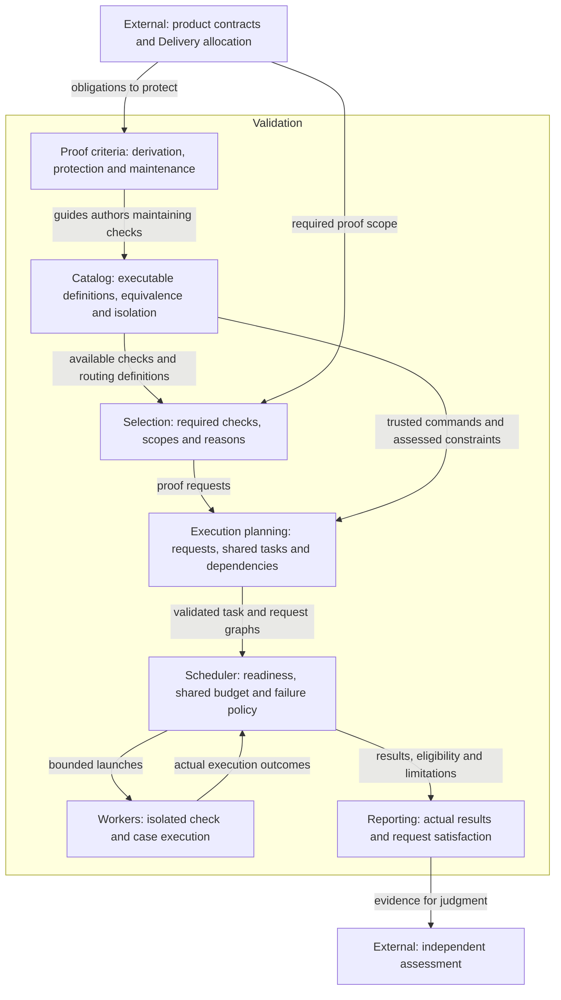
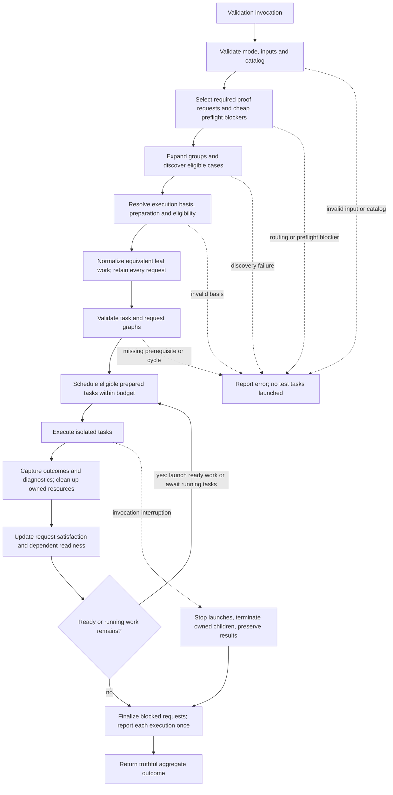

# Engineering Validation Model Design

Model validation contract: model-document-v1

Parent model: [Engineering](engineering.md#validation).

This child owns shared proof-quality criteria and this repository’s validation execution. Skill capabilities reference the reusable criteria; the executor, CI allocation and no-cache implementation belong to Engineering. Individual customer skill use does not install or require this repository’s executor.

Owning change: [independent parallel tests](../../changes/2026-09-13-independent-parallel-tests/change.json).

## Introduction and Goals

Validation owns useful proof, its maintenance, deterministic selection, independent execution and truthful reporting. The [current direction](../../proposals/2026-09-13-independent-parallel-tests.md) refines this owner, removes redundant cases without losing distinct protection, and extends independently runnable cases across the remaining repository-owned automated test inventory. Equivalent requests can share one execution within an invocation; validation-result caching remains retired.

The [original adoption](../../changes/2026-09-12-unified-validation-model/change.json) established the unified owner, preserved TEST-SR criteria, retired caching and adopted case execution for three suites. Its exact source-disposition maps below and historical judgments retain their original scope. The current refinement changes execution equivalence and remaining-case adoption as explicitly described here; it does not reopen the original cleanup. New behavior requires reviewed implementation and successful Verify of the current owning change. Authoring and structural validation do not establish adoption.

## Context and Scope

| Responsibility | Owner and interaction |
| --- | --- |
| Required product behavior and invariants | Product Designs, including Skill, CLI, Packaging, Installation and Release, supply the obligations that checks protect. |
| Proof derivation, protective value, maintenance, selection and execution | Validation defines the common criteria and operational contract here. |
| Concrete verification allocation | Delivery selects milestone and integrated proof, commands, conditions and evidence expectations using these criteria. |
| Concrete cases and fixtures | Implementation or the authorized correction owner supplies assertions and isolation. |
| Judgment, independence, evidence applicability and final closeout | Review and Closeout governs the specialist assessors. A check pass or valid report never grants approval. |
| Activity and records | Workflow coordinates actors; Record Format defines stored evidence; CLI safely records explicit actor decisions. Validation execution does not mutate these decisions. |
| Packaging, installation and release operations | Their owners retain package integrity, publication policy, credentials and external actions. Validation supplies execution support without adopting customer governance. |

The proof criteria apply to unit, integration, system, regression, property-based and generated-output tests, and the choice of static or manual proof. Execution covers repository-owned local/CI selection and checks. It does not certify target-agent behavior, invent arbitrary application dependency graphs, introduce a hosted worker service, or replace domain validators with semantic scoring. No new public skill, lifecycle gate or evidence schema is introduced.

## Architecture Constraints

The Constitution and adopted owners govern. Authored validation logic stays in repository-owned scripts; hosted workflows remain thin. Existing selector and wrapper entrypoints remain public contributor interfaces, subject only to the explicit compatibility changes below. Runtime record safety, package hashing and dependency-download caching are separate concerns and remain intact.

Use one in-process orchestration implementation with subprocess execution of validators and test cases. Reuse the current selector catalog and scheduler logic; remove competing broad-smoke scheduling and historical metadata readers once their protection is established in the replacement. Isolation is process/fixture isolation, not a security sandbox. Tests run only with the invocation's existing permissions.

## Requirements

| ID | Required behavior |
| --- | --- |
| TEST-SR-01 | Each new or substantively changed test or coherent group MUST have an identifiable governing Design obligation or explicit engineering obligation, objective, relevant condition, expected observable outcome and plausible violation it is intended to detect. References MAY be group-level and many-to-many; a new record or ID per test function MUST NOT be required. |
| TEST-SR-02 | Expected outcomes MUST come from the governing contract or an explicitly justified engineering obligation, not solely from current implementation output. A discovered regression or hazard with missing or conflicting behavioral authority MUST retain its reproduction and route the intended outcome to the Design owner; missing traceability alone MUST NOT justify deletion or fabrication of a requirement. |
| TEST-SR-03 | Case selection MUST cover representative outcome partitions, relevant boundaries and material hazards for the scoped obligation. A case added beyond existing protection MUST identify a distinct outcome, path, state, timing, authority, failure/recovery, compatibility or environmental contribution, or a justified diagnostic contribution that materially helps identify the protected failure. The rationale MUST explain that contribution; a different test name or repeated assertion alone does not establish diagnostic value. Mechanical Cartesian expansion and numerical coverage targets MUST NOT substitute for this reasoning. |
| TEST-SR-04 | Proof MUST observe the contract outcome at a boundary capable of exposing the claimed violation, including required absence of side effects. Mocks or helpers that bypass the behavior under assessment MUST NOT be cited as proof of that behavior. Lower-level and integrated tests MAY both be retained when their detection scope or diagnostic contribution differs. |
| TEST-SR-05 | Assertions and setup MUST distinguish correct behavior from the intended violation. Expected results computed by the same potentially faulty production logic, assertions that cannot fail on the claimed defect, and snapshots accepted without examining required outcomes MUST NOT be treated as sufficient protection. Review uses a concrete counterexample or inspected failure mechanism; mutation testing is optional, not universally required. |
| TEST-SR-06 | Property-based or randomized tests MUST identify their invariant, valid generated domain, relevant failure observation and enough failure data to investigate or reproduce a counterexample. A seed alone is insufficient when relevant environment or external state is uncontrolled. Random generation with a justified property MUST NOT be rejected merely because its inputs were not enumerated in Design. |
| TEST-SR-07 | Test maintenance MUST distinguish retain, strengthen, consolidate, replace and remove actions and state the affected obligation and protection impact for the changed scope. Runtime cost, naming similarity, age, missing labels, line coverage or a passing remaining suite alone MUST NOT establish redundancy. An unchanged legacy suite need not be retroactively annotated before unrelated work can proceed. |
| TEST-SR-08 | Removal or consolidation MUST identify the candidate scope, its existing failure detection and boundary, the retained or replacement proof, and why no required distinct protection is lost. Replacement proof MUST be established and assessed before relying on the reduced suite. An intentionally retired obligation requires an explicit governing owner decision and scope; removing its test cannot itself retire behavior. |
| TEST-SR-09 | When a candidate's protection is unknown, maintenance MUST preserve it while investigating or strengthening its basis; uncertainty MUST NOT be relabelled uselessness. A failing or flaky test MUST have its cause and contract relevance assessed, not be removed or skipped solely to obtain green validation. Any permitted quarantine requires an authorized owner, tracked follow-up, affected claim limits and alternative protection or explicit residual-risk treatment under the governing contract. |
| TEST-SR-10 | Test changes MUST identify impacts on fixtures, alternate callers, supported versions, runner discovery, selectors and generated outputs where those affect protection. Validation MUST demonstrate that selected checks are actually discovered and exercise the changed obligations; fewer failures caused by accidental loss of selection MUST NOT count as successful cleanup. |
| TEST-SR-11 | This model's criteria MUST be applied by the responsible specialist within its actual scope. Test-model criteria, structural validity or test success MUST NOT independently approve a suite, declare evidence applicable, choose an overall review judgment or waive an assessment. Those decisions and consequences remain governed by Review and Closeout RC-SR-01–18. |
| TEST-SR-12 | Delivery MUST allocate every affected obligation and material combined hazard to milestone or change-level proof and identify bounded cleanup targets and completion criteria before implementation. Execution MUST retain enough actual-result and maintenance rationale in existing plan, review and evidence surfaces to support the claimed protection; an additional test ledger or per-function receipt MUST NOT be mandatory. |
| TEST-SR-13 | Consumer adoption MUST map each affected shared criterion to one owner, preserve specialist methods and historical contracts, and provide selectively loaded portable guidance. Internal requirement IDs and repository-maintainer mechanics MUST remain in governance/contributor traceability, not published skill instructions. Installation, drafting or structural validation MUST NOT activate the policy or authorize deletion. |
| TEST-SR-14 | For the selected necessary-design consolidation, validation scope MUST follow affected obligations and actual readers/dependencies. Distinguish a useful retained check, a check required for this change, and a fresh execution. Apply the bounded retirement contract below when a check or exclusive assertion changes. Unknown impact MUST trigger investigation and broader relevant proof; existing mandatory or freshness requirements remain effective unless their owner explicitly amends them. No new ledger, benchmark or validation subsystem is required for source cleanup. |
| VAL-SR-01 | New or substantively changed test cases MUST be runnable independently of other cases' order, results and mutable state. Each case MUST own setup and cleanup; shared fixtures MUST be immutable or independently materialized. A scenario MAY contain ordered internal steps without depending on another scenario. |
| VAL-SR-02 | Concurrent execution MUST require a current, explicit isolation basis covering writable paths, external resources, process environment, setup/teardown, nested execution and resource demand. Unknown safety MUST cause serial execution with a visible reason; contradictory or malformed safety metadata MUST fail before execution. Existing cases MUST NOT be assumed independent from naming or separate functions alone. |
| VAL-SR-03 | Selection MUST explain mode, changed paths, affected roots, selected checks and their reasons, scoped omissions and applicable boundary triggers. Deleted and renamed inputs, registered evidence and shared dependencies MUST participate. Missing or ambiguous routing MUST block with an actionable diagnostic; it MUST NOT yield empty successful proof or be erased by a passing diagnostic broad smoke. |
| VAL-SR-04 | Closed modes, statuses, check IDs and metadata values MUST be validated before consistency or execution. Missing required inputs, malformed output, unknown values, duplicate/conflicting identities and untrusted command substitutions MUST fail explicitly before launching selected work. Each new closed vocabulary MUST have an unknown-value regression. |
| VAL-SR-05 | The existing catalog MUST own executable check identity, trusted arguments, scope, dependencies and execution constraints. Selection and execution MUST share that definition rather than scrape shell text or trust supplied command strings. A dependency MUST be present and successful before its consumer starts; cycles and missing dependencies MUST reject. |
| VAL-SR-06 | Preflight MUST establish valid inputs, resolvable selected state and applicable cheap blockers before focused work. Failed preflight or focused proof MUST prevent dependent boundary execution unless explicitly requested for diagnostics. Diagnostic execution MUST preserve the original unsuccessful overall result and disclose its scope. |
| VAL-SR-07 | Independent selected cases and checks MUST normally run concurrently within one invocation-wide worker budget. Serial/exclusive work MUST not overlap conflicting work. Nested suite runners MUST consume an allocated portion of the same budget, never independently expand it. Jobs and timeout overrides MUST be positive integers; jobs=1 MUST preserve complete sequential coverage and diagnostics. |
| VAL-SR-08 | Execution MUST capture each task's stdout and stderr separately, attribute status and elapsed runtime from process start, and report in stable selection/discovery order. Reports MUST distinguish pass, assertion/command failure, unavailable command, signal, timeout, runner error and work not started. Missing or undecodable results MUST remain visible and cannot become passes. |
| VAL-SR-09 | Default execution MUST complete independent required work and aggregate failures. Explicit fail-fast MUST stop launching queued work after an observed failure, preserve started-task outcomes and report the unstarted remainder. Failed dependencies, cancellation and interruption MUST likewise leave required unfinished work visibly incomplete and the overall result unsuccessful. |
| VAL-SR-10 | Timeouts and interruption MUST terminate and reap owned child process trees, preserve collected diagnostics and release owned temporary resources without modifying unrelated state. A retry MUST execute anew against current inputs and MUST NOT promote a prior partial run or silently retry failures until green. |
| VAL-SR-11 | Validation commands MUST NOT read or write validation-result caches or substitute cache hits for execution. Retired cache flags, helper modes and measurement inputs MUST reject before validation or writes. Routine validation MUST leave old local caches untouched; the explicitly scoped one-time repository cleanup below MUST remove the disposable default cache directory. Historical evidence MUST remain unchanged; other hashing, persistence and dependency mechanisms MUST NOT be removed under this requirement. |
| VAL-SR-12 | Execution reports MUST identify actual commands/cases, subject/scope, phase, result, duration and limitations, with compact ordered summaries and actionable rerun diagnostics. Selecting or discovering work MUST NOT claim it ran. Required skips, unexpected discovery loss and missing results MUST prevent a complete-pass claim. Explicitly authorized non-applicability remains an assessor decision. |
| VAL-SR-13 | This initiative's cleanup MUST map distinct protected failures to established retained proof or an explicit obligation retirement, reconcile actual readers and remove the selected superseded sources and exclusive machinery. Unknown protection MUST be investigated and preserved. Use existing Design, Delivery and evidence surfaces; no second ledger, deletion quota, dual execution of retired behavior or mandatory savings benchmark is required. |
| VAL-SR-14 | Direct validator and test entrypoints MUST remain complete for their declared scope unless explicitly retired below. Pure logic MAY be tested in process, but subprocess/CLI behavior MUST retain proof at that boundary. Parallelism, narrower reporting and test refactoring MUST NOT hide required cases in optional-only commands or weaken failure sensitivity. |
| VAL-SR-15 | Validation MUST preserve domain-owner checks and applicable broad-smoke/release triggers. The runner MUST NOT invent policy from file extension, reduce required proof for speed or bypass release preparation/publication boundaries. Evidence applicability, fresh-execution overrides and final readiness MUST remain under their existing owners. |
| VAL-SR-16 | Coordinated adoption MUST update current governance, model references, skills and executable/package consumers, retire the mapped old authorities and preserve historical record bytes and judgments. Public guidance MUST remain portable and selectively loaded, without internal model IDs, maintenance paths or a new mandatory test ledger. |
| VAL-SR-17 | Checks MUST use invocation-owned isolated temporary roots and explicit environment/working-directory values. Logs and durable evidence MUST avoid credentials, private environment dumps and sensitive host paths. Cleanup MUST be limited to resources created by that invocation; network or external writes MUST retain separate authorization and declared constraints. |
| VAL-SR-18 | Performance claims MUST name measured scope, commands, environment, results and limitations; output reduction alone is not runtime improvement. Per-run timings MAY support diagnosis without a historical benchmark dependency or permanent sidecar store. No new failing performance threshold is introduced by this model. |
| VAL-SR-19 | Equivalent proof requests within one invocation MUST share one physical execution when the catalog establishes the same executable/case scope, resolved inputs, subject, configuration, observation boundary and prerequisite state. All selecting reasons and consumer obligations MUST remain represented. Different catalog aliases or phase labels alone MUST NOT force repetition; unknown equivalence or a required intervening mutation/freshness boundary MUST retain separate execution. No result survives for reuse by another invocation. |
| VAL-SR-20 | Sharing execution MUST preserve phase gates, dependency success, failure aggregation and truthful reporting for every consumer. The graph MUST reject conflicting identity claims and cycles before launch. A consumer prevented by an earlier failure MUST NOT be reported as executed or satisfied merely because its shared task ran for another consumer. Physical executions and their durations MUST be counted once, with explicit references from other eligible requests. |
| VAL-SR-21 | The current initiative MUST assess all current repository-owned automated test populations, including cases reached by direct, selected, broad-smoke, main and release validation entrypoints. Every retained case MUST be independently runnable and parallel-capable within the shared resource budget. Temporary serial fallback for unknown safety MUST NOT count as completed adoption. Delivery MUST reconcile discovery and actual callers, allocate bounded groups and account for additions or removals before final completion; no unassessed population may silently move to later maintenance. |
| VAL-SR-22 | Remaining order-coupled or resource-conflicting cases MUST be refined or replaced with equivalent independent proof. Deletion MUST satisfy TEST-SR-07–10 through established retained detection or explicit retirement by the behavior owner. Unknown required protection or an irreducible required external resource blocks affected completion. Resource-limited sequential scheduling, prerequisite ordering and ordered steps inside one isolated scenario do not themselves violate case independence. |

## Solution Strategy

Follow the many-to-many chain: governing obligation → objective and plausible violation → representative condition and observation boundary → concrete proof → observed evidence → independent assessment. The retained TEST-SR identities carry their existing meaning; model consolidation does not require per-function trace records or numerical coverage targets. VAL-SR-01–18 preserve the original execution and retirement contract; VAL-SR-19–22 define the current execution-sharing and remaining-case refinement.

Reuse the existing `scripts/validation_selection.py` catalog, `scripts/select-validation.py` CLI and `scripts/ci.sh` entrypoint. Use `scripts/validation_execution.py`, the extracted internal module also used by broad smoke. This preserves one execution implementation; it is not an additional public command, persistent worker or separate validation service. Keep domain validator processes separate from orchestration.

## Building Block View

### Structural design graph

Validation owns this structure and the flow below. These blocks are internal responsibilities, not new models, public commands or independent services. Criteria guide authors and assessors; the executor does not derive semantic adequacy from them. Execution planning establishes assessed equivalence, the scheduler controls physical launches and request eligibility, and reporting supplies evidence without approval. [Engineering](engineering.md#subsystem-design-graph) owns Validation's relationship to Development, Packaging and Release.

| Block | Realization and boundary |
| --- | --- |
| Obligation and proof criteria | This model supplies criteria; Design and Delivery supply the actual behavior and proof allocation. Existing test-quality and test-maintenance resources apply them. |
| Selection and catalog | Existing selector maps paths/mode to ordered checks. Extend its catalog with broad-smoke membership/order, dependencies, execution unit and constraint rationale. No independent shell-label lookup or historical change-local classification source remains. |
| Execution planning | The existing executor expands requests, resolves assessed equivalence, creates shared physical tasks and validates preparation and consumer graphs. |
| Scheduler | The same executor runs eligible prepared work within budget, maintains request and gate outcomes, handles serial barriers/dependencies and aggregates results. `ci.sh` delegates to it. |
| Case execution | Catalog-declared Python unittest suites support case discovery and isolated case processes through the existing test script entrypoints. Node suites use their native runner with an explicitly allocated concurrency budget. Opaque commands remain single tasks. |
| Observation | Existing stdout/JSON surfaces report scope and outcomes. Actors record selected proof using current v3 evidence commands; the runner does not save a judgment or workflow transition. |

Catalog execution units are a closed choice of `command`, `python-unittest` and `node-test`; opaque commands are never discovered by guessing from their text. Constraint metadata supplies a nonempty isolation rationale, serial/exclusive designation or bounded worker demand, declared dependency IDs, and a command-basis value matching the current normalized command template and discovery adapter. A changed command/adapter without a reconciled basis rejects; a matching string alone does not prove safety, which still requires assessment. Unknown fields/units and contradictory safe/shared-write claims fail before graph construction. Absence of an isolation assessment explicitly resolves to serial command execution. This extends one current executable catalog, not a permanent per-case registration ledger.

## Runtime View

### Invocation flow graph

This is the normal selected invocation. Explicit diagnostic execution after a blocker follows its declared scope, retains the original unsuccessful result and does not waive preparation. Discovery is bounded subprocess work, not proof of a test pass. Preflight, focused and boundary gates are enforced before their dependent launches or request satisfaction. Ordinary task failure updates the graph and allows independent required work to continue; fail-fast stops queued launches while retaining started-task outcomes. Reports expose unfinished work even if no task remains runnable.

### Selection, preparation and execution

Resolve explicit/local paths or the PR/main range and release context once. Check argument shapes and valid identities before catalog consistency. Preserve deterministic evidence-class matching and actionable `manual-routing-required`/missing-route diagnostics. The selector remains read-only and emits its existing JSON envelope. Preserve its required fields, per-check scopes, status vocabulary and exit meanings: ok=0, blocked=2, fallback=3, error=4. This profile does not execute fallback output; unknown or ambiguous paths block rather than guess a safe proof set. Explicit mode works from paths without inventing a Git-history prerequisite for a standalone check.

Preflight inspects applicable repository input/merge conflicts, authoritative file presence, generation-input validity and recorded blockers without deciding semantic readiness or invoking historical eligibility. Focused proof precedes triggered boundary proof. A required boundary check is still required after a focused pass; wrapper execution is not itself a universal broad-smoke trigger. Preserve planned-initiative and expressly recorded policy/risk/handoff/main/release triggers and existing scoped owner exceptions. Diagnostic broad smoke after a blocker cannot clear it.

Preserve Release's PR/main `release-coordinator.py check-ci` interception and separately owned release verification. The coordinator's delegated local checks can use the common executor, but no publication path gains a new selector or permission from this model. `main` retains its direct product-check membership; selected PR/local/explicit/release and broad-smoke membership are separate scope inputs to the same executor. Domain command arguments and required/optional classification remain unchanged except the exact cache/classification retirements and catalog reconciliation below.

Expand a selected broad-smoke group into leaf tasks rather than recursively starting another CI wrapper and worker pool. Give package build and validation a shared invocation-owned output directory and an explicit build-success dependency. Other independent checks may run alongside that chain. Normalize equivalent requests using VAL-SR-19/20 and the execution-sharing contract below. This explicitly replaces the original same-catalog-identity-and-phase restriction; similar command strings alone still cannot establish equivalence.

### One execution with several proof requests

Keep one catalog and executor. Catalog aliases identify requested obligations; an assessed canonical execution family identifies equivalent work. Resolve arguments, case filters, working directory, controlled environment, candidate/input identity, required output artifact identity, observation boundary and successful prerequisite state before sharing. Unknown or unequal values retain separate tasks with an explained reason. An identical family declaration with incompatible definitions is an invalid catalog claim, not permission to merge. A hash or matching command template does not prove semantic equivalence.

Compose the complete invocation request graph, expand groups and eligible case scopes, then normalize equivalent leaf work before scheduling. Preserve request identities, selecting reasons, phases and dependency edges separately from the physical execution identity. Share at the earliest request whose required preparation is satisfied only if later consumers require no intervening change or independently mandated fresh execution. Do not union a later boundary's dependency on the whole focused phase back into the focused task itself: retain that edge on the later consumer. Validate the resulting task and consumer graphs for missing prerequisites and cycles before launch. If safe sharing cannot be established, execute distinct tasks; do not guess at dependency removal.

For example, focused `validation_execution.regression` and `broad_smoke.validation_execution.regression` can share one execution when they exercise the same unchanged source and configuration. The boundary request becomes satisfied only after its own focused gate succeeds. If another focused check fails, normal boundary work remains not started despite the shared executor result. A failure of the shared execution remains a failure wherever eligible consumers rely on it; diagnostic broad smoke preserves the original overall failure. It may refer to the same failed observation without silently retrying it. An explicitly requested retry is a new attempt with its own outcome.

A package validator after a build cannot share a pre-build source check or a check of another package destination/version. Different filters, environment, candidate bytes or a required post-mutation observation also remain distinct. Selection must retain boundary coverage even when its physical execution is shared. A subsequent invocation always executes anew.

Reports preserve existing request identities and fields, adding an explicit link to the actual execution where sharing occurs. Display actual status, command/case, duration and rerun information once per execution and retain consumer eligibility and limitations. Report request totals separately from physical task totals; attribute a duration once, exposing cross-phase sharing rather than summing it twice. Never synthesize another pass or elapsed measurement for an unexecuted consumer.

#### Request, task and result structures

Within `scripts/validation_execution.py`, separate the current `CheckPlan` selection/phase responsibilities from physical execution. The following are internal structures; they are not new workflow records or public CLI commands. Existing catalog and executor modules remain their implementation owners.

| Structure | Fields and invariant |
| --- | --- |
| `ProofRequest` | `request_id`, originating `check_id`, optional `case_id`, `phase`, ordered selecting `reasons`, required `scope`, `requires_success`, `after_completion` and `execution_id`. The request identifies selected proof and when it is eligible to consume an execution. IDs are unique; a suite group aggregates its discovered leaf requests rather than claiming an additional execution. |
| `ExecutionBasis` | Assessed `execution_family`, execution unit/adapter basis, resolved argv and case selector, working directory, relevant environment/tool basis, source/input subjects, artifact bindings, observation boundary, freshness boundary, timeout and resource/isolation constraints. Equality means the complete declared basis agrees; unknown information never compares equal for sharing. |
| `ExecutionTask` | `execution_id`, basis, preparation prerequisites, ordered consumer request IDs, allocated worker demand and owned capture/receipt paths. At most one physical launch occurs for a normalized task in one attempt. Task-owned temporary capture paths are allocated after grouping. |
| `ExecutionResult` | `execution_id`, actual status, exit reason/code, elapsed duration, captured stdout/stderr and rerun argv. Preserve the existing execution outcome distinctions, including timeout, signal, runner error and not started. Results never contain an approval judgment. |
| `RequestResult` | `request_id`, `execution_id`, request state and unmet-prerequisite/limitation explanation. State is one of `pending`, `satisfied`, `failed`, `not-started`; pending is internal only and cannot remain in a complete final report. Unknown states reject explicitly. |

Assign execution IDs in stable first-request/discovery order within the invocation. They are reporting references, not persistent identities or cache keys. Duplicate request IDs and missing execution references fail before launch. A full suite requested twice expands to equivalent leaf requests before grouping; overlapping suite filters share only their identical discovered cases, preserving all distinct remaining cases and each suite's completeness claim.

#### Catalog and execution basis

Add an optional `execution_family` to the existing `CheckCatalogEntry`. Absence uses the check's own ID, so unassessed aliases do not share automatically. Reusing a family across aliases requires a reviewed common command template, adapter and observation contract with a rationale for equivalence. Parameter values such as version or selected paths remain resolved inputs, not part of a blanket equivalence claim. An incompatible family definition is a catalog error. Different valid resolved scopes within one family remain distinct tasks.

Resolve the basis from the trusted catalog and actual invocation, never from caller-supplied command strings. Match argv as an ordered token sequence; do not compare shell display strings or sort arguments. Preserve distinctions between absent and empty environment values. Environment/tool dependencies must be explicit enough to establish equal behavior; credentials and sensitive values must not appear in reports. A missing declaration that prevents reliable comparison disables sharing with a visible reason. Parallel safety and execution equivalence are separate assessments: safe concurrent checks are not necessarily equivalent.

Source/input subjects identify the relevant files and their content for the claim, including applicable additions, deletions and generated inputs; a commit ID alone is insufficient for a dirty checkout. Existing scoped input resolution and in-memory identities may be reused without creating a historical fingerprint store. An incomplete dependency surface disables sharing. Compare execution-affecting timeout, resource and isolation constraints exactly; do not choose a looser timeout or stronger permission to make requests match. Request labels, selecting reasons and phases are excluded from basis equality.

For existing artifacts, bind the actual candidate identity and location. For an artifact not yet built, planning may bind the same producer task, its declared output location and candidate configuration. Both consumers must wait for that successful producer, and execution must bind and validate the actual output before use. Different producers, output destinations, versions or required post-mutation observations stay distinct. Equal file bytes alone do not establish interchangeable side effects or observation boundaries. Output-producing work is shareable only when all consumers explicitly require that same produced artifact and its single production is adequate under the owner contract.

Treat selected input subjects as stable for an execution and its consumers. Recheck the relevant basis before launch and before satisfying a later consumer. Observed input drift invalidates affected reliance and leaves required proof incomplete; retain the original result as an observation of its actual basis, without silently rerunning until green. Required mutations are modeled through producer/preparation and freshness boundaries rather than ignored as drift. These checks do not promise atomic observation against arbitrary external edits; uncontrolled writers prevent an assessed sharing claim.

#### Normalization and dependency semantics

1. Validate invocation and catalog, resolve scope, and construct all selected requests in deterministic order. Preserve routing blockers and explicit diagnostic scope.
2. Expand composed groups and collect eligible cases with bounded isolated discovery. Collection is not test success. Run applicable cheap preflight blockers before costly discovery when their scope is already resolvable; no focused test task launches before its required preflight succeeds.
3. Separate preparation from request eligibility. `requires_success` names request/gate outcomes that must succeed. `after_completion` preserves explicit diagnostic ordering without requiring success. Preparation names successful artifact/input producers needed by the physical execution.
4. Resolve each leaf basis and group exact equivalents from assessed families. Uncertain comparison retains separate tasks with an explanation. Allocate one task per group and map every leaf request to it; do not delete selected obligations.
5. Validate preparation and request/gate graphs together for missing identities, cycles and impossible eligibility, before launching test tasks. Do not union every consumer's phase gate into the shared task. A gate that depends on a consumer's own result would otherwise create a false self-dependency.
6. Schedule a task only when preparation succeeds and at least one consumer is eligible. A task selected only for boundary proof therefore cannot run early. An already completed task may satisfy another consumer only after that consumer's prerequisites and current basis agree.

There is no second scheduler. The existing scheduler maintains task results, request results and phase-gate outcomes in the same event loop. Preparation failure prevents task launch; request gate failure blocks that consumer without cancelling an execution still needed by an eligible independent consumer. A cycle or invalid declaration is an input/plan error, while waiting on running prerequisites is ordinary scheduling. If the queue cannot progress and no task is running, report every unfinished request and the unsatisfied basis; never turn an empty ready queue into success.

#### Request satisfaction and failure propagation

| Condition | Request outcome and physical execution behavior |
| --- | --- |
| Required gates or preparation are still running | Request remains pending. The task launches only if its preparation and at least one consumer's eligibility are ready. |
| Consumer is eligible and the shared execution passes on its current basis | Request becomes satisfied and refers to that result. No additional process, duration or invented pass is recorded. |
| Another focused request fails after the shared task passes | Its focused consumer remains satisfied; normal boundary consumers become not-started with the failed gate named. |
| Shared execution fails, times out, crashes or has invalid/missing result data | Eligible consumers fail with the actual execution reason. Consumers blocked by an earlier gate remain not-started; all required incompleteness contributes to an unsuccessful overall result. |
| Fail-fast, cancellation or interruption prevents a launch | Finalize queued affected consumers as not-started with the policy reason. Preserve started-task outcomes and owned-process cleanup. |
| Diagnostic boundary work is explicitly enabled after focused failure | Replace only the authorized success gate with completion ordering. Preserve preparation requirements and the original overall failure; a shared failed result remains failed and is not automatically retried. |
| A required fresh observation or explicit retry is requested | Keep a separate execution/attempt basis. Prior partial or failed observations remain visible; no silent promotion of a previous result. |

With `--jobs 1`, grouping and request coverage are unchanged; only physical concurrency changes. A shared task consumes its worker allocation once. Nested runners receive that allocation, never a new CPU-derived budget. Cancellation of one consumer alone does not terminate work still required by another consumer. Whole-invocation interruption retains the existing process-tree termination and five-second grace contract.

#### Reporting and compatibility

Keep selector JSON and its check IDs, reasons, mode/status and exit meanings unchanged. Execution reports add an `executions` collection keyed by `execution_id` and a `requests` collection linking original request/check/case IDs to their phase, scope, reasons, state and execution reference. These are execution-output fields, not additions to the v3 workflow record schema. Stable request and execution ordering follows selection/discovery, not completion order.

Report duration, output size, actual argv and physical status once in `executions`. Request rows report satisfaction or missing proof and link to diagnostics. Summary counts distinguish selected leaf requests from launched executions; suite groups are not counted as extra launches. Count each launched task's duration only in its `launch_phase` and name later consuming phases as shared; summed task durations remain distinct from elapsed wall time. A blocked consumer never inherits a successful request status merely because its task passed elsewhere.

For the existing broad-smoke result-output opt-in, retain the outer envelope and fields, including `cache_status: not-applicable` and unavailable historical baseline fields. `parallel.child_durations` represents physical tasks once and retains its existing command/duration/result/exit/output fields; additional request mappings carry aliases and eligibility. Fields such as `preservation.child_set_preserved` are established from complete selected request coverage, not equality between request count and launch count. Delivery must reconcile actual text/JSON consumers and their assertions before changing their interpretation; matching old field names alone is not compatibility proof.

`executions` is the canonical collection of physical results. `parallel.child_durations` is a derived compatibility projection of the same results, never another execution collection to aggregate with it. Each child row includes the same `execution_id`. Its existing `check_id` is the originating catalog check ID of the earliest selected/discovered consumer of that task; if case expansion applies, preserve that consumer's existing expanded case-check identity. All other aliases and their exact case identities remain in `requests`. Choosing a representative does not satisfy that consumer or waive its eligibility; request state stays explicit in the request projection.

Keep legacy child `phase` as the concurrency classification `parallel` or `sequential`, using the existing meaning: the task is assessed parallel-safe and the invocation has more than one worker, or otherwise sequential. It is not a measurement of observed overlap. Request `phase` remains the selection phase `preflight`, `focused` or `boundary`. Record `launch_phase` separately on the execution as the phase of the first eligible consumer that caused the launch; it is null for a task never launched. Later consumers do not change it. These vocabularies are distinct and fail closed on unknown values. Existing selector phase fields are not renamed.

For example, equivalent focused `validation_execution.regression` and boundary `broad_smoke.validation_execution.regression` produce one canonical result `exec-01`. If the focused request is selected first and causes launch, the compatibility row names `validation_execution.regression`, links `exec-01`, and the execution's `launch_phase` is `focused`. With jobs=1 the legacy row's `phase` is `sequential`; with jobs>1 and assessed parallel safety it is `parallel`, regardless of whether another task actually overlaps. Both requests retain their own phase and eligibility. Swapping their selection order changes the representative ID deterministically, not execution equivalence; it cannot make an ineligible boundary request launch work early.

Compute counts and duration totals once from the canonical collection; compatibility fields project those values. Validate one-to-one execution references, identical projected command/result/duration/exit/output fields, stable representative IDs and independent request states. A projection mismatch is a reporting failure, not a second opinion that can override a failed execution. Delivery must update the existing child_durations reader in `scripts/test-select-validation.py` and any other discovered consumer to preserve this interpretation and test both jobs=1 and bounded parallel modes.

Aggregate exit behavior preserves routing/preflight errors and existing signal/timeout conventions. Select the first failed required request in stable request order for execution failure, using its actual task exit. Required not-started work keeps the run nonzero even when all launched tasks passed. Diagnostic scope cannot clear the earlier failure. Report rerun commands from the trusted execution basis without secrets. A subsequent invocation creates new tasks and executes again.

#### Representative acceptance for execution sharing

Under VAL-SR-04–10/12/14/17/19/20, demonstrate equivalent focused/boundary requests with one launch, two eligible consumers and one duration; a passing shared task plus another focused failure with a blocked boundary consumer; and a failed shared task consumed diagnostically without a retry. Exercise different argv/filter/environment/timeout/candidate boundaries, unassessed families, conflicting declarations and unknown request states. A producer dependency must bind the correct output before use; changed inputs before later consumption must prevent stale satisfaction. Partial case overlap must preserve the union and each requested scope. Jobs=1, concurrent completion, interruption and fail-fast must preserve request accounting and actual task failures. Also demonstrate stable representative aliases under reordered selection, distinct legacy concurrency and request phase values, and canonical/legacy projection equality without double counting. Delivery allocation maps these outcomes to concrete tests, including the real selected-plus-broad wrapper/report path rather than only normalization helpers.

### Independent cases and the worker budget

Python suites are eligible for case execution only after their import, discovery, class/module setup, per-case setup/teardown and subprocess behavior have an assessed isolation basis. Discover through the suite's normal unittest loader and existing custom entrypoint; preserve its filters and hooks. Case IDs are `Class.test_method` relative to the script, with parameterized/subtest observations retained by that case. Collection is read-only apart from an isolated temporary directory; duplicate IDs, loader failures, unexpected zero cases or discovery/worker disagreement fail explicitly. A filtered single-case invocation must execute that case, not fall back to the full suite.

Invoke eligible cases as fresh processes through the same script with the exact case selector. This avoids sharing mutable Python globals across concurrently running cases and preserves standalone reproduction. Class/module fixtures therefore run in each case process; cases requiring a shared mutable fixture must be corrected; serial fallback is temporary during the current migration and cannot satisfy its completion. Immutable prepared inputs may be copied or read concurrently. Tests that intentionally exercise process-global behavior remain valid inside their isolated process. External resource conflicts require declared conservative scheduling until fixtures or resource allocation are refined; required conflicts that cannot be removed block the current affected completion under VAL-SR-22.

The original case adoption covered `scripts/test-select-validation.py`, `scripts/test-artifact-lifecycle-validator.py` and `scripts/test-change-metadata-validator.py`. That bounded historical claim remains valid. The current initiative extends the same independently runnable case contract to all remaining repository-owned automated tests, including executor, release, adapter, CLI, workflow, review and documentation suites. Direct commands remain complete; a suite-level parallel label does not establish case independence. A domain validator with no test cases remains a command task with assessed constraints, not an invented test population.

Delivery reconciles the current executable catalog with actual test discovery, direct script/native runner entrypoints and CI/release callers. Coherent suite groups identify retained proof, duplicate candidates, isolation corrections, discovery adapter, nested demand and completion observations in the existing plan and evidence. Cases outside current catalog membership still require a disposition if reached by repository-owned validation. Changes during implementation update the affected allocation through its owner; final reconciliation must expose additions, missed callers or unexpected disappearance. This is bounded delivery evidence, not a permanent per-test ledger.

For Python, reuse the existing case selector/receipt adapter. For Node, use the native runner's case isolation and selection only where it demonstrably executes the intended case with complete hooks and reporting; refine custom entrypoints that cannot do so. Do not infer equivalence or independence from runner defaults. Validate discovery through each retained normal entrypoint and compare required case scope with isolated, sequential and concurrent execution. These are assessment conditions, not a requirement to replay every full suite three times in every ordinary invocation.

Executor regression should retain focused fixtures for scheduler ordering, budgets, diagnostics and failure recovery, plus real adapter integrations that expose loader, hook, selection and receipt defects. Full production suites remain ordinary proof of their own obligations. Replace a repeated exhaustive executor comparison only after showing which distinct adapter and completeness failures the retained integration can detect. Moving necessary assertions to an optional slow command or merely reducing fixture size does not establish retained protection.

The default worker budget is `max(1, min(4, available_cpu_count - 1))`; inability to determine CPU availability uses one. Explicit `--jobs N` overrides that bound for the invocation; effective launches are still bounded by ready work and declared resource demand. This intentionally caps the old selected-check CPU-minus-one default and promotes assessed independent broad-smoke work to default concurrency under this adoption. `--jobs 1` runs the same required cases/checks sequentially. A heavy task consumes a larger declared share or runs exclusively. A nested runner gets only its allocated share; opaque or recursive test-runner subprocesses are treated as exclusive until their demand is bounded. No multiplication of independent CPU-derived defaults is allowed.

### Failure, interruption and reports

Default execution continues independent work and aggregates required failures. Failed prerequisites leave dependent tasks not started with the prerequisite named. Preflight/focused phase failure prevents dependent boundary work. `--fail-fast` applies consistently to selected and broad-smoke queues: stop new launches after observing failure, await started work within its timeout and report every unfinished task. It does not discard another already-running failure. Serial work executes alone, without silently bypassing prior dependency failure.

Retain the current wrapper's 300-second leaf timeout as the explicit default for this adoption; this replaces the older 60-second wording and avoids inferring a new time budget from historical profiling. Queue time is excluded. A timeout applies per leaf check or case; collection also has the configured timeout. Control task count and nested resource demand rather than adding an unbounded outer recursive wrapper. On timeout or interrupt, terminate owned process groups, allow a bounded five-second termination grace, then kill/reap survivors where the platform supports it. Platforms unable to enforce safe child ownership fail with an actionable unsupported-execution diagnostic before parallel launches; pure validators remain directly runnable.

Store captured streams in unique temporary task files to avoid interleaving and unbounded aggregate memory. Emit ordered summaries and grouped failure details with task/check identity, argv, exit/signal/timeout reason, phase, elapsed runtime and rerun instruction. `--verbose` includes successful output. Invalid byte sequences are rendered with replacement plus a decoding diagnostic, never a scheduler crash. Unexpected missing capture/result data is a runner failure. Successful all-required completion returns 0; invalid invocation/catalog returns 4; input/routing blockers preserve 2/3; execution failures remain nonzero with individual exit meaning preserved in the report. The stable-order first required failure determines the aggregate execution exit, mapping a signal to 128+signal and timeout to 124; an unstarted required remainder cannot yield 0.

Retain existing result fields and broad-smoke result-output opt-in during consumer reconciliation, including `cache_status: not-applicable` where already emitted. These labels carry no cache mechanism. Broad-smoke reports no longer read historical baseline files; comparison fields can be null with an explicit unavailable-baseline limitation. Actual timings are diagnostic observations, not a standing benchmark programme. The run's isolated scratch is removed on completion/interruption; durable selected evidence is explicitly captured by its actor before cleanup.

## Deployment View

The executor runs in the existing local shell and CI environment using Python, Node and Bash dependencies already used by repository checks. No daemon, database, distributed scheduler, target-agent session or network credential is needed for deterministic proof. POSIX child-process control is required for the orchestrated process-tree guarantees; direct domain tools keep their own platform contracts. CI YAML supplies environment and invokes repository commands, without repeating selection rules or adding matrix fan-out.

Skill consumers receive portable quality/maintenance guidance through existing selectively packaged resources. Packaging builds candidates outside authored and active skill roots and checks resource parity; Release retains publication authority. Installing a package does not adopt this repository's model or policy. No generated package is authored directly.

## Crosscutting Concepts

### Current maintenance allocation

For the current independent-parallel-tests initiative only, the affected population is the repository-owned automated inventory and its necessary executor, selector, fixture and reader changes under VAL-SR-19–22. This extends the maintenance allocation to that population without extending the original cache/source deletion map. The following exact amendment to `specs/published-skill-first-repository-simplification.md` takes effect through reviewed coherent implementation and successful Verify of the current owning change; its preserved protection governs the proposed delivery allocation.

| Retained source boundary | Current replacement and preserved meaning |
| --- | --- |
| R14; admission/ledger prescriptions in Outputs, Compatibility and migration, Observability and AC7 | TEST-SR-01/07/12 and VAL-SR-21 retain the protected failure, deterministic rationale, simpler owner considered, invocation, repair and retirement rationale in existing plan/evidence groups. No second ledger or per-function record is required. |
| R17/R18/R20; corresponding State and invariants, Error and boundary behavior, EC4/EC8 and AC8 | TEST-SR-02/04/08–10 and VAL-SR-22 preserve accepted/rejected conditions, distinct failure detection and observation boundaries, unknown-protection stops, established retained proof and explicit behavior-owner retirement. No required negative or regression protection is waived. |
| R19; old/replacement dual-run prescriptions in Compatibility and migration, Observability and AC8 | TEST-SR-08/12 require sufficient assessed replacement detection before removal, coverage differences, disposition and a recoverable fixture/source/caller slice. Relevant old results may be relied on only under Assessment RC-SR-15. Missing applicable old proof requires direct evidence sufficient to establish the retained violation boundary, not an invented equivalence claim. Delivery allocates representative comparisons where needed; repeated exhaustive replay is not universally required. |
| R22; measurement prescriptions in Outputs, Observability, Performance expectations and AC10 | VAL-SR-18 requires actual scope, environment, result and limitations for any savings claim. Record actual removals and retained protection; no mandatory savings benchmark or second measurement store is required. |
| R25; unchanged-contract assertions in Compatibility and migration and corresponding AC8 | Only the original same-identity/phase normalization restriction and three-suite adoption limit are refined by VAL-SR-19–22. All other selection, subprocess, safety, timeout, failure, disclosure and direct-entrypoint obligations remain under their current owners. |
| Matching test spec T1/T10/T13/T14/T16, requirement/acceptance/proof/milestone maps and command prescriptions, only insofar as they impose the replaced ledger, universal dual-run, measurement or old normalization/adoption rules | Validation's current scenarios and Delivery's reviewed allocation govern this population. Their distinct protective intentions remain as mapped above. Original test IDs, examples, boundary definitions, historical commands and input judgments retain their historical identity and unselected applicability. |

R15/R16's single-owner admission constraints, R21's publication boundary and every unselected clause remain unchanged. Existing historical ledger readers and their fixture protection are still assessed under the same retain/consolidate/replace/remove criteria; a waived new ledger obligation is not permission to delete their data. This notice creates neither a new scheduler nor a release-policy exception.

### Proof quality, maintenance and evidence

TEST-SR-14 applies only to the source cleanup selected in System's necessary-design consolidation map and its necessary consumer corrections. It does not reclassify all repository checks, alter hosted CI, or extend the earlier stored-format retirement. Review and Closeout RC-SR-15 continues to own evidence reuse; CLI runtime containment, identity, structural and transaction checks still execute on actual writes and recovery. A documentation-only scope does not waive fresh independent final Code Review or distinct Verify.

The following is the complete retained contract for any script/check affected by this selected cleanup. Original source references are qualified by `published-skill-first-repository-simplification.md`; the earlier stored-format amendment in Workflow remains separately scoped. Unselected work retains its existing obligations.

| Actual requirement | Applicable population | Existing equivalent or selected amendment |
| --- | --- | --- |
| Identify the protected product/package/governance/release failure, why deterministic proof is appropriate, responsible owner, simpler existing owner considered, invocation conditions, actionable repair and retirement condition. | New or changed checks and exclusive assertions in this consolidation; not an annotation audit of unchanged suites. | R14's engineering meaning retained. The existing plan and current evidence/decision records carry coherent groups; a second retirement-ledger entry is not required for this slice. |
| Inspect accepted/rejected cases and map every distinct contractual failure to retained proof at its real boundary or an explicit obligation-retirement decision. Preserve and investigate unknown, undocumented or contradictory protection. | Any selected check removal or replacement. | R17/R18/R20 retained through TEST-SR-02/04/08/09/10. Filenames, favorable metrics and a reduced-suite pass cannot establish equivalence. |
| Establish retained detection before removing a replacement candidate. Compare representative old and retained proof where available and relevant; record differences, missing evidence, disposition and a recoverable source/code boundary. | Replacement/consolidation of selected checks protecting surviving obligations. | R19 amended for this slice: applicable recorded old results may be reused under RC-SR-15. Missing old proof requires sufficient direct evidence of the surviving failure boundary, not an invented equivalence claim. Review assesses sufficiency. |
| Record an explicit owner-approved retirement and establish surviving safe rejection, compatibility and shared-safety protection. No replacement must reproduce behavior that was deliberately retired. | An obsolete source-location/wording assertion or exclusive mechanism whose obligation is actually retired by this package. | R19/R20: obligation retirement is distinct from equivalent replacement. Deleting prose alone does not retire a supported guarantee. No individual runtime test is selected for removal by this Design. |
| Record actual source/check removals, retained exceptions and ownership changes. Report timing, command-count or other savings only when measured; absent measurements are disclosed. | Completion evidence for this selected cleanup. | R22 amended: no mandatory runtime/token benchmark or rerun solely to measure savings. Protection and usable current meaning, not a count, establish success. |

For source-only edits, Delivery allocates model/document structure, changed references, actual reader impact and semantic preservation assessment. Package checks apply when packaged bytes, generation inputs, manifests or candidate identities are affected; runtime checks apply when executable behavior or selection changes. An extension such as `.md` does not decide impact. Source-only cleanup needs no package generation merely to re-demonstrate an unchanged boundary. Existing command names and interface/result identifiers are retained even where guidance uses skill checks, package checks and release checks.

A selected obsolete source-path assertion can be replaced with an assertion of the current owner's actual obligation. A useful regression with no effect from this cleanup remains intact and need not rerun solely because a review occurred. A source mistakenly treated as prose but consumed by a loader instead triggers that loader's proof. These demonstrate TEST-SR-08/10/14 at Input domain, Composition/path and Compatibility/migration; changed check configuration invalidating a previous pass demonstrates Temporal/retry under TEST-SR-14 and RC-SR-15. Delivery allocates exact proof without creating an exhaustive case catalogue.

This package adds no public skill procedure: existing selective Validation maintenance guidance already covers protected failure, uncertainty and group-level evidence, while the scoped source-retention decision is contributor governance. Any newly discovered conflicting published instruction returns to Design before consumer edits; it is not permission to change all skills.

VAL-SR-13 supplies this initiative’s separately selected cleanup contract.

The retained Test criteria keep representative partitions and boundary hazards, contract-derived oracles, real observation boundaries, randomized counterexample investigation, and distinct regression protection. A failing sole regression with missing behavioral authority is preserved and routed; it is not removed as flaky. A helper-only test cannot replace CLI-boundary proof. Group-level traceability and diagnostic value remain legitimate, without Cartesian test expansion or numerical coverage mandates.

For this initiative, a new/changed check or exclusive assertion names its protected failure, owner, invocation, repair guidance and retirement rationale in existing Design/Delivery/evidence surfaces. Replacement establishes retained detection before removal; old applicable evidence may inform the assessment under RC-SR-15. Missing old execution does not justify a fictional equivalence claim. Intentionally retired caching needs safe rejection and surviving validation proof, not recreation of cache-hit functionality. Actual removal and retained exceptions are reported at implementation/Verify; a reduced-suite pass alone proves neither cleanup nor preserved protection.

Manual proof records the check/objective, actual result, performer, date, why manual, observation and evidence location using current Record Format narrative fields. Its result cannot silently become an automated pass. Missing, failed, blocked or unexecuted required proof leaves the claim incomplete unless the responsible owner explicitly permits that limitation. RC-SR-15 owns reliance and freshness; Validation introduces no evidence-reuse waiver or mandatory rerun simply because review occurs. Branch/PR readiness evidence retains its committed-state requirement when that claim is made; recording-only edits do not automatically invalidate the unchanged engineering subject, and literal self-referential commit hashes are unnecessary.

### Boundary scan and acceptance scenarios

| Dimension | Requirement basis | Distinct outcome to demonstrate |
| --- | --- | --- |
| Input domain | TEST-SR-01, TEST-SR-03, TEST-SR-06, VAL-SR-03, VAL-SR-04 | Unknown mode/check/constraint and mixed known/unknown paths reject before execution; deleted and renamed paths still select required protection. Properties exercise justified partitions without an exhaustive case inventory. |
| State/lifecycle | TEST-SR-07, TEST-SR-08, TEST-SR-09, VAL-SR-06, VAL-SR-09, VAL-SR-20 | Unknown protection remains retained; replacement cannot rely on an unproved reduced suite. Failed preflight/prerequisites leave dependent tasks visibly unstarted while independent work follows the declared failure policy. A failed focused gate leaves its boundary consumer unsatisfied even when a shared task passed (VAL-SR-20). |
| Identity/authority | TEST-SR-02, TEST-SR-11, VAL-SR-04, VAL-SR-15, VAL-SR-16 | A substituted command or stale safety claim fails; a passing run, saved record or installed package cannot approve work or activate the model. |
| Composition/path | TEST-SR-04, TEST-SR-05, TEST-SR-10, VAL-SR-01, VAL-SR-05, VAL-SR-14, VAL-SR-19, VAL-SR-20 | Single-case, sequential and concurrent execution discover the same required case scope, retain CLI-boundary failures and isolate fixtures. Package validation waits for its own successful build while unrelated proof proceeds. Same-source focused and boundary requests share one execution while retaining both scopes; changed package inputs stay distinct (VAL-SR-19/20). |
| Temporal/retry | TEST-SR-06, VAL-SR-07, VAL-SR-09, VAL-SR-10, VAL-SR-11, VAL-SR-19 | Completion order does not alter reported order or assertions. Nested execution stays within budget; fail-fast preserves running failures; repeated unchanged commands actually execute rather than read caches. |
| Failure/recovery | TEST-SR-05, TEST-SR-08, VAL-SR-08, VAL-SR-10, VAL-SR-12 | Missing worker output, invalid output bytes, timeout, child crash and interruption cannot become success. Owned descendants are reaped, diagnostics retained and unrelated files preserved; lost replacement protection requires restoration/correction. |
| Compatibility/migration | TEST-SR-13, TEST-SR-14, VAL-SR-11, VAL-SR-13, VAL-SR-16, VAL-SR-21, VAL-SR-22 | Retired cache flags and measurement inputs reject without writes; old cache/evidence bytes remain intact. Current consumers resolve Validation after adoption, while historical judgments stay attached to their original subjects and scoped criteria keep their scope. Duplicate removal retains the distinct negative boundary, and an unassessed direct-only suite blocks inventory completion (VAL-SR-21/22). |
| External/environment | TEST-SR-06, TEST-SR-12, VAL-SR-02, VAL-SR-07, VAL-SR-17, VAL-SR-18, VAL-SR-21, VAL-SR-22 | Shared ports/output roots and unbounded nested runners cannot be silently parallelized. CPU=1 remains complete; denied process/temp resources fail clearly; external permissions and measured-result limits remain explicit. Concurrent retained cases use different temporary roots and resource identities; an irreducible required shared resource blocks affected completion (VAL-SR-21/22). |

Current combined hazards include equivalent aliases plus a failed phase gate, same argv plus a changed package candidate, and duplicate-case removal plus discovery loss (VAL-SR-19–22). Observe physical launches and consumer eligibility separately, and exercise the retained negative boundary after consolidation.

Original adoption hazards are concurrent fixture leakage plus a vacuous oracle (TEST-SR-04/05, VAL-SR-01/02), cache removal plus lost selector discovery (TEST-SR-08/10, VAL-SR-03/11/13), nested broad smoke plus worker multiplication/interruption (VAL-SR-05/07/10), and a deleted Test source with an old packaged consumer (VAL-SR-13/16). Observe actual normal command paths and generated consumer resources, not only a scheduler helper or Markdown parser. Delivery allocates concrete proof for these combined hazards and each affected requirement/scenario.

### Source disposition and decision preservation

The following map distinguishes Design-source reconciliation from later implementation cleanup. The superseded Test Design is removed now under the user-authorized correction, with its criteria preserved here and current design references reconciled. Other mapped source/script retirements retain their stated implementation and review requirements. Original-path citations below identify the displaced subjects; they do not require permanent redirect files. Preserve required current reliance basis in existing change evidence before deleting a source, or explicitly stop relying on its historical approval. Historical records are never rewritten or migrated. Numbered requirements include letter-suffixed children wherever a range names their parent. Matching legacy test specs are proof-intent sources, not current execution allocations after transfer.

| Exact selected source | Destination, retained meaning and explicit change | Source disposition |
| --- | --- | --- |
| `docs/design/test/test.md`, whole model, TEST-SR-01–14 and TEST-DEC-01–06 | TEST-SR-01–14 retained here with their original scope. Trace chain, quality/maintenance flows, criteria/assessment distinction, deployment, consumer guidance, risks and scenarios resolve here. TEST-DEC-02/03/04/06 remain in VAL-DEC-01/02/05; TEST-DEC-01/05's no-new-gate/storage meaning remains, while separate policy-only ownership is replaced by VAL-DEC-01. | Remove during Design reconciliation after criteria and current design references transfer. No archive copy or stub; original identity remains in change evidence. |
| `specs/test-layering-and-change-scoped-validation.md`, R1–26 and unnumbered interface/examples/edge/acceptance prose | R1–7/R13–16 → VAL-SR-03–06/14/15 and the interface section; R8–12 → domain-owner obligations with selector routing preserved for current Skill/Packaging/Installation/Release/v3 record surfaces; obsolete mirror/v2 population already retired by those owners is not revived. R17–20 → VAL-SR-06/15 with existing scoped exceptions; R21 → manual proof above and RC/RF; R22–26 → TEST-SR-01–10, VAL-SR-08/12/14/17. Current catalog commands replace historical command examples, not their surviving obligations. | Remove source and matching `.test.md` once necessary proof intent and consumers are reconciled. |
| `specs/test-and-ci-speed-optimization.md`, R1–20 and unnumbered command/error/acceptance prose | R1/R13–17/R20 → VAL-SR-03–06/14/15; R2–5 → VAL-SR-01/02/07 and budget/case execution above; R3a's 60-second default explicitly replaced with 300 seconds; R6–12 → VAL-SR-08–10/12; R18/19 no distributed service/matrix/cache retained. CPU-only uncapped default replaced; case isolation and unified broad-smoke execution are selected extensions. | Remove source and matching `.test.md`; preserve substantive existing runner regressions. |
| `specs/validation-execution-performance-and-preflight.md`, R1–22 and unnumbered flow/error/acceptance prose | R1–8/R12–14 → VAL-SR-03–06/14/15; R9–11/R20–22 → VAL-SR-12/18, with no new failing threshold or mandatory benchmark sidecars; R15/16 → VAL-SR-11; R17/18 remain scoped committed-state/assessment obligations above; R19's prospective concurrency restriction is discharged by VAL-SR-01/02/07–10 and required proof. | Remove source and matching `.test.md`. |
| `specs/validation-runtime-follow-through.md`, R1–25 and unnumbered profiling/classification/examples/acceptance prose | R1–11 measurement and preserved routing/failure/diagnostic intent → TEST-SR-04–10, VAL-SR-12/14/18; completed baseline/profile deliverables are historical, not repeated gate obligations. R12–15 → VAL-SR-03/04; R16–19 → VAL-SR-02/05/07 and catalog-owned constraints, replacing old classify-only/sequential rollout; R20 → nonfunctional metadata compatibility; R21–23 no broad in-process validator composition retained; R24/25 → VAL-SR-14/15 and RC. | Remove source and matching `.test.md`; do not delete historical measurements. |
| `specs/selector-regression-runtime-reduction.md`, R1–30 and unnumbered performance/edge/acceptance prose | R1–3/R8–16/R27/R29/30 → TEST-SR-04–10, VAL-SR-01/03/12/14; R4–7/R21–26 historical measurement, override and percentage targets retired as ongoing obligations by VAL-SR-18, preserving honest measurement limits; R17–20 → VAL-SR-02/05/07/11/14; R28 → RC and VAL-SR-15. Pure tests versus CLI subprocess proof remains explicit. | Remove source and matching `.test.md`; retain default complete selector regression and useful fixtures. |
| `specs/broad-smoke-safe-parallelism.md`, R1–42 and unnumbered interfaces/edge/acceptance prose | R1–12/R29–32/R41/42 → VAL-SR-02/04/05/17; metadata joins the current catalog instead of historical records or shell scraping. R13–18 → VAL-SR-07, default promotion occurs through this adoption; R19–28 → VAL-SR-08–10/12, explicit fail-fast now supported across modes; R33–38 → VAL-SR-13/14/18 with protection retained and old numeric/paired-run targets not recurring obligations; R39/40 → VAL-SR-11/15 and RC. | Remove source and matching `.test.md`; move necessary safety/protection into current catalog and executor regressions. |
| `specs/validation-idempotency-and-cache-hit-safety.md`, R1–159 and all cache examples/input/state/acceptance prose; matching `.test.md`; `docs/adr/ADR-20260523-validation-idempotency-cache-hit-safety.md`, whole ADR | Cache identity, hit eligibility, cache evidence/measurement and expansion gates are explicitly retired by VAL-SR-11/13. Honest actual-run versus prior evidence and external/privacy boundaries survive under VAL-SR-12/15/17 and RC-SR-15. ADR's unchanged-input speed rationale is superseded by VAL-DEC-03; cache-only closeout never becomes valid. | Remove these three sources; preserve historical record bytes, not an operational cache reader. |
| `specs/published-skill-first-repository-simplification.md`, R14/R15/R17–20/R22/R25 only for this initiative's mapped changes | VAL-SR-13 preserves failure mapping, unknown-protection investigation, retained proof and recoverable removal; existing evidence replaces an additional ledger. Extracted replacement executor/catalog is permitted, without adding another scheduler or CLI. Mandatory savings metrics and old-versus-retired dual execution are explicitly superseded for this slice. | Retain this mixed source and all unselected clauses/populations. R21 publication boundary is unchanged. |
| `docs/architecture/system/architecture.md`: validation-idempotency bullet in “Level 2 White-Box: Validation and Generation Scripts”; whole “Validation flow” and “Validation idempotency cache-hit flow”; opening selection/cache paragraphs of “Validation layering” ending before “Lifecycle-state consistency”; local validation execution cache deployment bullet; cache ADR navigation/decision summary | Selection/execution/observation resolve to this model and System; cache mechanism retires. Keep adjacent lifecycle-state, generation, release, CLI and other model responsibilities under their existing owners. Historical follow-on sentences preserve their original meaning, without retargeting their approvals. | Remove these exact obsolete descriptions and exclusive diagram references; retain the mixed architecture remainder. |

The mixed architecture transfer also includes the following exact cache-only clauses and selected Validation applicability corrections. These are source-qualified members of the same VAL-SR-11/13 retirement, not permission to retire the whole architecture. Cache-only mechanisms leave the current source; surviving actual-execution, evidence, privacy and authority meaning resolves to VAL-SR-12/15/17 and Assessment, without restoring old storage vocabulary or a deterministic cache-hit closeout gate.

| Additional clause in `docs/architecture/system/architecture.md` | Selected disposition and retained boundary |
| --- | --- |
| Introduction and Goals: bullet beginning “reduce repeated validation work only through unchanged-input cache hits”. Architecture Constraints: contiguous ten bullets from “Validation idempotency starts” through “Workstream B edit-scoped validation remains”. | Replace cache/helper/measurement assumptions with the current Validation owner and preserved actual-run/closeout distinction. Retain neighboring catalog/query Workstream A/B sequencing and CLI/package constraints. |
| Deployment View: “validation cache evidence” location bullet. Measurement reports: paragraph beginning “Validation cache measurement lives”. | Remove exclusive cache evidence and measurement locations/programme. Retain token-cost and release reports, other deployment identities and temporary execution evidence boundaries. |
| Quality Requirements: “Cache-hit safety”, “Inner-loop helper adoption” and “Closeout gate safety” rows. | Remove cache/helper scenarios; preserve honest actual-execution and applicable-proof closeout expectations under Validation and Assessment. Other quality rows remain unchanged. |
| Risks and Technical Debt: rows beginning “Incomplete input surfaces could create stale validation cache hits”, “Helper mode could be mistaken for closeout proof”, “Canonical helper cache identity could hide what command the user ran”, “Cache-hit evidence could be mistaken for closeout evidence”, “Local cache state could leak machine details or become portable evidence” and “Workstream B scope narrowing could be introduced without evidence”. | Remove risks exclusive to the retired subsystem. Preserve actual command identity, honest evidence, privacy and separately authorized scope-change protection through the current owners; retain neighboring script-output, evidence-class and query-helper risks. |
| Glossary: “validation cache hit”, “cache-aware inner-loop helper mode”, “canonical cache argv”, “displayed command argv”, “local execution cache”, “formal cache-hit evidence”, “cache-hit-inner-loop”, “actual-run-pass” and “validation cache measurement”. | Remove cache-specific vocabulary and the obsolete evidence-kind coupling. Actual execution and current evidence applicability retain their plain meaning under Validation/Assessment and current record representation. |
| Level 2 Validation and Generation Scripts: “direct hosted gates and compatibility selection” bullet. Architecture Constraints: existing selector/cache/scheduler/broad-smoke transitional bullet. Solution Strategy: no-intermediate-layer exception sentence. Deployment View: existing all-target transitional-surface paragraph. Risks and Technical Debt: “Existing contracts still require” row. Readiness: current selector/cache/scheduler transitional paragraph. | For this selected Validation initiative only, replace transitional or prohibited-scheduler applicability with the current catalog/executor owner and its explicit proof allocation. Preserve unselected benchmark, installer, release, target-runtime and other subsystem policy. No general waiver of measured exceptions or retirement proof follows. |
| Readiness: cache ADR decision sentence and “No new ADR is required for the cache-aware inner-loop helper” sentence. | Remove the retired cache decision summary; preserve adjacent ADR meanings and separately owned decisions. Current owner/disposition navigation may be updated without retargeting historical approvals. |

Historical Related-artifact and Follow-on references to completed cache/helper initiatives preserve their original provenance and judgments; they do not remain current cache authority after adoption. The architecture's release remote-state-cache prohibition and unrelated query-helper Workstream A/B clauses remain unchanged. Current dependency links in surviving source consumers may point to this owner while retaining historical source-qualified IDs and amendment tables.

Matching old test specifications' scenarios, edges and acceptance intentions transfer to the requirement/scenario map here or the explicit retired obligation; their historical command ledgers and plan/readiness statements grant no current authority. Delivery's approved allocation must preserve distinct negative and regression protection before source deletion. No legacy source listed above may be removed merely because the replacement Markdown validates.

| Legacy proof-intent source | Preserved observation or explicit retirement |
| --- | --- |
| `test-layering-and-change-scoped-validation.test.md`, T1–18 | Catalog/input/JSON/routing/trigger/command trust, normal wrapper and non-recursive broad smoke, manual proof, portable consumer parity and complete targeted/boundary coverage → VAL-SR-03–06/12/14–17 and their scenario rows. Old v2/mirror examples do not restore retired populations. |
| `test-and-ci-speed-optimization.test.md`, T1–19 | Flag rejection, budgets, sequential/concurrent/serial behavior, fail-fast, output/decoding, timeout/signal and unavailable-command detection, leaf execution and clean fixtures → VAL-SR-01/02/04/07–10/12/14/17. Initial six-check allowlist is historical membership, not a permanent conformance limit. |
| `validation-execution-performance-and-preflight.test.md`, test cases and edge-case mapping | Preflight order/blockers, diagnostic overrides, phase timing, boundary triggers, explicit-path/range and committed-state claim limits → VAL-SR-03/06/12/15/18. Retain actual detection; old profiling rollout ceremony is not recurring proof. |
| `validation-runtime-follow-through.test.md`, T1–12 | Missing-route and passing-route sensitivity, diagnostic-smoke limits, preserved command/coverage/diagnostic identity and external/final-claim boundaries survive. Classify-only/sequential rollout and mandatory baseline/profile artifacts retire; current catalog constraints and actual isolation replace historical classification reads. |
| `selector-regression-runtime-reduction.test.md`, T1–10 | Complete default suite, pure-logic versus subprocess boundaries, fixture isolation, missing-route negatives and diagnostic/timeout compatibility → TEST-SR-04–10, VAL-SR-01/03/08/14. Percentage targets, historical profile completeness and unchanged old cache/classification machinery are superseded explicitly. |
| `broad-smoke-safe-parallelism.test.md`, BSP-T1–12 | Inventory identity, stale/contradictory constraints, sequential compatibility, bounds, aggregation, failures, rollback and network isolation survive under VAL-SR-02/04–10/12/17. Opt-in-only promotion, old baseline-file shapes and paired savings thresholds retire. |
| `validation-idempotency-and-cache-hit-safety.test.md`, VIC-T001–052 | Cache eligibility/identity/storage/hit evidence/measurement/helper functionality retires. Required actual-validator success and failure, safe inputs, honest final-proof limits and published-guidance boundaries survive through VAL-SR-04/11/12/14–17 and RC; retired-input rejection replaces acceptance of cache surfaces. |

### Implementation removal and consumer map

| Exact surface | Required disposition and observation boundary |
| --- | --- |
| `scripts/validation_cache.py`, `scripts/test-validation-cache.py` | Remove both after lifecycle caller/selector changes. Retire tests exclusive to cache functionality; retain new proof of actual execution and safe retired-input rejection in the existing lifecycle suite. |
| `scripts/validate-artifact-lifecycle.py` | Remove cache import, cache-specific helpers, `explicit-paths-inner-loop`, `--use-validation-cache`, all `--validation-cache-*` options and `RIGORLOOP_VALIDATION_CACHE_DIR` behavior. Direct `explicit-paths` and other retained modes continue actual validation. Unknown retired options/mode reject before work; no silent alias or cache-directory cleanup. |
| `scripts/validate-change-metadata.py`, `scripts/test-change-metadata-validator.py`; `tests/fixtures/change-metadata/measurement-*/validation-cache-measurement.yaml` | Remove measurement dispatch, exclusively used measurement helpers/constants and exclusive fixtures/tests; keep v3 record validation and its negative tests. Retired measurement paths reject as unsupported inputs without writes. The matched fixture family is selected from its cache-specific contents, not a general YAML purge. Shared helpers remain if another live caller requires them. |
| `scripts/validation_selection.py`, `scripts/select-validation.py`, `scripts/test-select-validation.py` | Retain routing/catalog and regressions; remove `validation_cache.regression` and exclusive cache fixture assertions, register the replacement executor's proof and changed/deleted paths. Add authoritative broad-smoke composition and execution constraints to the existing catalog. Absence of a retired check cannot excuse a missing route for surviving behavior. |
| `scripts/ci.sh` and `scripts/validate-broad-smoke-classification.py` | Keep wrapper CLI, release interception and scope semantics. Replace embedded selected/broad schedulers with the extracted executor and current catalog. Remove the standalone classification script after its missing/stale/contradictory-metadata protection is established in catalog validation; retire label-scraping tests, preserve their actual safety failures. |
| Historical `docs/changes/2026-06-26-preflight-first-validation-runtime-optimization/` and `docs/changes/2026-06-27-broad-smoke-safe-parallelism/` classification/baseline files | Stop runtime reads and active test dependence on their inventories; retain bytes as historical evidence. New result output has no baseline-file prerequisite. Retire the `RIGORLOOP_BROAD_SMOKE_CLASSIFICATION` override with an explicit unsupported-configuration error if supplied. Keep result-output/verbose support and sequential fallback. |
| Repository-root `.rigorloop-validation-cache/` | Remove once during implementation cleanup if present and confirmed to contain only disposable validation-cache data. Inspect the exact directory without following symlinks; an absent directory needs no action. Unexpected contents or a symlink require a bounded owner disposition before deletion. Remove an exclusive obsolete ignore entry after cleanup. Routine validators never create, inspect or delete the retired cache. |
| Arbitrary user-selected cache directories, historical cache evidence and historical compact cache fixtures | Outside automatic cleanup. Preserve historical evidence bytes and fixtures with remaining non-cache proof. No recursive search for user caches and no deletion of historical change records. |
| Constitution, AGENTS, System, Workflow, Design, Review and Closeout, Release, Packaging, Installation, Skill; current navigation and `docs/follow-ups.md` FU-012 | Reconcile current Test/validation ownership references to this model at adoption, preserving original adoption links and specialist responsibilities. System's selected amendment below supplies composition. FU-012 receives this initiative, not a duplicate separate Validation Execution model. No unlisted behavior change or historical record rewrite. |
| `skills/{design,design-review,plan,delivery-review,implement,code-review,verify,route,bugfix,ci-maintenance}` and their existing `test-quality.md`/`test-maintenance.md` resources; shared canonical proof guidance and retained boundary-method consumers | Apply merged criteria and independence/no-cache guidance where relevant, preserving selective loading, specialist methods and stable resource paths. Update current ownership wording, not historical boundary serialization. Existing source generation/parity checks cover all affected copies. No new Validation skill. |
| `scripts/skill_validation.py`, `scripts/test-skill-validator.py`, model/lifecycle/guide validators, `.github/workflows/`, contributor navigation and generated candidate packages | Reconcile retired owner/source references and current test guidance; preserve substantive invariant checks. Update existing model selection and negative regressions. Hosted workflows call retained entrypoints; domain validators and public package contents change only where this mapped dependency requires it. |

Design's source map owns the retirement decisions; Delivery names concrete edits, suite groups, proof and recovery boundaries. This map does not authorize wholesale deletion of `scripts/`, historical change roots or unrelated test specs. Completion requires the named cache removals, source consolidation and scheduler/classification replacement; an inventory-only audit cannot close the initiative.

## Architecture Decisions

| ID | Context and decision | Alternatives and consequences |
| --- | --- | --- |
| VAL-DEC-01 | One model owns proof quality and execution; preserve TEST-SR identities, group-level traceability and specialists' judgments. | A separate Test and Validation Execution pair keeps navigation fragmented; a combined approval engine would usurp Review and Closeout. Internal sections explain distinct responsibilities without new gates. |
| VAL-DEC-02 | Independent cases use owned mutable setup and isolated processes; retain real CLI-boundary tests and legitimate ordered integration steps. | Threading arbitrary shared unittest objects hides state coupling. Requiring one assertion per case or forbidding integration scenarios would reduce useful protection. Properties and discovered regressions remain valid proof inputs. |
| VAL-DEC-03 | Remove the cache and exclusive measurement/hit-evidence machinery. Preserve honest prior-evidence assessment and unrelated identity hashes. | Keeping a disabled subsystem retains maintenance cost. Repeated actual execution can cost more; no speed claim is made without measurement and no cache-expansion programme survives. |
| VAL-DEC-04 | Extract the existing scheduler once, share a bounded budget and current catalog across selected/broad execution; retain `ci.sh` and domain commands. | Another runner CLI, shell-scraped inventory and historical classification dependency duplicate ownership. Separate nested CPU defaults cause oversubscription. Current 300-second timeout is made explicit; sequential jobs=1 remains the fallback. |
| VAL-DEC-05 | Remove superseded sources only after necessary meaning, proof and readers are reconciled; use current evidence surfaces without automatic archive copies. | Wholesale deletion loses protection; retaining every historical source defeats clarity. Preserve current reliance basis or cease reliance explicitly, and restore a failed replacement slice coherently. |
| VAL-DEC-06 | Share equivalent physical executions across catalog aliases and phases while retaining each request’s eligibility and proof boundary under VAL-SR-19/20. | Keeping phase in execution identity repeats identical proof. Command-only merging loses prerequisite, candidate and freshness distinctions. An invocation-local graph supplies sharing without restoring a result cache. |
| VAL-DEC-07 | Complete the remaining automated case inventory through isolation and protection-preserving consolidation under VAL-SR-21/22. | Permanent unassessed serial fallback defeats the selected direction; deleting required difficult cases weakens the product. Bounded groups limit review size, while unresolved required protection blocks completion. |

## Quality Requirements

Correctness means required violations remain detectable and actual execution is distinguishable from missing proof. Under reversed completion order, single-worker execution, concurrent failures and interruption, the selected case/check set, result attribution and required coverage remain assessable. A resource-constrained environment runs within its budget and reports unavailable resources rather than silently shrinking proof. No throughput target is a release gate here.

Maintainability means one current normative owner and executable catalog, no validation cache and no runtime reads of historical classification/baseline evidence. Useful specialist validators remain small domain owners. Cleanup demonstrates actual removed surfaces and retained exceptions; source-line, command-count and runtime improvements are reported only when measured. Plain text summaries and grouped diagnostics suffice; no visual-only or color-only state is required.

## Risks and Technical Debt

Remaining opaque suites, custom entrypoints and shared-state assumptions need an assessed disposition under VAL-SR-21/22. The earlier three-suite limit is historical; the current initiative cannot close with an unassessed serial remainder. Required protection that cannot yet be isolated blocks its affected work rather than becoming an exemption. Delivery splits this inventory into reviewable groups without weakening the full completion boundary.

Per-case subprocess startup and repeated class setup can outweigh concurrency savings. Preserve pure in-process unit assertions inside each process and measure before claiming speed. Heavy work may consume the full available budget; unbounded nested work requires correction before the affected case can be accepted as parallel-capable. Missing protection or an inseparable owner conflict returns to the responsible Design rather than producing an approved deletion by assumption.

Before adoption, recover a failed replacement by restoring its source, catalog, runner and consumer slice together and rerunning affected proof. Jobs=1 bounds scheduling risk but cannot recover removed semantics. After adoption, restoring retired cache support or a displaced policy requires an explicit governing decision; old approvals cannot authorize it. Historical evidence is never removed as rollback.

## Original adoption planning history

The following records the original initiative’s planning intent and does not reopen its completed work. Independent Design Review of this model, the reconciled System and consumer Designs, Test-source removal and scoped legacy/governance amendments and their interactions; then Delivery allocation of case independence, common execution, cache removal, source/consumer cleanup and integrated proof. Required implementation reviews, fresh final whole-change Code Review and distinct Verify establish adoption. These are planning intent, not recorded stage status.

## Current follow-through

Independent Design Review assesses this refinement with System and Engineering integration and the unchanged Skill Assessment, Packaging, Release and CLI observation boundaries. Delivery allocates equivalent-execution normalization, duplicate-case protection, remaining-case isolation and integrated proof in reviewable groups. Actual removals, full inventory reconciliation, resource-budget observations and required independent reviews precede distinct final Verify. A partial optimization cannot close the current scope; no runtime improvement is claimed from Design authoring.
