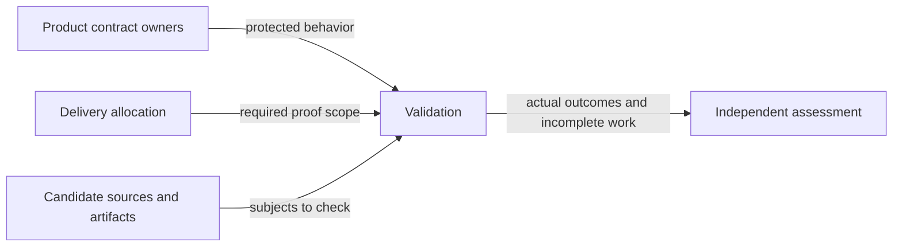
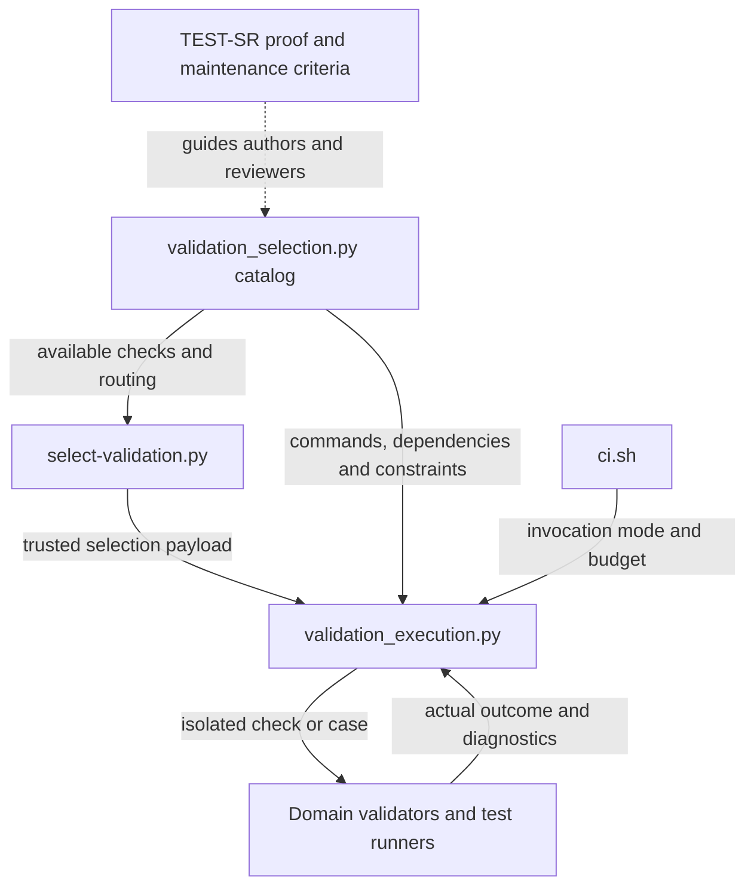
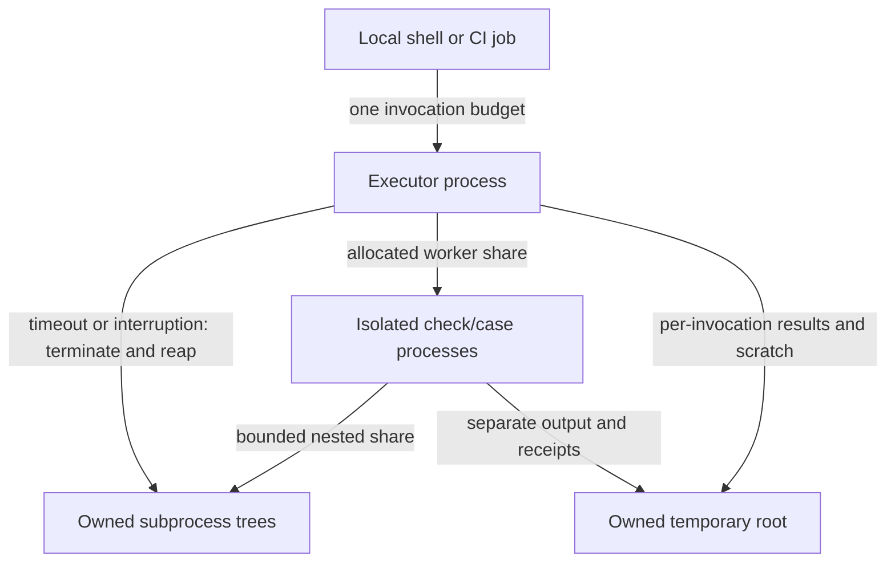
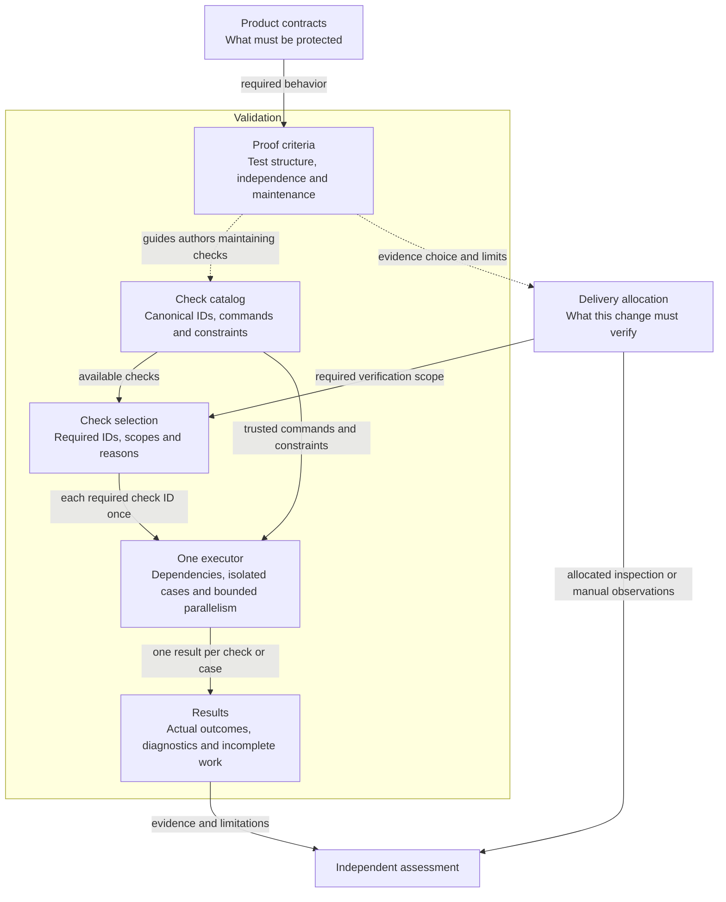
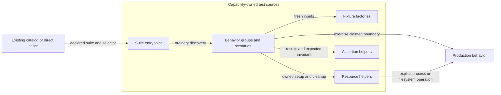
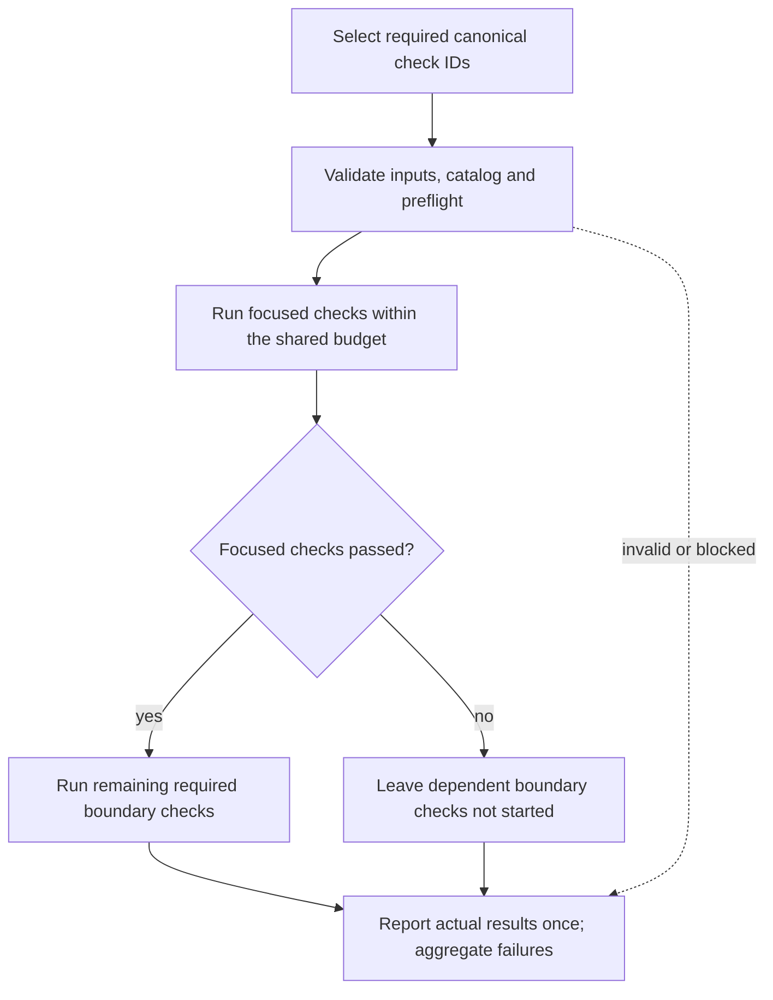

# Engineering Validation Model Design

Model validation contract: model-document-v1

Parent model: [Engineering](engineering.md#validation).

This child owns shared proof-quality criteria and this repository’s validation execution. Skill capabilities reference the reusable criteria; the executor, CI allocation and no-cache implementation belong to Engineering. Individual customer skill use does not install or require this repository’s executor.

Current test-structure refinement: [test design and complete suite organization](../../changes/2026-09-16-test-design-and-suite-organization/change.json), following its [approved direction](../../proposals/2026-09-16-test-design-and-suite-organization.md).

Original cleanup ownership: [current-design repository cleanup](../../changes/2026-09-13-current-design-repository-cleanup/change.json).

Prior refinement: [independent parallel tests](../../changes/2026-09-13-independent-parallel-tests/change.json); its selected behavior and evidence retain their own scope.

For this repository’s [complete source retirement](../../changes/2026-09-14-retire-specs-and-stale-tests/source-disposition.md), current responsibilities are self-contained in the owning Designs. Original source-transfer inventories remain recoverable through [Historical provenance](#historical-provenance); their instructions to retain or amend legacy specs, architecture, activation state or retired engines are historical and superseded by this complete retirement. Source-qualified IDs and original judgments keep their original meaning; provenance is not a runtime input or current approval. Customer feature contracts and explicit portable resources remain supported under their own project authority.

## Introduction and Goals

Validation owns useful proof, its maintenance, deterministic selection, independent execution and truthful reporting. Its test-design principle is risk-driven, contract-centered testing: protect important behavior against plausible defects at the smallest sufficient observation boundary. Add broader proof where interactions, artifact identity or execution conditions introduce failures that narrower checks cannot establish. The [independent-parallel-tests direction](../../proposals/2026-09-13-independent-parallel-tests.md) refines this owner, removes redundant cases without losing distinct protection, and extends independently runnable cases across the remaining repository-owned automated test inventory. Selection includes each canonical check once per invocation; validation-result caching remains retired.

The [original adoption](../../changes/2026-09-12-unified-validation-model/change.json) established the unified owner, preserved TEST-SR criteria, retired caching and adopted case execution for three suites. Its exact source-disposition maps remain recoverable through [Historical provenance](#historical-provenance); historical judgments retain their original scope. The independent-parallel-tests refinement changes check composition and remaining-case adoption as explicitly described here; it does not reopen the original cleanup. New behavior requires reviewed implementation and successful Verify of the [independent-parallel-tests change](../../changes/2026-09-13-independent-parallel-tests/change.json). Authoring and structural validation do not establish adoption.

## Context and Scope

| Responsibility | Owner and interaction |
| --- | --- |
| Required product behavior and invariants | Product Designs, including Skill, CLI, Packaging, Installation and Release, supply the obligations that checks protect. |
| Proof derivation, protective value, maintenance, selection and execution | Validation defines the common criteria and operational contract here. |
| Concrete verification allocation | Delivery selects milestone and integrated proof, commands, conditions and evidence expectations using these criteria. |
| Concrete cases and fixtures | Implementation or the authorized correction owner supplies assertions and isolation. |
| Judgment, independence, evidence applicability and final closeout | Review and Closeout governs the specialist assessors. A check pass or valid report never grants approval. |
| Activity and records | Workflow coordinates actors; Record Format defines stored evidence; CLI safely records explicit actor decisions. Validation execution does not mutate these decisions. |
| Packaging, installation and release operations | Their owners retain package integrity, publication policy, credentials and external actions. Validation supplies execution support without adopting customer governance. |

The proof criteria apply to unit, integration, system, regression, property-based and generated-output tests, and the choice of static or manual proof. Execution covers repository-owned local/CI selection and checks. It does not certify target-agent behavior, invent arbitrary application dependency graphs, introduce a hosted worker service, or replace domain validators with semantic scoring. No new public skill, lifecycle gate or evidence schema is introduced.

## Architecture Constraints

The Constitution and adopted owners govern. Authored validation logic stays in repository-owned scripts; hosted workflows remain thin. Existing selector and wrapper entrypoints remain public contributor interfaces, subject only to the explicit compatibility changes below. Runtime record safety, package hashing and dependency-download caching are separate concerns and remain intact.

Use one in-process orchestration implementation with subprocess execution of validators and test cases. Reuse the current selector catalog and scheduler logic; remove competing broad-smoke scheduling and historical metadata readers once their protection is established in the replacement. Isolation is process/fixture isolation, not a security sandbox. Tests run only with the invocation's existing permissions.

## Architectural supporting views

These views elaborate the overview at the owning model boundary. Existing detailed contracts, scenario tables and external owners retain their authority.

### Context View



Behavioral obligations, requested proof and assessment remain distinct external inputs/consumers. Detailed requirements and scenarios in this model remain authoritative.

### Building Block View



Catalog/selection and execution code have distinct trusted responsibilities and domain validators remain separate. Detailed requirements and scenarios in this model remain authoritative.

### Deployment diagram



One invocation budget spans supervisor, isolated cases and nested children; temporary ownership and cleanup are material. Detailed requirements and scenarios in this model remain authoritative.

## Requirements

| ID | Required behavior |
| --- | --- |
| TEST-SR-01 | Each new or substantively changed test or coherent group MUST have an identifiable governing Design obligation or explicit engineering obligation, objective, relevant condition, expected observable outcome and plausible violation it is intended to detect. References MAY be group-level and many-to-many; a new record or ID per test function MUST NOT be required. |
| TEST-SR-02 | Expected outcomes MUST come from the governing contract or an explicitly justified engineering obligation, not solely from current implementation output. A discovered regression or hazard with missing or conflicting behavioral authority MUST retain its reproduction and route the intended outcome to the Design owner; missing traceability alone MUST NOT justify deletion or fabrication of a requirement. |
| TEST-SR-03 | Case selection MUST cover representative outcome partitions, relevant boundaries and material hazards for the scoped obligation. A case added beyond existing protection MUST identify a distinct outcome, path, state, timing, authority, failure/recovery, compatibility or environmental contribution, or a justified diagnostic contribution that materially helps identify the protected failure. The rationale MUST explain that contribution; a different test name or repeated assertion alone does not establish diagnostic value. Mechanical Cartesian expansion and numerical coverage targets MUST NOT substitute for this reasoning. |
| TEST-SR-04 | Proof MUST observe the contract outcome at a boundary capable of exposing the claimed violation, including required absence of side effects. Mocks or helpers that bypass the behavior under assessment MUST NOT be cited as proof of that behavior. Lower-level and integrated tests MAY both be retained when their detection scope or diagnostic contribution differs. |
| TEST-SR-05 | Assertions and setup MUST distinguish correct behavior from the intended violation. Expected results computed by the same potentially faulty production logic, assertions that cannot fail on the claimed defect, and snapshots accepted without examining required outcomes MUST NOT be treated as sufficient protection. Review uses a concrete counterexample or inspected failure mechanism; mutation testing is optional, not universally required. |
| TEST-SR-06 | Property-based or randomized tests MUST identify their invariant, valid generated domain, relevant failure observation and enough failure data to investigate or reproduce a counterexample. A seed alone is insufficient when relevant environment or external state is uncontrolled. Random generation with a justified property MUST NOT be rejected merely because its inputs were not enumerated in Design. |
| TEST-SR-07 | Test maintenance MUST distinguish retain, strengthen, consolidate, replace and remove actions and state the affected obligation and protection impact for the changed scope. Runtime cost, naming similarity, age, missing labels, line coverage or a passing remaining suite alone MUST NOT establish redundancy. An unchanged legacy suite need not be retroactively annotated before unrelated work can proceed. |
| TEST-SR-08 | Removal or consolidation MUST identify the candidate scope, its existing failure detection and boundary, the retained or replacement proof, and why no required distinct protection is lost. Replacement proof MUST be established and assessed before relying on the reduced suite. An intentionally retired obligation requires an explicit governing owner decision and scope; removing its test cannot itself retire behavior. |
| TEST-SR-09 | When a candidate's protection is unknown, maintenance MUST preserve it while investigating or strengthening its basis; uncertainty MUST NOT be relabelled uselessness. A failing or flaky test MUST have its cause and contract relevance assessed, not be removed or skipped solely to obtain green validation. Any permitted quarantine requires an authorized owner, tracked follow-up, affected claim limits and alternative protection or explicit residual-risk treatment under the governing contract. |
| TEST-SR-10 | Test changes MUST identify impacts on fixtures, alternate callers, supported versions, runner discovery, selectors and generated outputs where those affect protection. Validation MUST demonstrate that selected checks are actually discovered and exercise the changed obligations; fewer failures caused by accidental loss of selection MUST NOT count as successful cleanup. |
| TEST-SR-11 | This model's criteria MUST be applied by the responsible specialist within its actual scope. Test-model criteria, structural validity or test success MUST NOT independently approve a suite, declare evidence applicable, choose an overall review judgment or waive an assessment. Those decisions and consequences remain governed by Review and Closeout RC-SR-01–18. |
| TEST-SR-12 | Delivery MUST allocate every affected obligation and material combined hazard to milestone or change-level proof and identify bounded cleanup targets and completion criteria before implementation. Execution MUST retain enough actual-result and maintenance rationale in existing plan, review and evidence surfaces to support the claimed protection; an additional test ledger or per-function receipt MUST NOT be mandatory. |
| TEST-SR-13 | Consumer adoption MUST map each affected shared criterion to one owner, preserve specialist methods and historical contracts, and provide selectively loaded portable guidance. Internal requirement IDs and repository-maintainer mechanics MUST remain in governance/contributor traceability, not published skill instructions. Installation, drafting or structural validation MUST NOT activate the policy or authorize deletion. |
| TEST-SR-14 | For the selected necessary-design consolidation, validation scope MUST follow affected obligations and actual readers/dependencies. Distinguish a useful retained check, a check required for this change, and a fresh execution. Apply the bounded retirement contract below when a check or exclusive assertion changes. Unknown impact MUST trigger investigation and broader relevant proof; existing mandatory or freshness requirements remain effective unless their owner explicitly amends them. No new ledger, benchmark or validation subsystem is required for source cleanup. |
| TEST-SR-15 | Every affected requirement and material hazard MUST receive an appropriate evidence allocation or an explicit authorized disposition under TEST-SR-12. Automated cases are required where meaningful, repeatable observations are needed to protect important executable behavior; a separate automated case for every requirement, instruction or implementation detail MUST NOT be required. Review or manual evidence MUST identify its assessed scope and limitations and MUST NOT waive an existing required executable check. |
| TEST-SR-16 | Semantic skill instruction quality MUST be assessed through the existing independent specialist reviews and applicable human PR review. Structural checks MUST limit their claims to what they observe. A focused manual scenario is required when a material uncertainty cannot be resolved by inspection and existing evidence. Routine agent execution, an automated semantic judge and a separate semantic evaluation gate MUST NOT be prerequisites for ordinary validation. Review of instructions MUST NOT be reported as demonstrated compliance in every execution. |
| TEST-SR-17 | Repository tests MUST follow the ownership-based target layout below, with coherent behavior groups and capability-owned fixtures. Adoption MUST reconcile imports, discovery, catalog commands, selectors, direct callers and fixture consumers in each moved slice, preserving distinct protection, isolation and truthful rerun instructions. A directory move MUST NOT silently delete cases or change required execution scope; existing locations remain valid until their coordinated migration. |
| TEST-SR-18 | Proof selection MUST identify the plausible defect and choose the smallest sufficient boundary that reliably distinguishes the required outcome from that defect. Broader proof MUST cover material interactions, artifact identity or execution conditions that narrower checks cannot establish, and MUST retain independently required product/release observations. Boundary descriptions MUST NOT impose mandatory layers, directory structures, case-count ratios or a separate test for every requirement. Execution cost and scheduler limitations MUST NOT redefine the protected behavior. |
| TEST-SR-19 | Repository test sources MUST separate cohesive behavior groups, reusable setup/resource support and suite collection as described in Test script structure. Shared support MUST expose its dependencies and preserve visible scenario intent. Prefer lightweight test classes and composition; inheritance or mixins require a concrete reuse or compatibility reason with assessed discovery and lifecycle behavior. File length alone MUST NOT impose splitting, deletion or a new validation gate. |
| TEST-SR-20 | A new or substantively changed repository test scenario MUST make its relevant starting condition, action and expected observable outcome understandable. Fixture factories MUST provide independently owned mutable inputs; helpers MUST NOT hide the defining fault, generate the claimed oracle through the assessed production logic, or convert failures into successful observations. Parameterized groups MUST preserve named meaningful conditions, fresh setup where needed and complete discovery/diagnostics under the existing runner. |
| VAL-SR-01 | New or substantively changed test cases MUST be runnable independently of other cases' order, results and mutable state. Each case MUST own setup and cleanup; shared fixtures MUST be immutable or independently materialized. A scenario MAY contain ordered internal steps without depending on another scenario. |
| VAL-SR-02 | Concurrent execution MUST require a current, explicit isolation basis covering writable paths, external resources, process environment, setup/teardown, nested execution and resource demand. Unknown safety MUST cause serial execution with a visible reason; contradictory or malformed safety metadata MUST fail before execution. Existing cases MUST NOT be assumed independent from naming or separate functions alone. |
| VAL-SR-03 | Selection MUST explain mode, changed paths, affected roots, selected checks and their reasons, scoped omissions and applicable boundary triggers. Deleted and renamed inputs, registered evidence and shared dependencies MUST participate. Missing or ambiguous routing MUST block with an actionable diagnostic; it MUST NOT yield empty successful proof or be erased by a passing diagnostic broad smoke. |
| VAL-SR-04 | Closed modes, statuses, check IDs and metadata values MUST be validated before consistency or execution. Missing required inputs, malformed output, unknown values, duplicate/conflicting identities and untrusted command substitutions MUST fail explicitly before launching selected work. Each new closed vocabulary MUST have an unknown-value regression. |
| VAL-SR-05 | The existing catalog MUST own executable check identity, trusted arguments, scope, dependencies and execution constraints. Selection and execution MUST share that definition rather than scrape shell text or trust supplied command strings. A dependency MUST be present and successful before its consumer starts; cycles and missing dependencies MUST reject. |
| VAL-SR-06 | Preflight MUST establish valid inputs, resolvable selected state and applicable cheap blockers before focused work. Failed preflight or focused proof MUST prevent dependent boundary execution unless explicitly requested for diagnostics. Diagnostic execution MUST preserve the original unsuccessful overall result and disclose its scope. |
| VAL-SR-07 | Independent selected cases and checks MUST normally run concurrently within one invocation-wide worker budget. Serial/exclusive work MUST not overlap conflicting work. Nested suite runners MUST consume an allocated portion of the same budget, never independently expand it. Jobs and timeout overrides MUST be positive integers; jobs=1 MUST preserve complete sequential coverage and diagnostics. |
| VAL-SR-08 | Execution MUST capture each task's stdout and stderr separately, attribute status and elapsed runtime from process start, and report in stable selection/discovery order. Reports MUST distinguish pass, assertion/command failure, unavailable command, signal, timeout, runner error and work not started. Missing or undecodable results MUST remain visible and cannot become passes. |
| VAL-SR-09 | Default execution MUST complete independent required work and aggregate failures. Explicit fail-fast MUST stop launching queued work after an observed failure, preserve started-task outcomes and report the unstarted remainder. Failed dependencies, cancellation and interruption MUST likewise leave required unfinished work visibly incomplete and the overall result unsuccessful. |
| VAL-SR-10 | Timeouts and interruption MUST terminate and reap owned child process trees, preserve collected diagnostics and release owned temporary resources without modifying unrelated state. A retry MUST execute anew against current inputs and MUST NOT promote a prior partial run or silently retry failures until green. |
| VAL-SR-11 | Validation commands MUST NOT read or write validation-result caches or substitute cache hits for execution. Retired cache flags, helper modes and measurement inputs MUST reject before validation or writes. Routine validation MUST leave old local caches untouched; the explicitly scoped one-time repository cleanup below MUST remove the disposable default cache directory. Historical evidence MUST remain unchanged; other hashing, persistence and dependency mechanisms MUST NOT be removed under this requirement. |
| VAL-SR-12 | Execution reports MUST identify actual commands/cases, subject/scope, phase, result, duration and limitations, with compact ordered summaries and actionable rerun diagnostics. Selecting or discovering work MUST NOT claim it ran. Required skips, unexpected discovery loss and missing results MUST prevent a complete-pass claim. Explicitly authorized non-applicability remains an assessor decision. |
| VAL-SR-13 | This initiative's cleanup MUST map distinct protected failures to established retained proof or an explicit obligation retirement, reconcile actual readers and remove the selected superseded sources and exclusive machinery. Unknown protection MUST be investigated and preserved. Use existing Design, Delivery and evidence surfaces; no second ledger, deletion quota, dual execution of retired behavior or mandatory savings benchmark is required. |
| VAL-SR-14 | Direct validator and test entrypoints MUST remain complete for their declared scope unless explicitly retired below. Pure logic MAY be tested in process, but subprocess/CLI behavior MUST retain proof at that boundary. Parallelism, narrower reporting and test refactoring MUST NOT hide required cases in optional-only commands or weaken failure sensitivity. |
| VAL-SR-15 | Validation MUST preserve domain-owner checks and applicable broad-smoke/release triggers. The runner MUST NOT invent policy from file extension, reduce required proof for speed or bypass release preparation/publication boundaries. Evidence applicability, fresh-execution overrides and final readiness MUST remain under their existing owners. |
| VAL-SR-16 | Coordinated adoption MUST update current governance, model references, skills and executable/package consumers, retire the mapped old authorities and preserve historical record bytes and judgments. Public guidance MUST remain portable and selectively loaded, without internal model IDs, maintenance paths or a new mandatory test ledger. |
| VAL-SR-17 | Checks MUST use invocation-owned isolated temporary roots and explicit environment/working-directory values. Logs and durable evidence MUST avoid credentials, private environment dumps and sensitive host paths. Cleanup MUST be limited to resources created by that invocation; network or external writes MUST retain separate authorization and declared constraints. |
| VAL-SR-18 | Performance claims MUST name measured scope, commands, environment, results and limitations; output reduction alone is not runtime improvement. Per-run timings MAY support diagnosis without a historical benchmark dependency or permanent sidecar store. No new failing performance threshold is introduced by this model. |
| VAL-SR-19 | Selection MUST include each canonical catalog check ID once per invocation and preserve its selecting reasons. Known duplicate entries MUST be consolidated only after their required proof and preparation agree. Different configurations or required observation points MUST retain distinct explicit IDs. Conflicting definitions or resolved arguments for one ID MUST reject; the executor MUST NOT infer equivalence from command strings or reuse results across invocations. |
| VAL-SR-20 | Focused and boundary composition MUST preserve phase gates and explicit preparation dependencies while avoiding repeated execution of the same canonical ID. Boundary scope MUST remain blocked after a required focused failure, even if an overlapping check passed. Reports MUST contain one actual result and duration per executed check/case, preserve canonical IDs and expose required unstarted work. No additional request/consumer graph or result projection layer is required. |
| VAL-SR-21 | The current initiative MUST assess all current repository-owned automated test populations, including cases reached by direct, selected, broad-smoke, main and release validation entrypoints. Every retained case MUST be independently runnable and parallel-capable within the shared resource budget. Temporary serial fallback for unknown safety MUST NOT count as completed adoption. Delivery MUST reconcile discovery and actual callers, allocate bounded groups and account for additions or removals before final completion; no unassessed population may silently move to later maintenance. |
| VAL-SR-22 | Remaining order-coupled or resource-conflicting cases MUST be refined or replaced with equivalent independent proof. Deletion MUST satisfy TEST-SR-07–10 through established retained detection or explicit retirement by the behavior owner. Unknown required protection or an irreducible required external resource blocks affected completion. Resource-limited sequential scheduling, prerequisite ordering and ordered steps inside one isolated scenario do not themselves violate case independence. |
| VAL-SR-23 | The current cleanup MUST retire the historical ledger validator/test/check and fixed representative spec-read-log check selected below, including exclusive fixtures, catalog entries and caller expectations. Their retired instrumentation MUST NOT be recreated as a new mandatory ledger or synthetic pass. Current requirement fidelity, catalog coverage, unknown-value rejection and protection-preserving maintenance remain required. |
| VAL-SR-24 | Tests whose only obligation is the continued existence or wording of a completed historical report MUST retire with that obligation. Retained measurement, report, source-safety and parser behavior MUST use meaningful independent fixtures. Deleted paths MUST select surviving affected checks without launching removed commands, and absent historical artifacts MUST NOT hide malformed current inputs. |
| VAL-SR-25 | Retire repository-owned token-cost measurement, benchmark execution and reporting as a supported feature, including exclusive tools, reports, templates, fixtures and checks. Remove current skill, selector, adapter and release dependencies coherently; no optional measurement service, synthetic passing gate or mandatory substitute metric remains. Preserve independently useful source-safety, output-contract, privacy and qualification protection with non-token fixtures. Historical judgments remain unchanged; design authoring alone does not claim implementation complete. |
| VAL-SR-26 | Repository-wide test retirement MUST assess actual cases, fixtures and generated inputs against present protective value under TEST-SR-01–14. Retain or refine distinct current negative/regression proof; remove stale or demonstrably redundant cases and exclusive fixtures. Missing scope, uncertain protection or unassessed generated cases block complete cleanup. |
| VAL-SR-27 | Evidence and deleted-path selection MUST obey Current evidence and deletion routing below. Known selected work MUST NOT mask unknown or ambiguous changed paths, and actual branch routing MUST be proved before Verify. |
| VAL-SR-28 | Boundary validation MUST check current models and explicitly selected supported feature/proof records without relying on retired repository specs, historical activation records, rollback archives or Git grandfathering. Structural validity MUST remain separate from project adoption and semantic Design Review. |
| VAL-SR-29 | The complete skill/support refinement MUST account for every current test, fixture and script population through the inventory groups below, including generated, direct-only, package and release cases. Group-level disposition MUST identify protected failures and actual consumers; unresolved or omitted populations block completion. Prior cleanup approval and passing reduced suites are insufficient. |
| VAL-SR-30 | Selected query-helper retirement MUST remove its exclusive cases, catalog entry and callers together under CLI-SR-31. Deleted paths MUST select surviving current record/selector protection without invoking missing commands or synthesizing a passing alias. Current record safety, unknown-value rejection and customer-resource containment MUST remain independently protected. |
| VAL-SR-31 | Wording-based checks may be consolidated or replaced only after their protected failure and sufficient retained observation are established under TEST-SR-07–10. Semantic adequacy remains independent review-owned; structural checks MUST retain meaningful negative coverage and cannot treat missing headings or resources as success. Current command descriptions MUST match the actual accepted input boundary. |
| VAL-SR-32 | The test-design-and-suite-organization change MUST assess the complete current repository and package test inventory under Complete suite organization, including generated/imported cases, fixtures, helpers and alternate execution paths. Every coherent group MUST have a supported retention or change disposition; unknown protection and missing populations block completion. Reorganization MUST preserve required observations and execution reachability, reconcile consumers and account for additions since the assessed baseline. Earlier directory moves or a bounded pilot MUST NOT establish this initiative's completion. |

## Solution Strategy

Follow the many-to-many chain: governing obligation → objective and plausible violation → representative condition and observation boundary → concrete proof → observed evidence → independent assessment. The retained TEST-SR identities carry their existing meaning; model consolidation does not require per-function trace records or numerical coverage targets. VAL-SR-01–18 preserve the original execution and retirement contract; VAL-SR-19–22 define the current check-composition and remaining-case refinement.

Reuse the existing `scripts/lib/validation/validation_selection.py` catalog, `scripts/select-validation.py` CLI and `scripts/ci.sh` entrypoint. Use `scripts/lib/validation/validation_execution.py`, the extracted internal module also used by broad smoke. This preserves one execution implementation; it is not an additional public command, persistent worker or separate validation service. Keep domain validator processes separate from orchestration.

## Architecture Overview

### Structural design graph



Validation owns the five responsibilities inside its boundary; they are not separate models or services. Product contracts, Delivery allocation and independent assessment remain external owners. The criteria guide authors maintaining checks; they do not automatically judge test adequacy. `scripts/lib/validation/validation_selection.py` owns the catalog and selection. `scripts/lib/validation/validation_execution.py` owns scheduling, subprocess cleanup and results. `scripts/ci.sh` remains the wrapper. Authors and reviewers apply the TEST-SR criteria; passing checks never supply semantic approval. [Engineering](engineering.md#subsystem-design-graph) owns how Validation supports Development, Packaging and Release.

The [Context and Scope](#context-and-scope) owns product-contract, Delivery and assessor boundaries. [Proof criteria and maintenance](#requirements) define Criteria, with boundary selection in [Risk-driven contract testing](#risk-driven-contract-testing) and authored source responsibilities in [Test script structure](#test-script-structure); [Solution Strategy](#solution-strategy) defines the shared catalog/selection/executor realization, and [Runtime View](#runtime-view) owns execution and result flow. [Deployment View](#deployment-view) owns process and environment constraints. These references supply detail without making the overview another execution contract.

Catalog execution units remain `command`, `python-unittest` and `node-test`. Retain the current command/adapter basis, isolation rationale, dependencies and serial/exclusive/bounded resource constraints. Stale or contradictory metadata and unknown fields/units reject before execution. Missing isolation assessment keeps work conservatively serial until corrected; it does not satisfy the current case-independence completion requirement.

### Supporting-view decisions

| View | Necessity and reason | Owning detail |
| --- | --- | --- |
| Context | Necessary: Behavioral obligations, requested proof and assessment remain distinct external inputs/consumers. | [Context view](#context-view) |
| Building Block | Necessary: Catalog/selection and execution code have distinct trusted responsibilities; authored test groups and support must expose their dependencies. | [Building Block view](#building-block-view) and [test-source composition](#test-script-structure) |
| Runtime | Necessary: Focused gates, dependency failure and diagnostic continuation determine which work may start. | [Runtime view](#invocation-flow-graph) |
| Deployment | Necessary: One invocation budget spans supervisor, isolated cases and nested children; temporary ownership and cleanup are material. | [Deployment view](#deployment-diagram) |


## Risk-driven contract testing

TEST-SR-01–05/15/18 govern how authors choose proof. Begin with required behavior and a plausible defect, identify where that defect becomes observable, then choose a sufficient boundary, realistic fixture and independent expected result. A test that can fail for an unrelated reason does not establish the intended protection. This is an authoring method for a coherent group, not required metadata for each function.

### Observation boundaries

| Boundary description | Protection and representative observation |
| --- | --- |
| Contract | A bounded rule or decision: invalid profile fields reject, a hash matches an independently known value, or a field update preserves unrelated data. Use only the state needed to expose that violation. |
| Public boundary | The interface actually used by a caller: arguments, result shape, diagnostics, exit status and required absence of filesystem/network side effects. A parser-only assertion cannot prove command dispatch or persistence. |
| Composition | Agreement between owners: canonical Skill resources become the correct package inventory, or a verified archive is consumed correctly by Installation. Execute the cooperating code where their agreement is claimed. |
| Product/release proof | The actual artifact or operational environment where identity matters: a packed CLI, generated candidate, real Git persistence or Release-required public smoke. A simulated environment cannot prove a public publication observation. |

These descriptions can overlap: a public-boundary case can also prove composition. Contract-centered reasoning applies to every row; “contract” here describes a bounded rule, not exclusive ownership of contractual correctness. Cost depends on setup and execution, not the row name. They are independent of the executor’s focused/boundary phases and create no new catalog vocabulary, test directories, lifecycle gates or prescribed proportions.

Choose broader proof only when it contributes a required observation beyond narrower evidence, or an existing governing obligation explicitly requires that execution. Do not automatically retain both levels: deliberate overlap needs distinct failure detection or useful diagnosis under TEST-SR-03/04/08. For example, hash edge cases can use small independent vectors, canonical archive completeness needs real generated-member inspection, and archive consumption needs the actual packed installer. Repeating full installations for each hash input adds no necessary protection when the narrower cases and composed path already expose the relevant defects.

### Fixtures, expectations and failure scenarios

Exercise the code whose correctness is claimed; simulate an external dependency only outside that boundary and state the resulting limits. Release orchestration can use controlled provider responses while retaining real retry decisions and evidence recording. Such a case does not establish the provider's actual behavior or replace required public smoke. A builder mocked to success cannot prove archive contents.

Expected results must be independent of the potentially faulty logic under assessment. Independently inspect canonical inputs and emitted members, or use contract-derived values and counterexamples; do not generate both expected and actual results through the same defective inventory or hash calculation. Shared setup helpers are acceptable when they do not become the oracle for the claimed behavior.

Use the smallest realistic fixture that preserves the failure mechanism. Each independently runnable case owns mutable state. Shared immutable inputs may be independently copied or materialized; a required ordered operation sequence belongs inside one coherent scenario, not across dependent tests. For expensive groups, first examine repeated fixture construction and unnecessary product setup. Preserve realistic Git, filesystem, archive or process behavior wherever a smaller substitute would hide the defect.

A case normally has one coherent reason to fail, which can require several assertions: a rejected command may need a nonzero exit, actionable diagnostic and unchanged destination. Consider valid/invalid input, conflict, interruption, retry, partial success, stale basis and environment differences where they change the required outcome; do not require every combination for every operation. A lost publication response followed by retry must observe external state without a second immutable-version write at the real orchestration boundary. A pure retry helper cannot establish that composed claim.

### Test script structure

TEST-SR-19/20 refine authoring within the existing capability layout. Keep Python `unittest` and native Node tests. A test file is a cohesive behavior group, not automatically one production file, historical milestone or observation level. Group, for example, resource-map validation separately from record persistence or release recovery. A public-command group may exercise several production modules when their composition is its protected behavior.

| Source responsibility | Contents and dependency rule |
| --- | --- |
| Behavior module | Related scenarios and their governing obligation or group-level rationale. Keep the conditions and expected outcomes near the actions they explain. |
| Test class or named group | Related scenarios sharing a small, relevant setup contract. Python normally uses direct `unittest.TestCase` subclasses; Node normally uses test functions and optional native grouping. Neither class count nor symmetry between languages is a target. |
| Fixture factory | Fresh valid data or a small owned input tree with explicit variation points. It may use production utilities outside the claimed observation boundary, but cannot derive that boundary's expected result from the same potentially faulty logic. |
| Resource helper | A cohesive lifecycle for an owned temporary repository, archive workspace or child process. Creation, operations, cleanup and externally significant options are explicit. |
| Assertion helper | A repeated contract invariant with useful actual-versus-expected diagnostics. It receives observable results and independently justified expectations; it does not quietly perform the tested operation or recover it into success. |
| Suite entrypoint | Existing argument/filter handling and ordinary collection of its declared groups, including supported hooks and reporting. Move scenario bodies into their owners when responsibilities diverge; retain a complete direct invocation. |

These responsibilities may share a small module when each remains clear; the table does not require a separate file, class or helper for every row. A simple directly runnable test module needs no additional aggregate entrypoint. Extract support when its actual reuse or lifecycle responsibility makes the scenarios easier to understand.

The graph describes dependencies within one capability's authored tests. It refines the existing Building Block view and adds no runner, catalog or independently deployed component.



Use composition for ordinary reuse: a test calls a fixture function or owns a resource helper. A resource class is justified when related state and cleanup belong together; a static input dictionary does not require a builder hierarchy. Never instantiate another test class or call its `setUp`/test method to borrow a fixture. Production modules must not depend on test-only support. Shared assertion and fixture helpers must not import their consuming test classes or suite entrypoints; this preserves ordinary loading and avoids circular discovery.

Prefer direct test classes over layered inheritance. Existing mixins can preserve selectors during a move, and a shared contract group can test several actual implementations, but either needs explicit consumers, hook ownership and case-discovery evidence. Inherited test methods must not accidentally run twice or disappear under a case filter. A compatibility technique is not a requirement to spread every behavior through mixins. Preserve a supported case selector where feasible; an intentional identity change needs the before/after mapping and consumer reconciliation below, rather than duplicate aliases.

Split a module when its groups have independently explainable contracts, substantially different fixture/resource needs, or changes repeatedly require navigating unrelated scenarios. Keep small related variants together. Keep support local until actual consumers justify sharing it; do not introduce a generic `utils` module to collect unrelated operations. There is no maximum line count, mandatory one-class-per-file rule, or automated style gate for these judgments.

Name modules and classes after protected behavior, and cases after the relevant condition and outcome, such as `ResourceMapTests.test_missing_declared_resource_is_rejected`. Avoid introducing names that only identify a former milestone or implementation helper. Existing identifiers may remain when their compatibility value exceeds renaming value; a descriptive rationale can explain them. Python importable support modules use valid module identifiers and Node modules follow package conventions. Preserve existing hyphenated direct entrypoint filenames until their actual command consumers are deliberately reconciled; standard filesystem discovery must not be assumed to find them.

### Scenarios, fixtures and variations

Read a case as arrange, act and assert: the relevant initial state, the real operation at the selected boundary, and the expected observation. These parts need not have literal comments or a fixed assertion count. Keep the defining invalid value, missing resource, conflict or interruption visible in the case. A helper with flags for many unrelated scenarios obscures those differences and should be separated into smaller operations. Some repeated local setup is preferable to a shared abstraction that hides why a test should fail.

Factories return fresh nested mutable values, not shallow copies of shared mutable defaults. Register cleanup as soon as a resource is acquired so later setup or assertion failures still release it. Resource helpers own only their temporary roots, subprocesses and allocated resources; they must not delete caller-owned paths or restore an entire developer worktree. Working directory and relevant environment are explicit. When process-global state is itself under test, keep the observation in its isolated process under VAL-SR-01/17 rather than leaking changes to other cases.

Class/module setup is not a persistent shared cache: the existing per-case worker model may rerun it for each case. Share only immutable prepared inputs with a justified owner and lifetime, and materialize private copies before mutation. A fixture can be realistic without copying the complete product; actual archive, Git, CLI or filesystem behavior remains required where reducing it would hide the protected defect. Generic setup validity may be checked, but the assertion of the claimed behavior still needs its independent oracle under TEST-SR-05.

Use named parameter rows or subtests when the same behavior and fixture shape vary by meaningful input. Keep distinct recovery or authority transitions in separately understandable scenarios. Do not create Cartesian combinations without distinct protection. Every parameter that mutates state starts from a fresh fixture unless the ordered steps deliberately form one scenario. Register generated Node cases deterministically through the native runner and include their named population in the discovery basis. Python subtests remain observations within their containing `Class.test_method`; do not claim that each row is independently scheduled. Randomized properties retain counterexample and environment information under TEST-SR-06.

Assertions must fail for the intended violation. For rejection, observe the intended error and any required absence of side effects, not merely a nonzero status that could come from a broken fixture. Match stable error codes or diagnostic meaning where available; exact wording is appropriate only when that wording is part of the contract. A mutation of a string fixture must establish that the intended input actually changed. Snapshots need inspected contractual expectations; blindly replacing a golden file after failure cannot establish correctness.

### Worked authoring examples

These are illustrative excerpts owned by Validation under TEST-SR-04/05/19/20 and VAL-SR-01/14/17. They are not executable fixtures, new helper APIs or evidence that the product passed. The Python example assumes `write_valid_skill` creates a private valid skill declaring `references/guide.md`, and `run_validator` invokes the actual validator command with explicit working directory/environment and returns its captured process result. Their implementations and imports are omitted. The helper names explain roles; Delivery and implementation select concrete reuse.

```python
class ResourceMapTests(unittest.TestCase):
    def setUp(self):
        temporary = tempfile.TemporaryDirectory()
        self.addCleanup(temporary.cleanup)
        self.root = Path(temporary.name)

    def test_missing_declared_resource_is_rejected(self):
        skill = write_valid_skill(self.root)
        resource = skill / "references" / "guide.md"
        resource.unlink()

        result = run_validator(skill)

        self.assertNotEqual(result.returncode, 0)
        self.assertIn(
            "mapped resource 'references/guide.md' does not exist in canonical skill source",
            result.stderr,
        )
        self.assertFalse(resource.exists())
```

The defining fault and outcome are visible, while setup and command mechanics can be reused. The diagnostic fragment follows the current mapped-resource validator and distinguishes this failure from an unrelated exception mentioning the path; an implementation with a stable error code can assert that code instead. The last assertion observes only absence of a recreated resource, not general filesystem preservation. If the claimed contract requires no writes anywhere in the supplied tree, compare its relevant paths and bytes before and after instead. Replacing the real command with a stub that returns failure would lose public-boundary proof even if every assertion still passed.

For Node, keep an analogous test function: acquire a private root, immediately register cleanup with the native test context, build a fresh valid request, apply the visible fault, invoke the selected real boundary and assert its error and preservation outcome. Classes add value only for a reused resource lifecycle; wrapping every native test in an object adds no protection. Register related generated cases with unique condition names before execution and keep each case's mutable request independent.

| Scenario contrast | Required observation and authoring consequence |
| --- | --- |
| Unknown value in an otherwise valid closed vocabulary | Assert the owning rejection before consistency work; do not combine unrelated invalid fields whose earlier failure masks the intended check. |
| Rejected record update | Observe the actual command/result contract and unchanged relevant stored bytes; an assertion of failure alone misses partial mutation. |
| Archive completeness | Compare real emitted members with independently justified canonical inputs; importing the producer's inventory as both expected and actual hides omitted resources. |
| Release interruption followed by recovery | Keep the ordered steps in one isolated scenario with explicit persisted state; a separate test must not depend on the first test's leftovers. |
| Two generated invalid-input variants | Preserve both named observations and fresh setup; losing one registration cannot be described as a successful file split. |
| Equivalent instruction wording | Structural tests claim only their explicit structural obligation. Semantic adequacy remains with independent review; phrase changes alone do not establish a product defect. |

### Ownership and maintenance

| Owner | Acceptance intent retained by this method |
| --- | --- |
| [Skill](../skill/skill.md) and [Assessment](../skill/assessment.md) | Structural/resource checks state their deterministic scope; independent assessment judges instruction adequacy under TEST-SR-16. No automated semantic-quality gate is introduced. |
| [CLI](../cli/cli.md), [Records](../cli/records.md) and [Installation](../cli/installation.md) | Actual command behavior, persistence, conflicts, recovery and safe filesystem mutation retain their owned observation boundaries. |
| Validation | Complete selection/execution, truthful results, isolation and cleanup retain the VAL-SR obligations below. |
| [Packaging](packaging.md) | Canonical resource completeness, trusted metadata and actual generated/packed consumer compatibility retain required artifact proof. |
| [Release](release.md) | Candidate identity, uncertain publication, retry/recovery and independently required fresh public observations retain their release-specific authority and evidence rules. |

Capability Designs own behavior and material risks. Delivery allocates concrete proof, commands and execution points; implementation supplies fixtures and assertions. The selector and scheduler determine when and how admitted checks run, not which behavior counts as sufficient protection. The overview's Criteria responsibility owns this method; existing Context, Building Block, Runtime and Deployment views remain applicable because no execution component, actor or trust boundary is added.

Under TEST-SR-07–10, assess an expensive group by its detection value, execution cost and maintenance burden. Identify its distinct protected failures and existing proof before retaining, strengthening, consolidating, replacing or removing cases. Establish and independently assess adequate retained/replacement protection before reducing the suite. Slow execution, inability to parallelize or repeated setup alone cannot justify deletion or a change in the behavior the test claims to establish. Existing validation-result caching prohibitions and required fresh execution remain in force. Optimize execution without weakening protection; test count and coverage percentages are not the objective.

## Runtime View

### Invocation flow graph



This is the selected-mode flow. Main and standalone broad-smoke use their declared check sets with the same executor and preparation dependencies. Explicit diagnostic boundary execution may follow a failed focused gate, but preserves the original failure. Cases within each runnable scope execute concurrently when assessed safe; jobs=1 preserves the same coverage. Timeouts, interruption and fail-fast retain the failure/cleanup contract below.

### Select each check once

Preserve existing modes, path/range resolution, deleted/renamed input handling, selecting reasons and selector JSON. Unknown or ambiguous routing blocks with an actionable diagnostic; fallback output is not executed. Selector exit meanings remain ok=0, blocked=2, fallback=3 and error=4. Explicit-path validation needs no invented Git-history prerequisite. Preflight remains read-only and checks applicable conflicts, required inputs and blockers before dependent work.

Use the modes and triggers in [Validation scope and cost](#validation-scope-and-cost), preserving scoped exceptions and Release’s `release-coordinator.py check-ci` interception. A focused pass does not waive required boundary proof. Composed broad work expands into the existing executor rather than recursively launching another wrapper or worker pool. Publication policy remains Release-owned.

Use the existing catalog check ID as execution identity. Selection combines required IDs in stable order and retains every selecting reason. The same ID is included once in an invocation; the executor does not discover equivalence between different IDs or command strings. Authors consolidate known duplicate catalog entries after checking their commands, inputs, observation boundaries and prerequisites. Different configurations, artifact destinations or required execution points have distinct, explicit catalog IDs. Conflicting resolved arguments or constraints for one ID fail before launch rather than being silently combined.

Let `F` be the selected focused IDs and `B` the required boundary IDs. Run `F`, then run `B − F` after the focused gate succeeds. Checks in `F ∩ B` already have their actual result; listing them in both scopes does not schedule another execution. Boundary completion requires the focused gate and all required `B` checks to pass. If another focused check fails, boundary scope stays blocked even when an overlapping check passed. Preserve the failed focused result during diagnostic execution of remaining boundary work. No per-request state machine is needed.

For the known duplication, focused and broad-smoke selection both name `validation_execution.regression`. Retire `broad_smoke.validation_execution.regression` as a separate executable catalog entry and update current selectors, diagnostics and tests that expect it; historical evidence keeps its original ID. The repeated check is removed from the composed work, not hidden in reporting. Boundary-only selection still executes it once. A new invocation always executes anew.

Dependencies remain explicit on the retained check plan. A package validator waits for its own successful build. Reusing a check ID across scopes is allowed only when that preparation and observation are the same; a required post-build, post-mutation or independently fresh check receives a distinct ID and dependency. Do not move work earlier merely because its command resembles a focused check. Missing dependencies and cycles reject. This is catalog reconciliation and set composition, not an input-fingerprint, alias-equivalence or evidence-reuse engine.

### Supporting subjects in current change directories

For VAL-SR-03/04, distinguish authoritative stored records from engineering Subjects. A changed non-reserved path inside a current change directory may be routed as supporting material only when the existing complete-set validator validates that registered snapshot and returns an explicit Subject naming that exact repository-relative path. This does not register the file as a record, grant it authority or infer evidence applicability. Reuse the existing store reader and schema; do not create another record parser or a filename-only exemption.

Reserved record paths still require their matching registry entries, even if a Subject names them. Unreferenced paths, malformed or unavailable stores and unsafe or escaping support paths remain blocking; a mixed allowed/unknown selection cannot hide the unknown member. Selection retains complete-set validation and existing applicable document or consumer checks. Support files may be modified, added or deleted without rewriting earlier recorded Subject identities; assessment owns the resulting reliance decision. Subject paths must come from the same in-memory snapshot that passed cross-record reference validation. The repository validator may expose a bounded Subject-path result; its normal and revision-validation behavior stays unchanged, and mixed or unknown options reject. One selection invocation may reuse its validated root result, but later invocations must validate current bytes again.

### Validation scope and cost

Use targeted validation first when changed paths are known and no applicable broader trigger requires more. Broad checks remain driven by selector modes and explicit requests, approved plan requirements, independently applicable retained test contracts, required review corrections and release metadata. Preserve the established `main`, `release`, explicit `--broad-smoke` and applicable `broad_smoke_required: true` triggers through their current execution owners. A wrapper invocation or a nontrivial PR alone does not justify a new universal broad-smoke requirement. For dirty worktrees, use explicit paths, appropriate diff modes or wrapper selection to distinguish the authorized change from unrelated work without hiding required failures.

Validation owns these coverage obligations; repository selection scripts realize executable routing, plans allocate change-specific proof, Assessment owns finding and final-Verify adequacy, and Release owns release requirements. Guidance or output shortening cannot change selected coverage, exit behavior, failure detection or evidence requirements. Preserve applicable lifecycle, review, metadata, generated-output, adapter and release checks, with token-report obligations explicitly retired by VAL-SR-25. Selector changes need selection regression proof; wording-only changes do not require invented selector behavior tests. Final Verify compares actual evidence with the approved allocation and every applicable correction and release trigger. For skill wording, apply Skill’s [evidence and proportional-effort rules](../skill/skill.md#evidence-access-and-proportional-effort). Static checks protect behavior and structure without freezing equivalent sentences or claiming semantic read auditing.

### Evidence selection and semantic assessment

Owning Designs define expected behavior and material hazards. Delivery allocates concrete evidence; implementation supplies automated assertions or manual observations; existing reviewers assess adequacy under [Assessment](../skill/assessment.md). TEST-SR-15/16 clarify the choice of evidence without changing review independence or stage authority. Human PR review complements required earlier reviews and is conditional on a PR being used; individual skill use does not require Git or a PR.

| Claim | Appropriate evidence and limit |
| --- | --- |
| Executable public behavior, validation, data preservation, coded authority enforcement and recovery | Repeatable automated assertions at the boundary that exposes the failure. Use real filesystem, process, CLI or packaged-output observations where the claim requires them. |
| Skill instruction meaning, consistency, judgment and handoff clarity | Independent specialist inspection of the actual instructions against the owning Design, complemented by human PR review where applicable. This assesses instruction quality, not universal agent compliance. |
| Material behavior still uncertain after inspection and existing checks | A focused manual scenario with explicit starting conditions, expected outcome, observed actions/artifacts and limitations in existing evidence. Use isolated owned state and existing external-action permissions. |
| Incidental wording or insignificant input variation | No dedicated automated case unless it protects a distinct required interface, outcome or material diagnostic contribution. Existing cases receive TEST-SR-07–09 assessment before consolidation or removal. |

Group-level rationale identifies the obligation, objective, representative condition, expected observable outcome and plausible violation. Requirements and groups have a many-to-many relationship. Representative success, relevant outcome boundaries, material failure/recovery and demonstrated regressions guide selection; these are prompts, not a compulsory four-case template or Cartesian checklist. Lower-level tests and integration tests can protect different boundaries within the same capability. A case's small size does not establish low value.

No dedicated semantic harness is selected. Repeated real failures may justify a later scoped behavioral evaluation, but neither test counts nor a structural pass justify claims that an agent obeys instructions. Material unresolved uncertainty remains visible to the responsible assessor.

### Tooling placement

[Engineering ENG-SR-16](engineering.md#repository-tooling-organization) owns command/module/resource separation. Validation internal modules live under `scripts/lib/validation/`; executable entrypoints remain at their current paths. Python and Node worker launchers, discovery adapters, direct tests and copied repositories must resolve the same internal implementation without relying on a caller’s working directory. Selection recognizes exact new module/resource paths and old deletion paths with equivalent required checks; unknown paths remain rejected by the existing unsupported/unclassified handling. Canonical check identities, command-basis validation, case populations and failure/cleanup behavior are preserved.

### Test sources, groups and fixtures

[System](../system.md#repository-directory-layout) selects the repository source boundaries. TEST-SR-17 realizes them as this target layout; directory names express current responsibility, not a required folder for every Design document:

```text
scripts/                           # Stable validation and maintenance commands
  lib/validation/                  # Internal validators, selection and execution
  resources/                       # Authored operational inputs
tests/
  skill/                           # Published skill contracts and resource interfaces
  engineering/
    validation/                    # Validators, selection, execution and document/record validation tooling
    packaging/                     # Distribution and package qualification tooling
    release/                       # Release tooling and its test support modules
  fixtures/                        # Inputs genuinely shared across test groups, by capability
packages/rigorloop/test/            # Package-owned CLI, Records and Installation behavior
```

Create only directories supported by actual cohesive test populations. Within a capability, group cases by protected behavior and meaningful scenarios; split files when responsibilities become independently understandable. The checked subject alone does not choose the test owner: a repository validator for record documents is Validation tooling, while package record persistence belongs to CLI/Records. Cross-component scenarios have one primary owning group with references to participating contracts. Package-native tests stay with the package; a repository-level CLI group requires actual integration work outside that package's responsibility.

Exclusive fixtures and test-only helpers stay beside their owning tests. Shared `tests/fixtures/<capability>/` inputs have identifiable consumers and one owner; immutable shared inputs are copied into invocation-owned temporary roots before mutation. Scratch state and generated run outputs do not belong in committed fixture directories. Production scripts MUST NOT depend on test-only helpers; an actually shared runtime utility keeps its production owner rather than moving into tests merely because tests import it.

Supported aggregate suites now live under the capability test roots above; earlier `scripts/test-*.py` source paths remain historical migration inputs rather than a second runnable suite. Preserve current entrypoints, imported support groups and fixture interfaces until each further change is reconciled. Migration inventories include dynamically generated cases, imported suites, inline fixtures and temporary-tree builders. Reconcile root discovery, module loading, shell/package callers, selectors for both sides of renames, deleted-path routing, catalog commands and reported rerun paths. Preserve canonical check IDs where their observation and preparation remain the same; changed path-derived case identities require an explicit before/after discovery mapping in delivery evidence, without rewriting historical reports. No permanent alias, second catalog or new evidence schema is selected.

Each moved slice must demonstrate complete ordinary discovery, focused selection, independent case execution and fixture isolation under the existing execution budget. A simultaneous fixture move and test-root change must still detect an intentional representative violation; a green run caused by missing discovery is a failure. Recover an unsuccessful slice by restoring its test sources, fixtures and consumers together while preserving unrelated work. Path movement alone does not authorize case deletion or new broad-validation obligations.

### Explicit coverage allocation

M7 also reconciles partially overlapping authored scopes. Only these assessed relationships may normalize a request to an already-required covering ID: `adapters.full_regression` covers `adapters.regression`, `adapters.drift` and `adapters.validate`; `adapters.regression` covers `adapters.drift` and `adapters.validate`; `rigorloop_cli.test` covers `record_retirement.regression`. The adapter subsets invoke the same methods and owned fixtures. The native retirement cases use module-relative imports and owned temporary roots; the package-versus-repository working directory adds no separate protection for these cases. No assertion is removed. Narrow-only requests retain their original scope.

Apply this finite authored allocation before ordinary same-ID composition, only when both scopes are already required. Retain the covering canonical ID and command, all selecting reasons and the earliest requested phase. Report its actual cases once. These exact suites have no separately fresh observation or artifact preparation and no catalog prerequisites; invocation preflight remains mandatory. Promoting their already-required covering scope to focused therefore establishes its complete proof before the boundary gate. Check the exact assessed command bases and matching resource/preparation constraints; reject stale or incompatible inputs before launch. Preserve and rebind every dependency and ordering prerequisite, including references from other checks. Reject missing dependencies, self-dependencies and cycles; phase promotion never waives preparation or an unsatisfied focused prerequisite.

This is a fixed catalog allocation, not inferred subset discovery or a general alias mechanism. Do not normalize different versions, candidate destinations, post-build observations or independently fresh checks. The existing focused/boundary gate and failure reporting still apply after allocation. Acceptance covers narrow-only scope, both-requested scope, retained reasons and failed prerequisites, stale/conflicting bases, cycles, focused failure and unaffected release/configuration checks. Each later invocation executes anew.

### Execution and reporting

Retain `CheckPlan` and `CheckResult`. A plan contains the canonical ID, trusted argv, selecting reasons, one scheduled phase, prerequisites and execution constraints. A result contains that check/case ID, actual status, exit reason, elapsed time, captured output and rerun command. For an adopted case suite, select the suite once and expand its normal discovery into independent case plans; preserve complete direct invocation and case IDs. Do not introduce separate proof-request objects, execution families, consumer graphs or a second result schema.

The existing scheduler launches ready work within one budget. Failed preparation leaves dependent checks not started; independent checks follow the existing failure policy. Report each physical check or case once in stable selection/discovery order. Keep focused/boundary scope summaries with a clear blocked or incomplete result; an already-passed overlapping check is not another pass row or another duration. A required unfinished check or failed gate prevents success. Aggregate exit behavior retains the existing stable first failure, routing, signal and timeout conventions.

Keep current text and JSON result shapes, including broad-smoke `parallel.child_durations`. Each row names the retained canonical check/case ID, with its actual command, result, exit and duration once. Its existing `phase` remains the `parallel`/`sequential` scheduling classification, not observed overlap or a new consumer phase. Update readers to expect canonical IDs and unique selected work; retain `cache_status: not-applicable` and unavailable historical baseline fields as compatibility labels. No new canonical-versus-derived report collections are required. Timings describe actual work; summed task durations are not wall-clock duration.

### Necessary permanent tests

Keep focused executor tests for selection completeness, dependencies, bounded concurrency, failure aggregation, timeout/interruption cleanup and honest diagnostics. Keep small real integration cases for normal discovery, case filtering, setup/teardown and isolated subprocess results. Run each product suite through its ordinary required path.

Use full normal/sequential/reversed-parallel comparisons when establishing or changing a suite's isolation and discovery behavior. Record that migration evidence once for the assessed basis; it is not a permanent requirement to replay entire product suites several times inside executor regression. Retain a recurring full comparison only when review identifies a distinct failure it detects that the focused and real integration checks cannot adequately protect. Before removing a comparison, establish retained detection under TEST-SR-08; a smaller fixture or faster pass alone is insufficient.

For VAL-SR-19/20, demonstrate one launch when focused and boundary select the same canonical ID, a complete boundary-only invocation, a blocked boundary after focused failure, conflicting duplicate arguments rejected, distinct post-build checks preserved and truthful unique result rows. Jobs=1 and parallel mode retain the same required case scope. Delivery allocates concrete tests and current reader changes; no runtime improvement is claimed from this Design alone.

### Independent cases and the worker budget

Python suites are eligible for case execution only after their import, discovery, class/module setup, per-case setup/teardown and subprocess behavior have an assessed isolation basis. Discover through the suite's normal unittest loader and existing custom entrypoint; preserve its filters and hooks. Case IDs are `Class.test_method` relative to the script, with parameterized/subtest observations retained by that case. Collection is read-only apart from an isolated temporary directory; duplicate IDs, loader failures, unexpected zero cases or discovery/worker disagreement fail explicitly. A filtered single-case invocation must execute that case, not fall back to the full suite.

Invoke eligible cases as fresh processes through the same script with the exact case selector. This avoids sharing mutable Python globals across concurrently running cases and preserves standalone reproduction. Class/module fixtures therefore run in each case process; cases requiring a shared mutable fixture must be corrected; serial fallback is temporary during the current migration and cannot satisfy its completion. Immutable prepared inputs may be copied or read concurrently. Tests that intentionally exercise process-global behavior remain valid inside their isolated process. External resource conflicts require declared conservative scheduling until fixtures or resource allocation are refined; required conflicts that cannot be removed block the current affected completion under VAL-SR-22.

The original case adoption covered `scripts/test-select-validation.py`, `scripts/test-artifact-lifecycle-validator.py` and `scripts/test-change-metadata-validator.py`. That bounded historical claim remains valid. The current initiative extends the same independently runnable case contract to all remaining repository-owned automated tests, including executor, release, adapter, CLI, workflow, review and documentation suites. Direct commands remain complete; a suite-level parallel label does not establish case independence. A domain validator with no test cases remains a command task with assessed constraints, not an invented test population.

Delivery reconciles the current executable catalog with actual test discovery, direct script/native runner entrypoints and CI/release callers. Coherent suite groups identify retained proof, duplicate candidates, isolation corrections, discovery adapter, nested demand and completion observations in the existing plan and evidence. Cases outside current catalog membership still require a disposition if reached by repository-owned validation. Changes during implementation update the affected allocation through its owner; final reconciliation must expose additions, missed callers or unexpected disappearance. This is bounded delivery evidence, not a permanent per-test ledger.

For Python, reuse the existing case selector/receipt adapter. For Node, use the native runner's case isolation and selection only where it demonstrably executes the intended case with complete hooks and reporting; refine custom entrypoints that cannot do so. Do not infer equivalence or independence from runner defaults. Validate discovery through each retained normal entrypoint and compare required case scope with isolated, sequential and concurrent execution. These are assessment conditions, not a requirement to replay every full suite three times in every ordinary invocation.

The default worker budget is `max(1, min(4, available_cpu_count - 1))`; inability to determine CPU availability uses one. Explicit `--jobs N` overrides that bound for the invocation; effective launches are still bounded by ready work and declared resource demand. This intentionally caps the old selected-check CPU-minus-one default and promotes assessed independent broad-smoke work to default concurrency under this adoption. `--jobs 1` runs the same required cases/checks sequentially. A heavy task consumes a larger declared share or runs exclusively. A nested runner gets only its allocated share; opaque or recursive test-runner subprocesses are treated as exclusive until their demand is bounded. No multiplication of independent CPU-derived defaults is allowed.

### Failure, interruption and reports

Default execution continues independent work and aggregates required failures. Failed prerequisites leave dependent tasks not started with the prerequisite named. Preflight/focused phase failure prevents dependent boundary work. `--fail-fast` applies consistently to selected and broad-smoke queues: stop new launches after observing failure, await started work within its timeout and report every unfinished task. It does not discard another already-running failure. Serial work executes alone, without silently bypassing prior dependency failure.

Retain the current wrapper's 300-second leaf timeout as the explicit default for this adoption; this replaces the older 60-second wording and avoids inferring a new time budget from historical profiling. Queue time is excluded. A timeout applies per leaf check or case; collection also has the configured timeout. Control task count and nested resource demand rather than adding an unbounded outer recursive wrapper. On timeout or interrupt, terminate owned process groups, allow a bounded five-second termination grace, then kill/reap survivors where the platform supports it. Platforms unable to enforce safe child ownership fail with an actionable unsupported-execution diagnostic before parallel launches; pure validators remain directly runnable.

Store captured streams in unique temporary task files to avoid interleaving and unbounded aggregate memory. Emit ordered summaries and grouped failure details with task/check identity, argv, exit/signal/timeout reason, phase, elapsed runtime and rerun instruction. `--verbose` includes successful output. Invalid byte sequences are rendered with replacement plus a decoding diagnostic, never a scheduler crash. Unexpected missing capture/result data is a runner failure. Successful all-required completion returns 0; invalid invocation/catalog returns 4; input/routing blockers preserve 2/3; execution failures remain nonzero with individual exit meaning preserved in the report. The stable-order first required failure determines the aggregate execution exit, mapping a signal to 128+signal and timeout to 124; an unstarted required remainder cannot yield 0.

Retain existing result fields and broad-smoke result-output opt-in during consumer reconciliation, including `cache_status: not-applicable` where already emitted. These labels carry no cache mechanism. Broad-smoke reports no longer read historical baseline files; comparison fields can be null with an explicit unavailable-baseline limitation. Actual timings are diagnostic observations, not a standing benchmark programme. The run's isolated scratch is removed on completion/interruption; durable selected evidence is explicitly captured by its actor before cleanup.

## Deployment View

The executor runs in the existing local shell and CI environment using Python, Node and Bash dependencies already used by repository checks. No daemon, database, distributed scheduler, target-agent session or network credential is needed for deterministic proof. POSIX child-process control is required for the orchestrated process-tree guarantees; direct domain tools keep their own platform contracts. CI YAML supplies environment and invokes repository commands, without repeating selection rules or adding matrix fan-out.

Skill consumers receive portable quality/maintenance guidance through existing selectively packaged resources. Packaging builds candidates outside authored and active skill roots and checks resource parity; Release retains publication authority. Installing a package does not adopt this repository's model or policy. No generated package is authored directly.

## Crosscutting Concepts

### Complete suite organization

VAL-SR-32 scopes the [test-design-and-suite-organization direction](../../proposals/2026-09-16-test-design-and-suite-organization.md). Its completion boundary is the whole current test population and necessary consumers. This extends beyond the earlier directory relocation and bounded Skill pilot without reopening their historical assessments or requiring already suitable groups to be rewritten. Design authoring does not establish that the inventory has been assessed or any test migrated.

| Population | Organization and observation responsibilities |
| --- | --- |
| Skill tests | Distinguish metadata/input validation, resource maps/assets, portability, recording interfaces and skill-specific guidance when each has a separate purpose or setup. Cross-skill agreement has one primary owning group. Structural checks retain their limited claims. |
| Validation tooling tests | Group document/record grammar, reference safety, selection, executor behavior and public wrapper behavior by the protected contract. Shared selector fixtures do not merge Git-state, pure selection and actual command observations into one undifferentiated test class. |
| Packaging tests | Distinguish bounded transformations, inventory/integrity and actual package-consumer observations. Smaller transformation fixtures cannot replace the real archive or installer observations required by Packaging. |
| Release tests | Keep candidate identity, approval, provider coordination, execution, evidence persistence and recovery understandable. Share ordinary fixture factories or resource helpers without borrowing another test class's lifecycle. Real external observations keep their Release-owned authority and freshness. |
| Package-native tests | Keep CLI invocation/results, Records format/query/mutation/persistence/recovery and Installation contracts within the package. Reuse package-local helpers with explicit consumers; assess native generated cases and hooks as well as visible test declarations. |
| Fixtures, helpers and other reached populations | Include inline data, temporary-tree builders, shared fixture roots and tests reached through direct scripts, package commands, CI/main/broad/release callers or generators outside the named roots. A path scan or catalog listing alone is not the complete population. |

Delivery identifies the actual current members and observation groups using both source/caller inspection and ordinary runner discovery. Group-level evidence identifies the obligation, protected failure and boundary, member sources and generated families, fixtures/helpers, execution consumers, disposition and any exceptions. Use the existing plan and registered evidence; do not introduce a permanent test ledger or require a separate rationale record for every function. Static method counts may help navigation, but neither enumerate inherited/generated execution nor establish its completeness.

Use the existing TEST-SR-07 actions. A suitable unchanged group receives a justified retain disposition. A structural split with unchanged assertions is recorded as retained protection with placement/consumer changes; it is not evidence of improved failure sensitivity. Strengthen weak assertions or fixtures, and separately justify consolidation, replacement or removal. Unknown contribution remains preserved during investigation and prevents an affected group from being marked completely assessed. This initiative selects no new product-behavior retirement: an obsolete test may follow an already explicit owning-contract retirement, while a newly proposed behavior withdrawal returns to its owner.

For each changed group, establish the ordinary before-state and account for retained or intentionally changed case identities and meaningful parameter observations. Update entrypoints/imports, fixture readers, copied repositories, catalog command bases, direct/package/CI callers and changed-path routing with that group. Collection must reach each intended case once within its declared suite scope, preserve requested filtering and hooks, and avoid executing test work at import time. Legitimately different required observation scopes are not duplicates merely because they share setup.

After the change, ordinary and selected execution must still reach the required observations, emitted rerun commands must target the intended case, and negative proof must fail for the intended violation rather than disappear through discovery loss. Apply the existing independent-case and migration-comparison contract; do not add a requirement to replay every expensive suite in every scheduling mode on every run. Discovery is scope evidence, not a passing test result. Correct or restore the coherent source/fixture/consumer slice if it loses protection, while preserving unrelated work and contradictory evidence.

The final inventory reconciliation accounts for additions and changes since its baseline, generated/imported families and relevant alternate callers. A complete Skill split or a green catalog run cannot close the initiative with unassessed package tests or unexplained disappeared cases. Group dispositions, all affected required proof, independent whole-change review and distinct Verify must support completion. Concrete milestones, command allocation and any approved evidence reuse belong to Delivery and Assessment.

### Refinement interactions and adoption

The package changes Validation's test-source authoring contract, acceptance intent and organization scope. The existing overview's Criteria responsibility owns these refinements; its operational runtime and deployment views remain valid because execution identities, result schemas, permissions, worker budgeting and process boundaries do not change. The source-composition graph elaborates necessary building-block dependencies without introducing a new subsystem.

| Related owner or consumer | Reconciliation and limit |
| --- | --- |
| System and Engineering | Their capability directories, command/module separation and product ownership remain unchanged. This model supplies the detailed test-source rules through their existing Validation references; no new normative owner or repository-wide utilities layer is selected. |
| Skill, CLI/Records/Installation, Packaging and Release | Their behaviors and required observation boundaries remain authoritative. Test movement cannot weaken actual command, transaction, archive, installation, candidate or publication proof; any newly discovered behavioral conflict returns to that owner. |
| Assessment and Authoring/Plan | Existing specialist independence, applicability, milestone review, whole-change review and Verify gates remain. Delivery allocates this complete scope after Design Review; a pilot or a source-only pass does not replace the relevant gates. |
| Contributor navigation | Reconcile CONTRIBUTING and relevant current test navigation when implementing the organization. Keep the detailed rules here and link them, rather than copying another normative checklist into entry guides. |
| Portable published test guidance | The existing selectively loaded `test-quality` and `test-maintenance` guidance already covers boundary choice, independent expectations, fixtures, discovery and protection-preserving changes. The concrete Python/Node structure and repository population here are contributor rules, not new customer requirements; they require no new public skill procedure or packaged resource. If an actual consumer conflict is found, reconcile its canonical owner and applicable package outputs with the affected slice. |
| Earlier test organization/redesign and skill refinement work | The [directory organization plan](../../plans/2026-09-14-validation-test-organization.md), [risk-driven redesign plan](../../plans/2026-09-15-risk-driven-test-redesign.md) and [skill refinement plan](../../plans/2026-09-15-refine-skills-and-retire-stale-support.md) retain their original scope and evidence. Delivery must identify what current implementation already satisfies and allocate the remaining complete-inventory obligation. Historical judgments are not rewritten to approve the broader subject. |

The reusable TEST-SR-01–18 and existing VAL-SR identities keep their meaning. TEST-SR-19/20, VAL-SR-32 and VAL-DEC-11 describe this refinement; they add no stored vocabulary, validator mode, new tool dependency or permanent line-count/semantic gate. This Design does not declare earlier implementation broken solely because it predates the refinement, and does not claim new adoption from a document save. Current supported commands and cases remain available until each replacement slice and its consumers are implemented and independently assessed under the approved delivery allocation.

### Current maintenance allocation

For the current independent-parallel-tests initiative only, the affected population is the repository-owned automated inventory and its necessary executor, selector, fixture and reader changes under VAL-SR-19–22. This extends the maintenance allocation to that population without extending the original cache/source deletion map. The following exact amendment to `7ad33e1b1827c84dfa4e9fbbfc8b52a204b5139e:specs/published-skill-first-repository-simplification.md` takes effect through reviewed coherent implementation and successful Verify of the [independent-parallel-tests change](../../changes/2026-09-13-independent-parallel-tests/change.json); its preserved protection governs the proposed delivery allocation.

| Retained source boundary | Current replacement and preserved meaning |
| --- | --- |
| R14; admission/ledger prescriptions in Outputs, Compatibility and migration, Observability and AC7 | TEST-SR-01/07/12 and VAL-SR-21 retain the protected failure, deterministic rationale, simpler owner considered, invocation, repair and retirement rationale in existing plan/evidence groups. No second ledger or per-function record is required. |
| R17/R18/R20; corresponding State and invariants, Error and boundary behavior, EC4/EC8 and AC8 | TEST-SR-02/04/08–10 and VAL-SR-22 preserve accepted/rejected conditions, distinct failure detection and observation boundaries, unknown-protection stops, established retained proof and explicit behavior-owner retirement. No required negative or regression protection is waived. |
| R19; old/replacement dual-run prescriptions in Compatibility and migration, Observability and AC8 | TEST-SR-08/12 require sufficient assessed replacement detection before removal, coverage differences, disposition and a recoverable fixture/source/caller slice. Relevant old results may be relied on only under Assessment RC-SR-15. Missing applicable old proof requires direct evidence sufficient to establish the retained violation boundary, not an invented equivalence claim. Delivery allocates representative comparisons where needed; repeated exhaustive replay is not universally required. |
| R22; measurement prescriptions in Outputs, Observability, Performance expectations and AC10 | VAL-SR-18 requires actual scope, environment, result and limitations for any savings claim. Record actual removals and retained protection; no mandatory savings benchmark or second measurement store is required. |
| R25; unchanged-contract assertions in Compatibility and migration and corresponding AC8 | Only the original same-identity/phase normalization restriction and three-suite adoption limit are refined by VAL-SR-19–22. All other selection, subprocess, safety, timeout, failure, disclosure and direct-entrypoint obligations remain under their current owners. |
| Matching test spec T1/T10/T13/T14/T16, requirement/acceptance/proof/milestone maps and command prescriptions, only insofar as they impose the replaced ledger, universal dual-run, measurement or old normalization/adoption rules | Validation's current scenarios and Delivery's reviewed allocation govern this population. Their distinct protective intentions remain as mapped above. Original test IDs, examples, boundary definitions, historical commands and input judgments retain their historical identity and unselected applicability. |

R15/R16's single-owner admission constraints, R21's publication boundary and every unselected clause remain unchanged. Existing historical ledger readers and their fixture protection are still assessed under the same retain/consolidate/replace/remove criteria; a waived new ledger obligation is not permission to delete their data. This notice creates neither a new scheduler nor a release-policy exception.

### Proof quality, maintenance and evidence

TEST-SR-14 applies only to the source cleanup selected in System's necessary-design consolidation map and its necessary consumer corrections. It does not reclassify all repository checks, alter hosted CI, or extend the earlier stored-format retirement. Review and Closeout RC-SR-15 continues to own evidence reuse; CLI runtime containment, identity, structural and transaction checks still execute on actual writes and recovery. A documentation-only scope does not waive fresh independent final Code Review or distinct Verify.

The following is the complete retained contract for any script/check affected by this selected cleanup. Original source references are qualified by `published-skill-first-repository-simplification.md`; the earlier stored-format amendment in Workflow remains separately scoped. Unselected work retains its existing obligations.

| Actual requirement | Applicable population | Existing equivalent or selected amendment |
| --- | --- | --- |
| Identify the protected product/package/governance/release failure, why deterministic proof is appropriate, responsible owner, simpler existing owner considered, invocation conditions, actionable repair and retirement condition. | New or changed checks and exclusive assertions in this consolidation; not an annotation audit of unchanged suites. | R14's engineering meaning retained. The existing plan and current evidence/decision records carry coherent groups; a second retirement-ledger entry is not required for this slice. |
| Inspect accepted/rejected cases and map every distinct contractual failure to retained proof at its real boundary or an explicit obligation-retirement decision. Preserve and investigate unknown, undocumented or contradictory protection. | Any selected check removal or replacement. | R17/R18/R20 retained through TEST-SR-02/04/08/09/10. Filenames, favorable metrics and a reduced-suite pass cannot establish equivalence. |
| Establish retained detection before removing a replacement candidate. Compare representative old and retained proof where available and relevant; record differences, missing evidence, disposition and a recoverable source/code boundary. | Replacement/consolidation of selected checks protecting surviving obligations. | R19 amended for this slice: applicable recorded old results may be reused under RC-SR-15. Missing old proof requires sufficient direct evidence of the surviving failure boundary, not an invented equivalence claim. Review assesses sufficiency. |
| Record an explicit owner-approved retirement and establish surviving safe rejection, compatibility and shared-safety protection. No replacement must reproduce behavior that was deliberately retired. | An obsolete source-location/wording assertion or exclusive mechanism whose obligation is actually retired by this package. | R19/R20: obligation retirement is distinct from equivalent replacement. Deleting prose alone does not retire a supported guarantee. No individual runtime test is selected for removal by this Design. |
| Record actual source/check removals, retained exceptions and ownership changes. Report timing, command-count or other savings only when measured; absent measurements are disclosed. | Completion evidence for this selected cleanup. | R22 amended: no mandatory runtime/token benchmark or rerun solely to measure savings. Protection and usable current meaning, not a count, establish success. |

For source-only edits, Delivery allocates model/document structure, changed references, actual reader impact and semantic preservation assessment. Package checks apply when packaged bytes, generation inputs, manifests or candidate identities are affected; runtime checks apply when executable behavior or selection changes. An extension such as `.md` does not decide impact. Source-only cleanup needs no package generation merely to re-demonstrate an unchanged boundary. Existing command names and interface/result identifiers are retained even where guidance uses skill checks, package checks and release checks.

A selected obsolete source-path assertion can be replaced with an assertion of the current owner's actual obligation. A useful regression with no effect from this cleanup remains intact and need not rerun solely because a review occurred. A source mistakenly treated as prose but consumed by a loader instead triggers that loader's proof. These demonstrate TEST-SR-08/10/14 at Input domain, Composition/path and Compatibility/migration; changed check configuration invalidating a previous pass demonstrates Temporal/retry under TEST-SR-14 and RC-SR-15. Delivery allocates exact proof without creating an exhaustive case catalogue.

This package adds no public skill procedure: existing selective Validation maintenance guidance already covers protected failure, uncertainty and group-level evidence, while the scoped source-retention decision is contributor governance. Any newly discovered conflicting published instruction returns to Design before consumer edits; it is not permission to change all skills.

VAL-SR-13 supplies this initiative’s separately selected cleanup contract.

The retained Test criteria keep representative partitions and boundary hazards, contract-derived oracles, real observation boundaries, randomized counterexample investigation, and distinct regression protection. A failing sole regression with missing behavioral authority is preserved and routed; it is not removed as flaky. A helper-only test cannot replace CLI-boundary proof. Group-level traceability and diagnostic value remain legitimate, without Cartesian test expansion or numerical coverage mandates.

For this initiative, a new/changed check or exclusive assertion names its protected failure, owner, invocation, repair guidance and retirement rationale in existing Design/Delivery/evidence surfaces. Replacement establishes retained detection before removal; old applicable evidence may inform the assessment under RC-SR-15. Missing old execution does not justify a fictional equivalence claim. Intentionally retired caching needs safe rejection and surviving validation proof, not recreation of cache-hit functionality. Actual removal and retained exceptions are reported at implementation/Verify; a reduced-suite pass alone proves neither cleanup nor preserved protection.

Manual proof records the check/objective, actual result, performer, date, why manual, observation and evidence location using current Record Format narrative fields. Its result cannot silently become an automated pass. Missing, failed, blocked or unexecuted required proof leaves the claim incomplete unless the responsible owner explicitly permits that limitation. RC-SR-15 owns reliance and freshness; Validation introduces no evidence-reuse waiver or mandatory rerun simply because review occurs. Branch/PR readiness evidence retains its committed-state requirement when that claim is made; recording-only edits do not automatically invalidate the unchanged engineering subject, and literal self-referential commit hashes are unnecessary.

### Boundary scan and acceptance scenarios

| Dimension | Requirement basis | Distinct outcome to demonstrate |
| --- | --- | --- |
| Input domain | TEST-SR-01, TEST-SR-03, TEST-SR-06, VAL-SR-03, VAL-SR-04, VAL-SR-26, VAL-SR-28, TEST-SR-18, VAL-SR-29, VAL-SR-30, VAL-SR-31, TEST-SR-20 | Unknown mode/check/constraint and mixed known/unknown paths reject before execution; deleted and renamed paths still select required protection. Properties exercise justified partitions without an exhaustive case inventory. A generated scenario and legacy invalid record retain distinct protective outcomes without an activation ledger. A same-logic oracle that agrees with a faulty result cannot establish protection; an independent expected outcome exposes the violation. The complete support audit accounts for direct/generated cases; query-shim deletion preserves current rejection and selection without a fake passing alias. Named invalid-input variations use otherwise valid independent fixtures and expose the intended diagnostic; a helper that leaves the fault unapplied or computes the same faulty expected result cannot establish protection. |
| State/lifecycle | TEST-SR-07, TEST-SR-08, TEST-SR-09, VAL-SR-06, VAL-SR-09, VAL-SR-20, TEST-SR-20, VAL-SR-32 | Unknown protection remains retained; replacement cannot rely on an unproved reduced suite. Failed preflight/prerequisites leave dependent tasks visibly unstarted while independent work follows the declared failure policy. A failed focused gate leaves boundary scope blocked even when an overlapping check passed (VAL-SR-20). A resource acquired before later setup failure is still cleaned up; unknown group protection stays retained and prevents complete-inventory closeout. |
| Identity/authority | TEST-SR-02, TEST-SR-11, TEST-SR-15, TEST-SR-16, VAL-SR-04, VAL-SR-15, VAL-SR-16, TEST-SR-19, VAL-SR-32 | A substituted command or stale safety claim fails; a passing run, saved record or installed package cannot approve work or activate the model. A skill wording check can pass while contradicting the intended instruction; review detects the semantic defect and the check claims only structural protection. Material uncertainty receives a scoped manual observation. An intentional case rename retains a before/after observation mapping; earlier pilot approval and a new class name do not establish assessment of the complete suite. |
| Composition/path | TEST-SR-04, TEST-SR-05, TEST-SR-10, VAL-SR-01, VAL-SR-05, VAL-SR-14, VAL-SR-19, VAL-SR-20, VAL-SR-24, VAL-SR-27, TEST-SR-18, VAL-SR-29, VAL-SR-30, VAL-SR-31, TEST-SR-19, TEST-SR-20, VAL-SR-32 | Single-case, sequential and concurrent execution discover the same required case scope, retain CLI-boundary failures and isolate fixtures. Package validation waits for its own successful build while unrelated proof proceeds. Focused and boundary selection of one canonical ID launches once; distinct package checks retain their required build dependencies (VAL-SR-19/20). A deleted check path selects surviving consumer checks and never executes an absent command or returns an empty successful scope. Known evidence mixed with an unregistered sibling blocks; deleting or renaming a source selects its current owner. A narrow rule check cannot substitute for a required actual command, archive-consumer or candidate observation; broader proof identifies the additional defect it detects. The complete support audit accounts for direct/generated cases; query-shim deletion preserves current rejection and selection without a fake passing alias. Splitting an aggregate class into behavior modules preserves ordinary imported/generated discovery exactly once per declared scope, case filtering and fixture consumers; a test-only helper is never required by production code. |
| Temporal/retry | TEST-SR-06, VAL-SR-07, VAL-SR-09, VAL-SR-10, VAL-SR-11, VAL-SR-19, TEST-SR-20 | Completion order does not alter reported order or assertions. Nested execution stays within budget; fail-fast preserves running failures; repeated unchanged commands actually execute rather than read caches. Running named variations in a different order does not reuse mutated request data or require a preceding test; a coherent interruption/recovery sequence stays inside its own scenario. |
| Failure/recovery | TEST-SR-05, TEST-SR-08, VAL-SR-08, VAL-SR-10, VAL-SR-12, TEST-SR-19, TEST-SR-20 | Missing worker output, invalid output bytes, timeout, child crash and interruption cannot become success. Owned descendants are reaped, diagnostics retained and unrelated files preserved; lost replacement protection requires restoration/correction. A helper exposes command failure and the intended diagnostic without swallowing it; loss of a case after source and fixture moves requires correction or restoration of the affected slice. |
| Compatibility/migration | TEST-SR-13, TEST-SR-14, TEST-SR-17, VAL-SR-11, VAL-SR-13, VAL-SR-16, VAL-SR-21, VAL-SR-22, VAL-SR-23, VAL-SR-24, VAL-SR-25, VAL-SR-28, VAL-SR-29, VAL-SR-30, VAL-SR-31, TEST-SR-19, VAL-SR-32 | Retired cache flags and measurement inputs reject without writes; old cache/evidence bytes remain intact. Current consumers resolve Validation after adoption, while historical judgments stay attached to their original subjects and scoped criteria keep their scope. Duplicate removal retains the distinct negative boundary, and an unassessed direct-only suite blocks inventory completion (VAL-SR-21/22). Token-cost commands, selectors, exclusive fixtures and qualification dependencies disappear together without fake pass results; retained source-safety and current candidate failures remain observable. Selected historical checks and production fixtures disappear together; surviving parser, fidelity and catalog negative cases still fail on the intended violation. No-path model validation reports actual checked scope; explicit feature checks do not fetch historical Git state. A moved suite and fixture retain complete discovery, rename/deletion selection and rerun commands; a deliberately invalid fixture still fails after both paths move. Historical result identities remain unchanged. The complete support audit accounts for direct/generated cases; query-shim deletion preserves current rejection and selection without a fake passing alias. Current aggregate entrypoints and package-native selectors retain their declared population as modules change; final reconciliation includes additions since baseline and cannot exclude unassessed package or direct-only groups. |
| External/environment | TEST-SR-06, TEST-SR-12, VAL-SR-02, VAL-SR-07, VAL-SR-17, VAL-SR-18, VAL-SR-21, VAL-SR-22, TEST-SR-18, TEST-SR-20 | Shared ports/output roots and unbounded nested runners cannot be silently parallelized. CPU=1 remains complete; denied process/temp resources fail clearly; external permissions and measured-result limits remain explicit. Concurrent retained cases use different temporary roots and resource identities; an irreducible required shared resource blocks affected completion (VAL-SR-21/22). Controlled external responses establish orchestration behavior only; required real candidate and public observations retain their distinct scope. Resource helpers clean only their owned paths/processes, keep caller work untouched and preserve explicit environment/working-directory and real artifact observations required by the claim. |

Test-organization hazards include a module split combined with inherited/generated discovery loss (TEST-SR-19/20, VAL-SR-32), shared fixture extraction combined with a vacuous oracle (TEST-SR-05/20, VAL-SR-01), and a case rename combined with stale selector or copied-repository consumers (TEST-SR-10/19, VAL-SR-32). The expected integrated outcome is preserved intended detection and complete reachable observations, including negative cases, after the source and consumer changes. These extend the observation intent; Delivery chooses concrete comparisons and checks.

Current combined hazards include overlapping check sets plus a failed phase gate, a reused ID hiding a distinct package observation, and duplicate-case removal plus discovery loss (VAL-SR-19–22). Observe unique launches, scope completion and retained negative boundaries after consolidation.

Original adoption hazards are concurrent fixture leakage plus a vacuous oracle (TEST-SR-04/05, VAL-SR-01/02), cache removal plus lost selector discovery (TEST-SR-08/10, VAL-SR-03/11/13), nested broad smoke plus worker multiplication/interruption (VAL-SR-05/07/10), and a deleted Test source with an old packaged consumer (VAL-SR-13/16). Observe actual normal command paths and generated consumer resources, not only a scheduler helper or Markdown parser. Delivery allocates concrete proof for these combined hazards and each affected requirement/scenario.

### Complete support inventory refinement

The [complete refinement direction](../../proposals/2026-09-15-refine-skills-and-retire-stale-support.md) requires assessment of all tests and scripts, not only likely deletion candidates. The following groups cover the repository population at `3c4985f80b242a295116880a5aee9cbbf47b12b0`; additions, moves and generated cases must be reconciled before completion. The group table is an allocation boundary, not a claim that every case has already been assessed.

| Population | Required disposition and protected boundary |
| --- | --- |
| `tests/skill/` and `tests/fixtures/skills/` | Inspect all discovered cases/mixins and fixtures. Refine resource-location and current-description checks; retain meaningful missing/unsafe resource, vocabulary, public-output and authority safeguards. |
| `tests/engineering/validation/` and validation/documentation fixtures | Assess parser, selector, scheduler, source-safety and record boundaries. Remove only mapped query-helper cases; preserve malformed current input, actual CLI dispatch, deletion routing and catalog completeness. |
| `tests/engineering/packaging/` and adapter fixtures | Retain independently justified build/archive/install/parity coverage. Similar assertions at canonical, archive and installed boundaries are not automatically redundant. |
| `tests/engineering/release/` and release-transaction fixtures | Assess source/candidate identity, transaction, public publication and recovery protection. This cleanup supplies no release authority or waiver of independently required candidate proof. |
| `packages/rigorloop/test/` and v3 record fixtures | Assess runtime/CLI/install/record proof, including helpers, dynamic cases and subprocess boundaries. Preserve invalid/unknown input, containment, no-mutation, conflict and recovery outcomes. |
| Top-level `scripts/`, including shell/Node/Python wrappers | Identify each supported command, direct caller, input/output contract and compatibility consequence. Remove the selected query shim; retain the active metadata wrapper and update its catalog description from YAML to current JSON record input. |
| `scripts/lib/{validation,packaging,release}/`, package test helpers and `scripts/resources/` | Assess imports, transitive consumers and fixture/template/projection roles. Current shared machinery remains until a concrete redundant or retired responsibility is established; a lack of textual direct calls is not proof of nonuse. |

Delivery must enumerate the concrete current members and test discovery surfaces in its ordinary allocation/evidence, account for remaining tracked test/script/support files outside these groups, and split coherent groups without silently dropping any. No new permanent audit ledger, per-function receipt or count target is required. Unknown protective value means retain while investigating, not complete the round with an unassessed remainder. Further behavior retirement beyond CLI-SR-31 returns to its owner before removal; consolidation with unchanged obligations uses these maintenance rules.

#### Selected retirement and retained protection

| Candidate | Decision, callers and retained protection |
| --- | --- |
| `scripts/query-change-record.py` and `tests/engineering/validation/test-query-change-record.py` | Retire the obsolete rejection-only command and its two exclusive `RetiredQueryTests` cases under CLI-SR-31. Their promise of a structured error from that absent command is intentionally withdrawn, not falsely described as equivalent proof through another command. Current interface input rejection and no mutation remain protected at the actual CLI/record boundary. |
| `SkillValidatorFixtureTests.test_change_record_catalog_m4_query_commands_exist` in `tests/skill/test-skill-validator.py` | Remove its sole assertion that the retired shim exists and lacks a YAML loader; the shim is no longer a supported skill helper. |
| `change_record_query.regression` and its catalog fingerprint, routing, command fixtures and selection expectations | Remove executable selection and exclusive expectations together. Preserve independent unknown-check and deleted-path selection tests; old query paths must reach surviving record/selector checks, not an absent command or an empty successful scope. Historical result IDs remain unchanged. |
| `PUBLISHED_PROJECT_PROVIDED_HELPER_PATHS` exception for `scripts/query-change-record.py` | Remove the exclusive helper exception. Retain ordinary project-path/example handling and strict packaged-resource containment; do not broaden path recognition to treat arbitrary examples as loads. |
| `scripts/validate-change-metadata.py` | Retain: it has current direct/catalog callers and distinct error normalization. Correct stale `<change-yaml>` display metadata; preserve current accepted input and invalid-input behavior. Wrapper removal is not selected. |
| Phrase loops in `tests/skill/skill_guidance_tests.py` and related installed-skill checks | Inspect each protected obligation. Consolidate duplicate positive checks only with identified retained proof; prefer meaningful resource/operation/forbidden-interface faults where those establish the same structural claim. The published-skill semantic-checklist guard remains until an independently assessed replacement covers its omission risk. Renaming a historical test does not establish redundancy. |

All retired files remain recoverable at the baseline commit above. The existing catalog, selector and executor stay the only execution path; no new registry or compatibility shim is introduced. Context/building-block/runtime/deployment diagrams remain unchanged because this removes one domain command/check, not an execution responsibility. Reconcile selected rules and check IDs at their current owners. Exact implementation and proof allocation belong to Delivery, with actual outcomes in evidence.

Representative integrated outcomes: a changed skill whose recording section has moved is still rejected if its declared method is missing; a query-helper deletion selects current record/selector checks; a known deleted path mixed with an unknown path cannot hide the unknown; removing an exclusive fixture cannot alter a retained malformed-input or archive-preservation observation. Supported direct and selected runners must discover the same retained cases. These checks complement semantic review and do not certify universal agent compliance.

### Retired execution interfaces

Current selection and scheduling use the live check catalog and executor. Historical classification and baseline inventories are not runtime inputs. Preserve missing-route, stale or contradictory metadata detection, actual command and diagnostic identity, result-output/verbose support and sequential fallback. Retired check IDs have no fabricated passing aliases.

`--use-validation-cache`, `--validation-cache-*`, `explicit-paths-inner-loop` and `RIGORLOOP_VALIDATION_CACHE_DIR` no longer provide cache behavior. Retired options and modes reject before work; supplying `RIGORLOOP_BROAD_SMOKE_CLASSIFICATION` produces an explicit unsupported-configuration error. Retired measurement inputs reject without writes. Routine validators never create, inspect or delete retired cache directories; arbitrary user cache directories and historical evidence are outside automatic cleanup.

Current proof retains real validator success and failure, independent fixtures, safe input handling, routing sensitivity and honest execution provenance. Pure-logic tests do not replace required CLI subprocess proof. Deleting a test specification does not justify removing useful protection; current proof and retirement decisions follow the maintenance criteria above.

## Architecture Decisions

| ID | Context and decision | Alternatives and consequences |
| --- | --- | --- |
| VAL-DEC-11 | Refine the existing capability organization with cohesive behavior modules, visible scenarios, lightweight test classes and composition for reusable support. Retain Python unittest/native Node and the current execution system. Assess every test population and preserve required detection while reorganizing only groups that need it. | Deep inheritance or a new framework does not resolve mixed responsibilities and can obscure lifecycle/discovery. Pure file splitting leaves weak proof untouched; wholesale rewrites and fixed size/count quotas create churn without proving quality. Small local duplication is acceptable when it keeps scenario intent clearer than an abstraction. Exact migrations and proof allocation remain Delivery-owned. |
| VAL-DEC-10 | Retire the explicitly selected query rejection shim and exclusive checks while assessing every current support population; retain the active metadata wrapper and meaningful independent negative proof. | Deleting by age, phrase count or delegation would lose compatibility and failure detection. Keeping all rejection-only artifacts forever adds maintenance; their absence is selected explicitly by CLI while supported interfaces retain safety. |
| VAL-DEC-09 | Use risk-driven, contract-centered proof at the smallest sufficient boundary, with broader observations for composition, artifact identity and execution conditions. Boundary descriptions can overlap and impose no required layers or ratios. Organize tests by capability ownership, with package tests colocated. Existing review skills and applicable human PR review assess semantic instruction quality; unresolved material uncertainty receives a focused manual scenario. | A universal automated case per requirement or routine semantic harness adds cost without establishing universal compliance. Ownership-based migration improves navigation but must preserve discovery, isolation and existing protection before old paths retire. |
| VAL-DEC-01 | One model owns proof quality and execution; preserve TEST-SR identities, group-level traceability and specialists' judgments. | A separate Test and Validation Execution pair keeps navigation fragmented; a combined approval engine would usurp Review and Closeout. Internal sections explain distinct responsibilities without new gates. |
| VAL-DEC-02 | Independent cases use owned mutable setup and isolated processes; retain real CLI-boundary tests and legitimate ordered integration steps. | Threading arbitrary shared unittest objects hides state coupling. Requiring one assertion per case or forbidding integration scenarios would reduce useful protection. Properties and discovered regressions remain valid proof inputs. |
| VAL-DEC-03 | Remove the cache and exclusive measurement/hit-evidence machinery. Preserve honest prior-evidence assessment and unrelated identity hashes. | Keeping a disabled subsystem retains maintenance cost. Repeated actual execution can cost more; no speed claim is made without measurement and no cache-expansion programme survives. |
| VAL-DEC-04 | Extract the existing scheduler once, share a bounded budget and current catalog across selected/broad execution; retain `ci.sh` and domain commands. | Another runner CLI, shell-scraped inventory and historical classification dependency duplicate ownership. Separate nested CPU defaults cause oversubscription. Current 300-second timeout is made explicit; sequential jobs=1 remains the fallback. |
| VAL-DEC-05 | Remove superseded sources only after necessary meaning, proof and readers are reconciled; use current evidence surfaces without automatic archive copies. | Wholesale deletion loses protection; retaining every historical source defeats clarity. Preserve current reliance basis or cease reliance explicitly, and restore a failed replacement slice coherently. |
| VAL-DEC-06 | Use canonical catalog IDs and ordered set composition to run selected work once under VAL-SR-19/20; retain one check plan/result and existing scheduler. | This replaces the earlier general request/task equivalence design. Input fingerprints, execution families, consumer eligibility graphs and duplicate report projections add machinery unnecessary for known catalog duplication. Explicit IDs and prerequisites preserve different required observations; no cache is introduced. |
| VAL-DEC-07 | Complete the remaining automated case inventory through isolation and protection-preserving consolidation under VAL-SR-21/22. | Permanent unassessed serial fallback defeats the selected direction; deleting required difficult cases weakens the product. Bounded groups limit review size, while unresolved required protection blocks completion. |
| VAL-DEC-08 | Retire token-cost measurement and reporting rather than maintain it as an optional feature. Preserve evidence sufficiency, conditional loading and meaningful correctness checks. | The user reports that prior token-cost experiments did not produce clear, useful results. Continued tooling, fixtures and report gates impose maintenance without demonstrated decision value. Keeping an optional subsystem preserves that burden; imposing thresholds would turn an inconclusive proxy into a quality gate. Future efficiency claims need evidence relevant to the actual claim, not a replacement mandatory metric. |

## Quality Requirements

Correctness means required violations remain detectable and actual execution is distinguishable from missing proof. Under reversed completion order, single-worker execution, concurrent failures and interruption, the selected case/check set, result attribution and required coverage remain assessable. A resource-constrained environment runs within its budget and reports unavailable resources rather than silently shrinking proof. No throughput target is a release gate here.

Maintainability means one current normative owner and executable catalog, no validation cache and no runtime reads of historical classification/baseline evidence. Useful specialist validators remain small domain owners. Cleanup demonstrates actual removed surfaces and retained exceptions; source-line, command-count and runtime improvements are reported only when measured. Plain text summaries and grouped diagnostics suffice; no visual-only or color-only state is required.

For TEST-SR-19/20, a contributor should be able to locate a behavior group, understand its defining condition and expected outcome, and reproduce its case without tracing a chain of unrelated base classes or hidden setup branches. Evaluate that quality through independent inspection and actual discovery/diagnostics, not an arbitrary line limit. Module and class counts are not quality targets. Parameter labels and failure messages must distinguish meaningful conditions when cases share an implementation pattern.

## Risks and Technical Debt

Remaining opaque suites, custom entrypoints and shared-state assumptions need an assessed disposition under VAL-SR-21/22. The earlier three-suite limit is historical; the current initiative cannot close with an unassessed serial remainder. Required protection that cannot yet be isolated blocks its affected work rather than becoming an exemption. Delivery splits this inventory into reviewable groups without weakening the full completion boundary.

Per-case subprocess startup and repeated class setup can outweigh concurrency savings. Preserve pure in-process unit assertions inside each process and measure before claiming speed. Heavy work may consume the full available budget; unbounded nested work requires correction before the affected case can be accepted as parallel-capable. Missing protection or an inseparable owner conflict returns to the responsible Design rather than producing an approved deletion by assumption.

Before adoption, recover a failed replacement by restoring its source, catalog, runner and consumer slice together and rerunning affected proof. Jobs=1 bounds scheduling risk but cannot recover removed semantics. After adoption, restoring retired cache support or a displaced policy requires an explicit governing decision; old approvals cannot authorize it. Historical evidence is never removed as rollback.

## Retired validation capabilities

### Historical check retirement

This cleanup supersedes the explicit old System exception retaining `retirement_ledger.py`, `test-retirement-ledger.py` and the August 10 frozen ledger. Remove `main.retirement_ledger.regression`, its fingerprint, routes and exclusive catalog assertions with those files. Its private schema, historical inventory and mandatory dual-proof transition history are retired behavior. TEST-SR-07–10/12 and VAL-SR-03–05/13 retain current maintenance, selection and unknown-vocabulary protection; do not replace the ledger with another historical fixture that imposes the same obsolete obligation.

Remove `test-fidelity-gate-spec-reads.py`, `requirement_fidelity.spec_reads` and the sole `representative-reviews/r26-matrix-pilot/spec-read-log.json` fixture. Explicitly supersede requirement-fidelity test-spec T-RFG-PERF-001's frozen-log instrumentation and its command references, not the substantive requirement-fidelity contract. The check validates committed claims of bytes read and full-file flags without observing any actual reader, aggregating repeated reads or checking clause length. No replacement pass is needed for that retired metric. Keep complete relevant clause assessment, justified bounded/full reads and negative fixtures that detect requirement compression or omission.

Token-cost tools, report checks and exclusive production fixtures retire together under [Token-cost feature retirement](#token-cost-feature-retirement). VAL-SR-25 supersedes the earlier cleanup choice to retain optional measurement and report parsing. Tests that independently protect source safety or supported result contracts must use appropriate isolated fixtures before their old report dependencies disappear.

The existing catalog and executor remain the only current check selection and execution path. Update their existing dependency rules and direct/main/broad composition; a removed ID cannot survive as an alias that reports success. Check selection for a deleted historical file still reaches relevant retirement/consumer protection. Do not remove other tests merely because they mention old versions: current rejection, parser integrity and diagnostic behavior can require such inputs.

### Token-cost feature retirement

VAL-SR-25 removes token-cost measurement and reporting from maintained repository capabilities, not merely from mandatory gates. No standard workflow stage, CI selection, adapter qualification or release qualification will require static token counts, dynamic token benchmarks, token-report validation or lifecycle token-cost summaries. This explicitly supersedes the prior optional-measurement retention and M4 trigger obligations. It does not retire evidence sufficiency, conditional loading, scope preservation, output-size safety limits, truthful claims or normal test-runtime observations.

| Surface | Required reconciliation |
| --- | --- |
| `measure-skill-tokens.py`, `analyze-codex-jsonl.py`, `run-token-cost-benchmarks.py`, `validate-token-cost-report.py` | Remove token-only commands and exclusive helpers after auditing callers. Extract a shared utility only when an actual retained consumer needs it; do not keep an unused parser solely to preserve its tests. No compatibility stub claims successful measurement. |
| `test-token-cost-measurement.py`, `test-token-cost-report-validation.py`, `benchmarks/token-cost/`, `tests/fixtures/token-cost/`, lifecycle summary template and `docs/reports/token-cost/` | Retire dedicated tests, benchmark manifests/prompts/customer fixtures, report fixtures and historical production reports after resolving shared readers and retaining recoverable Git identities. Token counting, session parsing and report-schema tests need no replacement once their feature is removed. Historical source material is not a reason for a permanent test. |
| `measure-cli-result-bytes.py`, `test-cli-result-measurement.py`, observability token profiles and their baseline readers | Retire the already-disabled measurement wrapper and its exclusive frozen-baseline checks. Keep public CLI result shape, omissions, truncation, bounded output, malformed-input and no-false-claim protection in current CLI tests; a token-cost catalog label does not make those contracts obsolete. |
| `validation_selection.py`, `test-select-validation.py` and wrapper callers | Remove token-only catalog IDs, path rules and dependencies. Deleted token paths still select retained affected consumer tests when necessary. No removed command is invoked or represented by a synthetic success. Existing non-token modes, required coverage, diagnostics and failure status remain. |
| `adapter_distribution.py`, `test-adapter-distribution.py`, `release-verify.sh`, `test-release-transaction.py` | Remove report presence, parser, benchmark and historical token-qualification branches. Preserve actual candidate identity, source selection, tracked/unignored runtime rejection, archive integrity and release failures through isolated non-token fixtures. Missing token reports no longer block an otherwise valid supported candidate; invalid supported candidates still fail. |
| Published guidance, contributor navigation, retained specs and test specs | Remove token measurement/report duties and commands; reconcile measurement-only baselines, optimization/benchmark contracts and M4 lifecycle summaries. Preserve independent scope, loading, authoring, source and verification obligations in their current owners. Generated packages follow canonical changes through existing Packaging procedures. |

The first affected implementation slice must cover each removed producer and its live consumers together. Inventory file, import, shell, selector, package and fixture references before deletion; distinguish current reliance from historical links. Historical reviews and release judgments retain their original meaning and are not rewritten to approve the new behavior. Preserve uncommitted source content and exact Git provenance before retiring evidence. Restore a failed slice coherently rather than dropping its checks or fabricating successful observations.

Delivery allocates proof that ordinary authoring and validation no longer request token artifacts, deleted paths cannot schedule removed tools, supported package/release qualification succeeds without token reports, invalid source/candidate cases still reject, and no token benchmark invokes an agent or writes reports through retained entry points. Retained CLI output and source-safety tests must demonstrate their original failure boundaries. This change adds no telemetry, remote benchmark, budget threshold, parser replacement or automatic runtime-performance gate. Independent review and successful Verify of the repository-cleanup change establish adoption after coherent implementation; current tools remain until that implementation is performed.

## Complete test maintenance and source-independent validation

Current executable consumers are `validate-governed-lifecycle-cli.py` for current discovery and exact-revision record validation, `validate-record-store.mjs` for current store structure/references, and `release_evidence.py` for explicit release-checklist inputs. The artifact-lifecycle, standalone Markdown-review and automatic workflow engines are retired with their exclusive fixtures. The selector routes their proven deletions to current protection without reading absent sources; current record discovery does not claim their retired semantic eligibility checks.

Assess the whole test population, including Python and JavaScript cases, parameterized scenario tables, fixtures outside tests/fixtures, inline data and temporary-tree generators. Retain cases that distinguish a current wrong result from the required result; refine old setup, wording or representation when that protection survives. Remove positive acceptance of retired operational formats, obsolete rollout/measurement checks, incidental wording assertions without contract value, redundant cases with identified retained detection and orphaned exclusive data. Historical malformed input can remain essential for current rejection. Do not weaken an assertion merely to make a reduced suite pass or replace a removed command with a fabricated success. Case-family grouping is permitted only with explicit exceptions and coverage of the generated population.

### Current evidence and deletion routing

The selector's evidence-class table is distinct from the CLI Records registry. A recurring class has a stable ASCII ID, bounded root/pattern or exact filename, owned check IDs, necessary change context and applicability conditions. Broad catch-all Markdown/text patterns are not registration. Validated current supporting subjects may use the existing same-snapshot complete-subject-set path; that is an explicit alternative to a filename class, not permission to accept arbitrary unregistered siblings. Multiple matches, unknown deterministic evidence and a mixed known/unknown changed set produce an actionable blocked/manual-routing-required result. Required registration work is resolved before Verify; any explicitly approved unsupported evidence exception names owner, path, reason, validation impact and follow-up and cannot waive this initiative's complete cleanup target.

Local and Git-range discovery include deleted paths and both sides of relevant renames. A removed known source selects the current receiving owner's checks and affected consumers; it does not require reading absent bytes. A retired exclusive check is removed from the catalog and callers together, never executed as an empty check. An unknown deletion remains an explicit routing problem rather than disappearing through an ACMRT-only filter. Use bounded owner/prefix routing and actual changed-set proof; do not build a permanent per-file retirement registry. Existing fixed-log retirement handling may be subsumed only with equivalent missing/present/recreated-path protection. Explicit-path checks supplement but do not replace proof of actual local/range selection.

### Boundary validation without historical activation

Keep model-document-v1 markers, model-local requirements, exact scenario dimensions, declared layout/example ownership and reference checks. For explicitly supplied feature/proof documents, retain the existing boundary-first-v1 record grammar, closed dimensions, IDs, requirement references, selected-interaction and example/proof classifications. Unknown markers and malformed existing records fail closed. An unmarked input requiring an adoption decision reports that decision need to Design Review rather than inventing adoption or silently accepting it. No-path repository validation discovers current owning models and applicable examples, checks them and reports the actual checked scope; an empty expected model population is not a success.

The repository-specific historical activation/rollback and grandfathering APIs, output claims, exclusive fixtures and release consumers retire. Supported feature-format structural functions consume explicit inputs and their current project basis; they do not read this repository's old specs or fetch a Git baseline. Keep portable methods and meaningful invalid feature/proof fixtures. Removing a historical activation fixture does not authorize removing unknown-vocabulary, symlink, containment or malformed-model protection.

The existing catalog → selector → executor → result architecture remains. These refinements change catalog routing and input classification, not worker isolation, shared concurrency budget, fresh execution, aggregation or assessment authority. Final proof covers the complete changed set, supported package generation and CLI use without specs/, along with absence of stale readers. No extra permanent validator, token programme or replacement test-spec collection is introduced.

## Historical provenance

Completed source-transfer mappings and original adoption handoffs are recoverable at `38a3042e63c7c2462ecf8ffed29f4ac0cbb8923f:docs/design/engineering/validation.md`. Their source-qualified IDs and judgments retain their original scope; they do not supply current approval or operational inputs. Current behavior and proof obligations are specified in this Design and its named owners.
