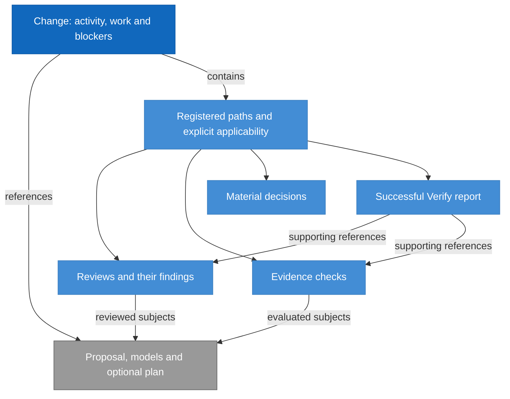

# RigorLoop Record Format Model Design

Model validation contract: explicit-recording-v1

## Introduction and Goals

Define the durable representation of RigorLoop decisions, findings, evidence and final explanations. A new actor can understand current records and retained concern origin without prior chat, Git history or review archives.

The model ID is `record-format`. Its selected prospective format is **RigorLoop Record Format v2** (`rigorloop-records-v2`). This document is the authoritative stored-format design, combining requirements, data structure, invariants and compatibility decisions. The document-validation marker above is independent of the stored version.

| Reader question | Definition |
| --- | --- |
| What is persisted? | [Record model](#record-model) and [exact record fields](#explicit-record-schema) |
| What survives later judgments? | [Concern origin and preservation](#retained-judgments-for-unresolved-findings) |
| How is old data handled? | [Compatibility and adoption](#compatibility-and-adoption) |
| Who owns adjacent behavior? | [Context and Scope](#context-and-scope) |
| What must be demonstrated? | [Boundary scenarios](#boundary-scan-and-acceptance-scenarios) |

## Context and Scope

| Concern | Owner | Relationship |
| --- | --- | --- |
| Actor responsibility, decision meaning, justified progression and independence | [Workflow](workflow.md) | Supplies the semantic obligations represented by records |
| Stored record types, fields, relationships, versions and retained origin | Record Format | Defines the admissible durable representation |
| Public commands, request/result schemas, selection and mechanical construction | [CLI](cli.md) | Constructs and exposes records conforming to this model |
| Exact byte encoding, lossless edits, identity computation, containment, conflicts and recovery | CLI | Persists complete candidates while enforcing this model's invariants |

In scope are change, review, evidence, material-decisions and success-only Verify records. Engineering model files, plans and implementation subjects remain referenced in place. No authentication system, new stage, readiness engine, historical migration, request ledger or review-history archive is introduced.

## Architecture Constraints

Preserve registered historical contracts exactly. Closed objects and vocabularies reject unknown members and values; missing decisions are not filled by defaults. Actor labels remain attribution. Current workflow contradictions and historical subject drift are distinct from malformed structure.

This model is a proposed contract, not an activated schema. The existing v1 schema is compatibility evidence only. Runtime, schemas, templates, skills and supported adapters must adopt the selected format coherently.

## Solution Strategy

Use one explicit version per change and its registered records. Separate current concern fields and disposition from immutable origin. Store narrative alongside structured metadata, and retain exact subjects and explicit record-level applicability. Structural validation admits incomplete or contradictory workflow claims without endorsing them.

The CLI constructs registry and serialization mechanically from explicit operations. This model owns what must survive those operations, independently of which supported write path performs them.

## Requirements

| ID | Required behavior |
| --- | --- |
| RF-SR-01 | Every stored change MUST identify its contract and every record its schema version. The exact closed record/type definitions below MUST govern all supported writers and readers; unknown fields, vocabularies, versions and mixed-version stores MUST reject structurally. |
| RF-SR-02 | The manifest MUST enumerate all supporting authoritative records with matching kind/change identity and exactly one explicit record-level applicability declaration each. Internal entry references MUST resolve in the complete candidate; extra physical files MUST NOT become authority through discovery. |
| RF-SR-03 | Records MUST preserve actor-supplied subjects, provenance, decisions and narrative without inferring approval, applicability or completion. Finding and blocker identity and disposition representation MUST retain the distinction between reporter and correction owner. |
| RF-SR-04 | Each v2 concern MUST retain its complete immutable Origin for its lifetime, including after disposition. Current judgments or concern fields MUST NOT rewrite that basis; supporting judgment MUST be explicitly absent or embedded with its relevant rationale and provenance. |
| RF-SR-05 | Structural validity MUST remain separate from workflow adequacy. A completed activity, failed evidence or changed external subject MUST NOT alone invalidate a correction candidate; malformed internal references still reject. |
| RF-SR-06 | Primary creation after coordinated activation MUST explicitly select v2; the advanced v1 compatibility creation path remains separately identified. Existing v1 records MUST retain their original discriminator and exact compatibility semantics. Reads MUST expose unavailable origin honestly; recording MUST NOT synthesize historical basis, mix versions or migrate a root implicitly. |
| RF-SR-07 | Selected records MUST retain sufficient structured and narrative content for normal targeted reads, including concern origin, shared material-decision explanation and the complete success-only Verify report. Partial query projections MUST NOT alter the stored record. |
| RF-SR-08 | Construction, advanced replacement and recovery MUST share these structural and preservation obligations. Adoption MUST align schemas, validators, CLI, templates, skills and adapters before claiming v2 support; document validation MUST NOT imply activation. |

These requirements realize Workflow's actor-owned recording and retained-basis obligations (WF-SR-02/03/05/06/10/12/13/15). CLI-SR-02/03/09/18/21 consume them for construction, inspection and safe publication. Workflow retains decision ownership; RF-SR identifiers own representation and preservation.

## Building Block View

### Record model

**RigorLoop Record Format v2** is the selected prospective stored-record design. Its complete record layouts are defined below, with `contract: rigorloop-records-v2` in change.yaml and `schema_version: 2` in every record. This is a data-format contract: it defines stored fields, relationships and preservation invariants. It does not select a workflow stage or version the CLI command interface.

| Versioned surface | Identifier | Meaning |
| --- | --- | --- |
| Selected stored-record design | `rigorloop-records-v2`, stored schema_version 2 | Complete current design, including immutable concern origin |
| Retained compatibility format | `explicit-recording-v1`, stored schema_version 1 | Existing schema, without the v2 origin guarantee |
| Model-document validation | `Model validation contract: explicit-recording-v1` | Document structure checked by the model validator; not the selected stored-record version |
| Primary CLI transport | `targeted-recording-v1`, request schema_version 1, result schema_version 2 | Transient requests and receipts, defined by the CLI model |

Version numbers belong to their own surface. A targeted request with schema_version 1 can explicitly select rigorloop-records-v2; its request version does not change the stored version. The document-validation marker remains unchanged for validator compatibility. Its reuse of the older identifier does not make this document's selected record format v1. The successor remains a design until coordinated implementation and adoption.

The change record is the registry and coordination entry point. It contains activity, work and change-level blockers; it references the proposal, affected models and optional plan. Its registry identifies supporting records, each with an explicitly declared applicability entry. Review findings belong to their containing review. Reviews and evidence name exact engineering subjects; those subject identities do not become automatically current when files change.

This conceptual view illustrates RF-SR-01/02/03; it is not a second schema. Subjects may also include implementation and other proof inputs admitted by the exact Subject type. Supporting records are conditional, and their arrows do not imply that every record must exist before a correction can be saved.

| Stored record | Semantic responsibility | Compatibility definition in the [existing v1 JSON Schema](../../schemas/explicit-recording-v1.schema.json) |
| --- | --- | --- |
| Change | Recorded coordination, work, blockers, registry and applicability | `$defs.change` |
| Review | Independent judgment, exact subjects and review-scoped findings | `$defs.review` |
| Evidence | Supplied procedures, results and evaluated subjects | `$defs.evidence` |
| Material decisions | Rationale and source references that constrain work | `$defs.decisions` |
| Verify report | Successful final assessment and supporting references | `$defs.verify` |

This model owns stored field shapes, relationships and preservation invariants. The [Workflow model](workflow.md#requirements) owns the engineering meaning of decisions and the obligations for relying on them. The JSON Schema expresses structural shapes; the [CLI model](cli.md#advanced-candidate-update-contract) owns byte encoding, containment, identity computation and persistence. The schema file also contains advanced request/result definitions, which are transport contracts rather than additional stored record kinds. Markdown bodies provide actor-authored reasoning alongside structured metadata; metadata retains the declared status and identity meaning. Structural validity does not establish workflow readiness.

### Explicit record schema

RF-SR-01/02/03/04 own this stored-record definition. The table defines v2 directly; the compatibility subsection below defines the retained v1 differences. It is not a CLI request schema. Every object is closed: only listed fields are admitted, all fields are required unless marked optional, and duplicate keys or IDs are invalid. Empty arrays represent no entries; there are no inferred defaults. IDs use lowercase letters, digits and hyphens, start with a letter or digit, and contain 1–80 characters. Change IDs follow the same grammar. Paths are repository-relative and subject to CLI containment rules. A digest is `sha256:` followed by 64 lowercase hexadecimal digits.

Common types are `Subject = {path, identity}` and `Actor = {id, role}`. `identity` is a digest of exact file bytes; `role` is one of `human`, `proposal`, `design`, `plan`, `review`, `route`, `implement`, `verify`, `support`. A reference to a record entry is `EntryRef = {path, id}`; it identifies the entry, not a claim about freshness. Narrative fields are nonempty strings. IDs are unique within their containing array. Referenced subject files may have changed or disappeared; those are observations, unlike a dangling reference to an entry inside the candidate record set.

| Record | Exact structured fields |
| --- | --- |
| `change.yaml` | `schema_version: 2`, `contract: rigorloop-records-v2`, `change_id`, `proposal: Subject`, `models: [{id, subject: Subject}]`, `activity: {stage, status, owner: Actor, reason}`, `plan: Subject or null`, `work: [{id, status, owner: Actor, requirement_refs: [string]}]`, `records: [{path, kind}]`, `applicability: [{path, value, actor: Actor, reason}]`, `blockers: [Concern]` |
| `reviews/<review-id>.md` metadata | `schema_version: 2`, `change_id`, `id`, `target`, `reviewer: Actor`, `contributors: [Actor]`, `independence_basis`, `subjects: [Subject]`, `judgment`, `findings: [Concern]` |
| `evidence.yaml` | `schema_version: 2`, `change_id`, `checks: [{id, actor: Actor, subjects: [Subject], result, procedure, summary}]` |
| `material-decisions.md` metadata | `schema_version: 2`, `change_id`, `decisions: [{id, actor: Actor, subjects: [Subject], rationale, source_refs: [EntryRef]}]` |
| `verify-report.md` metadata | `schema_version: 2`, `change_id`, `verifier: Actor`, `subjects: [Subject]`, `evidence_refs: [EntryRef]`, `review_refs: [EntryRef]`, `outcome: success` |

`Concern` has exactly `{id, reporter: Actor, owner: Actor, subjects: [Subject], evidence, required_outcome, state, resolution, origin: Origin}`. Origin and its immutable preservation rules are defined below. `reporter` identifies the actor responsible for disposition assessment and `owner` identifies who must perform correction; these are deliberately distinct. `state` is `open`, `resolved` or `deferred`; `resolution` is null for open work or `{actor: Actor, rationale, evidence_refs: [EntryRef]}` otherwise. The CLI checks this representation, not whether the resolution is justified. An empty evidence-reference array is valid for a reasoned disposition but does not prove the disposition adequate. Review-record blockers are findings; change-record blockers allow any stage to record a defect without inventing a review.

`stage` is `proposal`, `proposal-review`, `design`, `design-review`, `plan`, `delivery-review`, `implement`, `code-review`, `verify` or `support`. `status` is `pending`, `in-progress`, `blocked`, `ready`, `completed` or `cancelled`. These are labels, not a transition graph: any well-formed old/new label pair is recordable. `target` is `proposal`, `design`, `delivery` or `code`; `judgment` is `approved`, `changes-requested`, `blocked` or `inconclusive`. Evidence `result` is `passed`, `failed` or `inconclusive`. Applicability `value` is `current`, `stale` or `not-applicable`. Record `kind` is `review`, `evidence`, `decisions` or `verify`.

The `records` array declares every supporting authoritative record for this change; `change.yaml` is implicit. Each declared record must exist in the candidate set and have the matching kind and change identity. Each supporting record has exactly one explicit applicability entry in `change.yaml`. Extra physical files are not discovered as authority. A new supporting record and its registry/applicability entries are published together. The targeted command constructs registry bookkeeping, but the requesting actor explicitly supplies applicability value, actor and reason. Applicability remains at supporting-record level; individual checks or findings do not acquire a separate applicability field. These are referential checks, not review prerequisites.

The CLI model owns bytes and encoding. Markdown record bodies carry nonempty human-readable reasoning, while their structured metadata owns IDs and enumerated judgments. Body text cannot override metadata. Subject and evidence arrays may be empty while recording incomplete work; Workflow actors must not use incomplete records to justify approval or completion. A Verify report's metadata admits only success, but the CLI does not establish that its assertion is true.

### Retained judgments for unresolved findings

The finding itself retains enough origin basis for the next actor to understand the concern. It does not depend on a chain of prior review rounds, an assessment archive, Git history or chat. This replaces the earlier proposed named-assessment collection and current-assessment pointer; neither becomes part of the selected stored representation. A current review judgment can change while its unresolved findings keep the original basis that made them actionable.

#### Selected record-format revision

The v2 record table above and the types below form one stored-format definition. Every review finding and change-level blocker carries its own origin; no review assessment array or current pointer is added. The existing v1 schema and implementation remain unchanged by this design document.

| Type | Exact shape |
| --- | --- |
| Concern | `{id, reporter: Actor, owner: Actor, subjects: [Subject], evidence, required_outcome, state, resolution, origin: Origin}` |
| Origin | `{reporter: Actor, subjects: [Subject], evidence, required_outcome, rationale, supporting_judgment: JudgmentBasis or null}` |
| JudgmentBasis | `{reviewer: Actor, contributors: [Actor], independence_basis, subjects: [Subject], judgment, rationale}` |

Objects are closed, listed fields are required, and the existing Actor, Subject, text and judgment types apply. The origin rationale is a concise, actor-supplied explanation of why the observed evidence matters for the required outcome. Supporting judgment is an optional fact represented by explicit null when none is cited; a concern does not need a fabricated overall review judgment to be recorded. When supplied, that judgment's complete relevant rationale and provenance are embedded, not represented solely by a mutable link or hash. The finding's original observed evidence and required outcome are retained even if its current fields later evolve.

At creation the CLI copies reporter, subjects, evidence and required_outcome from the actor's concern values into origin. The actor supplies the rationale and explicitly chooses whether a supporting judgment is absent, supplied directly, or constructed from the provenance/outcome of an exact selected review plus actor-supplied finding-specific rationale. Copying the selected content is mechanical preservation; selecting its significance is the actor's decision. No actor is required to retype another review or assemble serialized metadata to retain it. The [CLI contract](cli.md#finding-origin-construction) defines those input forms.

#### Preservation and reliance

Origin is immutable for the lifetime of a concern ID in v2, including after an explicit disposition. New reviews preserve the complete origin along with the finding. They may update their current judgment and narrative without carrying every prior review round. A correction to the concern's current subjects, evidence or required outcome leaves origin intact. A mistaken original report is addressed through current explanation and explicit disposition, not by falsifying its history; a distinct concern receives a distinct ID.

Supporting judgment can be null while the origin remains useful: the reporter, exact subjects, evidence, rationale and required outcome explain the original defect. If a formal reviewer cites an actual supporting assessment, it preserves that assessment's relevant content within the origin. No automatic inference supplies a judgment, independence basis, applicability value or disposition. Later judgment does not become new origin simply because hashes match or a review is approved.

The current state and resolution fields say what the responsible actor now concluded. A resolved/deferred disposition retains the actor, rationale and explicit evidence references under the existing resolution type. That outcome does not overwrite origin or automatically close another actor's concern. Origin preservation applies to targeted and advanced writers and exact-byte recovery; attempts to mutate/remove it under an existing ID are structural preservation errors. This invariant applies regardless of open/resolved state, so it does not create a readiness prerequisite for correction recording.

A normal finding read returns current fields and origin together. This is sufficient to understand the reported concern and its origin without replaying review history, but it does not replace reading the current engineering subjects needed to assess a fix. The existing size limits apply to embedded basis; a limit error does not permit silently truncating rationale or dropping provenance. Actors provide the relevant finding-specific basis, not a dump of all earlier records.

#### Example: a later approval does not erase a concern

| Moment | Current review | Finding f1 | Origin available in f1 |
| --- | --- | --- | --- |
| Original report | changes-requested | Open, with actionable evidence and required outcome | Original reporter, subject identities, evidence, rationale and explicitly cited judgment |
| Later review | approved | Still open until its responsible reviewer decides otherwise | The same origin, without reading the old review body |
| Explicit reassessment | approved | Resolved with the reviewer's current rationale and evidence references | The original basis remains alongside the current disposition |

The middle row is recordable but does not establish justified progression. This example illustrates RF-SR-03/04/05; a saved later approval never disposes the finding automatically.

#### Compatibility and adoption

The retained v1 format has exactly the same record layouts, common types, closed vocabularies and reference rules except for these differences:

| Stored component | V1 compatibility | V2 selected design |
| --- | --- | --- |
| change.yaml discriminator | `contract: explicit-recording-v1` | `contract: rigorloop-records-v2` |
| Every record's schema_version | `1` | `2` |
| Review findings and change blockers | `Blocker = {id, reporter, owner, subjects, evidence, required_outcome, state, resolution}` | `Concern`, including required immutable origin |
| Original concern basis | No separate retained origin field | Required Origin; supporting_judgment explicitly null or complete JudgmentBasis |

The [existing v1 schema](../../schemas/explicit-recording-v1.schema.json) is the machine-readable compatibility definition, not an implementation of v2. Delivery must supply the corresponding v2 schema and validator dispatch; renaming the existing schema would not implement the new invariant.

After coordinated v2 activation, primary change.create MUST explicitly select rigorloop-records-v2. A primary creation request selecting explicit-recording-v1 rejects as invalid-input without writes. Existing v1 roots remain supported for explicit compatible reads and updates. The advanced v1 recorder retains its existing explicitly selected creation behavior as a compatibility path; it is not the normal new-change interface and ordinary skills must not use it to bypass primary creation policy. No command guesses or silently substitutes the version. V2 records all carry schema_version 2, and mixed record versions inside one change reject structurally. An existing v1 root stays v1 and is never upgraded by recording a finding. V1 concern reads identify that retained origin is unavailable rather than synthesizing it from a current review. No v2 retention guarantee is claimed for v1 data. V1 fields and operations remain available under their unchanged compatibility rules.

Adoption requires versioned schema/validator dispatch, CLI origin construction and immutable-origin checks, context/show mappings, generated templates and consuming skills to agree. Migration is outside this amendment; missing historical basis must not be guessed. This model owns exact stored representation; CLI owns its integration with targeted construction and persistence; Delivery allocates implementation and proof. The previously recorded Design Review does not approve this revised interaction or stored format.

## Runtime View

### Construct and inspect a record

An actor selects exact targets and decision basis through the CLI. The CLI reads a coherent snapshot, dispatches its stored format, constructs only requested edits and validates the complete candidate against RF-SR-01/02/03/04. A newly registered supporting record requires its explicitly supplied applicability in the same candidate. No intermediate missing reference is published.

A normal read returns selected current fields and retained narrative/origin. The CLI exposes the manifest discriminator as record_contract alongside the coherent snapshot revision in every successful primary change-scoped read (CLI-SR-22), even when no selected entries are returned. This is a projection of the stored contract, not an additional stored field or inferred format choice. Summary projections declare omissions under the CLI contract; they do not remove data from storage. A full Verify read returns the final assessment and explanation, while a full decisions read includes the shared narrative (RF-SR-07).

### Reassess a concern

A later review may explicitly replace its current judgment while preserving existing findings and their origin. A finding's current evidence or required outcome can change without rewriting the original basis. Explicit resolved/deferred disposition adds its current rationale and evidence references; neither later approval nor a matching subject hash closes it automatically (RF-SR-03/04/05).

### Conflict, retry and recovery

The CLI checks expected revision and declared subject identities before accepting a candidate. Stale requests conflict rather than merge. Recovery restores the exact verified before-state or completes the prepared candidate through the CLI's recovery contract; it does not invent a new origin, reapply old decisions to newer records or convert formats. Restoring a prepared before-state is transaction rollback, not a semantic edit to origin (RF-SR-04/06/08).

## Deployment View

This model creates no daemon, database or additional authoritative sidecar. Stored files remain repository-local at the paths defined above and contained by the CLI contract.

Delivery must add v2 machine-readable stored definitions and explicit version dispatch, then integrate preservation validation, command mappings, templates and consuming guidance. Existing v1 schema/request/result definitions must not be renamed into v2. Installation and release infrastructure remain separately owned. Activation requires coordinated adoption; this document does not change executable new-root defaults.

## Crosscutting Concepts

### Serialization, identity and narrative

The [CLI encoding and candidate contract](cli.md#lossless-candidate-construction-and-shared-engine) owns the admitted JSON-subset YAML and Markdown front matter, exact-byte identities, lossless edits and limits. Record Format owns the resulting object structure and preservation requirements. A formatting-only rewrite is still subject to the CLI's byte-preservation rules. Narrative cannot override structured identity or enumerated values.

File identity, stored format version and current workflow applicability are distinct. Changing one does not implicitly decide another. External historical subjects may drift; internal record references must resolve within the candidate.

### Boundary scan and acceptance scenarios

| Dimension | Requirement basis | Distinct outcome to demonstrate |
| --- | --- | --- |
| Input domain | RF-SR-01, RF-SR-02 | Unknown members/enums, duplicate IDs and malformed types reject; every declared record has matching kind, identity and explicit applicability. |
| State/lifecycle | RF-SR-03, RF-SR-04, RF-SR-05 | Completed work can receive a new blocker; resolving a concern preserves origin and cannot implicitly close another concern. |
| Identity/authority | RF-SR-03, RF-SR-04 | Changed review subjects never rewrite historical origin; actor labels do not establish reviewer independence. |
| Composition/path | RF-SR-02, RF-SR-07, RF-SR-08 | Targeted and advanced candidates enforce identical invariants; full selected Verify/decisions reads retain narratives without unrelated record bodies. |
| Temporal/retry | RF-SR-04, RF-SR-08 | A later review preserves an existing concern's basis; stale retries conflict through the CLI without duplicated effects. |
| Failure/recovery | RF-SR-02, RF-SR-04, RF-SR-08 | Interrupted publication restores exact before-state or completes the prepared candidate; neither outcome leaves mixed versions or partially registered authority. |
| Compatibility/migration | RF-SR-01, RF-SR-06 | Primary v2 creation succeeds only after activation; primary v1 creation rejects without writes. Explicit advanced v1 compatibility creation retains its existing contract. Existing v1 reports unavailable origin; unknown contracts and mixed versions reject. |
| External/environment | RF-SR-05, RF-SR-07, RF-SR-08 | Missing external subject is distinguishable from dangling internal reference; another actor reads the retained basis without Git, network or prior chat. |

Material combined hazards include a new concern after completed work (RF-SR-04/05), a newly registered record with missing applicability (RF-SR-02/03), and an interrupted multi-record update (RF-SR-01/08). Delivery allocates proof jointly with the CLI's conflict and publication scenarios. These are acceptance obligations, not reported runtime test results.

## Architecture Decisions

| ID | Decision | Rationale and trade-off |
| --- | --- | --- |
| RF-DEC-01 | Give stored representation its own model. | Workflow meaning and CLI mechanics consume one field contract; neither maintains a second normative layout. |
| RF-DEC-02 | Use rigorloop-records-v2 with schema_version 2 for the selected prospective format. | Required concern origin changes persisted structure, so a document rename or silent extension of closed v1 records is insufficient. |
| RF-DEC-03 | Embed immutable origin in each concern. | Preserves actionable basis without an assessment archive; consumes record space and requires explicit finding-specific rationale. |
| RF-DEC-04 | Preserve v1 without inferred origin or implicit migration. | Historical truth takes precedence over uniform appearance; readers must expose the missing retention guarantee. |

## Quality Requirements

| Quality | Acceptance condition | Requirement coverage |
| --- | --- | --- |
| Resumability | A selected concern explains its origin without review-round replay or chat. | RF-SR-04, RF-SR-07 |
| Correctability | Workflow contradictions do not prevent structurally valid correction records. | RF-SR-05 |
| Integrity | All write paths preserve origin, registry coherence and exact contract identity. | RF-SR-01, RF-SR-02, RF-SR-08 |
| Compatibility | Historical v1 content remains truthful and distinguishable. | RF-SR-06 |
| Usability | Final explanations remain complete normal deliverables. | RF-SR-07 |

## Risks and Technical Debt

Embedded rationale can reach the existing per-record size limit; the CLI must reject excess explicitly without truncation. Preservation cannot establish that an original assessment was correct. V2 schema, runtime dispatch and adoption proof remain outstanding. Model-document validation still uses the older explicit-recording-v1 marker; consumers must not confuse it with stored-format dispatch.

## Glossary

Stored format: versioned durable data contract. Concern: review finding or change-level blocker with current fields and retained origin. Origin: immutable original basis for a concern. Applicability: actor-declared usability of an entire supporting record. Subject identity: digest of the exact assessed file bytes. Transport: transient CLI request or response, independently versioned.

## Drafting basis and authority

This model is extracted and refined under the user's explicit request to make RigorLoop Record Format a model. The design package now contains [Workflow](workflow.md), [CLI](cli.md) and this file (`record-format`). The [targeted-recording proposal](../proposals/2026-09-07-targeted-recording-primary-cli.md) supplies the direction. Existing review outcomes do not approve this new three-model package. This draft changes no stored records, runtime schemas, lifecycle settlement or release activation.

## Next artifacts

Independent Design Review assesses the exact three-model package and shared boundaries. Delivery planning allocates schema, integration, compatibility and preservation proof after Design approval.

## Follow-on artifacts

None yet.
