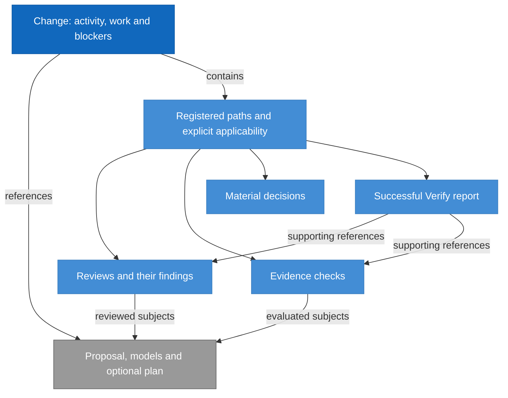

# RigorLoop Record Format Model Design

Model validation contract: model-document-v1

The current stored contract is `rigorloop-records-v3`. [Retirement provenance](#v2-stored-format-retirement) records the support boundary and owning change; historical decisions do not supply an alternate operational profile.

## Introduction and Goals

Define the durable representation of RigorLoop decisions, findings, evidence and final explanations. A new actor can understand current records and retained concern origin without prior chat, Git history or review archives.

The model ID is `record-format`. Its selected format is **RigorLoop Record Format v3** (`rigorloop-records-v3`). This document is the authoritative stored-format design, combining requirements, data structure, invariants and compatibility decisions. The document-validation marker above is independent of the stored version.

| Reader question | Definition |
| --- | --- |
| What is persisted? | [Record model](#record-model) and [exact record fields](#explicit-record-schema) |
| What survives later judgments? | [Concern origin and preservation](#retained-judgments-for-unresolved-findings) |
| How is old data handled? | [Compatibility and adoption](#compatibility-and-adoption) |
| Who owns adjacent behavior? | [Context and Scope](#context-and-scope) |
| What must be demonstrated? | [Boundary scenarios](#boundary-scan-and-acceptance-scenarios) |

## Context and Scope

| Concern | Owner | Relationship |
| --- | --- | --- |
| Actor responsibility, decision meaning, justified progression and independence | [Workflow](../workflow/workflow.md) | Supplies the semantic obligations represented by records |
| Stored record types, fields, relationships, versions and retained origin | Record Format | Defines the admissible durable representation |
| Public commands, request/result schemas, selection and mechanical construction | [CLI](../cli/cli.md) | Constructs and exposes records conforming to this model |
| Exact byte encoding, lossless edits, identity computation, containment, conflicts and recovery | CLI | Persists complete candidates while enforcing this model's invariants |

In scope are change, review, evidence, material-decisions and success-only Verify records. Engineering model files, plans and implementation subjects remain referenced in place. No authentication system, new stage, readiness engine, historical migration, request ledger or review-history archive is introduced.

## Architecture Constraints

Preserve historical record bytes and recorded identities as archival evidence. Closed objects and vocabularies reject unknown members and values; missing decisions are not filled by defaults. Actor labels remain attribution. Current workflow contradictions and external subject drift are distinct from malformed structure.

V3 is the sole operational stored format. Historical v2 records remain archival evidence; their former continuation contract is not a current reader, writer or recovery interface.

## Solution Strategy

Use one explicit version per change and its registered records. Review findings retain immutable IDs and explicitly editable current fields; change-level blockers additionally retain immutable origin. Store narrative in explicit fields within the same JSON object, and retain exact subjects and explicit record-level applicability. Structural validation admits incomplete or contradictory workflow claims without endorsing them.

The CLI constructs registry and serialization mechanically from explicit operations. This model owns what must survive those operations, independently of which supported write path performs them.

## Requirements

| ID | Required behavior |
| --- | --- |
| RF-SR-01 | Every stored change MUST identify its contract and every record its schema version. V3 records MUST be plain JSON objects at the listed .json paths, with narrative inside explicit string fields and no front matter or trailing Markdown. The exact closed record/type definitions below MUST govern all supported writers and readers; unknown fields, vocabularies, versions and mixed-version stores MUST reject structurally. |
| RF-SR-02 | The manifest MUST enumerate all supporting authoritative records with matching kind/change identity and exactly one explicit record-level applicability declaration each. Every EntryRef MUST select exactly one admissible object using the field-specific resolution table and disjoint per-file referenceable IDs; missing, unsupported or ambiguous targets MUST reject in the complete candidate; extra physical files MUST NOT become authority through discovery. |
| RF-SR-03 | Records MUST preserve actor-supplied subjects, provenance, decisions and narrative without inferring approval, applicability or completion. Finding and blocker identity and disposition representation MUST retain the distinction between reporter and correction owner. |
| RF-SR-04 | Each change-level blocker MUST retain its complete immutable Origin for its lifetime, including after disposition. Current judgments or concern fields MUST NOT rewrite that basis; supporting judgment MUST be explicitly absent or embedded with its relevant rationale and provenance. |
| RF-SR-05 | Structural validity MUST remain separate from workflow adequacy. A completed activity, failed evidence or changed external subject MUST NOT alone invalidate a correction candidate; malformed internal references still reject. |
| RF-SR-06 | The sole supported runtime stored contract MUST be rigorloop-records-v3. The retired set below MUST NOT remain available for creation, inspection, validation, mutation, progression or recovery through a compatibility handler. Historical record bytes and identities MUST remain archival evidence without conversion, inferred origin or renewed authority. CLI owns explicit rejection and current discovery mechanics. |
| RF-SR-07 | Selected records MUST retain sufficient structured and narrative content for normal targeted reads, including blocker origin, shared material-decision explanation and the complete success-only Verify report. Partial query projections MUST NOT alter the stored record. |
| RF-SR-08 | Construction, advanced replacement and v3 recovery MUST share these structural and preservation obligations. Retirement MUST align schemas, validators, CLI, templates, skills and adapters while preserving v3 invariants. Document validation MUST NOT imply activation or require legacy stored-format support. |
| RF-SR-09 | New stores MUST use rigorloop-records-v3 with schema_version 3 throughout the change and registered records. Review and Verify MUST use the closed explanation fields defined below, preserving other assessment facts and applying the v3 finding identity rules below. Missing required values, unknown fields, body, dual representations and mixed-version stores MUST reject. |
| RF-SR-10 | V3 explanation values MUST retain actor-supplied meaning, collection order and multiline content. Whole-field explanation updates MUST preserve omitted values and complete findings; neither rendering nor a projection may become another authoritative report. |
| RF-SR-11 | V3 Verify MAY contain the closed conditional verification_basis object below. Its necessity for reliance is owned by Review and Closeout RC-SR-20; absence is structurally valid, null or partial objects are not. It MUST NOT become a universal Git requirement or be inferred from prose. |
| RF-SR-12 | Historical stores MUST remain unchanged without automatic conversion or operational continuation. Required local work and recovery dependencies MUST be explicitly dispositioned before support removal; RF-SR-14 owns the resulting v3-only boundary. |
| RF-SR-13 | V3 Review findings MUST use the closed current-account shape and ID-only immutability defined below. Explicit corrections may edit all non-ID fields; removal/renaming, origin snapshots and implicit edits through review recording MUST reject. Change-level blocker origins remain immutable; historical v2 records remain unchanged. |
| RF-SR-14 | After Workflow's explicit retirement disposition and coordinated adoption, operational storage MUST accept only rigorloop-records-v3. V2 records MUST retain their historical bytes and meaning without a reader, writer, validator, recovery path or automatic conversion. Shared definitions and independently versioned interfaces MUST remain available to supported consumers. |

These requirements realize Workflow's actor-owned recording and retained-basis obligations (WF-SR-02/03/05/06/10/12/13/15). CLI-SR-02/03/09/18/21 consume them for construction, inspection and safe publication. Workflow retains decision ownership; RF-SR identifiers own representation and preservation.

## Building Block View

### Record model

**RigorLoop Record Format v3** is the selected stored-record design. Its complete record layouts are defined below, with `contract: rigorloop-records-v3` in change.json and `schema_version: 3` in every record. This is a data-format contract: it defines stored fields, relationships and preservation invariants. It does not select a workflow stage or version the CLI command interface.

| Versioned surface | Identifier | Meaning |
| --- | --- | --- |
| Selected stored-record design | `rigorloop-records-v3`, stored schema_version 3 | Complete current design, with ID-only Review findings and immutable blocker origin |
| Retired stored formats | Exact set in Compatibility and adoption | Archival evidence only; no runtime reader or writer |
| Model-document validation | `Model validation contract: model-document-v1` | Document structure checked by the model validator; not the selected stored-record version |
| Primary CLI transport | `targeted-recording-v1`, request schema_version 1, result schema_version 2 or 3 | Transient requests and receipts, defined by the CLI model |

Version numbers belong to their own surface. A targeted request with schema_version 1 explicitly selects rigorloop-records-v3; its request version does not change the stored version. The document-validation marker `model-document-v1` versions Markdown structure separately. Its version 1 does not make the selected stored-record format v1. Retirement changes supported stored inputs, not these independent version domains.

The change record is the registry and coordination entry point. It contains activity, work and change-level blockers; it references the proposal, affected models and optional plan. Its registry identifies supporting records, each with an explicitly declared applicability entry. Review findings belong to their containing review. Reviews and evidence name exact engineering subjects; those subject identities do not become automatically current when files change.

This conceptual view illustrates RF-SR-01/02/03; it is not a second schema. Subjects may also include implementation and other proof inputs admitted by the exact Subject type. Supporting records are conditional, and their arrows do not imply that every record must exist before a correction can be saved.

| Stored record | Semantic responsibility | Definition in the [v3 JSON Schema](../../../schemas/rigorloop-records-v3.schema.json) |
| --- | --- | --- |
| Change | Recorded coordination, work, blockers, registry and applicability | `$defs.change` |
| Review | Independent judgment, exact subjects and review-scoped findings | `$defs.review` |
| Evidence | Supplied procedures, results and evaluated subjects | `$defs.evidence` |
| Material decisions | Rationale and source references that constrain work | `$defs.decisions` |
| Verify report | Successful final assessment and supporting references | `$defs.verify` |

This model owns stored field shapes, relationships and preservation invariants. The [Workflow model](../workflow/workflow.md#requirements) owns the engineering meaning of decisions and the obligations for relying on them. The JSON Schema expresses structural shapes; the [CLI model](../cli/cli.md#advanced-candidate-update-contract) owns byte encoding, containment, identity computation and persistence. Advanced request/result definitions are separately owned transport contracts, not additional stored record kinds; shared validation must be separated from retired stored definitions before their removal. V3 stores one JSON object per file. Narrative is a string field in that object, not a separate Markdown document or front-matter section. Structural validity does not establish workflow readiness.

### Explicit record schema

RF-SR-01/02/03/04 own this stored-record definition. The table defines v3 directly; the compatibility subsection below defines the retirement boundary. It is not a CLI request schema. Every object is closed: only listed fields are admitted, all fields are required unless marked optional, and duplicate keys or IDs are invalid. Empty arrays represent no entries; there are no inferred defaults. IDs use lowercase letters, digits and hyphens, start with a letter or digit, and contain 1–80 characters. Change IDs follow the same grammar. Paths are repository-relative and subject to CLI containment rules. A digest is `sha256:` followed by 64 lowercase hexadecimal digits.

Common types are `Subject = {path, identity}` and `Actor = {id, role}`. `identity` is a digest of exact file bytes; `role` is one of `human`, `proposal`, `design`, `plan`, `review`, `route`, `implement`, `verify`, `support`. A reference to a record entry is `EntryRef = {path, id}`; it identifies the entry, not a claim about freshness. Narrative fields are nonempty strings. IDs are unique within their containing array. Referenced subject files may have changed or disappeared; those are observations, unlike a dangling reference to an entry inside the candidate record set.

| Record | Exact structured fields |
| --- | --- |
| `change.json` | `schema_version: 3`, `contract: rigorloop-records-v3`, `change_id`, `proposal: Subject`, `models: [{id, subject: Subject}]`, `activity: {stage, status, owner: Actor, reason}`, `plan: Subject or null`, `work: [{id, status, owner: Actor, requirement_refs: [string]}]`, `records: [{path, kind}]`, `applicability: [{path, value, actor: Actor, reason}]`, `blockers: [Concern]` |
| `reviews/<review-id>.json` | `schema_version: 3`, `change_id`, `id`, `target`, `reviewer: Actor`, `contributors: [Actor]`, `independence_basis`, `subjects: [Subject]`, `judgment`, `findings: [Finding]`, `summary: string`, `assessment_scope: string`, `rationale: [string]`, `limitations: [string]` |
| `evidence.json` | `schema_version: 3`, `change_id`, `checks: [{id, actor: Actor, subjects: [Subject], result, procedure, summary}]` |
| `material-decisions.json` | `schema_version: 3`, `change_id`, `decisions: [{id, actor: Actor, subjects: [Subject], rationale, source_refs: [EntryRef]}]`, `body: string` |
| `verify-report.json` | `schema_version: 3`, `change_id`, `verifier: Actor`, `subjects: [Subject]`, `evidence_refs: [EntryRef]`, `review_refs: [EntryRef]`, `outcome: success`, `summary: string`, `assessment_scope: string`, `rationale: [string]`, `limitations: [string]`, `changes: [string]`, optional `verification_basis: VerificationBasis` |

`Finding` has exactly `{id, reporter: Actor, owner: Actor, subjects: [Subject], evidence, required_outcome, state, resolution}`. Only its ID is immutable; the correction rules below preserve existing IDs. A change-level blocker uses `Concern`, which has exactly `{id, reporter: Actor, owner: Actor, subjects: [Subject], evidence, required_outcome, state, resolution, origin: Origin}`. Origin and its immutable preservation rules are defined below. `reporter` identifies the actor responsible for disposition assessment and `owner` identifies who must perform correction; these are deliberately distinct. `state` is `open`, `resolved` or `deferred`; `resolution` is null for open work or `{actor: Actor, rationale, evidence_refs: [EntryRef]}` otherwise. The CLI checks this representation, not whether the resolution is justified. An empty evidence-reference array is valid for a reasoned disposition but does not prove the disposition adequate. Review-record blockers are findings; change-record blockers allow any stage to record a defect without inventing a review.

`stage` is `proposal`, `proposal-review`, `design`, `design-review`, `plan`, `delivery-review`, `implement`, `code-review`, `verify` or `support`. `status` is `pending`, `in-progress`, `blocked`, `ready`, `completed` or `cancelled`. These are labels, not a transition graph: any well-formed old/new label pair is recordable. `target` is `proposal`, `design`, `delivery` or `code`; `judgment` is `approved`, `changes-requested`, `blocked` or `inconclusive`. Evidence `result` is `passed`, `failed` or `inconclusive`. Applicability `value` is `current`, `stale` or `not-applicable`. Record `kind` is `review`, `evidence`, `decisions` or `verify`.

The `records` array declares every supporting authoritative record for this change; `change.json` is implicit. Each declared record must exist in the candidate set and have the matching kind and change identity. Each supporting record has exactly one explicit applicability entry in `change.json`. Extra physical files are not discovered as authority. A new supporting record and its registry/applicability entries are published together. The targeted command constructs registry bookkeeping, but the requesting actor explicitly supplies applicability value, actor and reason. Applicability remains at supporting-record level; individual checks or findings do not acquire a separate applicability field. These are referential checks, not review prerequisites.

The CLI model owns bytes and encoding. Review and Verify require the named explanation fields in [Structured assessment explanations](#structured-assessment-explanations); neither admits body. Material decisions retains its nonempty shared body string. Structured facts remain authoritative; explanations must not maintain competing status, finding lists or reviewer rosters. This is authoring policy, not CLI prose inference. Subject and evidence arrays may be empty while recording incomplete work; actors must not rely on incomplete records for approval or completion. Verify admits only outcome success, without the CLI establishing that the assertion is true.

### Entry reference resolution

RF-SR-02 owns EntryRef interpretation. The representation remains exactly `{path, id}`; no kind field, inferred namespace or search across files is introduced. Path selects the exact authoritative file in the same change's complete candidate: the implicit change.json or a registered supporting file. ID then selects the exact case-sensitive ID of an admissible object in that file, as defined by the referencing field below.

| Referencing field | Admissible target file and object |
| --- | --- |
| Finding or blocker resolution.evidence_refs[] | evidence.json, a checks[] entry |
| verify-report.json evidence_refs[] | evidence.json, a checks[] entry |
| verify-report.json review_refs[] | A registered reviews/<review-id>.json, its root review object selected by the root id; never a finding |
| material-decisions.json decisions[].source_refs[] | change.json models[], work[] or blockers[]; a registered review's root object or findings[]; evidence.json checks[]; or material-decisions.json decisions[] |

All IDs of referenceable objects within a stored file MUST be disjoint, including a review's root id versus finding IDs and the manifest's model, work and blocker IDs. Array-local uniqueness still applies. The same ID may occur in different files because path is part of identity. Actor IDs, change_id, applicability entries, activity, Origin and JudgmentBasis are not referenceable objects. A Verify report has no entry id and is not an EntryRef target. Its full content remains available through normal targeted reads. Subject references identify engineering files separately; they are not EntryRef targets.

| Resolution case | Structural result |
| --- | --- |
| Exact path, permitted collection and exactly one matching ID | Resolve that object; do not infer approval, applicability, freshness or adequacy |
| Missing file or ID, unregistered path, wrong target kind/collection, cross-change path or unsupported object | Reject the combined candidate as broken-reference; unsafe paths retain unsafe-path rejection |
| Duplicate referenceable IDs within a file, including collisions across collections or with the review root | Reject as invalid-input even if no current reference uses the collision; never pick the first match |
| Malformed reference object or duplicate identical pair within one reference array | Reject as invalid-input |

Resolution validates the final combined candidate, so a reference and its target may be introduced in the same transaction. Empty reference arrays remain valid representation. References record links rather than recursive evaluation: self-links and cycles among decision source_refs are structurally recordable, but do not independently establish evidence or justified reliance. The CLI does not follow them to manufacture a judgment.

For example, review_refs pointing at review file design-review.json with id finding-1 rejects even if that finding exists; the field permits only the review root. A decision's source_refs may select that same finding. A review root and finding both named design-review reject rather than making either field ambiguous. A new check and a disposition referencing that check resolve together after complete candidate construction.

These target namespaces define the current contract. Historical records are not interpreted or validated under these rules; their recorded identities and meaning remain unchanged.

### Examples

The [stored-record example index](examples/README.md) separates current v3 examples from historical v2 examples. The complete collection and focused correction examples below illustrate the current contract. Historical JSON remains unchanged and is not a supported input or current acceptance scenario. All examples use synthetic identities and do not establish real assessment results. CLI owns request/response examples; Workflow owns actor sequencing.

### Retained judgments for unresolved findings

Review findings are current problem accounts under RF-SR-13: complete review recording preserves them, while explicit finding corrections may change every non-ID field. They do not contain origin snapshots. The retained heading preserves existing links; immutable original-basis retention applies to change-level blockers only.

| Type | Exact shape |
| --- | --- |
| Concern (change-level blocker) | `{id, reporter: Actor, owner: Actor, subjects: [Subject], evidence, required_outcome, state, resolution, origin: Origin}` |
| Origin | `{reporter: Actor, subjects: [Subject], evidence, required_outcome, rationale, supporting_judgment: JudgmentBasis or null}` |
| JudgmentBasis | `{reviewer: Actor, contributors: [Actor], independence_basis, subjects: [Subject], judgment, rationale}` |

Objects are closed and all listed fields required, using the common Actor, Subject, text and judgment types. At blocker creation the CLI copies reporter, subjects, evidence and required_outcome into origin. The actor supplies a nonempty rationale and explicitly chooses null, an embedded supporting judgment, or an exact review plus blocker-specific rationale through the [CLI basis input](../cli/cli.md#finding-origin-construction). The CLI never infers an assessment or selects a favorable review.

Origin is immutable for the blocker's lifetime, including after resolution. Current evidence, subjects, owner and required outcome can change without rewriting it. Supporting judgment preserves its original relevant rationale and provenance, not a link to an evolving assessment. A mistaken original report is addressed through current explanation and explicit disposition. All writers reject removal or mutation of existing blocker origins; recovery restores exact prepared bytes.

A normal blocker read exposes current fields and origin together without a history lookup. Size limits reject excess rather than truncate basis. Review findings instead expose their current account and explicit disposition, with no claim that original wording survives. A later approved review does not implicitly resolve either kind of concern. Resolution evidence references and record-level applicability remain separate actor decisions.

#### Compatibility and adoption

RF-SR-06 owns the exact retirement set:

| Stored contract | Selected runtime support |
| --- | --- |
| `rigorloop-records-v3` | Creation, reading, validation, updates and recovery under the current definitions |
| `rigorloop-records-v2` | Archival only; no operational reader, writer, validator or recovery path |
| `explicit-recording-v1` | Retire all runtime acceptance, including advanced creation and compatible reads/updates |
| `compact-current-state-v1` | Retire all runtime acceptance and its exclusive projection/progression/recovery machinery |
| `stage-owned-change-local-v1`, `stage-owned-change-local-v2`, `stage-owned-change-local-v3`, `legacy-unversioned` | Retire all runtime acceptance and their exclusive lifecycle machinery |

Historical files remain unchanged evidence. Preservation does not require decoding them through the current CLI, executing their validators, converting approvals, or reconstructing missing concern origin. There is no migration, export facility, temporary reader, recovery compatibility service or new archive schema. The owner's completed-work baseline supplies the retirement direction; concrete contrary residue encountered during removal receives the bounded Workflow disposition.

Remove exclusive legacy stored schemas and codecs only after extracting definitions actually consumed by v3. The advanced schema_version 1 result envelope and targeted-recording-v1 request interface are CLI transport contracts; the model-validation marker is a document contract. None is retired by its spelling. The CLI model owns their retained validation, safe unsupported-input outcomes and archive/current-work classification.

Historical bytes and judgments retain their exact subjects. Current v3 stores use the direct definitions above; mixed stores and malformed current records reject. Independent CLI transport and document versions are not stored-format compatibility promises.

## Structured assessment explanations

The [structured-assessment direction](../../proposals/2026-09-10-structured-assessment-explanations.md) and [its owning change](../../changes/2026-09-10-structured-assessment-explanations/change.json) preserve decision provenance. The fields below are the current v3 contract, not a prospective extension of v2.

### Exact v3 record definition

RF-SR-09–13 define the explanation and Finding types used directly by the record table above. Review requires summary, assessment_scope, rationale and limitations. Verify requires those fields plus changes and permits optional verification_basis. Material decisions retains body; Review and Verify reject body and dual representations.

Summary and assessment_scope must contain at least one non-whitespace character. Every array item must also contain at least one non-whitespace character. Rationale and Verify changes each require at least one item; limitations may explicitly be empty. Strings may contain paragraphs, line breaks, Unicode and code examples. Arrays are ordered collections; duplicate strings are allowed and never silently deduplicated. Structural checks reject empty/whitespace-only values without trimming or normalizing supplied text. They do not decide whether a reason is substantive, a change was delivered, or the limitations are sufficient.

Summary explains the conclusion; assessment_scope explains coverage and supported reliance. Rationale contains complete reasons, limitations the known limits, and Verify changes the delivered outcome. Existing judgment/outcome, actors, subjects, findings and referenced evidence remain their sole factual authorities. Explanation fields must not reproduce status, finding inventories, reviewer rosters, command receipts or coordination decisions as competing authority. This is assessor authoring policy, not prose parsing by the CLI. An inconclusive review can explain missing basis in its rationale without invented positive findings. Structural completeness of these fields does not imply adequate subjects or evidence.

`VerificationBasis` is exactly `{repository_identity, remote_identity, base_branch, base_revision, merge_base_revision, head_branch, verified_subject_revision}`. All seven values are required non-whitespace strings; no extra fields or nulls are admitted. They retain the normalized, resolved meanings supplied by Verify's existing Git/PR readiness method, now governed by RC-SR-20. Git revision values are opaque immutable identifiers rather than Record Format sha256 subject identities; stored validation must not assume a hash algorithm or resolve names through Git. Remote/repository identifiers contain no credentials. There is no object in Review and no nested `body` or extension bag. Missing basis is a policy reliance issue where the claim needs it, not a universal structural rejection or a Git dependency for recording corrections.

### V3 finding identity and correction

RF-SR-13: A v3 Review finding MUST contain exactly `id`, `reporter`, `owner`, `subjects`, `evidence`, `required_outcome`, `state` and `resolution`, with the common types and requiredness defined above. Only `id` is immutable. `origin`, embedded `supporting_judgment`, extension fields and per-finding history MUST reject. No original wording or original assessment snapshot is guaranteed. The current evidence and required outcome explain the problem sufficiently to act; no new rationale field or audit log is required.

Existing finding IDs remain present in their review. Removing or renaming an existing finding rejects; a distinct problem receives a new ID. All non-ID fields may be corrected explicitly, including reporter attribution and subjects, without claiming another actor supplied an assessment. State/resolution consistency and typed reference checks remain required. Withdraw a mistaken report using `state: resolved` and a resolution explaining the withdrawal; retain the existing enum, with no separate withdrawn status. A save does not prove a fix or approve a review.

Review explanation updates and complete review recording preserve the entire findings collection. Explicit finding operations update current fields; advanced replacement may perform the same valid corrections while retaining existing IDs. Recovery restores exact before/candidate bytes, not an original narrative. Change-level blocker origin remains immutable; ID-only preservation concerns Review findings only.

This is the user's scoped direction revision to the proposal's original origin-preservation requirement. It favors a useful current problem account over a guaranteed original account. The proposal and its approval remain historical evidence of their exact earlier direction; neither is rewritten or claimed to approve this refinement.

### Version adoption and preservation

Creation selects v3 explicitly. Every registered record must have schema_version 3 and the same change_id; matching non-version fields do not permit mixed stores. Historical records receive no rewrite, narrative extraction or approval conversion. Necessary new assessments use distinct v3 work and identify relevant historical subjects without inheriting approval.

RF-SR-12 retains the obligation to disposition dependencies before retirement; RF-SR-14 defines the current support boundary. Its earlier v2 continuation promise is historical, not another operating profile. Rollback must retain a v3-capable executable for current stores and their journals; it must not down-convert them. [Retirement provenance](#v2-stored-format-retirement) identifies the separate retirement decision.

### V3 examples and integrated outcomes

The [finding correction example](examples/v3-finding-correction/README.md) shows a complete stored and updated Review plus its linked CLI operation. It exercises RF-SR-13: the same finding ID retains an editable current account without an origin snapshot.

The [complete five-kind collection](examples/v3-complete-store/README.md) provides a linked [change](examples/v3-complete-store/change.json), [Review](examples/v3-complete-store/reviews/final-code-review.json), [evidence](examples/v3-complete-store/evidence.json), [material decisions](examples/v3-complete-store/material-decisions.json) and [Verify](examples/v3-complete-store/verify-report.json). Each is a complete record under RF-SR-01/02/03/07/09–12, with a consistent virtual registry, explicit applicability and resolvable EntryRefs. Its README defines the synthetic identities, omitted external subjects and incomplete lifecycle-proof scope. The collection illustrates relationships without claiming actual review, execution or justified completion.

The [V3 review before a limitations update](examples/v3-review-limitations-update/before.json) and [after the update](examples/v3-review-limitations-update/after.json) are complete v3 Review objects using synthetic identities. Only limitations differs; findings and all other values remain identical, with no v3 finding origin. They illustrate RF-SR-09/10/13, not executed byte-preservation proof. The [Verify example](examples/v3-verify-without-evidence/verify-report.json) is a complete non-Git v3 report with explicit empty supporting-reference arrays to illustrate recordability rather than justified success. The [conditional-basis example](examples/v3-verify-limitations-update/before.json) adds the complete optional object for an explicitly synthetic Git/PR claim; its branch labels and revisions are illustrative, not resolved repository facts. None is a registered record or new judgment. Executable schema conformance and transition proof belong to implementation evidence; JSON parsing or Design inspection alone cannot establish them. Earlier v2 examples are historical illustrations only.

The [Verify limitations-update example](examples/v3-verify-limitations-update/README.md) pairs a complete after record with the indexed conditional-basis before record. It illustrates RF-SR-09/10/11 by changing only limitations and retaining the complete optional basis. The corresponding CLI requests and projections are owned by the [CLI example index](../cli/examples/README.md).

For RF-SR-09/10, demonstrate named field selection and a limitations replacement while every finding and unselected byte span stays unchanged; a semantic no-op preserves whole-file bytes. For RF-SR-11, a complete conditional basis survives full reads and complete reassessment, while partial/null/unknown basis members reject and absence never authorizes branch readiness. For RF-SR-12/14, preserve historical bytes and the v3-only support boundary without conversion or operational continuation; Workflow defines the bounded retirement-proof allocation. These combined outcomes supplement the eight model dimensions below; concrete checks remain Delivery-owned.

## Runtime View

### Construct and inspect a record

An actor selects exact targets and decision basis through the CLI. The CLI reads a coherent snapshot, dispatches its stored format, constructs only requested edits and validates the complete candidate against RF-SR-01/02/03/04. A newly registered supporting record requires its explicitly supplied applicability in the same candidate. No intermediate missing reference is published.

A normal read returns selected current fields and retained narrative/origin. The CLI exposes the manifest discriminator as record_contract alongside the coherent snapshot revision in every successful primary change-scoped read (CLI-SR-22), even when no selected entries are returned. This is a projection of the stored contract, not an additional stored field or inferred format choice. Summary projections declare omissions under the CLI contract; they do not remove data from storage. A full Verify read returns the final assessment and explanation, while a full decisions read includes the shared narrative (RF-SR-07).

### Reassess a concern

A later review may replace its current judgment and explanation while preserving complete findings. Explicit finding correction may change current evidence or required outcome under the same ID. A blocker's current fields may change while its origin remains immutable. Resolved/deferred disposition retains the responsible actor's rationale and evidence references; neither approval nor matching hashes automatically closes a concern (RF-SR-03/04/05/13).

### Conflict, retry and recovery

The CLI checks expected revision and declared subject identities before accepting a candidate. Stale requests conflict rather than merge. Recovery restores the exact verified before-state or completes the prepared candidate through the CLI's recovery contract; it does not invent a new origin, reapply old decisions to newer records or convert formats. Restoring a prepared before-state is transaction rollback, not a semantic edit to origin (RF-SR-04/06/08).

## Deployment View

This model creates no daemon, database or additional authoritative sidecar. Stored files remain repository-local at the paths defined above and contained by the CLI contract.

Delivery removes exclusive legacy stored definitions and reconciles consumers while retaining v3 schema and shared safety validation. Shared transport definitions must survive independently. Installation and release infrastructure remain separately owned; the reviewed retirement implementation must adopt this support break coherently.

## V2 stored-format retirement

Owning change: [retire-v2-record-format](../../changes/2026-09-11-retire-v2-record-format/change.json), following the [approved direction](../../proposals/2026-09-11-retire-v2-record-format.md).

After the coordinated adoption disposition in [Workflow](../workflow/workflow.md#v2-retirement-coordination), `rigorloop-records-v3` with stored schema_version 3 is the sole operational contract for the entire change store, including every registered record. No v4 is introduced. V3 explanation fields, conditional verification_basis, Review finding ID-only immutability and immutable blocker origins remain unchanged. Retiring v2 does not reinstate Review finding snapshots or redesign other records.

RF-SR-06/12/14 and the current compatibility table incorporate the retirement decision directly. RF-DEC-06 preserves why continuation was necessary for its original initiative; RF-DEC-08 ends that operational promise through a separate dependency disposition. Prior approvals retain their original subjects, not authority over this consolidated text.

Historical v2 records remain unchanged repository artifacts. They are not accepted by primary reads, targeted recording, advanced replacement, store validation or recovery; no conversion, body extraction or permanent legacy reader remains. A necessary new assessment is actor-authored in a distinct v3 initiative, with historical subjects identified as evidence when relevant. It neither replaces old bytes nor inherits their approval. Plain file access to history does not constitute supported stored-record validation.

Remove the exclusive v2 schema, template and codec only after extracting definitions needed by v3 or independent interfaces. The v3 schema must be self-contained with respect to the retired stored schema. JSON parsing, actor/subject definitions, safe serialization and shared candidate/preservation machinery remain where they serve v3. Numeric request/result/document versions and internal observation versions are separate domains under CLI; their value 2 is not a retirement target.

RF-DEC-08 selects removal of operational v2 support with archival preservation after an explicit dependency disposition. Permanent dual dispatch perpetuates the maintenance problem; automatic conversion changes the assessed representation and cannot migrate approval. The representative outcome is unchanged historical bytes alongside a fully usable v3 store, with no operational path requiring a v2 schema or codec. This is acceptance intent, not a request for new retirement tests; Workflow defines the selected test-removal scope.

## Crosscutting Concepts

### Serialization, identity and narrative

The [CLI encoding and candidate contract](../cli/cli.md#lossless-candidate-construction-and-shared-engine) owns plain JSON encoding for v3, exact-byte identities, lossless edits and limits. Record Format owns the resulting object structure and preservation requirements. A formatting-only rewrite is still subject to the CLI's byte-preservation rules. Narrative cannot override structured identity or enumerated values.

File identity, stored format version and current workflow applicability are distinct. Changing one does not implicitly decide another. External historical subjects may drift; internal record references must resolve within the candidate.

### Boundary scan and acceptance scenarios

| Dimension | Requirement basis | Distinct outcome to demonstrate |
| --- | --- | --- |
| Input domain | RF-SR-01, RF-SR-02, RF-SR-09, RF-SR-11 | Front matter, trailing Markdown, wrong file extensions and unknown members/enums reject; escaped multiline strings round-trip; every declared record has matching kind, identity and explicit applicability. EntryRef rejects missing, unsupported and ambiguous targets, including review-root/finding and manifest collection ID collisions. V3 rejects missing/whitespace-only explanation, unknown or dual body fields and partial/null conditional basis; multiline strings remain intact. |
| State/lifecycle | RF-SR-03, RF-SR-04, RF-SR-05 | Completed work can receive a new blocker; resolving a blocker preserves origin and cannot implicitly close another concern. |
| Identity/authority | RF-SR-03, RF-SR-04, RF-SR-10, RF-SR-13 | Changed review subjects never rewrite blocker origin; actor labels do not establish reviewer independence. V3 explanation replacement leaves complete findings unchanged; explicit finding correction may replace the reported basis under the same ID (RF-SR-13). |
| Composition/path | RF-SR-02, RF-SR-07, RF-SR-08, RF-SR-09, RF-SR-10, RF-SR-11 | Targeted and advanced candidates enforce identical invariants, including field-specific references and same-batch target creation; full selected Verify/decisions reads retain narratives without unrelated record bodies. V3 full/selected reads preserve the one authoritative explanation and conditional basis. |
| Temporal/retry | RF-SR-04, RF-SR-08 | A later review preserves complete findings, and blocker corrections preserve origin; stale retries conflict through the CLI without duplicated effects. |
| Failure/recovery | RF-SR-02, RF-SR-04, RF-SR-08, RF-SR-14 | Interrupted v3 publication restores exact before-state or completes the prepared candidate without mixed versions or partial registration. Known v2 recovery dependencies are settled before removal; retired or unknown journals never upgrade the before-state. |
| Compatibility/migration | RF-SR-01, RF-SR-06, RF-SR-12, RF-SR-14 | The v2 retirement amendment replaces continuation after the explicit disposition and coordinated adoption. V3 stores retain their closed contract; historical v2 bytes and identities remain unchanged without operational acceptance or conversion. Independent interface versions survive. Workflow excludes new retirement tests from this initiative. |
| External/environment | RF-SR-05, RF-SR-07, RF-SR-08 | Missing external subject is distinguishable from dangling internal reference; another actor reads the retained basis without Git, network or prior chat. |

Material combined hazards include a new concern after completed work (RF-SR-04/05), a newly registered record with missing applicability (RF-SR-02/03), and an interrupted multi-record update (RF-SR-01/08). Delivery allocates proof jointly with the CLI's conflict and publication scenarios. These are acceptance obligations, not reported runtime test results.

## Architecture Decisions

| ID | Decision | Rationale and trade-off |
| --- | --- | --- |
| RF-DEC-01 | Give stored representation its own model. | Workflow meaning and CLI mechanics consume one field contract; neither maintains a second normative layout. |
| RF-DEC-02 | Historical: selected rigorloop-records-v2 with schema_version 2; superseded by RF-DEC-06/08. | Required concern origin changes persisted structure, so a document rename or silent extension of closed v1 records is insufficient. |
| RF-DEC-05 | Historical: v2 used plain JSON with body strings; RF-DEC-06 replaces Review/Verify bodies. | A single structured object eliminates dual JSON/Markdown sections and repeated decision facts; CLI human rendering provides readable explanations. Existing v1 files are not converted. |
| RF-DEC-03 | Retain immutable origin in change-level blockers; RF-DEC-07 supersedes the original all-concern scope. | Preserves actionable basis without an assessment archive; consumes record space and requires explicit finding-specific rationale. |
| RF-DEC-04 | Retire legacy runtime acceptance while preserving archival truth. | Owner-confirmed completed legacy work removes the need for ongoing compatibility handlers. Replaces the earlier v1-reader retention decision without converting records or retargeting approvals. |
| RF-DEC-06 | Replace Review/Verify explanation in a distinct v3 stored contract; historically retained existing v2 continuation, ended by RF-DEC-08. | Named fields expose meaning without universal reports or duplicate facts. Silent v2 redefinition and automatic narrative extraction would reinterpret assessments; immediate v2 removal would strand ongoing work. Conditional verification basis preserves an existing specific consumer need without universal Git dependence. |
| RF-DEC-07 | Use ID-only immutability for v3 Review findings; omit origin and embedded supporting judgment. | User-selected simplification: maintain the current actionable account without mandatory original snapshots or revision history. Retain explicit disposition, stable references and v2 historical meaning; blockers are outside this change. |

## Quality Requirements

| Quality | Acceptance condition | Requirement coverage |
| --- | --- | --- |
| Resumability | A selected blocker explains its origin; a finding explains its current account without review-round replay or chat. | RF-SR-04, RF-SR-07 |
| Correctability | Workflow contradictions do not prevent structurally valid correction records. | RF-SR-05 |
| Integrity | All write paths preserve blocker origin, finding IDs, registry coherence and exact contract identity. | RF-SR-01, RF-SR-02, RF-SR-08 |
| Compatibility | Historical content remains truthful and distinguishable. | RF-SR-06 |
| Usability | Final explanations remain complete normal deliverables. | RF-SR-07 |

## Risks and Technical Debt

Embedded rationale can reach the existing per-record size limit; the CLI must reject excess explicitly without truncation. Preservation cannot establish that an original assessment was correct. Retirement-specific branches are assessed under the owning plan’s explicit no-new-retirement-tests boundary; preserved shared safety proof does not imply exhaustive retirement coverage. Model-document validation uses `model-document-v1`; the Design model owns its structural contract, independently of stored-format dispatch.

## Glossary

Stored format: versioned durable data contract. Finding: current review problem account with immutable ID. Concern: change-level blocker with current fields and retained origin. Origin: immutable original basis for a blocker. Applicability: actor-declared usability of an entire supporting record. Subject identity: digest of the exact assessed file bytes. Transport: transient CLI request or response, independently versioned.

## Drafting basis and authority

The [v2 retirement change](../../changes/2026-09-11-retire-v2-record-format/change.json) owns this consolidation. Earlier [compact retirement](../../changes/2026-09-08-retire-compact-workflow-mutations/change.json) and [structured-assessment adoption](../../changes/2026-09-10-structured-assessment-explanations/change.json) remain historical provenance for their exact decisions and subjects. Current requirements above integrate their surviving obligations. Model text grants neither release publication nor customer activation.

## Next artifacts

Independent Design Review assesses the exact revised owning models and relied-on examples. The owning retirement plan carries delivery and verification allocation; current routing and actual results belong to the owning change and stage evidence.

## Follow-on artifacts

None yet.
