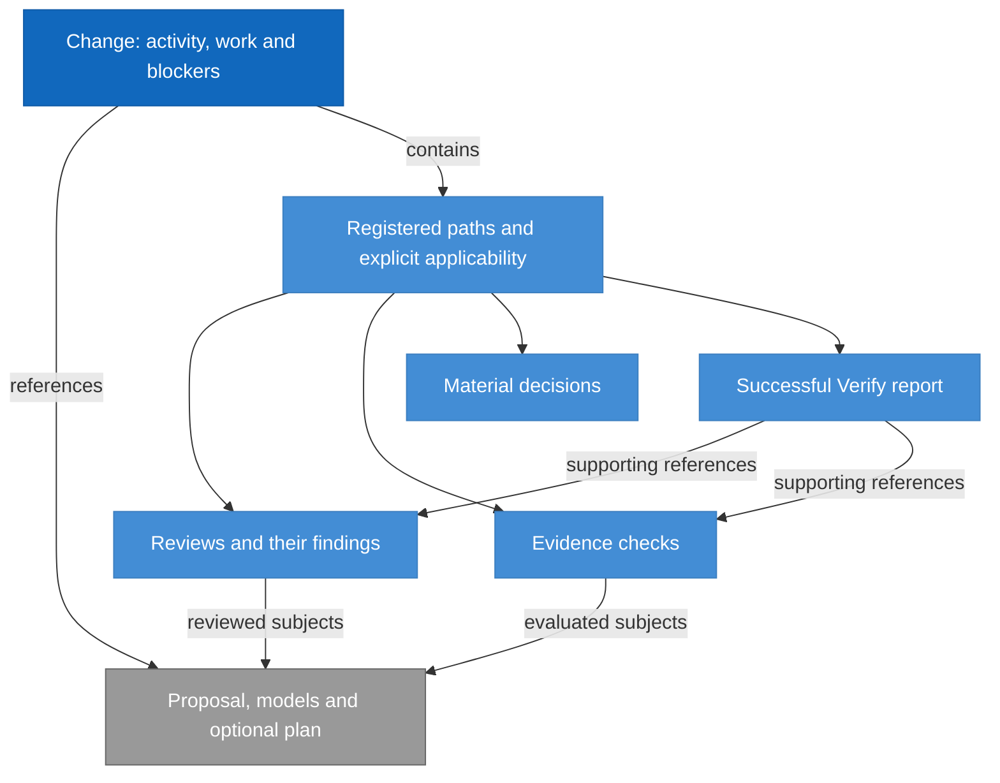

# RigorLoop Record Format Model Design

Model validation contract: model-document-v1

The [structured-assessment amendment](#structured-assessment-explanations) selects the prospective v3 extension under its own adoption boundary. Existing v2 definitions below remain the exact continuation contract; they are not silently reinterpreted as v3.

## Introduction and Goals

Define the durable representation of RigorLoop decisions, findings, evidence and final explanations. A new actor can understand current records and retained concern origin without prior chat, Git history or review archives.

The model ID is `record-format`. Its selected format is **RigorLoop Record Format v2** (`rigorloop-records-v2`). This document is the authoritative stored-format design, combining requirements, data structure, invariants and compatibility decisions. The document-validation marker above is independent of the stored version.

| Reader question | Definition |
| --- | --- |
| What is persisted? | [Record model](#record-model) and [exact record fields](#explicit-record-schema) |
| What survives later judgments? | [Concern origin and preservation](#retained-judgments-for-unresolved-findings) |
| How is old data handled? | [Compatibility and adoption](#compatibility-and-adoption) |
| Who owns adjacent behavior? | [Context and Scope](#context-and-scope) |
| What must be demonstrated? | [Boundary scenarios](#boundary-scan-and-acceptance-scenarios) |

## Context and Scope

| Concern | Owner | Relationship |
| --- | --- | --- |
| Actor responsibility, decision meaning, justified progression and independence | [Workflow](../workflow/workflow.md) | Supplies the semantic obligations represented by records |
| Stored record types, fields, relationships, versions and retained origin | Record Format | Defines the admissible durable representation |
| Public commands, request/result schemas, selection and mechanical construction | [CLI](../cli/cli.md) | Constructs and exposes records conforming to this model |
| Exact byte encoding, lossless edits, identity computation, containment, conflicts and recovery | CLI | Persists complete candidates while enforcing this model's invariants |

In scope are change, review, evidence, material-decisions and success-only Verify records. Engineering model files, plans and implementation subjects remain referenced in place. No authentication system, new stage, readiness engine, historical migration, request ledger or review-history archive is introduced.

## Architecture Constraints

Preserve historical record bytes and recorded identities as archival evidence. Closed objects and vocabularies reject unknown members and values; missing decisions are not filled by defaults. Actor labels remain attribution. Current workflow contradictions and external subject drift are distinct from malformed structure.

V2 is the retained operational format. The retirement amendment selects a v2-only runtime after coordinated removal; drafting this model does not itself remove compatibility code or activate that boundary.

## Solution Strategy

Use one explicit version per change and its registered records. Separate current concern fields and disposition from immutable origin. Store narrative in explicit fields within the same JSON object, and retain exact subjects and explicit record-level applicability. Structural validation admits incomplete or contradictory workflow claims without endorsing them.

The CLI constructs registry and serialization mechanically from explicit operations. This model owns what must survive those operations, independently of which supported write path performs them.

## Requirements

| ID | Required behavior |
| --- | --- |
| RF-SR-01 | Every stored change MUST identify its contract and every record its schema version. V2 records MUST be plain JSON objects at the listed .json paths, with narrative inside explicit string fields and no front matter or trailing Markdown. The exact closed record/type definitions below MUST govern all supported writers and readers; unknown fields, vocabularies, versions and mixed-version stores MUST reject structurally. |
| RF-SR-02 | The manifest MUST enumerate all supporting authoritative records with matching kind/change identity and exactly one explicit record-level applicability declaration each. Every v2 EntryRef MUST select exactly one admissible object using the field-specific resolution table and disjoint per-file referenceable IDs; missing, unsupported or ambiguous targets MUST reject in the complete candidate; extra physical files MUST NOT become authority through discovery. |
| RF-SR-03 | Records MUST preserve actor-supplied subjects, provenance, decisions and narrative without inferring approval, applicability or completion. Finding and blocker identity and disposition representation MUST retain the distinction between reporter and correction owner. |
| RF-SR-04 | Each v2 concern MUST retain its complete immutable Origin for its lifetime, including after disposition. Current judgments or concern fields MUST NOT rewrite that basis; supporting judgment MUST be explicitly absent or embedded with its relevant rationale and provenance. |
| RF-SR-05 | Structural validity MUST remain separate from workflow adequacy. A completed activity, failed evidence or changed external subject MUST NOT alone invalidate a correction candidate; malformed internal references still reject. |
| RF-SR-06 | The sole supported runtime stored contract after retirement MUST be rigorloop-records-v2. The retired set below MUST NOT remain available for creation, inspection, validation, mutation, progression or recovery through a compatibility handler. Historical record bytes and identities MUST remain archival evidence without conversion, inferred origin or renewed authority. CLI owns explicit rejection and current discovery mechanics. |
| RF-SR-07 | Selected records MUST retain sufficient structured and narrative content for normal targeted reads, including concern origin, shared material-decision explanation and the complete success-only Verify report. Partial query projections MUST NOT alter the stored record. |
| RF-SR-08 | Construction, advanced replacement and v2 recovery MUST share these structural and preservation obligations. Retirement MUST align schemas, validators, CLI, templates, skills and adapters while preserving v2 invariants. Document validation MUST NOT imply activation or require legacy stored-format support. |
| RF-SR-09 | After coordinated adoption, new stores MUST use rigorloop-records-v3 with schema_version 3 throughout the change and registered records. V3 MUST replace Review/Verify body with the closed explanation fields defined below, preserving other assessment facts and applying the v3 finding identity rules below. Missing required values, unknown fields, body, dual representations and mixed-version stores MUST reject. |
| RF-SR-10 | V3 explanation values MUST retain actor-supplied meaning, collection order and multiline content. Whole-field explanation updates MUST preserve omitted values and complete findings; neither rendering nor a projection may become another authoritative report. |
| RF-SR-11 | V3 Verify MAY contain the closed conditional verification_basis object below. Its necessity for reliance is owned by Review and Closeout RC-SR-20; absence is structurally valid, null or partial objects are not. It MUST NOT become a universal Git requirement or be inferred from prose. |
| RF-SR-12 | Adoption MUST preserve existing v2 stores and their exact contract, including required continuation and recovery, without automatic conversion. New v2 creation is withdrawn only at coordinated v3 adoption. Removal of existing-v2 support requires a separately reviewed owner disposition; this amendment does not retire it. |
| RF-SR-13 | V3 Review findings MUST use the closed current-account shape and ID-only immutability defined below. Explicit corrections may edit all non-ID fields; removal/renaming, origin snapshots and implicit edits through review recording MUST reject. V2 concerns and v3 blocker origins remain unchanged. |

These requirements realize Workflow's actor-owned recording and retained-basis obligations (WF-SR-02/03/05/06/10/12/13/15). CLI-SR-02/03/09/18/21 consume them for construction, inspection and safe publication. Workflow retains decision ownership; RF-SR identifiers own representation and preservation.

## Building Block View

### Record model

**RigorLoop Record Format v2** is the selected stored-record design. Its complete record layouts are defined below, with `contract: rigorloop-records-v2` in change.json and `schema_version: 2` in every record. This is a data-format contract: it defines stored fields, relationships and preservation invariants. It does not select a workflow stage or version the CLI command interface.

| Versioned surface | Identifier | Meaning |
| --- | --- | --- |
| Selected stored-record design | `rigorloop-records-v2`, stored schema_version 2 | Complete current design, including immutable concern origin |
| Retired stored formats | Exact set in Compatibility and adoption | Archival evidence only; no runtime reader or writer |
| Model-document validation | `Model validation contract: model-document-v1` | Document structure checked by the model validator; not the selected stored-record version |
| Primary CLI transport | `targeted-recording-v1`, request schema_version 1, result schema_version 2 | Transient requests and receipts, defined by the CLI model |

Version numbers belong to their own surface. A targeted request with schema_version 1 can explicitly select rigorloop-records-v2; its request version does not change the stored version. The document-validation marker `model-document-v1` versions Markdown structure separately. Its version 1 does not make the selected stored-record format v1. Retirement changes supported stored inputs, not these independent version domains.

The change record is the registry and coordination entry point. It contains activity, work and change-level blockers; it references the proposal, affected models and optional plan. Its registry identifies supporting records, each with an explicitly declared applicability entry. Review findings belong to their containing review. Reviews and evidence name exact engineering subjects; those subject identities do not become automatically current when files change.

This conceptual view illustrates RF-SR-01/02/03; it is not a second schema. Subjects may also include implementation and other proof inputs admitted by the exact Subject type. Supporting records are conditional, and their arrows do not imply that every record must exist before a correction can be saved.

| Stored record | Semantic responsibility | Definition in the [v2 JSON Schema](../../../schemas/rigorloop-records-v2.schema.json) |
| --- | --- | --- |
| Change | Recorded coordination, work, blockers, registry and applicability | `$defs.change` |
| Review | Independent judgment, exact subjects and review-scoped findings | `$defs.review` |
| Evidence | Supplied procedures, results and evaluated subjects | `$defs.evidence` |
| Material decisions | Rationale and source references that constrain work | `$defs.decisions` |
| Verify report | Successful final assessment and supporting references | `$defs.verify` |

This model owns stored field shapes, relationships and preservation invariants. The [Workflow model](../workflow/workflow.md#requirements) owns the engineering meaning of decisions and the obligations for relying on them. The JSON Schema expresses structural shapes; the [CLI model](../cli/cli.md#advanced-candidate-update-contract) owns byte encoding, containment, identity computation and persistence. Advanced request/result definitions are separately owned transport contracts, not additional stored record kinds; shared validation must be separated from retired stored definitions before their removal. V2 stores one JSON object per file. Narrative is a string field in that object, not a separate Markdown document or front-matter section. Structural validity does not establish workflow readiness.

### Explicit record schema

RF-SR-01/02/03/04 own this stored-record definition. The table defines v2 directly; the compatibility subsection below defines the retirement boundary. It is not a CLI request schema. Every object is closed: only listed fields are admitted, all fields are required unless marked optional, and duplicate keys or IDs are invalid. Empty arrays represent no entries; there are no inferred defaults. IDs use lowercase letters, digits and hyphens, start with a letter or digit, and contain 1–80 characters. Change IDs follow the same grammar. Paths are repository-relative and subject to CLI containment rules. A digest is `sha256:` followed by 64 lowercase hexadecimal digits.

Common types are `Subject = {path, identity}` and `Actor = {id, role}`. `identity` is a digest of exact file bytes; `role` is one of `human`, `proposal`, `design`, `plan`, `review`, `route`, `implement`, `verify`, `support`. A reference to a record entry is `EntryRef = {path, id}`; it identifies the entry, not a claim about freshness. Narrative fields are nonempty strings. IDs are unique within their containing array. Referenced subject files may have changed or disappeared; those are observations, unlike a dangling reference to an entry inside the candidate record set.

| Record | Exact structured fields |
| --- | --- |
| `change.json` | `schema_version: 2`, `contract: rigorloop-records-v2`, `change_id`, `proposal: Subject`, `models: [{id, subject: Subject}]`, `activity: {stage, status, owner: Actor, reason}`, `plan: Subject or null`, `work: [{id, status, owner: Actor, requirement_refs: [string]}]`, `records: [{path, kind}]`, `applicability: [{path, value, actor: Actor, reason}]`, `blockers: [Concern]` |
| `reviews/<review-id>.json` | `schema_version: 2`, `change_id`, `id`, `target`, `reviewer: Actor`, `contributors: [Actor]`, `independence_basis`, `subjects: [Subject]`, `judgment`, `findings: [Concern]`, `body: string` |
| `evidence.json` | `schema_version: 2`, `change_id`, `checks: [{id, actor: Actor, subjects: [Subject], result, procedure, summary}]` |
| `material-decisions.json` | `schema_version: 2`, `change_id`, `decisions: [{id, actor: Actor, subjects: [Subject], rationale, source_refs: [EntryRef]}]`, `body: string` |
| `verify-report.json` | `schema_version: 2`, `change_id`, `verifier: Actor`, `subjects: [Subject]`, `evidence_refs: [EntryRef]`, `review_refs: [EntryRef]`, `outcome: success`, `body: string` |

`Concern` has exactly `{id, reporter: Actor, owner: Actor, subjects: [Subject], evidence, required_outcome, state, resolution, origin: Origin}`. Origin and its immutable preservation rules are defined below. `reporter` identifies the actor responsible for disposition assessment and `owner` identifies who must perform correction; these are deliberately distinct. `state` is `open`, `resolved` or `deferred`; `resolution` is null for open work or `{actor: Actor, rationale, evidence_refs: [EntryRef]}` otherwise. The CLI checks this representation, not whether the resolution is justified. An empty evidence-reference array is valid for a reasoned disposition but does not prove the disposition adequate. Review-record blockers are findings; change-record blockers allow any stage to record a defect without inventing a review.

`stage` is `proposal`, `proposal-review`, `design`, `design-review`, `plan`, `delivery-review`, `implement`, `code-review`, `verify` or `support`. `status` is `pending`, `in-progress`, `blocked`, `ready`, `completed` or `cancelled`. These are labels, not a transition graph: any well-formed old/new label pair is recordable. `target` is `proposal`, `design`, `delivery` or `code`; `judgment` is `approved`, `changes-requested`, `blocked` or `inconclusive`. Evidence `result` is `passed`, `failed` or `inconclusive`. Applicability `value` is `current`, `stale` or `not-applicable`. Record `kind` is `review`, `evidence`, `decisions` or `verify`.

The `records` array declares every supporting authoritative record for this change; `change.json` is implicit. Each declared record must exist in the candidate set and have the matching kind and change identity. Each supporting record has exactly one explicit applicability entry in `change.json`. Extra physical files are not discovered as authority. A new supporting record and its registry/applicability entries are published together. The targeted command constructs registry bookkeeping, but the requesting actor explicitly supplies applicability value, actor and reason. Applicability remains at supporting-record level; individual checks or findings do not acquire a separate applicability field. These are referential checks, not review prerequisites.

The CLI model owns bytes and encoding. Review, material-decisions and Verify objects require a nonempty body string containing human-readable reasoning. All fields belong to the same JSON object. Body explains the judgment or shared rationale; it must not maintain a second status, finding list or reviewer roster. The named structured fields remain authoritative for those facts. Avoiding narrative duplication is an authoring responsibility, not a CLI semantic rejection gate. Markdown formatting may occur inside a narrative string but adds no separate serialization layer. Subject and evidence arrays may be empty while recording incomplete work; Workflow actors must not use incomplete records to justify approval or completion. A Verify report's outcome admits only success, but the CLI does not establish that its assertion is true.

### Entry reference resolution

RF-SR-02 owns v2 EntryRef interpretation. The representation remains exactly `{path, id}`; no kind field, inferred namespace or search across files is introduced. Path selects the exact authoritative file in the same change's complete candidate: the implicit change.json or a registered supporting file. ID then selects the exact case-sensitive ID of an admissible object in that file, as defined by the referencing field below.

| Referencing field | Admissible target file and object |
| --- | --- |
| Finding or blocker resolution.evidence_refs[] | evidence.json, a checks[] entry |
| verify-report.json evidence_refs[] | evidence.json, a checks[] entry |
| verify-report.json review_refs[] | A registered reviews/<review-id>.json, its root review object selected by the root id; never a finding |
| material-decisions.json decisions[].source_refs[] | change.json models[], work[] or blockers[]; a registered review's root object or findings[]; evidence.json checks[]; or material-decisions.json decisions[] |

All IDs of referenceable objects within a v2 file MUST be disjoint, including a review's root id versus finding IDs and the manifest's model, work and blocker IDs. Array-local uniqueness still applies. The same ID may occur in different files because path is part of identity. Actor IDs, change_id, applicability entries, activity, Origin and JudgmentBasis are not referenceable objects. A Verify report has no entry id and is not an EntryRef target. Its full content remains available through normal targeted reads. Subject references identify engineering files separately; they are not EntryRef targets.

| Resolution case | Structural result |
| --- | --- |
| Exact path, permitted collection and exactly one matching ID | Resolve that object; do not infer approval, applicability, freshness or adequacy |
| Missing file or ID, unregistered path, wrong target kind/collection, cross-change path or unsupported object | Reject the combined candidate as broken-reference; unsafe paths retain unsafe-path rejection |
| Duplicate referenceable IDs within a file, including collisions across collections or with the review root | Reject as invalid-input even if no current reference uses the collision; never pick the first match |
| Malformed reference object or duplicate identical pair within one reference array | Reject as invalid-input |

Resolution validates the final combined candidate, so a reference and its target may be introduced in the same transaction. Empty reference arrays remain valid representation. References record links rather than recursive evaluation: self-links and cycles among decision source_refs are structurally recordable, but do not independently establish evidence or justified reliance. The CLI does not follow them to manufacture a judgment.

For example, review_refs pointing at review file design-review.json with id finding-1 rejects even if that finding exists; the field permits only the review root. A decision's source_refs may select that same finding. A review root and finding both named design-review reject rather than making either field ambiguous. A new check and a disposition referencing that check resolve together after complete candidate construction.

These target namespaces remain the v2 contract. Earlier v1 path/ID membership validation is retired under RF-SR-06; no current reader applies either its permissive interpretation or v2 semantics to historical records. Historical bytes and reviewed identities are preserved without runtime validation, inferred target meaning or migration.

### Examples

The [stored-record example index](examples/README.md) distinguishes supported v2, proposed v3, complete collections and isolated update scenarios.

These complete JSON objects illustrate the stored format; they are not registered change records or additional normative definitions. Hashes are synthetic, syntactically valid identities, not hashes of repository files. Each file illustrates one record, not a complete registered store. Example change/subject identities connect scenarios conceptually; the CLI work example has its own stated starting state.

| Example | Question answered | Requirement basis |
| --- | --- | --- |
| [Minimal change](examples/v2-minimal-change/change.json) | What does the complete manifest look like before supporting records exist? | RF-SR-01/02/03 |
| [Incomplete review](examples/v2-review-without-subjects/review.json) | How is missing assessment basis recorded without inventing approval? | RF-SR-01/03/05/07 |
| [V2 review before reassessment](examples/v2-review-reassessment/before.json) and [after reassessment](examples/v2-review-reassessment/after.json) | How can a new approval preserve an unresolved finding and its immutable origin? | RF-SR-03/04/05/07 |

The reassessment pair intentionally leaves the finding open and byte-equivalent as a JSON value. The current review changes subjects, judgment and body; no finding disposition or applicability is implied. The recordable after-state does not itself justify progression. Supporting-record registration and explicit applicability are required in a containing store, as specified above.

Examples use JSON directly, without commentary properties or Markdown wrappers. The CLI owns [request/receipt examples](../cli/cli.md#examples), and Workflow owns [actor sequencing](../workflow/workflow.md#examples). Readers load only the example relevant to their question.

### Retained judgments for unresolved findings

The finding itself retains enough origin basis for the next actor to understand the concern. It does not depend on a chain of prior review rounds, an assessment archive, Git history or chat. This replaces the earlier proposed named-assessment collection and current-assessment pointer; neither becomes part of the selected stored representation. A current review judgment can change while its unresolved findings keep the original basis that made them actionable.

#### Selected record-format revision

The v2 record table above and the types below form one stored-format definition. Every review finding and change-level blocker carries its own origin; no review assessment array or current pointer is added. Retirement removes the old stored definitions without changing this v2 concern representation.

| Type | Exact shape |
| --- | --- |
| Concern | `{id, reporter: Actor, owner: Actor, subjects: [Subject], evidence, required_outcome, state, resolution, origin: Origin}` |
| Origin | `{reporter: Actor, subjects: [Subject], evidence, required_outcome, rationale, supporting_judgment: JudgmentBasis or null}` |
| JudgmentBasis | `{reviewer: Actor, contributors: [Actor], independence_basis, subjects: [Subject], judgment, rationale}` |

Objects are closed, listed fields are required, and the existing Actor, Subject, text and judgment types apply. The origin rationale is a concise, actor-supplied explanation of why the observed evidence matters for the required outcome. Supporting judgment is an optional fact represented by explicit null when none is cited; a concern does not need a fabricated overall review judgment to be recorded. When supplied, that judgment's complete relevant rationale and provenance are embedded, not represented solely by a mutable link or hash. The finding's original observed evidence and required outcome are retained even if its current fields later evolve.

At creation the CLI copies reporter, subjects, evidence and required_outcome from the actor's concern values into origin. The actor supplies the rationale and explicitly chooses whether a supporting judgment is absent, supplied directly, or constructed from the provenance/outcome of an exact selected review plus actor-supplied finding-specific rationale. Copying the selected content is mechanical preservation; selecting its significance is the actor's decision. No actor is required to retype another review or assemble serialized metadata to retain it. The [CLI contract](../cli/cli.md#finding-origin-construction) defines those input forms.

#### Preservation and reliance

Origin is immutable for the lifetime of a concern ID in v2, including after an explicit disposition. New reviews preserve the complete origin along with the finding. They may update their current judgment and narrative without carrying every prior review round. A correction to the concern's current subjects, evidence or required outcome leaves origin intact. A mistaken original report is addressed through current explanation and explicit disposition, not by falsifying its history; a distinct concern receives a distinct ID.

Supporting judgment can be null while the origin remains useful: the reporter, exact subjects, evidence, rationale and required outcome explain the original defect. If a formal reviewer cites an actual supporting assessment, it preserves that assessment's relevant content within the origin. No automatic inference supplies a judgment, independence basis, applicability value or disposition. Later judgment does not become new origin simply because hashes match or a review is approved.

The current state and resolution fields say what the responsible actor now concluded. A resolved/deferred disposition retains the actor, rationale and explicit evidence references under the existing resolution type. That outcome does not overwrite origin or automatically close another actor's concern. Origin preservation applies to targeted and advanced writers and exact-byte recovery; attempts to mutate/remove it under an existing ID are structural preservation errors. This invariant applies regardless of open/resolved state, so it does not create a readiness prerequisite for correction recording.

A normal finding read returns current fields and origin together. This is sufficient to understand the reported concern and its origin without replaying review history, but it does not replace reading the current engineering subjects needed to assess a fix. The existing size limits apply to embedded basis; a limit error does not permit silently truncating rationale or dropping provenance. Actors provide the relevant finding-specific basis, not a dump of all earlier records.

#### Example: a later approval does not erase a concern

| Moment | Current review | Finding f1 | Origin available in f1 |
| --- | --- | --- | --- |
| Original report | changes-requested | Open, with actionable evidence and required outcome | Original reporter, subject identities, evidence, rationale and explicitly cited judgment |
| Later review | approved | Still open until its responsible reviewer decides otherwise | The same origin, without reading the old review body |
| Explicit reassessment | approved | Resolved with the reviewer's current rationale and evidence references | The original basis remains alongside the current disposition |

The middle row is recordable but does not establish justified progression. This example illustrates RF-SR-03/04/05; a saved later approval never disposes the finding automatically.

#### Compatibility and adoption

RF-SR-06 owns the exact retirement set:

| Stored contract | Selected runtime support |
| --- | --- |
| `rigorloop-records-v2` | Retain creation, reading, validation, updates and recovery under the existing v2 invariants |
| `explicit-recording-v1` | Retire all runtime acceptance, including advanced creation and compatible reads/updates |
| `compact-current-state-v1` | Retire all runtime acceptance and its exclusive projection/progression/recovery machinery |
| `stage-owned-change-local-v1`, `stage-owned-change-local-v2`, `stage-owned-change-local-v3`, `legacy-unversioned` | Retire all runtime acceptance and their exclusive lifecycle machinery |

Historical files remain unchanged evidence. Preservation does not require decoding them through the current CLI, executing their validators, converting approvals, or reconstructing missing concern origin. There is no migration, export facility, temporary reader, recovery compatibility service or new archive schema. The owner's completed-work baseline supplies the retirement direction; concrete contrary residue encountered during removal receives the bounded Workflow disposition.

Remove exclusive legacy stored schemas and codecs only after extracting definitions actually consumed by v2. The advanced schema_version 1 result envelope and targeted-recording-v1 request interface are CLI transport contracts; the model-validation marker is a document contract. None is retired by its spelling. The CLI model owns their retained validation, safe unsupported-input outcomes and archive/current-work classification.

No v2 stored field, schema version, path, origin invariant or EntryRef interpretation changes. Mixed stores and malformed current records remain errors. Earlier RF-SR-06 and RF-DEC-04 compatibility-retention text is replaced by this deliberate support break; the IDs remain stable and prior approvals still identify their original subjects.

## Structured assessment explanations

This amendment follows the [approved proposal](../../proposals/2026-09-10-structured-assessment-explanations.md), under its [owning change](../../changes/2026-09-10-structured-assessment-explanations/change.json). It defines a prospective stored contract, not an implemented schema or adopted runtime. Governance continues to select v2 until reviewed coherent implementation and successful Verify authorize the coordinated local adoption. Publication and customer adoption remain separate.

### Exact v3 record definition

RF-SR-09–13 extend RF-SR-01–08 as mapped below. V3 retains every v2 path, record kind, Actor, Subject, EntryRef, enum, registry and applicability rule except the explicit finding replacement below. Change-level blockers retain the v2 Concern/Origin/JudgmentBasis definitions; Review findings use the v3 Finding type. Every record instead has `schema_version: 3`; the manifest has `contract: rigorloop-records-v3`. No new record kind is introduced. The only record-member changes are the following closed replacements; all other v2 members remain required with their existing types.

| Record | Remove | Add |
| --- | --- | --- |
| Review | `body`; each finding’s `origin` | Required `summary: string`, `assessment_scope: string`, `rationale: [string]`, `limitations: [string]` |
| Verify | `body` | The same four required fields; required `changes: [string]`; optional `verification_basis: VerificationBasis` |
| Change, evidence and material decisions | Nothing except version discriminator values | No explanation fields; material-decisions `body` remains required |

Summary and assessment_scope must contain at least one non-whitespace character. Every array item must also contain at least one non-whitespace character. Rationale and Verify changes each require at least one item; limitations may explicitly be empty. Strings may contain paragraphs, line breaks, Unicode and code examples. Arrays are ordered collections; duplicate strings are allowed and never silently deduplicated. Structural checks reject empty/whitespace-only values without trimming or normalizing supplied text. They do not decide whether a reason is substantive, a change was delivered, or the limitations are sufficient.

Summary explains the conclusion; assessment_scope explains coverage and supported reliance. Rationale contains complete reasons, limitations the known limits, and Verify changes the delivered outcome. Existing judgment/outcome, actors, subjects, findings and referenced evidence remain their sole factual authorities. Explanation fields must not reproduce status, finding inventories, reviewer rosters, command receipts or coordination decisions as competing authority. This is assessor authoring policy, not prose parsing by the CLI. An inconclusive review can explain missing basis in its rationale without invented positive findings. Structural completeness of these fields does not imply adequate subjects or evidence.

`VerificationBasis` is exactly `{repository_identity, remote_identity, base_branch, base_revision, merge_base_revision, head_branch, verified_subject_revision}`. All seven values are required non-whitespace strings; no extra fields or nulls are admitted. They retain the normalized, resolved meanings supplied by Verify's existing Git/PR readiness method, now governed by RC-SR-20. Git revision values are opaque immutable identifiers rather than Record Format sha256 subject identities; stored validation must not assume a hash algorithm or resolve names through Git. Remote/repository identifiers contain no credentials. There is no object in Review and no nested `body` or extension bag. Missing basis is a policy reliance issue where the claim needs it, not a universal structural rejection or a Git dependency for recording corrections.

### V3 finding identity and correction

RF-SR-13: A v3 Review finding MUST contain exactly `id`, `reporter`, `owner`, `subjects`, `evidence`, `required_outcome`, `state` and `resolution`, with their retained v2 types and requiredness. Only `id` is immutable. `origin`, embedded `supporting_judgment`, extension fields and per-finding history MUST reject. No original wording or original assessment snapshot is guaranteed. The current evidence and required outcome explain the problem sufficiently to act; no new rationale field or audit log is required.

Existing finding IDs remain present in their review. Removing or renaming an existing finding rejects; a distinct problem receives a new ID. All non-ID fields may be corrected explicitly, including reporter attribution and subjects, without claiming another actor supplied an assessment. State/resolution consistency and typed reference checks remain required. Withdraw a mistaken report using `state: resolved` and a resolution explaining the withdrawal; retain the existing enum, with no separate withdrawn status. A save does not prove a fix or approve a review.

Review explanation updates and complete review recording preserve the entire findings collection. Explicit finding operations update current fields; advanced replacement may perform the same valid corrections while retaining existing IDs. Recovery restores exact before/candidate bytes, not an original narrative. V2 finding origin and v3 change-level blocker origin remain unchanged; this selected simplification concerns Review findings only.

This is the user's scoped direction revision to the proposal's original origin-preservation requirement. It favors a useful current problem account over a guaranteed original account. The proposal and its approval remain historical evidence of their exact earlier direction; neither is rewritten or claimed to approve this refinement.

### Version adoption and preservation

New-store creation after adoption selects v3 explicitly. A v3 store may not register v2 reviews, evidence, decisions or Verify reports even where their non-version fields otherwise match. Existing v2 stores retain current reads, complete recording, edits already in their catalogue, validation and recovery; they do not gain v3 explanation operations. This initiative can therefore complete its assessments under its original v2 contract without converting its own approval. Existing completed records receive no automatic rewrite or reinterpretation; any separately authorized correction uses their original contract and leaves other records untouched.

This is an explicit continuation disposition, not a claim that v2 work is complete. Existing-v2 runtime removal is outside this change. It needs a separately approved retirement decision after inspecting then-current work and recovery needs; neither stage labels nor file existence authorize removal. The earlier retired formats remain retired. Restoring an older executable cannot read v3; rollback must retain access to a compatible executable for any created v3 stores and must not down-convert them.

| Earlier clause | Exact prospective disposition |
| --- | --- |
| RF-SR-01/02, explicit record schema and version table | Preserve v2 definitions for existing stores; add the closed v3 definition above and per-store version dispatch. |
| RF-SR-03/04/05/07/08 and Origin/EntryRef definitions | Retain v2 unchanged. RF-SR-13 replaces original-basis retention for v3 Review findings only; v3 blockers retain Origin. Semantic separation, current references and transaction safety remain. |
| RF-SR-06 and compatibility table's v2-only/create policy | RF-SR-12 replaces only exclusive-v2 support/new creation at coordinated adoption; all earlier retirement exclusions remain. |
| RF-DEC-02/05 | Retain exact v2 meaning; RF-DEC-06 selects v3 rather than changing those historical decisions. |

### V3 examples and integrated outcomes

The [finding correction example](examples/v3-finding-correction/README.md) shows a complete stored and updated Review plus its linked CLI operation. It exercises RF-SR-13: the same finding ID retains an editable current account without an origin snapshot.

The [complete five-kind collection](examples/v3-complete-store/README.md) provides a linked proposed [change](examples/v3-complete-store/change.json), [Review](examples/v3-complete-store/reviews/final-code-review.json), [evidence](examples/v3-complete-store/evidence.json), [material decisions](examples/v3-complete-store/material-decisions.json) and [Verify](examples/v3-complete-store/verify-report.json). Each is a complete record under RF-SR-01/02/03/07/09–12, with a consistent virtual registry, explicit applicability and resolvable EntryRefs. Its README defines the synthetic identities, omitted external subjects and incomplete lifecycle-proof scope. The collection illustrates relationships without claiming actual review, execution or justified completion.

The [V3 review before a limitations update](examples/v3-review-limitations-update/before.json) and [after the update](examples/v3-review-limitations-update/after.json) are complete proposed v3 Review objects using synthetic identities. Only limitations differs; findings and all other values remain identical, with no v3 finding origin. They illustrate RF-SR-09/10/13, not executed byte-preservation proof. The [Verify example](examples/v3-verify-without-evidence/verify-report.json) is a complete proposed non-Git v3 report with explicit empty supporting-reference arrays to illustrate recordability rather than justified success. The [conditional-basis example](examples/v3-verify-limitations-update/before.json) adds the complete optional object for an explicitly synthetic Git/PR claim; its branch labels and revisions are illustrative, not resolved repository facts. None is a registered record or new judgment. A v3 executable schema is not yet available, so JSON parsing and Design inspection are the available checks; Delivery must add schema conformance and transition proof. Earlier examples remain complete v2 continuation examples.

The [Verify limitations-update example](examples/v3-verify-limitations-update/README.md) pairs a complete proposed after record with the indexed conditional-basis before record. It illustrates RF-SR-09/10/11 by changing only limitations and retaining the complete optional basis. The corresponding CLI requests and projections are owned by the [CLI example index](../cli/examples/README.md).

For RF-SR-09/10, demonstrate named field selection and a limitations replacement while every finding and unselected byte span stays unchanged; a semantic no-op preserves whole-file bytes. For RF-SR-11, a complete conditional basis survives full reads and complete reassessment, while partial/null/unknown basis members reject and absence never authorizes branch readiness. For RF-SR-12, complete an existing v2 change while creating a separate v3 change; neither support path can insert the other's records or convert during recovery. These combined outcomes supplement the eight model dimensions below; concrete checks remain Delivery-owned.

## Runtime View

### Construct and inspect a record

An actor selects exact targets and decision basis through the CLI. The CLI reads a coherent snapshot, dispatches its stored format, constructs only requested edits and validates the complete candidate against RF-SR-01/02/03/04. A newly registered supporting record requires its explicitly supplied applicability in the same candidate. No intermediate missing reference is published.

A normal read returns selected current fields and retained narrative/origin. The CLI exposes the manifest discriminator as record_contract alongside the coherent snapshot revision in every successful primary change-scoped read (CLI-SR-22), even when no selected entries are returned. This is a projection of the stored contract, not an additional stored field or inferred format choice. Summary projections declare omissions under the CLI contract; they do not remove data from storage. A full Verify read returns the final assessment and explanation, while a full decisions read includes the shared narrative (RF-SR-07).

### Reassess a concern

A later review may explicitly replace its current judgment while preserving existing findings and their origin. A finding's current evidence or required outcome can change without rewriting the original basis. Explicit resolved/deferred disposition adds its current rationale and evidence references; neither later approval nor a matching subject hash closes it automatically (RF-SR-03/04/05).

### Conflict, retry and recovery

The CLI checks expected revision and declared subject identities before accepting a candidate. Stale requests conflict rather than merge. Recovery restores the exact verified before-state or completes the prepared candidate through the CLI's recovery contract; it does not invent a new origin, reapply old decisions to newer records or convert formats. Restoring a prepared before-state is transaction rollback, not a semantic edit to origin (RF-SR-04/06/08).

## Deployment View

This model creates no daemon, database or additional authoritative sidecar. Stored files remain repository-local at the paths defined above and contained by the CLI contract.

Delivery removes exclusive legacy stored definitions and reconciles consumers while retaining the existing v2 schema and safety validation. Shared transport definitions must survive independently. Installation and release infrastructure remain separately owned; the reviewed retirement implementation must adopt this support break coherently.

## Crosscutting Concepts

### Serialization, identity and narrative

The [CLI encoding and candidate contract](../cli/cli.md#lossless-candidate-construction-and-shared-engine) owns plain JSON encoding for v2, exact-byte identities, lossless edits and limits. Record Format owns the resulting object structure and preservation requirements. A formatting-only rewrite is still subject to the CLI's byte-preservation rules. Narrative cannot override structured identity or enumerated values.

File identity, stored format version and current workflow applicability are distinct. Changing one does not implicitly decide another. External historical subjects may drift; internal record references must resolve within the candidate.

### Boundary scan and acceptance scenarios

| Dimension | Requirement basis | Distinct outcome to demonstrate |
| --- | --- | --- |
| Input domain | RF-SR-01, RF-SR-02, RF-SR-09, RF-SR-11 | V2 front matter, trailing Markdown, wrong file extensions, missing/empty body and unknown members/enums reject; escaped multiline body round-trips as a JSON string; every declared record has matching kind, identity and explicit applicability. EntryRef rejects missing, unsupported and ambiguous targets, including review-root/finding and manifest collection ID collisions. V3 rejects missing/whitespace-only explanation, unknown or dual body fields and partial/null conditional basis; multiline strings remain intact. |
| State/lifecycle | RF-SR-03, RF-SR-04, RF-SR-05 | Completed work can receive a new blocker; resolving a concern preserves origin and cannot implicitly close another concern. |
| Identity/authority | RF-SR-03, RF-SR-04, RF-SR-10, RF-SR-13 | Changed review subjects never rewrite historical origin; actor labels do not establish reviewer independence. V2 retains origin. V3 explanation replacement leaves complete findings unchanged; explicit finding correction may replace the reported basis under the same ID (RF-SR-13). |
| Composition/path | RF-SR-02, RF-SR-07, RF-SR-08, RF-SR-09, RF-SR-10, RF-SR-11 | Targeted and advanced candidates enforce identical invariants, including field-specific references and same-batch target creation; full selected Verify/decisions reads retain narratives without unrelated record bodies. V3 full/selected reads preserve the one authoritative explanation and conditional basis. |
| Temporal/retry | RF-SR-04, RF-SR-08 | A later review preserves an existing concern's basis; stale retries conflict through the CLI without duplicated effects. |
| Failure/recovery | RF-SR-02, RF-SR-04, RF-SR-08, RF-SR-12 | Interrupted publication restores exact before-state or completes the prepared candidate; neither outcome leaves mixed versions or partially registered authority. The journal selects the exact v2 or v3 contract; recovery never upgrades the before-state. |
| Compatibility/migration | RF-SR-01, RF-SR-06, RF-SR-12 | Every named retired contract rejects through current runtime boundaries without writes, fallback or conversion; primary and advanced v2 operations retain their contract. Archived bytes and recorded identities remain unchanged; mixed and malformed v2 records reject. After this amendment adopts, new stores select v3 and existing v2 operations continue under the exact original contract without conversion. |
| External/environment | RF-SR-05, RF-SR-07, RF-SR-08 | Missing external subject is distinguishable from dangling internal reference; another actor reads the retained basis without Git, network or prior chat. |

Material combined hazards include a new concern after completed work (RF-SR-04/05), a newly registered record with missing applicability (RF-SR-02/03), and an interrupted multi-record update (RF-SR-01/08). Delivery allocates proof jointly with the CLI's conflict and publication scenarios. These are acceptance obligations, not reported runtime test results.

## Architecture Decisions

| ID | Decision | Rationale and trade-off |
| --- | --- | --- |
| RF-DEC-01 | Give stored representation its own model. | Workflow meaning and CLI mechanics consume one field contract; neither maintains a second normative layout. |
| RF-DEC-02 | Use rigorloop-records-v2 with schema_version 2 for the selected format. | Required concern origin changes persisted structure, so a document rename or silent extension of closed v1 records is insufficient. |
| RF-DEC-05 | Store v2 as plain JSON with body strings. | A single structured object eliminates dual JSON/Markdown sections and repeated decision facts; CLI human rendering provides readable explanations. Existing v1 files are not converted. |
| RF-DEC-03 | Embed immutable origin in each concern. | Preserves actionable basis without an assessment archive; consumes record space and requires explicit finding-specific rationale. |
| RF-DEC-04 | Retire legacy runtime acceptance while preserving archival truth. | Owner-confirmed completed legacy work removes the need for ongoing compatibility handlers. Replaces the earlier v1-reader retention decision without converting records or retargeting approvals. |
| RF-DEC-06 | Replace Review/Verify explanation in a distinct v3 stored contract; retain existing v2 continuation. | Named fields expose meaning without universal reports or duplicate facts. Silent v2 redefinition and automatic narrative extraction would reinterpret assessments; immediate v2 removal would strand ongoing work. Conditional verification basis preserves an existing specific consumer need without universal Git dependence. |

| RF-DEC-07 | Use ID-only immutability for v3 Review findings; omit origin and embedded supporting judgment. | User-selected simplification: maintain the current actionable account without mandatory original snapshots or revision history. Retain explicit disposition, stable references and v2 historical meaning; blockers are outside this change. |

## Quality Requirements

| Quality | Acceptance condition | Requirement coverage |
| --- | --- | --- |
| Resumability | A selected concern explains its origin without review-round replay or chat. | RF-SR-04, RF-SR-07 |
| Correctability | Workflow contradictions do not prevent structurally valid correction records. | RF-SR-05 |
| Integrity | All write paths preserve origin, registry coherence and exact contract identity. | RF-SR-01, RF-SR-02, RF-SR-08 |
| Compatibility | Historical v1 content remains truthful and distinguishable. | RF-SR-06 |
| Usability | Final explanations remain complete normal deliverables. | RF-SR-07 |

## Risks and Technical Debt

Embedded rationale can reach the existing per-record size limit; the CLI must reject excess explicitly without truncation. Preservation cannot establish that an original assessment was correct. The removal dependency analysis and v2 regression proof remain delivery obligations; the operational v2 baseline is not proof of the future removal. Model-document validation uses `model-document-v1`; the Design model owns its structural contract, independently of stored-format dispatch.

## Glossary

Stored format: versioned durable data contract. Concern: review finding or change-level blocker with current fields and retained origin. Origin: immutable original basis for a concern. Applicability: actor-declared usability of an entire supporting record. Subject identity: digest of the exact assessed file bytes. Transport: transient CLI request or response, independently versioned.

## Drafting basis and authority

This revision follows the [approved retirement direction](../../proposals/2026-09-08-retire-compact-workflow-mutations.md), its independent Proposal Review and the user's continuation into focused Design. Owning record: [change.json](../../changes/2026-09-08-retire-compact-workflow-mutations/change.json). The exact package comprises Record Format, CLI and Workflow; Review and Closeout and Test remain unchanged policy dependencies. The owner confirms that legacy work is complete and v2 is operational; this is an attributed operating baseline, not an independently executed completion query. The selected retirement supersedes earlier compatibility-retention clauses prospectively. Prior subjects, approvals and archival records retain their original meaning. This Design does not implement retirement, activate a release or authorize publication.

## Next artifacts

Independent Design Review assesses the exact Record Format, CLI and Workflow package, including removal dependencies, archival separation and retained v2 safety. Delivery planning follows Design approval and authorized continuation; implementation and final closeout require their normal independent assessments.

## Follow-on artifacts

None yet.
