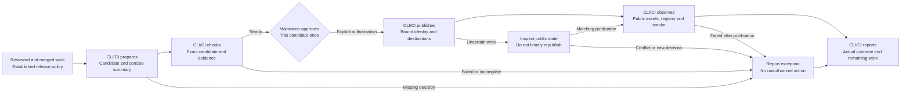

# Release Model Design

Model validation contract: model-document-v1

## Introduction and Goals

Release owns the recurring operation that prepares, verifies, publishes and records an already-reviewed release, including identity, transaction-profile authority, publication boundaries, evidence and recovery. The [approved direction](../../proposals/2026-09-09-release-model-source-consolidation.md) selects this model and removal of superseded design sources. The [owning change](../../changes/2026-09-09-release-model-source-consolidation/change.json) records exact subjects, assessments and adoption evidence.

| Phase | Responsible actor | Observable result |
| --- | --- | --- |
| Prepare | CLI/CI using reviewed work and established policy | Determined candidate, generated profile/artifacts and release summary; unresolved decisions are explicit exceptions. |
| Check | CLI/CI consuming applicable engineering assessments | Current required candidate evidence; failed or incomplete prerequisites prevent an approval request. |
| Approve | Maintainer | One explicit authorization for the identified candidate, publication path and destinations. |
| Publish and observe | Authorized CLI/CI | That candidate is published and its public assets, registry identity and fresh smoke are observed. |
| Report | CLI/CI | Durable actual outcome, including failed-before, uncertain or failed-after publication and any required intervention. |

For the supported routine population, approval is the only normal maintainer action (REL-SR-22). No manual profile assembly, hash copying, timing completion, per-helper invocation or declaration of generated passes is required. The short view is the normal operation; safety/exception rules, implementation formats and this consolidation's disposition follow separately. An approval summary shows version/channel, exact reviewed and prepared source, user-relevant changes, package/target inventory, required checks and limitations, and the destinations/actions authorized. Tooling binds the underlying identities; the maintainer need not retype hashes.

The ownership transfer below takes effect only through reviewed coordinated implementation and successful Verify. Until then the mapped legacy sources govern their existing populations. This model does not authorize a release, manufacture release evidence or claim that every existing release conforms to the current profile.

## Context and Scope

Established configuration and reviewed upstream decisions supply the release policy. CLI/CI derives routine inputs, prepares and checks a candidate, and requests its approval. The approved execution publishes and observes the public result automatically. Missing version intent, unsupported configuration or unavailable credentials is an exception with an actionable owner decision, not a routine manual checklist. An engineering change is not a release transaction, and a transaction profile is not an engineering change record.

| Relationship | Owner and boundary |
| --- | --- |
| System composition | [System](../system/system.md) identifies actors, Release and its producers/consumers; it does not duplicate this contract. |
| Skill and generated packages | [Skill](../skill/skill.md) owns common content; retained adapter invocation/archive contracts own generation, target layout and identities. Release consumes their proof and publishes the selected artifacts. |
| Installation | [Target-native init](../../../specs/target-native-init.md) and its retained state/download contracts own filesystem mutation and trust. Release requires applicable packed/public installation proof without redefining installation. |
| Engineering assessment and recording | [Review and Closeout](../review-closeout/review-closeout.md) owns assessment/applicability; Workflow coordinates; Record Format/CLI own current engineering records. Release evidence retains its own version-scoped formats. |
| Test and validation execution | [Test](../test/test.md) owns protective-value criteria. Existing selection/preflight/cache contracts own shared execution. Release owns the operation-specific composition and public evidence obligations below. |
| Version-specific contracts | Named npm, adapter and activation release contracts may impose stricter rules for their population. They remain necessary dependencies, not automatically transferred histories. |

The amended direction selects bounded coordination of existing Release mechanisms and their necessary CLI/CI, profile/evidence and timing-validation changes. Automated publication after candidate-specific approval is required; unapproved publication remains prohibited. No new hosted service, general workflow engine, staging publication channel, customer governance adoption, general validation redesign or other model extraction is selected. Actual publication while implementing this change remains separately authorized. This is a behavior change as well as source consolidation; earlier documentation-only scope does not govern the amended package.

## Architecture Constraints

Constitution and explicit execution permissions govern. Routine publication starts from reviewed and merged source that introduces no unapproved engineering decision. The bounded, deterministic release-only preparation described below may produce a derived candidate commit; its exact diff is disclosed in the one approval, and no unreviewed product or executable change is admitted. Authentication, provenance, identity, release proof and immutable-publication recovery remain mandatory under their applicable contracts. This model transfers current authority; it does not reactivate old lifecycle writers, first-rollout authoring gates or retrospective benchmarks.

Operational release profiles, generated metadata, templates, fixtures and recovery inputs are not superseded prose. Historical releases and recorded judgments keep their original subjects and meaning. Removing an explanatory source does not remove its tests or waive a real operation's checks. Current rules and necessary evidence remain understandable from the checkout.

## Requirements

| ID | Required behavior |
| --- | --- |
| REL-SR-01 | A routine publish MUST introduce no new product, implementation, package-surface, adapter-target, install-root, evidence-location, gate, authentication, provenance, versioning or publish-mechanics decision. Such changes require their normal reviewed engineering lifecycle first. An already-approved breaking source change may be published routinely with its major-version decision and upstream approval identified. Routine execution alone requires no new proposal or plan. |
| REL-SR-02 | Every attempt MUST identify its release type, version decision, source commit/branch, package, tag and npm dist-tag before publication. No-change and already-published-version attempts MUST stop without overwriting publication and record duplicate, recovery or no-op meaning. Patch means backward-compatible fixes/docs/internal work without public additions; minor means compatible public additions; major means breaking public behavior/contracts. Stable npm publication uses `latest`; prereleases use an approved non-`latest` tag, but this policy does not imply that the current stable-only automation supports prereleases. |
| REL-SR-03 | Routine profile-driven releases MUST use one `release-profile-v1` profile at `docs/releases/profiles/<tag>.yaml` as authority for release/package identity, target set, artifact expectations, publication/evidence/validation requirements and generated preparation. Routine automation applies only to the same npm package, supported target set (codex, claude, opencode), publication channels and evidence schema, with no emergency/security exception, new adapter class, release-schema migration or historical-evidence rewrite. This population is narrower than routine publication under REL-SR-01: prior approval of an excluded change does not make it routine automation. Special handling requires an explicit owner decision, which neither reclassifies the release as routine nor establishes tool support. Scripts MUST NOT replace profile authority with current-version constants. Missing/malformed profiles or unsupported values reject; special releases require an explicit owner decision and MUST NOT be forced through routine handling. |
| REL-SR-04 | Every release-preparation surface MUST be classified as profile-owned generated, human-authored profile-checked or historical immutable. Preparation MUST derive generated surfaces and current fixture data from the profile, preserve human narrative outside declared regions, and never generate test logic or rewrite historical evidence. Manual generated overrides require visible rationale and preflight assessment. Generated diffs remain reviewable tracked artifacts in the prepared candidate. Their routine authorization is included in the candidate approval; an unexpected semantic edit returns to engineering review. |
| REL-SR-05 | Preparation MUST be idempotent for the same complete profile and repository state, validate pending evidence and allowed placeholders, and MUST NOT publish, create tags, push, create GitHub releases or query npm publication state. Interrupted or partial preparation does not imply readiness; inspect affected outputs and rerun/check from their actual basis before relying on them. |
| REL-SR-06 | Python-owned release preflight MUST be idempotent and side-effect-light: no release-artifact writes except explicitly requested timing/log output, no credentials requirement and no full release check, broad adapter tests, archive generation/validation, package pack smoke or public smoke. It MUST check profile completeness, package/version agreement, metadata pointers, literal ownership, pending evidence, required local inputs, release-output state and tag conflicts. Reachable remote conflicts block; unavailable remote state is reported, never a pass. An explicitly allowed local conflict still requires its owner decision. |
| REL-SR-07 | Newly changed unauthorized current-version literals MUST fail. Existing baseline drift remains reported until corrected/classified. Historical literals need explicit historical classification/rationale; generated-current literals need a profile or generated-region owner. Diagnostics identify file, literal, classification, expected owner and corrective action. A cheap same-input drift found only by full verification MUST gain preflight regression protection when corrected. |
| REL-SR-08 | Before requesting routine approval and again for applicable boundary safeguards at execution, all applicable non-deferred release checks MUST pass: clean tree or recorded intentional release artifacts; release notes or a recorded not-required rationale, with tracked notes mandatory for the applicable adapter/release contract; current generated outputs; selected tests/CI/broad smoke; package-content preview; npm build/pack and local packed-install smoke; archive inventory/checksums, adapter/package/release metadata consistency, security and rollback consistency; selected authentication/provenance path, prepared evidence and absence of unresolved blockers. Missing evidence, forbidden package inclusions, required omissions or failed checks block. Preview/smoke MUST concern the candidate package, not repository source substituted for it. |
| REL-SR-09 | `scripts/release-verify.sh <tag>` remains the full local release-verification entrypoint; local and CI release paths MUST use the same repository-owned command set for the profile. Release checks compose current skill/package proof or its deterministic owners without a third definition of correctness. Preflight, caching, dry-run, model validation or package success MUST NOT replace required release/public proof or grant permission. Reuse requires affirmative applicability under the existing evidence policy and never overrides explicit fresh execution. |
| REL-SR-10 | Every publish attempt MUST create/update version-scoped evidence at `docs/releases/v<version>.md`, preserving the applicable companion records under `docs/releases/<tag>/`. Record the exact identity, required checks/results, preview, publish path/event, registry and smoke results, failure/recovery and follow-up fields defined below. Related engineering changes link the evidence; routine publication does not update `docs/plan.md` unless its governing lifecycle requires it. Update an existing release index where applicable. CI links supplement, never replace, durable evidence. |
| REL-SR-11 | Trusted publishing/OIDC is the preferred npm path. Manual token/2FA fallback requires its applicable first-rollout or approved emergency authority, recorded reason and preserved authentication policy; it MUST NOT bypass non-deferred checks or evidence. A profile or version contract requiring trusted publishing is not overridden by fallback prose. Staged publication is not introduced. Provenance SHOULD be automatic when trusted publishing is used; an applicable supported CI/CD provenance fallback SHOULD use supported provenance generation such as `npm publish --provenance`. Publish commands/results MUST exclude credentials and identify provenance honestly. |
| REL-SR-12 | Publication MUST bind the checked source, requested tag, package/profile identity and artifact proof to the actual external operation. The retained trusted tag path checks hosted ref, immutable tag commit and checked HEAD against the trusted commit. The new approval path instead binds the reviewed upstream commit, sealed prepared commit, workflow/configuration identity and approved artifact identities before creating the exact tag; it does not claim a default-branch event was a tag event. Both paths reject a conflicting existing tag. A legacy tag trigger cannot independently publish the new routine candidate without its matching authorization. Concurrent changes or mismatched identities stop affected reliance. Existing per-ref workflow serialization is preserved; it is not a distributed publication lock or permission to retry uncertain writes. |
| REL-SR-13 | Post-publication verification MUST observe the public registry's version, intended dist-tag and integrity metadata when exposed, plus required fresh installed/CLI smoke; local build results are insufficient. Profile-driven closeout MUST read public GitHub assets and npm metadata and run fresh public `npx` version and supported-target init smoke before marking those results passed. Archive hashes, root-qualified tree hashes, file counts, command strings and closeout states MUST match their supported evidence formats. |
| REL-SR-14 | Public closeout MUST be rerunnable, report unavailable public evidence explicitly and leave pending evidence/unrelated files unchanged when required public evidence is unavailable, apart from requested logs. It MUST NOT invent successful publication or smoke. Failed post-publish verification remains failed-after-publish until supported correction/recovery disposition; registry uncertainty is not a reason to repeat publication. |
| REL-SR-15 | Failed-before publication MUST stop and record no successful publish; failure during or with uncertain publication MUST record failure and inspect registry state before retry; failure after publication MUST record failed-after-publish and recovery. Published npm versions MUST NOT be overwritten. Recovery uses fix-forward, appropriate dist-tag correction or deprecation with recorded outcomes. No rollback may silently erase failed evidence, prior public identity or unrelated state. |
| REL-SR-16 | Emergency deferrals are exceptional owner decisions, not a normal alternate route. Each names the deferred item, approving owner/stage, emergency rationale, reason, validation impact, accepted risk, follow-up and deadline/next stage; non-deferred checks still pass. Evidence creation, secret suppression, source/package/version/dist-tag and publish-path recording, post-publish registry verification and recovery/follow-up recording MUST NOT be deferred. Fresh registry install smoke may be deferred only with that complete basis. Failed results remain failed or deferred-with-owner-risk, and deferred work remains open until completed, replaced by approved recovery or explicitly closed by its owner. |
| REL-SR-17 | Release tools, previews, overrides and evidence MUST exclude tokens, OTPs, credentials, private keys, environment dumps, private hosts/usernames, raw proxy values and machine-local paths. Secret-bearing package contents block publication. Use bounded public identities and command/result summaries, preserving manual-fallback 2FA/token requirements. Diagnostics remain concise and actionable; large external logs are not the sole proof. |
| REL-SR-18 | For routine releases under this adopted path, tooling MUST collect duration telemetry automatically when available. Missing or unavailable timing alone MUST NOT block preparation, approval, publication or otherwise successful closeout. Separate available preflight, local verification, GitHub-job, npm-job, public-smoke and closeout observations remain diagnostic facts; aggregate durations do not substitute for available separate measurements. Unavailable data is reported without invented durations. Malformed emitted timing is a reported tooling defect and fails its diagnostic format check, not publication correctness by itself. Timing-format validation remains fail-closed for unknown values. Required identity, actual check results and publication-event/outcome facts remain mandatory even if collected by the same logger. This explicitly supersedes mandatory duration-presence and release-blocking timing consequences from Transaction R39–42 and their tests for this population; historical records and separately scoped special-release policies are not rewritten. |
| REL-SR-19 | The representation contracts below MUST preserve generated-region matching/non-nesting, literal-baseline classification, timing fields and supported evidence routing. Unknown closed values reject rather than silently skip checks. Existing operational schemas, baseline, fixtures and generators retain their identities/locations unless changed with actual consumers; historical records need no migration into current shapes. |
| REL-SR-20 | Consolidation MUST transfer all selected surviving obligations and meaningful rationale before removing their definitions, reconcile actual consumers and preserve explicit mixed-source remainders. Apply the displacement map and Design DES-SR-21; old judgments are not approval of new subjects. No automatic archive, redirect or duplicate is required for these selected sources. Current relied-on evidence remains available; no test or operational record is deleted by source retirement. |
| REL-SR-21 | Proof of this consolidation MUST observe semantic preservation, one accessible owner, precise removal boundaries and coherent readers. Source-only changes do not require publication, live public smoke or unrelated historical suites. A changed executable/package dependency requires its protective checks; unknown impact requires investigation. Existing final independent whole-change Code Review and distinct Verify remain required. Actual release safeguards and explicit freshness obligations remain, with only the diagnostic timing consequence amended by REL-SR-18. |
| REL-SR-22 | For a supported routine release of already-reviewed and merged work, CLI/CI MUST complete preparation, required checks, publication, public verification and durable reporting with approving the prepared candidate as the sole normal maintainer action. It MUST derive profiles, notes and evidence from authoritative inputs without duplicated manual entry or generated success assertions. Ambiguous engineering/version decisions and unavailable prerequisites stop the affected operation with a precise intervention request. Established credentials and supported release configuration are setup prerequisites, not repeated release tasks. |
| REL-SR-23 | Approval MUST authorize the exact prepared release identity, reviewed and prepared source, artifacts, version/channel, destinations and publication path. Material changes invalidate that approval. Stale, incomplete, failed or contradicted required evidence blocks execution without being waived by approval. A fresh satisfactory recheck of the unchanged candidate need not require another approval. Duplicate events/retries confer no new semantic authority or duplicate write; inspect authoritative external state before retrying an uncertain publication. A conflicting public artifact stops without overwrite or substitution. |
| REL-SR-24 | Every repeated fact MUST have an authoritative source and generated projections. Prepared evidence MUST distinguish policy/intent, generated expectations and observed results; generation cannot manufacture a pass or a semantic approval. Persist approval identity and actual outcomes durably with the existing version-scoped evidence; exclude self-referential identities and separate final observations from immutable candidate inputs. Loss of reporting after a public write is incomplete closeout, never permission to republish. |

## Solution Strategy

Separate standing requirements from per-release state and from observations. This Design owns the standing rules; the profile owns the selected routine transaction values; evidence records what actually happened. The source displacement map below reconciles old specification/test-specification/ADR content into that division. It does not turn historical acceptance commands into a new universal check list.

## Building Block View

| Existing block | Responsibility and contracts consumed |
| --- | --- |
| `scripts/release_transaction.py` | Profile parsing, preparation, preflight, surface/literal/timing validation and public closeout helpers; owns no independent release policy. |
| `scripts/prepare-release.py`, `release-preflight.py`, `close-release-publication.py` | Existing operator entrypoints delegating to the shared implementation; preparation is local, preflight may observe refs, public closeout uses external evidence. |
| `scripts/release-verify.sh`, `validate-release.py` | Full release composition, release/artifact checks and CI contract checks. Shared skill/package invariants come from their owners. |
| `scripts/release_candidate.py`, `release_execution.py`, `release_coordination.py`, `release-coordinator.py` | Immutable candidate construction, provider-bound execution, separate-ref evidence and the thin CI dispatcher compose the existing helpers. Operational evidence readers consume the configured ref; historical checked-in evidence keeps its original readers. |
| `.github/workflows/release.yml` | Default-branch preparation precedes one protected environment executor for publication, public observation and reporting. Repository commands own checks; serialized execution does not cancel an active transaction. The old tag-triggered publisher is removed from this selected path. |
| `docs/releases/profiles/`, version directories and `templates/release-evidence.md` | Transaction values, generated/human release evidence, notes, timing and standing checklist template; no conversion to engineering-record JSON is selected. |
| `docs/reports/adapter-artifacts/releases/`, package-bundled adapter metadata | Published archive/source identities consumed by release and installation. Generation remains separately owned. |
| `tests/fixtures/release-transaction/` and existing release tests | Safe positive/negative contract and regression subjects, including generated output and external-evidence substitutes. No live publication is needed for fixtures. |

### Standalone command disposition

The canonical recorded-source check is `python scripts/validate-release.py --recorded-source-auto --version <tag>`. Retire `scripts/validate-release-ci.py`: it only prepends that option, and current check selection already invokes the canonical command. Its filename is no longer a supported entry point. Retain canonical recorded-source validation, including validation against the recorded commit; remove only the wrapper-specific delegation test. A selector may recognize the deleted path to validate its retirement without retaining executable compatibility. Historical command references describe their original executions and do not require restoring the wrapper.

Keep `prepare-release.py` for standalone local profile preparation/check mode, `release-preflight.py` for cheap independently invocable diagnostics, and `close-release-publication.py` for separately authorized public-evidence closeout of supported historical or exceptional transactions. These thin entry points delegate to `release_transaction.py`; they neither duplicate the routine coordinator nor authorize publication. The approval-driven routine path uses their shared implementation without making these separate invocations normal maintainer tasks. `release-verify.sh` and `validate-release.py` remain actual consumers in that path. This disposition applies REL-SR-06/09/14/19/21; it does not retire their protective checks or supported non-routine operations.

### Retained representation and applicability

These are surviving operational contracts, not historical illustrations. They retain existing formats except the exact timing consequence and candidate-binding additions selected here. Consumer amendments must be coordinated; no historical-record migration or general record service is selected.

| Surface and population | Surviving rule and approved/current boundary |
| --- | --- |
| Routine profile | `release-profile-v1`: `release_kind`, `release_tag`, `package_version`, `npm_package`, `targets`, `adapter_artifacts`, `publication`, `evidence`, `validation`; selected `npm_dist_tag` also agrees with publication. Artifact fields are `required`, `metadata_file`, `archive_version`; publication fields are `github_release_required`, `npm_publication_required`, `trusted_publishing_required`, `public_smoke_required`; evidence names `release_yaml`, `release_notes`, `npm_publication`, `public_target_init_smoke`, `archive_hashes`, `tree_hashes`, `file_counts`, `timing`; validation names `local_release_verify_required`, `ci_release_verify_required`, `security_scanning_required`. Required protections cannot be removed by changing a value. The profile can represent routine/special classification, but the REL-SR-03 exclusions still determine routine-automation eligibility and special execution needs supported, explicitly selected handling. Current tooling admits package `@xiongxianfei/rigorloop`, supported targets codex/claude/opencode and stable `latest`; legacy v0.3.5/v0.3.6 implicit-latest input remains compatible. General prerelease policy does not expand these accepted inputs. |
| Generated Markdown | Both comment markers begin with the literal prefix `<!-- rigorloop:generated:`. Append `start release-transaction surface=<surface-id> profile=<profile-path> -->` for the start, or `end release-transaction surface=<surface-id> -->` for the end, with no whitespace between prefix and suffix. Namespace/surface must match, start identifies profile, and nesting/missing end/unknown surface reject. Surfaces: `release-metadata`, `adapter-artifact-expectations`, `pending-npm-publication`, `published-npm-publication`, `target-init-smoke`, `current-version-fixtures`, `timing-evidence`. Unauthorized interior edits fail or require independent review/regeneration proof; human text outside remains unchanged. |
| Surface inventory | `release-surface-inventory-v1` records real path ownership: `profile-owned-generated`, `human-authored-profile-checked`, `historical-immutable`. Preserve required path/classification and rationale for overrides; a class name is not authorization to rewrite history. |
| Literal baseline | Keep `docs/changes/2026-06-29-release-transaction-automation/release-literal-audit-baseline.yaml`; it is read by `release_transaction.py`, despite its historical directory. `release-literal-audit-baseline-v1` identifies `change_id`, `baseline_created_at`, `audited_release_tag`, `release_profile` and `entries` with `id`, `literal`, `file`, `line`, `classification`, `expected_owner`, `disposition`, `rationale`. Classifications: `generated-current`, `profile-owned`, `historical-fixture`, `version-independent`, `baseline-drift`, `unauthorized`; dispositions: `allowed`, `report-only`, `must-fix`. Unknown/missing classifications fail; historical entries require rationale; generated entries identify their owner; unauthorized diagnostics include corrective action. This baseline does not expand on every consolidation. |
| Timing | `docs/releases/<tag>/timing.yaml`, `release-timing-v1`, identifies `release_tag`, `release_profile`, `created_at`, `phases` and `checks`. Each phase has `id`, `command`, `duration_seconds`, `result`; each check has `id`, `command`, `phase`, `duration_seconds`, `result`. Phase IDs: `prepare_release`, `preflight`, `local_release_verify`, `ci_release_verify`, `publication_wait`, `public_closeout`; result values: `pass`, `fail`, `skipped`, `pending`, `not-applicable`. For an emitted complete timing document, phase presence, durations and references remain diagnostic format checks under REL-SR-18; pending/skipped is not executed proof. Separate GitHub-job, npm-job and public-smoke measurements use distinct `checks` rows whose `phase` references the relevant existing phase; check IDs identify observations without becoming new phase values. Available job/smoke measurements are retained separately from an aggregate closeout duration. Record unavailable observations and their limits truthfully using the supported result representation, not fabricated duration/proof. Above-target duration is advisory. The new routine path reports absent telemetry without fabricating a complete timing document; legacy `evidence.timing: required` is interpreted as automatic collection/reporting duty for this path, not a publication-blocking duration prerequisite. The standalone diagnostic validator still rejects malformed documents; release composition must explicitly separate its diagnostic result from required correctness checks. |
| Standing publish evidence | Required sections remain Result, Version decision, Preflight gate, Package contents, Publish event, Registry verification, Recovery/rollback notes and Follow-up under the existing template. Required facts: release type/no-new-decision claim; version rationale; source commit/branch; package name/version/dist-tag; publish path/provenance; tree/notes/generated-output/validation/preview/packed-smoke results; unexpected contents; command family, registry, public package reference and publish time; registry version/dist-tag/integrity; install/CLI smoke; phase failures and recovery; blockers and emergency deferrals. Preserve `failed-before-publish`, failed-during/uncertain meaning, `failed-after-publish`, `deferred-with-owner-risk`, `emergency-with-deferred-gate` distinctions in supported fields. A dry-run says no package was published. Flat `docs/releases/v<version>.md` paths select release-evidence/checklist validation without `manual-routing-required` or `release-version-required`; existing directory-based release/notes/npm evidence routing remains supported. |
| Adapter/public companion evidence | `docs/reports/adapter-artifacts/releases/<version>.yaml` retains source commit, generator command, canonical source/manifest, archive names/SHA-256 and validation command/result. Per-adapter archives are public assets; a combined archive is optional. Public closeout records URLs/integrity, exact version and each target's archive/tree verification, file count, smoke command, blockers and closeout state. Hashes use `sha256:<hex>` and root-qualified values for multi-root targets. Command serialization matches validators, excluding convenience flags such as `-y` where not part of the contract. |

The original specifications named version-specific fixture files to implement their first slices. Preserve the existing fixture families (profiles, surface inventory/generated regions, literal audit, pending/published/invalid evidence, timing and commands) and their protective intent. Generated expected files are explicit data, invalid cases carry expected diagnostics, and historical versus current subjects remain distinguishable. File names and old milestone numbers are not permanent mandatory execution policy.

### Routine coordination and immutable candidate

Use a bounded repository-owned coordinator around the existing prepare/preflight/verify/closeout functions and CI workflow. A default-branch merge triggers read-only eligibility/input resolution and preparation; a missing required decision produces an exception report rather than an approval request. Existing helper entrypoints remain available for diagnosis and explicitly supported exceptional handling. Their invocation sequence is automated; no new general workflow scheduler is required.

The initial supported input policy uses a reviewed next package version already present in merged source and its approved version rationale, the configured stable channel/package/targets, and existing reviewed change summaries since the prior release. The resolver reads the public version for duplicate/no-op/conflict detection; that observation is outside the side-effect-limited preparation helper. It constructs the profile and notes automatically. A version that is not ahead of the public version, a missing/contradictory rationale, or changes whose approved scope cannot be determined cannot be guessed from filenames, the numeric version alone or a generated `pass` field. Already-published unchanged work is a reported no-op; unreleased work without an adequate version decision is an explicit upstream exception. This slice does not add a new per-release form or require editing generated files to make preparation succeed.

Let **S** be the exact reviewed merged source. Preparation may produce **C**, a deterministic child commit containing only approved generator-owned release projections such as profile, package metadata, tracked notes and current fixture data. Executable/test-logic changes and unexplained narrative edits are ineligible for this derivation and return to engineering review. Evidence identifies S, C and the allowed diff; the candidate summary exposes that diff within its one approval. C is sealed before artifact building. Its identity describes the source tree, while the candidate identity additionally binds the generated build overlay and final artifacts; these are distinct subjects, not a claim that generated package bytes already exist in C. The build dependency order below is mandatory. Post-publication observations never mutate C, the overlay or approved artifacts. This explicitly narrows the older merged-source constraint for deterministic release preparation; it does not permit unmerged engineering changes.

1. Build and validate the selected adapter archives from C using the existing owning builder. Record actual archive bytes, hashes, inventory and source identity.
2. In an isolated build overlay based on C, generate `packages/rigorloop/dist/metadata/adapter-artifacts-<tag>.json` from those archive facts and the declared source/destinations. Generate `dist/metadata/releases.json` with the digest of the exact bundled metadata bytes. Preserve historical entries. This metadata is a required package input, not a report that can be supplied after packing. Its facts and digest chain must satisfy the existing installer/metadata contracts; a local candidate placeholder is not evidence of publication.
3. Pack npm from that declared overlay, then run content, bundled-metadata/index and packed-install checks against the exact resulting tarball and selected archives. Record C, generator/configuration identity and the allowlisted overlay diff so a changed generated input cannot be mistaken for the approved source alone. Unexpected source or overlay edits stop preparation.
4. Compute the final tarball digest and generate outer candidate/approval evidence binding C, the overlay inputs, bundled metadata/index and every final artifact. This outer evidence is not inserted back into the tarball. Later public-event facts belong to separate standing/companion observations. Neither a source commit nor a package or metadata file embeds its own final byte digest; each digest is carried by its consuming descriptor or outer evidence under the applicable format.

After this sequence, approval binds the complete built candidate. Any material change to the overlay, archive metadata, index or tarball requires rebuilding/rechecking the affected dependency chain and a new candidate approval. Publishing the retained tarball and assets requires no build-time regeneration after approval.

Retain the exact candidate commit/bundle, built tarball and archives, profile/notes, metadata, check results and approval summary as one immutable workflow artifact set. A candidate identity in existing version-scoped release evidence binds repository, S/C, tag, package/version/channel, target/artifact inventory with byte digests, profile/notes digests, registry/release-host destinations, selected authentication/publication path, workflow/check configuration identity and evidence basis. The set excludes its own digest field from hashed content; its immutable provider artifact identity and digest are stored in the approval/deployment evidence. No approved input is reread from a mutable branch or silently rebuilt for publication.

GitHub Actions' existing environment protection is the selected human boundary: one protected executor job waits for approval after candidate checks, then performs publication, observation and reporting. Configure an authorized reviewer policy, protected workflow/ref inputs and required credentials before enabling this path. Environment approval protects a job, so the job must verify its exact retained candidate binding; approval of a run is not permission to resolve a different branch tip. GitHub documents required reviewer protection and secret access after approval in its [deployment environment contract](https://docs.github.com/en/actions/reference/workflows-and-actions/deployments-and-environments). This Design does not assert that the repository's remote protection is already configured. Rejected, expired or missing authorization fails closed. Configure no second routine approval inside downstream publication jobs; those steps execute within the single protected boundary.

The executor records provider approval/run identity against the candidate and checks binding, freshness, external state and permission before writes. Publish the already-checked tarball and archives, not a newly packed working directory. Preserve trusted provenance and exact tag checks appropriate to this path. Serializing by package/version limits concurrent writes, but does not replace inspecting registry/tag/asset state. A tag-triggered compatibility path must consume the same candidate authorization or stay explicitly outside this supported path; it must not race an independent unguarded publisher.

### Authoritative facts and durable evidence

| Fact | Authority and generated consumers |
| --- | --- |
| Version rationale, change scope and user-relevant notes | Reviewed merged source and its applicable engineering decisions/summaries; resolver derives profile/notes, reports ambiguity rather than inventing intent. |
| Package, targets, channel and destinations | Established supported release configuration plus the derived profile; summary and publish arguments are projections of the same values. |
| Candidate source and artifacts | Sealed C, actual builder output and observed digests; package/archive metadata and approval binding derive from these bytes. |
| Required checks | Actual command results or explicitly applicable prior evidence; generated pending templates never supply passes. |
| Approval | Protected provider approval event bound to the retained candidate; recorded authorization is distinct from engineering review. |
| Public result | Observed registry, tag/assets and fresh public smoke; standing and companion evidence are generated from the same observations. |
| Duration telemetry | Actual available measurements; missing/malformed telemetry is reported separately from release correctness. |

Use existing version-scoped evidence paths and formats in an automatically maintained repository evidence ref, separate from the immutable release tag/source. The executor writes and reads that configured ref with compare-and-swap updates; concurrent evidence changes are reconciled without overwriting unrelated versions or prior failed attempts. Release navigation and validators must identify that ref when reading new-path operational evidence. The approval summary includes this reporting destination. Persist pending/approval evidence before the first external publication, then append observed outcomes after each boundary and on failure. Mirror the final evidence bundle with the release assets when possible; durable repository evidence remains the authority rather than an expiring CI log. Reporting failure leaves incomplete closeout and a recoverable retained observation bundle; restoring reporting needs no new publication. No maintainer copy/commit/merge of generated evidence is required in the normal path. Historical checked-in release evidence remains unchanged and readable.

## Runtime View

1. CLI/CI resolves S and established policy, derives the complete routine profile/notes, creates and seals eligible C, builds candidate artifacts and records their identities. Unsupported or ambiguous inputs produce an actionable exception before requesting approval.
2. CLI/CI runs preflight and applicable full checks, records actual outcomes and validates all required candidate metadata. A generated statement of intent is not evidence that a check or engineering assessment passed. Failed or missing required proof blocks the approval request.
3. The maintainer approves the concise summary and exact retained candidate once. The protected executor revalidates binding, evidence applicability, permissions and public state. A changed candidate requires new approval; an unchanged candidate may be rechecked under the original authorization, with the original limitations preserved.
4. The executor creates the exact tag and publishes the checked assets/package via the selected authorized path, recording each observed operation. A matching existing public result resumes observation; definite absence permits only the still-authorized missing write. Uncertain state triggers bounded observation/retry and then an actionable incomplete report, never a blind publish or overwrite. A partial GitHub-success/npm-failure result stays partial; no deletion of the successful part is inferred.
5. CLI/CI performs required public verification and fresh smoke, persists standing/companion outcomes and reports completion or the exact remaining exception. Missing timing is a diagnostic limitation. Failed public verification remains failed-after-publication with identity and recovery ownership intact.

Credentials, ambiguous version decisions, conflicting public identity and emergency/deprecation/channel/authentication changes are genuine exceptions. The executor does not choose a new semantic recovery action to preserve an appearance of one click. Rechecking the same identity, resuming public observation and repairing evidence persistence may continue under the existing authorization where applicable; changing its material scope requires a new decision.

## Deployment View

Release is an operational responsibility over local Python/shell tools, existing CI jobs and public GitHub/npm services, not a new deployed application. Authenticated public operations occur only under separate release authority. Local fixture checks use temporary repositories and stub external effects; they do not require npm credentials or real customer installations.

The inspected baseline is a stable-tag-triggered GitHub job followed by trusted npm publication of a package directory, with separate preparation and closeout helpers. It does not establish the selected complete path. Adoption must join those mechanisms, publish the sealed candidate outputs and configure the protected approval boundary; stable-only support and historical bootstrap exclusions remain. Required environment/reviewer, OIDC permissions, evidence-ref write permission and immutable artifact retention are setup dependencies. Missing setup fails closed and is reported; authoring this Design does not configure remote infrastructure or grant credentials.

Adoption changes bounded release orchestration, profile/input derivation, generated evidence, timing consequence, validators and CI consumers as allocated by Delivery. Canonical skill changes are limited to directly necessary guidance. Inspect current candidate metadata and directly dependent assertions; record unaffected dispositions where appropriate. If a necessary correction changes packaged bytes, regenerate affected current metadata with its existing builder and validate direct consumers; never invent hashes or rewrite historical release metadata.

## Crosscutting Concepts

### Boundary scan and acceptance scenarios

| Dimension | Requirement basis | Distinct outcome to demonstrate |
| --- | --- | --- |
| Input domain | REL-SR-02, REL-SR-03, REL-SR-07, REL-SR-19 | A complete supported profile is usable; missing/unknown profile, marker or literal values reject. Missing timing is nonblocking; malformed emitted telemetry yields a diagnostic defect without becoming a correctness pass. A stable-only tool rejects unsupported prerelease inputs without contradicting the broader policy. An already-approved emergency/security exception or release-schema migration remains outside routine automation and requires explicit supported special handling. |
| State/lifecycle | REL-SR-01, REL-SR-05, REL-SR-10, REL-SR-13, REL-SR-22, REL-SR-24 | From reviewed merged work plus established policy, the full operator path automatically prepares/checks and completes publication, observation and reporting with exactly one approval and no manual data preparation. Missing prerequisites prevent approval requests. Generated pending evidence cannot mark unobserved checks or smoke passed. |
| Identity/authority | REL-SR-08, REL-SR-11, REL-SR-12, REL-SR-16, REL-SR-23, REL-SR-24 | Changing candidate source, artifact, channel or destination after approval blocks the old authorization; unchanged rechecks do not automatically need new approval. Wrong hosted tag/commit/package identity blocks despite local proof. A manual path cannot bypass a trusted-only profile; emergency records cannot defer registry verification or conceal failures. |
| Composition/path | REL-SR-08, REL-SR-09, REL-SR-13, REL-SR-20, REL-SR-22, REL-SR-24 | Archive facts generate bundled metadata and its index digest before npm packing; packed-install proof reads that exact bundle. A wrong bundled digest blocks approval even if outer archive evidence is valid. Skill/package proof, release identity and public evidence concern the same artifacts. A valid model with a stale actual consumer is insufficient for source retirement. |
| Temporal/retry | REL-SR-05, REL-SR-12, REL-SR-14, REL-SR-15, REL-SR-23 | Identical preparation is stable; duplicate approval/delivery produces no duplicate external write; uncertain publication causes registry inspection before retry; delayed registry visibility permits closeout rerun without another publish or invented evidence. |
| Failure/recovery | REL-SR-14, REL-SR-15, REL-SR-16, REL-SR-17 | Bad published contents yield recorded fix-forward/deprecation rather than overwrite; unavailable public evidence preserves pending/unrelated files; secret-bearing preview blocks. |
| Compatibility/migration | REL-SR-04, REL-SR-19, REL-SR-20, REL-SR-21 | Historical profiles/evidence and literal baseline remain usable unchanged; all mapped surviving rules have current owners before six design-source removals, while mixed architecture and version-specific contracts retain their remainders. Retirement of the redundant recorded-source wrapper preserves the canonical mode and its validation against the recorded commit. |
| External/environment | REL-SR-06, REL-SR-09, REL-SR-13, REL-SR-18, REL-SR-21 | Offline preflight reports the missing remote fact; local fixture proof does not claim hosted/public success. Available GitHub-job, npm-job and public-smoke measurements remain distinct check observations under existing phases; an aggregate closeout duration cannot substitute for them. Absent timing does not block otherwise correct publication/closeout; malformed telemetry is reported separately and no measurements are invented. Missing credentials or unavailable evidence persistence produce explicit exceptions. Fixture orchestration proof neither runs real publication nor claims hosted success. |

Material integrated hazards are a valid local archive with mismatched published metadata (REL-SR-08/12/13), delayed registry response after a successful immutable write (REL-SR-14/15), and a deleted test specification whose marker or baseline rule has no current definition (REL-SR-19/20). Observe the real identity/evidence or source-reader boundary; helper-only parsing cannot establish those composed outcomes.

### Source displacement and retirement

Source IDs below retain their original identity. Destinations transfer the applicable meaning, not old approvals. All selected removals occur during coordinated implementation after Design/Delivery approval, not during authoring. Original subjects remain inspectable until then; current review of this model and its adoption proof replace reliance on old source approvals for new work.

| Source obligations | Complete destination or explicit disposition |
| --- | --- |
| Release Process Contract REL-R1–6 | REL-SR-01/02; routine-versus-new-decision and already-approved breaking release distinction. |
| REL-R7–13, REL-R48 | REL-SR-02; version/dist-tag/no-change/duplicate policy, with supported tooling applicability stated separately. |
| REL-R14/14a, REL-R63–72 | REL-SR-08/16 and retained evidence fields; full emergency record, failed-result visibility, open follow-up and non-deferrable boundaries. |
| REL-R15–27 | REL-SR-08/09/10/11; exact candidate gate, notes, generated proof, checks, package preview, packed smoke and operator/evidence basis. |
| REL-R28–38 | REL-SR-10 and retained publish-evidence table; all required fields, index and change-link boundaries. |
| REL-R39, REL-R45 | REL-SR-17; secret/private-state suppression and command-family evidence. |
| REL-R40–41 | Initial lifecycle/checklist-only implementation constraint is superseded by the adopted transaction validators and current engineering Record Format/CLI ownership. Release-specific checklist/evidence validation survives under REL-SR-09/10/19; no retired engineering lifecycle parser is reintroduced. |
| REL-R42–44, REL-R46–47 | REL-SR-11/17; trusted preference, permitted fallback, reason, authentication/provenance and non-relaxation. Named stricter profiles remain binding. |
| REL-R49–50 | REL-SR-11; no staged publication selected. First-rollout scheduling is historical, not a standing requirement to build staging. |
| REL-R51–56 | REL-SR-13/14/16; public registry/version/dist-tag/integrity, fresh install/CLI proof and narrow emergency smoke exception. |
| REL-R57–62 | REL-SR-02/15; no duplicate/overwrite, failure by phase, registry inspection before retry and fix-forward recovery. |
| Process unnumbered Goal/context, Glossary, Inputs/outputs, State/invariants, Error/boundary, Compatibility/migration | Context, Constraints, REL-SR-01–17, Building Block and Runtime/Deployment views. Preserve stricter named-version contracts and historical evidence without backfill; duplicate version, missing preview, smoke, authentication/network and post-publish failures retain explicit outcomes. |
| Process Observability, Security/privacy, Accessibility/UX, Performance, Non-goals | REL-SR-09/10/17/18/21 and Quality/Risks; concise evidence, no CI-only truth, 2FA/provenance policy, no new UI or hard runtime budget, no LTS/backport/staging/platform expansion. |
| Process E1–6, EC1–11, AC-REL-001–014; test TREL-001–016 and their coverage maps | Representative scenarios plus REL-SR-01–19 retain routine/special, version, gate, emergency, routing, generated currency, failure and confidentiality outcomes. Existing tests remain operational; exact historical rehearsal commands and milestone scheduling are not required for every source-only change. |
| Process TREL-017; CP-020 alignment, prospective lifecycle notice, Status/Readiness/Next/Follow-on sections | Engineering lifecycle synchronization belongs to Workflow, Record Format/CLI and Review and Closeout. Retired plan-body/Markdown state writes and previous test-spec-review gates are historical, never a current route. Original stage judgments remain in their unchanged records. |
| Release Transaction Automation R1–6 | REL-SR-01/03; profile location/state authority and the complete narrower routine-automation population: same package/targets/channels/evidence schema and no emergency/security exception, new adapter class, schema migration or history rewrite. Owner-approved special handling does not relabel the release as routine. |
| Transaction R7–17, R43–44 | REL-SR-04/05/19; surface classification, complete generated markers, idempotency, pending validity, no test-logic/history rewrite or external preparation effects. |
| Transaction R18–27 | REL-SR-06/07; Python preflight, exact checks, no broad/public effects, literal policy and cheap-drift regression feedback. |
| Transaction R28–30 | REL-SR-08/09/13; full local/CI parity and retained asset/npm/smoke/hash/tree/count/package protection. |
| Transaction R31–38 | REL-SR-13/14/19; rerunnable observed-public closeout, supported command/hash/root/count shapes, unavailable evidence with unchanged unrelated state. |
| Transaction R39–42 | REL-SR-18/19 and timing table; explicitly supersede missing-duration and timing-only release-blocking consequences for the new routine path. Retain automatic collection, diagnostic shape/closed-value validation, separate available operation observations, honest unavailable limits and advisory targets. Other populations retain their separately applicable policy. |
| Transaction R45, CP-031 and prospective stage notice; Status/Readiness/Next/Follow-on | Historical proposal-to-plan slice stop is not a standing release operation rule. Current author/reviewer isolation and progression belong to Workflow/Review and Closeout; no old plan-review or explain-change stage is revived. |
| Transaction unnumbered Goal/context, Glossary, Inputs/outputs, State/invariants, Error/boundary, Compatibility/migration | Context, Constraints, Building Block, Runtime, REL-SR-01–19. Preserve missing/malformed/version/literal/notes/tag/public-evidence/special-release behavior, idempotency and rollback knowledge. Disabling generators does not waive release proof or permit deletion of generated consumers without restoration. |
| Transaction Observability, Security/privacy, Accessibility/UX, Performance, Non-goals | REL-SR-06/17/18/21 and Quality/Risks; no hard latency gate, general remote cache, parallelism-first redesign or historical migration. The earlier no-background-coordination constraint is superseded only by the bounded approved orchestration/observation path, not a new hosted monitor service. |
| Transaction E1–5, EC1–10, AC1–20; RTA-T001–024 and maps | REL-SR-01–19 and scenario/representation tables preserve profile, drift, idempotency, CI parity, public-unavailable, multiroot hashes, timing, compatibility and safe-rejection intent. RTA-T022 and timing-related failure assertions take REL-SR-18's explicit new-path diagnostic consequence; required correctness evidence remains blocking. RTA-T025 follows R45's historical disposition. |
| Transaction test Proof-contract details: markers, literal baseline, timing (TRTA-GEN-001–006, TRTA-LIT-001–007, TRTA-TIME-001–006) | REL-SR-04/07/18/19 and retained representation table transfer syntax, closed values and diagnostic required fields/rejection; TRTA-TIME-001–006 and related acceptance clauses do not reinstate timing-only release failure for the new routine population. This is an owner-selected policy amendment, not a skipped failing validator. Operational artifacts stay in place. |
| Test Fixture layout/TRTA-FIX-001–005 and Implementation-handoff command matrix/TRTA-CMD-001–010 | REL-SR-05/09/19/21; preserve fixture isolation, expected diagnostics, current/historical separation, real local/CI check composition and no zero-test success when tests are required. Completed first-slice fixture-file/milestone schedules and planned-command classifications are historical. Delivery owns any new executable allocation; no permanent command ledger is introduced. |
| Both test specs: Testing strategy, fixtures, mocking, compatibility, observability, security, performance/manual QA, What not to test, gaps and closing sections | REL-SR-17/19/21 and Quality retain safe fixture/stub proof, human narrative/readable diffs, no live publication, secret filtering and real-boundary evidence. Proof of retained protection and selected behavior changes inspects or safely runs actual commands rather than mocking the checks it claims to preserve. Old milestone-specific repetitions and authoring handoffs are retired; no tests or negative/regression protections are deleted. |
| ADR-20260523-release-process-contract: Context, Decision, Alternatives, Consequences, Follow-up | REL-DEC-01/02/04 and REL-SR-01/08–17 preserve standing operations, version evidence, trusted preference, explicit deferrals and immutable recovery; ad hoc operation, ceremony per publish, immediate full automation and change-only evidence alternatives remain explained. Completed follow-up authoring instructions retire. |
| ADR-20260629-release-transaction-profile: Context, Decision, Alternatives, Consequences, Follow-up | REL-DEC-03/04 and REL-SR-03–07/09/13/18/19 preserve profile authority, generated/human/history partition, preflight/full separation, public-evidence shaping and timing. Checklist-only, script-owned profiles, preflight-only, template-only and parallelism-first alternatives remain explained. Completed follow-up instructions retire. |
| Published-skill-first R7/R8 | REL-SR-08/09: current skill/package proof plus version/package/archive/checksum/metadata/tracked-notes/parity/rollback consistency; shared deterministic owners, no third interpretation. Scoped reciprocal source amendment transfers only these obligations at adoption. All other source responsibilities and command aliases remain owned as before. |

### Exact file and architecture dispositions

| Selected source | Disposition at adoption |
| --- | --- |
| `specs/release-process-contract.md`, `specs/release-process-contract.test.md`, `specs/release-transaction-automation.md`, `specs/release-transaction-automation.test.md` | Remove all four after the complete mapping and consumer reconciliation above. No replacement standalone test specification or archive copy. Preserve their original IDs in this mapping and original judgments in historical records. |
| `docs/adr/ADR-20260523-release-process-contract.md`, `docs/adr/ADR-20260629-release-transaction-profile.md` | Remove both; necessary decisions live above/below. No duplicate ADR or redirect. |
| Mixed architecture: `Standing release-process flow` | Remove the entire subsection; REL-SR-01–18 and Runtime own its standing flow. |
| Mixed architecture: `Release and adapter evidence` | Transfer/remove the opening nine paragraphs, from “Release verification uses tracked” through the paragraph beginning “Emergency deferrals”. The subsequent three paragraphs beginning “Generated adapter releases”, “The v0.1.1 transition” and “The v0.1.2 archive-introduction” retain distribution/history meaning and stay under existing owners. Replace removed current authority with a single owner reference. |
| Mixed architecture: `Public npm package boundary` | Transfer/remove only the paragraph beginning “For release-process-contract releases after the bootstrap publication boundary”; REL-SR-11 retains its applicable fallback constraints, without overriding a stricter profile. Keep package allowlist, exact v0.1.4 bootstrap and installation paragraphs. `Public npm publication flow` stays for its named-version history and FU-010 basis. |
| Mixed architecture: related-artifact bullets for the Release Process spec/ADR and Transaction ADR; Architecture Decisions' two ADR summary bullets and paragraph beginning `ADR ...release-transaction-profile.md is required` | Replace current navigation with Release; remove duplicate current decision explanations. Preserve unrelated bullets, old proposals/change records and the complete historical Follow-on artifacts section. |
| Other diagrams/specs/ADRs/archive contents | No diagram or archive copy is selected: no Release-specific diagram dependency was found in the selected prose. Preserve general diagrams, version-specific npm/activation contracts, Distribution/Installation and measurement remainders. A newly found necessary consumer must be resolved before the affected deletion; it is not silently dismissed. |

### Consumer reconciliation and adoption

| Consumer or retained input | Required disposition |
| --- | --- |
| System and Design | System references this exact map and composes release/producer/evidence authority; successful final Verify in the owning change establishes coordinated adoption. Design's retention applicability explicitly includes these six sources and selected architecture prose under DES-SR-21; unrelated archival commitments remain. |
| Current release guidance | `docs/releases/README.md` presents the short approval path, setup and exceptional helper procedures; references Release after adoption. Existing evidence templates remain generated formats with actual pending/results, not a routine manual checklist. Document the configured evidence-ref reader and historical evidence lookup. |
| Mixed published-skill-first spec | Add only the scoped R7/R8 ownership amendment. Its test spec retains other proof intent; R7/R8 proof references resolve through this source's explicit disposition, not an independently maintained second rule. |
| Boundary activation manifest | `specs/boundary-first-activation.yaml` records a historical grandfathering inventory. Preserve its original paths/identity: `boundary_first_validation.py` checks inventory shape/eligibility and uses membership for present changed specs; it does not require those old files to exist. Confirm deletion selection behavior without rewriting the baseline as current navigation. |
| Historical compatibility projections, plans, proposals and reviews | CP-020/031 and old references name their original inputs. Preserve those records; do not redirect their judgments to Release. No current Release approval relies on them assessing replacement content. Current work uses this independently reviewed package. |
| Literal baseline and tests | Preserve the historical-path baseline, fixture data and regression readers in `release_transaction.py`/`test-release-transaction.py`. References to a change directory are actual operational inputs; they are not references to the removed spec. |
| Scripts, CI, package resources and candidate metadata | Coordinate existing preparation/preflight/verify/closeout helpers with the protected executor; generate profiles/notes and authoritative evidence, publish sealed outputs, and prevent the old tag workflow from bypassing candidate authorization. Amend timing composition explicitly while preserving diagnostic validation and mandatory event/check facts. Inspect profile/evidence schema readers, fixtures, release validators, CI validators, supported-version selectors, current archive metadata and dependent assertions. Regenerate affected current projections with existing owning builders; preserve historical metadata. Initial absence of direct readers of the six prose files does not establish these new operational changes are unaffected. |
| Follow-up register | Reconcile FU-013 so Release's adopted scope is distinct from remaining Distribution/Installation decisions; do not close the broader follow-up or FU-012/014 and remaining skill adoption. |

Source restoration, if required, restores the affected owner/consumer slice together and reassesses applicability. It does not rewrite prior approvals, revert published versions or migrate historical data. Incomplete source retirement names the retained need and owner and cannot count as completed removal.

## Architecture Decisions

| ID | Context and decision | Alternatives and consequences |
| --- | --- | --- |
| REL-DEC-01 | Routine publication operates on already-reviewed work; policy/product changes need engineering review. Version-scoped evidence remains separate from plan progress. | Ad hoc releases lose repeatability; a fresh proposal/plan for every ordinary publish adds ceremony without a new decision; change-only evidence misses releases independent of an initiative. |
| REL-DEC-02 | Preserve exact publication identity, explicit permissions, trusted-publishing preference, narrow emergency exceptions and fix-forward recovery. | A passing local check cannot establish public success or grant credentials/authority. Immediate unrestricted automation and blind retry risk immutable incorrect publication; manual fallback is bounded, not a bypass. |
| REL-DEC-03 | A version-scoped profile owns transaction state, generated outputs derive from it, and preflight catches cheap drift before full verification. | More checklists leave duplicate literals; script-owned profiles hide reviewable state; preflight-only and templates-only each leave part of the duplication. Separate human/history regions require safe generation and reviewable diffs. |
| REL-DEC-04 | Public closeout derives validator-compatible evidence from observed GitHub/npm/smoke facts; timing informs optimization without hard duration gates. | Handwritten post-publish shapes caused avoidable validation loops. Parallelism-first does not fix state drift; premature latency budgets fail for environmental delays. Rerunnable observation must preserve failure/uncertainty rather than invent success. |
| REL-DEC-05 | Consolidate necessary Release meaning and remove six fully superseded design sources while retaining operational inputs and mixed remainders. | Archiving every original preserves duplicate reading burden; deleting all Release-adjacent files breaks baselines and historical evidence. Precise mapping and coordinated adoption are required alongside the selected routine-operation changes. |
| REL-DEC-06 | One candidate-specific approval is the normal human boundary; bounded CI coordination prepares, checks, publishes sealed outputs, observes and persists outcomes. | A documentation-only transfer or several manually invoked helpers cannot establish the requested outcome. A protected job without exact artifact binding authorizes too broad a subject. One general workflow engine is unnecessary; immutable candidate retention and explicit setup remain real integration obligations. |
| REL-DEC-07 | Duration measurements are automatically collected diagnostics; their absence alone is not a publication failure. Required identity, check and public-event evidence remains blocking. | Earlier R39–42 and timing tests coupled diagnostic presence to release success. Silently ignoring a failing validator would conceal the change; explicit composition and consumer amendments retain format honesty while separating consequences. |
| REL-DEC-08 | Preserve an immutable prepared commit/artifact basis and record later facts separately with generated projections. | Rebuilding a directory after approval can change bytes; committing a commit's own identity creates a circular basis; asking a maintainer to copy facts across reports restores manual coordination. A configured evidence ref adds a bounded read/write integration that must be tested and documented. |

## Quality Requirements

Current requirements must be usable without consulting the removed sources. Review assesses exact clause and decision transfer, exceptions and meaningful negative outcomes. Mechanical model/link checks establish structure and references, not release correctness.

For affected execution boundaries, proof preserves profile/marker/timing invalid-input rejection, generated idempotency and narrative/history preservation, cheap preflight versus full-command scope, local/CI parity, public-unavailable behavior and immutable retry/recovery. Use real command boundaries in safe modes or inspect actual composition; stubbing public services is appropriate, replacing the protected validator with a success stub is not. Expected tests executing zero cases fail rather than supply evidence. The complete routine scenario must drive the actual coordinator from reviewed input through one substituted approval to publication, observation and durable report using safe external substitutes; helper tests alone are insufficient. Include prerequisite failure, candidate invalidation, duplicate approval, lost publication response/delayed visibility, partial publication, failed public smoke, unavailable timing and failed evidence persistence. Required validators must actually execute rather than be replaced by success stubs. Fixtures prove orchestration, not a successful public release; no live release is needed to implement this change.

The retained preflight target is under 30 seconds on a typical maintainer machine through bounded work, not an adoption gate or measured claim. Full release verification may be slower. Evidence remains concise, searchable and sufficient without external logs; no new UI or accessibility platform is introduced.

## Risks and Technical Debt

Legacy public-package contracts contain version-specific policies that cannot be generalized by a heading rename. The stable-only current profile/workflow does not implement every policy-permitted prerelease or fallback; this slice does not add prerelease or fallback support. A fully automatic version bump without adequate reviewed intent is not selected; the explicit upstream version-decision dependency must be exercised in successful and ambiguous-input scenarios. Runtime conformance has not been established by this Design inspection.

A historical directory can hold a live operational baseline. Deleting by directory or treating every old link as current authority is unsafe in opposite directions. Source retirement needs the mapped reader checks. Distribution, Installation, general validation, timing optimization, staged publishing and backport/LTS policy remain with their separately authorized owners/follow-ups. No numerical savings or successful public release is asserted.

## Next artifacts

Independent Design Review of Release, scoped System and Design amendments and the published-skill-first ownership amendment, including this exact source map, representation rules and producer/consumer interactions. Delivery allocates complete-path automation, timing-policy adoption, coordinated cleanup and focused protective proof after approval; no source removal or external operation is performed by this authoring stage.
