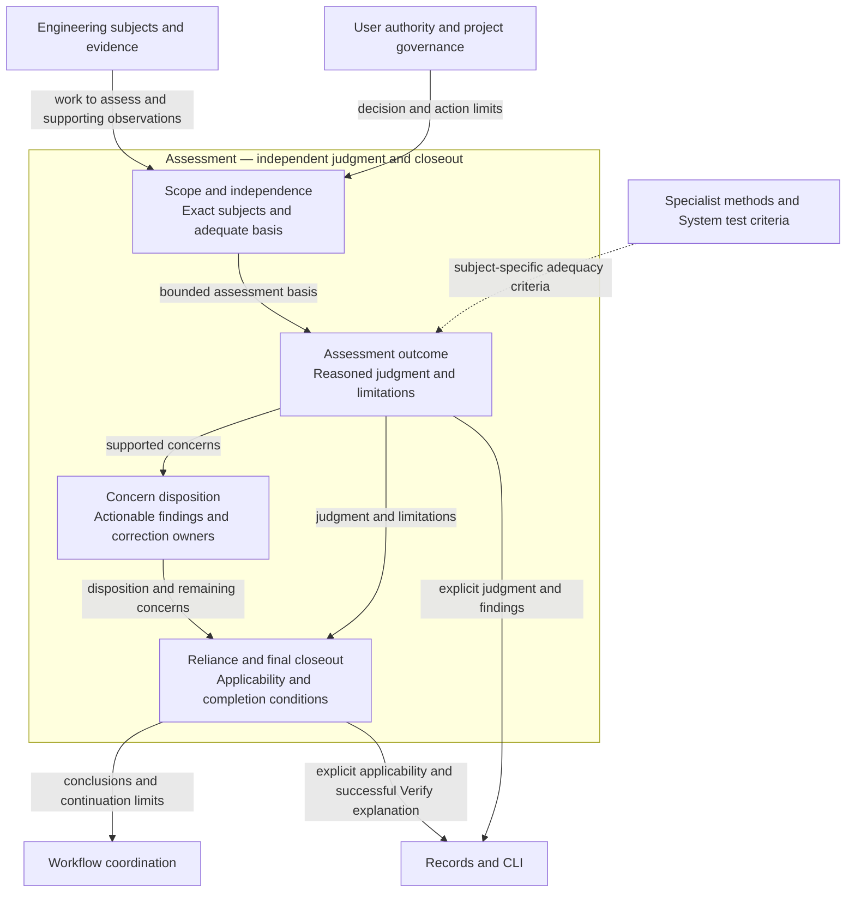
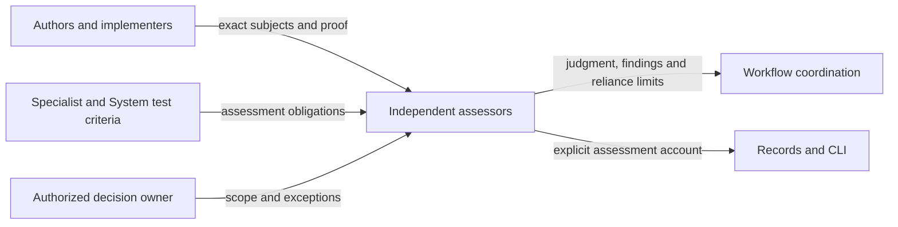
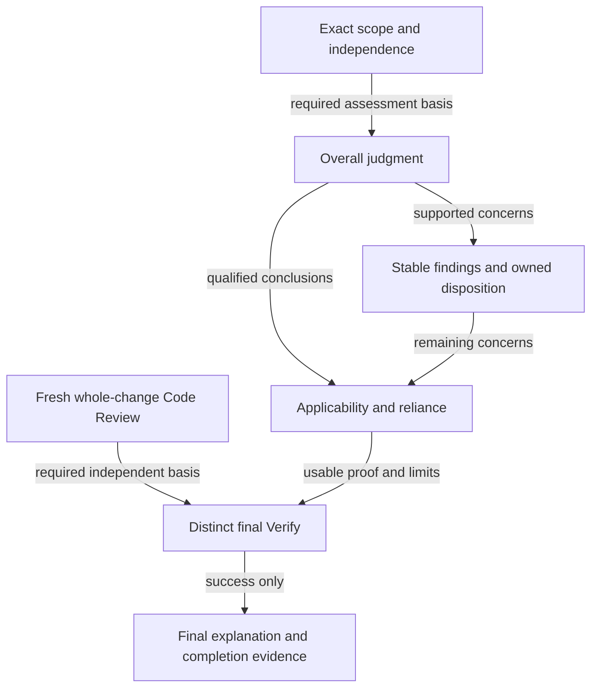
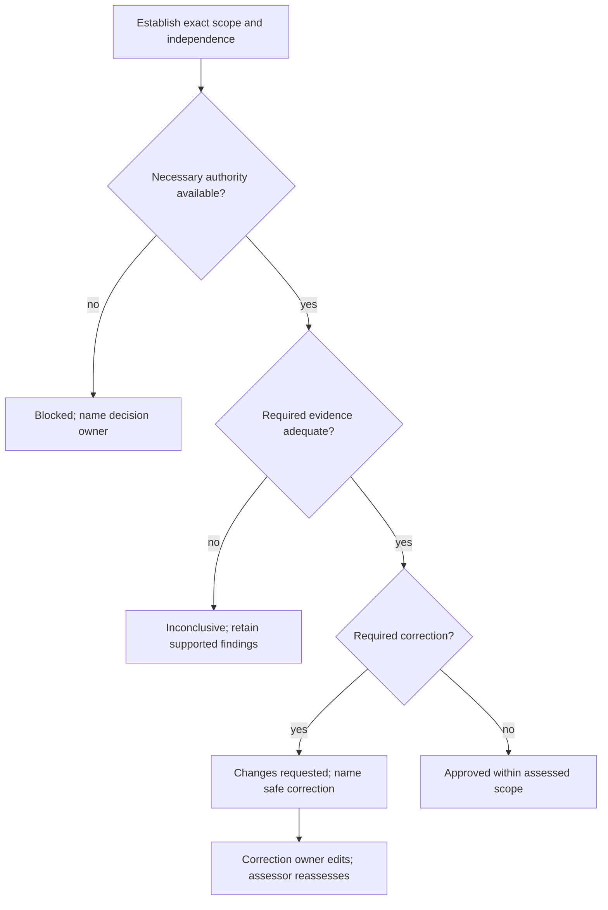

# Skill Assessment — Review and Closeout

Model validation contract: model-document-v1

Parent model: [Skill — Assessment](skill.md#assessment).

This child owns published assessment, independence and closeout behavior. Engineering Development selects and runs the required assessments for this repository; it references these rules rather than redefining them.

Owning change: [repository cleanup](../../changes/2026-09-13-current-design-repository-cleanup/change.json).

Prior refinement: [independent parallel tests](../../changes/2026-09-13-independent-parallel-tests/change.json).

Original composition adoption: [three-model reconciliation](../../changes/2026-09-12-unified-validation-model/change.json).

Current assessment recording uses v3. [Retirement provenance](#v2-retirement-and-assessment-reliance) preserves historical reliance boundaries without a second operational profile.

This marker versions Markdown model validation only; it does not select a stored format. The current runtime contract is `rigorloop-records-v3`, as defined by [Record Format](../cli/records.md#record-model). Retired-format descriptions below explain historical decisions and records; they do not authorize a v1 reader, writer or continuation path.

For this repository’s [complete source retirement](../../changes/2026-09-14-retire-specs-and-stale-tests/source-disposition.md), current responsibilities are self-contained in the owning Designs. Original source-transfer inventories remain recoverable through [Historical provenance](#historical-provenance); their instructions to retain or amend legacy specs, architecture, activation state or retired engines are historical and superseded by this complete retirement. Source-qualified IDs and original judgments keep their original meaning; provenance is not a runtime input or current approval. Customer source documents retain their project-owned authority and historical meaning. Current RigorLoop output and format support follow Design; source interpretation does not authorize retired feature/proof operations or automatic conversion.

## Introduction and Goals

Review and Closeout owns the shared policy for judging engineering work and justifying final completion within the Workflow domain. It defines assessment scope, independence, judgment, applicability, concern disposition, reassessment, and closeout obligations. Specialist skills apply this policy using methods appropriate to their subjects. Workflow coordinates the responsible activities; it does not define these obligations again.

The direction comes from [Unify Review and Closeout Policy Ownership](../../proposals/2026-09-07-unify-review-closeout-policy.md) and its [independent Proposal Review](../../changes/2026-09-07-unify-review-closeout-policy/reviews/proposal-review.json). [Repository governance](../../../CONSTITUTION.md) adopts this policy for explicitly selected repository work. Installation does not adopt it for a customer project. The original extraction and adoption basis is retained below as historical context; current activity, assessments and implementation evidence belong to the owning change records.

## Architecture Constraints

There is no new service, public skill, lifecycle gate, record type, schema version, approval principal, or history ledger. Proposal Review, Design Review, Delivery Review, Code Review, and Verify remain specialized. No command decides whether their conclusions are justified. External execution, release, PR creation, publication, and destructive-action authority remain outside this model.

The [Design model](authoring/design.md#model-document-and-structural-contract) owns the one-file model convention and model validation; Workflow consumes it for coordination. This document combines behavioral requirements, architecture, and decisions without separate specification or ADR siblings. Its identity is `review-closeout`; placement follows the existing model-directory convention, not a new runtime component boundary.

## Architecture Overview

Assessment owns the shared policy inside its boundary. [Assessment scopes and consequences](#assessment-scopes-and-consequences) and the [Building Block View](#building-block-view) define judgment and closeout rules; the [Runtime View](#runtime-view) explains their application. [Context and Scope](#context-and-scope) retains specialist method and human authority boundaries, while [System](../system.md#living-test-design-composition) owns shared proof criteria and [Validation](../engineering/validation.md) owns execution. [Workflow](workflow.md) coordinates receiving activities; [Records](../cli/records.md) and [CLI](../cli/cli.md) own representation and persistence. Findings retain stable IDs and current actionable accounts; recording does not establish approval or reliance.

### Supporting-view decisions

| View | Necessity and reason | Owning detail |
| --- | --- | --- |
| Context | Necessary: Authors, reviewers, proof producers and routing have separate authority. | [Context view](#context-view) |
| Building Block | Necessary: Assessment scope, findings, reliance and final closeout cannot be collapsed into a saved status. | [Building Block view](#building-block-diagram) |
| Runtime | Necessary: Missing authority, missing evidence and correctable defects have different consequences; Verify cannot approve its own fix. | [Runtime view](#runtime-diagram) |
| Deployment | No separate deployment view: this model owns assessment policy, not execution placement. Skill packages the guidance and CLI persists explicit assessments under their separate contracts. | Existing deployment/context prose and the named external owner. |

## Context and Scope

| Responsibility | Owner | Boundary |
| --- | --- | --- |
| Shared assessment and closeout policy | Review and Closeout | Defines obligations and limits, not storage or activity selection |
| Stage selection, author/correction allocation and allowed continuation | Workflow and route | Apply assessment results without manufacturing them |
| Model-document convention and structural mapping | Design | Owns the document contract; Workflow coordinates its use |
| Subject-specific assessment methods | Specialized review skills | Preserve proposal sufficiency, design coherence, delivery proof allocation, and actual implementation inspection |
| Final evidence/coherence assessment and explanation | Verify | Applies closeout conditions; cannot replace Code Review or approve its own correction |
| Engineering subjects and corrections | Their authoring or implementation activity | Supplies changed work and proof, not independent approval |
| Stored representation and preservation | Record Format | Defines fields, supported versions, exact subjects, and concern origin storage |
| Inspection, construction, validation, persistence, conflict and recovery mechanics | CLI | Supplies observations and safe writes, not semantic judgments or permission |
| Direction, scope exceptions, and external actions | Human or other explicitly authorized owner | Neither silence nor a saved status supplies authorization |

Standalone advisory assessments retain their explicit scope. They do not require the entire governed lifecycle or imply its completion. The final whole-change requirement applies whenever successful final Verify is claimed for a governed change, including changes whose delivered engineering work is documentation or policy rather than executable code.

## Solution Strategy

Separate four conclusions: a substantive judgment about identified subjects; whether that judgment was durably recorded; whether its basis remains applicable; and whether Workflow may continue under existing authority. None implies the others automatically. Assessment scope must be understandable without reconstructing conversation or Git history.

Use one requirement set here, explicit consumer references, and small stage-specific operational instructions. Published skills must carry usable guidance in their installed package; a link into this repository's Design directory is not an execution dependency for customer projects. Shared packaged guidance is a maintained application of these requirements, not another normative policy owner.

## Architectural supporting views

These views elaborate the overview at the owning model boundary. Existing detailed contracts, scenario tables and external owners retain their authority.

### Context View

Authors, reviewers, proof producers and routing have separate authority. Detailed requirements and scenarios in this model remain authoritative.

### Building Block diagram

Assessment scope, findings, reliance and final closeout cannot be collapsed into a saved status. Detailed requirements and scenarios in this model remain authoritative.

### Runtime diagram

Missing authority, missing evidence and correctable defects have different consequences; Verify cannot approve its own fix. Detailed requirements and scenarios in this model remain authoritative.

## Requirements

| ID | Required behavior |
| --- | --- |
| RC-SR-01 | Every assessment MUST identify its kind, scope, exact engineering subjects, relevant governing basis, and claim limits. Proposal, Design, Delivery, milestone Code Review, final whole-change Code Review, final Verify, and isolated advisory scopes MUST remain distinguishable. A scoped judgment MUST NOT be presented as approval of a larger package or completion of the lifecycle. |
| RC-SR-02 | Approval requiring independent review MUST come from a reviewer who did not author the reviewed contribution. The review MUST identify actual contributors and concrete separation evidence. A role label, a new turn of the author, passing validation, or the author's self-assessment MUST NOT establish independence. Missing separation evidence blocks reliance on approval while preserving any independently supported findings. |
| RC-SR-03 | A reviewer MUST assess the identified subject using the specialist method and record one justified judgment with its basis and limitations. The reviewer MUST apply the ordered combined-condition rule below to the required assessment scope: necessary authority or owner-decision impediments take precedence, then materially insufficient assessment basis, then required actionable corrections, then approval. Supported material findings MUST remain visible under every judgment. Optional improvement notes MUST NOT cause non-approval unless their evidence establishes an unmet governing requirement or decision criterion. These are reviewer decisions, not CLI selection or recording prerequisites. |
| RC-SR-04 | A required formal judgment MUST be durably recorded against its actual subjects before downstream reliance. Recording success, judgment, applicability, and continuation MUST remain separate conclusions. Failed or unsafe recording blocks reliance on an unrecorded approval; it MUST NOT erase the assessment or justify inventing a successful save. Record shapes and transport remain contract-selected. |
| RC-SR-05 | Before relying on an assessment or proof, the receiving actor MUST check its required current basis, scope, independence where required, applicable concerns, and relevant new evidence. Unknown, missing, stale, contradictory, or omitted required basis blocks reliance and requires explicit inspection, reassessment, or an owned blocker. Matching identities alone MUST NOT establish applicability; a retained old judgment MUST NOT silently acquire a revised subject. |
| RC-SR-06 | An author changing engineering work MUST identify affected assessments and proof, declare impact and applicability restrictions, and identify outstanding correction needs before downstream reliance. Revised engineering subjects require the appropriate independent reassessment. Any responsible actor may conservatively restrict applicability with an impact rationale. The responsible assessor decides renewed applicability; an author or route actor MUST NOT restore another actor's approval. Ambiguous or concurrent impact requires an owned blocker rather than assumption. |
| RC-SR-07 | A recording-only change MUST NOT automatically invalidate an engineering assessment solely because storage bytes or the record revision changed. The receiving assessor MUST classify the actual content and effect: altered engineering subjects, changed claim scope, new contradictory evidence, or material concerns require assessment under RC-SR-05/06. Original reviewed identities MUST remain truthful; bookkeeping classification MUST NOT retarget an old judgment or waive CLI conflict checks. |
| RC-SR-08 | A material finding or blocker MUST retain a stable identity, reporter, affected subjects/location, observed evidence, required outcome, correction owner or explicit owner decision, and enough rationale to act safely. Review findings MUST retain a complete editable current account under their immutable IDs; blockers MUST additionally retain their original basis and any cited supporting judgment under Record Format. Later approval MUST NOT silently erase, overwrite, or dispose an outstanding concern. |
| RC-SR-09 | The reporter owns concern-disposition assessment; the correction owner performs the repair. A disposition MUST state its justification, relevant proof, and any authorized residual risk or follow-up. Deferral MUST identify an authorized decision, accountable owner, tracked follow-up, and why it does not defeat a required acceptance condition; it MUST NOT waive mandatory final Code Review or other non-waivable obligations. A reviewer MUST NOT close another actor's blocker merely by approving corrected work. |
| RC-SR-10 | Corrections MUST return to the activity that owns the faulty subject or decision. A reviewer MUST record its finding before review-driven edits and MUST NOT edit and approve the same contribution. Returning corrected work means review-ready, not approved. Targeted reassessment may resolve a bounded finding, but affected package judgments and the final whole-change assessment MUST still be adequate and current before reliance. Workflow owns selection and recording of the correction destination. |
| RC-SR-11 | Before successful final Verify, every governed change MUST receive a fresh independent final whole-change Code Review after all in-scope implementation milestones and their required corrections are complete. This assessment MUST inspect the complete delivered engineering change and cross-milestone interactions against current approved design, delivery allocation, and relevant proof. Earlier milestone judgments may inform but MUST NOT substitute for this assessment. Its depth may scale with the change; its occurrence and whole-change scope MUST NOT be waived by size, a single milestone, or absence of executable code. |
| RC-SR-12 | A delivery plan MUST name final whole-change Code Review as a closeout checkpoint, dependent on completion of all in-scope implementation milestones and required corrections, and preceding successful final Verify. Delivery Review MUST identify omission or substitution by milestone review as a plan defect. Workflow MUST retain this dependency when coordinating closeout; a clean final milestone alone MUST NOT route directly to a completion claim. |
| RC-SR-13 | Final Verify MUST independently assess evidence/coherence in its distinct role and establish that the required proposal, design, delivery, implementation, review, correction, and proof obligations are satisfied on their current applicable basis. It MUST confirm RC-SR-11 and justified concern dispositions, assess affected authoritative and generated surfaces, and produce the final explanation and completion evidence only on success. It MUST NOT substitute its inspection for missing Code Review, use an unapproved self-authored correction as proof, or claim release/PR/external-action authority. |
| RC-SR-14 | A defect discovered by any responsible activity, including Verify after recorded completion, MUST remain recordable with an owned correction path. Failed Verify MUST record its failed evidence and blocker through the selected contract, not a success report. Following correction and appropriate independent reassessment, Verify MUST assess and disposition its own blocker before renewed successful closeout. An earlier terminal status MUST NOT justify reliance on contradicted completion or prohibit a structurally valid correction save. |
| RC-SR-15 | Required evidence MUST be sufficient and applicable to the current claim; new assessment does not by itself require every validation command to rerun. The assessor MUST identify which results remain usable and why: reuse requires an existing pass, known proved surfaces, current governing authority and subject/environment identity, affirmative unaffected evidence for those surfaces, and no freshness override. It MUST require new proof where subject, environment, procedure, dependency, or evidence changes defeat that basis. An explicitly required fresh execution or current-state check overrides ordinary reuse reasoning; a cache hit or execution label alone MUST NOT count as that proof. For a record containing multiple checks, an actor MUST restrict record-level applicability when a changed check defeats reliance and identify the affected scope; receiving assessors MUST inspect the individual results and subjects rather than infer universal success from record-level current. Test success MUST NOT substitute for independent engineering review, and a fresh review MUST NOT silently refresh stale test evidence. |
| RC-SR-16 | Adoption MUST map every affected shared policy clause to one retained or replacement owner, retain stable reference identities or explicit replacement mappings, and preserve historical records under their exact contracts. Old approvals MUST NOT be retargeted or reinterpreted as approval of this design. Conflicting historical/new authority blocks reliance until an authorized owner resolves it; no automatic migration or historical supersession is introduced. |
| RC-SR-17 | Consumer alignment MUST preserve specialist reasoning, sufficient evidence, truthful scope/consequence, and standalone invocation limits while removing duplicate normative ownership. Packaged guidance MUST be usable without this internal Design repository, load only the relevant assessment method and triggered resources, and have traceability to these requirements. Templates and examples MUST illustrate the same contract rather than introduce exceptions. No token-saving claim is justified without measurement. |
| RC-SR-18 | Assessment and closeout decisions MUST remain understandable from current authoritative project artifacts without Git history, PR access, network access, or prior chat. Missing runtime independence provenance, inaccessible required subjects, interrupted recording, or incompatible installed guidance MUST result in a bounded stop with a responsible next action. Local/runtime permissions and separately authorized external actions MUST remain independent of any recorded review or completion. |
| RC-SR-19 | The responsible assessor MUST judge whether an explanation edit preserves the same assessment or changes its supported reliance. A successful narrow edit MUST NOT restore applicability, establish independent review, rerun evidence or authorize continuation. Materially changed scope, newly missing basis or contradictory evidence requires explicit applicability/correction decisions; changed judgment, exact subjects, actors or evidence basis requires complete reassessment. |
| RC-SR-20 | A Verify assessment claiming Git/PR branch readiness MUST retain the complete normalized verification basis specified below as independently addressable values. Non-Git closeout MUST NOT require those values. The responsible verifier, not a field name, object presence or CLI parser, establishes their sufficiency and freshness before reliance. |
| RC-SR-21 | Historical v2 assessments MUST retain their original meaning as provenance without becoming operational current records. New assessment or correction MUST use explicit v3 reasoning and current required review; it MUST NOT inherit old approval, convert bodies or erase unresolved obligations. |
| RC-SR-22 | Verify MUST preserve its independent requested-outcome, execution-mode and item-level evidence contract below; scoped checks MUST NOT imply branch readiness or governed final closeout. |
| RC-SR-23 | PR reliance on a later evidence-only handoff revision MUST follow the ancestry, cumulative-content and current-attribution contract below. A suffix classification MUST NOT create or renew Verify readiness, and invalidating or ambiguous changes MUST block dependent external handoff. |

## Structured explanation and reliance amendment

The current explanation policy follows the [structured-assessment direction](../../proposals/2026-09-10-structured-assessment-explanations.md) and its [owning change](../../changes/2026-09-10-structured-assessment-explanations/change.json). Record Format owns fields and CLI owns mechanics; this section owns reliance under RC-SR-19/20. Historical judgments retain their exact subjects and do not approve later edits or publication.

### Meaning of explanation edits

RC-SR-19 specializes RC-SR-01/04–07/10/13–15 without creating another review gate. Explanation fields remain assessor-authored accounts, not duplicate status, findings, evidence transcripts or rosters. Summary explains the conclusion, scope bounds reliance, rationale connects facts to that conclusion, limitations discloses limits, and Verify changes explains the delivered result. Existing structured records retain those facts. Field-level approval states are not introduced.

| Edit or discovery | Responsible assessment and consequence |
| --- | --- |
| Typo or clearer wording with unchanged meaning and basis | Responsible assessor confirms the same assessment remains represented. No automatic test rerun or applicability change follows solely from editing bytes. |
| New limitation or narrower reliance scope | Reassess the affected claim before reuse. If its applicability changes, explicitly restrict the record and record the required correction; do not leave a misleading success claim usable. |
| Different judgment, exact subject, assessor, references or verification basis | Supply a complete reassessment against that basis; a narrow update cannot partially retarget the earlier decision. Preserve complete findings during assessment replacement; explicit v3 finding correction follows RF-SR-13. |
| New defect or failed required evidence after successful Verify | Apply RC-SR-14: record failed evidence and the verifier-owned blocker, restrict contradicted reliance and route correction. Do not substitute a limitations-only edit for the defect record. |
| Another actor proposes an editorial correction | The actor may record an authorized correction or conservatively restrict applicability, but cannot claim the responsible assessor has renewed it. The actual responsible assessor decides reliance. |

Use an existing transaction when explanation and applicability/correction decisions must become visible together. The CLI checks structure and concurrency only; it cannot infer from prose whether an edit is harmless. Structurally valid but incomplete or contradictory claims remain recordable so correction never depends on first inventing approval. Record-level applicability remains explicit; no reason or limitation has a separate approval lifecycle. Projections omitting required basis cannot support a complete assessment until the assessor reads the missing parts.

### V3 findings as current problem accounts

For v3 Review findings, RF-SR-13 represents RC-SR-08 through a stable ID and a complete, editable current account. The responsible actor may correct attribution, subjects, evidence, required outcome, ownership and disposition explicitly. Correcting attribution must describe the actual responsible reporter; it does not manufacture their judgment or independent review. Another actor's later approval still cannot silently remove or close a finding. Existing correction ownership and reporter assessment of disposition remain; the CLI does not infer authority from field contents.

There is no immutable origin, supporting-judgment snapshot, per-finding history or field approval requirement. Explain a mistaken report's withdrawal in its resolved disposition. Meaning-changing corrections require assessment of affected reliance under RC-SR-05–07; they do not automatically rerun tests or renew applicability. Change-level blockers retain immutable origin; historical records remain unchanged.

### Conditional external-handoff basis

RC-SR-20 retains the existing Verify method's seven normalized values: repository_identity, remote_identity, base_branch, base_revision, merge_base_revision, head_branch and verified_subject_revision. They identify the assessed repository/remote and resolved base/head relationship, with immutable revisions rather than commands or unresolved branch names. Git/PR readiness requires all seven unambiguous values bound to the actual evidence target. Repository/remote identity is credential-free. Branch labels are descriptive names; the revision fields bind the assessment. Missing/ambiguous required values block branch-readiness reliance even if a report is structurally valid or records success.

For v3 stored Verify, Record Format RF-SR-11 owns the closed verification_basis object, and CLI exposes it through ordinary full reads or explicit projection. Its values replace the YAML-like basis embedded in prose; they are not another evidence transcript. Existing subjects and evidence still bind exact engineering files and checks. Historical bodies remain unchanged provenance and are not parsed or converted into a current assessment. Portable Verify retains its explicit result representation and claim limits. Non-Git assessment omits the optional object and does not invent a repository/remote or Git result. Object presence alone cannot authenticate freshness, prove readiness or grant external permission.

| Existing source or rule | Exact disposition |
| --- | --- |
| RC-SR-01/04/05/06/07 | Retained; RC-SR-19 supplies the specific explanation-edit interpretation and partial-read reliance rule. |
| RC-SR-08–15 | Retain correction authority, final Code Review, success-only Verify and evidence reuse. Replace only v3 Review finding original-basis retention with RF-SR-13; retain blocker origin and historical record meaning. |
| Verify SKILL.md Outputs: conditional normalized verification_basis and branch-readiness-verification.md final aggregation | RC-SR-20 owns the shared requirement/conditionality; specialist Verify retains resolution and assessment method. V3 uses RF-SR-11; portable representation remains independently bounded above. |
| Review/Verify result assets and successful-explanation guidance | Implementation maps actor reasoning to the named fields, retaining specialist depth and independent authority; display layout is not stored truth. |

Acceptance intent for RC-SR-19: contrast an unchanged-meaning clarification with a newly missing-evidence limitation; neither field name nor successful storage chooses their consequence, and the latter requires explicit restriction/correction before reliance. For RC-SR-20: contrast a complete local non-Git Verify with a Git/PR claim lacking resolved basis; only the latter requires the conditional values. An explanation edit preserves complete findings; a separate v3 finding correction replaces the current account under its existing ID without retaining an original snapshot. These are assessment walkthroughs, not assertions that the new runtime passed tests.

## V2 retirement and assessment reliance

Owning change: [retire-v2-record-format](../../changes/2026-09-11-retire-v2-record-format/change.json). After [Workflow's coordinated disposition](workflow.md#retired-format-dependency-protection), historical v2 Review/Verify records remain evidence of their original judgments, scopes, subjects, limitations and procedures. They are not writable current assessment records. Current policy authority can retain that provenance without a CLI v2 reader; retirement does not revoke an adopted governing model or transfer its authority to the retirement manifest.

RC-SR-05/06/16 continue to govern reliance. New work or a discovered defect requiring an assessment or correction uses a v3 initiative with explicit historical subject references and fresh actor-authored reasoning. Identify any carried obligations and their disposition; do not promote an archived approval to a current Review, copy a v2 Verify success into v3, or reinterpret body prose as supplied named fields. Unresolved dependence on a v2 operation must be settled before removal under Workflow, not disguised as historical completion. Historical files and approval identities remain unchanged.

The current policy above contains no continuing-v2 narrative basis profile or operational v2 concern handling. V3's conditional seven-field verification_basis, success-only Verify, editable current Review findings with immutable IDs, blocker origins, independent assessment and explicit applicability remain unchanged. Portable document-only assessment procedures are independent of stored-v2 support and are not retired here.

RC-DEC-06 preserves historical assessment meaning while requiring current supported recording for new reliance and correction. A permanent reader would retain an unnecessary compatibility obligation; blindly invalidating every historical adoption would confuse representation retirement with governing authority. The observable outcome under RC-SR-05/06/16 is a reviewer distinguishing provenance from current assessment without either old-byte mutation or approval inheritance.

## Building Block View

### Overall judgment when conditions overlap

This ordered rule is the normative elaboration of RC-SR-03. Apply the first matching row to the declared required assessment scope. An unrelated decision, optional reading, or possible improvement outside that scope does not trigger a non-approval. The reviewer explains which condition determined the result and retains all supported findings with their individual limitations.

| Order | Combined condition | Overall judgment |
| --- | --- | --- |
| 1 | Necessary authority or an owner decision is missing and prevents an adequately scoped judgment or correction, whether or not concrete actionable defects also exist | `blocked`; identify the necessary decision and owner, and retain the actionable findings |
| 2 | No row-1 impediment exists, but missing or unreliable required evidence leaves a material part of the declared assessment unassessable | `inconclusive`; identify the missing basis and retain bounded supported findings without presenting partial inspection as the complete assessment |
| 3 | Neither earlier condition applies, and at least one evidenced, required correction has a sufficiently defined outcome and safe resolution path | `changes-requested`; identify the required corrections and their owners |
| 4 | The required scope is adequately assessed, its governing criteria are satisfied, and no required correction or unresolved necessary decision remains | `approved`; optional improvement notes may accompany the judgment |

Material incompleteness means that unavailable or unreliable evidence prevents assessment of a required criterion or subject, not that the reviewer has failed to read every potentially related file. The declared scope must not be narrowed after discovering an evidence gap merely to obtain a more favorable judgment. A separately requested bounded advisory assessment keeps its own scope under RC-SR-01. Missing authority is a row-1 impediment; missing technical evidence without such a decision requirement is row 2.

For a partially inspectable package, row 2 takes precedence over row 3 even when the inspectable portion contains a concrete defect. This deliberately distinguishes confidence in a bounded finding from coverage of the required overall assessment. The finding remains actionable to the extent its evidence and correction authority support it; an overall `inconclusive` judgment neither discards it nor authorizes work outside the existing scope. Optional improvements are explicitly labeled advisory and do not become required corrections merely because a reviewer prefers them.

The rule introduces no judgment values, severity scoring, new gate, schema field, or CLI judgment selector. Structurally valid judgments and findings remain recordable independently of whether the reviewer can justify progression. Historical records retain the meaning of their selected judgment rules under RC-SR-16; the shared rule must not silently reinterpret their earlier outcomes or reactivate their retired runtime procedures.

### Proposal Review criteria

Under RC-SR-01/03/04, Proposal Review judges a material challenge, goals that address it, bounded scope, a sound principle, concrete justified direction, proportionate feasibility, disclosed material impacts and an explicit requested decision. Detailed Design and Delivery choices remain downstream; missing downstream detail or an unnecessary impact section is not a finding. Vague direction or prematurely binding downstream decisions requires a material finding.

Treat routine vision alignment as a Proposal Review judgment, not required proposal content. Record exactly one outcome: `aligned`, `material-conflict`, `vision-revision-requested`, or `no-vision-bootstrap`. A material vision issue must be disclosed in the proposal and resolved by the appropriate decision owner before approval. Approval establishes the proposal-level direction and sufficient feasibility for authorized Design; it does not approve Design, delivery allocation, implementation or publication. Direct review remains independent and isolated unless continuation is separately authorized.

### Proposal Review procedure

Under RC-SR-01/03/04/10/13, classify recording and automation independently before side effects. Recording modes are exactly `none`, `advisory-durable` and `formal-lifecycle`; automation modes are `manual` and `workflow-managed-automated`. Only `none/manual`, `advisory-durable/manual`, `formal-lifecycle/manual` and `formal-lifecycle/workflow-managed-automated` are valid. Missing, unknown or contradictory classifications stop. Durable context applies to formal review, an explicit durable request, a material finding, or a `changes-requested`, `blocked` or `inconclusive` outcome. A late trigger loads recording procedure before a dependent write or recording claim. Resource loading grants no settlement, automation, correction or continuation authority.

The common proposal-review body remains sufficient for advisory judgment, evidence selection, materiality, severity, status, readiness, isolation, stops and claims under Skill's [Conditional resources](skill.md#conditional-resources). `proposal-review-recording-and-settlement.md` applies recording; `conditional-proposal-gates.md` applies strategic gates. The four assemblies are `PRR0-core`, `PRR0G-context-gated`, `PRR1-recorded` and `PRR1G-recorded-context-gated`, independently adding gates and recording. Core results and material findings use their respective assets. Shared assessment applications retain their own triggers.

Review-owned specialized predicates are exactly `vision_exception_context`, `standing_artifact_context` and `scope_budget_context`. Judge them from bounded evidence, apply all true gates once and resolve late or materially ambiguous applicability before approval. Ordinary vision, intent and scope judgment remains universal. Vision exceptions require the decision owner and rationale; missing required standing authority requires an explicit bootstrap decision; broad scope follows Skill's [work-item treatment and follow-up rules](skill.md#evidence-access-and-proportional-effort). These are reviewer judgments, not deterministic prose inference. Current proposal content governs where applicable detail appears.

Advisory recording cannot settle the proposal, claim formal next-stage eligibility or write automation state. Formal review needs current same-change, exact-proposal authority and required evidence; it can record its own assessment but cannot advance Workflow. Automation-specific evidence requires the valid automated mode and current authorization; correction needs separate authority. Current records and commands follow [Records](../cli/records.md) and [CLI](../cli/cli.md). Retired recording formats are not supported. A recording location alone grants no lifecycle authority. Unsafe or ambiguous identity, unrelated-root collisions and failed writes leave complete supported findings visible, with blocked recording and no false durable or formal completion claim.

The result always contains its core group. Specialized, durable, formal and automated groups apply respectively when a specialized predicate is true, recording mode is not `none`, mode is `formal-lifecycle`, and automation is `workflow-managed-automated`. Omit inapplicable groups; report unavailable required data as `blocked` or `unknown` with its blocker, never an unfilled placeholder. Assets own labels and structure; Assessment owns judgment and authority. Preserve proof of invalid mode pairs, late recording, composable gates, authority isolation, failed recording, missing resources and conditional output. Current review vocabularies, finding meanings and package integrity retain their existing owners.

### Assessment scopes and consequences

This table applies RC-SR-01/03/10–13. It defines scope and decision limits; stage methods remain in the specialist skills.

| Assessment | Complete subject and central question | Consequence of a justified approval | Correction responsibility |
| --- | --- | --- | --- |
| Proposal Review | Direction, user intent, bounds, feasibility, and vision fit | Direction is sufficient for authorized Design; no design decisions approved | Proposal author or named direction owner |
| Design Review | Exact affected model revisions, living test designs, relevant cross-model relationships and accepted proposal constraints; historical package members remain contract-selected | Coherent design basis for authorized Delivery planning; no plan or implementation approval | Owning model author; multiple owners for a cross-model defect |
| Delivery Review | Exact plan and its verification allocation against approved design, including closeout dependencies | Delivery allocation is adequate for authorized implementation | Plan author for allocation; Design owner for behavioral gaps |
| Milestone Code Review | Exact implementation slice, its allocated obligations, interactions exposed so far, and proof | Only the named milestone scope is judged; remaining implementation and closeout remain separate | Implementation owner, or upstream author for a contract defect |
| Final whole-change Code Review | Complete final delivered engineering change, integrated behavior, cross-milestone effects, current governing basis and proof | Whole-change implementation assessment for final Verify to rely on if still applicable | Faulty implementation or upstream subject owner, then reassessment |
| Final Verify | Entire required artifact-to-implementation-to-proof chain, applicable judgments and dispositions, explanation and completion basis | Successful closeout evidence, under existing Workflow authority; no external permission | Relevant subject owner; Verify retains its own blocker disposition |
| Isolated advisory assessment | Explicit requested target and bounded question, with limitations | Only the stated advisory conclusion; no implied formal settlement or lifecycle execution | Named subject/decision owner; no automatic repair authority |

A final review may use the same independent reviewer as an earlier milestone review if that reviewer did not author the delivered contributions. Fresh means a newly conducted whole-change assessment after the required implementation/correction boundary, not merely a new timestamp, role name, or replayed milestone verdict. The plan identifies a separate closeout checkpoint even for one implementation milestone. Targeted final-review corrections require renewed assessment of the integrated result; they do not permit replacing the final assessment with a finding-only receipt.

Record every formal review, including clean and isolated outcomes, before reliance or review-driven fixes. A clean result needs a justified no-finding conclusion, not a quota of findings or positive notes. If recording fails, retain the supported judgment, report the blocker and recovery action, and do not claim formal completion. Late reconstruction discloses timing, evidence and fidelity limits. Corrections require the applicable independent reassessment; the original judgment never approves work it did not assess. Isolation limits continuation, not recording. Specialist independence and automation limits retain their declared scope.

### Assessment of living test design

Apply Design DES-SR-25/26 and System TEST-SR-21–23 within existing assessments. Design Review checks application of the [explicit selection procedure](../test-design/rules.md#select-requirements-and-proof): all affected supported requirements and section-owned responsibilities are accounted for, each selected group names plausible violations and sufficient independent observations, and risk informs depth without waiving mandatory proof. Check important targets, concrete scenarios, fixture/dependency strategy, accurate current/proposed locations, owned integrated coverage and the reason further equivalent variations are unnecessary. A heading, function list, requirement-ID count or generated table is insufficient; a guidance-only model may use a concrete independent review/walkthrough method. Resolve contradictory support promises, duplicated authority and hidden coverage gaps with their owning author.

Delivery Review checks complete execution and independent-assessment allocation against that lasting intent, within the selected changed-model scope; a referenced group without an observation, execution point or required subject is still a gap. Code Review checks actual assertions, fixture isolation, discovery, consumers and updated realization links, including whether the intended fault could pass the test. Verify assesses the complete chain and required observations, distinguishing designed coverage, realized proof, observed outcomes and independent judgment. Unlisted but justified regression or property tests remain valid; no per-function trace record or mandatory testing layer is introduced. Test consolidation requires identified retained observations for every affected current obligation; faster execution and passing remaining cases cannot by themselves establish preserved protection.

Design/Delivery/Code Review and Verify guidance must expose these checks without adding a review kind or record field. This refines their assessment basis within the existing scope/independence/reliance rules. Source inspection, packaging checks and independent semantic assessment retain distinct claims; no routine agent-compliance test or automatic semantic approval is added.

### Engineering scope and record-only changes

An engineering subject includes delivered code, tests, configuration, documentation, models, skill text, templates, and generated output relevant to the change. A complete-set assessment names the included artifacts and relevant relationships under the existing subject representation. With Git available the diff is useful evidence; without it the explicit current subject set and approved scope must still support a complete assessment. Unidentified change extent blocks a whole-change claim.

Record-only classification is semantic, not a filename allowlist. Saving review rationale, concern dispositions, proof records, or Verify's final explanation changes storage state without necessarily changing delivered engineering work. A policy rule edited inside a Markdown file is engineering work even if nearby content is bookkeeping. Newly recorded failed proof or a missed requirement affects reliance even when the engineering files are unchanged. No broad exemption for `docs/`, review directories, or generated files is permitted by RC-SR-07.

For RC-SR-01/13/20, a branch-scoped approval or readiness claim requires relied-on governing artifacts in the tracked assessed branch state. Local-only material may inform review but cannot establish that authority. The reviewed implementation may be staged or uncommitted; advisory and non-Git assessments do not acquire a Git requirement. Missing authority limits the claim without suppressing independently supported findings; RC-SR-03/04 determines the judgment.

For RC-SR-05/13/15, a named required edge case or failure path needs direct proof, such as a targeted test, validation result or authorized manual observation. Code-shape inference alone is insufficient. An actionable gap becomes a finding; insufficient evidence limits the judgment, and unresolved required proof blocks successful closeout. Successful Verify explains what changed, why, how the Design is realized, the actual proof and remaining limits or risks. It does not authorize a PR or publication.

### Representation and CLI boundary

The existing [Record Format](../cli/records.md#explicit-record-schema) represents review target, actual subjects, reviewer, contributors, independence basis, judgment, narrative, findings, and record-level applicability. Milestone and final assessments both remain target `code`; their existing record identity, subjects, and narrative make scope and consequence explicit. This design does not add a stored scope discriminator or assessment type. Existing Verify, evidence, decisions, and blocker structures carry the remaining conclusions.

The [CLI](../cli/cli.md) already separates subject inspection, targeted review/evidence/blocker recording, explicit applicability, activity updates, conflict detection, and recovery. No command or validation-readiness change is needed for this policy extraction. [Record Format RF-SR-03/06](../cli/records.md#requirements) requires blocker-origin and finding-ID preservation under v3 and retires historical runtime acceptance. Earlier v1 records remain archival bytes with their original, weaker provenance; this policy neither fabricates missing origin nor requires a compatibility reader. Mechanically valid but unjustified conclusions remain recordable and must not support downstream reliance.

## Runtime View

### Final closeout and correction

After the last implementation milestone and its required corrections, Workflow selects the planned final Code Review checkpoint. The independent reviewer assesses the integrated subject and records its own judgment. If the result requires correction, Workflow returns it to the relevant owner and the reviewer reassesses the resulting whole change. Only a justified, applicable final judgment supplies the review input to final Verify.

Triggered CI maintenance retains its existing owner and trigger. If it changes delivered engineering work after final review, RC-SR-06/11 requires renewed final assessment of the changed result before successful Verify. No placement of CI maintenance in a checklist exempts its changes from review.

Verify evaluates the current obligation chain under RC-SR-13/15. Failure records actual failed proof and a Verify-owned blocker. The correction owner supplies work; the relevant reviewer supplies reassessment; Verify assesses its own required outcome and disposition. Recording those results does not itself require an endless cycle of re-reviewing storage-only changes. Material new information still requires consideration under RC-SR-05/07. Successful Verify records the final explanation and completion basis; Workflow's activity decision remains separately explicit even when saved in the same batch.

### Combined-condition examples

These examples illustrate RC-SR-01/03/04; the ordered rule above owns the outcomes.

| Conditions within the required scope | Judgment and retained information |
| --- | --- |
| F-1 proves duplicate execution on retry; F-2 identifies an undecided compatibility policy necessary to choose the correction | `blocked`; retain F-1 and F-2 and name the compatibility decision owner |
| A required package member is unavailable, while the inspected member proves a safely correctable retry defect; no authority decision is missing | `inconclusive`; retain the retry finding and identify the unassessed member. The concrete finding does not establish complete package coverage |
| The required package is assessable and contains a retry defect with a defined safe correction; an unrelated future enhancement decision remains open | `changes-requested`; require the defect correction, and keep the out-of-scope enhancement separate |
| Required evidence is missing and no material finding is supported | `inconclusive`; name the missing basis without inventing a defect |
| Required criteria are satisfied, with only an optional naming or readability improvement suggested | `approved`; label the suggestion advisory rather than an unresolved required correction |

### Applicability examples

These are illustrations of RC-SR-05–07/10/11/14/15, not additional requirements or stored record examples.

| Event | Assessment consequence | Separately required action |
| --- | --- | --- |
| Reviewer saves the final judgment, changing only its record and registry bookkeeping | Engineering subject remains unchanged; approval may retain applicability | Check actual scope, independence and recording result before reliance |
| New failed evidence is recorded against unchanged code | Earlier judgment remains truthful but cannot justify ignoring contradictory proof | Assess the failure and own its correction/disposition |
| A documentation-only implementation changes a published skill's policy | Delivered engineering subject changed | Independent assessment of the changed policy, including final whole-change review |
| A final-review finding is fixed after the initial final assessment | Initial assessment is not approval of the corrected result | Assess correction and integrated final result; preserve other applicable proof with rationale |
| Verify writes a successful explanation with no engineering or evidentiary change | No automatic engineering invalidation | Preserve exact evidence identity and truthful completion scope |
| A concurrent model edit changes the basis while a reviewer records | An old assessment cannot be replayed as current | Reinspect affected basis and handle the CLI conflict independently |

## Deployment View

This model is a repository design surface. Runtime delivery remains the supported skill and adapter packages. Implementation must align canonical sources and their conditional references/assets, then use the existing deterministic packaging and validation process. Installed customers need their own project authority plus packaged operational guidance, not this source repository or a new skill named `review-closeout`.

## Crosscutting Concepts

### Reading and operational guidance

The reviewer first establishes the invoked assessment, governing contract, subject membership, and relevant prior concerns. It reads the complete subject when completeness affects the decision, expands omitted context when necessary, and loads only the relevant specialist method and triggered resources. Shared guidance may provide the common assessment/recording checklist; it must not require every specialist to load every other specialist's procedure. Actor-owned applicability cannot be replaced by a structural checker, prompt transcript score, or token budget.

The records need enough rationale for a later actor to understand a judgment and act on a concern. They do not need duplicated engineering documents, a routine narrative history, committed operation payloads, or a new authentication scheme. Structural validators test shapes, references and explicit vocabulary. Independent review judges sufficient basis, policy coherence, evidence adequacy, and legitimate reliance.

### Boundary scan and acceptance scenarios

These rows follow the [Design-owned model validation mapping](authoring/design.md#model-document-and-structural-contract). All eight dimensions apply. Delivery allocates concrete checks and evidence; these are required outcomes, not proof that implementation exists.

| Dimension | Requirement basis | Distinct outcome to demonstrate |
| --- | --- | --- |
| Input domain | RC-SR-01, RC-SR-03, RC-SR-04, RC-SR-08, RC-SR-19, RC-SR-20, RC-SR-22 | Overlapping necessary decisions, material evidence gaps and actionable defects follow the ordered overall-judgment rule; bounded findings survive blocked/inconclusive outcomes, while optional notes alone do not prevent approval Partial explanation reads do not establish full assessment context; absent conditional basis prevents Git/PR readiness reliance only when required. A passed scoped check cannot claim branch readiness or governed final closeout. |
| State/lifecycle | RC-SR-10, RC-SR-11, RC-SR-12, RC-SR-13, RC-SR-14, RC-SR-19 | A single or multiple completed milestone set cannot bypass final whole-change review; a defect after completion reopens owned correction without a false success report Contrast editorial clarification with newly missing evidence: the assessor explicitly decides applicability and correction. |
| Identity/authority | RC-SR-02, RC-SR-05, RC-SR-09, RC-SR-18, RC-SR-19 | Author role changes do not establish independence; reviewer approval does not close Verify's blocker or authorize external actions Neither an explanation field nor successful save establishes independent reassessment. |
| Composition/path | RC-SR-01, RC-SR-10, RC-SR-11, RC-SR-12, RC-SR-17, RC-SR-20 | All specialist paths and plan/route/Verify consumers agree on whole-change closeout; installed selective guidance works without internal model files; advisory scope does not acquire a full lifecycle A local non-Git Verify needs no Git basis; a branch-readiness claim retains all seven independently addressable resolved values. |
| Temporal/retry | RC-SR-05, RC-SR-06, RC-SR-07, RC-SR-11, RC-SR-15, RC-SR-23 | A post-review engineering edit requires reassessment; a bookkeeping-only save does not automatically invalidate approval; unchanged code with new failed proof cannot retain unjustified reliance Multiple attributable evidence commits may preserve readiness; a mixed product suffix or non-ancestor handoff blocks. |
| Failure/recovery | RC-SR-04, RC-SR-08, RC-SR-09, RC-SR-14, RC-SR-18 | Failed recording or recovery-required state blocks reliance without destroying supported findings; Verify's concern survives a later reviewer approval until its owner assesses disposition |
| Compatibility/migration | RC-SR-03, RC-SR-16, RC-SR-17, RC-SR-21 | Historical IDs, judgments, subjects and procedures remain provenance. After v2 retirement, current correction uses explicit v3 assessment without approval inheritance, body conversion or loss of unresolved obligations. Governing authority does not disappear merely because its adoption evidence is archival. |
| External/environment | RC-SR-02, RC-SR-15, RC-SR-17, RC-SR-18 | Review and completion basis is understandable without Git/PR/network history; missing required provenance or changed proof environment triggers a bounded stop or new evidence rather than guessed validity |

Material combined hazards include overlapping decision impediments, incomplete assessment basis and actionable defects (RC-SR-03/04); final-review correction plus a changed integrated subject (RC-SR-06/10/11); record-only revision plus newly contradictory proof (RC-SR-05/07/15); concurrent model changes plus historical approval (RC-SR-05/06/16); Verify-owned blocker plus a later clean reviewer judgment (RC-SR-08/09/14); and a single-milestone plan plus omitted closeout checkpoint (RC-SR-11/12). These require composed proof, not only isolated happy-path checks. No Cartesian scenario inventory is required.

### Test design

Assessment protects justified reliance, independent judgments and honest closeout. Its methods are semantic: a valid record or matching sentence cannot decide whether a real contribution was independently assessed. Apply the shared selection procedure to the complete RC-SR requirement population and specialist sections. Each proposed walkthrough uses a concrete subject/evidence packet, actual selected specialist guidance, a compliant candidate and a candidate with the named fault. An independent assessor records what was inspected, the expected judgment/action, the actual reasoning or output, its distinction from the counterexample and remaining limits. Authoring these procedures is not executing them or proving universal agent compliance.

| Group and requirement basis | Scenario, plausible defect and independent observation | Fixture and method | Realization and limits |
| --- | --- | --- | --- |
| Scope, separation and judgment precedence; RC-SR-01, RC-SR-02, RC-SR-03, RC-SR-04 | A reviewer who authored the contribution cannot establish independent approval by changing role labels. With a separate reviewer, vary necessary authority absent, material evidence missing, an actionable defect and only an optional suggestion. Expect respectively blocked, inconclusive, changes-requested and eligible approval, retaining supported findings under every outcome. If saving the judgment fails, no durable-approval claim follows. | Exact authorship and subject packet; a decision table varies one fact and combined conditions to demonstrate precedence. The original contract supplies expected judgments. | Proposed independent method review. [Review assets](../../../tests/skill/skill_asset_tests.py) and [authority tests](../../../tests/skill/skill_authority_tests.py) check result shape/words only; [CLI](../cli/cli.md#test-design) owns actual recording behavior. |
| Current reliance and record-only changes; RC-SR-05, RC-SR-06, RC-SR-07, RC-SR-15, RC-SR-19 | Start with applicable review of S0 and passed proof E0. Contrast a typo-only explanation correction, S1 engineering change, newly failed required proof with unchanged S0, and a projection omitting required basis. Only the first can preserve the same meaning without automatic rerun; the others require explicit restriction/inspection/reassessment. An author can restrict another review but cannot restore it. | Fresh response/subject/evidence packets; independently specified affected surfaces, environment and freshness requirements. Add a mandatory fresh-run variation even when S0 is unchanged. | Proposed walkthrough. [V3 mutations](../../../packages/rigorloop/test/record-store-v3-mutations.test.js) test explanation preservation and explicit updates mechanically, not semantic unchanged-meaning or reuse decisions. |
| Actionable concerns and correction authority; RC-SR-08, RC-SR-09, RC-SR-10, RC-SR-14 | A Verify failure after completion records failed evidence and blocker B1, never a success report. A repairer proposes closing B1 and a later reviewer replaces a review that still contains unresolved F1: reject silent disposition/removal. Correcting F1's current account preserves its ID; B1 also preserves its origin. A justified reporter disposition follows proof and independent reassessment; a deferral lacking an authorized owner/follow-up cannot waive acceptance. | One ordered correction packet with separately named reporter, repairer and assessor; concrete failure, required observation and changed subject. Counterexamples remove one required basis or conflate finding/blocker preservation. | Proposed semantic walkthrough with [Workflow correction composition](workflow.md#test-design). Records/CLI interaction tests supply stored preservation only. |
| Final whole-change review and successful Verify; RC-SR-11, RC-SR-12, RC-SR-13 | Given approved milestones M1/M2 but no final whole-change review, Delivery Review flags the missing dependency and Verify cannot close out. After an independent whole-change review, introduce a new correction: require current integrated reassessment. In the valid packet Verify checks actual authoritative/generated surfaces and produces the explanation only after all required observations and dispositions succeed. | Complete synthetic delivered package and plan, distinct milestone/final subjects and concrete local/integrated proof. Include a one-milestone prose change to prevent size-based waiver. | Proposed independent procedure; [Verify guidance](../../../tests/skill/skill_verify_guidance_tests.py) and [shared-policy tests](../../../tests/skill/skill_shared_policy_tests.py) protect instruction boundaries only. No review result is simulated as executed proof. |
| Proposal Review and conditional authority; RC-SR-01, RC-SR-03, RC-SR-04, RC-SR-10, RC-SR-17 | Present a bounded proposal with sufficient feasibility, then variants with hidden scope loss or an unresolved vision conflict. Assess direction sufficiency and the explicit vision outcome. Contrast advisory/manual and formal/automated modes; invalid/unknown mode pairs stop, and a late material finding loads recording before a durable claim. Advisory recording cannot settle direction or advance Workflow. | [Authoring's proposal fixture](authoring/test-design/test-design.md#synthetic-artifact-fixture), supplied vision/authority and exact result assets. Independent review of selected groups, conditional gates and actual candidate output. | Proposed semantic procedure. [Proposal-review asset tests](../../../tests/skill/skill_asset_tests.py) inspect modes, assets and fields; structural support cannot decide materiality, vision fit or authorization. |
| Design, delivery and implementation adequacy; RC-SR-01, RC-SR-03, RC-SR-10, RC-SR-13, RC-SR-15, RC-SR-17 | A Design accounts for atomic import but its plan selects parser-only proof; a later implementation's rejection test checks only nonzero exit from broken setup. Design Review checks the owned outcome, Delivery Review identifies inadequate allocation, and Code Review identifies the ineffective oracle. Verify cannot treat the passing command as the missing destination-preservation observation. A case missing from a catalog remains protected when it exposes a justified regression. | Concrete compliant/faulty Design, plan and test excerpts; independently expected destination contains only `(9, retained)` after invalid input. Inspect actual test action/assertions and setup validity, with parent interaction beyond local checks. | Proposed independent procedure anchored in [selection rules](../test-design/rules.md#select-requirements-and-proof) and [Authoring coverage transfer](authoring/test-design/cases/refinement.json). Published reviewer methods still require aligned instructions and performed assessment in Delivery. |
| Portable policy and historical meaning; RC-SR-16, RC-SR-17, RC-SR-18, RC-SR-21 | In a non-Git project with current local authority, inspect a complete assessment without network, PR or prior chat. It remains understandable and bounded. Missing required subject/resource or independence provenance stops reliance with the next owner. An old v2 judgment remains original provenance and cannot be converted or inherited as approval of new v3 work. | Customer-like artifact/package packet with credential-free fictional identities; omit one required input in each counterexample. Source-transfer duties are inspected only for an applicable authorized adoption. | Proposed independent procedure; [portability tests](../../../tests/skill/skill_portability_tests.py) protect package text and [Records](../cli/records.md#test-design) owns supported storage. No new historical execution corpus or customer adoption is implied. |
| Verify request, item evidence and claim scope; RC-SR-13, RC-SR-18, RC-SR-20, RC-SR-22 | Contrast a scoped command pass, non-Git final assessment and Git branch-readiness claim. Only the Git claim requires all seven resolved basis values; a scoped pass cannot become branch-ready or final closeout. A configured but unrun command remains not-run/pending as applicable, a skipped item is not passed, stale evidence is not current, and local success is not observed hosted CI. Unknown outcomes/modes stop before dependent judgment. | Exact request and item-level evidence packets with explicit run/skip state and current subject/environment; independent expected scope and basis completeness. Do not require an external operation to review the decision. | Proposed independent procedure; [Verify guidance tests](../../../tests/skill/skill_verify_guidance_tests.py) and V3 representation tests protect vocabularies/fields, not evidence sufficiency. |
| Evidence-only suffix and handoff reliance; RC-SR-05, RC-SR-20, RC-SR-23 | From verified revision V, compare identical head, multiple same-change evidence commits, an evidence-only merge and cumulative product/test changes. The first is none; attributable evidence-only cumulative content can preserve existing readiness regardless of commit count; product changes, unknown ownership or non-ancestry block handoff. A reverted intermediate edit alone does not invalidate unchanged cumulative product content. | Read-only Git graph/diff packet or private local repository with explicit V/H identities, same-change records and one mixed-change counterexample. Independently inspect cumulative content and attribution. | Proposed independent assessment, with [Delivery Handoff](delivery-handoff.md#test-design) owning actual push/PR identity and readback. [PR guidance tests](../../../tests/skill/skill_pr_guidance_tests.py) are narrower structural support; no external mutation is authorized by the fixture. |

The groups cover every RC-SR requirement, including Proposal Review, all review stages, Verify profiles and handoff reliance. Their records have no extra field, judgment kind or approval gate. Architecture remains the existing scope → judgment → findings/reliance collaboration with external Workflow and CLI/Records; the Context, Building Block and Runtime views remain applicable and no execution deployment is added. Recording or structural test results cannot close the explicitly proposed semantic proof gaps.

### Security, observability, accessibility, and cost

Concrete independence provenance is evidence, not cryptographic authentication by a record label. Store relevant reasoning without credentials or unnecessary raw output. Outcomes, recording failures, claim limits, and next responsible actions must be intelligible in plain text without color or a graphical interface. Context use should scale with invoked scope and relevant hazards; no latency SLA or measured token improvement is selected. Reduced reading cannot excuse insufficient evidence.

## Architecture Decisions

| ID | Decision and rationale | Alternative and consequence |
| --- | --- | --- |
| RC-DEC-01 | Own shared policy in one Review and Closeout model within Workflow; preserve specialist skills | Copying common rules into each consumer preserves competing definitions; merging skills loses subject-specific methods |
| RC-DEC-02 | Require a distinct final whole-change assessment checkpoint after implementation/corrections | Treating final milestone review or Verify as equivalent loses integrated assessment or collapses distinct responsibilities |
| RC-DEC-03 | Classify semantic impact separately from storage revision | Invalidating on every record write creates circular closeout; filename exemptions miss material policy or evidence changes |
| RC-DEC-04 | Use existing representation and targeted commands; preserve WF IDs as explicit ownership references | New scope fields or a readiness service add mechanics without an identified representational need; deleting IDs breaks existing traceability |
| RC-DEC-05 | Package shared applications selectively while keeping policy ownership here | Requiring customer checkout of internal Design files is not portable; loading one universal manual increases every invocation's context |

No separate ADR is needed: these decisions and their alternatives are part of the owning living model. The exact shared-resource factoring and implementation file allocation remain Delivery work within RC-SR-17; a discovery that changes policy returns to Design.

## Quality Requirements

| Quality | Acceptance condition | Requirement coverage |
| --- | --- | --- |
| Single ownership | Every affected shared policy has a named owner and explicit consumer mapping, without a second normative definition | RC-SR-16, RC-SR-17 |
| Review sufficiency | Scope, exact basis, independence and consequence support each claimed approval | RC-SR-01, RC-SR-02, RC-SR-03, RC-SR-04, RC-SR-05 |
| Correctability | Findings and blockers remain actionable through correction, reassessment and justified disposition | RC-SR-06, RC-SR-08, RC-SR-09, RC-SR-10, RC-SR-14 |
| Closeout integrity | Required final review cannot disappear between plan, execution and Verify; storage-only writes do not create a circular assessment dependency | RC-SR-07, RC-SR-11, RC-SR-12, RC-SR-13 |
| Proportional evidence | Applicable proof can be reused with rationale while material changes trigger new proof; installed reads remain sufficient and selective | RC-SR-15, RC-SR-17, RC-SR-18 |

## Risks and Technical Debt

The main risk is extraction in name only: leaving independent normative copies in Workflow, templates, or shared skill text. The ownership inventory and exact consumer adoption review address that risk. A second risk is treating bookkeeping classification as blanket permission to ignore new evidence; RC-SR-07 requires assessment of actual semantic effect. Final-review cost remains deliberate even for small changes.

The proposal's motivating delivery-plan omission was not identified by path and remains reported context; this design does not claim to repair that plan. The inspected canonical obligations independently justify the selected policy. The original extraction required Delivery allocation and implementation evidence for the transitive resource inventory; current adoption and assessment evidence is held in the owning records, not inferred from this historical drafting statement. No numerical savings, runtime change, or historical lifecycle settlement is claimed.

## Glossary

Engineering subject: the actual delivered artifact or relevant governing/proof input being assessed. Judgment: a reasoned conclusion about a stated scope. Applicability: the assessor's conclusion that a judgment or proof supports current reliance. Recording: durable persistence under the selected contract. Continuation: Workflow's separately authorized choice of next activity. Final whole-change review: a fresh integrated Code Review after implementation and required corrections. Record-only change: a storage update whose actual content does not change engineering work, with relevant new evidence still assessed.

## Specialist assessment responsibilities

Shared judgment precedence, independence, findings, applicability and closeout requirements apply to each specialist method. Source-local outcome wording cannot override RC-SR-03. Assessment assets present the contract; they do not introduce additional judgment vocabularies or approval authority.

| Specialist | Required assessment and attribution |
| --- | --- |
| Proposal Review | Assess the [Proposal](authoring/proposal.md) subject. Apply the direction, feasibility, vision and scope criteria above. Missing or contradicted feasibility, lost goals and hidden deferrals remain defects. Disclose material vision exceptions for owner decision; approval covers direction only. |
| Design Review | Apply [Design Method](authoring/design.md) to the exact affected package. Assess behavior and architectural realization, constraints, proposal goals, boundaries, applicable decisions and delivery sufficiency. Attribute findings to artifact-local, cross-artifact or upstream-direction scope, naming affected members and owning stages in current explanation/finding fields. |
| Delivery Review | Assess the [Plan](authoring/plan.md) package. Trace requirement → architecture → milestone → proof → command or manual evidence. Assess sequencing, intermediate safety, coverage and proof adequacy, including an explicit final whole-change review checkpoint. Allocation gaps return to Plan; missing behavior returns to its Design owner. Integration tests and final review do not replace each other. |
| Code Review | Inspect the actual changed subject for correctness, security, maintainability and published-skill semantics. Require direct proof for material edge cases and a fresh final integrated assessment after correction. Severity explains findings; it is not a judgment selector or quota. Milestone or finding-only reviews do not replace final whole-change review. |

Direct review requests remain isolated unless continuation is authorized, while formal judgments and durable findings still require recording. Current independence cannot be satisfied by a same-author role reset. Historical procedure shapes and vocabulary do not become current recording requirements. Workflow owns coordination and external-action authority remains with the relevant action owner.

### Historical applicability and adoption

Records RF-SR-06 owns supported storage and historical-format retirement; CLI owns rejection, discovery and recovery. Historical records keep their actual subjects, vocabulary and judgments as provenance. Current assessments use v3 and cannot inherit archived approval or fabricate missing evidence. Portable document-only assessment remains independent of retired storage formats.

A policy or consumer change requires review of the exact affected subjects and adequate proof before adoption. A rollback or correction preserves historical records, reassesses current applicability and follows the supported recording contract. The original clause-level ownership transfer remains recoverable through historical provenance; it does not grant present approval or require repeating the extraction rollout.

## Historical provenance

Completed source-transfer mappings and original adoption handoffs are recoverable at `38a3042e63c7c2462ecf8ffed29f4ac0cbb8923f:docs/design/skill/assessment.md`. Their source-qualified IDs and judgments retain their original scope; they do not supply current approval or operational inputs. Current behavior and proof obligations are specified in this Design and its named owners.

## Specialist verification interface

Requested outcome is exactly scoped-verification, branch-readiness or workflow-final-verification. Scoped verification binds one explicit command, artifact, requirement or evidence surface. Branch readiness binds one repository/branch-or-commit and one governed change or explicit evidence root. Workflow-final-verification requires the valid current governed final-Verify activity; conversational readiness wording cannot create it. Unknown, missing, ambiguous, stale or conflicting targets/outcomes stop before dependent judgment.

Execution mode is independently isolated or governed-final. Resource profiles are VP0-scoped, VP0B-scoped-boundary, VP1-final-readiness and VP1B-final-readiness-boundary; branch-readiness-verification loads for both readiness outcomes, while the boundary method loads only on its own trigger. Scoped command, CI, generated-output, manual-proof and release-metadata checks need no final-readiness aggregation merely because of evidence type. Missing required resources stop; a late boundary trigger loads before reliance. Item-level outcomes are passed, failed, skipped, pending, not-run and unknown; configured commands are not executed proof, stale evidence is not current, and local checks are not hosted CI. Item outcomes are not the v3 aggregate pass/fail record vocabulary.

Results identify requested scope/target, mode/profile, evidence assessed, commands actually run and item outcomes, contradictions/limitations, blockers, final judgment within its authorized scope and next owner. Final readiness assesses contract/requirement coverage, proof validity, architecture/lifecycle coherence, review closure, drift, generated outputs, risk and applicable release/handoff safety. Only Verify owns branch-ready, with the complete RC-SR-20 basis when Git/PR handoff applies. Successful governed final Verify owns explanation; scoped success does not. CI maintenance keeps its separately bounded already-open-PR repair exception under Skill and RC-SR-05–07; evidence-only suffix classification follows RC-SR-23, without restoring the superseded one-commit restriction.

### Evidence-only handoff suffix

Keep verified_subject_revision as Verify's assessed product identity; the handoff revision is the exact current local head selected for push or PR reuse/creation. The verified subject must equal or be a Git ancestor of handoff. Missing, ambiguous or non-ancestor relationships block opening. Classify exactly none (identical revisions), evidence-only, or invalidating. Unknown/unresolved classifications fail closed. When revisions differ, assess their cumulative final content; a fixed commit count, direct-child or first-parent topology, message pattern or author label is not an independent readiness condition. A reverted intermediate product edit or an evidence-only merge does not alone invalidate unchanged cumulative product content.

Evidence-only requires every cumulative change to be current attributable review, workflow or Verify evidence for the same exact governed change. Permitted content includes current formal reviews and their current registrations; conditional resolution evidence; same-change workflow requests/receipts and owned current review/work/correction/validation/routing state; and the final Verify assessment and registration. Apply current Records representation, not retired YAML or semantic transition protocols. Attribution requires one exact change, current structural validity, closed required review/correction state, current referenced content identities and applicable successful Verify evidence. Paths, names, commit messages or author identity alone never establish attribution.

Implementation, tests, Designs/specifications, plans, dependencies, configuration, generated product output, public documentation outside the exact evidence pack, another governed change or any other decision-bearing change is invalidating. So are mixed evidence/protected changes, unknown or unsafe paths, stale/missing identities/evidence, conflicting ownership and ambiguous classification. Mutable record edits must remain attributable to their current review/work/correction/validation/routing owners; changing change identity, classification, risk, governing content or another owner's decision cannot be admitted merely because it is inside a record file. Missing current fields are not synthesized from old formats.

Invalidating suffixes block push and PR mutation under a clean-readiness claim, name affected paths or authority gaps and return to the earliest applicable authoring, implementation, review or Verify owner. Evidence-only preserves existing Verify authority; it cannot create, repair or upgrade readiness. PR classification changes no lifecycle, review, plan or Verify state. Handoff, pushed head and read-back PR head must still agree, and all existing base/merge-base, remote relation, refresh/draft, hosted CI, retry and read-back rules remain. Historical reports/merged PRs are not renewed readiness. This replaces the earlier single direct-child evidence-commit rule without granting a path-based exemption.
