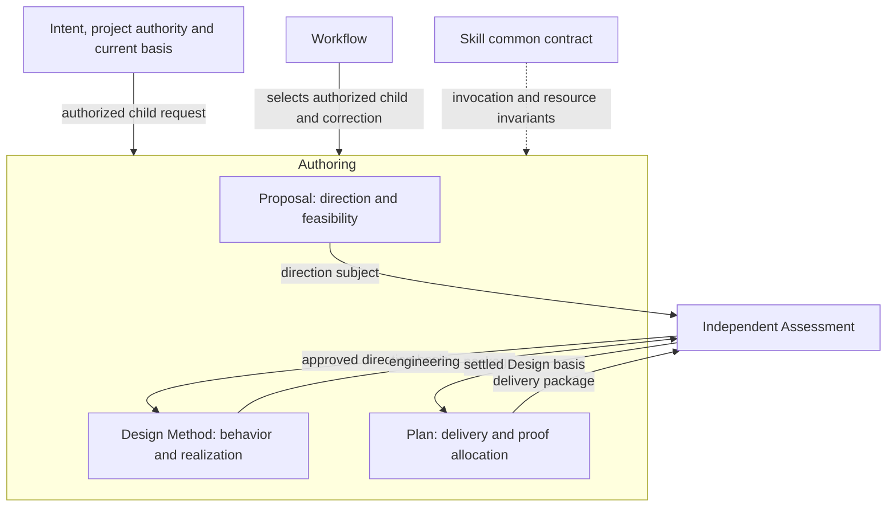
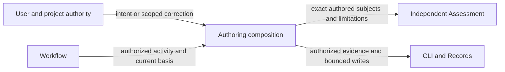
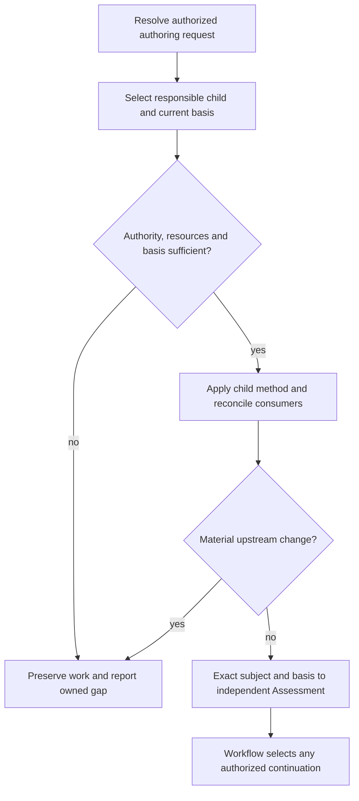

# Authoring Design

Model validation contract: model-document-v1

## Introduction and Goals

Authoring composes Proposal, Design Method and Plan into coherent engineering authorship. It owns their responsibility boundaries, requirement-refinement relationship and correction interfaces. Its children own detailed authoring methods; independent review, workflow state and implementation remain external.

The [test design](test-design/test-design.md) and [case index](test-design/test-cases.json) make these composition obligations concrete. Proposal, Design and Plan retain their detailed methods and local coverage.

## Context and Scope

[Skill](../skill.md) owns common capability, resource and evidence-access rules. This model owns authoring composition; [Workflow](../workflow.md) owns progression and [Assessment](../assessment.md) owns independent judgments. Published skills realize these contracts; model extraction does not rename invocations, change stored formats or grant execution authority.

## Requirements

| ID | Required behavior |
| --- | --- |
| AUTH-SR-01 | Authoring MUST assign direction, engineering realization and delivery allocation to Proposal, Design Method and Plan respectively, with one current owner for each detailed contract. |
| AUTH-SR-02 | Each invocation MUST use its authorized scope and current required basis; direct child invocation MUST NOT imply approval or automatic progression through sibling capabilities. |
| AUTH-SR-03 | Refinement MUST preserve approved goals and stable requirement identities through realization and work allocation; material upstream gaps MUST return to their responsible owner rather than be silently weakened downstream. |
| AUTH-SR-04 | Authored artifacts MUST carry stable engineering intent, with exact subjects and adequate authoring basis handed to independent Assessment; mutable state and actual results MUST remain with their existing owners. |
| AUTH-SR-05 | Composition changes MUST reconcile affected producers, consumers and references while preserving unrelated work, historical subjects and supported resource/recording boundaries. |

## Architecture Overview

The overview names the owned method and its external inputs and consumers. Detailed behavior is defined in the sections below; arrows to review identify submitted subjects, not automatic approvals.

| View | Necessity and reason | Owning detail |
| --- | --- | --- |
| Context | Necessary: user authority, upstream basis and independent assessment are separate boundaries. | [Context view](#context-view) |
| Building Block | No separate diagram: the overview and responsibility inventory fully identify the three method owners; their internals are delegated to child models. | [Responsibility inventory](#responsibility-inventory) and child models. |
| Runtime | Necessary: classification, authoring, failure and handoff have distinct authority effects. | [Runtime view](#runtime-view) |
| Deployment | No separate deployment: the capability is packaged guidance, not a separately deployed service; source, archive and installation boundaries are unchanged. | [Skill Deployment](../skill.md#deployment-view) and [Packaging](../../engineering/packaging.md). |

## Responsibility inventory

| Child | Owned behavior | Output and receiving owner |
| --- | --- | --- |
| [Proposal](proposal.md) | Direction, scope, feasibility and decision request. | Exact proposal for Assessment’s Proposal Review. |
| [Design Method](design.md) | Required behavior, technical realization, decisions and living test design. | Exact affected model package for Design Review. |
| [Plan](plan.md) | Implementation milestones, verification allocation and approved-work initialization. | Stable delivery package for Delivery Review; bounded work initialization through CLI/Records. |

## Shared authoring contract

Apply [Skill’s capability contract](../skill.md#capability-contract), conditional resources and evidence-access rules once at their owner. A child owns the exact output shape and authoring procedure; Authoring owns the relationships between these outputs. Requests and proposals provide need and approved direction; Design owns stable requirements, conceptual realization and model-owned living test design; Plan allocates change-specific executable work and proof. [Design’s refinement contract](design.md#requirement-refinement-and-delivery-allocation) owns this relationship. This refinement chain introduces no additional document, identifier series or mandatory decomposition level.

The default flow is Proposal → independent Proposal Review → Design → independent Design Review → Plan → independent Delivery Review. Workflow selects authorized activity and correction, and Assessment determines the judgment and applicability. A direct scoped invocation may start at its authorized child; it does not authorize traversing the entire chain. A technical feasibility issue that changes an approved goal returns to the direction owner; a missing behavior belongs to Design; an allocation gap belongs to Plan. Preserve unaffected work while the owned gap is resolved.

### Living coverage through authoring

The approved Design package carries durable behavior groups, important targets, meaningful scenarios, independent observations, fixture strategy and current/proposed realization links under [Design DES-SR-25/26](design.md#living-test-design). Plan references that intent and adds sequencing, commands, prerequisites and evidence allocation. Moving coverage knowledge solely into a delivery plan loses the Design-owned responsibility. Feature/proof authoring is unsupported under Design DES-SR-14/23; source interpretation and explicitly authorized scoped adoption retain project authority and original identities. Plan allocates proof from current living Designs and does not recreate a companion test-spec stage.

The parent observation is a leaf/parent model package passing through independent Design Review into a delivery plan: integrated coverage remains with its owning model and every affected obligation receives execution allocation. Inspect actual author outputs and handoffs using synthetic models and existing Plan assets; heading/resource checks alone cannot establish semantic correspondence. Design and Plan own their local methods, Assessment owns judgment, System owns shared test-quality rules and Validation owns execution. Their public guidance and consumer references must be reconciled together; no new authoring stage or artifact is introduced.

## Context view

## Runtime view

## Acceptance intent

Observe the composition across sibling outputs and their external owners, including failure and correction. Local structural validity is insufficient when a plan relies on an unsettled Design, a Design weakens approved direction, or a saved artifact is treated as permission to continue.

### Boundary scan and acceptance scenarios

| Dimension | Requirement basis | Distinct outcome to demonstrate |
| --- | --- | --- |
| Input domain | AUTH-SR-01, AUTH-SR-02 | An authorized Plan correction selects Plan directly without fabricating a new proposal or approving upstream subjects. |
| State/lifecycle | AUTH-SR-02, AUTH-SR-04 | Saving an authored artifact leaves stage decisions and current work state with Workflow/Records. |
| Identity/authority | AUTH-SR-02, AUTH-SR-04 | An old approval of a moved or changed subject is not retargeted to the new bytes. |
| Composition/path | AUTH-SR-01, AUTH-SR-03, AUTH-SR-05 | A changed goal is reconciled across Proposal, Design and Plan with one owner per contract. |
| Temporal/retry | AUTH-SR-02, AUTH-SR-05 | A changed upstream basis during authoring prompts reassessment before dependent handoff. |
| Failure/recovery | AUTH-SR-03, AUTH-SR-05 | A feasibility conflict returns to the direction owner while unrelated authored work is preserved. |
| Compatibility/migration | AUTH-SR-04, AUTH-SR-05 | The declared directory move preserves model/requirement identities and historical record subjects; live consumers resolve current owners. |
| External/environment | AUTH-SR-02, AUTH-SR-05 | Missing packaged resources or project authority stop dependent authorship; installation alone grants no governance adoption. |

### Test design

The [strategy](test-design/test-design.md) defines one synthetic artifact fixture and the boundaries between parent composition, child methods and external assessment. The [catalog](test-design/test-cases.json) owns thirteen concrete procedures in refinement, scope-handoff and correction-reconciliation groups, with stable case IDs, conditions, actions and independent expected outcomes. These are detail of model `authoring`; no model or requirement identity changes.

The procedures inspect goal/requirement preservation, durable coverage ownership, adequate downstream allocation, exact review subjects and correction authority. Each compares concrete compliant and faulty artifact/decision packets; named variants preserve separate starting state and diagnostics. They remain proposed independent reviews, not passing executable tests. Existing wording and skeleton checks provide narrower structural evidence. Skill references this detailed parent composition instead of copying its scenarios. [Validation](../../engineering/validation.md#authoring-test-design-admission-contract) defines the five-file admission boundary; actual assessment results remain in evidence.

Apply [System's selection procedure](../../test-design/rules.md#select-requirements-and-proof) to the five current requirements: AUTH-SR-01/03 govern refinement and correction ownership, AUTH-SR-02 governs invocation bounds and changing prerequisites, AUTH-SR-04 governs exact handoff and stable intent, and AUTH-SR-05 governs consumer/identity preservation. Each is accounted by the named catalog groups with concrete distinct violations. [Proposal](proposal.md#test-design), [Design](design.md#test-design) and [Plan](plan.md#test-design) now provide their local coverage; the parent retains the extra observation that a valid local artifact can still lose an approved goal, required proof or current subject across a sibling handoff. The existing overview and Context/Runtime views already own those transfers; no new deployment or assessment authority is introduced.

## Architecture Decisions

| ID | Decision and rationale | Alternatives and consequences |
| --- | --- | --- |
| AUTH-DEC-01 | Make Authoring a composed model with three sibling method owners and explicit external review/coordination boundaries. | A section-only grouping hid specialist ownership; a model containing duplicated child procedures would create competing authority. The directory groups current contracts without adding public skills or lifecycle stages. |

## Quality and risks

Requirements and representative outcomes guide review; structural validation does not establish semantic adequacy. Incomplete authority or a material upstream conflict stops dependent work with an explicit owner. Shared policy changes require reconciliation with the named owners, and moved documents retain historical approvals only for their original subjects.
