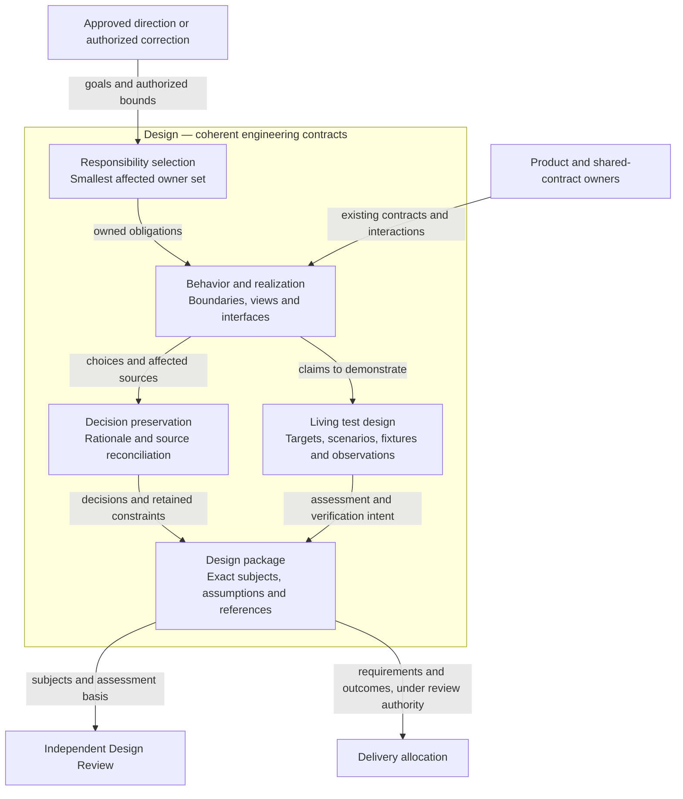
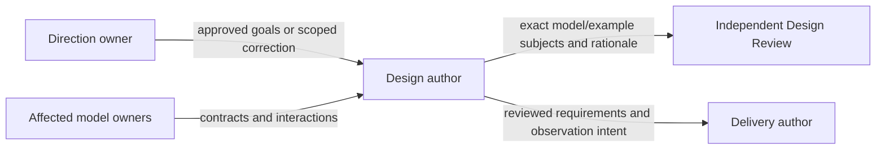
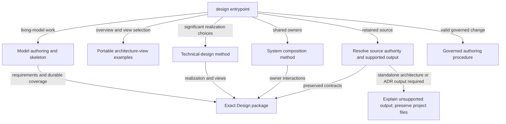
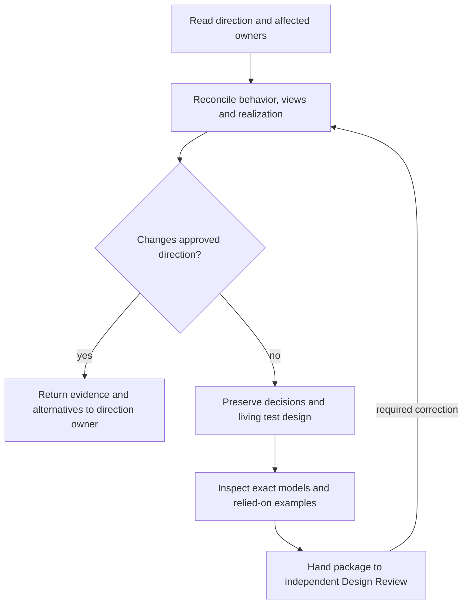
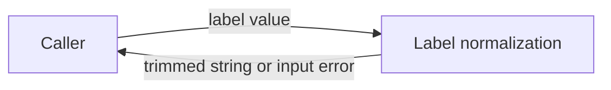

# Design Method Design

Model validation contract: model-document-v1

Parent model: [Skill — Authoring](../skill.md#authoring).

This child owns the engineering-design authoring method and model convention. The Authoring submodel also defines proposal and delivery-plan behavior; System owns project composition. Repository execution of these capabilities belongs to Engineering Development.

Owning change: [repository cleanup and layout refinement](../../../changes/2026-09-13-current-design-repository-cleanup/change.json).

Current retirement: [standalone architecture and ADR authoring](../../../proposals/2026-09-15-retire-legacy-design-authoring.md), governed by the [owning change](../../../changes/2026-09-15-retire-legacy-design-authoring/change.json).

Prior refinement: [independent parallel tests](../../../changes/2026-09-13-independent-parallel-tests/change.json).

Original composition adoption: [three-model reconciliation](../../../changes/2026-09-12-unified-validation-model/change.json).

For this repository’s [complete source retirement](../../../changes/2026-09-14-retire-specs-and-stale-tests/source-disposition.md), current responsibilities are self-contained in the owning Designs. Original source-transfer inventories remain recoverable through [Historical provenance](#historical-provenance); their instructions to retain or amend legacy specs, architecture, activation state or retired engines are historical and superseded by this complete retirement. Source-qualified IDs and original judgments keep their original meaning; provenance is not a runtime input or current approval. Customer source documents retain their project-owned authority and historical meaning. Current RigorLoop output and format support follow Design; source interpretation does not authorize retired feature/proof operations or automatic conversion.

## Introduction and Goals

Design owns the method for authoring coherent engineering contracts: required behavior, technical realization, boundaries, important decisions and representative acceptance intent. It also owns the living-model document convention and the method for describing relationships among models. The [Authoring model](authoring.md) owns its composition with Proposal and Plan. The [System model](../../system.md) applies that method to RigorLoop's assembled system; it does not define it again.

The direction is [Unified Design Authoring and Bounded Model Consolidation](../../../proposals/2026-09-08-unified-design-authoring-and-bounded-model-consolidation.md). This package defines the replacement for the selected responsibility, not a declaration that every old document has been migrated. Its adoption boundary below governs reliance. Original authoring and adoption evidence remains in that historical change; current refinement is registered in the owning cleanup change above.

## Reading guide

For current authoring, follow [responsibility selection](#responsibility-abstraction), the [reconciliation procedure](#runtime-view), [model structure](#model-document-and-structural-contract), [examples](#model-owned-example-contract), [architecture views](#technical-reasoning-and-decisions) and [acceptance intent](#boundary-scan-and-acceptance-scenarios). The [public resource map](#building-block-view) identifies the packaged methods that realize this contract.

[Installation compatibility](#public-invocation-compatibility), [customer feature-format compatibility](#feature-format-compatibility-after-repository-retirement) and [source retention](#necessary-design-retention) state the current boundaries. [Historical provenance](#historical-provenance) identifies the recoverable original mappings.

## Architecture Constraints

The Constitution retains precedence. Product direction belongs to the proposal's decision owner; Workflow owns coordination; Review and Closeout owns shared assessment and applicability policy; System owns shared test derivation, protective-value and maintenance criteria; Validation owns check selection and execution; Record Format owns stored representation; CLI owns recording mechanics. Design supplies engineering intent and identifies its assessment basis, not approval, work allocation or execution permission.

The adopted model profile permits this combined living Design. The unified `design` skill supplies technical and behavioral authoring at coordinated adoption. This document does not activate the replacement public skill or amend governance merely by existing. It introduces no lifecycle gate, runtime record schema, model-management service, mandatory prototype, per-test ledger or target-agent correctness claim.

## Architecture Overview



Design owns the method responsibilities inside the boundary, realized through the [public resource composition](#building-block-view). [Responsibility abstraction](#responsibility-abstraction), [technical reasoning and views](#technical-reasoning-and-decisions), and [decision/reference preservation](#model-document-and-structural-contract) own the detailed authoring rules; the [Runtime View](#runtime-view) owns the reconciliation procedure. [Context and Scope](#context-and-scope) identifies external contract owners. [Assessment](../assessment.md) owns independent review; [Plan](plan.md) owns Delivery planning. Package production does not authorize that downstream work. [System](../../system.md) applies the reusable convention to this project.

### Supporting-view decisions

| View | Necessity and reason | Owning detail |
| --- | --- | --- |
| Context | Necessary: Direction, shared-contract owners, review and Delivery are separate decision boundaries. | [Context view](#context-view) |
| Building Block | Necessary: A compact public entrypoint conditionally loads complete methods and examples; loading boundaries are part of portability. | [Building Block view](#building-block-diagram) |
| Runtime | Necessary: Reconciliation must distinguish an engineering choice from a material change to approved direction. | [Runtime view](#runtime-diagram) |
| Deployment | No separate deployment view: Design owns an authoring method, while Skill owns packaged invocation and Packaging/Installation own artifact placement. The retained deployment prose describes compatibility, not a Design-owned runtime service. | Existing deployment/context prose and the named external owner. |


## Context and Scope

| Responsibility | Design owns | Separate owner or boundary |
| --- | --- | --- |
| Engineering contract | Intended outcomes, structure, invariants, shared interfaces, constraints and decisions | Proposal owns material product direction |
| Model organization | Coherent responsibility, document identity, references, supporting examples and scoped consolidation | System owns the actual system inventory and composition obligations |
| Assessment intent | Important claims, assumptions, representative conditions, observable outcomes and needed feasibility evidence | Review and Closeout governs actual assessments; specialists judge their subjects |
| Living test design | Lasting behavior groups, targets, scenarios, independent observations, fixture strategy and current/proposed test locations | System supplies common rules; Delivery allocates change-specific execution; implementation realizes cases and evidence |
| Authoring integration | One public authoring contract, sufficient conditional methods and exact review handoff | Workflow selects activities; installation/publication and local runtime permissions remain separate |

Input is an approved direction or an explicitly scoped authorized correction, affected model identities and relevant current contracts. Output is the smallest reconciled set of model changes, preserved decisions/references, declared consumer impacts and reviewable acceptance intent. Existing feature and proof documents remain source inputs, not supported authoring outputs. Standalone architecture documents and ADRs are source inputs, not supported authoring outputs; their authority remains unchanged until an explicitly authorized adoption reconciles the selected responsibility.

## Solution Strategy

Replace the normal `spec` and `architecture` entrypoints with `design` in one coordinated package adoption. Do not retain redirect skills, parallel manuals or separate normal authoring decisions under those old names. Preserve architecture reasoning and behavioral precision as conditional methods within the one skill. Old documents and old released packages retain their historical meaning; withdrawing an invocation is distinct from superseding a document obligation.

One author reconciles behavior and realization iteratively. The author first selects affected responsibility owners, then makes observable behavior and constraints explicit, tests the credibility of important choices, and reconciles dependencies. A material reduction of an approved product goal returns to the direction owner with its constraint and alternatives. A local realization choice within the approved bounds belongs here. The independent reviewer assesses the resulting exact package.

### Responsibility abstraction

Under DES-SR-02/05/07/08, begin a system composition with what the product delivers, who uses it and the outcomes it provides. Distinguish delivered interfaces and artifacts from the domain subject users manage, the policies governing those interfaces and the repository tooling that builds or validates them. For each proposed model, identify its question, owned decisions or artifacts, inputs, outputs and excluded responsibilities. Separate engineering policy, information representation, execution mechanisms and product delivery before describing their relationships. Map each selected owner to the actual delivered surface, its implementation location and an observable integration boundary. A list of existing documents is insufficient evidence of coherent decomposition.

Retain a distinct model when it has a clear contract and a meaningful reason to change independently. Consolidate overlapping ownership when both models decide the same outcome; sharing a caller or executable alone does not establish overlap. Identify whether a relationship is composition, policy use, representation, tool use or artifact transfer, and name the shared subject and its owner. A diagram illustrates those established boundaries rather than determining them.

A main model may delegate coherent responsibilities to submodels. The parent owns their composition and shared boundary; each child owns its detailed contract once. Logical nesting does not require immediate file relocation, and a child does not become another peer product merely because it has a separate Design. System owns the project's actual decomposition. Assess it with an end-to-end example and a failure that separates neighboring responsibilities, such as correct check execution with inadequate evidence or a justified decision whose persistence conflicts. Keep method requirements here and project-specific relationships in System; do not invent one model per lifecycle activity to fill an apparent diagram gap.

## Architectural supporting views

These views elaborate the overview at the owning model boundary. Existing detailed contracts, scenario tables and external owners retain their authority.

### Context View



Direction, shared-contract owners, review and Delivery are separate decision boundaries. Detailed requirements and scenarios in this model remain authoritative.

### Building Block diagram



A compact public entrypoint conditionally loads complete methods and examples; loading boundaries are part of portability. Detailed requirements and scenarios in this model remain authoritative.

### Runtime diagram



Reconciliation must distinguish an engineering choice from a material change to approved direction. Detailed requirements and scenarios in this model remain authoritative.

## Requirements

| ID | Required behavior |
| --- | --- |
| DES-SR-01 | Normal authoring MUST expose one `design` contract covering behavioral requirements, technical realization, important decisions and acceptance intent; old `spec` and `architecture` invocations MUST NOT remain competing authoring contracts after coordinated adoption. |
| DES-SR-02 | The author MUST select the smallest justified set of coherent responsibility owners. One model has one current normative Design; a shared contract has one named owner and references from consumers. A feature, folder, class, team or size threshold alone MUST NOT define a new model. |
| DES-SR-03 | Each changed model MUST define observable required outcomes, applicable invariants, inputs/outputs, boundaries, compatibility and failure/recovery behavior with stable model-local requirement identities. Conditions under which side effects must not occur MUST be explicit where material. |
| DES-SR-04 | Behavior and technical realization MUST be reconciled. A material feasibility constraint that changes approved product direction MUST return to its decision owner with evidence and alternatives; the author MUST NOT silently weaken the approved goal or present implementation convenience as authority. |
| DES-SR-05 | A model MUST explain responsibility structure, significant dependencies, runtime or operational flows, applicable deployment/trust boundaries, quality constraints and risks to the depth needed to assess its claims. Irrelevant concerns need a bounded rationale; methods MUST NOT demand fictitious services, components or metrics. |
| DES-SR-22 | Every model MUST contain an Architecture Overview View with a concise graph orienting readers to its principal responsibilities, externally significant products or interfaces and important relationships. Every material element or relationship MUST resolve to its owning view or model without duplicating detailed authority. Authors MUST evaluate Context, Building Block, Runtime and Deployment views, record each necessity decision with its reason, and draw every necessary view. Supporting views MUST remain consistent with the overview and affected contracts; an overview MUST NOT replace a necessary supporting view. |
| DES-SR-06 | Important decisions MUST retain stable identity, context, chosen outcome, meaningful alternatives, consequences and still-applicable constraints in the owning model. Normal model work MUST NOT require an additional ADR with duplicate current authority. Historical ADR identities and judgments MUST retain their original meaning. |
| DES-SR-07 | The system-level Design MUST describe external boundaries, responsibility inventory, significant relationships, end-to-end flows and genuinely system-wide quality/failure obligations. It MUST reference component/shared-contract owners without copying their local rules or overriding governance or component authority. |
| DES-SR-08 | An interface or shared-assumption change MUST identify affected producers/consumers and required reconciliation or an evidence-backed unaffected disposition. Review scope MUST include relevant interactions and exact changed subjects; it MUST NOT require every repository model for every invocation or rely on a CLI-inferred semantic dependency graph. |
| DES-SR-09 | Important design claims MUST have an explicit assessment basis: representative walkthrough, counterexample analysis, inspection or targeted feasibility evidence proportional to the uncertainty. Material assumptions and unresolved decisions MUST remain visible. Structural validity alone MUST NOT establish credibility or approval. |
| DES-SR-10 | Design MUST identify representative conditions and observable expected outcomes for realization, including integrated outcomes that local model checks cannot establish. Scenarios MUST NOT be an exhaustive test whitelist or a basis for deleting unlisted regression protection; shared adequacy and maintenance criteria are System-owned. |
| DES-SR-11 | The document layout and structural mapping below MUST use the `model-document-v1` document contract, preserving the existing structural rules independently of runtime record versions. Stable requirement/decision references MUST survive revision or have explicit replacement mappings; no old review may be retargeted to revised content. |
| DES-SR-12 | Each owning model MUST index its examples with purpose, governing requirements, excerpt/complete scope and material synthetic identities or starting assumptions. Examples MUST illustrate existing obligations and satisfy the model-owned example contract below: JSON validity and available-schema conformance, before/after invariant preservation, and independent review alongside the owner with exact identities when relied upon. Examples MUST load on demand and remain distinct from normative model subjects; selectors MUST retain model/example validation pairing. |
| DES-SR-13 | Every displaced obligation and material decision in the selected migration MUST have a destination, explicit supersession or justified retention, including obligations expressed in unnumbered prose. Grouped mappings MUST expose each material obligation's disposition; section names or source-ID enumeration alone MUST NOT establish preservation. Mixed sources MUST retain identifiable unmigrated authority. No adoption or removal may rely on unresolved contradictions, anonymous follow-up or a filename-only mapping. |
| DES-SR-14 | Reading a retained feature specification MUST preserve applicable project authority and historical reference identities; feature-format creation/amendment and companion proof-map output are unsupported. A required retired output MUST stop without project-file mutation unless the project owner separately authorizes scoped adoption into living Designs. Architecture/ADR source preservation and supported output follow DES-SR-24. New features MUST update existing responsibility owners where appropriate; repository-wide conversion MUST NOT become a prerequisite for a small change. |
| DES-SR-15 | Published `design` guidance MUST work without the RigorLoop internal Design checkout or private requirement IDs. The common contract MUST be compact; specialist methods MUST load conditionally from complete packaged resources, with no full loading of both retired manuals. Missing or inconsistent required resources MUST stop dependent authoring rather than reconstruct the method. |
| DES-SR-16 | Authoring MUST hand independent Design Review the exact affected model set, relevant interactions, material decisions, assessment basis, living test designs and changed-subject applicability impacts. Delivery receives stable requirements, local and integrated coverage intent and identified gaps, then allocates concrete execution commands, milestones and evidence. Actual results remain with evidence owners; neither Delivery nor a retired plan is the sole owner of lasting test-group rationale. |
| DES-SR-17 | Public invocation withdrawal MUST follow the compatibility contract below across source skills, supported adapters, invocation examples and installer boundaries. A current package or installation with retired authoring entries MUST NOT be represented as a coherent replacement. Detection MUST preserve unrelated/user-modified files and existing project state. |
| DES-SR-18 | Coherent adoption MUST reconcile governance, Workflow references, directly affected consumers, validation selection and packaged resources together. Historical records and released evidence MUST NOT be rewritten to claim approval of new subjects; publication and customer adoption remain separately authorized. |
| DES-SR-19 | Required structural checks MUST fail closed on unknown contract markers, closed values and malformed references while retaining semantic review ownership. This change MUST preserve required negative/regression protection and existing TEST-SR criteria in System when relocating or retiring checks. No test-count, document-count or token-saving target substitutes for evidence. |
| DES-SR-20 | The first slice MUST deliver the selected Design/System responsibilities and their shared relationship, dispose their superseded current sources as mapped, and assign remaining consolidation to named later work. Completion MUST NOT claim whole-repository consolidation. |
| DES-SR-21 | For an explicitly approved necessary-design consolidation, surviving requirements, applicability, constraints, technical realization, material decisions and failure knowledge MUST have usable current owners before source removal. Retain an original only for a named remaining need and owner; no automatic archive, redirect, index or duplicate is required. Historical judgments and records MUST retain their original subjects and meaning; current reliance MUST not require reconstruction from version history. This policy applies only to the selected sources and does not cancel a different initiative's retention commitment. |
| DES-SR-23 | Current authoring MUST use living Designs, model-owned test intent and Delivery allocation. Retire feature/proof authoring, structural grammar, adoption-classification handoffs and their exclusive methods for repository and customer use. Preserve the compact boundary reasoning method, source interpretation and explicit adoption authority; withdrawal MUST NOT alter existing customer documents or their historical judgments. |
| DES-SR-24 | Architecture and decision authoring MUST produce living Designs, not create, rebuild or amend standalone architecture documents or ADRs. Existing documents MUST remain readable authority/evidence inputs; required old-format output MUST stop without project-file mutation, implicit conversion or reconstructed legacy procedures. An explicitly authorized scoped adoption MUST reconcile all affected obligations and decision meaning into the current owner before displaced authority is retired. Feature/proof output follows the withdrawal in DES-SR-14/23; source preservation remains required. |
| DES-SR-25 | Each model MUST own a proportionate living test design linking its requirements to behavior groups, important functions/interfaces, meaningful scenarios, expected observations, fixture strategy and implementation locations. Parents own integrated coverage and reference child details. Use the shared System criteria without duplicating them or requiring one case per function; guidance-only responsibilities use justified review or walkthrough methods. Unknown coverage and proposed tests MUST remain distinguishable from observed existing coverage. |
| DES-SR-26 | Published Design instructions, model-authoring guidance and the Design template MUST create and maintain that test design during new or substantively changed work. Changes to behavior, grouping, targets or coverage MUST reconcile the affected living sections and relevant consumers. Review assesses semantic sufficiency; heading presence, a generated table or a passing structural check alone MUST NOT establish useful coverage. |

## Building Block View

Design is a method responsibility, not a new service. Its public implementation is one authored skill with a small common procedure and conditionally loaded methods. The same model requirements govern repository use and portable installed guidance; repository-specific mappings below remain contributor content.

| Public resource | Trigger and responsibility | What stays out |
| --- | --- | --- |
| `skills/design/SKILL.md` | Always: scope/authority, owner selection, reconciliation loop, stable references, boundary scan, assessment/verification distinction and handoff | Detailed migration inventory, repository paths for maintainers, exhaustive method manuals |
| `references/model-authoring.md` | Creating/revising a living model: requirements, decisions, model layout and the complete DES-SR-12 example contract, including parent indexing, validity, invariant preservation and review handoff | Lifecycle mutation and approval |
| `references/architecture-view-examples.md` | Living-model overview or supporting-view decisions: portable composed/leaf excerpts and semantic counterexamples | Internal model dependencies, a universal component inventory or automated approval |
| `references/technical-design.md` | Significant structure, interfaces, runtime, deployment, trust or quality choices | A mandatory second architecture file or ADR |
| `references/system-composition.md` | Multiple affected owners, shared contract or system-wide claim | Whole-repository loading or inferred ownership by folder |
| `references/legacy-source-reconciliation.md` | Retained source inputs: select authority, distinguish supported output, preserve IDs and meaning; explicitly authorized scoped adoption | Automatic conversion, blanket deletion or historical approval rewriting |
| `references/boundary-first-method-v1.md` | Interpret current requirements, scenario dimensions and composed hazards without feature/proof record grammar or generated BND/INT/PRF identifiers | A second policy owner or mandatory feature records for living models |
| `assets/diagram-styles.mmd` | A relevant diagram needs the common styles | A mandatory standalone architecture package |
| `references/governed-design-authoring.md` | Explicitly selected governed change: current context under Record Format and CLI, subject inspection and targeted author-owned recording | Portable lifecycle creation, semantic readiness engines or retired recording fallback |
| `references/test-quality.md` | Authoring or assessing verification intent under the adopted TEST-SR criteria in System | A new definition of test adequacy or a per-test ledger |
| `assets/design-skeleton.md` | Creating a model: stable engineering sections, requirement/scenario tables and a proportionate living test-design section | Mutable results, a per-case inventory, mandatory executable tests for guidance, or a second specification scaffold |

The resource names are the selected package decomposition. Delivery may divide implementation work but may not silently replace the loading responsibilities with eager concatenation. Existing portable boundary vocabulary supports the common compact scan. Feature-authoring and proof-format resources are removed. The compact method retains the four-question scan, eight risk dimensions, actual-interaction reasoning and upstream-gap ownership; it no longer prescribes feature/proof tables, BND/INT/PRF grammar or adoption classification. The legacy reconciliation resource owns selection and the named specialist resources supply the complete procedure. Any transitive required method or scaffold must be contained in the installed package and covered by the same trigger/integrity checks. The current published resource-integrity owner retains contained-path, projection and parity mechanics.

Model-authoring owns the living test-design method; the entrypoint makes it part of reconciliation and the skeleton exposes it in new models. Existing test-quality guidance supplies shared criteria and system-composition explains parent/child coverage. No additional skill or mandatory object hierarchy is introduced.

The customer project supplies its authoritative legacy requirements, approved decisions, local format/version and any mandatory project-specific template or schema. Packaged methods explain source reconciliation into a living Design; they cannot invent authority or supply feature/proof or standalone architecture/ADR authoring. A missing packaged method is a distribution defect that stops the dependent invocation. Missing or contradictory project authority instead requires the project owner to resolve that bounded gap; installing more generic guidance or migrating the document does not settle it. The author may proceed with independently authorized unaffected work. A supplied feature/proof or architecture/ADR scaffold cannot re-enable unsupported output; the project owner must choose an authorized scoped adoption or another authoring tool.

### Target and authority safety

For DES-SR-13/14/18, creation requires an absent exact target and revision requires the intended existing target. Explicit governed signals, including malformed ones, require one safe, agreeing current change identity; missing or conflicting authority stops dependent work without portable fallback. Portable authoring changes only its selected engineering content. On interruption or concurrent change, inspect actual content, governing basis and saved records before continuing; preserve unrelated work and report partial completion truthfully. A retry must not overwrite a changed target or reinterpret stale approval. Workflow owns correction routing, Assessment owns renewed reliance, and CLI/Records own current persistence and recovery; retired per-skill manifests, receipt formats and lifecycle transactions are not required.

### Requirement refinement and delivery allocation

The shared requirement-to-delivery guidance expresses refinement as RR → IR → SR → AR: incoming need, approved direction, testable system requirements and conceptual allocation. Existing requests and proposals supply the first two; RR, IR and AR need no additional artifact, identifier or lifecycle state. The living Design owns stable SR identities and their technical realization. Planning allocates them to executable work, with many-to-many relationships where justified. Work decomposition is separate: add Epic, Feature, Story, Task or other levels only when they improve ownership, sequencing, reviewability or coordination. Each work package explains its purpose, governing requirements or justified non-requirement obligation, affected technical boundary, scope and dependencies. Review follows the chain from direction through realization and allocation to implementation and evidence without changing gate order or authority. Historical artifacts need no retrofitted terminology. The packaged shared resource remains application guidance under these owners.

## Runtime View

1. Read the approved direction or authorized correction and select exact affected owners. For governed work, inspect current model references and applicable assessments through existing primary CLI reads. For portable work, resolve an explicit target or the model layout below; do not infer governance adoption.
2. Explain observable outcomes and constraints, then reconcile technical choices and dependencies. Escalate a material product-direction conflict; retain unaffected independent work.
3. Identify important claims and uncertainty. Use a scenario walkthrough or counterexample for ordinary claims and targeted feasibility evidence for a material uncertain claim. Record assumptions and any owned unresolved question.
4. Update model-local requirements, realization, decisions, scenarios and living test design together. Inspect existing test groups and their callers where coverage is claimed; distinguish current observations, proposed additions and unresolved gaps. Include affected consumers and justified unaffected paths.
5. Preserve references and current ownership. For a selected migration, use the exact displacement map; for retained source reading, preserve its authority and historical meaning. A required feature/proof or standalone architecture/ADR output stops before authoring; source inspection alone grants no conversion authority.
6. Inspect completed subject identities and record only author-owned references, decisions and impact restrictions. Independent Design Review evaluates that package. A successful write does not approve it; a missing resource or uncertain authority remains a scoped stop.

## Deployment View

### Public invocation compatibility

Current authoring uses `design`; supported packages omit the retired `spec` and `architecture` entries and aliases. Packaging owns supported targets and archive contents. Design owns the authoring interface and complete conditional resources for current model authoring and retained-source reconciliation. Standalone architecture/ADR authoring is retired under DES-SR-24. A package check does not establish target-agent correctness or customer governance adoption.

[Installation](../../cli/installation.md) owns acquisition, destination checks, replacement and recovery. It preflights actual candidate destinations, defaults to conflicts, and permits explicit complete replacement within candidate units through `--force`. It does not interpret or write project state; `--write-state` and the former lockfile-managed transition are retired. Unrelated files and noncandidate entries remain outside replacement authority. An obsolete installed entry requires the Installation-owned diagnostic and scoped handling, not a Design-defined repair procedure.

Earlier OpenCode aliases, managed-state transitions and TNI-DES-01–06 retain historical meaning through the [installation history](../../cli/installation.md#historical-provenance) and original adoption records. They do not govern current installation. Previously released archives retain their actual inventory and approval basis.

### Coordinated adoption boundary

Changes to authoring behavior reconcile the affected model, published guidance, routing/review consumers and package interfaces as one reviewed subject set. Design approval permits authorized planning; implementation, independent assessments and successful Verify establish adoption under the owning change. Installation and publication retain separate authority.

The historical source-transfer maps remain recoverable through [Historical provenance](#historical-provenance). Current source retention follows the Constitution and the cleanup's exact dispositions; it does not require restoring deleted originals or archives. A correction or rollback restores a coherent source/consumer set and reassesses current applicability without reassigning earlier approvals.

## Feature-format compatibility after repository retirement

The [feature-format retirement](../../../proposals/2026-09-17-retire-feature-format-support.md) selects a breaking support withdrawal under DES-SR-14/23. RigorLoop no longer creates or amends feature specifications or companion proof maps, validates their format, or asks Design Review to classify their adoption. Existing sources remain readable under their project's authority; no command or installed skill converts, deletes or rewrites them automatically.

A request for `specs/example.md`, a companion `.test.md` or the same retired output under another name receives an unsupported-output explanation before authoring. State that living Designs and Delivery allocation are supported; if the customer requires the older output, its owner may choose another tool or explicitly authorize scoped adoption. Do not create a substitute Design as an implicit response to a rejected format request. Preserve applicable requirements, decisions and original review identities when adoption is separately authorized.

The compact method retains outcome-driven boundary reasoning and important interactions, without the retired feature/proof schema and identifier rules. Packaging retains `compact-core` and removes `feature-authoring` and `proof` resources, projections and READ paths. Validation owns rejection at its public command; CLI owns withdrawal of the factual `spec` location and configuration kind. Architecture/ADR location discovery remains a separately retained factual interface, not output authority.

These changes narrow existing model/source and validation interfaces; there is no new model, service or authority. Existing architecture/supporting views remain applicable with this revised input/output boundary. Acceptance requires the same preserved customer source to be rejected for old-format output but usable for an explicitly authorized living-model adoption, and clean packages to contain the surviving methods without retired transitive references.

## Crosscutting Concepts

### Living test design

DES-SR-25/26 apply [System's shared test-design rules](../../test-design/rules.md#start-from-supported-outcomes). Keep a summary in the owning model beside its acceptance intent. When detail needs separate files, use the project-selected model directory with a cohesive `test-design/` subdirectory for strategy and any adopted case catalog. Small models keep the complete account in the main document. Each case and shared interaction has one owner; parent catalogs reference child detail and add their own interaction protection. It must explain coverage without requiring an old plan, chat or historical checkout. Requirements and acceptance rows remain authoritative and are referenced rather than copied.

| Information | Authoring responsibility |
| --- | --- |
| Purpose and basis | Identify the supported behavior, requirement or explicit engineering obligation and plausible violation. |
| Target and observation boundary | Name important functions, commands, interfaces or composed operations; explain direct versus caller/integration observation where it matters. Guidance can be assessed by independent inspection or a focused walkthrough. |
| Groups and scenarios | Derive coherent groups and meaningful input/state/failure variations from current obligations and risks. State concrete starting conditions, action and independent expected values, diagnostics and relevant absence of side effects. Distinguish technique from observation boundary. A project-selected case catalog uses stable IDs and explicit group membership; no exhaustive function catalog is required. |
| Fixture strategy | Explain relevant initial state, representative inputs, isolation, mutable resource ownership and necessary real versus substituted dependencies. Keep implementation mechanics in fixture code. |
| Realization and gaps | Link existing test modules/entrypoints or the actual review method. Label proposed locations and known coverage gaps honestly; a planned case is not observed proof. |
| Composition and maintenance | Parent coverage observes interactions beyond child checks. Changes to behavior, test responsibility or referenced locations update the affected sections; results and transient work status remain outside the Design. |

The Design skill's common reconciliation and handoff must include this section, with detailed method in model-authoring and an adaptable table/prose scaffold in design-skeleton. Apply the project's declared shared rules before expanding a catalog: establish supported outcomes, group related variations, preserve distinct authority/persistence/recovery observations and keep known gaps explicit. Native discovery owns the method inventory; no per-method catalog entry or case-count target is required. A smaller catalog does not establish executable redundancy. Shared guidance can have a declared supporting directory and one existing owner, while scenarios stay with their models. The packaged skill must remain usable without this repository's documentation paths.

Model-specific technical choices remain here; shared useful-test rules are System-owned in this repository. Published guidance follows the customer project’s declared policy owner and remains portable. Reconcile system-composition and test-quality guidance where their allocation wording conflicts. The template cannot invent nonexistent test files or mandatory automation for a prose responsibility. The base model grammar needs no new mandatory heading. A separately selected structured catalog must define required fields/types, closed values, stable identities, reference semantics, realization gaps and validation limits before tooling adoption. Release supplies the scoped worked example; its format is not automatically a portable requirement. Requirements, case intent, executable assertions and actual results retain their distinct owners.

Delivery allocates the exact models, groups and consumers selected for each change. This focused application covers Release, Skill and Authoring; other models retain their existing coverage and gain proportionate detail when substantively changed. Missing or contradictory coverage rationale remains with its model owner, and proposed realization is never presented as demonstrated proof.

### Test design

| Group and basis | Targets and expected observations | Fixture and method | Realization |
| --- | --- | --- | --- |
| Model structure and examples; DES-SR-11/12/19 | Supported models retain valid local references and declared example ownership; unknown markers, invalid references and unsafe model paths reject. | Minimal owned model/example trees, independently varied invalid inputs and unchanged-file checks; real document validator. | [Boundary command tests](../../../../tests/engineering/validation/boundary_command_tests.py) and model validation groups under [Validation](../../engineering/validation.md); feature/proof operations reject under Validation without reading their contents. |
| Authoring and durable coverage; DES-SR-10/25/26 | A leaf identifies its targets, scenario groups, independent observations and fixture needs; a parent adds integrated coverage and references child detail; a prose responsibility names an appropriate review method. | Independent inspection and bounded authoring walkthroughs using small synthetic models; inspect actual outputs without treating table syntax as quality. | [Design resource tests](../../../../tests/skill/skill_design_resource_tests.py) protect package surfaces; independent Design/Code Review supplies semantic assessment. Living test-design assertions and examples require Delivery allocation. |
| Portable source reconciliation; DES-SR-14/15/23/24 | Retained source interpretation preserves authority and IDs; unsupported feature/proof and standalone architecture/ADR output leaves files unchanged; authorized scoped adoption preserves meaning. | Customer-like private sources and installed guidance without the internal checkout. | [Skill portability tests](../../../../tests/skill/skill_portability_tests.py), resource checks and specialist assessment retain their distinct claims. |

The combined hazard is a template producing a plausible coverage table while a downstream plan omits its required observations. Assess actual author output through Design Review and Plan into Delivery Review, plus packaged resource reachability. A syntactically valid table or passing resource check cannot prove that this interaction is coherent.

### Model document and structural contract

A living Design states the current engineering contract: responsibility, required behavior, realization, decisions, acceptance intent and owned unresolved technical questions. Stage queues, mutable progress and completed rollout inventories belong in the owning workflow records, plans or historical evidence. Do not add Next artifacts or Follow-on artifacts sections to a living Design. Preserve enduring obligations and decision rationale before removing completed migration material.

The portable convention transferred from Workflow WF-SR-07/08/09 uses one `docs/design/M/M.md` per coherent responsibility, where `M` is the matching stable directory/filename model ID. Model-owned examples live under that directory's `examples/`. Examples may be Markdown, JSON, Mermaid or a suitable format; no shared cross-model example root or mandatory wrapper is introduced. A shared example has one owner and is referenced by its consumers. Cross-model contract references use the owner's path and stable requirement/decision identity.

A project may explicitly select a simpler parent/child layout. Keep a single child document beside its parent; create a child subfolder when that responsibility owns several related documents or resources. Short material stays in sections. Logical grouping alone and speculative future growth do not justify another directory. The project composition owner declares exact paths and example ownership; directory depth does not determine model authority. A move preserves model and requirement IDs, updates current links and executable path consumers, and records old-to-new provenance without retargeting earlier reviews.

Each model declares exactly once `Model validation contract: model-document-v1`. Its level-two `Requirements` heading introduces a table with exactly `ID` and `Required behavior` columns, unique nonempty IDs beginning with a letter and containing only letters, digits and hyphens, and nonempty normative text. Its level-three `Boundary scan and acceptance scenarios` heading introduces a table with exactly `Dimension`, `Requirement basis` and `Distinct outcome to demonstrate` columns. Each of the eight dimensions in this document's scenario table occurs exactly once. Applicable rows cite unique IDs from that model separated by comma and one space and give a nonempty outcome; non-applicable rows use `-` and an outcome starting `Not applicable:` with a reason. Required headings/tables occur once. Unknown markers/dimensions, duplicates, undeclared IDs, malformed tables and missing required cells reject.

The marker replaces the ambiguous document identifier `explicit-recording-v1`; it does not version or convert stored workflow records. Current model validation accepts exactly `model-document-v1` and rejects the retired document marker, unknown values, missing declarations and duplicates before table checks. Adopt the rename together across current living models, the validator, authoring guidance, skeleton and generated candidate metadata. Existing customer models require an explicit project-owner-authorized marker edit; installation does not rewrite their documents. Historical record bytes and original review identities remain unchanged. A rollback restores the matching document/validator/guidance set together, without changing the independently owned current stored contract in Record Format.

#### Example: a small model document

| Example | Purpose and governing requirements | Scope and assumptions |
| --- | --- | --- |
| The fenced label-normalization model below | Illustrates DES-SR-09/11/12: the marker, model-owned requirements, all eight scenario dimensions and observable outcomes | Complete illustrative structural record for hypothetical `docs/design/label-normalization/label-normalization.md`; not an adopted RigorLoop component or a stored workflow record. Synthetic LAB-SR identifiers belong only to this example. |

The function accepts a label and returns a normalized value. For example, `"  green  room  "` becomes `"green  room"`; an all-space string becomes `""`; a non-string input produces an error and no normalized value. The scenarios describe intended observations, not an exhaustive test list or evidence that an implementation passed.

````markdown
# Label Normalization Design

Model validation contract: model-document-v1

## Responsibility

Normalize labels with a pure function. The caller owns storage, authorization and presentation; this model owns only the input-to-output transformation.

## Architecture Overview



The Responsibility and Requirements sections own this pure transformation and its input/output relationship. No additional model or service is implied.

| Supporting view | Necessity and reason |
| --- | --- |
| Context | Unnecessary: one synchronous caller; the responsibility and requirements fully define the external input/output boundary. |
| Building Block | Unnecessary: a single pure transformation has no material internal subsystem decomposition. |
| Runtime | Unnecessary: there is no component interaction, state transition or asynchronous protocol beyond the specified return/error behavior. |
| Deployment | Unnecessary: this function has no external state or environment dependence; its caller owns placement. |

## Requirements

| ID | Required behavior |
| --- | --- |
| LAB-SR-01 | For a string input, return it with leading and trailing ASCII spaces removed; preserve every interior character and return an empty string for an all-space input. |
| LAB-SR-02 | Reject a non-string input with an input error and no normalized value. |
| LAB-SR-03 | Do not read or write external state; repeated normalization of an already normalized string returns the same value. |

### Boundary scan and acceptance scenarios

| Dimension | Requirement basis | Distinct outcome to demonstrate |
| --- | --- | --- |
| Input domain | LAB-SR-01, LAB-SR-02 | Leading/trailing spaces disappear, interior spaces remain, empty/all-space inputs return an empty string, and non-string inputs reject. |
| State/lifecycle | LAB-SR-03 | Calls leave external state unchanged; earlier calls cannot affect a later result. |
| Identity/authority | - | Not applicable: this pure transformation has no principals or permission decisions; callers own access control. |
| Composition/path | LAB-SR-01, LAB-SR-03 | Passing the result through normalization again preserves the result. |
| Temporal/retry | LAB-SR-03 | Repeating the same call yields the same result without accumulated side effects. |
| Failure/recovery | LAB-SR-02, LAB-SR-03 | Invalid input produces no normalized value or state changes; a following valid call succeeds normally. |
| Compatibility/migration | - | Not applicable: this example owns no persisted records, versions or migration. |
| External/environment | LAB-SR-01, LAB-SR-03 | The ASCII-space rule produces the same result regardless of locale and without filesystem or network access. |
````

Extract the fenced content to the hypothetical model path to check its structure. The fence is illustrative content, so its declaration and tables must not count as additional live declarations in this owning Design. Structural validation checks shape and references; independent assessment judges the requirements and scenarios, and implementation tests establish actual behavior. Changing this relied-on example requires reassessment with its owning Design and exact subject under DES-SR-12/16.

Path selection continues to accept explicitly supplied historical flat `docs/design/M.md` regular files when present, without maintaining flat copies, relocating subjects or retargeting approvals. This repository explicitly overrides physical layout through [System’s directory map](../../system.md#repository-directory-layout); stable model IDs remain independent of these mapped filenames. The exact mapped paths and their example namespaces are accepted alongside the portable convention. Unmapped mismatched IDs, model paths pointing into examples, extra normative nesting and symlink paths reject. A known historical flat deletion maps to its current model for validation selection only. Model/example selection preserves the owning-model check. Feature/proof validation is unsupported; retained source interpretation remains under project authority; the document marker is independent of runtime record formats.

References to scenario rows use the model path and exact dimension label; material combined hazards are concise requirement-linked prose alongside them. No additional boundary/proof ID series is required for model documents. Every affected requirement, scenario row and material integrated hazard is allocated to concrete proof by Delivery. Actual observations stay in existing evidence records. Design and Delivery reviewers assess semantic adequacy under Review and Closeout and System’s shared testing policy, not document syntax.

The former grandfathered-spec semantic-classification handoff is retired with feature-format operation. Validation returns unsupported-input failure rather than exit-zero review-required for these inputs; Review retains independent judgment over current model subjects and authorized source reconciliation.

### Model-owned example contract

DES-SR-12 retains the example obligations transferred from Workflow's Model-centered layout and examples section. The owning model MUST index each example with its purpose, governing requirement references, complete-artifact or excerpt scope, and any material synthetic identities or starting assumptions. An example illustrates its cited contract; it MUST NOT introduce a new normative rule or leave its owner implicit.

JSON examples MUST parse without explanatory extra keys. A complete record example MUST conform to its selected schema when that schema is available. Explanations belong in the model's index or accompanying prose rather than invented record fields; declaring an example complete is not evidence of schema conformance. If the schema is unavailable, that limit must be visible and no schema-conformance result may be claimed.

Before/after example pairs MUST preserve the invariants they demonstrate. Syntactic validity alone does not establish that an illustrated transition retains its required state, authority or identity constraints. Independent review MUST cover affected examples alongside their owning model and include the exact example identities when relying on them, under Review and Closeout's assessment/applicability policy. The author supplies those subjects in the DES-SR-16 handoff; the reviewer retains judgment ownership. On-demand loading does not excuse omitting an affected or relied-on example from the assessment.

These are retained content and assessment obligations, not a new schema, automatic semantic validator or requirement to implement every representative test during Design. Delivery allocates suitable concrete checks and evidence; specialists assess whether the example actually demonstrates its claim.

### Technical reasoning and decisions

The arc42 concern set remains a useful completeness guide: goals, constraints, external context, strategy, building blocks, runtime, deployment, cross-cutting concepts, decisions, quality, risks and glossary. New model documents need not repeat twelve headings when the same concerns are clearly covered in a smaller structure; retaining a heading is not evidence that its concern was assessed. This first package keeps familiar headings to ease comparison without making them a universal schema.

#### Architecture Overview View and necessary supporting views

Architecture Overview View provides a concise orientation to the architecture as a whole at the owning model's scope. It identifies the principal system responsibilities, externally significant products or interfaces, and the most important relationships required to understand how the project delivers and assures those products.

The view may summarize information owned by Context, Building Block, Runtime and Deployment views. It does not replace those views or create duplicate detailed authority. Every material element or relationship resolves through a local section reference or model link to its owning architectural view or model. Each model requires an Architecture Overview View with a concise graph, including leaf models; a leaf shows actual owned responsibilities without inventing children or services. Existing Architecture Overview headings and anchors remain valid.

During design, evaluate each of the four supporting views below. Record whether it is necessary, why, and where its owned detail is found. Draw every necessary view and explain its material elements and relationships. A short table or prose is sufficient for the evaluation; this is not a new artifact, ID series or document-validation schema. An overview graph alone does not discharge a necessary supporting view. Reuse an existing adequate graph at its owning location by reference, preserving one authored source.

| Supporting view | Evaluate the need to explain | Draw when necessary |
| --- | --- | --- |
| Context View | External actors, systems, inputs/outputs, interfaces and authority or trust boundaries | The model boundary and its external relationships |
| Building Block View | Internal responsibility decomposition, interfaces and static dependencies | Owned blocks and their significant relationships; parents reference child-owned detail |
| Runtime View | Cooperation over time, significant normal and failure paths, retries, concurrency or recovery | Representative interactions using the same responsibilities as the structural views |
| Deployment View | Mapping executable or packaged artifacts to environments, processes, nodes and material resource/trust constraints | The actual placement and connections needed to assess the model's claims |

Necessity follows an architectural question or material uncertainty, not model size or a diagram quota. Record a bounded reason for each unnecessary view and revisit that disposition when relevant behavior or boundaries change. A missing necessary view, a material element without an owner, contradictory names or boundaries across views, or duplicated detailed authority is a Design Review correction. Structural validation alone cannot settle necessity or adequacy. C4 notation may express appropriate context or structural detail; arc42 supplies the complementary concerns. Neither requires fictitious deployed policy services. Text-source diagrams use meaningful relationship labels, working relative links and non-color-only distinctions.

This refinement is selected by the current independent-parallel-tests change. Delivery must reconcile the public design procedure, model-authoring and technical-design resources, system-composition guidance, design skeleton and affected Design Review guidance with this convention, replacing the unconditional optional-diagram wording for living models. It must assess the four supporting views for each of the twelve repository models and supply every necessary diagram, including affected illustrative models, without converting retained legacy documents or changing record schemas. Existing overview graphs remain reusable. This authoring revision defines that work; it does not claim the skill package or all model views already implement it. Installation grants no customer-model conversion authority.


Model decisions preserve context, alternatives, consequences and historical identities without requiring standalone ADR authoring. Under DES-SR-24, remove the two legacy skill scaffolds, their exclusive technical reference and repository copies; keep living-model technical reasoning and common diagram styles. Existing project documents are not removal targets and old judgments are never retargeted.

### Standalone format retirement and preservation

DES-DEC-07 supersedes only the architecture/ADR authoring portion of DES-DEC-04 and earlier complete-package retention decisions. DES-SR-14/23 now withdraw customer feature/proof operations; unrelated compatibility responsibilities remain current. Missing adoption authority leaves existing documents and their authority unchanged; a skill installation supplies none. A request to edit an ADR or rebuild an old architecture receives an unsupported-output explanation and the bounded owner decision, not a substitute artifact.

| Retired responsibility or aid | Surviving meaning or explicit retirement |
| --- | --- |
| Fixed twelve-section architecture output; external diagram package and mandatory ADR links | Retire that output format. Technical-design and model-authoring retain applicable goals/constraints, context, strategy, structure, runtime/deployment, crosscutting concerns, decisions, quality, risks and terminology; necessary model views keep one text source and valid references. |
| ADR context, choice, alternatives, consequences, follow-up and supersession | Retain once in the owning living Design and source reconciliation. Preserve original decision identity/meaning and map superseded responsibility explicitly; existing records remain historical evidence. |
| `skills/design/assets/legacy-architecture-skeleton.md`, `skills/design/assets/legacy-adr-skeleton.md`, `skills/design/references/legacy-technical-authoring.md` | Remove exclusive standalone authoring aids and READ/COPY paths. Installed support contains the living-design skeleton, technical methods, compact boundary reasoning and common styles. |
| `templates/architecture.md`, `templates/adr.md` | Remove duplicate contributor scaffolds with exclusive old-output duties. Keep `templates/diagram-styles.mmd` and its existing projection. |
| Existing sources, decisions, reviews and mixed remaining authority | Preserve project bytes and historical judgment meaning; authorized adoption maps affected numbered/unnumbered obligations, constraints, rationale and consumers before current authority changes. Unaffected responsibility stays with its owner. |
| Resource and asset checks | Remove retired-presence and retired-template-only assertions. Retain current resource containment/completeness, unknown-resource rejection, remaining output traceability and no-mutable-state protection. Generic path-lint examples are input fixtures, not source dependencies. |

The five retired files remain recoverable at `643f6cd6d368238f0ca2a5075430634cf9307ad3` with the paths above. Current authoring must not retrieve them from Git to execute an old method. Prior proposals and closed review/Verify records retain their exact original bytes and limited historical scope; live source-selection callers must use the current supported-output contract.

Design Review can inspect old source material to assess preservation and remaining authority; that input does not authorize old-format output. Plan may consume relevant retained requirements/decisions without promising that Design can amend their original format. No review, record, installation or generator operation changes. The existing overview and Context view still describe the same owners; Building Block now exposes the unsupported-output stop, and Runtime states its pre-write boundary. Packaging/Installation remain external, so no new deployment view is necessary.


### Necessary-design retention

DES-SR-21 applies the Constitution's [cleanup policy](../../../../CONSTITUTION.md#repository-cleanup-and-historical-retention) to explicitly selected sources. Preserve important current behavior, constraints, technical reasoning and acceptance intent at one owner; resolve operational readers and current reliance before deleting a source. Mixed sources retain their named remainder. Completed rollout instructions and duplicate historical wording need no new normative home.

The [owning cleanup evidence](../../../changes/2026-09-13-current-design-repository-cleanup/source-disposition.md) records exact removals, recoverable originals, preserved uncommitted edits and live exceptions. Earlier method, release and distribution maps preserve source-qualified provenance; they do not reinstate superseded installation procedures or original-path retention. Current Installation, Packaging and Release own those boundaries.

Observe three outcomes: a removed duplicate has an accessible current owner; a mixed source retains an explicit current responsibility; a historical citation does not become approval of revised content. An unresolved reader, finding or authority gap stops the affected removal. Recovery reconciles the source and its consumers together with truthful assessment applicability.

### Security, observability and usability

Requirements, rationale and evidence references must not expose secrets, credentials or machine-local debug data. Trust/permission and data-exposure boundaries are described when affected, with local runtime and human authority unchanged. Prose, tables and text diagrams support ordinary repository navigation without color-only semantics. Observations identify actual claims, assumptions, owners and replacement references; no new telemetry or metrics service is needed. No quantitative token/runtime target is selected.

### Boundary scan and acceptance scenarios

| Dimension | Requirement basis | Distinct outcome to demonstrate |
| --- | --- | --- |
| Input domain | DES-SR-02, DES-SR-03, DES-SR-11, DES-SR-12, DES-SR-14, DES-SR-19, DES-SR-23, DES-SR-24, DES-SR-25, DES-SR-26 | A new model and scoped existing model resolve their supported targets; a feature/proof output request reports unsupported operation without writes. Unknown marker, malformed requirement reference or unresolved owner rejects; unmarked historical source input cannot create an adoption or output permission. A leaf supplies meaningful test groups and a parent identifies additional integrated observations; a prose responsibility names an appropriate review method. An unindexed example, malformed JSON, explanatory extra record keys or a complete record violating an available schema cannot satisfy the example contract. |
| State/lifecycle | DES-SR-04, DES-SR-13, DES-SR-16, DES-SR-18 | A saved draft or approved proposal does not activate the new skill or replacement authority. An unresolved direction conflict returns to its owner without presenting the weakened behavior as approved. |
| Identity/authority | DES-SR-06, DES-SR-08, DES-SR-11, DES-SR-12, DES-SR-16, DES-SR-21, DES-SR-24 | A decision/requirement move preserves its replacement reference, while the review remains attached to its original subject. The author cannot self-approve or change another actor's judgment. An affected example is assessed with its owning model and its exact identity is included when relied upon; an unchanged parent identity does not make an edited example's old assessment current. |
| Composition/path | DES-SR-07, DES-SR-08, DES-SR-10, DES-SR-15, DES-SR-16, DES-SR-22, DES-SR-25, DES-SR-26 | A shared-authoring-contract change reaches routing, Design Review and planning consumers with one owner and consistent integrated outcome. A locally coherent model whose consumer expects the old contract remains unreconciled. An overview resolves material elements and relationships to owners; all four supporting views have reasoned necessity decisions and each necessary view has a consistent diagram. A test-design table with no observable outcomes or with invented coverage fails assessment; a Plan consuming the approved Design adds execution allocation while lasting coverage remains model-owned. An overview-only model with a necessary but absent runtime view fails assessment; a leaf with justified unnecessary deployment detail needs no invented deployment diagram. |
| Temporal/retry | DES-SR-08, DES-SR-11, DES-SR-13, DES-SR-16 | Concurrent edits to a shared model require current subject inspection and impact/reassessment under Review and Closeout; a failed recording retry cannot replay a stale approval or overwrite a neighbor. |
| Failure/recovery | DES-SR-04, DES-SR-09, DES-SR-15, DES-SR-17, DES-SR-18, DES-SR-25, DES-SR-26 | Missing required packaged guidance stops dependent authoring. A failed authoring guard leaves subjects unchanged; Installation owns candidate conflicts and replacement recovery without project-state interpretation or automatic document conversion. |
| Compatibility/migration | DES-SR-01, DES-SR-06, DES-SR-13, DES-SR-14, DES-SR-17, DES-SR-20, DES-SR-21, DES-SR-23, DES-SR-24 | Supported packages supply design and omit retired authoring entries; Installation handles actual candidate conflicts and explicit replacement under its current contract. Reading a retained feature source preserves its authority and bytes; standalone architecture/ADR output is unsupported without modifying existing sources, while selected migrated clauses have exactly one replacement and old approvals remain unchanged. A customer feature/proof operation is unsupported even when its document is structurally well formed; authorized source reconciliation remains available. |
| External/environment | DES-SR-05, DES-SR-12, DES-SR-15, DES-SR-17, DES-SR-24 | A clean installed package contains every triggered method without the internal repository checkout, including living test-design authoring, compact boundary reasoning, source reconciliation and technical guidance; retired standalone scaffolds are absent. Other target roots and user files remain untouched; context/structure checks make no target-agent performance or publication claim. |

Material integrated hazards include a public rename with stale routing/installer entries (DES-SR-01/15/17/18), a shared-method extraction with two surviving current definitions (DES-SR-02/08/13), and a historical reference preserved while its old approval is incorrectly reused (DES-SR-06/11/16). Delivery must allocate proof at those composed boundaries. Representative outcomes do not enumerate every legitimate concrete test.

For DES-SR-12/16, a before/after example pair may contain two parseable, schema-conforming records while violating the invariant it claims to demonstrate. Assessment must expose that violation rather than accept the pair on local syntax checks. Similarly, a changed relied-on example must not disappear from review merely because its parent model text is unchanged. These representative outcomes retain the transferred safeguards without prescribing test fixtures or expanding them into an exhaustive catalogue.

Before Distribution adoption, for DES-SR-15/17, the integrated installer outcomes are TNI-DES-01–06 and the installation owner's clean managed, locally modified, interrupted/retried and already-clean cases. Delivery must demonstrate the complete documented upgrade sequence, including failure recovery and preservation of other targets/state, rather than testing only rejection.

For DES-SR-14/15/23/25/26, inspect a clean installed package without the internal checkout. A leaf and a parent Design must produce understandable coverage intent, fixture strategy and current/proposed locations; a guidance-only model uses an honest semantic assessment method. Required feature/proof or standalone architecture/ADR output reports unsupported output without modifying source files; source interpretation preserves historical meaning. A separately authorized migration preserves affected obligation and decision meaning in living owners. Trace the produced test design through independent Design Review and Plan to Delivery Review; the latter adds executable allocation without becoming the only durable coverage source. Missing supported resources and missing authority produce distinguishable stops. These are representative method checks, not an exhaustive case list or proof of universal agent compliance.

## Architecture Decisions

| ID | Context and decision | Alternatives and consequences |
| --- | --- | --- |
| DES-DEC-06 | The selected consolidation retains necessary engineering knowledge, not historical files by default. DES-SR-21 permits removal once meaning, current reliance and consumers are resolved. | Automatic snapshots preserve duplicate reading burden; indiscriminate deletion loses constraints and evidence. Earlier separately scoped retention commitments remain intact. |
| DES-DEC-08 | Withdraw feature/proof operations and exclusive resources while preserving compact boundary reasoning, source authority and explicitly authorized living-model adoption. | Retaining a second accepted format keeps parsers, packaged methods and tests without the selected product need. Silent conversion would exceed customer authority; unsupported requests preserve files and name the owner decision. |
| DES-DEC-07 | Retire standalone architecture/ADR authoring and its exclusive resources; retain existing-source interpretation and explicit scoped adoption. DES-DEC-08 subsequently withdraws feature/proof operations. | Maintaining two architecture output methods increases guidance and validation duties without an established present need. Compatibility withdrawal is explicit: an old-format requirement stops rather than silently converting a project. Preserve engineering meaning in living owners instead of shipping old output scaffolds. |
| DES-DEC-01 | Separate normal authors duplicate responsibility despite the living-model profile. Use one design authoring contract and embedded decisions. | Renaming without reconciliation preserves contradiction; concatenating manuals increases load and retains dual authority. One contract needs disciplined boundaries and independent review. |
| DES-DEC-02 | Model-local clarity is insufficient for composed claims. Design owns the composition method; System owns the actual RigorLoop composition and shared outcomes. | Making Workflow or system prose own every component rule duplicates contracts; one giant Design makes every change require broad reading. Explicit owners and scoped relationships add reconciliation work where it matters. |
| DES-DEC-03 | Keep the reasoning value of arc42/C4 without mandatory separate files or twelve-section schema. Preserve existing model structural format and on-demand examples. | Mandatory full architecture packaging retains the inconsistency; no method loses trust/runtime/quality reasoning. Conditional depth requires semantic review rather than word/diagram-count checks. |
| DES-DEC-04 | Withdraw old public authoring entries together and retain portable source reconciliation; historical feature-method retention is superseded by DES-DEC-08. DES-DEC-07 supersedes its standalone architecture/ADR authoring support. Delegate installation to its owning contract. | Forwarding wrappers duplicate authority; broad cleanup risks local edits. The original managed-tree/state-write decision was superseded by candidate-based conflict checks and explicit replacement under Installation. Its historical rationale does not authorize restoring state writes. |
| DES-DEC-05 | Migrate the whole architecture-method responsibility, Workflow's document convention and a bounded system-composition slice; retain historical artifacts and unmigrated current owners. | Whole-repository consolidation delays delivery; copying everything creates conflicting authority. Explicit mappings and deferred owners make the temporary coexistence inspectable. |
| DES-DEC-09 | Make living test design model-owned, with common rules now owned by System under SYS-DEC-05 and change-specific execution allocation in Plan. Validation retains check execution. | A plan-only explanation becomes hard to find after delivery; a separate permanent case ledger duplicates code. Behavior-group descriptions preserve intent with bounded maintenance. |

No new standalone ADR is required for this adopted model-profile draft. The material decision table and source-decision mapping carry its rationale; the old ADRs remain separate historical evidence.

### Material decision preservation

| Source decision | Treatment | Preserved rationale and changed consequence |
| --- | --- | --- |
| ADR-20260428-architecture-package-method: C4/arc42/ADR choice and fixed canonical package | Superseded for selected model-authoring responsibility by DES-DEC-01/02/03 | Ad hoc prose loses consistency; C4 alone loses runtime/rationale; arc42 alone lacks relationships; ADR alone lacks system structure. Preserve all these concern categories. Replace fixed separate packaging with model ownership. |
| Same ADR: normal temporary architecture deltas | Historical narrowing retained by DES-DEC-01/04 | Temporary truth attracts unresolved direction and duplicate authority; use direct owner updates and return material direction gaps. |
| Same ADR: templates source boundary, review-based first rollout, deferred normalization | Retain source governance and historical rollout meaning through DES-SR-18/19/20 | No source-boundary change or retrospective rollout claim; existing model checks remain structural. |
| ADR-20260509-architecture-skill-surface-simplification: no normal deltas, four normal surfaces and reviewer surface selector | Split: preserve no-delta principle; replace output/review selector by DES-DEC-01/04 and DES-SR-16 | The old decision deliberately left C4/arc42/ADR packaging intact. This later approved direction changes that packaging explicitly, while preserving alternatives/consequences and historical evidence. |

## Quality Requirements

| Quality | Reviewable outcome | Basis |
| --- | --- | --- |
| Coherence | A reader resolves an obligation and each shared interaction to one current owner after adoption. | DES-SR-02, DES-SR-07, DES-SR-13 |
| Credibility | Important claims expose assumptions, plausible violations and sufficient feasibility basis without universal prototype requirements. | DES-SR-04, DES-SR-09 |
| Testability | Delivery can derive local and integrated proof from observable outcomes without rebuilding old spec/architecture pairs. | DES-SR-03, DES-SR-10, DES-SR-16 |
| Portability | Installed triggered resources are complete, and the public method does not depend on contributor-only model files. | DES-SR-15, DES-SR-17 |
| Historical fidelity | Source identities, old decisions and review judgments are not retargeted or erased during migration. | DES-SR-06, DES-SR-11, DES-SR-18 |

## Risks and Technical Debt

Conditional loading can omit a needed technical method; semantic review must assess actual triggers and integrated examples. A general-purpose Design can become oversized; split only a coherent responsibility with an explicit reference map. Installer guards cover supported CLI publication, not arbitrary manually retained agent files. Mixed documents remain a navigation cost until their named follow-ups complete. None of these risks authorizes weakening the first slice's single-owner, evidence or compatibility obligations.

## Glossary

Model: a coherent engineering responsibility with owned concepts and rules. Design: its living normative engineering document, and the authoring method named here. System view: composition-owned obligations and references across models. Consolidation: reconciled authority and decision meaning, not merely a move or rename. Representative scenario: a requirement-grounded condition/outcome from which further justified tests may derive.

## Historical provenance

Completed source-transfer mappings and original adoption handoffs are recoverable at `38a3042e63c7c2462ecf8ffed29f4ac0cbb8923f:docs/design/skill/design.md`. Their source-qualified IDs and judgments retain their original scope; they do not supply current approval or operational inputs. Current behavior and proof obligations are specified in this Design and its named owners.
