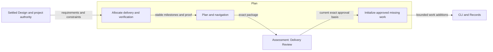
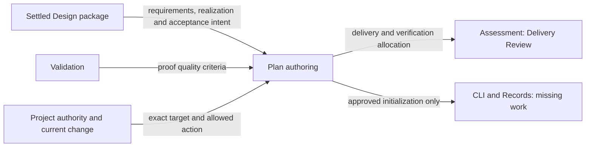
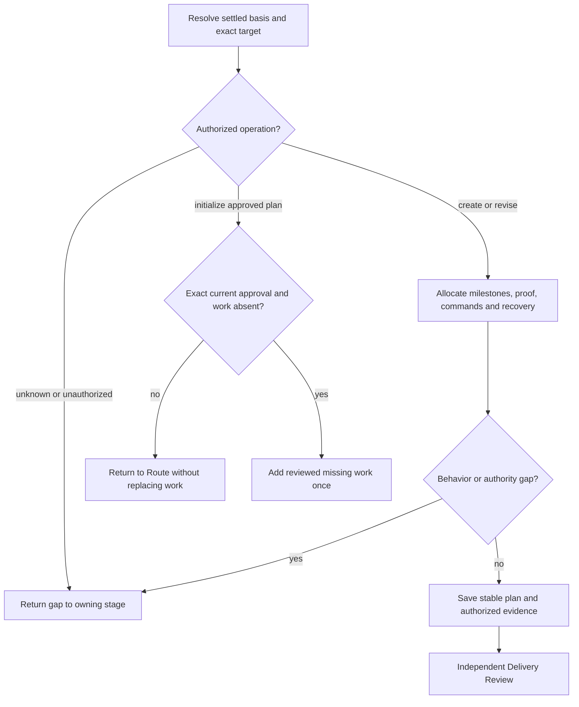

# Plan Design

Model validation contract: model-document-v1

## Introduction and Goals

Plan turns settled engineering requirements and realization into safe implementation milestones and explicit verification allocation. It owns stable execution intent and the narrow initialization of missing work from an exact approved plan. Workflow owns subsequent work coordination and mutable progress.

## Context and Scope

[Skill](../skill.md) owns common capability, resource and evidence-access rules. [Authoring](authoring.md) owns composition; [Workflow](../workflow.md) owns progression and [Assessment](../assessment.md) owns independent judgments. Published skills realize these contracts; model extraction does not rename invocations, change stored formats or grant execution authority.

## Requirements

| ID | Required behavior |
| --- | --- |
| PLAN-SR-01 | Plan MUST allocate settled requirements and architectural boundaries to milestones with dependencies, scope, proof, commands, completion conditions, evidence and recovery as specified below. |
| PLAN-SR-02 | Plan MUST allocate integrated proof where local checks cannot establish the required behavior and MUST include the independent final whole-change review checkpoint without treating tests as its substitute. |
| PLAN-SR-03 | Plan and navigation MUST contain stable intent and pointers; actual results, current work status, blockers and routing MUST remain with their owning records. |
| PLAN-SR-04 | Create, revise and initialize operations MUST resolve exact current targets and authority; malformed or conflicting governed signals MUST stop without portable fallback or cross-owner mutation. |
| PLAN-SR-05 | Initialization MUST add missing work only from the exact current approved Delivery Review plan and MUST NOT duplicate, replace, repair or update existing work. |
| PLAN-SR-06 | Required conditional resources and the three normative plan assets MUST preserve their structure, metadata, fingerprints and package parity; missing resources and unknown operations MUST reject. |
| PLAN-SR-07 | Retries, changed milestones and competing writes MUST preserve existing evidence and require current authority and reassessment; historical plan intent MUST NOT reconstruct current workflow state. |

## Architecture Overview

The overview names the owned method and its external inputs and consumers. Detailed behavior is defined in the sections below; arrows to review identify submitted subjects, not automatic approvals.

| View | Necessity and reason | Owning detail |
| --- | --- | --- |
| Context | Necessary: user authority, upstream basis and independent assessment are separate boundaries. | [Context view](#context-view) |
| Building Block | No separate diagram: this method has no independent internal subsystem; its procedure and output structure provide the required decomposition. | Specialist procedure and output sections below. |
| Runtime | Necessary: classification, authoring, failure and handoff have distinct authority effects. | [Runtime view](#runtime-view) |
| Deployment | No separate deployment: the capability is packaged guidance, not a separately deployed service; source, archive and installation boundaries are unchanged. | [Skill Deployment](../skill.md#deployment-view) and [Packaging](../../engineering/packaging.md). |

## Delivery allocation

Plan owns concrete verification allocation: milestone completion conditions, commands, input prerequisites, proof timing, evidence expectations and side-effect permissions. Allocate integrated checks where local proof cannot establish cross-component, cross-milestone, compatibility, concurrency, recovery, security or authority behavior. Implementation supplies tests and observed results. [Design](design.md#requirement-refinement-and-delivery-allocation) owns the requirement-to-work relationship; [Validation](../../engineering/validation.md) owns proof quality; [Assessment](../assessment.md) owns Delivery Review and final evidence judgments. No one-to-one mapping to test functions or separate test-spec stage is required.

Under SKL-SR-04/08/10/24/27, planning preserves stable execution intent: each milestone identifies its ID and kind, goal, governing requirements and architecture, affected components, dependencies, implementation scope, tests and proof, validation commands and expected results, completion criteria, required evidence, review handoff, risks and rollback or recovery. Include a commit boundary when applicable. Plans contain no current milestone state, command outcomes, validation progress, blockers, review status, routing or closeout progress. Navigation points to the plan and owning change; it never becomes another state owner.

Apply [Conditional resources](../skill.md#conditional-resources). `governed-plan-authoring.md` applies governed procedure; boundary and specialist proof methods retain their own triggers. The three structural assets own labels and layout, never state or authority. The portable/governed and boundary combinations remain independently loadable as `PL0`, `PL0B`, `PL1` and `PL1B`.

Governed planning classifies exactly `create-primary-plan`, `revise-primary-plan` or `initialize-approved-plan`. Creation requires one selected change, settled prerequisites, authoring authority, a normalized intended path and no conflicting file or registration; no prior plan identity is needed for an absent target. Revision requires the exact matching current plan and registration. Ambiguous targets, conflicting primary candidates, stale authority or file/registration asymmetry stop before mutation. Portable planning writes only its plan and navigation, without governed state. Manual and workflow-managed invocations share the same authoring boundary; loading resources grants no authority, and Route owns later coordination.

The sole initialization exception allows plan to add missing implementation work exactly once from a current approved Delivery Review package containing this exact primary plan. Confirm the reviewed subject remains current, its ordered milestone definitions are valid, required corrections are settled and work is absent before explicit `work add` operations. Never initialize an unreviewed draft or replace, repair or update existing work. A nonempty or conflicting result returns to Route without rewriting it; a retry cannot duplicate work or treat changed evidence as the original authorization. Author only the plan and authorized evidence otherwise. Record exact subjects and hand off to Delivery Review without settling review or claiming implementation readiness.

Current [Records](../../cli/records.md) and [CLI](../../cli/cli.md) own identities, registration, revision conflicts and recovery; [Workflow](../workflow.md) owns continuation and subsequent work decisions. Settled changes to milestone ID, order, kind, completion criteria or required evidence require authorized replanning. Historical plan prose cannot reconstruct current work or override change-local state. Preserve old plans and judgments under their original contracts; reading stable historical intent does not enable retired record formats.

Preserve proof of exact creation/revision targets, unknown operations, stale review or authority, absent versus existing work, interrupted or competing writes, no cross-owner mutation, stable plan output and missing triggered resources.

## Plan assets

The three normative plan assets are `plan-skeleton.md`, `milestone.md` and `decision-log-row.md`. The full skeleton owns section order and placeholders, the milestone asset owns repeated delivery structure, and the decision row owns its table shape. COPY entries state when to use each and what to fill. Do not duplicate the full structure in the skill or add a separate handoff-summary asset. Handoff contains one stable owning-record pointer, with mutable state under Workflow/Records. Index links are relative clickable links.

Each asset carries template/version, skill, normative status, structural fingerprint and maintained-alongside metadata. Deterministic checks recompute fingerprints and compare full-skeleton section expectations; structural drift requires reverting or a version/fingerprint update. Assets contain usable structure, never hidden policy or normal customer dependencies on repository internals. Current proof covers valid fill, missing fields, structure drift and package parity. Fixed pilot populations, token-reduction percentages and compulsory historical-plan counts are completed experiment constraints, not future acceptance gates.

## Context view

## Runtime view

These branches describe separate authorized invocations. A successful save does not execute the next branch. Creation/revision cannot initialize unreviewed work; initialization cannot alter existing work or derive authority from stale review. Integrated proof and final whole-change review are separately allocated under Assessment and Validation.

## Acceptance intent

The following outcomes refine SKL-SR-04/08/10/24/27–29 for Plan. SKL-DEC-06 below retains the stable decision for the narrow initialization exception. Plan assets retain their existing metadata and fingerprint contract; extraction does not change their published format or create new asset families.

### Boundary scan and acceptance scenarios

| Dimension | Requirement basis | Distinct outcome to demonstrate |
| --- | --- | --- |
| Input domain | PLAN-SR-01, PLAN-SR-06 | Missing milestone fields or unknown operation values reject; valid assets produce complete output without placeholders. |
| State/lifecycle | PLAN-SR-03, PLAN-SR-05 | An authored plan contains stable intent; initialization with existing work leaves it unchanged and returns to Route. |
| Identity/authority | PLAN-SR-04, PLAN-SR-05 | A changed or unreviewed plan cannot initialize work; exact current review and absence are independently checked. |
| Composition/path | PLAN-SR-01, PLAN-SR-02 | A cross-component requirement receives integrated proof and a separate final review checkpoint with necessary prerequisites. |
| Temporal/retry | PLAN-SR-05, PLAN-SR-07 | Retry after lost response does not duplicate work; changed milestone definitions require authorized replanning. |
| Failure/recovery | PLAN-SR-04, PLAN-SR-07 | File/registration asymmetry or interrupted recording stops dependent mutation and preserves recovery evidence. |
| Compatibility/migration | PLAN-SR-03, PLAN-SR-06, PLAN-SR-07 | Existing plan assets retain their fingerprints and historical plans keep original judgments without enabling retired storage. |
| External/environment | PLAN-SR-01, PLAN-SR-02, PLAN-SR-06 | Commands with external side effects have explicit permission and environment prerequisites; unavailable proof remains visibly unallocated or blocked. |

## Architecture Decisions

| ID | Decision and rationale | Alternatives and consequences |
| --- | --- | --- |
| SKL-DEC-06 | Initialize missing work only from the exact approved Delivery Review plan. Plan derives the initial work, Assessment owns review and Route coordinates subsequent work. | Initializing before review can freeze milestones that review must change. Reviewer-owned initialization mixes judgment with authoring; coordinator-owned derivation duplicates plan semantics. Allowing ordinary plan revision to replace existing work risks losing progress. Current Records/CLI own identities and recovery; the historical no-hash alternative and two-phase settlement protocol are superseded. |
| PLAN-DEC-01 | Extract delivery allocation and Plan assets into one specialist owner under Authoring; preserve SKL-DEC-06 initialization limits. | A second verification-only plan would split sequencing from proof. Keeping both together supports review while Workflow retains current state. |

## Quality and risks

Requirements and representative outcomes guide review; structural validation does not establish semantic adequacy. Incomplete authority or a material upstream conflict stops dependent work with an explicit owner. Shared policy changes require reconciliation with the named owners, and moved documents retain historical approvals only for their original subjects.
