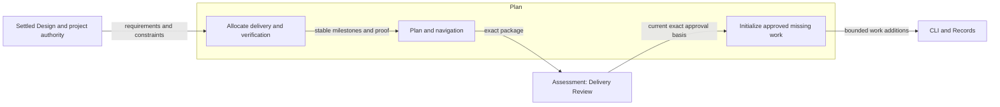
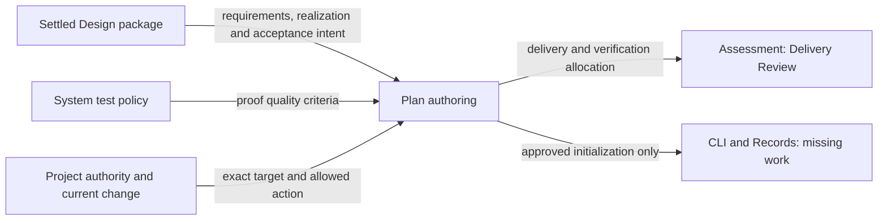
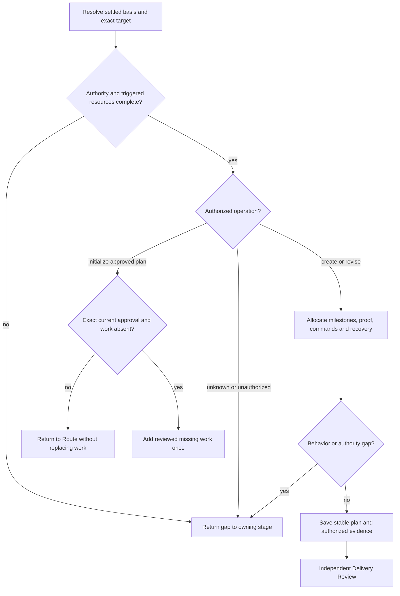

# Plan Design

Model validation contract: model-document-v1

## Introduction and Goals

Plan turns settled engineering requirements and realization into safe implementation milestones and explicit verification allocation. It owns stable execution intent and the narrow initialization of missing work from an exact approved plan. Workflow owns subsequent work coordination and mutable progress.

## Context and Scope

[Skill](../skill.md) owns common capability, resource and evidence-access rules. [Authoring](authoring.md) owns composition; [Workflow](../workflow.md) owns progression and [Assessment](../assessment.md) owns independent judgments. Published skills realize these contracts; model extraction does not rename invocations, change stored formats or grant execution authority.

## Requirements

| ID | Required behavior |
| --- | --- |
| PLAN-SR-01 | Plan MUST consume the approved living test designs and allocate settled requirements and architectural boundaries to milestones with dependencies, scope, executable proof, commands, completion conditions, evidence and recovery. Lasting group rationale, targets, scenarios and fixture strategy remain in the owning Designs; the plan MUST NOT become their sole owner. |
| PLAN-SR-02 | Plan MUST allocate integrated proof where local checks cannot establish the required behavior and MUST include the independent final whole-change review checkpoint without treating tests as its substitute. |
| PLAN-SR-03 | Plan and navigation MUST contain stable intent and pointers; actual results, current work status, blockers and routing MUST remain with their owning records. |
| PLAN-SR-04 | Create, revise and initialize operations MUST resolve exact current targets and authority; malformed or conflicting governed signals MUST stop without portable fallback or cross-owner mutation. |
| PLAN-SR-05 | Initialization MUST add missing work only from the exact current approved Delivery Review plan and MUST NOT duplicate, replace, repair or update existing work. |
| PLAN-SR-06 | Required conditional resources and the three normative plan assets MUST preserve their structure, metadata, fingerprints and package parity; missing resources and unknown operations MUST reject. |
| PLAN-SR-07 | Retries, changed milestones and competing writes MUST preserve existing evidence and require current authority and reassessment; historical plan intent MUST NOT reconstruct current workflow state. |
| PLAN-SR-08 | The Plan entrypoint MUST expose its task, authority, invocation classification and resource selection before detailed recording construction. Its reviewed equivalent layout MUST preserve PLAN-SR-01–07 and applicable common Skill obligations through a complete core procedure, explicitly triggered local methods and unchanged usable output assets; fewer lines or relocated text alone MUST NOT establish improvement. |

## Architecture Overview

The overview names the owned method and its external inputs and consumers. Detailed behavior is defined in the sections below; arrows to review identify submitted subjects, not automatic approvals.

| View | Necessity and reason | Owning detail |
| --- | --- | --- |
| Context | Necessary: user authority, upstream basis and independent assessment are separate boundaries. | [Context view](#context-view) |
| Building Block | No separate diagram: this method has no independent internal subsystem; its procedure and output structure provide the required decomposition. | Specialist procedure and output sections below. |
| Runtime | Necessary: classification, authoring, failure and handoff have distinct authority effects. | [Runtime view](#runtime-view) |
| Deployment | No separate deployment: the capability is packaged guidance, not a separately deployed service; source, archive and installation boundaries are unchanged. | [Skill Deployment](../skill.md#deployment-view) and [Packaging](../../engineering/packaging.md). |

## Delivery allocation

Plan owns concrete verification allocation: milestone completion conditions, commands, input prerequisites, proof timing, evidence expectations and side-effect permissions. Allocate integrated checks where local proof cannot establish cross-component, cross-milestone, compatibility, concurrency, recovery, security or authority behavior. Implementation supplies tests and observed results. [Design](design.md#requirement-refinement-and-delivery-allocation) owns the requirement-to-work relationship; [System](../../system.md#living-test-design-composition) owns shared proof-quality rules; [Validation](../../engineering/validation.md) owns check execution; [Assessment](../assessment.md) owns Delivery Review and final evidence judgments. No one-to-one mapping to test functions or separate test-spec stage is required.

Under SKL-SR-04/08/10/24/27, planning preserves stable execution intent: each milestone identifies its ID and kind, goal, governing requirements and architecture, affected components, dependencies, implementation scope, tests and proof, validation commands and expected results, completion criteria, required evidence, review handoff, risks and rollback or recovery. Include a commit boundary when applicable. Plans contain no current milestone state, command outcomes, validation progress, blockers, review status, routing or closeout progress. Navigation points to the plan and owning change; it never becomes another state owner.

Apply [Conditional resources](../skill.md#conditional-resources). `governed-plan-authoring.md` applies governed procedure; boundary and specialist proof methods retain their own triggers. The three structural assets own labels and layout, never state or authority. The portable/governed and boundary combinations remain independently loadable as `PL0`, `PL0B`, `PL1` and `PL1B`.

Governed planning classifies exactly `create-primary-plan`, `revise-primary-plan` or `initialize-approved-plan`. Creation requires one selected change, settled prerequisites, authoring authority, a normalized intended path and no conflicting file or registration; no prior plan identity is needed for an absent target. Revision requires the exact matching current plan and registration. Ambiguous targets, conflicting primary candidates, stale authority or file/registration asymmetry stop before mutation. Portable planning writes only its plan and navigation, without governed state. Manual and workflow-managed invocations share the same authoring boundary; loading resources grants no authority, and Route owns later coordination.

The sole initialization exception allows plan to add missing implementation work exactly once from a current approved Delivery Review package containing this exact primary plan. Confirm the reviewed subject remains current, its ordered milestone definitions are valid, required corrections are settled and work is absent before explicit `work add` operations. Never initialize an unreviewed draft or replace, repair or update existing work. A nonempty or conflicting result returns to Route without rewriting it; a retry cannot duplicate work or treat changed evidence as the original authorization. Author only the plan and authorized evidence otherwise. Record exact subjects and hand off to Delivery Review without settling review or claiming implementation readiness.

Current [Records](../../cli/records.md) and [CLI](../../cli/cli.md) own identities, registration, revision conflicts and recovery; [Workflow](../workflow.md) owns continuation and subsequent work decisions. Settled changes to milestone ID, order, kind, completion criteria or required evidence require authorized replanning. Historical plan prose cannot reconstruct current work or override change-local state. Preserve old plans and judgments under their original contracts; reading stable historical intent does not enable retired record formats.

Preserve proof of exact creation/revision targets, unknown operations, stale review or authority, absent versus existing work, interrupted or competing writes, no cross-owner mutation, stable plan output and missing triggered resources.

## Authoring presentation

Scoped direction: [Design and Plan simplification](../../../proposals/2026-09-15-design-plan-simplification.md). This section selects a Plan-specific equivalent under SKL-SR-03/04/07/12; it does not inherit the Implement/Code Review approval or change another capability's layout. The [owning change](../../../changes/2026-09-15-design-plan-simplification/change.json) carries current assessment and delivery evidence.

### Core and conditional guidance

Keep `Workflow role`, `Invocation classification`, `Recording boundary`, `Plan quality contract`, `Resource map` and `Expected output` as explicit sections. Arrange role, scope, required inputs and classification before recording construction; use one operating sequence for target resolution, basis inspection, allocation, asset filling, coherence checks and exact review handoff. Consolidated scope/inputs and output/handoff/stops sections may replace the corresponding generic headings while preserving their functional duties. Keep the adopted Test criteria and Review and Closeout applications intact and discoverable before dependent judgments.

Move the complete existing `Explicit recording` profile into `references/governed-plan-authoring.md`, replacing that reference's dependence on a parent-owned context procedure. The reference becomes self-contained for scoped context, subject inspection, response dispatch, record contract, revision/reads, targeted recording, applicability and recovery. Its existing create/revise and approved-initialization duties remain distinct. No new reference, record operation, shared policy or runtime selector is introduced.

The body keeps the portable/governed distinction, exact operation names, prerequisite checks, narrow initialization limit and essential stops. Its `Recording boundary` and READ trigger select the existing governed reference only for valid governed plan authority; a governed signal must be validated before dependent writes. Missing, malformed, stale, conflicting or ambiguous authority prevents portable fallback. Boundary and specialist verification methods retain independent triggers; neither the presence of a plan nor recording establishes automation or permission to initialize work. A late trigger requires its complete method before dependent action.

| Original obligation group | Selected destination and preservation |
| --- | --- |
| Purpose, near misses, workflow role, project evidence and target placement | Body scope/inputs and classification: settled direction and exact approved Design basis remain prerequisites; portable plan/navigation and governed record paths stay distinguishable. |
| Complete recording construction before the task | Existing governed reference, with its `Explicit recording` profile; body selection and stops remain sufficient to choose safely without reconstructing the method. |
| Plan quality and repeated milestone/boundary allocation reminders | Keep the full quality contract and compact operating sequence; remove only a repetition whose governing requirement and remaining instruction are explicit. Preserve safe sequencing before proof allocation, integrated proof, final whole-change review and recovery. |
| Three normative COPY assets, output skeleton, expected output and handoff reminders | Existing assets retain all fields, metadata and fingerprints. One body output/handoff account retains operation, exact subject, author-owned evidence, blockers and Delivery Review destination; it does not duplicate full assets or move policy into them. |
| Isolation, claims, stops, approved initialization and retry limits | Keep essential limits visible before action and complete operation-specific procedure in the governed reference. Plan cannot settle review, change existing work or route later stages. |
| Shared quality, review reliance, boundary and evidence-access guidance | Preserve current sources, adoption and READ conditions, complete-subject reading and all required local copies. No shared wording change is selected. |

The three plan assets and specialist resource set remain unchanged. Public descriptions, operation values and output meaning are preserved. A missing untriggered resource need not block unrelated portable runtime work, but an incomplete distributed package still fails qualification. A shorter body that forces unnecessary reference reads is not an acceptable implementation of PLAN-SR-08.

### Design retention and handoff compatibility

The related `design` package is retained. Its entrypoint already selects scope and authority before its six-step reconciliation procedure and loads recording conditionally. The model-authoring reference owns document rules and examples; technical-design owns significant realization reasoning; architecture-view-examples supplies concrete illustrations. Their repeated overview reminders protect different selection and execution points. Legacy references supply separately triggered customer contracts. No identified overlap justifies merging those methods, weakening their triggers or changing Design outputs in this slice. This retention is subject to independent assessment of the complete package, not inferred from its size or prior approval.

Design still hands Design Review the exact affected models and examples, required behavior and realization, decisions, assessment basis, acceptance intent, assumptions and applicability impacts. Plan consumes the currently approved exact Design package and turns its requirements and local/integrated outcomes into stable delivery allocation. Delivery Review still consumes that plan, the approved Design basis and verification allocation. An absent or stale required member stops the first dependent author or reviewer; a shorter handoff cannot omit it. The living-test-design refinement requires dependent reviewer guidance to consume current coverage intent while preserving record formats and review authority. Review judgments and workflow transitions remain Assessment- and Workflow-owned.

### Consumer reconciliation and acceptance intent

The current recording-profile reader in `scripts/lib/validation/skill_validation.py` selects four skill-local references and otherwise checks an inline `Explicit recording` section. Extend its selected-reference protection to Plan's existing governed reference so removal of that heading cannot bypass the profile check. Preserve a mapped body boundary and load condition; require complete procedure in the selected contained file, not an unrelated file or remembered instructions. Reconcile the installed-placement and plan-surface readers that also branch on the inline heading, and the applicable normalized-layout checks, with this exact Plan equivalent. Other capabilities retain their existing selection and layout protection.

Existing validation must continue to reject unknown values before consistency checks and distinguish missing, unreadable, escaped, unmapped, wrong or incomplete selected procedure. Preserve current `change.json` placement and navigation/plan/state separation after relocation. Incidental wording assertions may change only while retaining their protection. Existing generation must carry the complete Plan and retained Design packages with supported adapter transformations, transitive resources and byte parity. No generator, manifest, installer or document format change is selected.

Representative assessment follows a portable create/revise request, a valid governed create/revise request, and approved initialization with absent versus existing work. Each must identify task and authority before recording detail, reach all applicable instructions, produce complete output and stop on missing or conflicting basis. Separately assess late resource selection and failed/retried recording without cross-owner mutation. Integrated assessment traces actual Design output through Design Review into Plan, then the actual Plan asset output into Delivery Review; local heading checks cannot prove this correspondence. Delivery allocates concrete proof and independent semantic observation under existing policy; no separate project-use pilot, token score or new recurring gate is required.

Existing Context and Runtime views remain necessary; the runtime view below exposes resource selection before operation. The overview's allocation/output/initialization responsibilities and external edges are unchanged. No additional Building Block diagram is needed: the destination table describes instruction placement within one method. Deployment remains owned by Skill and Packaging because this adds no artifact family or execution environment. Authoring/System composition, Assessment, Workflow, CLI/Records and Packaging retain their existing interfaces and examples; their policy and output contracts are unaffected. A later discovery that changes those interfaces returns to its owner before dependent implementation.

## Living test design and execution allocation

Consume [Design DES-SR-25/26](design.md#living-test-design), [System TEST-SR-21–23](../../system.md#requirements) and the [shared selection procedure](../../test-design/rules.md#select-requirements-and-proof). A plan references the current model-owned behavior groups and explicit gaps, then allocates implementation slices, concrete commands, input prerequisites, proof timing, evidence and recovery. For each affected supported requirement and material interaction, identify the selected scenario or explicit gap, the observation capable of exposing its violation and its concrete execution or independent assessment allocation. Risk guides depth and sequencing; timing measurements guide efficient realization without dropping required proof. Existing semantic procedures require real subject/output assessment, not an invented executable command. A plan can introduce a justified additional test and must route a missing behavioral decision to Design. It must not duplicate every model's durable test table, invent coverage from a planned filename or require a private-function case quota.

Changing supported behavior, coverage ownership or intended observations requires the owning Design update; changing execution timing/commands without altering those obligations stays in Delivery. At completion the model's realization links reflect actual test groups, while observed results stay in records. Review this transfer explicitly when tests move or consolidate. The plan and its three assets retain their existing format and fields; reconcile their instructions and consumers with these responsibilities without creating another normative test-spec asset. The earlier focused application selected Release, Skill and Authoring. The separately approved complete-model direction now applies this method across the current model inventory; it does not extend that earlier approval or authorize compatibility retirement.

## Plan assets

The three normative plan assets are `plan-skeleton.md`, `milestone.md` and `decision-log-row.md`. The full skeleton owns section order and placeholders, the milestone asset owns repeated delivery structure, and the decision row owns its table shape. COPY entries state when to use each and what to fill. Do not duplicate the full structure in the skill or add a separate handoff-summary asset. Handoff contains one stable owning-record pointer, with mutable state under Workflow/Records. Index links are relative clickable links.

Each asset carries template/version, skill, normative status, structural fingerprint and maintained-alongside metadata. Deterministic checks recompute fingerprints and compare full-skeleton section expectations; structural drift requires reverting or a version/fingerprint update. Assets contain usable structure, never hidden policy or normal customer dependencies on repository internals. Current proof covers valid fill, missing fields, structure drift and package parity. Fixed pilot populations, token-reduction percentages and compulsory historical-plan counts are completed experiment constraints, not future acceptance gates.

## Context view

## Runtime view

These branches describe separate authorized invocations. A successful save does not execute the next branch. Creation/revision cannot initialize unreviewed work; initialization cannot alter existing work or derive authority from stale review. Integrated proof and final whole-change review are separately allocated under Assessment and System’s testing policy, with execution supplied by Validation.

## Acceptance intent

The following outcomes refine SKL-SR-04/08/10/24/27–29 for Plan. SKL-DEC-06 below retains the stable decision for the narrow initialization exception. Plan assets retain their existing metadata and fingerprint contract; extraction does not change their published format or create new asset families.

### Boundary scan and acceptance scenarios

| Dimension | Requirement basis | Distinct outcome to demonstrate |
| --- | --- | --- |
| Input domain | PLAN-SR-01, PLAN-SR-06, PLAN-SR-08 | Missing milestone fields or unknown operation values reject; valid assets produce complete output without placeholders. Core task and selection precede detailed recording construction. |
| State/lifecycle | PLAN-SR-03, PLAN-SR-05 | An authored plan contains stable intent; initialization with existing work leaves it unchanged and returns to Route. |
| Identity/authority | PLAN-SR-04, PLAN-SR-05 | A changed or unreviewed plan cannot initialize work; exact current review and absence are independently checked. |
| Composition/path | PLAN-SR-01, PLAN-SR-02, PLAN-SR-08 | A cross-component requirement receives integrated proof and a separate final review checkpoint with necessary prerequisites. Actual Design output and current review basis remain sufficient Plan inputs; complete Plan output remains sufficient Delivery Review input. |
| Temporal/retry | PLAN-SR-05, PLAN-SR-07 | Retry after lost response does not duplicate work; changed milestone definitions require authorized replanning. |
| Failure/recovery | PLAN-SR-04, PLAN-SR-06, PLAN-SR-07, PLAN-SR-08 | File/registration asymmetry or interrupted recording stops dependent mutation and preserves recovery evidence. Missing or invalid selected procedure stops dependent action; heading removal cannot bypass recording checks or restore retired placement. |
| Compatibility/migration | PLAN-SR-03, PLAN-SR-06, PLAN-SR-07 | Existing plan assets retain their fingerprints and historical plans keep original judgments without enabling retired storage. |
| External/environment | PLAN-SR-01, PLAN-SR-02, PLAN-SR-06 | Commands with external side effects have explicit permission and environment prerequisites; unavailable proof remains visibly unallocated or blocked. |

### Test design

The groups account for PLAN-SR-01–08 through delivery adequacy, exact initialization authority and usable resources. Planning defects can leave a required observation unexecuted or replace live work, so package shape and actor decisions need separate proof. The common [Authoring fixture](test-design/test-design.md#synthetic-artifact-fixture) supplies independently expected import outcomes; model IDs and review identities are synthetic labels, not approvals of repository work.

| Group and requirement basis | Scenario, plausible defect and independent observation | Fixture and method | Realization and limits |
| --- | --- | --- | --- |
| Complete proof allocation; PLAN-SR-01, PLAN-SR-02 | Allocate the valid/invalid batch requirements from the approved fixture. A candidate plan that runs only row-parser checks misses the middle-row rejection plus unchanged destination; a complete plan allocates that real destination observation after its prerequisites and names separate final whole-change review before Verify. Contrast a prose responsibility: its explicit independent procedure and evidence belong in allocation, without a fabricated automated test. | Inspect actual filled plan assets against model scenarios and known incorrect partial-write state; use a dependency walkthrough, not a count of requirement IDs. | Proposed local procedure, with AUTH-RF-003/004 covering transfer from Design. [Authority](../../../../tests/skill/skill_authority_tests.py) and [shared-policy tests](../../../../tests/skill/skill_shared_policy_tests.py) protect allocation instructions only. |
| Stable complete artifacts; PLAN-SR-03, PLAN-SR-06 | Fill a milestone with dependencies, commands, expected observations, evidence and recovery. Missing fields/unfilled placeholders fail its contract. Separate copies containing actual pass results or current work status fail state separation; navigation resolves the exact plan and owning record without copying progress. | Fresh outputs from the three normative assets; structural validation against independently specified required fields, then semantic review of filled content. | [Asset tests](../../../../tests/skill/skill_asset_tests.py) exercise metadata, fingerprints and skeleton shape; [Plan guidance tests](../../../../tests/skill/skill_plan_guidance_tests.py) inspect stable-intent fields. Emitted-artifact semantic completeness remains proposed. |
| Target resolution and initialization; PLAN-SR-04, PLAN-SR-05 | Contrast absent portable create, exact governed revise and current approved initialization. For initialization, stale review, conflicting registration and existing work each stop before additions; the valid absent-work packet adds exactly the reviewed milestones once. Unknown operations reject before target-consistency inference; an invalid governed signal never falls back to portable writes. | Fresh private plan/work packets with independently declared milestone IDs M1/M2, reviewed P0 and changed P1, and sentinel existing work. Decision table observes allowed write sets and preserved entries. | Proposed independent procedure; [Plan guidance](../../../../tests/skill/skill_plan_guidance_tests.py) protects selected instructions, while CLI owns mechanical work-add/revision protection. No runtime author-decision coverage is claimed. |
| Retry and changed basis; PLAN-SR-05, PLAN-SR-07 | After a successful initialization whose response is lost, reread populated work and return to Route without duplicate additions. Separately change milestone order or completion conditions after review: require authorized replanning and preserve old evidence. Interrupted/ambiguous recording retains recovery information without repairing another owner's work. | Ordered operations within one synthetic walkthrough; fresh copies for lost response, stale basis and recovery-required responses. Expected work identities and preserved evidence come from the starting packet. | Proposed procedure; [CLI](../../cli/cli.md#test-design) supplies persistence behavior, not the Plan actor's judgment. |
| Reachable complete procedure; PLAN-SR-06, PLAN-SR-08 | From a complete customer package, follow portable creation and governed initialization, including a late proof-method trigger. Each path exposes task/authority before recording detail and reaches all required instructions. Remove or misselect the governed reference: dependent action stops even when matching words exist elsewhere. | Actual canonical/installed package reading paths; independently compare reachability and output duties. Private package copies support real malformed-resource validation. | [RecordingReferenceContractTests and RelocatedPlanSurfaceTests](../../../../tests/skill/skill_contract_tests.py) exercise selected-reference protection; [asset tests](../../../../tests/skill/skill_asset_tests.py) cover package assets. Useful reading-path improvement remains independent assessment under PLAN-SR-08. |

Do not recreate historical pilot corpus or token-budget obligations: PLAN-SR-08's current completeness and usable-path duties survive, while scoped before/after evidence belongs to its owning change. Local command syntax and resource validation cannot establish a safe plan. Record semantic procedure results against actual subjects through the existing evidence owner. The overview's allocation, output and narrow initialization boundaries and existing Context/Runtime views remain sufficient; package deployment remains external.

## Architecture Decisions

| ID | Decision and rationale | Alternatives and consequences |
| --- | --- | --- |
| SKL-DEC-06 | Initialize missing work only from the exact approved Delivery Review plan. Plan derives the initial work, Assessment owns review and Route coordinates subsequent work. | Initializing before review can freeze milestones that review must change. Reviewer-owned initialization mixes judgment with authoring; coordinator-owned derivation duplicates plan semantics. Allowing ordinary plan revision to replace existing work risks losing progress. Current Records/CLI own identities and recovery; the historical no-hash alternative and two-phase settlement protocol are superseded. |
| PLAN-DEC-01 | Extract delivery allocation and Plan assets into one specialist owner under Authoring; preserve SKL-DEC-06 initialization limits. | A second verification-only plan would split sequencing from proof. Keeping both together supports review while Workflow retains current state. |
| PLAN-DEC-02 | Select the bounded Plan layout and move complete recording construction into its existing governed reference. Retain the Design package with explicit rationale and assess the actual author/reviewer handoffs. | Keeping recording before task selection retains unnecessary reading; a new reference duplicates an existing owner. Applying the same layout to Design adds no established benefit. Required selection, output and authority remain visible and complete. |

## Quality and risks

Requirements and representative outcomes guide review; structural validation does not establish semantic adequacy. Incomplete authority or a material upstream conflict stops dependent work with an explicit owner. Shared policy changes require reconciliation with the named owners, and moved documents retain historical approvals only for their original subjects.
