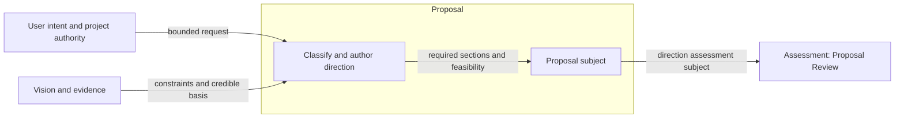
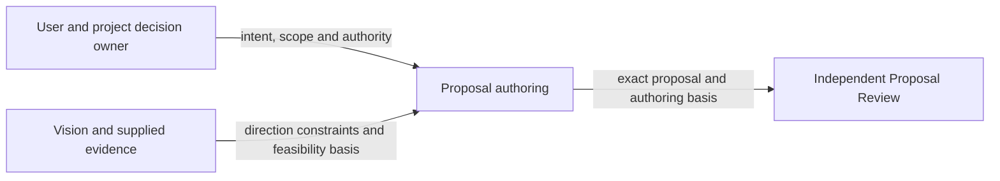
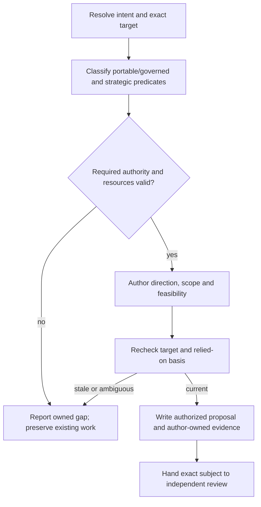

# Proposal Design

Model validation contract: model-document-v1

## Introduction and Goals

Proposal turns user intent into a bounded direction decision with sufficient scope, principle and feasibility to support responsible Design. It owns proposal content and authoring procedure, including portable and governed targets. Detailed engineering design and delivery allocation remain with their sibling models.

## Context and Scope

[Skill](../skill.md) owns common capability, resource and evidence-access rules. [Authoring](authoring.md) owns composition; [Workflow](../workflow.md) owns progression and [Assessment](../assessment.md) owns independent judgments. Published skills realize these contracts; model extraction does not rename invocations, change stored formats or grant execution authority.

## Requirements

| ID | Required behavior |
| --- | --- |
| PROP-SR-01 | Proposal MUST express the challenge, goals, bounds, governing principle, selected direction, feasibility and requested decision using the content contract below. |
| PROP-SR-02 | Proposal MUST preserve approved scope and disclose material feasibility, vision and scope uncertainties without silently selecting detailed implementation or deferring required goals. |
| PROP-SR-03 | Authoring MUST classify exact create/revise targets and governed signals before mutation, reject ambiguous or invalid authority without portable fallback, and preserve unrelated artifacts. |
| PROP-SR-04 | All applicable strategic predicates and required resources MUST be classified and loaded before dependent work; unknown predicate values and missing required resources MUST reject. |
| PROP-SR-05 | Governed writes MUST use current exact subjects and supported recording/recovery interfaces; retries and competing writes MUST not retarget approval or mutate another owner’s state. |
| PROP-SR-06 | Outputs MUST remain direction-level artifacts with explicit limits; portable output MUST not create lifecycle state, and recording MUST NOT grant review approval or continuation. |

## Architecture Overview

The overview names the owned method and its external inputs and consumers. Detailed behavior is defined in the sections below; arrows to review identify submitted subjects, not automatic approvals.

| View | Necessity and reason | Owning detail |
| --- | --- | --- |
| Context | Necessary: user authority, upstream basis and independent assessment are separate boundaries. | [Context view](#context-view) |
| Building Block | No separate diagram: this method has no independent internal subsystem; its procedure and output structure provide the required decomposition. | Specialist procedure and output sections below. |
| Runtime | Necessary: classification, authoring, failure and handoff have distinct authority effects. | [Runtime view](#runtime-view) |
| Deployment | No separate deployment: the capability is packaged guidance, not a separately deployed service; source, archive and installation boundaries are unchanged. | [Skill Deployment](../skill.md#deployment-view) and [Packaging](../../engineering/packaging.md). |

## Proposal content

Under SKL-SR-24/27, a current proposal has one title and exactly these required level-two sections in order: `Challenge`, `Goals`, `Scope and non-goals`, `Governing principle`, `Proposed direction`, `Feasibility`, and `Decision requested`. `Impact and major trade-offs` is the only optional level-two section; include it between Feasibility and Decision requested only when it could materially affect approval. Deeper headings may organize those sections. Unknown, duplicated or misordered required sections are invalid.

Feasibility must contain a proportionate assessment, credible evidence or bounded assumptions, material constraints and blockers to responsible Design. A proposal fixes direction and approval-relevant impacts; it does not prescribe detailed requirements, APIs, schemas, architecture, implementation sequencing, tests or rollout mechanics. Decision sufficiency determines depth, with no fixed length or token budget. Material vision issues belong in Impact and major trade-offs and Decision requested; Assessment owns the review judgment.

This repository's current proposal content contains no `Status`, `Owning change record`, routine `Vision fit` or reverse ownership pointer. Other projects may require a stable ownership pointer through their governing artifact convention; mutable lifecycle metadata stays in records. Portable proposals need no record or CLI call. Governed records identify the proposal and own its lifecycle under Records; recording grants no downstream approval. Historical settled proposals retain their original contract and bytes. Existing cutover classification remains applicable to historical or unsettled proposals without a new document-version marker or forced rewrite.

## Proposal procedure

Under SKL-SR-04/05/08/10/24/27, proposal authoring supports exactly `create-primary-proposal` and `revise-primary-proposal`. Resolve one normalized exact target; portable creation requires absence and revision requires the intended existing artifact. Ambiguity stops. Portable authoring writes only the proposal, without lifecycle, review, automation or routing state. An explicit change ID, workflow-managed exact change or structured owning-change pointer selects governed procedure; conversational wording alone does not. Missing, malformed, stale or conflicting governed authority stops without portable fallback. Reclassify a late governed signal before dependent work.

Apply [Conditional resources](../skill.md#conditional-resources). `governed-proposal-authoring.md` applies governed authority, recording and recovery; `strategic-and-scope-gates.md` applies strategic procedure; `proposal-skeleton.md` owns structure. The four procedure assemblies are `PA0-portable`, `PA0G-portable-gated`, `PA1-governed` and `PA1G-governed-gated`, independently adding governed and strategic references.

Specialized predicates are exactly `vision_exception_context`, `standing_artifact_context`, `initial_intent_table_context` and `scope_budget_context`. The author judges applicability; deterministic validation checks vocabulary and structure, never semantic truth. Apply every true predicate and load strategic procedure once for any nonempty set. Complete late classification before dependent drafting or readiness; unresolved material ambiguity stops. Broad or multipart intent activates detailed intent treatment. Scope classification covers multiple independent items, lifecycle families or downstream artifacts, workflow/release/validation policy, generated output, public skill behavior, or a review concern about hidden follow-up, silent narrowing or multiple workstreams. Apply the work-item treatment and follow-up rules in [Evidence access and proportional effort](../skill.md#evidence-access-and-proportional-effort) within the allowed proposal sections.

Governed authoring binds the exact change, proposal path, current governing inputs, prior identity for revision, authoring evidence and applicable authority before writing. Verify absence and no competing primary target for creation. Preserve historical reviews, unrelated artifacts and completed evidence; a changed proposal needs current assessment of its new identity. Workflow owns decisions about downstream reliance and reopening; the author never retargets an earlier judgment. Current registration, revision conflicts, retries and storage recovery follow [Records](../../cli/records.md) and [CLI](../../cli/cli.md). Reread and reassess stale or competing writes, preserve partial evidence and stop on ambiguous outcomes. A retry cannot silently adopt a different path, basis or transaction. Cleanup grants no reset authority: recovery must identify the exact authorized surfaces and preserve other owners' state.

Preserve proof of exact portable targets, authority rejection without fallback, independent and late resource triggers, unknown predicates, partial/conflicting recording and resource failure.

## Context view

## Runtime view

The author applies every triggered strategic predicate before dependent drafting. A newly arriving governed signal requires reclassification; a saved proposal or prior review does not authorize downstream Design. Required resource failures stop the dependent invocation under Skill's common contract.

## Acceptance intent

The following outcomes refine SKL-SR-04/05/08/10/24/27 for Proposal. Existing common Skill requirements retain their IDs and applicability. Proposal's structural resources implement the content contract; its authoring skill and conditional methods implement classification and safe writes. Assessment supplies Proposal Review criteria independently.

### Boundary scan and acceptance scenarios

| Dimension | Requirement basis | Distinct outcome to demonstrate |
| --- | --- | --- |
| Input domain | PROP-SR-01, PROP-SR-04 | Missing, duplicated or unknown sections/predicates reject; valid conditional impact appears only when needed. |
| State/lifecycle | PROP-SR-03, PROP-SR-06 | Portable create/revise changes only its exact proposal; governed work uses its selected current record contract. |
| Identity/authority | PROP-SR-03, PROP-SR-05 | A stale or conflicting target stops without replacing another proposal or inheriting its approval. |
| Composition/path | PROP-SR-02, PROP-SR-04 | Multiple independent goals trigger scope treatment; the complete required resource set supports the selected assembly. |
| Temporal/retry | PROP-SR-04, PROP-SR-05 | A late governed signal or changed subject causes reclassification/reassessment before further writes. |
| Failure/recovery | PROP-SR-03, PROP-SR-05 | Interrupted or ambiguous recording preserves partial evidence and returns to supported recovery without reset. |
| Compatibility/migration | PROP-SR-01, PROP-SR-06 | Historical proposals retain their original bytes and contract; current authoring does not force retrospective sections. |
| External/environment | PROP-SR-02, PROP-SR-04 | Unavailable external feasibility evidence remains an explicit bounded assumption or blocker; missing packaged methods stop dependent work. |

## Architecture Decisions

| ID | Decision and rationale | Alternatives and consequences |
| --- | --- | --- |
| PROP-DEC-01 | Extract Proposal’s direction contract under Authoring while retaining common Skill policy and Assessment review ownership. | Keeping all specialist prose in Skill obscures the owner; duplicating it would create competing contracts. The extracted model adds focused review scope without adding a workflow stage. |

## Quality and risks

Requirements and representative outcomes guide review; structural validation does not establish semantic adequacy. Incomplete authority or a material upstream conflict stops dependent work with an explicit owner. Shared policy changes require reconciliation with the named owners, and moved documents retain historical approvals only for their original subjects.
