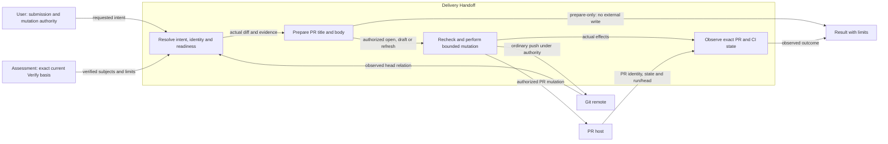
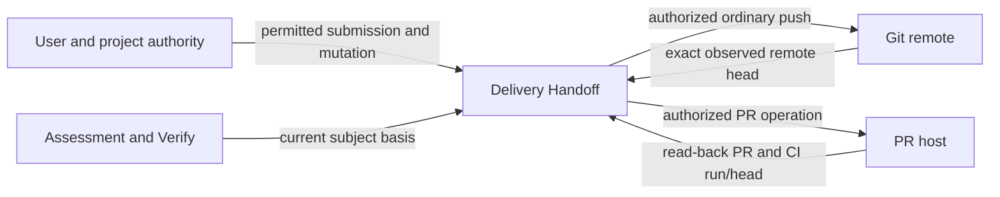
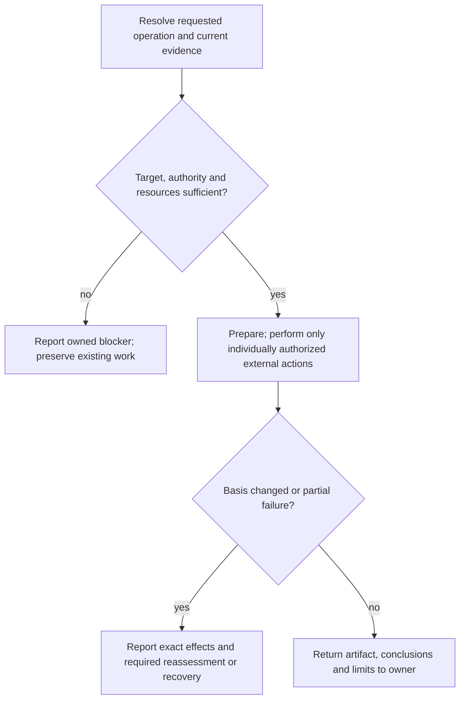

# Delivery Handoff Design

Model validation contract: model-document-v1

## Responsibility and scope

Delivery Handoff owns the existing `pr` capability’s scoped behavior, output and failure boundaries. Its detailed procedure below preserves the current specialist contract.

Parent: [Skill](skill.md). [Skill](skill.md) retains shared invocation, evidence-access, resource and portability rules. [Workflow](workflow.md) coordinates authorized activity; [Assessment](assessment.md) owns independent judgment and reliance. This decomposition changes no public invocation, stored format or external permission.

## Requirements

| ID | Required behavior |
| --- | --- |
| HAND-SR-01 | Delivery Handoff MUST distinguish prepare-only, open and draft intent; preparation MUST cause no external mutation and a blocked open/draft MUST NOT be reported as successful preparation. |
| HAND-SR-02 | External actions MUST be bound to current verified subjects and explicit authority; branch relation, existing PR, refresh and state-transition constraints MUST be checked before each action. |
| HAND-SR-03 | Retry and result claims MUST reflect exact observed remote/PR/CI state, preserve successful partial effects and stop on ambiguity or drift without force-push, merge or release publication. |

## Architecture Overview

The overview identifies the owned responsibility and external authority/evidence boundaries. Detailed behavior is in the contract sections below; output does not imply adoption or approval.

| View | Necessity and reason | Owning detail |
| --- | --- | --- |
| Context | Necessary: verified local subjects, Git remote and PR host have separate authority and observation boundaries. | [Context view](#context-view). |
| Building Block | No separate diagram: classification and the specialist operation form one method; no separate internal subsystem is selected. | [Specialist contract](#specialist-contract). |
| Runtime | Necessary: authority, resource failures and partial or blocked outcomes must remain distinct from successful handoff. | [Runtime view](#runtime-view). |
| Deployment | No separate diagram: this is published guidance, not a separately deployed service. External host mutation is governed by the PR contract below. | [Skill Deployment](skill.md#deployment-view). |

## Specialist contract

PR distinguishes `open`, `draft` and `prepare-only`; explicit pr defaults to open. Preparation has no external mutation. Exact verified repository/remote/base/merge-base/head/subject identities from Verify are required before opening; evidence-tail compatibility follows Assessment's current contract. Resolve actual diff, clean handoff, current remote base, directional head relationship and matching PR. Only absent or ancestor remote heads permit an ordinary push; ahead/diverged/ambiguous state stops. Recheck before push and before host mutation, then read back exact PR/head/base/title/body/state before a result claim. Adequate open/draft PRs are reused; refresh and state conversion each need their own matching authority. Closed/merged/ambiguous matches do not permit reopening or duplicate creation. Retry reconciles observed state. Successful external writes remain reported even if later identity drift blocks readiness. Hosted CI success needs the exact observed run/head. PR does not force-push, merge, publish releases, alter governing state or substitute for Verify.

## Interface vocabulary and outputs

The following public domains retain their existing meanings. Unknown values reject before consistency checks; recognized values still require the operation’s authority and prerequisites.

| Capability / independent axis | Supported values |
| --- | --- |
| PR submission | open, draft, prepare-only |
| PR refresh authority | none, explicit-title-refresh, explicit-full-replacement, workflow-title-refresh |
| PR state-transition authority | none, publish-existing-draft, convert-existing-open-to-draft |
| PR remote branch relation | absent, same, remote-ancestor-of-local, local-ancestor-of-remote, diverged, ambiguous |
| PR state | absent, open, draft, closed, merged, ambiguous |
| PR operation result | opened, draft-opened, updated, reused, prepared-not-opened, blocked |
| PR hosted-CI state | passed, failed, pending, unavailable, unobserved, not-applicable |
| PR evidence suffix | none, evidence-only, invalidating |

PR reports requested intent, actual operation, actual_external_mutation or none, actual PR state or none, pr-body-ready, pr-open-ready, hosted-CI state, blockers, read-back URL and claim limits. Preparation returns prepared-not-opened with no external mutation. Requested open/draft cannot silently become successful preparation on a blocker. Existing draft/open state is preserved without independent transition authority. Refresh supports only an authorized title or whole-body replacement; no managed-section parser or implied content ownership is introduced. Core PR body groups remain Summary, Why, What changed, Tests and verification, Risks and rollback, Reviewer notes and Follow-ups; governed traceability and material-impact groups are conditional. Required unresolved data blocks opening; no placeholder is emitted.

Governed-signal classification remains shared with Bugfix under [Skill’s shared interface vocabulary](skill.md#specialist-interface-vocabulary-and-outputs). The [bounded PR CI-repair exception](skill.md#bounded-pr-ci-repair) remains owned by CI maintenance; this model consumes its exact result and Assessment’s continued-reliance judgment without granting repair or external authority. Delivery Handoff covers the PR capability; release publication remains with Engineering Release.

## Context view

A host observation cannot substitute for the required Verify basis. Local preparation alone grants neither push nor host-mutation authority. Release publication remains outside this boundary.

## Runtime view

The specialist contract determines the permitted action and retry, including read-only or preparation-only operations. A successful artifact write does not grant downstream execution. Reconcile changed basis before dependent work and report partial effects truthfully.

### Boundary scan and acceptance scenarios

| Dimension | Requirement basis | Distinct outcome to demonstrate |
| --- | --- | --- |
| Input domain | HAND-SR-01, HAND-SR-02, HAND-SR-03 | Unknown or ambiguous submission/branch/PR states reject before mutation eligibility. |
| State/lifecycle | HAND-SR-01, HAND-SR-02, HAND-SR-03 | Prepare-only changes no external state; adequate existing PRs retain their actual state. |
| Identity/authority | HAND-SR-01, HAND-SR-02, HAND-SR-03 | Missing current Verify identity or refresh/state-transition authority blocks the corresponding action. |
| Composition/path | HAND-SR-01, HAND-SR-02, HAND-SR-03 | A completed bounded CI repair is consumed only under Assessment’s still-applicable decision basis. |
| Temporal/retry | HAND-SR-01, HAND-SR-02, HAND-SR-03 | Recheck head/base and authorization before push and host mutation; retries reconcile the observed PR. |
| Failure/recovery | HAND-SR-01, HAND-SR-02, HAND-SR-03 | A successful external write followed by identity drift is reported as a partial effect, not erased. |
| Compatibility/migration | HAND-SR-01, HAND-SR-02, HAND-SR-03 | Closed/merged matches do not authorize reopening or duplicate creation; evidence suffix compatibility remains Assessment-owned. |
| External/environment | HAND-SR-01, HAND-SR-02, HAND-SR-03 | Hosted success requires the exact observed run/head; unavailable host state cannot be fabricated. |

## Architecture Decisions

| ID | Decision and rationale | Alternatives and consequences |
| --- | --- | --- |
| HAND-DEC-01 | Give Delivery Handoff one explicit current owner while retaining shared Skill policy and the specialist’s existing authority boundaries. | Keeping unrelated support duties together obscures responsibility. Duplicating their details in Skill would create competing owners; scoped extraction requires reconciled navigation and review. |

## Quality and limits

Review outcomes against actual inputs, authority and observable effects; structural checks alone do not establish adequacy. Preserve historical subjects, existing public vocabulary and required resource behavior. Unresolved material authority or evidence gaps stop dependent claims rather than inventing a successful outcome.
