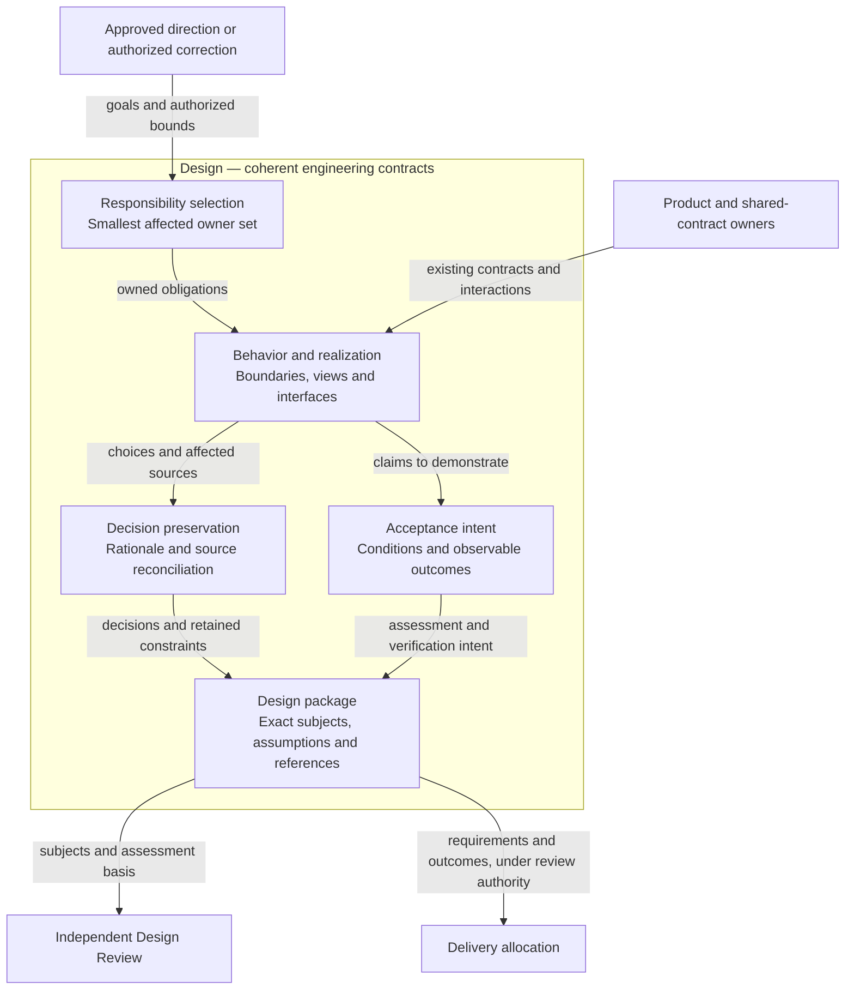
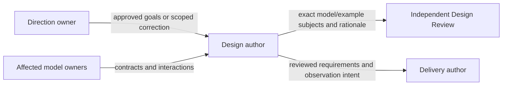
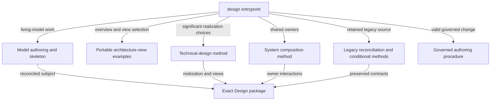
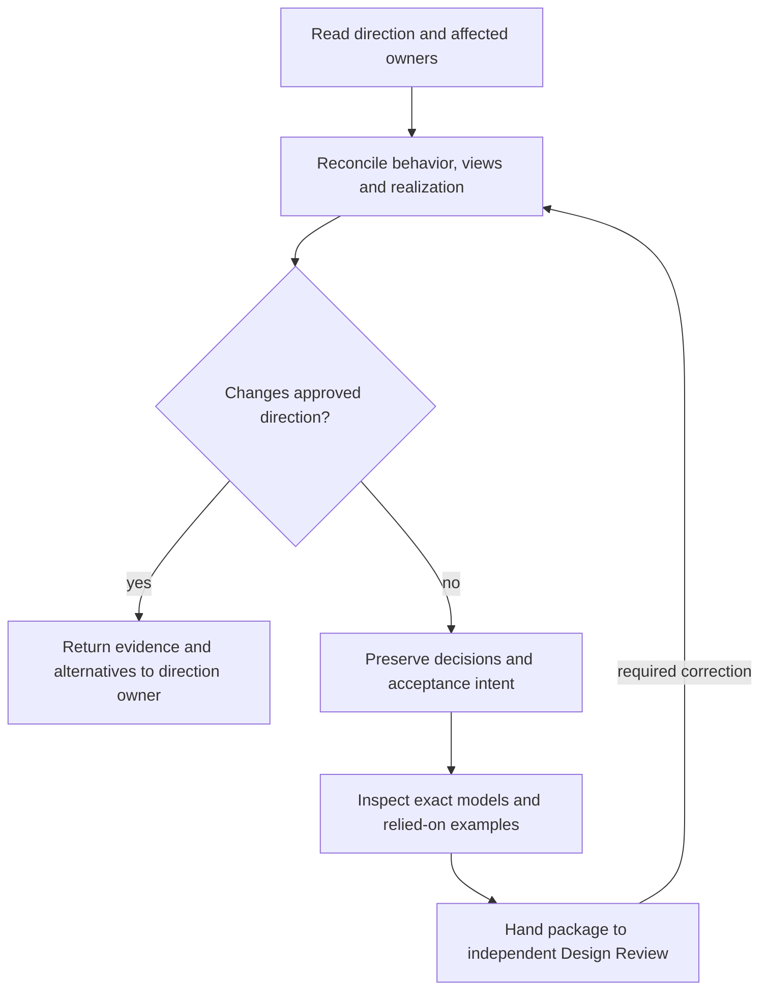
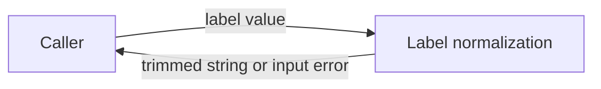

# Skill Authoring — Design Method

Model validation contract: model-document-v1

Parent model: [Skill — Authoring](skill.md#authoring).

This child owns the engineering-design authoring method and model convention. The Authoring submodel also defines proposal and delivery-plan behavior; System owns project composition. Repository execution of these capabilities belongs to Engineering Development.

Owning change: [repository cleanup and layout refinement](../../changes/2026-09-13-current-design-repository-cleanup/change.json).

Prior refinement: [independent parallel tests](../../changes/2026-09-13-independent-parallel-tests/change.json).

Original composition adoption: [three-model reconciliation](../../changes/2026-09-12-unified-validation-model/change.json).

## Introduction and Goals

Design owns the method for authoring coherent engineering contracts: required behavior, technical realization, boundaries, important decisions and representative acceptance intent. It also owns the living-model document convention and the method for describing relationships among models. The [System model](../system.md) applies that method to RigorLoop's assembled system; it does not define it again.

The direction is [Unified Design Authoring and Bounded Model Consolidation](../../proposals/2026-09-08-unified-design-authoring-and-bounded-model-consolidation.md). This package defines the replacement for the selected responsibility, not a declaration that every old document has been migrated. Its adoption boundary below governs reliance. Original authoring and adoption evidence remains in that historical change; current refinement is registered in the owning cleanup change above.

## Architecture Constraints

The Constitution retains precedence. Product direction belongs to the proposal's decision owner; Workflow owns coordination; Review and Closeout owns shared assessment and applicability policy; Validation owns shared test derivation, protective-value and maintenance criteria; Record Format owns stored representation; CLI owns recording mechanics. Design supplies engineering intent and identifies its assessment basis, not approval, work allocation or execution permission.

The adopted model profile permits this combined living Design. The unified `design` skill supplies technical and behavioral authoring at coordinated adoption. This document does not activate the replacement public skill or amend governance merely by existing. It introduces no lifecycle gate, runtime record schema, model-management service, mandatory prototype, per-test ledger or target-agent correctness claim.

## Architecture Overview



Design owns the method responsibilities inside the boundary, realized through the [public resource composition](#building-block-view). [Responsibility abstraction](#responsibility-abstraction), [technical reasoning and views](#technical-reasoning-and-decisions), and [decision/reference preservation](#model-document-and-structural-contract) own the detailed authoring rules; the [Runtime View](#runtime-view) owns the reconciliation procedure. [Context and Scope](#context-and-scope) identifies external contract owners. [Assessment](assessment.md) owns independent review; [Authoring](skill.md#authoring) owns Delivery planning. Package production does not authorize that downstream work. [System](../system.md) applies the reusable convention to this project.

### Supporting-view decisions

| View | Necessity and reason | Owning detail |
| --- | --- | --- |
| Context | Necessary: Direction, shared-contract owners, review and Delivery are separate decision boundaries. | [Context view](#context-view) |
| Building Block | Necessary: A compact public entrypoint conditionally loads complete methods and examples; loading boundaries are part of portability. | [Building Block view](#building-block-diagram) |
| Runtime | Necessary: Reconciliation must distinguish an engineering choice from a material change to approved direction. | [Runtime view](#runtime-diagram) |
| Deployment | No separate deployment view: Design owns an authoring method, while Skill owns packaged invocation and Packaging/Installation own artifact placement. The retained deployment prose describes compatibility, not a Design-owned runtime service. | Existing deployment/context prose and the named external owner. |


## Context and Scope

| Responsibility | Design owns | Separate owner or boundary |
| --- | --- | --- |
| Engineering contract | Intended outcomes, structure, invariants, shared interfaces, constraints and decisions | Proposal owns material product direction |
| Model organization | Coherent responsibility, document identity, references, supporting examples and scoped consolidation | System owns the actual system inventory and composition obligations |
| Assessment intent | Important claims, assumptions, representative conditions, observable outcomes and needed feasibility evidence | Review and Closeout governs actual assessments; specialists judge their subjects |
| Verification intent | What an implementation must demonstrate and where its violation can be observed | Validation supplies adequacy criteria; Delivery allocates checks and evidence; implementation supplies fixtures/assertions |
| Authoring integration | One public authoring contract, sufficient conditional methods and exact review handoff | Workflow selects activities; installation/publication and local runtime permissions remain separate |

Input is an approved direction or an explicitly scoped authorized correction, affected model identities and relevant current contracts. Output is the smallest reconciled set of model changes, preserved decisions/references, declared consumer impacts and reviewable acceptance intent. An unmigrated source may be a scoped output under its existing document contract; changing it does not automatically migrate its responsibility.

## Solution Strategy

Replace the normal `spec` and `architecture` entrypoints with `design` in one coordinated package adoption. Do not retain redirect skills, parallel manuals or separate normal authoring decisions under those old names. Preserve architecture reasoning and behavioral precision as conditional methods within the one skill. Old documents and old released packages retain their historical meaning; withdrawing an invocation is distinct from superseding a document obligation.

One author reconciles behavior and realization iteratively. The author first selects affected responsibility owners, then makes observable behavior and constraints explicit, tests the credibility of important choices, and reconciles dependencies. A material reduction of an approved product goal returns to the direction owner with its constraint and alternatives. A local realization choice within the approved bounds belongs here. The independent reviewer assesses the resulting exact package.

### Responsibility abstraction

Under DES-SR-02/05/07/08, begin a system composition with what the product delivers, who uses it and the outcomes it provides. Distinguish delivered interfaces and artifacts from the domain subject users manage, the policies governing those interfaces and the repository tooling that builds or validates them. For each proposed model, identify its question, owned decisions or artifacts, inputs, outputs and excluded responsibilities. Separate engineering policy, information representation, execution mechanisms and product delivery before describing their relationships. Map each selected owner to the actual delivered surface, its implementation location and an observable integration boundary. A list of existing documents is insufficient evidence of coherent decomposition.

Retain a distinct model when it has a clear contract and a meaningful reason to change independently. Consolidate overlapping ownership when both models decide the same outcome; sharing a caller or executable alone does not establish overlap. Identify whether a relationship is composition, policy use, representation, tool use or artifact transfer, and name the shared subject and its owner. A diagram illustrates those established boundaries rather than determining them.

A main model may delegate coherent responsibilities to submodels. The parent owns their composition and shared boundary; each child owns its detailed contract once. Logical nesting does not require immediate file relocation, and a child does not become another peer product merely because it has a separate Design. System owns the project's actual decomposition. Assess it with an end-to-end example and a failure that separates neighboring responsibilities, such as correct check execution with inadequate evidence or a justified decision whose persistence conflicts. Keep method requirements here and project-specific relationships in System; do not invent one model per lifecycle activity to fill an apparent diagram gap.

## Architectural supporting views

These views elaborate the overview at the owning model boundary. Existing detailed contracts, scenario tables and external owners retain their authority.

### Context View



Direction, shared-contract owners, review and Delivery are separate decision boundaries. Detailed requirements and scenarios in this model remain authoritative.

### Building Block diagram



A compact public entrypoint conditionally loads complete methods and examples; loading boundaries are part of portability. Detailed requirements and scenarios in this model remain authoritative.

### Runtime diagram



Reconciliation must distinguish an engineering choice from a material change to approved direction. Detailed requirements and scenarios in this model remain authoritative.

## Requirements

| ID | Required behavior |
| --- | --- |
| DES-SR-01 | Normal authoring MUST expose one `design` contract covering behavioral requirements, technical realization, important decisions and acceptance intent; old `spec` and `architecture` invocations MUST NOT remain competing authoring contracts after coordinated adoption. |
| DES-SR-02 | The author MUST select the smallest justified set of coherent responsibility owners. One model has one current normative Design; a shared contract has one named owner and references from consumers. A feature, folder, class, team or size threshold alone MUST NOT define a new model. |
| DES-SR-03 | Each changed model MUST define observable required outcomes, applicable invariants, inputs/outputs, boundaries, compatibility and failure/recovery behavior with stable model-local requirement identities. Conditions under which side effects must not occur MUST be explicit where material. |
| DES-SR-04 | Behavior and technical realization MUST be reconciled. A material feasibility constraint that changes approved product direction MUST return to its decision owner with evidence and alternatives; the author MUST NOT silently weaken the approved goal or present implementation convenience as authority. |
| DES-SR-05 | A model MUST explain responsibility structure, significant dependencies, runtime or operational flows, applicable deployment/trust boundaries, quality constraints and risks to the depth needed to assess its claims. Irrelevant concerns need a bounded rationale; methods MUST NOT demand fictitious services, components or metrics. |
| DES-SR-22 | Every model MUST contain an Architecture Overview View with a concise graph orienting readers to its principal responsibilities, externally significant products or interfaces and important relationships. Every material element or relationship MUST resolve to its owning view or model without duplicating detailed authority. Authors MUST evaluate Context, Building Block, Runtime and Deployment views, record each necessity decision with its reason, and draw every necessary view. Supporting views MUST remain consistent with the overview and affected contracts; an overview MUST NOT replace a necessary supporting view. |
| DES-SR-06 | Important decisions MUST retain stable identity, context, chosen outcome, meaningful alternatives, consequences and still-applicable constraints in the owning model. Normal model work MUST NOT require an additional ADR with duplicate current authority. Historical ADR identities and judgments MUST retain their original meaning. |
| DES-SR-07 | The system-level Design MUST describe external boundaries, responsibility inventory, significant relationships, end-to-end flows and genuinely system-wide quality/failure obligations. It MUST reference component/shared-contract owners without copying their local rules or overriding governance or component authority. |
| DES-SR-08 | An interface or shared-assumption change MUST identify affected producers/consumers and required reconciliation or an evidence-backed unaffected disposition. Review scope MUST include relevant interactions and exact changed subjects; it MUST NOT require every repository model for every invocation or rely on a CLI-inferred semantic dependency graph. |
| DES-SR-09 | Important design claims MUST have an explicit assessment basis: representative walkthrough, counterexample analysis, inspection or targeted feasibility evidence proportional to the uncertainty. Material assumptions and unresolved decisions MUST remain visible. Structural validity alone MUST NOT establish credibility or approval. |
| DES-SR-10 | Design MUST identify representative conditions and observable expected outcomes for realization, including integrated outcomes that local model checks cannot establish. Scenarios MUST NOT be an exhaustive test whitelist or a basis for deleting unlisted regression protection; shared adequacy and maintenance criteria remain Validation-owned. |
| DES-SR-11 | The document layout and structural mapping below MUST use the `model-document-v1` document contract, preserving the existing structural rules independently of runtime record versions. Stable requirement/decision references MUST survive revision or have explicit replacement mappings; no old review may be retargeted to revised content. |
| DES-SR-12 | Each owning model MUST index its examples with purpose, governing requirements, excerpt/complete scope and material synthetic identities or starting assumptions. Examples MUST illustrate existing obligations and satisfy the model-owned example contract below: JSON validity and available-schema conformance, before/after invariant preservation, and independent review alongside the owner with exact identities when relied upon. Examples MUST load on demand and remain distinct from normative model subjects; selectors MUST retain model/example validation pairing. |
| DES-SR-13 | Every displaced obligation and material decision in the selected migration MUST have a destination, explicit supersession or justified retention, including obligations expressed in unnumbered prose. Grouped mappings MUST expose each material obligation's disposition; section names or source-ID enumeration alone MUST NOT establish preservation. Mixed sources MUST retain identifiable unmigrated authority. No adoption or removal may rely on unresolved contradictions, anonymous follow-up or a filename-only mapping. |
| DES-SR-14 | Scoped work on an unmigrated document MUST retain its applicable contract and historical reference identities unless separately approved for migration. New features MUST update existing responsibility owners where appropriate; repository-wide conversion MUST NOT become a prerequisite for a small change. |
| DES-SR-15 | Published `design` guidance MUST work without the RigorLoop internal Design checkout or private requirement IDs. The common contract MUST be compact; specialist methods MUST load conditionally from complete packaged resources, with no full loading of both retired manuals. Missing or inconsistent required resources MUST stop dependent authoring rather than reconstruct the method. |
| DES-SR-16 | Authoring MUST hand independent Design Review the exact affected model set, relevant interactions, material decisions, evidence/assumptions and changed-subject applicability impacts. Review and Closeout remains the assessment owner. Delivery MUST receive stable requirements, representative outcomes and integrated obligations; concrete commands, milestones, proof groups and actual results remain downstream. |
| DES-SR-17 | Public invocation withdrawal MUST follow the compatibility contract below across source skills, supported adapters, invocation examples and installer boundaries. A current package or installation with retired authoring entries MUST NOT be represented as a coherent replacement. Detection MUST preserve unrelated/user-modified files and existing project state. |
| DES-SR-18 | Coherent adoption MUST reconcile governance, Workflow references, directly affected consumers, validation selection and packaged resources together. Historical records and released evidence MUST NOT be rewritten to claim approval of new subjects; publication and customer adoption remain separately authorized. |
| DES-SR-19 | Required structural checks MUST fail closed on unknown contract markers, closed values and malformed references while retaining semantic review ownership. This change MUST preserve required negative/regression protection and existing TEST-SR criteria in Validation when relocating or retiring checks. No test-count, document-count or token-saving target substitutes for evidence. |
| DES-SR-20 | The first slice MUST deliver the selected Design/System responsibilities and their shared relationship, dispose their superseded current sources as mapped, and assign remaining consolidation to named later work. Completion MUST NOT claim whole-repository consolidation. |
| DES-SR-21 | For an explicitly approved necessary-design consolidation, surviving requirements, applicability, constraints, technical realization, material decisions and failure knowledge MUST have usable current owners before source removal. Retain an original only for a named remaining need and owner; no automatic archive, redirect, index or duplicate is required. Historical judgments and records MUST retain their original subjects and meaning; current reliance MUST not require reconstruction from version history. This policy applies only to the selected sources and does not cancel a different initiative's retention commitment. |

## Building Block View

Design is a method responsibility, not a new service. Its public implementation is one authored skill with a small common procedure and conditionally loaded methods. The same model requirements govern repository use and portable installed guidance; repository-specific mappings below remain contributor content.

| Public resource | Trigger and responsibility | What stays out |
| --- | --- | --- |
| `skills/design/SKILL.md` | Always: scope/authority, owner selection, reconciliation loop, stable references, boundary scan, assessment/verification distinction and handoff | Detailed migration inventory, repository paths for maintainers, exhaustive method manuals |
| `references/model-authoring.md` | Creating/revising a living model: requirements, decisions, model layout and the complete DES-SR-12 example contract, including parent indexing, validity, invariant preservation and review handoff | Lifecycle mutation and approval |
| `references/architecture-view-examples.md` | Living-model overview or supporting-view decisions: portable composed/leaf excerpts and semantic counterexamples | Internal model dependencies, a universal component inventory or automated approval |
| `references/technical-design.md` | Significant structure, interfaces, runtime, deployment, trust or quality choices | A mandatory second architecture file or ADR |
| `references/system-composition.md` | Multiple affected owners, shared contract or system-wide claim | Whole-repository loading or inferred ownership by folder |
| `references/legacy-source-reconciliation.md` | Scoped unmigrated-source work: select the project authority, retain its format/IDs, classify the amendment and load the applicable feature or legacy technical procedure below; invocation coexistence or explicit authority migration | Automatic conversion, blanket deletion or historical approval rewriting |
| `references/boundary-first-method-v1.md` | Interpret or author a retained feature-format boundary record: complete compact vocabulary, IDs, examples and interaction rules | A second policy owner or mandatory feature records for living models |
| `references/boundary-first-feature-authoring-v1.md` | Substantive amendment remaining under the retained feature format: complete four-section procedure, tables and semantic checks; loads the compact method above | The retired spec manual or automatic migration |
| `references/legacy-technical-authoring.md` | Scoped unmigrated architecture/ADR amendment: retain applicable concerns, decision history, source ownership and project-prescribed packaging; load the applicable scaffold below when creating or rebuilding such an artifact | A competing normal authoring skill or mandatory ADR for model work |
| `assets/legacy-architecture-skeleton.md`, `assets/legacy-adr-skeleton.md`, `assets/diagram-styles.mmd` | Conditional installed aids for a retained architecture/ADR contract or a diagram needing the shared styles; use only the matching aid | Internal checkout dependencies or mandatory scaffolds for simple amendments |
| `references/governed-design-authoring.md` | Explicitly selected governed change: current context under Record Format and CLI, subject inspection and targeted author-owned recording | Portable lifecycle creation, semantic readiness engines or retired recording fallback |
| `references/test-quality.md` | Authoring or assessing verification intent under the adopted TEST-SR criteria in Validation | A new definition of test adequacy or a per-test ledger |
| `assets/design-skeleton.md` | Creating a model: stable engineering sections and existing required tables | Mutable status, prescribed tests/commands, second spec/architecture scaffold |

The resource names are the selected package decomposition. Delivery may divide implementation work but may not silently replace the loading responsibilities with eager concatenation. Existing portable boundary vocabulary supports the common compact scan. The named feature-format resource and its compact-method dependency are packaged together and loaded only when that retained format is triggered; neither retired authoring manual is shipped in full. The legacy reconciliation resource owns selection and the named specialist resources supply the complete procedure. Any transitive required method or scaffold must be contained in the installed package and covered by the same trigger/integrity checks. The current published resource-integrity owner retains contained-path, projection and parity mechanics.

The customer project supplies its authoritative legacy requirements, approved decisions, local format/version and any mandatory project-specific template or schema. Packaged methods explain how to amend that source; they cannot invent its authority. A missing packaged method is a distribution defect that stops the dependent invocation. Missing or contradictory project authority instead requires the project owner to resolve that bounded gap; installing more generic guidance or migrating the document does not settle it. The author may proceed with independently authorized unaffected work. A project-specific required scaffold must come from that project; the bundled generic aid is used only when its declared contract permits it.

### Target and authority safety

For DES-SR-13/14/18, creation requires an absent exact target and revision requires the intended existing target. Explicit governed signals, including malformed ones, require one safe, agreeing current change identity; missing or conflicting authority stops dependent work without portable fallback. Portable authoring changes only its selected engineering content. On interruption or concurrent change, inspect actual content, governing basis and saved records before continuing; preserve unrelated work and report partial completion truthfully. A retry must not overwrite a changed target or reinterpret stale approval. Workflow owns correction routing, Assessment owns renewed reliance, and CLI/Records own current persistence and recovery; retired per-skill manifests, receipt formats and lifecycle transactions are not required.

### Requirement refinement and delivery allocation

The shared requirement-to-delivery guidance expresses refinement as RR → IR → SR → AR: incoming need, approved direction, testable system requirements and conceptual allocation. Existing requests and proposals supply the first two; RR, IR and AR need no additional artifact, identifier or lifecycle state. The living Design owns stable SR identities and their technical realization. Planning allocates them to executable work, with many-to-many relationships where justified. Work decomposition is separate: add Epic, Feature, Story, Task or other levels only when they improve ownership, sequencing, reviewability or coordination. Each work package explains its purpose, governing requirements or justified non-requirement obligation, affected technical boundary, scope and dependencies. Review follows the chain from direction through realization and allocation to implementation and evidence without changing gate order or authority. Historical artifacts need no retrofitted terminology. The packaged shared resource remains application guidance under these owners.

## Runtime View

1. Read the approved direction or authorized correction and select exact affected owners. For governed work, inspect current model references and applicable assessments through existing primary CLI reads. For portable work, resolve an explicit target or the model layout below; do not infer governance adoption.
2. Explain observable outcomes and constraints, then reconcile technical choices and dependencies. Escalate a material product-direction conflict; retain unaffected independent work.
3. Identify important claims and uncertainty. Use a scenario walkthrough or counterexample for ordinary claims and targeted feasibility evidence for a material uncertain claim. Record assumptions and any owned unresolved question.
4. Update model-local requirements, realization, decision rationale and representative outcomes together. Include affected shared-contract consumers, missing reconciliation and justified unaffected paths.
5. Preserve references and current ownership. For a selected migration, use the exact displacement map; for an unmigrated amendment, preserve its declared contract and boundary format.
6. Inspect completed subject identities and record only author-owned references, decisions and impact restrictions. Independent Design Review evaluates that package. A successful write does not approve it; a missing resource or uncertain authority remains a scoped stop.

## Deployment View

### Public invocation compatibility

Current authoring uses `design`; supported packages omit the retired `spec` and `architecture` entries and aliases. Packaging owns supported targets and archive contents. Design owns the authoring interface and complete conditional resources for retained legacy-document work. A package check does not establish target-agent correctness or customer governance adoption.

[Installation](../cli/installation.md) owns acquisition, destination checks, replacement and recovery. It preflights actual candidate destinations, defaults to conflicts, and permits explicit complete replacement within candidate units through `--force`. It does not interpret or write project state; `--write-state` and the former lockfile-managed transition are retired. Unrelated files and noncandidate entries remain outside replacement authority. An obsolete installed entry requires the Installation-owned diagnostic and scoped handling, not a Design-defined repair procedure.

Earlier OpenCode aliases, managed-state transitions and TNI-DES-01–06 retain historical meaning through the [installation source-transfer map](../cli/installation.md#source-transfer-and-next-artifacts) and original adoption records. They do not govern current installation. Previously released archives retain their actual inventory and approval basis.

### Coordinated adoption boundary

Changes to authoring behavior reconcile the affected model, published guidance, routing/review consumers and package interfaces as one reviewed subject set. Design approval permits authorized planning; implementation, independent assessments and successful Verify establish adoption under the owning change. Installation and publication retain separate authority.

Historical source-transfer maps below identify the original obligations and decisions. Current source retention follows the Constitution and the cleanup's exact dispositions; it does not require restoring deleted originals or archives. A correction or rollback restores a coherent source/consumer set and reassesses current applicability without reassigning earlier approvals.

## Crosscutting Concepts

### Model document and structural contract

The portable convention transferred from Workflow WF-SR-07/08/09 uses one `docs/design/M/M.md` per coherent responsibility, where `M` is the matching stable directory/filename model ID. Model-owned examples live under that directory's `examples/`. Examples may be Markdown, JSON, Mermaid or a suitable format; no shared cross-model example root or mandatory wrapper is introduced. A shared example has one owner and is referenced by its consumers. Cross-model contract references use the owner's path and stable requirement/decision identity.

A project may explicitly select a simpler parent/child layout. Keep a single child document beside its parent; create a child subfolder when that responsibility owns several related documents or resources. Short material stays in sections. Logical grouping alone and speculative future growth do not justify another directory. The project composition owner declares exact paths and example ownership; directory depth does not determine model authority. A move preserves model and requirement IDs, updates current links and executable path consumers, and records old-to-new provenance without retargeting earlier reviews.

Each model declares exactly once `Model validation contract: model-document-v1`. Its level-two `Requirements` heading introduces a table with exactly `ID` and `Required behavior` columns, unique nonempty IDs beginning with a letter and containing only letters, digits and hyphens, and nonempty normative text. Its level-three `Boundary scan and acceptance scenarios` heading introduces a table with exactly `Dimension`, `Requirement basis` and `Distinct outcome to demonstrate` columns. Each of the eight dimensions in this document's scenario table occurs exactly once. Applicable rows cite unique IDs from that model separated by comma and one space and give a nonempty outcome; non-applicable rows use `-` and an outcome starting `Not applicable:` with a reason. Required headings/tables occur once. Unknown markers/dimensions, duplicates, undeclared IDs, malformed tables and missing required cells reject.

The marker replaces the ambiguous document identifier `explicit-recording-v1`; it does not version or convert stored workflow records. Current model validation accepts exactly `model-document-v1` and rejects the retired document marker, unknown values, missing declarations and duplicates before table checks. Adopt the rename together across current living models, the validator, authoring guidance, skeleton and generated candidate metadata. Existing customer models require an explicit project-owner-authorized marker edit; installation does not rewrite their documents. Historical record bytes and original review identities remain unchanged. A rollback restores the matching document/validator/guidance set together, without changing the independently owned current stored contract in Record Format.

#### Example: a small model document

| Example | Purpose and governing requirements | Scope and assumptions |
| --- | --- | --- |
| The fenced label-normalization model below | Illustrates DES-SR-09/11/12: the marker, model-owned requirements, all eight scenario dimensions and observable outcomes | Complete illustrative structural record for hypothetical `docs/design/label-normalization/label-normalization.md`; not an adopted RigorLoop component or a stored workflow record. Synthetic LAB-SR identifiers belong only to this example. |

The function accepts a label and returns a normalized value. For example, `"  green  room  "` becomes `"green  room"`; an all-space string becomes `""`; a non-string input produces an error and no normalized value. The scenarios describe intended observations, not an exhaustive test list or evidence that an implementation passed.

````markdown
# Label Normalization Design

Model validation contract: model-document-v1

## Responsibility

Normalize labels with a pure function. The caller owns storage, authorization and presentation; this model owns only the input-to-output transformation.

## Architecture Overview



The Responsibility and Requirements sections own this pure transformation and its input/output relationship. No additional model or service is implied.

| Supporting view | Necessity and reason |
| --- | --- |
| Context | Unnecessary: one synchronous caller; the responsibility and requirements fully define the external input/output boundary. |
| Building Block | Unnecessary: a single pure transformation has no material internal subsystem decomposition. |
| Runtime | Unnecessary: there is no component interaction, state transition or asynchronous protocol beyond the specified return/error behavior. |
| Deployment | Unnecessary: this function has no external state or environment dependence; its caller owns placement. |

## Requirements

| ID | Required behavior |
| --- | --- |
| LAB-SR-01 | For a string input, return it with leading and trailing ASCII spaces removed; preserve every interior character and return an empty string for an all-space input. |
| LAB-SR-02 | Reject a non-string input with an input error and no normalized value. |
| LAB-SR-03 | Do not read or write external state; repeated normalization of an already normalized string returns the same value. |

### Boundary scan and acceptance scenarios

| Dimension | Requirement basis | Distinct outcome to demonstrate |
| --- | --- | --- |
| Input domain | LAB-SR-01, LAB-SR-02 | Leading/trailing spaces disappear, interior spaces remain, empty/all-space inputs return an empty string, and non-string inputs reject. |
| State/lifecycle | LAB-SR-03 | Calls leave external state unchanged; earlier calls cannot affect a later result. |
| Identity/authority | - | Not applicable: this pure transformation has no principals or permission decisions; callers own access control. |
| Composition/path | LAB-SR-01, LAB-SR-03 | Passing the result through normalization again preserves the result. |
| Temporal/retry | LAB-SR-03 | Repeating the same call yields the same result without accumulated side effects. |
| Failure/recovery | LAB-SR-02, LAB-SR-03 | Invalid input produces no normalized value or state changes; a following valid call succeeds normally. |
| Compatibility/migration | - | Not applicable: this example owns no persisted records, versions or migration. |
| External/environment | LAB-SR-01, LAB-SR-03 | The ASCII-space rule produces the same result regardless of locale and without filesystem or network access. |
````

Extract the fenced content to the hypothetical model path to check its structure. The fence is illustrative content, so its declaration and tables must not count as additional live declarations in this owning Design. Structural validation checks shape and references; independent assessment judges the requirements and scenarios, and implementation tests establish actual behavior. Changing this relied-on example requires reassessment with its owning Design and exact subject under DES-SR-12/16.

Path selection continues to accept explicitly supplied historical flat `docs/design/M.md` regular files when present, without maintaining flat copies, relocating subjects or retargeting approvals. This repository explicitly overrides physical layout through [System’s directory map](../system.md#repository-directory-layout); stable model IDs remain independent of these mapped filenames. The exact mapped paths and their example namespaces are accepted alongside the portable convention. Unmapped mismatched IDs, model paths pointing into examples, extra normative nesting and symlink paths reject. A known historical flat deletion maps to its current model for validation selection only. Model/example selection preserves the owning-model check. Existing historical `specs/` formats and adoption rules remain valid for their own responsibilities; the document marker is independent of runtime record formats.

References to scenario rows use the model path and exact dimension label; material combined hazards are concise requirement-linked prose alongside them. No additional boundary/proof ID series is required for model documents. Every affected requirement, scenario row and material integrated hazard is allocated to concrete proof by Delivery. Actual observations stay in existing evidence records. Design and Delivery reviewers assess semantic adequacy under Review and Closeout and Validation, not document syntax.

The existing grandfathered-spec handoff is retained: changed unmarked grandfathered specs receive a separate `review_required` observation. Structural success reports `review-required` with exit zero; structural errors still fail. Missing/unknown markers on non-grandfathered specs and malformed existing boundary content cannot become review observations. Independent Design Review records whether an exact amendment is non-substantive historical, substantive historical requiring existing feature-format adoption, or new-profile-only preserving the historical remainder. Unknown or stale classification prevents reliance. No new classification artifact, schema or CLI state is introduced.

### Model-owned example contract

DES-SR-12 retains the example obligations transferred from Workflow's Model-centered layout and examples section. The owning model MUST index each example with its purpose, governing requirement references, complete-artifact or excerpt scope, and any material synthetic identities or starting assumptions. An example illustrates its cited contract; it MUST NOT introduce a new normative rule or leave its owner implicit.

JSON examples MUST parse without explanatory extra keys. A complete record example MUST conform to its selected schema when that schema is available. Explanations belong in the model's index or accompanying prose rather than invented record fields; declaring an example complete is not evidence of schema conformance. If the schema is unavailable, that limit must be visible and no schema-conformance result may be claimed.

Before/after example pairs MUST preserve the invariants they demonstrate. Syntactic validity alone does not establish that an illustrated transition retains its required state, authority or identity constraints. Independent review MUST cover affected examples alongside their owning model and include the exact example identities when relying on them, under Review and Closeout's assessment/applicability policy. The author supplies those subjects in the DES-SR-16 handoff; the reviewer retains judgment ownership. On-demand loading does not excuse omitting an affected or relied-on example from the assessment.

These are retained content and assessment obligations, not a new schema, automatic semantic validator or requirement to implement every representative test during Design. Delivery allocates suitable concrete checks and evidence; specialists assess whether the example actually demonstrates its claim.

### Technical reasoning and decisions

The arc42 concern set remains a useful completeness guide: goals, constraints, external context, strategy, building blocks, runtime, deployment, cross-cutting concepts, decisions, quality, risks and glossary. New model documents need not repeat twelve headings when the same concerns are clearly covered in a smaller structure; retaining a heading is not evidence that its concern was assessed. This first package keeps familiar headings to ease comparison without making them a universal schema.

#### Architecture Overview View and necessary supporting views

Architecture Overview View provides a concise orientation to the architecture as a whole at the owning model's scope. It identifies the principal system responsibilities, externally significant products or interfaces, and the most important relationships required to understand how the project delivers and assures those products.

The view may summarize information owned by Context, Building Block, Runtime and Deployment views. It does not replace those views or create duplicate detailed authority. Every material element or relationship resolves through a local section reference or model link to its owning architectural view or model. Each model requires an Architecture Overview View with a concise graph, including leaf models; a leaf shows actual owned responsibilities without inventing children or services. Existing Architecture Overview headings and anchors remain valid.

During design, evaluate each of the four supporting views below. Record whether it is necessary, why, and where its owned detail is found. Draw every necessary view and explain its material elements and relationships. A short table or prose is sufficient for the evaluation; this is not a new artifact, ID series or document-validation schema. An overview graph alone does not discharge a necessary supporting view. Reuse an existing adequate graph at its owning location by reference, preserving one authored source.

| Supporting view | Evaluate the need to explain | Draw when necessary |
| --- | --- | --- |
| Context View | External actors, systems, inputs/outputs, interfaces and authority or trust boundaries | The model boundary and its external relationships |
| Building Block View | Internal responsibility decomposition, interfaces and static dependencies | Owned blocks and their significant relationships; parents reference child-owned detail |
| Runtime View | Cooperation over time, significant normal and failure paths, retries, concurrency or recovery | Representative interactions using the same responsibilities as the structural views |
| Deployment View | Mapping executable or packaged artifacts to environments, processes, nodes and material resource/trust constraints | The actual placement and connections needed to assess the model's claims |

Necessity follows an architectural question or material uncertainty, not model size or a diagram quota. Record a bounded reason for each unnecessary view and revisit that disposition when relevant behavior or boundaries change. A missing necessary view, a material element without an owner, contradictory names or boundaries across views, or duplicated detailed authority is a Design Review correction. Structural validation alone cannot settle necessity or adequacy. C4 notation may express appropriate context or structural detail; arc42 supplies the complementary concerns. Neither requires fictitious deployed policy services. Text-source diagrams use meaningful relationship labels, working relative links and non-color-only distinctions.

This refinement is selected by the current independent-parallel-tests change. Delivery must reconcile the public design procedure, model-authoring and technical-design resources, system-composition guidance, design skeleton and affected Design Review guidance with this convention, replacing the unconditional optional-diagram wording for living models. It must assess the four supporting views for each of the twelve repository models and supply every necessary diagram, including affected illustrative models, without converting retained legacy documents or changing record schemas. Existing overview graphs remain reusable. This authoring revision defines that work; it does not claim the skill package or all model views already implement it. Installation grants no customer-model conversion authority.


Model decisions replace mandatory new standalone ADRs for adopted responsibilities. A historical decision may remain applicable, be narrowed or be superseded; its old judgment never applies to a changed model automatically. Repository-level `templates/architecture.md`, `templates/adr.md` and `templates/diagram-styles.mmd` remain contributor source aids. Installed invocations use the named skill-local legacy assets and `legacy-technical-authoring.md`, never repository paths. Delivery reconciles their content and validates packaged completeness under existing asset/source governance. These conditional legacy assets do not establish a second normal authoring contract or require standalone ADRs for living models.

### Security, observability and usability

Requirements, rationale and evidence references must not expose secrets, credentials or machine-local debug data. Trust/permission and data-exposure boundaries are described when affected, with local runtime and human authority unchanged. Prose, tables and text diagrams support ordinary repository navigation without color-only semantics. Observations identify actual claims, assumptions, owners and replacement references; no new telemetry or metrics service is needed. No quantitative token/runtime target is selected.

### Boundary scan and acceptance scenarios

| Dimension | Requirement basis | Distinct outcome to demonstrate |
| --- | --- | --- |
| Input domain | DES-SR-02, DES-SR-03, DES-SR-11, DES-SR-12, DES-SR-14, DES-SR-19 | A new model, scoped existing model and unmigrated-spec amendment resolve different valid targets. Unknown marker, malformed requirement reference or unresolved owner rejects; an unmarked historical amendment gets its retained semantic classification rather than silent model conversion. An unindexed example, malformed JSON, explanatory extra record keys or a complete record violating an available schema cannot satisfy the example contract. |
| State/lifecycle | DES-SR-04, DES-SR-13, DES-SR-16, DES-SR-18 | A saved draft or approved proposal does not activate the new skill or replacement authority. An unresolved direction conflict returns to its owner without presenting the weakened behavior as approved. |
| Identity/authority | DES-SR-06, DES-SR-08, DES-SR-11, DES-SR-12, DES-SR-16, DES-SR-21 | A decision/requirement move preserves its replacement reference, while the review remains attached to its original subject. The author cannot self-approve or change another actor's judgment. An affected example is assessed with its owning model and its exact identity is included when relied upon; an unchanged parent identity does not make an edited example's old assessment current. |
| Composition/path | DES-SR-07, DES-SR-08, DES-SR-10, DES-SR-15, DES-SR-16, DES-SR-22 | A shared-authoring-contract change reaches routing, Design Review and planning consumers with one owner and consistent integrated outcome. A locally coherent model whose consumer expects the old contract remains unreconciled. An overview resolves material elements and relationships to owners; all four supporting views have reasoned necessity decisions and each necessary view has a consistent diagram. An overview-only model with a necessary but absent runtime view fails assessment; a leaf with justified unnecessary deployment detail needs no invented deployment diagram. |
| Temporal/retry | DES-SR-08, DES-SR-11, DES-SR-13, DES-SR-16 | Concurrent edits to a shared model require current subject inspection and impact/reassessment under Review and Closeout; a failed recording retry cannot replay a stale approval or overwrite a neighbor. |
| Failure/recovery | DES-SR-04, DES-SR-09, DES-SR-15, DES-SR-17, DES-SR-18 | Missing required packaged guidance stops dependent authoring. A failed authoring guard leaves subjects unchanged; Installation owns candidate conflicts and replacement recovery without project-state interpretation or automatic document conversion. |
| Compatibility/migration | DES-SR-01, DES-SR-06, DES-SR-13, DES-SR-14, DES-SR-17, DES-SR-20, DES-SR-21 | Supported packages supply design and omit retired authoring entries; Installation handles actual candidate conflicts and explicit replacement under its current contract. A small unmigrated-source amendment preserves its owner/format, while selected migrated clauses have exactly one replacement and old approvals remain unchanged. |
| External/environment | DES-SR-05, DES-SR-12, DES-SR-15, DES-SR-17 | A clean installed package contains every triggered method without the internal repository checkout, including substantive unmigrated feature-format authoring, its compact dependency and applicable legacy technical scaffolds. Other target roots and user files remain untouched; context/structure checks make no target-agent performance or publication claim. |

Material integrated hazards include a public rename with stale routing/installer entries (DES-SR-01/15/17/18), a shared-method extraction with two surviving current definitions (DES-SR-02/08/13), and a historical reference preserved while its old approval is incorrectly reused (DES-SR-06/11/16). Delivery must allocate proof at those composed boundaries. Representative outcomes do not enumerate every legitimate concrete test.

For DES-SR-12/16, a before/after example pair may contain two parseable, schema-conforming records while violating the invariant it claims to demonstrate. Assessment must expose that violation rather than accept the pair on local syntax checks. Similarly, a changed relied-on example must not disappear from review merely because its parent model text is unchanged. These representative outcomes retain the transferred safeguards without prescribing test fixtures or expanding them into an exhaustive catalogue.

Before Distribution adoption, for DES-SR-15/17, the integrated installer outcomes are TNI-DES-01–06 and the installation owner's clean managed, locally modified, interrupted/retried and already-clean cases. Delivery must demonstrate the complete documented upgrade sequence, including failure recovery and preservation of other targets/state, rather than testing only rejection.

For DES-SR-14/15, install the package without RigorLoop's internal checkout and substantively amend a customer-owned unmigrated specification under its declared feature-format contract. The reconciliation resource must select both packaged boundary resources, preserve IDs/authority and supply the full procedure without forcing model migration. A retained architecture/ADR amendment that requires a scaffold resolves the matching installed asset or explicitly required customer template. Missing packaged guidance and missing project authority produce distinguishable scoped stops. This is a required triggered-method path, not an exhaustive list of permitted tests.

## Architecture Decisions

| ID | Context and decision | Alternatives and consequences |
| --- | --- | --- |
| DES-DEC-06 | The selected consolidation retains necessary engineering knowledge, not historical files by default. DES-SR-21 permits removal once meaning, current reliance and consumers are resolved. | Automatic snapshots preserve duplicate reading burden; indiscriminate deletion loses constraints and evidence. Earlier separately scoped retention commitments remain intact. |
| DES-DEC-01 | Separate normal authors duplicate responsibility despite the living-model profile. Use one design authoring contract and embedded decisions. | Renaming without reconciliation preserves contradiction; concatenating manuals increases load and retains dual authority. One contract needs disciplined boundaries and independent review. |
| DES-DEC-02 | Model-local clarity is insufficient for composed claims. Design owns the composition method; System owns the actual RigorLoop composition and shared outcomes. | Making Workflow or system prose own every component rule duplicates contracts; one giant Design makes every change require broad reading. Explicit owners and scoped relationships add reconciliation work where it matters. |
| DES-DEC-03 | Keep the reasoning value of arc42/C4 without mandatory separate files or twelve-section schema. Preserve existing model structural format and on-demand examples. | Mandatory full architecture packaging retains the inconsistency; no method loses trust/runtime/quality reasoning. Conditional depth requires semantic review rather than word/diagram-count checks. |
| DES-DEC-04 | Withdraw old public authoring entries together and retain complete portable legacy-authoring resources. Delegate installation to its owning contract. | Forwarding wrappers duplicate authority; broad cleanup risks local edits. The original managed-tree/state-write decision was superseded by candidate-based conflict checks and explicit replacement under Installation. Its historical rationale does not authorize restoring state writes. |
| DES-DEC-05 | Migrate the whole architecture-method responsibility, Workflow's document convention and a bounded system-composition slice; retain historical artifacts and unmigrated current owners. | Whole-repository consolidation delays delivery; copying everything creates conflicting authority. Explicit mappings and deferred owners make the temporary coexistence inspectable. |

No new standalone ADR is required for this adopted model-profile draft. The material decision table and source-decision mapping carry its rationale; the old ADRs remain separate historical evidence.

## Quality Requirements

| Quality | Reviewable outcome | Basis |
| --- | --- | --- |
| Coherence | A reader resolves an obligation and each shared interaction to one current owner after adoption. | DES-SR-02, DES-SR-07, DES-SR-13 |
| Credibility | Important claims expose assumptions, plausible violations and sufficient feasibility basis without universal prototype requirements. | DES-SR-04, DES-SR-09 |
| Testability | Delivery can derive local and integrated proof from observable outcomes without rebuilding old spec/architecture pairs. | DES-SR-03, DES-SR-10, DES-SR-16 |
| Portability | Installed triggered resources are complete, and the public method does not depend on contributor-only model files. | DES-SR-15, DES-SR-17 |
| Historical fidelity | Source identities, old decisions and review judgments are not retargeted or erased during migration. | DES-SR-06, DES-SR-11, DES-SR-18 |

## Risks and Technical Debt

Conditional loading can omit a needed technical method; semantic review must assess actual triggers and integrated examples. A general-purpose Design can become oversized; split only a coherent responsibility with an explicit reference map. Installer guards cover supported CLI publication, not arbitrary manually retained agent files. Mixed documents remain a navigation cost until their named follow-ups complete. None of these risks authorizes weakening the first slice's single-owner, evidence or compatibility obligations.

## Glossary

Model: a coherent engineering responsibility with owned concepts and rules. Design: its living normative engineering document, and the authoring method named here. System view: composition-owned obligations and references across models. Consolidation: reconciled authority and decision meaning, not merely a move or rename. Representative scenario: a requirement-grounded condition/outcome from which further justified tests may derive.

## Source transfers and consumer obligations

These maps preserve source-qualified requirements, decisions and consumer obligations. Current authoring and installation behavior is defined above and at the linked owners; historical descriptions do not restore superseded procedures.

### Necessary-design retention

DES-SR-21 applies the Constitution's [cleanup policy](../../../CONSTITUTION.md#repository-cleanup-and-historical-retention) to explicitly selected sources. Preserve important current behavior, constraints, technical reasoning and acceptance intent at one owner; resolve operational readers and current reliance before deleting a source. Mixed sources retain their named remainder. Completed rollout instructions and duplicate historical wording need no new normative home.

The [owning cleanup evidence](../../changes/2026-09-13-current-design-repository-cleanup/source-disposition.md) records exact removals, recoverable originals, preserved uncommitted edits and live exceptions. Earlier method, release and distribution maps preserve source-qualified provenance; they do not reinstate superseded installation procedures or original-path retention. Current Installation, Packaging and Release own those boundaries.

Observe three outcomes: a removed duplicate has an accessible current owner; a mixed source retains an explicit current responsibility; a historical citation does not become approval of revised content. An unresolved reader, finding or authority gap stops the affected removal. Recovery reconciles the source and its consumers together with truthful assessment applicability.

### Selected replacement map

The following rows select all R1–R124 of [Architecture Package Method](https://github.com/xiongxianfei/rigorloop/blob/39b7c5cb1f03aa761d2f2493d3474ce985e59d6f/specs/architecture-package-method.md) for method-authority reconciliation. Ranges are inclusive and each R appears once. Original IDs are source-qualified historical references, never renamed Design IDs. Acceptance criteria AC1–AC22 remain historical acceptance of the old method; their ongoing protective obligations resolve through the corresponding R rows, rather than becoming an independent second current contract. Examples E1–E10 retain historical illustration meaning; the corresponding current outcomes are owned by DES-SR-02/04/05/06/11/13/14/19 and the scenarios below. Completed rollout requirements are explicitly retired as completed historical requirements, not reapplied to this initiative.

| Displaced source IDs | Selected disposition and destination | Retained meaning or deliberate replacement |
| --- | --- | --- |
| R1–R6 | Replace with DES-SR-01/02/07/11 | One owning Design and System composition view replace a separate canonical architecture-method/spec authority and fixed package paths. |
| R7–R13 | Replace with DES-SR-05/11 and technical reasoning above | Preserve concern coverage and non-applicability rationale; retire mandatory twelve-heading serialization and old mutable-state representation. |
| R14–R16 | Retain substance in DES-SR-03/05/08 | Runtime, deployment and cross-cutting impacts remain material authoring concerns. |
| R17 | Replace with DES-SR-06 | Embedded stable decisions replace a mandatory ADR-link section. |
| R18–R20 | Retain substance in DES-SR-05/09 | Quality, risks and necessary terminology remain assessable; no empty-heading ritual. |
| R21–R25 | Replace with DES-SR-05/07 | Context/container/component/deployment views follow explanatory need; code-level diagrams remain optional. |
| R26–R29 | Retain source/authority protection in DES-SR-05/12 | Reviewable text remains primary; initial Mermaid rollout requirement is historical. |
| R30–R39 | Replace with DES-SR-02/04/06/08/13/14 | Small direct owner updates and no competing temporary truth survive; normal output is a living Design, scoped legacy amendment or justified no-change result. |
| R40–R43 | Retain scoped coherence in DES-SR-05/16/18 | Required design reconciles with delivered behavior before reliance; no-impact changes need no invented architecture. Approved Design/Delivery and current review policy govern sequencing, not historical post-code exceptions. |
| R44–R48 | Replace with DES-SR-06/11/13 | Preserve decision context, alternatives and old judgments; retire mandatory new ADR and retired writable lifecycle rules. |
| R49–R54 | Split: DES-SR-15/18; retain templates source governance | New normal scaffold is design-owned; legacy architecture/ADR templates remain conditional. Completed introduction of templates is historical. |
| R55–R58 | Replace with DES-SR-01/15/16/18 | Current route/review/adapter consumers replace retired workflow and review entrypoints; generation remains source-derived. |
| R59–R66 | Replace with DES-SR-13/20 | This actual method/System slice demonstrates consolidation; no full legacy conversion claim. Earlier first example and normalization rollout remain historical. |
| R67–R72 | Retain non-semantic validation boundary in DES-SR-09/11/19 | Existing model structural validation is retained; earlier ban on first-rollout architecture enforcement is historical, not a ban on these already adopted checks. No new architecture-sufficiency validator. |
| R73–R75 | Retain in DES-SR-05/12/15 and security/usability below | Preserve confidentiality, relevant trust reasoning and navigable text. |
| R76–R86 | Replace with DES-SR-05/11/12 | One text-source diagram and parent-model identity remain; fixed package directory and universal inline prohibition retire. Historical diagrams stay historical. |
| R87–R97 | Retain semantic substance in DES-SR-05/07 | C4 roles, intent and hierarchy remain useful; a sentence-count trigger and obligatory styling file are replaced by explanatory sufficiency. |
| R98–R99 | Replace with DES-SR-06 | Decision rationale lives once in the model; historical ADR links retain context without competing current authority. |
| R100–R104 | Retain in DES-SR-05/09/10 | Quality conditions and observable outcomes, relevant deployment boundaries and concise non-duplication remain. |
| R105–R107 | Split: DES-SR-05/15; conditional legacy templates | Shared style/old scaffolds remain reusable; new scaffold follows the model contract and embedded decisions. |
| R108–R111 | Replace with DES-SR-01/15 | Compact common method, conditional examples and smallest justified output survive; mandatory inline C4 snippets/old surface selector retire. |
| R112–R118 | Reference DES-SR-16/19 and Review and Closeout | Material finding protection survives through the current reviewer contract; no revival of architecture-review, new finding category or C4 classification. |
| R119–R124 | Replace with DES-SR-08/14/16 | Review selects exact changed owners, legacy amendments and interactions; proposal gaps remain with the direction owner. |

| Selected Workflow source | Destination | Workflow remainder |
| --- | --- | --- |
| WF-SR-07; Model documentation and traceability; Model-centered layout and examples | DES-SR-02/06/08/11/12; document contract and explicit example-obligation mapping below | Coordinate the required owning-model updates; preserve WF-SR-07 as a reference to Design. |
| WF-SR-08; WF-DEC-02 | DES-SR-06/11/13 and DES-DEC-01 | Stable old IDs remain; applicability/independence still resolve to Review and Closeout. |
| WF-SR-09's document/proof-mapping clause; Model validation and proof mapping | DES-SR-10/11/16/19 | Workflow coordinates Delivery allocation and closeout under Review and Closeout; Validation owns adequacy. |
| Responsibility-specific updates opening paragraph; Building Block View model-truth row | DES-SR-01/02/16 | Workflow owns author/reviewer/route activity boundaries and stored work coordination. |
| WF-MAP-01/07/08 and retirement-only statements excluding a skill refactor | DES-SR-13/18/20 for this later selected initiative only | Preserve prior retirement initiative scope/history; its exclusion does not exclude this separately approved direction. |

The unnumbered example obligations in Workflow's pre-transfer Model-centered layout and examples section have the following individual destinations. Every row is retained; none is superseded or deferred. These rows supplement the section-level map and preserve source meaning without creating another normative owner.

| Displaced Workflow obligation | Exact Design destination | Preserved assessment consequence |
| --- | --- | --- |
| Owning document indexes each example's purpose, governing requirements, complete/excerpt scope, synthetic identities and starting assumptions | DES-SR-12; Model-owned example contract, first paragraph | A standalone example with no parent-model index does not satisfy the authoring contract. |
| JSON examples parse without explanatory extra keys | DES-SR-12; Model-owned example contract, second paragraph | A malformed JSON example or explanation encoded as an invented record field cannot be accepted as a valid example. |
| Complete records conform to their selected schema when available | DES-SR-12; Model-owned example contract, second paragraph | Parse success does not excuse a complete record's schema violation; unavailable-schema limits remain explicit. |
| Before/after pairs preserve the invariants they demonstrate | DES-SR-12; Model-owned example contract, third paragraph | Two individually valid artifacts do not establish a valid illustrated transition if its claimed invariant is violated. |
| Independent review covers affected examples with their owner and exact identities when relied upon | DES-SR-12/16; Model-owned example contract, third paragraph | A model-only reviewed identity cannot establish review of a changed, relied-on example; on-demand loading does not waive the required subject. |

### Material decision preservation

| Source decision | Treatment | Preserved rationale and changed consequence |
| --- | --- | --- |
| ADR-20260428-architecture-package-method: C4/arc42/ADR choice and fixed canonical package | Superseded for selected model-authoring responsibility by DES-DEC-01/02/03 | Ad hoc prose loses consistency; C4 alone loses runtime/rationale; arc42 alone lacks relationships; ADR alone lacks system structure. Preserve all these concern categories. Replace fixed separate packaging with model ownership. |
| Same ADR: normal temporary architecture deltas | Historical narrowing retained by DES-DEC-01/04 | Temporary truth attracts unresolved direction and duplicate authority; use direct owner updates and return material direction gaps. |
| Same ADR: templates source boundary, review-based first rollout, deferred normalization | Retain source governance and historical rollout meaning through DES-SR-18/19/20 | No source-boundary change or retrospective rollout claim; existing model checks remain structural. |
| ADR-20260509-architecture-skill-surface-simplification: no normal deltas, four normal surfaces and reviewer surface selector | Split: preserve no-delta principle; replace output/review selector by DES-DEC-01/04 and DES-SR-16 | The old decision deliberately left C4/arc42/ADR packaging intact. This later approved direction changes that packaging explicitly, while preserving alternatives/consequences and historical evidence. |

### Required consumer reconciliation

This is the exact source-family boundary for Delivery expansion, not a claim of completed edits. Every directly affected file requires a concrete allocated edit or an evidence-backed unaffected disposition; an otherwise deferred subsystem cannot retain a broken required caller. Skill resources are selected transitively from the actual mapped references. Historical records and release archives are excluded from bulk substitution.

| Surface | Selected change or retained owner |
| --- | --- |
| `CONSTITUTION.md`, `AGENTS.md` | At adoption amend separate authorship/fixed package rules and source-of-truth/required-reading guidance for selected model responsibilities; retain governance precedence, independent review, stage authority and external permissions. |
| `docs/design/workflow/workflow.md` | Reference Design for the mapped convention; retain coordination and old stable IDs. Its prior retirement drafting evidence is historical basis, not the current work state. |
| `docs/architecture/system/architecture.md` and two method ADR navigation entries | Apply System's exact mixed-document map; retain unrelated source authority and historical decisions. |
| [historical `specs/architecture-package-method.md`](https://github.com/xiongxianfei/rigorloop/blob/39b7c5cb1f03aa761d2f2493d3474ce985e59d6f/specs/architecture-package-method.md) and `.test.md` | Remove superseded method documents after preserving important design principles and decision rationale here. Historical IDs and text remain recoverable in Git; frozen-source checks retire, while current model validation and meaningful negative cases remain. |
| `specs/skill-contract.md`, `specs/rigorloop-workflow.md`, `specs/skill-invocation-commands-for-adapters.md` | Amend current selected-profile authoring name, model/review subject and handoff references. Preserve unrelated normalized structure, historical clause IDs and separate proof owners. |
| `skills/spec/**`, `skills/architecture/**` | Reconcile material methods into the selected `skills/design/` resources, then remove old canonical packages. Do not delete a method solely because its old filename is retired. |
| `skills/design-review/**` | Assess exact affected models, scoped legacy members, important decisions and interactions; replace fixed tuple and correction routing. Keep independent recording and actual assessment duties. |
| `skills/proposal/**`, `skills/proposal-review/**`, `skills/route/**`, `skills/plan/**`, `skills/delivery-review/**`, `skills/implement/**`, `skills/code-review/**`, `skills/verify/**` | Reconcile normal authoring names, requirement-to-realization references and model/review/verification handoff. Preserve all distinct stage boundaries, isolation, correction and final review requirements. |
| `skills/bugfix/**`, `skills/ci-maintenance/**`, `skills/explore/**`, `skills/research/**`, `skills/learn/**`, `skills/project-map/**`, `skills/constitution/**`, `skills/vision/**`, `skills/pr/**` | Update current normal author/correction references where present; preserve scope-specific methods, advisory behavior and external boundaries. A mention of a historical spec is not automatically an obsolete invocation. |
| `templates/architecture.md`, `templates/adr.md`, `templates/diagram-styles.mmd` | Retain contributor aids; reconcile the named conditional installed legacy assets and technical procedure without a public dependency on these repository paths. New normal model scaffold is `skills/design/assets/design-skeleton.md`. |
| `scripts/skill_validation.py`, `scripts/validate-skills.py`, `scripts/test-skill-validator.py`, current resource projection owners | Replace old normal-skill inventories and mapped-resource expectations; retain unknown-value rejection, claim boundaries and normalized skill quality. Internal mappings never become public skill instructions. |
| `scripts/boundary_first_validation.py`, `scripts/boundary_first_reference.py`, `scripts/validation_selection.py` and their existing entrypoints/tests | Preserve the model marker/tables and model/example pairing; revise authoring consumers and source-owner references. No semantic dependency/readiness engine or historical format rewrite. |
| `scripts/build-adapters.py`, `scripts/adapter_distribution.py`, `scripts/validate-adapters.py`, `scripts/adapter_templates/*`, `dist/adapters/manifest.yaml`, `dist/adapters/README.md` | Generate the coherent new inventory/aliases and verify source/archive/install parity using existing mechanisms. Do not hand-edit generated bodies or fabricate release metadata. |
| `packages/rigorloop/dist/bin/rigorloop.js`, existing init tests, `specs/target-native-init.md`, `specs/multi-adapter-init-and-proxy-aware-download.md` | Implement the candidate/installed guards and TNI-DES-01–06 authorized managed replacement/recovery; retain installer/lockfile ownership, hashing, drift protection and unrelated content. No broad force, automatic cleanup on detection or new schema. |
| `packages/rigorloop/dist/lib/workflow-context.js` and its current contract/configuration consumers | Inspect existing `model` references through primary context for exact governed subjects. Existing spec/architecture/ADR location keys remain legacy artifact-placement metadata, not independent public actor instructions; current guidance routes their authoring to design. No new discovery kind/API is required. |
| `README.md` outside generated vision front-matter, `docs/project-map.md`, `docs/follow-ups.md`, current contributor/install indexes | Update current navigation, the bounded system view and durable follow-up ownership. Do not rewrite vision or unrelated follow-ups, historical plans, approvals or releases. |

## Next artifacts

Independent Design Review of Design, System, the Workflow amendment and the scoped Target-native init amendment, including exact adoption maps and relevant unchanged dependencies. Authorized Delivery planning allocates the concrete edits and proof only after that package is approved.

## Follow-on artifacts

None yet.
