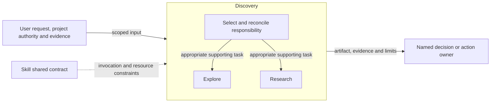
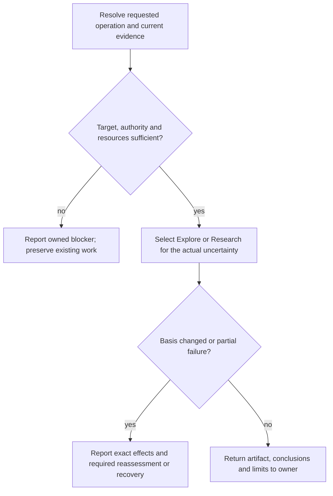

# Discovery Design

Model validation contract: model-document-v1

## Responsibility and scope

Discovery composes option-space exploration and bounded factual research. It owns choosing the appropriate support responsibility and returning findings to the decision owner; it does not establish another mandatory stage.

Parent: [Skill](../skill.md). [Skill](../skill.md) retains shared invocation, evidence-access, resource and portability rules. [Workflow](../workflow.md) coordinates authorized activity; [Assessment](../assessment.md) owns independent judgment and reliance. This decomposition changes no public invocation, stored format or external permission.

## Requirements

| ID | Required behavior |
| --- | --- |
| DISC-SR-01 | Discovery MUST distinguish material option-space uncertainty from bounded factual uncertainty and select Explore or Research accordingly. |
| DISC-SR-02 | Supporting artifacts MUST preserve evidence, inference, confidence and scope limits and return their conclusions to the named decision owner without adopting or mutating that decision. |
| DISC-SR-03 | Explicit invocation, incidental consideration, resource loading and safe artifact placement MUST retain their existing specialist boundaries; discovery MUST NOT become a mandatory lifecycle stage. |

## Architecture Overview

The overview identifies the owned responsibility and external authority/evidence boundaries. Detailed behavior is in the contract sections below; output does not imply adoption or approval.

| View | Necessity and reason | Owning detail |
| --- | --- | --- |
| Context | No separate diagram: the overview and responsibility scope identify the request, shared contract and receiving owner without an additional external system boundary. | Responsibility and scope above. |
| Building Block | No separate diagram: the overview names each child and the inventory delegates its internals. | [Child responsibility inventory](#child-responsibility-inventory). |
| Runtime | Necessary: authority, resource failures and partial or blocked outcomes must remain distinct from successful handoff. | [Runtime view](#runtime-view). |
| Deployment | No separate diagram: this is published guidance, not a separately deployed service. Artifact placement is governed by the specialist and project contracts. | [Skill Deployment](../skill.md#deployment-view). |

## Child responsibility inventory

| Child | Owned behavior |
| --- | --- |
| [Explore](explore.md) | Materially distinct alternatives and trade-offs. |
| [Research](research.md) | Attributable answers to bounded factual questions. |

## Specialist contract

Explore identifies materially different directions and their trade-offs. Research tests bounded factual uncertainty relevant to a supported decision. Either may be invoked independently; an Explore question can motivate separately authorized Research, whose findings return to the option comparison or original decision owner. Do not invoke both merely because both exist.

The adopted `discovery-support` resource family remains governed by Skill’s common source/projection contract. Both children apply its safe target, evidence, privacy and handoff rules; their own models define required output and stopping conditions. A supported owner may adopt, reject, qualify or request more evidence under that owner’s normal authority. No supporting write constitutes direction approval or a new stage.

## Runtime view

The specialist contract determines the permitted action and retry, including read-only or preparation-only operations. A successful artifact write does not grant downstream execution. Reconcile changed basis before dependent work and report partial effects truthfully.

### Boundary scan and acceptance scenarios

| Dimension | Requirement basis | Distinct outcome to demonstrate |
| --- | --- | --- |
| Input domain | DISC-SR-01, DISC-SR-02, DISC-SR-03 | An unclear option space selects Explore; a known option blocked by uncertain facts selects Research. |
| State/lifecycle | DISC-SR-01, DISC-SR-02, DISC-SR-03 | Incidental exploration or fact checking does not claim an explicit support invocation. |
| Identity/authority | DISC-SR-01, DISC-SR-02, DISC-SR-03 | Neither a support artifact nor an agent recommendation approves the owning decision. |
| Composition/path | DISC-SR-01, DISC-SR-02, DISC-SR-03 | Explore can identify a bounded research question; Research returns evidence without selecting the option. |
| Temporal/retry | DISC-SR-01, DISC-SR-02, DISC-SR-03 | Changed decision framing or stale sources prompt reassessment before handoff. |
| Failure/recovery | DISC-SR-01, DISC-SR-02, DISC-SR-03 | Insufficient evidence or owner ambiguity remains an explicit blocker or limitation. |
| Compatibility/migration | DISC-SR-01, DISC-SR-02, DISC-SR-03 | Project placement and current record contracts are preserved without historical conversion. |
| External/environment | DISC-SR-01, DISC-SR-02, DISC-SR-03 | Shared discovery resources and attribution/privacy rules apply to both children. |

## Architecture Decisions

| ID | Decision and rationale | Alternatives and consequences |
| --- | --- | --- |
| DISC-DEC-01 | Give Discovery one explicit current owner while retaining shared Skill policy and the specialist’s existing authority boundaries. | Keeping unrelated support duties together obscures responsibility. Duplicating their details in Skill would create competing owners; scoped extraction requires reconciled navigation and review. |

## Quality and limits

Review outcomes against actual inputs, authority and observable effects; structural checks alone do not establish adequacy. Preserve historical subjects, existing public vocabulary and required resource behavior. Unresolved material authority or evidence gaps stop dependent claims rather than inventing a successful outcome.
