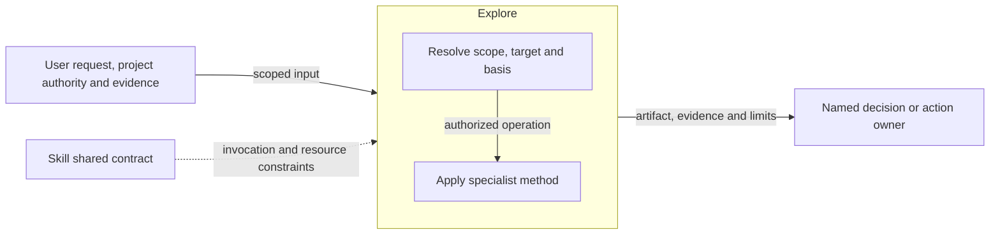
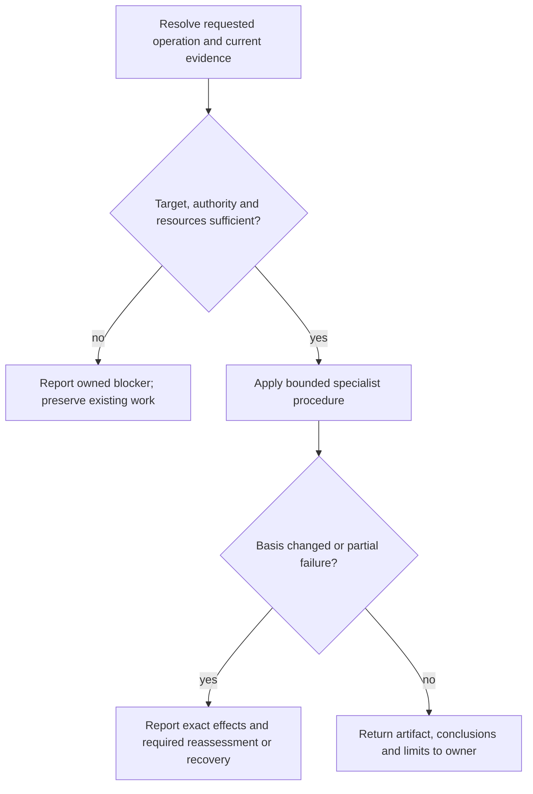

# Explore Design

Model validation contract: model-document-v1

## Responsibility and scope

Explore owns the existing `explore` capability’s scoped behavior, output and failure boundaries. Its detailed procedure below preserves the current specialist contract.

Parent: [Discovery](discovery.md). [Skill](../skill.md) retains shared invocation, evidence-access, resource and portability rules. [Workflow](../workflow.md) coordinates authorized activity; [Assessment](../assessment.md) owns independent judgment and reliance. This decomposition changes no public invocation, stored format or external permission.

## Requirements

| ID | Required behavior |
| --- | --- |
| EXP-SR-01 | Explore MUST bound the supported decision, distinguish facts/assumptions/unknowns and compare materially distinct options with relevant trade-offs. |
| EXP-SR-02 | Explicit invocation MUST produce or explicitly revise its standalone supporting artifact using safe exact targets and required resources; incidental consideration MUST NOT claim Explore completion. |
| EXP-SR-03 | Explore MUST stop at sufficient option coverage or an owned blocker and return conclusions to the decision owner without approving direction, changing authoritative artifacts or progressing workflow state. |

## Architecture Overview

The overview identifies the owned responsibility and external authority/evidence boundaries. Detailed behavior is in the contract sections below; output does not imply adoption or approval.

| View | Necessity and reason | Owning detail |
| --- | --- | --- |
| Context | No separate diagram: the overview and responsibility scope identify the request, shared contract and receiving owner without an additional external system boundary. | Responsibility and scope above. |
| Building Block | No separate diagram: classification and the specialist operation form one method; no separate internal subsystem is selected. | [Specialist contract](#specialist-contract). |
| Runtime | Necessary: authority, resource failures and partial or blocked outcomes must remain distinct from successful handoff. | [Runtime view](#runtime-view). |
| Deployment | No separate diagram: this is published guidance, not a separately deployed service. Artifact placement is governed by the specialist and project contracts. | [Skill Deployment](../skill.md#deployment-view). |

## Specialist contract

Explore expands materially unclear alternatives without adopting its conclusions for an owning stage. Identify the supported decision, affected users/systems, owner when known and smallest relevant evidence. Separate inspected facts, assumptions and unknowns. Challenge solution-biased framing and compare materially distinct options against decision-relevant criteria, including scope and reversibility.

An explicit invocation creates or explicitly revises one standalone supporting artifact; incidental option consideration inside another stage creates no Explore-completion claim. Resolve an absent exact target under `docs/explorations/YYYY-MM-DD-slug.md`, or an explicitly selected existing artifact for revision, under project placement authority. Never overwrite an unrelated artifact. Load `references/discovery-support.md` and the exploration skeleton for every explicit invocation; additional option-framing methods retain their declared triggers.

Option generation has no fixed count or taxonomy. Include status quo or deferral when credible, and explain when each direction fits; do not manufacture weak alternatives to meet a quota. The option-discovery method applies when framing or differentiation needs it; the high-impact method applies to strategically broad or difficult-to-reverse decisions.

The output contains the supported decision/problem, facts, assumptions, unknowns, options, criteria, comparison, bounded Research questions, remaining uncertainty and recommended handoff. A leading option is advice, not approval. Complete the mapped skeleton without unfilled placeholders. Tracking follows applicable project authority; it is not permission to commit or mutate an external system.

Stop when enough distinct options expose the decision space and another option would restate an existing direction. Bounded factual blockers may be handed to Research; approved-decision contradictions return to the decision owner without editing that decision. Unsafe or colliding targets, missing required resources, unbounded scope and material owner ambiguity stop dependent output. Return the artifact, options and trade-offs, uncertainty and next owner; do not freeze requirements, approve direction or progress workflow state.

Project artifact placement follows exact user/project targets and governed identity where selected, then safe portable defaults. Malformed governed signals never trigger a portable fallback. Artifact-location and discovery guides point to these owners instead of defining competing behavior.

## Runtime view

The specialist contract determines the permitted action and retry, including read-only or preparation-only operations. A successful artifact write does not grant downstream execution. Reconcile changed basis before dependent work and report partial effects truthfully.

### Boundary scan and acceptance scenarios

| Dimension | Requirement basis | Distinct outcome to demonstrate |
| --- | --- | --- |
| Input domain | EXP-SR-01, EXP-SR-02, EXP-SR-03 | An unclear option space is distinguished from a bounded factual question. |
| State/lifecycle | EXP-SR-01, EXP-SR-02, EXP-SR-03 | Incidental brainstorming produces no standalone invocation-completion claim. |
| Identity/authority | EXP-SR-01, EXP-SR-02, EXP-SR-03 | An unsafe or colliding output target stops without replacing another artifact. |
| Composition/path | EXP-SR-01, EXP-SR-02, EXP-SR-03 | Distinct alternatives expose meaningful trade-offs instead of cosmetic variants. |
| Temporal/retry | EXP-SR-01, EXP-SR-02, EXP-SR-03 | New information that changes the decision framing requires reassessment before handoff. |
| Failure/recovery | EXP-SR-01, EXP-SR-02, EXP-SR-03 | An approved-decision contradiction returns to its owner without editing the approved artifact. |
| Compatibility/migration | EXP-SR-01, EXP-SR-02, EXP-SR-03 | Project-specific placement is preserved; malformed governed signals do not fall back to portable writes. |
| External/environment | EXP-SR-01, EXP-SR-02, EXP-SR-03 | Unavailable evidence remains an assumption or bounded Research question, not an established fact. |

### Test design

Apply [System's selection and proof rules](../../test-design/rules.md#select-requirements-and-proof). EXP-SR-01–03 require a useful bounded comparison, a safe explicit artifact and an owner-preserving stop. Semantic walkthroughs are the smallest sufficient boundary for relevance, differentiation and authority; package checks separately protect required resources and representation.

| Behavior group and requirement basis | Concrete fixture and faulty candidate | Action and independently expected observation |
| --- | --- | --- |
| Distinct options and evidence — EXP-SR-01, EXP-SR-03 | A decision owner must support occasional offline use with limited operational capacity. Supply inspected user constraints and uncertainty about one platform fact. The compliant comparison contrasts local operation, a hosted approach with explicit offline limits and credible deferral; the faulty comparison renames the same hosted approach three times and treats the uncertain fact as established. | Review the question, evidence labels, criteria, consequences, scope and reversibility. Options must differ on a decision-relevant mechanism or trade-off, show when each fits and expose the remaining bounded Research question. Do not impose an option quota or manufacture weak alternatives; stop once further options restate existing directions. |
| Explicit artifact and resources — EXP-SR-02 | Independent packets request a new exploration at an absent authorized target, revision of a named existing exploration, and incidental brainstorming within Design. Faulty candidates overwrite an unrelated artifact, claim incidental discussion completed Explore, or omit a required resource while reconstructing its procedure. | Trace exact target resolution, required shared method/skeleton and triggered option/high-impact resources through the proposed output. Explicit use produces the complete standalone artifact at the safe selected target; incidental use makes no completion claim. Collision, escaped target, malformed governed signal or missing resource stops dependent writes without portable fallback. |
| Changing framing and decision ownership — EXP-SR-01, EXP-SR-03 | A new user constraint contradicts the approved direction after initial comparison; another packet lacks a material decision owner or sufficient scope bounds. The faulty candidate edits the approved proposal to match its favored option. | Inspect the revised comparison and proposed handoff. Reassess materially changed framing, disclose uncertainty or an owned blocker, and return contradictions to the decision owner. Advice and artifact completion cannot freeze requirements, approve direction, progress workflow state, commit changes or mutate external systems. |

Construct each walkthrough from a fresh bounded request, fixed evidence excerpts, project placement rules and candidate artifact/diff. Compare a compliant artifact and one deliberate semantic or authority violation using contract-derived expectations; do not score headings or option counts as usefulness. Target-collision variants include literal before bytes, and privacy variants include a fictional private input that must be omitted from the shareable artifact under shared discovery rules.

Existing [Discovery guidance tests](../../../../tests/skill/skill_discovery_guidance_tests.py) guard Explore's standalone-path and proportionality phrases, required resource presence, exact shared-policy copies and absence of maintainer-only details. These assertions do not assess the options, execute target selection or establish safe agent behavior. The three groups remain proposed independent review of [Explore's canonical method](../../../../skills/explore/SKILL.md), triggered resources and concrete outputs; Delivery must allocate packets and record the actual assessment. [Discovery](discovery.md#test-design) owns selection between children and the Research return path. The existing architecture views remain accurate because the proof examines the current authoring and handoff boundary.

## Architecture Decisions

| ID | Decision and rationale | Alternatives and consequences |
| --- | --- | --- |
| EXP-DEC-01 | Give Explore one explicit current owner while retaining shared Skill policy and the specialist’s existing authority boundaries. | Keeping unrelated support duties together obscures responsibility. Duplicating their details in Skill would create competing owners; scoped extraction requires reconciled navigation and review. |

## Quality and limits

Review outcomes against actual inputs, authority and observable effects; structural checks alone do not establish adequacy. Preserve historical subjects, existing public vocabulary and required resource behavior. Unresolved material authority or evidence gaps stop dependent claims rather than inventing a successful outcome.
