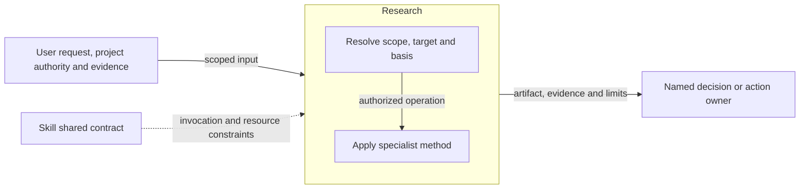
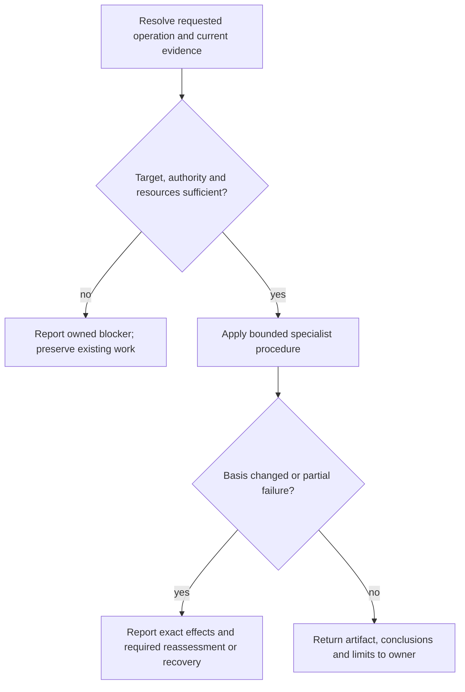

# Research Design

Model validation contract: model-document-v1

## Responsibility and scope

Research owns the existing `research` capability’s scoped behavior, output and failure boundaries. Its detailed procedure below preserves the current specialist contract.

Parent: [Discovery](discovery.md). [Skill](../skill.md) retains shared invocation, evidence-access, resource and portability rules. [Workflow](../workflow.md) coordinates authorized activity; [Assessment](../assessment.md) owns independent judgment and reliance. This decomposition changes no public invocation, stored format or external permission.

## Requirements

| ID | Required behavior |
| --- | --- |
| RES-SR-01 | Research MUST establish bounded decision-relevant questions, evidence criteria and stopping conditions before investigation. |
| RES-SR-02 | Findings MUST have attributable evidence, proportionate source-quality/freshness assessment and explicit confidence; inference, assumptions and unavailable evidence MUST remain distinguishable. |
| RES-SR-03 | Explicit invocation MUST preserve safe artifact/resource boundaries and return qualified findings to the decision owner without implying adoption, approval or mutation of that owner’s work. |

## Architecture Overview

The overview identifies the owned responsibility and external authority/evidence boundaries. Detailed behavior is in the contract sections below; output does not imply adoption or approval.

| View | Necessity and reason | Owning detail |
| --- | --- | --- |
| Context | No separate diagram: the overview and responsibility scope identify the request, shared contract and receiving owner without an additional external system boundary. | Responsibility and scope above. |
| Building Block | No separate diagram: classification and the specialist operation form one method; no separate internal subsystem is selected. | [Specialist contract](#specialist-contract). |
| Runtime | Necessary: authority, resource failures and partial or blocked outcomes must remain distinct from successful handoff. | [Runtime view](#runtime-view). |
| Deployment | No separate diagram: this is published guidance, not a separately deployed service. Artifact placement is governed by the specialist and project contracts. | [Skill Deployment](../skill.md#deployment-view). |

## Specialist contract

Research resolves bounded factual uncertainty with attributable sources and confidence; it does not adopt conclusions for an owning stage. Identify the supported decision, owner when known, bounded questions, acceptable evidence, what could change the answer and a material stopping condition before collecting evidence.

Inspect the smallest relevant repository evidence first when the answer may be locally governed or observable. Use authoritative, relevant and sufficiently fresh external sources when needed; distinguish evidence from inference and assumption. Assess source quality and confidence in each material finding and in the bounded answer. Stale, missing or contradictory evidence cannot become an established fact. Experiments or non-trivial confidence analysis load their conditional method only when they can materially answer the question.

An explicit invocation creates or explicitly revises one standalone artifact at the project-authorized target, with portable creation at `docs/research/YYYY-MM-DD-slug.md`. Incidental fact checks do not create a Research-completion claim. Load `references/discovery-support.md` and the research skeleton for every explicit invocation; source/experiment methods retain their triggers. Exact targets, required resources, evidence and authority must be safe and sufficient before writing.

Complete the mapped skeleton without unfilled placeholders. Keep secrets, credentials, unnecessary private raw input and machine-local absolute paths out of the artifact. Tracking follows applicable project authority; it is not permission to commit or mutate an external system.

Stop when additional investigation is unlikely to change the supported decision. Responsible partial findings state remaining uncertainty and confidence; unavailable evidence that prevents a responsible answer blocks completion. Return the bounded question, examined inputs, evidence/source quality, findings, assumptions, confidence, implications, remaining uncertainty and next owner. Research completion concerns only its supporting artifact, never another stage's approval or mutation.

Project artifact placement follows exact user/project targets and governed identity where selected, then safe portable defaults. Malformed governed signals never trigger a portable fallback. Artifact-location and discovery guides point to these owners instead of defining competing behavior.

## Runtime view

The specialist contract determines the permitted action and retry, including read-only or preparation-only operations. A successful artifact write does not grant downstream execution. Reconcile changed basis before dependent work and report partial effects truthfully.

### Boundary scan and acceptance scenarios

| Dimension | Requirement basis | Distinct outcome to demonstrate |
| --- | --- | --- |
| Input domain | RES-SR-01, RES-SR-02, RES-SR-03 | An unbounded question stops before collection; bounded questions identify decision impact. |
| State/lifecycle | RES-SR-01, RES-SR-02, RES-SR-03 | Completing a research artifact does not update another stage’s status. |
| Identity/authority | RES-SR-01, RES-SR-02, RES-SR-03 | A missing or ambiguous exact target prevents dependent output. |
| Composition/path | RES-SR-01, RES-SR-02, RES-SR-03 | Conflicting sources affect confidence and implications rather than being silently combined. |
| Temporal/retry | RES-SR-01, RES-SR-02, RES-SR-03 | Volatile or stale evidence is reassessed before relying on its conclusions. |
| Failure/recovery | RES-SR-01, RES-SR-02, RES-SR-03 | Unavailable evidence that prevents a responsible answer blocks completion; qualified partial findings disclose limits. |
| Compatibility/migration | RES-SR-01, RES-SR-02, RES-SR-03 | Existing research artifacts are revised only under explicit target authority. |
| External/environment | RES-SR-01, RES-SR-02, RES-SR-03 | Source authority, freshness and provenance support factual claims; secrets/private raw input are omitted. |

### Test design

Apply [System's selection and proof rules](../../test-design/rules.md#select-requirements-and-proof). RES-SR-01–03 protect bounded investigation, justified conclusions and safe support handoff. Choose independent evidence/artifact walkthroughs for source quality, confidence and stopping judgment. Real experiments are needed only when the chosen question relies on observed executable behavior; a paper scenario cannot claim an experiment occurred.

| Behavior group and requirement basis | Concrete fixture and faulty candidate | Action and independently expected observation |
| --- | --- | --- |
| Bound the question before collection — RES-SR-01 | A selected implementation needs to know whether a named version supports an offline operation. Supply the decision owner, required environment, acceptable evidence and what answer would change the choice. Contrast that packet with an unbounded request to investigate all future platform options. The faulty plan starts an open-ended search without a stopping condition. | Inspect the proposed investigation before collection. Require a bounded question, decision impact, evidence criteria and material stopping condition; clarify or block the unbounded request. Inspect relevant local governing/observable evidence first when it can answer the question, and stop when further investigation is unlikely to change the decision. |
| Evidence quality, conflict and volatility — RES-SR-01, RES-SR-02 | A fixed evidence packet contains a current primary document for version B, a stale secondary claim about version A, and a repository configuration pinning A. A separate variant omits the source needed for a responsible answer. The faulty report silently combines versions and labels its conclusion certain. | Assess each material finding against source identity, relevance, freshness and attribution; separate direct evidence, inference and assumptions. Reassess changed/volatile evidence before reliance, disclose conflicts and qualified confidence, and report responsible partial findings or block completion when essential evidence is unavailable. A proposed experiment must state its conditions and limits rather than invent results. |
| Artifact safety and owner return — RES-SR-02, RES-SR-03 | An explicit request supplies an absent authorized target and required resources; variants select an existing artifact for revision, collide with unrelated work, have malformed governed identity or contain fictional private raw input. The faulty report leaks that input, overwrites the collision or edits the owning Design to adopt its conclusion. | Trace shared method/skeleton and conditional source/experiment resource loading, then inspect the artifact and effect account. Produce complete qualified findings only at the safe exact target; omit secrets and unnecessary private/machine-local data. Missing resources or unsafe identity stops dependent writes. Incidental fact checking makes no Research-completion claim; explicit completion does not approve or mutate the owner's decision or workflow. |

Use fresh synthetic evidence packets with independently specified source dates, versions, known facts and withheld evidence. No live network is required to assess source reasoning against those facts; that simulation cannot prove current external behavior. Review records for real investigations must identify the actual inspected sources, experiments and limits. Each collision or revision variant preserves independent before bytes and authorized target scope.

Existing [Discovery guidance tests](../../../../tests/skill/skill_discovery_guidance_tests.py) check Research's bounded/standalone/owner/confidence wording, required resources and byte-identical shared support policy. They establish those structural observations only. The groups above are proposed independent procedures over [Research's canonical method](../../../../skills/research/SKILL.md), triggered resources and report candidates; no performed source-quality assessment or agent evaluation is implied. Delivery allocates exact review packets and actual evidence. [Discovery](discovery.md#test-design) owns the additional selection and receiving-owner composition. Architecture views need no change because no new evidence service, execution mechanism or authority boundary is introduced.

## Architecture Decisions

| ID | Decision and rationale | Alternatives and consequences |
| --- | --- | --- |
| RES-DEC-01 | Give Research one explicit current owner while retaining shared Skill policy and the specialist’s existing authority boundaries. | Keeping unrelated support duties together obscures responsibility. Duplicating their details in Skill would create competing owners; scoped extraction requires reconciled navigation and review. |

## Quality and limits

Review outcomes against actual inputs, authority and observable effects; structural checks alone do not establish adequacy. Preserve historical subjects, existing public vocabulary and required resource behavior. Unresolved material authority or evidence gaps stop dependent claims rather than inventing a successful outcome.
