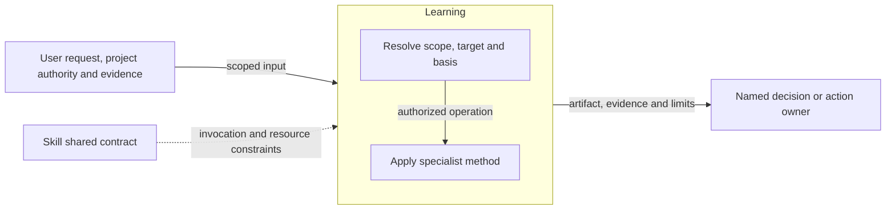
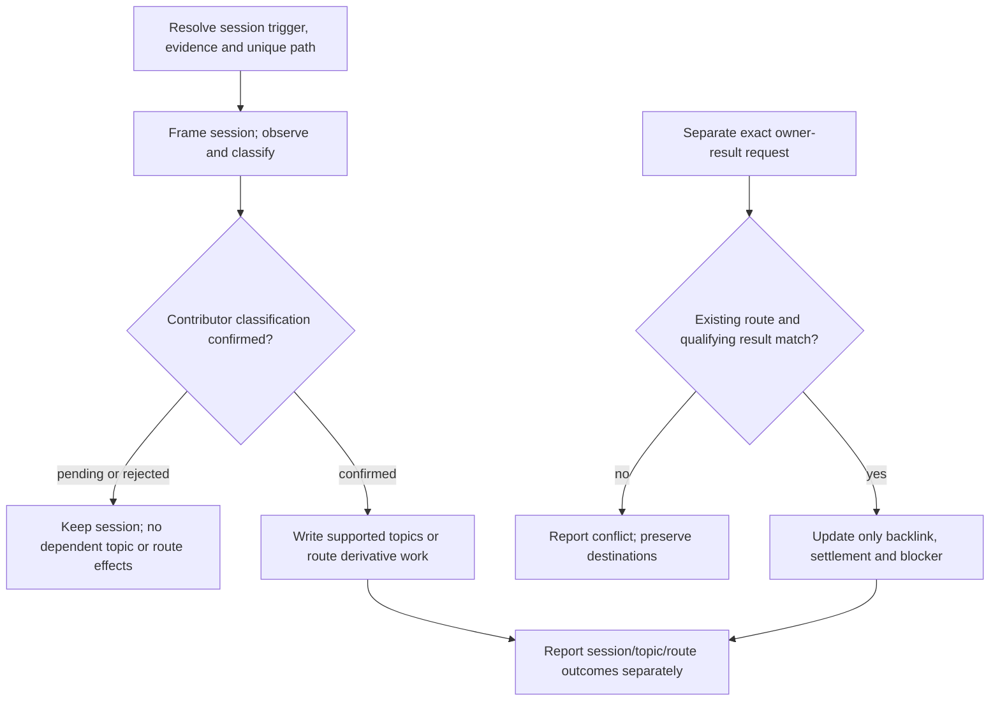

# Learning Design

Model validation contract: model-document-v1

## Responsibility and scope

Learning owns the existing `learn` capability’s scoped behavior, output and failure boundaries. Its detailed procedure below preserves the current specialist contract.

Parent: [Skill](skill.md). [Skill](skill.md) retains shared invocation, evidence-access, resource and portability rules. [Workflow](workflow.md) coordinates authorized activity; [Assessment](assessment.md) owns independent judgment and reliance. This decomposition changes no public invocation, stored format or external permission.

## Requirements

| ID | Required behavior |
| --- | --- |
| LRN-SR-01 | Learning MUST preserve the session frame, evidence/classification distinction and required contributor confirmation before dependent topic or route effects. |
| LRN-SR-02 | Durable topics MUST be supported, identity-bound and subordinate to authoritative contracts; session creation and topic writes MUST preserve no-clobber and idempotent retry boundaries. |
| LRN-SR-03 | Route-result recording MUST bind the exact existing route and qualifying owner-produced result, modifying only its permitted backlink/settlement/blocker fields without invoking or mutating the destination owner. |

## Architecture Overview

The overview identifies the owned responsibility and external authority/evidence boundaries. Detailed behavior is in the contract sections below; output does not imply adoption or approval.

| View | Necessity and reason | Owning detail |
| --- | --- | --- |
| Context | No separate diagram: the overview and responsibility scope identify the request, shared contract and receiving owner without an additional external system boundary. | Responsibility and scope above. |
| Building Block | No separate diagram: classification and the specialist operation form one method; no separate internal subsystem is selected. | [Specialist contract](#specialist-contract). |
| Runtime | Necessary: authority, resource failures and partial or blocked outcomes must remain distinct from successful handoff. | [Runtime view](#runtime-view). |
| Deployment | No separate diagram: this is published guidance, not a separately deployed service. Artifact placement is governed by the specialist and project contracts. | [Skill Deployment](skill.md#deployment-view). |

## Specialist contract

Learn is periodic or explicitly invoked. `run-learn-session` loads the session method and resolves an exact trigger, scope, evidence and unique session path under `docs/learn/sessions/`; collision suffixes start at `-2`, with no-clobber checks. Frame establishes a durable session, even when later work finds no lesson or confirmation is withheld. Observe separates evidence, inference and unavailable/sensitive data; Classify preserves observation, durable-lesson, artifact-update, decision, direction, process-follow-up and no-durable-lesson outcomes. Required contributor confirmation settles classification only. Pending/rejected confirmation permits no dependent topic or route effects. Confirmed reusable guidance goes to `docs/learn/topics/` with source links, never overriding authoritative models. Topic updates are identity-bound and idempotent; a single event requires evidence of a reusable/systemic gap before becoming durable guidance.

Learn routes derivative work to its owner, using stable session-local `ROUTE-NNN` identities, exact destinations, owners, source/evidence, fixed completion kind (`authoritative-artifact` or `durable-scheduled-follow-up`) and settlement (`pending-owner-action`, `complete`, `blocked`). `record-learn-route-result` binds one existing session/route and exact qualifying owner-produced result, changing only its backlink, settlement and blocker. It cannot redo classification, poll or invoke owners, update topics, mutate destinations or infer approval. Matching retry is idempotent; changed basis or conflicting results stop. Historical sessions remain readable but are not implicitly migrated into result-recording targets. Trigger-owner deferral is not a learn session or execution claim.

## Interface vocabulary and outputs

The following public domains retain their existing meanings. Unknown values reject before consistency checks; recognized values still require the operation’s authority and prerequisites.

| Capability / independent axis | Supported values |
| --- | --- |
| Learn confirmation | pending, confirmed, rejected |

Learn reports session/trigger/scope, confirmation, recording and topic outcomes, route IDs/settlements, exact owner results, blockers and handoff; recording completion does not mean destination completion.

## Runtime view

The specialist contract determines the permitted action and retry, including read-only or preparation-only operations. A successful artifact write does not grant downstream execution. Reconcile changed basis before dependent work and report partial effects truthfully.

### Boundary scan and acceptance scenarios

| Dimension | Requirement basis | Distinct outcome to demonstrate |
| --- | --- | --- |
| Input domain | LRN-SR-01, LRN-SR-02, LRN-SR-03 | A session-path collision selects an authorized no-clobber suffix; unsubstantiated one-off events do not become reusable rules. |
| State/lifecycle | LRN-SR-01, LRN-SR-02, LRN-SR-03 | Pending or rejected confirmation permits no dependent topic or route effect. |
| Identity/authority | LRN-SR-01, LRN-SR-02, LRN-SR-03 | Confirmation settles classification only, not adoption or destination authority. |
| Composition/path | LRN-SR-01, LRN-SR-02, LRN-SR-03 | A derivative change routes to its owner and remains distinct from session-recording completion. |
| Temporal/retry | LRN-SR-01, LRN-SR-02, LRN-SR-03 | Matching topic or route-result retries are idempotent; changed result basis stops. |
| Failure/recovery | LRN-SR-01, LRN-SR-02, LRN-SR-03 | Blocked destination results remain visible without polling, invoking or mutating that owner. |
| Compatibility/migration | LRN-SR-01, LRN-SR-02, LRN-SR-03 | Historical sessions are readable but not implicitly converted into result-recording targets. |
| External/environment | LRN-SR-01, LRN-SR-02, LRN-SR-03 | Unavailable or sensitive observations are distinguished from shareable evidence and inference. |

### Test design

Apply [System's selection and proof rules](../test-design/rules.md#select-requirements-and-proof). LRN-SR-01–03 cover session/evidence integrity, justified topic effects and narrowly owned route-result updates. Independent walkthroughs inspect classification and authority; byte-level candidate comparisons expose accidental changes outside the permitted session or route. Session recording and destination completion require separate observations.

| Behavior group and requirement basis | Concrete fixture and faulty candidate | Action and independently expected observation |
| --- | --- | --- |
| Frame, collision and repeated invocation — LRN-SR-01, LRN-SR-02 | A trigger names two observations and a bounded evidence window. Occupied base and `-2` paths leave `-3` absent. Independent variants contain an incomplete Frame or the same complete session/evidence identity. The faulty candidate overwrites the occupied record or treats changed evidence as the same retry. | Inspect the proposed first write, absence recheck and result. Record the complete Frame at the lowest available safe path; preserve malformed/partial records without adopting them. A matching complete session is idempotent; changed basis starts a new unique session. Trigger-owner deferral remains distinct from a session and its completion. |
| Classification and confirmation — LRN-SR-01, LRN-SR-02 | Contrast a one-off inconvenience without systemic evidence, recurring independent failures, and a maintainer's unevidenced new direction. Supply a compliant classification rationale and a faulty candidate calling all three durable lessons. Use separate pending, rejected, confirmed and unknown confirmation variants. | Review evidence, inference, unknown/private exclusions and one primary classification per observation. A one-off needs a reusable/systemic basis before durable capture; an unevidenced desired rule is direction. Persist pending or rejected disposition with no dependent topic/route effects. Confirmed classification permits only its appropriate effect, never policy adoption; unknown values stop before consistency decisions. |
| Topic integrity and authority — LRN-SR-01, LRN-SR-02 | A confirmed reusable lesson has source links, an existing topic T0 and governing policy that the lesson cannot override. An interrupted exact topic effect is compared with changed T1 and conflicting-content variants. The faulty candidate replaces policy with its lesson or appends the same effect twice. | Inspect proposed topic bytes, source traceability and result. Preserve governing authority and prior relevant guidance, apply the same effect idempotently, and stop on conflicting/ambiguous content. Unsupported, sensitive or duplicate observations cannot become new guidance by changing their label. |
| Owner-bound routes and result recording — LRN-SR-03 | A session has ROUTE-001 requiring an authoritative artifact, ROUTE-002 permitting a durable scheduled follow-up, and unrelated ROUTE-003. Provide exact qualifying owner results plus wrong-kind, missing, stale and conflicting-result variants. The faulty candidate marks ROUTE-001 complete from chat or scheduling alone, polls its owner or rewrites another route. | Trace route creation and a separately requested result update. Preserve stable identity, source/basis, exact destination and immutable completion kind. Update only the matching backlink, settlement and blocker; unchanged classification, confirmation, topics, other routes and destination bytes are required. Matching result retry is idempotent, differing basis requires reconciliation, and blocked/pending effects remain visible. Historical sessions stay readable without implicit migration into writable targets. |

Each packet uses a fresh synthetic session/topic tree, independent expected classifications, exact authority and immutable before bytes. Keep a route-result retry within one ordered scenario and never depend on an earlier review's effects. Include missing required session-method and ambiguous-operation variants before session creation; result-only invocation does not load an untriggered session method. No reviewer invokes or polls a real destination or writes a workflow record to make the scenario appear complete.

Existing [Learn guidance tests](../../../tests/skill/skill_learn_guidance_tests.py) assert package profiles, resource triggers, field/vocabulary declarations and required collision, confirmation, retry and claim-limit wording. [Canonical Skill tests](../../../tests/skill/skill_canonical_tests.py) add session/topic artifact-contract wording. These are structural protection only; none proves evidence-based classification, contributor confirmation or the proposed bounded update. All four semantic groups remain proposed independent procedures needing concrete packets, exact-subject assessment and evidence allocation by Delivery. [Skill](test-design/cases/capability-composition.json) owns consumption of lessons by other capabilities. Existing views already represent confirmation, topic effects and the separate route-result path, so the coverage adds no architecture element.

## Architecture Decisions

| ID | Decision and rationale | Alternatives and consequences |
| --- | --- | --- |
| LRN-DEC-01 | Give Learning one explicit current owner while retaining shared Skill policy and the specialist’s existing authority boundaries. | Keeping unrelated support duties together obscures responsibility. Duplicating their details in Skill would create competing owners; scoped extraction requires reconciled navigation and review. |

## Quality and limits

Review outcomes against actual inputs, authority and observable effects; structural checks alone do not establish adequacy. Preserve historical subjects, existing public vocabulary and required resource behavior. Unresolved material authority or evidence gaps stop dependent claims rather than inventing a successful outcome.
