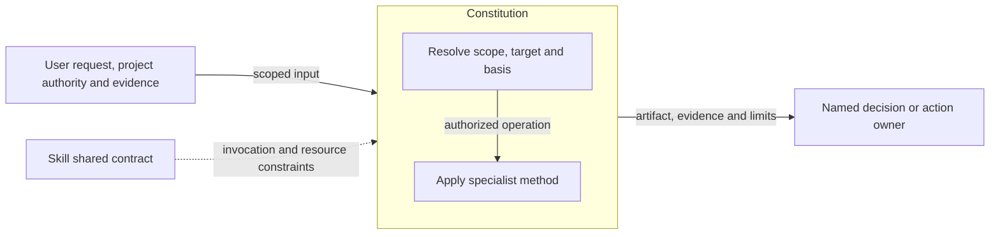
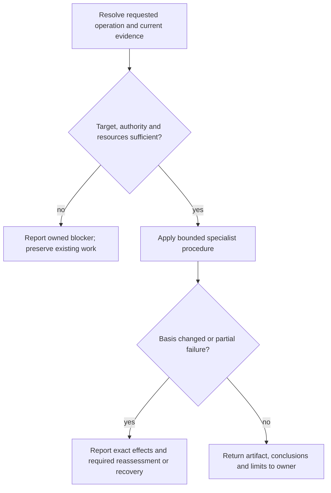

# Constitution Design

Model validation contract: model-document-v1

## Responsibility and scope

Constitution owns the existing `constitution` capability’s scoped behavior, output and failure boundaries. Its detailed procedure below preserves the current specialist contract.

Parent: [Project Foundations](project-foundations.md). [Skill](../skill.md) retains shared invocation, evidence-access, resource and portability rules. [Workflow](../workflow.md) coordinates authorized activity; [Assessment](../assessment.md) owns independent judgment and reliance. This decomposition changes no public invocation, stored format or external permission.

## Requirements

| ID | Required behavior |
| --- | --- |
| GOV-SR-01 | Constitution authoring MUST preserve project authority, existing governance and equivalent guidance while making durable principles explicit and reviewable. |
| GOV-SR-02 | Material conflicts, absent evidence and assumptions MUST be disclosed to the responsible owner; authoring MUST NOT silently replace higher-priority rules. |
| GOV-SR-03 | Output MUST identify changed rules and unresolved questions without duplicating detailed Designs, workflow procedures or temporary feature plans. |

## Architecture Overview

The overview identifies the owned responsibility and external authority/evidence boundaries. Detailed behavior is in the contract sections below; output does not imply adoption or approval.

| View | Necessity and reason | Owning detail |
| --- | --- | --- |
| Context | No separate diagram: the overview and responsibility scope identify the request, shared contract and receiving owner without an additional external system boundary. | Responsibility and scope above. |
| Building Block | No separate diagram: classification and the specialist operation form one method; no separate internal subsystem is selected. | [Specialist contract](#specialist-contract). |
| Runtime | Necessary: authority, resource failures and partial or blocked outcomes must remain distinct from successful handoff. | [Runtime view](#runtime-view). |
| Deployment | No separate diagram: this is published guidance, not a separately deployed service. Artifact placement is governed by the specialist and project contracts. | [Skill Deployment](../skill.md#deployment-view). |

## Specialist contract

Constitution governs principles rather than detailed workflow mechanics. Define or revise governing engineering principles under the user's authority; expose conflicts instead of silently overriding higher-priority rules.

Inspect existing governance and relevant repository conventions, identify decision-causing gaps and state assumptions where evidence is absent. Preserve the project's selected authoritative artifact and equivalent existing guidance. An existing AGENTS-only convention need not gain a separate Constitution unless more detail is justified. Use precise MUST/SHOULD/MAY language with reviewable criteria, and distinguish durable project rules from temporary feature details.

Cover applicable purpose, source authority, requirements, tests, architectural boundaries, security/privacy, compatibility, verification, review, documentation and agent behavior. Reference the owning contracts for detailed procedures rather than reproduce them. Disclose conflicts with current practice and recommend an owner resolution; do not silently delete governance or turn implementation details into universal rules. Report files changed, rules changed, assumptions and unresolved governance questions.

Project artifact placement follows exact user/project targets and governed identity where selected, then safe portable defaults. Malformed governed signals never trigger a portable fallback. Artifact-location and discovery guides point to these owners instead of defining competing behavior.

## Runtime view

The specialist contract determines the permitted action and retry, including read-only or preparation-only operations. A successful artifact write does not grant downstream execution. Reconcile changed basis before dependent work and report partial effects truthfully.

### Boundary scan and acceptance scenarios

| Dimension | Requirement basis | Distinct outcome to demonstrate |
| --- | --- | --- |
| Input domain | GOV-SR-01, GOV-SR-02, GOV-SR-03 | Absent guidance yields stated assumptions; equivalent existing guidance is preserved. |
| State/lifecycle | GOV-SR-01, GOV-SR-02, GOV-SR-03 | A principles amendment records stable rules, not current milestone or review state. |
| Identity/authority | GOV-SR-01, GOV-SR-02, GOV-SR-03 | Conflicting governance is disclosed without silently overriding its authority. |
| Composition/path | GOV-SR-01, GOV-SR-02, GOV-SR-03 | Detailed design and workflow procedures remain referenced at their owners. |
| Temporal/retry | GOV-SR-01, GOV-SR-02, GOV-SR-03 | A concurrent governance change requires current-basis reassessment before dependent edits. |
| Failure/recovery | GOV-SR-01, GOV-SR-02, GOV-SR-03 | Missing authority stops the conflicting slice while preserving unrelated work. |
| Compatibility/migration | GOV-SR-01, GOV-SR-02, GOV-SR-03 | An AGENTS-only project keeps its selected artifact convention unless expansion is justified. |
| External/environment | GOV-SR-01, GOV-SR-02, GOV-SR-03 | Unavailable repository evidence remains an explicit limitation, not an invented rule. |

## Architecture Decisions

| ID | Decision and rationale | Alternatives and consequences |
| --- | --- | --- |
| GOV-DEC-01 | Give Constitution one explicit current owner while retaining shared Skill policy and the specialist’s existing authority boundaries. | Keeping unrelated support duties together obscures responsibility. Duplicating their details in Skill would create competing owners; scoped extraction requires reconciled navigation and review. |

## Quality and limits

Review outcomes against actual inputs, authority and observable effects; structural checks alone do not establish adequacy. Preserve historical subjects, existing public vocabulary and required resource behavior. Unresolved material authority or evidence gaps stop dependent claims rather than inventing a successful outcome.
