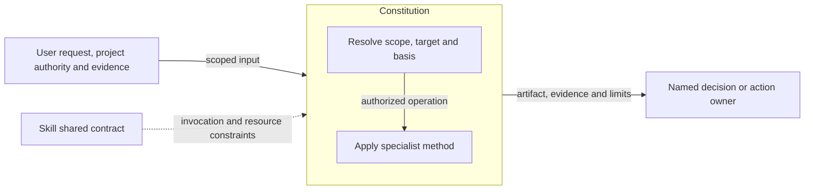
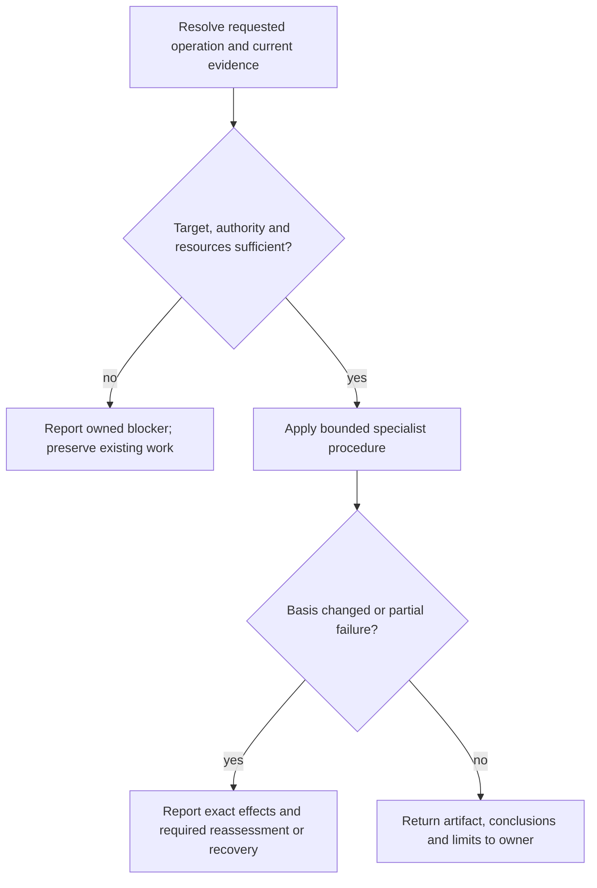

# Constitution Design

Model validation contract: model-document-v1

## Responsibility and scope

Constitution owns the existing `constitution` capability’s scoped behavior, output and failure boundaries. Its detailed procedure below preserves the current specialist contract.

Parent: [Project Foundations](project-foundations.md). [Skill](../skill.md) retains shared invocation, evidence-access, resource and portability rules. [Workflow](../workflow.md) coordinates authorized activity; [Assessment](../assessment.md) owns independent judgment and reliance. This decomposition changes no public invocation, stored format or external permission.

## Requirements

| ID | Required behavior |
| --- | --- |
| GOV-SR-01 | Constitution authoring MUST preserve project authority, existing governance and equivalent guidance while making durable principles explicit and reviewable. |
| GOV-SR-02 | Material conflicts, absent evidence and assumptions MUST be disclosed to the responsible owner; authoring MUST NOT silently replace higher-priority rules. |
| GOV-SR-03 | Output MUST identify changed rules and unresolved questions without duplicating detailed Designs, workflow procedures or temporary feature plans. |

## Architecture Overview

The overview identifies the owned responsibility and external authority/evidence boundaries. Detailed behavior is in the contract sections below; output does not imply adoption or approval.

| View | Necessity and reason | Owning detail |
| --- | --- | --- |
| Context | No separate diagram: the overview and responsibility scope identify the request, shared contract and receiving owner without an additional external system boundary. | Responsibility and scope above. |
| Building Block | No separate diagram: classification and the specialist operation form one method; no separate internal subsystem is selected. | [Specialist contract](#specialist-contract). |
| Runtime | Necessary: authority, resource failures and partial or blocked outcomes must remain distinct from successful handoff. | [Runtime view](#runtime-view). |
| Deployment | No separate diagram: this is published guidance, not a separately deployed service. Artifact placement is governed by the specialist and project contracts. | [Skill Deployment](../skill.md#deployment-view). |

## Specialist contract

Constitution governs principles rather than detailed workflow mechanics. Define or revise governing engineering principles under the user's authority; expose conflicts instead of silently overriding higher-priority rules.

Inspect existing governance and relevant repository conventions, identify decision-causing gaps and state assumptions where evidence is absent. Preserve the project's selected authoritative artifact and equivalent existing guidance. An existing AGENTS-only convention need not gain a separate Constitution unless more detail is justified. Use precise MUST/SHOULD/MAY language with reviewable criteria, and distinguish durable project rules from temporary feature details.

Cover applicable purpose, source authority, requirements, tests, architectural boundaries, security/privacy, compatibility, verification, review, documentation and agent behavior. Reference the owning contracts for detailed procedures rather than reproduce them. Disclose conflicts with current practice and recommend an owner resolution; do not silently delete governance or turn implementation details into universal rules. Report files changed, rules changed, assumptions and unresolved governance questions.

Project artifact placement follows exact user/project targets and governed identity where selected, then safe portable defaults. Malformed governed signals never trigger a portable fallback. Artifact-location and discovery guides point to these owners instead of defining competing behavior.

## Runtime view

The specialist contract determines the permitted action and retry, including read-only or preparation-only operations. A successful artifact write does not grant downstream execution. Reconcile changed basis before dependent work and report partial effects truthfully.

### Boundary scan and acceptance scenarios

| Dimension | Requirement basis | Distinct outcome to demonstrate |
| --- | --- | --- |
| Input domain | GOV-SR-01, GOV-SR-02, GOV-SR-03 | Absent guidance yields stated assumptions; equivalent existing guidance is preserved. |
| State/lifecycle | GOV-SR-01, GOV-SR-02, GOV-SR-03 | A principles amendment records stable rules, not current milestone or review state. |
| Identity/authority | GOV-SR-01, GOV-SR-02, GOV-SR-03 | Conflicting governance is disclosed without silently overriding its authority. |
| Composition/path | GOV-SR-01, GOV-SR-02, GOV-SR-03 | Detailed design and workflow procedures remain referenced at their owners. |
| Temporal/retry | GOV-SR-01, GOV-SR-02, GOV-SR-03 | A concurrent governance change requires current-basis reassessment before dependent edits. |
| Failure/recovery | GOV-SR-01, GOV-SR-02, GOV-SR-03 | Missing authority stops the conflicting slice while preserving unrelated work. |
| Compatibility/migration | GOV-SR-01, GOV-SR-02, GOV-SR-03 | An AGENTS-only project keeps its selected artifact convention unless expansion is justified. |
| External/environment | GOV-SR-01, GOV-SR-02, GOV-SR-03 | Unavailable repository evidence remains an explicit limitation, not an invented rule. |

### Test design

Apply [System's selection and proof rules](../../test-design/rules.md#select-requirements-and-proof). GOV-SR-01–03 require useful, authority-preserving principles; their adequacy is a semantic judgment. Select independent artifact walkthroughs because a document parser or phrase assertion cannot distinguish a justified durable rule from an unauthorized or temporary one.

| Behavior group and requirement basis | Concrete fixture and faulty candidate | Action and independently expected observation |
| --- | --- | --- |
| Existing authority and placement — GOV-SR-01, GOV-SR-02 | An AGENTS-only project already requires independent review and requests clarification of test evidence. The compliant amendment preserves that artifact and equivalent rules; the faulty candidate creates a competing Constitution or deletes the review requirement as redundant. An independent variant supplies malformed governed identity. | Review exact targets, current rules and proposed diff. Preserve the selected convention and surviving authority; justify any explicitly authorized expansion. A malformed governed signal stops dependent output without portable fallback. No unrelated governance bytes or workflow state change. |
| Evidence, conflict and reassessment — GOV-SR-01, GOV-SR-02 | Supplied governance requires approval for external writes, observed scripts publish automatically, and some repository evidence is unavailable. The faulty draft blesses automatic publication as existing policy and fills the evidence gap with an assertion. A retry variant changes the governing rule after initial inspection. | Compare each proposed claim with the fixed authority/evidence packet. Expose the conflict and missing evidence, name the responsible owner and limit the affected slice. Require current-basis reassessment for the changed rule; a previous read or current practice cannot authorize overriding it. Preserve unrelated work. |
| Durable principles and complete handoff — GOV-SR-01, GOV-SR-03 | A requested quality amendment has relevant Design owners and a temporary milestone deadline. Compare a concise evidence/review principle linking its detailed owners with a draft embedding the deadline and copying their procedures. | Inspect the proposed rules and final report. Keep applicable purpose, authority, requirements, testing, architecture, security/privacy, compatibility, verification, review, documentation and agent duties accounted for by retained rules or justified links; omit invented inapplicable mandates. Identify changed rules, assumptions and unresolved questions. Temporary state and copied procedures cannot become governing principles. |

Use independent synthetic projects for each convention/conflict variant, with preserved before bytes and explicit authorized targets. The reviewer supplies the expected authority ordering and distinguishes compliant and faulty drafts from those facts; the candidate does not supply its own oracle. Missing evidence remains a limitation rather than a reason to generate more rules.

Realization is proposed independent review of the exact [Constitution skill](../../../../skills/constitution/SKILL.md), project authority and candidate amendment. The [Skill suite](../../../../tests/skill/test-skill-validator.py) provides generic package/structure validation, but no linked executable case is claimed to establish this model's governance judgment. Delivery must allocate the concrete review packets and observed findings. The parent [composition design](project-foundations.md#test-design) owns conflicts between purpose, principles and orientation. Existing views remain sufficient: these proof obligations add no actor, artifact role or runtime transition.

## Architecture Decisions

| ID | Decision and rationale | Alternatives and consequences |
| --- | --- | --- |
| GOV-DEC-01 | Give Constitution one explicit current owner while retaining shared Skill policy and the specialist’s existing authority boundaries. | Keeping unrelated support duties together obscures responsibility. Duplicating their details in Skill would create competing owners; scoped extraction requires reconciled navigation and review. |

## Quality and limits

Review outcomes against actual inputs, authority and observable effects; structural checks alone do not establish adequacy. Preserve historical subjects, existing public vocabulary and required resource behavior. Unresolved material authority or evidence gaps stop dependent claims rather than inventing a successful outcome.
