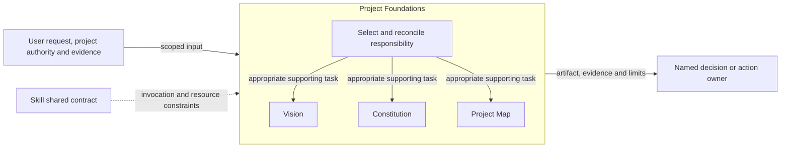
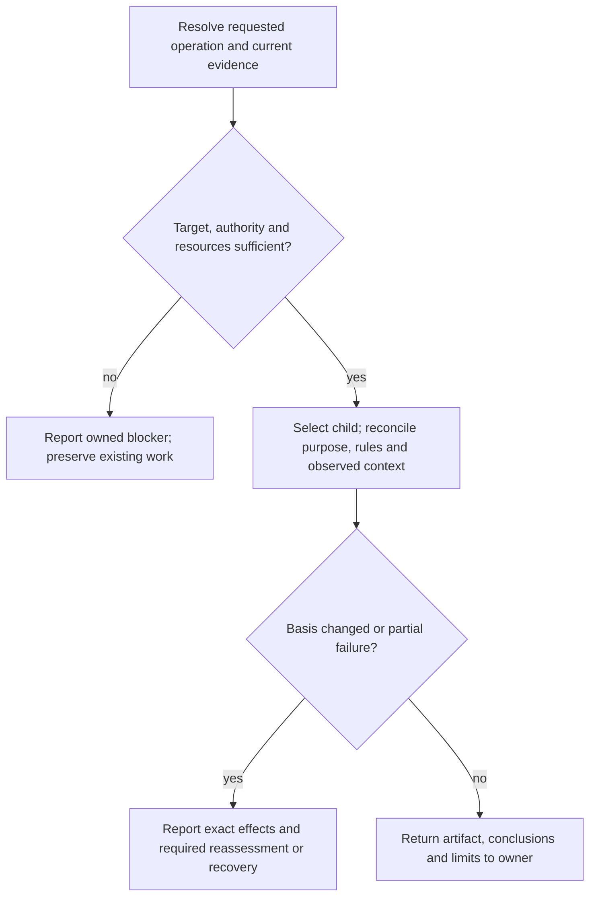

# Project Foundations Design

Model validation contract: model-document-v1

## Responsibility and scope

Project Foundations composes project purpose, governing principles and observed repository orientation. It owns their consistency and handoff relationships; its children own their specialist artifacts.

Parent: [Skill](../skill.md). [Skill](../skill.md) retains shared invocation, evidence-access, resource and portability rules. [Workflow](../workflow.md) coordinates authorized activity; [Assessment](../assessment.md) owns independent judgment and reliance. This decomposition changes no public invocation, stored format or external permission.

## Requirements

| ID | Required behavior |
| --- | --- |
| FOUND-SR-01 | Project Foundations MUST assign purpose/positioning to Vision, governing principles to Constitution and observed orientation to Project Map without duplicating their detailed contracts. |
| FOUND-SR-02 | Cross-child inconsistencies MUST be exposed and returned to the appropriate authority; an observed map MUST NOT silently redefine direction, governance or future architecture. |
| FOUND-SR-03 | Each child invocation MUST retain its scoped write, evidence, retry and artifact-placement boundaries; composition MUST NOT create a mandatory sequence or new governance adoption. |

## Architecture Overview

The overview identifies the owned responsibility and external authority/evidence boundaries. Detailed behavior is in the contract sections below; output does not imply adoption or approval.

| View | Necessity and reason | Owning detail |
| --- | --- | --- |
| Context | No separate diagram: the overview and responsibility scope identify the request, shared contract and receiving owner without an additional external system boundary. | Responsibility and scope above. |
| Building Block | No separate diagram: the overview names each child and the inventory delegates its internals. | [Child responsibility inventory](#child-responsibility-inventory). |
| Runtime | Necessary: authority, resource failures and partial or blocked outcomes must remain distinct from successful handoff. | [Runtime view](#runtime-view). |
| Deployment | No separate diagram: this is published guidance, not a separately deployed service. Artifact placement is governed by the specialist and project contracts. | [Skill Deployment](../skill.md#deployment-view). |

## Child responsibility inventory

| Child | Owned behavior |
| --- | --- |
| [Vision](vision.md) | Canonical purpose and positioning with derived README synchronization. |
| [Constitution](constitution.md) | Reviewable governing engineering principles. |
| [Project Map](project-map.md) | Observed repository orientation and root/area consistency. |

## Specialist contract

Vision expresses intended identity and outcomes; Constitution expresses governing principles; Project Map expresses inspected current structure and bounded inference. These are complementary subjects, not interchangeable authority. Read only the children relevant to the requested change. A new vision does not prove that implementation already conforms; a map finding does not authorize changing either direction or governing rules.

Changes reconcile affected references and assumptions through their existing owners. The decision owner settles material positioning and governance conflicts; actual design or implementation gaps return to Authoring or Implementation under Workflow. Composition introduces no required Vision → Constitution → Map execution pipeline. Preserve existing artifact conventions and the common Skill source/resource boundary.

## Runtime view

The specialist contract determines the permitted action and retry, including read-only or preparation-only operations. A successful artifact write does not grant downstream execution. Reconcile changed basis before dependent work and report partial effects truthfully.

### Boundary scan and acceptance scenarios

| Dimension | Requirement basis | Distinct outcome to demonstrate |
| --- | --- | --- |
| Input domain | FOUND-SR-01, FOUND-SR-02, FOUND-SR-03 | A request selects purpose, governing principles or observed orientation according to its intended output. |
| State/lifecycle | FOUND-SR-01, FOUND-SR-02, FOUND-SR-03 | An orientation update does not mutate project direction or workflow progress. |
| Identity/authority | FOUND-SR-01, FOUND-SR-02, FOUND-SR-03 | Changing principles or positioning requires the relevant owner’s authority. |
| Composition/path | FOUND-SR-01, FOUND-SR-02, FOUND-SR-03 | An observed architecture inconsistency is routed to its Design owner instead of rewriting the map as future truth. |
| Temporal/retry | FOUND-SR-01, FOUND-SR-02, FOUND-SR-03 | A changed vision or governance basis triggers reassessment of affected consumers. |
| Failure/recovery | FOUND-SR-01, FOUND-SR-02, FOUND-SR-03 | A partial child update reports exact effects without treating the entire foundation as synchronized. |
| Compatibility/migration | FOUND-SR-01, FOUND-SR-02, FOUND-SR-03 | Existing artifact conventions and historical evidence retain their original authority. |
| External/environment | FOUND-SR-01, FOUND-SR-02, FOUND-SR-03 | Missing repository evidence limits orientation; installation does not establish customer governance. |

### Test design

Apply [System's selection and proof rules](../../test-design/rules.md#select-requirements-and-proof). All three requirements concern composition: a child's locally correct artifact can still be consumed under the wrong authority or presented as a synchronized foundation. Use independent walkthroughs of the request, source evidence, proposed child result and receiving owner's decision. [Vision](vision.md#test-design), [Constitution](constitution.md#test-design) and [Project Map](project-map.md#test-design) own their detailed operations and failure cases; the following groups add cross-child observations.

| Behavior group and requirement basis | Concrete fixture and faulty candidate | Action and independently expected observation |
| --- | --- | --- |
| Responsibility and inconsistent evidence — FOUND-SR-01, FOUND-SR-02 | A vision commits to offline operation, governance requires owner approval for network access, and inspected source invokes a network service. The compliant map identifies the observed call and conflict; the faulty candidate silently changes the vision to describe an online service. | Review the proposed map refresh and handoff against those three supplied facts. Accept the observed inconsistency and route the behavior gap to Design and any direction change to its owner. Reject rewriting direction or governance, treating implementation as authority, or calling the repository conformant merely because each artifact parses. |
| Scope and adoption — FOUND-SR-01, FOUND-SR-03 | A project using AGENTS-only governance requests a read-only area-map audit and has no request to establish a vision or Constitution. The faulty candidate creates both artifacts and schedules their mandatory sequential completion. | Trace the selected child, loaded resources and proposed effects. The audit remains read-only and reports its evidence limits; the existing governance convention and workflow state remain unchanged. Neither artifact availability nor installed skills establishes adoption or a compulsory child sequence. |
| Changed basis and partial completion — FOUND-SR-02, FOUND-SR-03 | An authorized vision revision commits its source but derived README synchronization fails; the existing map still cites the old basis. Contrast an explicit partial handoff with a candidate calling the whole foundation synchronized. | Inspect the exact committed/pending account and receiving owner's reliance. Require the pending README and affected map assumptions to remain visible for reassessment under their own owners. Do not report child success as completion of all consumers, overwrite the map during a vision-only task, or retry with a different manifest. |

Each walkthrough uses a fresh synthetic project packet with fixed source excerpts, explicit authorization and independent before/after artifact identities. Copies of the compliant packet supply the faulty candidate; no prior walkthrough state is reused. Unavailable source evidence is a named variant of the first group: report the limitation rather than inventing the observed relationship. Historical references retain their original meaning and do not grant present execution authority.

Realization is proposed independent review of these composed decisions. The children's linked executable suites protect bounded structure and resource declarations; none establishes this parent's conflict resolution, synchronization or adoption claims. The [Skill parent composition procedure](../test-design/cases/capability-composition.json) additionally owns consumption by other capabilities. Delivery must allocate concrete review packets and exact-subject evidence; these descriptions are not performed assessments. The existing overview and runtime view remain sufficient because the tests expose existing responsibility and handoff boundaries without adding an execution component.

## Architecture Decisions

| ID | Decision and rationale | Alternatives and consequences |
| --- | --- | --- |
| FOUND-DEC-01 | Give Project Foundations one explicit current owner while retaining shared Skill policy and the specialist’s existing authority boundaries. | Keeping unrelated support duties together obscures responsibility. Duplicating their details in Skill would create competing owners; scoped extraction requires reconciled navigation and review. |

## Quality and limits

Review outcomes against actual inputs, authority and observable effects; structural checks alone do not establish adequacy. Preserve historical subjects, existing public vocabulary and required resource behavior. Unresolved material authority or evidence gaps stop dependent claims rather than inventing a successful outcome.
