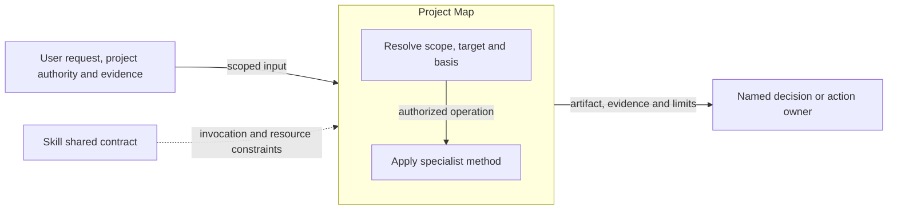
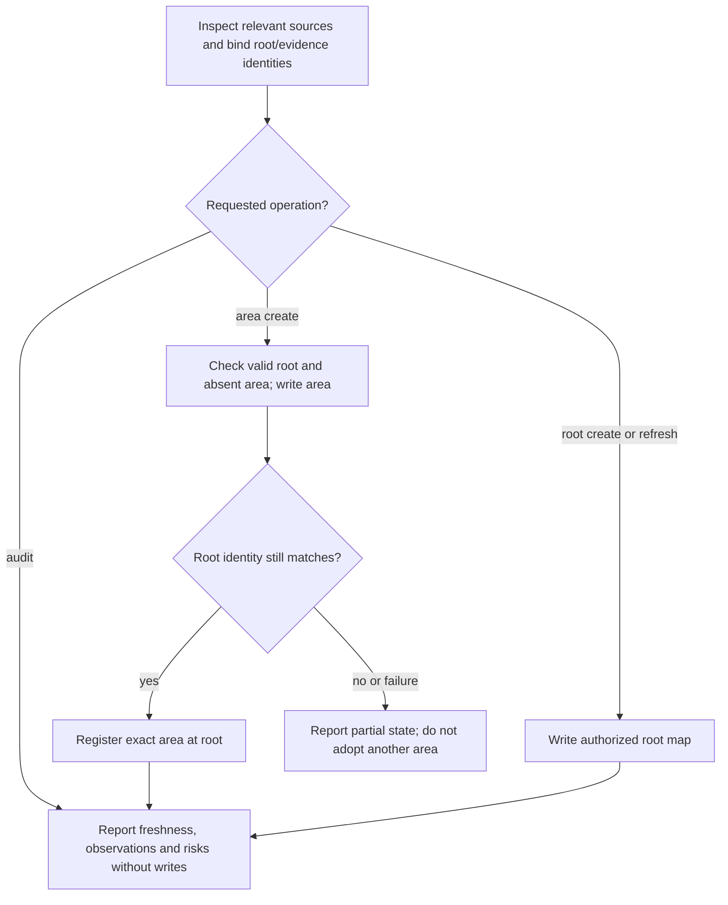

# Project Map Design

Model validation contract: model-document-v1

## Responsibility and scope

Project Map owns the existing `project-map` capability’s scoped behavior, output and failure boundaries. Its detailed procedure below preserves the current specialist contract.

Parent: [Project Foundations](project-foundations.md). [Skill](../skill.md) retains shared invocation, evidence-access, resource and portability rules. [Workflow](../workflow.md) coordinates authorized activity; [Assessment](../assessment.md) owns independent judgment and reliance. This decomposition changes no public invocation, stored format or external permission.

## Requirements

| ID | Required behavior |
| --- | --- |
| MAP-SR-01 | Project Map MUST distinguish observed structure, bounded inference and unknowns, and MUST report freshness against inspected evidence rather than invent future architecture or backlog. |
| MAP-SR-02 | Create, refresh and read-only audit MUST preserve exact target, root/area and authority boundaries; audit MUST NOT repair artifacts. |
| MAP-SR-03 | Area registration and retry MUST remain identity-bound and preserve unrelated maps; partial or stale evidence MUST limit reliance and route risks to their action owner. |

## Architecture Overview

The overview identifies the owned responsibility and external authority/evidence boundaries. Detailed behavior is in the contract sections below; output does not imply adoption or approval.

| View | Necessity and reason | Owning detail |
| --- | --- | --- |
| Context | No separate diagram: the overview and responsibility scope identify the request, shared contract and receiving owner without an additional external system boundary. | Responsibility and scope above. |
| Building Block | No separate diagram: classification and the specialist operation form one method; no separate internal subsystem is selected. | [Specialist contract](#specialist-contract). |
| Runtime | Necessary: authority, resource failures and partial or blocked outcomes must remain distinct from successful handoff. | [Runtime view](#runtime-view). |
| Deployment | No separate diagram: this is published guidance, not a separately deployed service. Artifact placement is governed by the specialist and project contracts. | [Skill Deployment](../skill.md#deployment-view). |

## Specialist contract

Project Map owns observed orientation, with evidence paths, baseline limits and separate observations/inferences; it is neither future design nor backlog. Resolve `create`, `refresh` or read-only `audit` independently from repository/area scope. Absent, stale or contradicted maps require source inspection and a stated limitation before reliance. Use the mapped structural asset and load maintenance/coordination guidance for every refresh, audit, area map or known root/area relationship, including late discoveries. Area creation needs a valid existing root and absent area/registration, binds root and evidence identities, writes the area first, rechecks root and then registers it. Validate reciprocal identities; partial retry completes only the exact missing registration, never adopts an unrelated area. Changed/ambiguous roots or overlaps stop; audit cannot repair. Existing artifacts remain readable without automatic rewriting. Route actionable risks to their action owner under Workflow rather than creating execution commitments in the map.

## Interface vocabulary and outputs

The following public domains retain their existing meanings. Unknown values reject before consistency checks; recognized values still require the operation’s authority and prerequisites.

| Capability / independent axis | Supported values |
| --- | --- |
| Project Map freshness / invocation result | current, partial, stale / created, updated, audited, blocked |
| Project Map evidence / next owner | observed, inferred, unknown / explore, proposal, design, route, none |
| Project Map assembly | PMA0-simple-root-create, PMA1-maintenance-or-coordinated |

Project Map reports operation, repository or area:<slug> scope, changed artifacts, freshness, correction note, blockers and next owner. Current means relevant cited surfaces were inspected with no known material gap; partial states bounded scope or unavailable important evidence; stale means a relied-on surface materially changed.

## Runtime view

The specialist contract determines the permitted action and retry, including read-only or preparation-only operations. A successful artifact write does not grant downstream execution. Reconcile changed basis before dependent work and report partial effects truthfully.

### Boundary scan and acceptance scenarios

| Dimension | Requirement basis | Distinct outcome to demonstrate |
| --- | --- | --- |
| Input domain | MAP-SR-01, MAP-SR-02, MAP-SR-03 | Create, refresh and audit distinguish target existence and read-only behavior. |
| State/lifecycle | MAP-SR-01, MAP-SR-02, MAP-SR-03 | An audit leaves map and registration bytes unchanged. |
| Identity/authority | MAP-SR-01, MAP-SR-02, MAP-SR-03 | Area creation requires a valid current root and absent area/registration. |
| Composition/path | MAP-SR-01, MAP-SR-02, MAP-SR-03 | Observed and inferred relationships remain distinguishable in root/area composition. |
| Temporal/retry | MAP-SR-01, MAP-SR-02, MAP-SR-03 | Matching partial retry adds only the missing registration; changed roots stop. |
| Failure/recovery | MAP-SR-01, MAP-SR-02, MAP-SR-03 | Area-write success with root-registration failure is reported as partial, without adopting another area. |
| Compatibility/migration | MAP-SR-01, MAP-SR-02, MAP-SR-03 | Existing maps remain readable without automatic rewriting or reconstructed workflow state. |
| External/environment | MAP-SR-01, MAP-SR-02, MAP-SR-03 | Unavailable important evidence produces partial/stale limits rather than a current-map claim. |

## Architecture Decisions

| ID | Decision and rationale | Alternatives and consequences |
| --- | --- | --- |
| MAP-DEC-01 | Give Project Map one explicit current owner while retaining shared Skill policy and the specialist’s existing authority boundaries. | Keeping unrelated support duties together obscures responsibility. Duplicating their details in Skill would create competing owners; scoped extraction requires reconciled navigation and review. |

## Quality and limits

Review outcomes against actual inputs, authority and observable effects; structural checks alone do not establish adequacy. Preserve historical subjects, existing public vocabulary and required resource behavior. Unresolved material authority or evidence gaps stop dependent claims rather than inventing a successful outcome.
